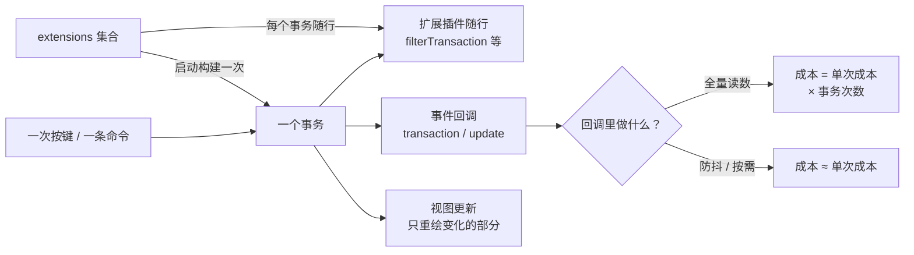

import { Canvas, Controls, Meta } from '@storybook/addon-docs/blocks';
import * as PerformanceStories from './performance.stories';

<Meta of={PerformanceStories} name="Docs" />

# 性能

Tiptap 的内核对大文档和高频编辑本身是快的——官方性能指南开篇就是这个判断（"Tiptap is a very performant editor"，快到能编辑整本书）。编辑器变卡，几乎都卡在集成层：把本该偶尔执行的活儿放进了热路径。性能工作的主线是分清三类计费方式——**事务路径**的活儿按事务次数付费（每个按键一次），**全量读数**按调用次数付费、单价随文档规模增长，**扩展集合**在启动时一次付费、之后每个事务随行一次。React 集成还有第四类成本（组件重渲染），本课只给定位入口，细节见 React 集成课。

看完开场图和参考表，你应该能预测下面实例的读数：把全量 `getJSON()` 挂在每次 update 回调上、文档有几百段时，点「模拟连续输入」会让「回调累计耗时」把「整批输入耗时」拖慢一个数量级；切成防抖后，「实际读数次数」只剩 1，耗时回落到「不读数」档。



| 成本类型 | 计费频率 | 典型来源 | 第一处理动作 |
| --- | --- | --- | --- |
| 事务路径 | 每次事务（每个按键一次） | `update` / `transaction` 回调、扩展插件的钩子、带 limit 的 CharacterCount | 回调防抖、合并事务 |
| 全量读数 | 每次调用，单价随文档规模增长 | `getJSON()` / `getHTML()` / `getText()`、`doc.descendants()`、`doc.textBetween()` | 按需读数、缓存结果 |
| 启动构建 | 创建编辑器一次 | `extensions` 集合：schema、插件、输入规则、快捷键 | 裁剪用不到的扩展 |
| 框架重渲染（React） | 每次组件重渲染 | `useEditor` 默认随每次编辑器变化重渲染 | 见官方指南与 React 集成课 |

## 更新频率

[事件课](?path=/docs/events--docs)讲过事件从哪来；性能视角只需要记住触发条件的差异。每个按键、每条命令都是一个事务，事务是所有随行成本的计费单位。三类事件的触发条件不同（v3 源码核对）：

- `transaction`：每次事务都触发，无论是否改了文档；
- `update`：只在文档内容真正变化时触发（事务携带 docChanged 且前后文档确实不同）——移动光标、纯选区变化不触发；
- `selectionUpdate`：选区变化时触发，光标移动走这里。

判断很直接：**持久化、统计这类「文档变了才要做」的钩子挂 `update`**。挂在 `transaction` 上，光标每动一下都会白跑一次。回调里最忌讳的是全量读数——大文档里 `getJSON()` 要走完整棵树，放进 update 回调后，成本就变成「单次成本 × 按键次数」：

```ts
// 反例：每次 update 都全量读数，大文档里会把输入拖慢一个数量级
editor.on('update', () => save(editor.getJSON()));

// 正确做法：防抖——一批输入结束后只读一次
let timer: number | undefined;
editor.on('update', () => {
  window.clearTimeout(timer);
  timer = window.setTimeout(() => save(editor.getJSON()), 500);
});
```

下面的实例用程序化插入模拟连续按键（每个字符一个事务），对比三种 update 回调处理的读数。

<Canvas of={PerformanceStories.UpdateCallback} />
<Controls of={PerformanceStories.UpdateCallback} />

| 读者操作 | 可观察证据 |
| --- | --- |
| 保持「每次 update 全量 getJSON」，点「模拟连续输入」 | update 事件次数 = 输入次数；回调累计耗时把整批输入拖慢一个数量级 |
| 切换「回调模式」为防抖后再点 | 实际读数次数降为 1，整批耗时接近「不读数」档 |
| 切换为「不读数」后再点 | 回调累计耗时约等于 0——剩下的整批耗时就是纯事务路径的成本 |
| 增大「输入次数」 | 两种模式的耗时差距按比例放大——成本随事务次数线性增长 |
| 打开 Show code | 看到该 Canvas 实际执行的 `update-callback.ts` |

程序化批量修改是同一件事的另一半：多条命令直接调用就是多个事务、多次 update（见[命令课](?path=/docs/commands--docs)的命令链实例），用 `chain()` 合并成一个事务；内部整理类修改不想要 update 时传 `{ emitUpdate: false }`。扩展同样会在事务路径上跑代码——`filterTransaction`、`appendTransaction` 每个事务都执行，装了几个扩展就跑几遍，下面的扩展裁剪和文末常见问题都会回到这一点。

## 大文档

打字为什么在大文档里依然流畅？ProseMirror 指南给出两层机制：视图同时持有新旧两份文档，更新时**保持与未变化节点对应的 DOM 部分不动**，纯打字甚至不需要任何 DOM 变化；文档是持久化数据结构，新文档与旧文档**共享未变化的子节点**，生成新文档相对便宜。所以「文档很大」本身不是问题——贵的是**把整棵文档读出来**的操作，它们的单价随规模增长：

| 操作 | 做什么 | 成本随规模 |
| --- | --- | --- |
| `getJSON()` | 整棵树转 JSON | 节点数线性 |
| `getHTML()` | 整棵树序列化成 HTML | 节点数线性 |
| `getText()` | 整棵树提取纯文本 | 文本量线性 |
| `doc.descendants()` | 遍历全部节点 | 节点数线性 |
| `doc.textBetween(0, size)` | 提取全文（字数统计的底层） | 文本量线性 |
| `content` / `setContent` | 解析整份内容 | 创建 / 调用时一次 |

下面的实例把五类全量操作放到 200 / 800 / 1600 段三档文档上测量（每项预热 1 次后测 7 次取中位数）。

<Canvas of={PerformanceStories.DocScale} />
<Controls of={PerformanceStories.DocScale} />

| 读者操作 | 可观察证据 |
| --- | --- |
| 切换「文档规模」 | 段落数、字符数变化；五项耗时随规模同步上涨 |
| 对比同一操作在 200 段与 1600 段的耗时 | 差距约等于规模的倍数（1600 段约为 200 段的 8 倍）——成本近似线性 |
| 打开 Show code | 看到该 Canvas 实际执行的 `doc-scale.ts` |

全量读数本身不是错误——保存时、用户点击时调用完全合理，问题只在高频调用（每次按键）。大文档的策略按顺序尝试：防抖后读；只读需要的部分（对某个节点调 `textBetween` / `descendants`，而不是从 doc 根开始）；结果能复用就缓存。初始化大文档时解析一次 `content` 也属于全量付费，创建慢一拍是正常现象；协作场景下文档树由 Yjs 维护，处理方式见[协作入门课](?path=/docs/collaboration--docs)。

## 扩展裁剪

每个扩展往编辑器里加四类东西，其中两类是性能成本：

| 扩展提供 | 何时产生成本 | 例子 |
| --- | --- | --- |
| schema 节点与标记 | 启动构建 schema；解析 / 序列化按规则执行 | Heading、Table |
| ProseMirror 插件 | 钩子随每个事务执行 | UndoRedo、Dropcursor、TrailingNode |
| 输入规则 | 每次按键做模式匹配 | Typography |
| 快捷键与命令 | 按键时查表；命令仅在调用时执行 | ListKeymap、toggleBold |

[StarterKit](https://tiptap.dev/docs/editor/extensions/functionality/starterkit) 一次装入 22 个扩展（v3.31 源码核对：Blockquote、Bold、BulletList、Code、CodeBlock、Document、Dropcursor、Gapcursor、HardBreak、Heading、HorizontalRule、Italic、Link、ListItem、ListKeymap、OrderedList、Paragraph、Strike、Text、Underline、TrailingNode、UndoRedo），产品里往往有一半用不上。裁剪有两种写法：

```ts
// 写法一：在 StarterKit 上关闭用不到的成员
const extensions = [
  StarterKit.configure({
    codeBlock: false,
    underline: false,
    trailingNode: false,
  }),
];

// 写法二：不用 StarterKit，按需逐个引入
const extensions = [Document, Paragraph, Text, Bold, Heading];
```

下面的实例对比三档扩展集合的随行规模与创建耗时（计时创建进独立宿主、预热 1 次后测 7 次取中位数；绝对值因机器而异，看三档的相对差）。

<Canvas of={PerformanceStories.ExtensionTrimming} />
<Controls of={PerformanceStories.ExtensionTrimming} />

| 读者操作 | 可观察证据 |
| --- | --- |
| 切换「扩展预设」 | 扩展数、插件数、节点 / 标记类型、创建耗时中位数同步变化 |
| 对比 StarterKit 全量与最小四件 | 全量档插件更多、schema 更大、创建耗时更高 |
| 打开 Show code | 看到该 Canvas 实际执行的 `extension-trimming.ts` |

裁掉的扩展同时裁掉功能——输入规则、快捷键、命令都会消失，按产品实际需要取舍。第三方扩展同样有随行成本，评估时看它注册的插件与 schema 成员数量（扩展的构成见[Extension 体系课](?path=/docs/extension-system--docs)）。

## 定位性能问题

卡顿定位按三步走，本课三个实例用的就是同一套方法：

1. **锁定操作**：复现卡顿对应的用户动作——打字、移动光标，还是执行某条命令；
2. **计数**：怀疑某段代码跑多了，先数次数——在嫌疑回调里加 `console.count('update')`，或像实例一样监听事件计数；
3. **计时**：用 `performance.now()` 包住嫌疑代码，看「单次成本 × 被调用次数」哪一项在膨胀。

```ts
const start = performance.now();
heavyOperation();
const cost = performance.now() - start; // 单次成本；乘以每秒调用次数才是真实负担
```

React 集成是独立的第四类成本源。官方性能指南把问题归于集成层：`useEditor` 默认随每次编辑器变化重渲染组件。治理手段按官方指南——把编辑器放进独立组件、隔离无关状态；用 `useEditorState` 按选择器订阅（深比较，变了才重渲染）；`shouldRerenderOnTransaction: false` 关闭每事务重渲染；在 Tiptap 回调里直接 setState 会撞上 React 渲染周期报 flushSync 警告，用 `queueMicrotask` 包裹。细节见[React 集成课](?path=/docs/react--docs)。

两个扩展层的经典热点，定位思路相同：**Node View** 的每个节点实例都是一次自管 DOM / 组件挂载，长文档配上大量实例会成为热点（见[Node View 课](?path=/docs/node-views--docs)）；**装饰器插件**在每次事务里重建全量 DecorationSet 是常见反模式，ProseMirror 指南明确建议把集合放进插件状态、随事务 map、只在需要时修改（见[Decorations 与插件课](?path=/docs/decorations-plugins--docs)）。

## 最佳实践

- **持久化、统计、上报回调一律防抖**：几百毫秒的延迟换一个数量级的耗时差；读数放在防抖回调里，而不是事件回调里。
- **持久化钩子挂 `update` 不挂 `transaction`**：`update` 只在文档变化时触发，光标移动不会白跑。
- **程序化批量修改用 `chain()`**：一次事务、一次提交、一次 update；内部整理类修改传 `{ emitUpdate: false }`。
- **全量读数按需调用并缓存**：大文档下只读需要的子树，不在每次按键后读整棵文档。
- **从 StarterKit 开始、砍掉用不到的成员**，或按需逐个引入；第三方扩展先评估随行成本再上车。
- **大文档慎用带 limit 的 CharacterCount**：原因与替代做法见常见问题。

## 常见问题

- 长文档打字越来越卡，小文档没事
  先查事务路径上有没有每次事务执行的全量操作——update / transaction 回调里的 `getJSON()` / `getHTML()` / 字数统计，或扩展插件的钩子。按三步法计数、计时定位，再把全量读数防抖或按需化。内核对大文档的编辑路径本身是快的（只重绘变化的部分），慢的几乎总是热路径里的全量操作。
- 只是移动了光标，保存或统计也被触发了
  回调挂在了 `transaction`（或 `selectionUpdate`）上——它们不区分文档是否变化。持久化类钩子改挂 `update`，它只在文档内容变化时触发。
- 一次程序化修改触发了多次 update，保存了多次
  多条命令直接调用就是多个事务。改用 `chain()...run()` 合并成一个事务；整体替换类操作不想要 update 时传 `{ emitUpdate: false }`。
- 装上 CharacterCount 并设置 limit 后，大文档里输入明显变卡
  设置 limit 后，CharacterCount 的 `filterTransaction` 会在每次文档变化的事务里对旧、新文档各做一次全文遍历（v3 源码核对），成本等于全文提取单价乘以事务次数。大文档要么去掉 limit，要么自己按防抖节奏读 `editor.storage.characterCount.characters()` 做软限制。
- React 里每敲一个字整个组件都重渲染
  `useEditor` 默认随每次编辑器变化重渲染。按官方指南处理：编辑器放进独立组件隔离无关状态；用 `useEditorState` 只订阅需要的状态；或设 `shouldRerenderOnTransaction: false`。细节见 React 集成课。

## 总结回顾

摘要：

性能问题先分清计费方式。事务是计费单位：`update` 只在文档变化时触发、`transaction` 每个事务都触发，回调里的重活按事务次数付费——更新回调实例用 300 段大文档模拟连续输入，每次 update 全量 getJSON 把整批耗时拖慢一个数量级，防抖后读数只剩 1 次。全量读数按调用次数付费、单价随文档规模增长：`getJSON` / `getHTML` / `getText` / 全文遍历 / 全文取文本都要走完整棵树，而编辑路径本身是快的——视图只重绘变化的部分、持久化结构共享未变子节点——文档规模实例验证了五类读数耗时随段落数近似线性。扩展在启动时构建 schema 与插件一次、之后每个事务随行：StarterKit 默认 22 个扩展，扩展裁剪实例对比了全量、精简、最小三档的扩展数、插件数、schema 规模与创建耗时。定位按三步走：锁定操作、计数、计时；React 重渲染、Node View 挂载与 DecorationSet 重建是另外三个已知热点。

一句话：

> 编辑器卡顿几乎都来自集成层：事务路径的重活要降频（防抖、合并事务），全量读数要按需，扩展集合要裁剪——内核对大文档本身是快的。

知识要点：

- 三类性能成本的计费方式分别是什么？React 集成的第四类成本是什么？
- `update` 与 `transaction` 的触发条件差在哪？持久化钩子应该挂哪个？
- 哪些操作属于全量读数？成本随什么增长？大文档下如何降低这类成本？
- 每个扩展给编辑器加哪四类东西？哪两类是性能成本？StarterKit 如何裁剪？
- 定位性能问题的三步法是什么？
- 带 limit 的 CharacterCount 为什么会拖慢大文档输入？

## 参考资料

- [Integration performance | Tiptap Editor Docs](https://tiptap.dev/docs/guides/performance)
- [React rendering performance demo | Tiptap Editor Docs](https://tiptap.dev/docs/examples/advanced/react-performance)
- [ProseMirror Guide — The editor state 与 The view component（高效更新、持久化结构、装饰集合随事务 map）](https://prosemirror.net/docs/guide/)
- [StarterKit extension | Tiptap Editor Docs](https://tiptap.dev/docs/editor/extensions/functionality/starterkit)
- [CharacterCount extension | Tiptap Editor Docs](https://tiptap.dev/docs/editor/extensions/functionality/character-count)
- [Events | Tiptap Editor Docs](https://tiptap.dev/docs/editor/api/events)
- [dispatchTransaction 的 update 触发条件 | @tiptap/core 源码](https://github.com/ueberdosis/tiptap/blob/main/packages/core/src/Editor.ts)
- [CharacterCount 的 filterTransaction 实现 | @tiptap/extensions 源码](https://github.com/ueberdosis/tiptap/blob/main/packages/extensions/src/character-count/character-count.ts)
