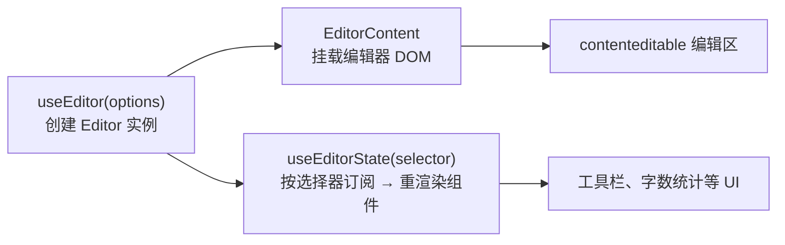

import { Meta } from '@storybook/addon-docs/blocks';

<Meta id="react" title="框架集成与生态/React 集成" name="Docs" />

# React 集成

`@tiptap/react` 把编辑器接进 React 的方式可以压缩成三个动作：**`useEditor` 创建并管理编辑器实例，`EditorContent` 把实例挂载进组件树，`useEditorState` 按选择器订阅编辑器状态**。编辑器实例是一个独立于 React 渲染的可变对象——这个定位推出 v3 最重要的行为差异：**组件默认不随编辑器事务（transaction）重渲染**，需要随编辑状态变化的 UI 必须显式订阅。本课沿这条主线讲清 useEditor 的生命周期与重渲染模型、实例共享（EditorContext 与 `<Tiptap>` Composable API）、SSR 注意点、菜单组件与 React 版 Node View。文中默认值均核对到 `@tiptap/react` 3.31.4（npm latest，与手册其余 `@tiptap/*` 包同版）的官方文档与 GitHub 源码。

说明：本工作区不安装 `@tiptap/react`，本课以源码讲解为主，示例请在读者自己的 React 项目（Vite、Next.js 等）中运行验证。



先记最常回查的默认值：

| API / 选项 | 默认值 | 回查要点 |
| --- | --- | --- |
| `shouldRerenderOnTransaction` | `false` | v3 起组件默认不随事务重渲染；`true` 是 legacy 行为，官方注明未来移除 |
| `immediatelyRender` | `true` | SSR 环境（无 `window`）源码强制按 `false` 处理；Next.js 未显式传入时默认 `false` |
| `useEditorState` 的 `equalityFn` | `deepEqual`（fast-equals） | 选择器结果深度相等时不触发重渲染 |
| `useEditor` 第二参数 `deps` | `[]` | deps 变化会销毁并重建编辑器实例 |
| `NodeViewWrapper` / `NodeViewContent` 标签 | `div`（inline 节点为 `span`） | 分别用 `as` / `contentDOMElementTag` 覆盖 |
| `trackNodeViewPosition` | `false` | 开启后节点位置变化也会重渲染节点视图组件 |

## 快速上手

装齐三个包（包职责与版本约束见[安装课](?path=/docs/install--docs)，`@tiptap/core` 由 peer 依赖自动带入）：

```bash
npm install @tiptap/react @tiptap/pm @tiptap/starter-kit
```

最小组件只有 `useEditor` 与 `EditorContent` 两个成员：

```tsx
import { useEditor, EditorContent } from '@tiptap/react'
import StarterKit from '@tiptap/starter-kit'

export default function TiptapEditor() {
  const editor = useEditor({
    extensions: [StarterKit],
    content: '<p>Hello World!</p>',
  })

  return <EditorContent editor={editor} />
}
```

运行结果是页面上出现一个可输入的编辑器：能打字、换行，StarterKit 的快捷键（如加粗）全部可用。绑定包支持 React 17、18、19（依据 npm 上的 peer 依赖声明）。

注意一个会在下一节解释的现象：如果在这个组件里再加一个按钮，用 `editor.isActive('bold')` 控制高亮，点击后按钮状态**不会**随选区变化刷新——v3 的组件默认不随事务重渲染，读状态的 UI 要用 `useEditorState` 订阅。

## useEditor

`useEditor` 不是"React 版编辑器"，而是用 React 管理一次 `new Editor(...)` 的完整生命周期：首次渲染时创建实例（`immediatelyRender: false` 时推迟到挂载后），options 变化时同步给已有实例，deps 变化时销毁重建，卸载时销毁。实例贯穿组件生命周期、不随普通重渲染重建——所有 React 集成的行为都以此为前提。

返回值在类型上有两个重载，直接对应 SSR 场景：

```ts
// 传 immediatelyRender: false 时，类型即可空（服务端首渲染拿不到实例）
useEditor({ extensions, content, immediatelyRender: false }) // Editor | null
// 不传 immediatelyRender 时，类型为非空
useEditor({ extensions, content }) // Editor
```

运行时对应关系：`immediatelyRender: true`（浏览器默认）首次渲染就创建实例并返回；`false` 时首次渲染返回 `null`，编辑器推迟到挂载后创建，随后触发一次重渲染把实例交给组件。所以延迟创建的组件要写 `if (!editor) return null`（见 SSR 一节）。

### 重渲染模型

**v3 的默认契约：`useEditor` 所在组件不随事务重渲染。** 编辑器内部的内容推进（输入、选区、命令）由 ProseMirror 高效处理，不再逐次唤醒 React。选项的源码定义（`packages/react/src/useEditor.ts`）：

```ts
/**
 * Whether to re-render the editor on each transaction.
 * This is legacy behavior that will be removed in future versions.
 * @default false
 */
shouldRerenderOnTransaction?: boolean
```

实现上，`useEditor` 内部用 `useEditorState` 做了一次"空订阅"：`shouldRerenderOnTransaction` 为 `false` 或未传时，选择器直接返回 `null`，组件不订阅任何编辑器状态。于是有一个直接后果——`editor.state`、`editor.isActive(...)`、`editor.can()` 这类读数写在组件渲染路径里是"拍照式"的：本次渲染读到什么就是什么，之后输入推进不会刷新它们。

官方 React 性能指南把"编辑器重渲染过于频繁"列为 React 集成最常见的性能问题，`shouldRerenderOnTransaction: true` 只建议用于小型原型；恢复该行为时整个组件（含子树）会在每次输入后重渲染。

### useEditorState：订阅编辑器状态

需要随编辑状态变化的 UI（工具栏高亮、字数统计、只读指示），保持默认模型，然后用 `useEditorState` 做局部订阅：

```tsx
import { useEditorState } from '@tiptap/react'

const editorState = useEditorState({
  editor,
  selector: ({ editor }) => {
    if (!editor) return null
    return {
      isBold: editor.isActive('bold'),
      canUndo: editor.can().undo(),
    }
  },
})
```

机制要点：

- **订阅粒度由选择器决定。** 选择器在每次事务后都会执行，但只有返回结果变化时组件才重渲染；相等性判断默认用 fast-equals 的 `deepEqual`，可用 `equalityFn` 覆盖。返回一个扁平小对象是推荐写法。
- **快照结构是 `{ editor, transactionNumber }`**（`EditorStateSnapshot`），选择器拿到的 `editor` 可能为 `null`（SSR 或延迟创建期间），必须处理。
- 订阅独立于 `useEditor` 所在组件：可以只在工具栏组件里调用 `useEditorState`，让编辑器组件本身保持零重渲染。

### options 同步与 deps 重建

`useEditor(options, deps)` 的两个参数对应两种"变化处理"：

- **options 变化 → 同步，不重建。** 每次渲染后源码会比较新旧 options：事件回调不参与比较（总是用最新一份）、`extensions` 数组按元素引用逐位比较、其余选项用严格不等比较；有差异就调用 `editor.setOptions(...)` 应用。因此把 extensions 数组、回调写成内联是安全的，只要数组**元素**在渲染间保持同一引用（模块级常量、`StarterKit` 这类都满足）。
- **deps 变化 → 销毁重建。** 第二参数是 React `DependencyList`（默认 `[]`），任何一项变化都会 `destroy()` 旧实例并 `new Editor(...)`。适合"切换文档时重置编辑器"这类需求；把每次渲染都生成新引用的值放进 deps 会导致编辑器不断重建。

卸载销毁同样有讲究：源码在卸载后延迟一拍才销毁实例，若组件在下一拍仍在挂载状态（React 18 StrictMode 开发模式的"挂载 → 卸载 → 再挂载"）则复用实例。自己手写 `new Editor` 的组件没有这层保护，需要在 `useEffect` 清理函数里自行 `destroy()`。

## EditorContent

`EditorContent` 是编辑器实例在组件树里的挂载点：它渲染一个 `div`，把 `editor.view.dom`（contenteditable 区域）接进来。

```tsx
<EditorContent editor={editor} className="my-editor" />
```

回查要点：

| 项 | 说明 |
| --- | --- |
| `editor` | 接受 `Editor \| null`，SSR 延迟创建期间传 `null` 是合法的 |
| `ref` / `innerRef` | 转发到包裹 `div`（源码经 `forwardRef` 处理） |
| 其余属性 | 按 HTML 属性落到包裹 `div` 上（`className`、`style` 等） |
| 实例变化 | 源码以编辑器实例生成 key，实例更换时整个挂载组件重建 |
| 卸载行为 | 把编辑器 DOM 摘回一个离屏 `div`，**不销毁实例**——销毁由 `useEditor` 的生命周期负责 |

`EditorContent` 内部还渲染一个 Portals 容器：所有 React Node View 的组件都通过它进入 React 树。这是 React Node View 一节能成立的前提。

## 上下文与 Composable API

深层组件（菜单项、字数统计、侧栏）都要拿到 editor 时，逐层传 props 会很快失控。`@tiptap/react` 提供两条 Context 路线，解决同一个问题。

### EditorContext 与 EditorProvider

早期接口，v3 仍在维护：

```tsx
import { EditorProvider, useCurrentEditor } from '@tiptap/react'
import StarterKit from '@tiptap/starter-kit'

// EditorProvider 内部调用 useEditor，并自动挂 Provider 与 EditorContent
export default function App() {
  return (
    <EditorProvider extensions={[StarterKit]} content="<p>Hello World!</p>">
      <MenuBar />
    </EditorProvider>
  )
}

function MenuBar() {
  const { editor } = useCurrentEditor()
  if (!editor) return null
  return <button onClick={() => editor.chain().focus().toggleBold().run()}>粗体</button>
}
```

- `EditorProvider` 的 props 就是 `useEditor` 的全部选项，外加 `slotBefore`、`slotAfter`、`editorContainerProps`；编辑器尚未创建时（SSR 首渲染）它返回 `null`。
- `useCurrentEditor()` 从 Context 读出 `{ editor }`；配套的 `EditorConsumer` 也可用。
- 后面的 `BubbleMenu` / `FloatingMenu` 不传 `editor` prop 时，就是从这个 Context 回落取实例的。

### Tiptap 组件与 useTiptap

v3 新增的 Composable API，把 Provider 做成一个可组合的 `<Tiptap>` 组件：

```tsx
import { Tiptap, useEditor } from '@tiptap/react'
import { BubbleMenu } from '@tiptap/react/menus'
import StarterKit from '@tiptap/starter-kit'

function App() {
  const editor = useEditor({
    extensions: [StarterKit],
    content: '<p>Hello World!</p>',
  })

  return (
    <Tiptap editor={editor}>
      <Toolbar />
      <Tiptap.Content />
      <BubbleMenu>选中即出现的菜单</BubbleMenu>
    </Tiptap>
  )
}
```

| 成员 | 职责 |
| --- | --- |
| `<Tiptap editor={...}>` | Provider；context 值自动 memo，内部同时提供新旧两个 Context（`useCurrentEditor` 照常工作） |
| `<Tiptap.Content />` | 等价于从 Context 取 editor 的 `<EditorContent />`，不用再手动传 |
| `useTiptap()` | 读出 `{ editor }`；在 Provider 外使用会直接抛错 |
| `useTiptapState(selector, equalityFn?)` | `useEditorState` 的 Context 版，不用手动传 `editor` |

两条路线的选择：组件少的小页面直接传 props 就够；工具栏、菜单、侧栏多个组件访问编辑器时用 `<Tiptap>`；需要在 SSR 的 null 期稳定渲染整个子树时用 `EditorProvider`——`<Tiptap>` 的 `editor` prop 类型是非空 `Editor`，传入 `null` 会直接抛错（源码行为），而 `EditorProvider` 在实例就绪前渲染 `null`。

## SSR 与 immediatelyRender

SSR 的所有注意点源于一个事实：编辑器依赖浏览器 DOM，服务端创建不了。`immediatelyRender` 控制首次渲染是否立刻创建实例，源码里是三个分支：

1. **浏览器默认 `true`**——首次渲染即创建，`EditorContent` 立即可挂载。
2. **`window === undefined`（真 SSR 环境）**——无论传什么，源码强制按 `false` 处理，开发模式会警告 hydration mismatch 风险。
3. **Next.js（探测到 `window.next`）且未显式传入**——默认 `false`，开发模式提示显式传参。

因此在 SSR 项目里应显式写全官方推荐的形态：

```tsx
import { useEditor, EditorContent } from '@tiptap/react'
import StarterKit from '@tiptap/starter-kit'

export default function TiptapEditor() {
  const editor = useEditor({
    extensions: [StarterKit],
    content: '<p>Hello World!</p>',
    immediatelyRender: false,
  })

  // 首次渲染（服务端与客户端水合前）editor 为 null
  if (!editor) return null

  return <EditorContent editor={editor} />
}
```

配套要点：

- **null 期可以渲染骨架屏**，`editor` 为 `null` 时传给 `EditorContent` 也安全（类型就是 `Editor | null`）；`useEditorState` 的服务端快照固定为 `{ editor: null, transactionNumber: 0 }`，选择器里的 `if (!editor) return null` 分支就是为它准备的。
- **类型会逼你写对**：传 `immediatelyRender: false` 后 `useEditor` 的返回类型是 `Editor | null`，不做判空无法通过类型检查。
- Next.js App Router 下编辑器组件应是客户端组件；`@tiptap/react` 的源码文件自带 `'use client'` 指令，但调用 `useEditor` 的组件自身通常也需要标明。

## BubbleMenu 与 FloatingMenu

v3 中两个菜单从子路径导入（官方把 floating-ui 依赖隔离在子路径里，主入口保持轻量）：

```tsx
import { BubbleMenu, FloatingMenu } from '@tiptap/react/menus'
```

它们是对同名扩展插件的 React 包装：children 即菜单内容，组件负责把菜单 DOM 用 Portal 渲染到光标/选区附近。

```tsx
<BubbleMenu editor={editor}>
  <button onClick={() => editor.chain().focus().toggleBold().run()}>粗体</button>
</BubbleMenu>

<FloatingMenu editor={editor}>
  <button onClick={() => editor.chain().focus().toggleHeading({ level: 1 }).run()}>H1</button>
</FloatingMenu>
```

关键 props（以 `BubbleMenu` 为例，源码 `packages/react/src/menus/BubbleMenu.tsx`）：

| prop | 说明 |
| --- | --- |
| `editor` | 可省略——未传时回落到 `useCurrentEditor()`（源码 `editor \|\| currentEditor`）；既没包 Provider 又没传时菜单不会工作 |
| `shouldShow` | 显示条件回调；判定细节与默认行为见[菜单一课](?path=/docs/menus--docs) |
| `options` | 透传给 floating-ui 的定位配置 |
| `pluginKey` | 同一编辑器挂多个菜单时必须各自唯一 |
| `updateDelay` / `resizeDelay` / `appendTo` | 菜单更新节奏与挂载容器，语义与底层扩展一致 |

`BubbleMenu` 跟随文本选区出现，`FloatingMenu` 在空节点（如空段落）处出现；显示条件、定位策略与命令搭配的完整讲解在菜单一课，本课只需记住 React 版的差别：**组件化的注册方式 + editor 可从 Context 回落**。

## React Node View

原生 Node View（自管 DOM、生命周期钩子、事件拦截）在[Node View 与 Mark View 课](?path=/docs/node-views--docs)讲过。React 版解决的是另一个诉求：**把某个文档节点的渲染整体交给 React 组件**，让节点 UI 也能用组件化方式写。它仍遵守同一套 node view 协议（`dom` / `contentDOM`、选中态、拖拽），只是实现由 `@tiptap/react` 代劳。

写法是固定的五步：定义 Node 扩展 → 写 React 组件 → 用 `ReactNodeViewRenderer(Component)` 包进 `addNodeView()` → 组件根元素用 `NodeViewWrapper` → 把扩展注册进编辑器：

```ts
import { Node, mergeAttributes } from '@tiptap/core'
import { ReactNodeViewRenderer } from '@tiptap/react'
import CounterView from './CounterView'

export const Counter = Node.create({
  name: 'counter',
  group: 'block',
  atom: true,

  addAttributes() {
    return { count: { default: 0 } }
  },

  parseHTML() {
    return [{ tag: 'data-counter' }]
  },

  renderHTML({ HTMLAttributes }) {
    return ['data-counter', mergeAttributes(HTMLAttributes)]
  },

  // 该节点的渲染交给 React 组件
  addNodeView() {
    return ReactNodeViewRenderer(CounterView)
  },
})
```

```tsx
import { NodeViewWrapper } from '@tiptap/react'

export default function CounterView(props) {
  const increment = () =>
    props.updateAttributes({ count: props.node.attrs.count + 1 })

  return (
    <NodeViewWrapper className="counter">
      {/* 交互区：contentEditable 之外，事件由 React 管理 */}
      <button onClick={increment}>计数：{props.node.attrs.count}</button>
    </NodeViewWrapper>
  )
}
```

两条硬规则：

- **组件必须以 `NodeViewWrapper` 为根**——它渲染出的元素就是 ProseMirror 眼中的 node view `dom`；inline 节点下它渲染 `span`。
- **需要可编辑内容时加 `NodeViewContent`，并且扩展必须声明 `content`**（如 `content: 'inline*'`）。这段可编辑 DOM 由 Tiptap 渲染管理，React 只负责它周围的壳；没有声明 `content` 就没有可编辑区。

```tsx
<NodeViewWrapper className="callout">
  <span contentEditable={false}>💡 提示</span>
  <NodeViewContent className="content" />
</NodeViewWrapper>
```

更新模型一句话：**属性变化推动组件更新**。`updateAttributes` 或协作端的属性变更会让 `node` 引用变化，渲染器按引用比较后才更新组件 props（源码 `update` 逻辑：`node !== this.node` 才重渲染，引用未变只同步内部状态并跳过渲染）。

### 节点视图组件的 props

组件收到的 props 由渲染器推送（依据官方文档与 `packages/react/src/types.ts`）：

| prop | 用途 |
| --- | --- |
| `editor` | 编辑器实例，可直接调命令 |
| `node` | 当前节点，属性在 `node.attrs` |
| `decorations` | 节点上的 decoration |
| `selected` | 节点被 NodeSelection 选中时为 `true`（默认只在节点选中时为真） |
| `selectionInside` | 文本选区完全落在节点内部时为 `true`（源码注释：始终由 ReactNodeViewRenderer 提供，替代已废弃的 `selectedOnTextSelection` 选项） |
| `extension` | 扩展实例，可读 options |
| `getPos()` | 节点当前位置，**调用时总是最新** |
| `updateAttributes(attrs)` | 更新节点属性（发起事务） |
| `deleteNode()` | 删除该节点 |
| `ref` | 指向 wrapper DOM 的 ref |

### 渲染器选项与更新控制

`ReactNodeViewRenderer(Component, options)` 的第二参数控制渲染细节（依据官方文档与源码类型 `ReactNodeViewRendererOptions` 及其继承的 core `NodeViewRendererOptions`）：

| 选项 | 默认 | 作用 |
| --- | --- | --- |
| `as` | `div`（inline 为 `span`） | wrapper 标签名，运行时不可再变 |
| `contentDOMElementTag` | `div` / `span` | `NodeViewContent` 内部可编辑区的标签 |
| `className` | — | wrapper 的类名 |
| `attrs` | — | wrapper 上的 HTML 属性，对象或函数 |
| `update` | 按引用比较 | 自定义"组件是否更新"的比较函数，收到新旧 node 与 decorations |
| `trackNodeViewPosition` | `false` | 开启后节点位置迁移也重渲染组件 |
| `selectedOnTextSelection` | `false` | 已废弃，改读组件的 `selectionInside` prop |
| `stopEvent` / `ignoreMutation` | `null` | node view 协议的事件/突变拦截，语义见 Node View 课 |

位置响应是 React 版最容易误判的点：**节点因上方输入/删除而迁移位置时，组件默认不重渲染**（源码注释：检测的是 `update()` 不会被调用的纯位置变化）。命令与事件回调里调用 `getPos()` 拿到的总是最新值，可靠；只有把位置直接渲染进 JSX（如把手上的 `pos: 42`）才需要 `trackNodeViewPosition: true`，官方同时提醒频繁重渲染有性能代价。

拖拽与 mark view：扩展声明 `draggable: true` 后，给 wrapper 内任一元素加 `data-drag-handle` 即可充当拖拽把手；mark 的 React 版入口是 `ReactMarkViewRenderer`，结构同源但没有 wrapper/content 之分。两者的完整机制见 Node View 课。

## DragHandleReact

`@tiptap/extension-drag-handle-react` 是 React 专属扩展的一个代表：它把核心 DragHandle 扩展包成 React 组件，随组件挂载/卸载自动注册、注销扩展。Drag Handle 家族在 v3 已转为 MIT 开源（背景见"是什么"一课），基础场景安装三个包：

```bash
npm install @tiptap/extension-drag-handle-react @tiptap/extension-drag-handle @tiptap/extension-node-range
```

```tsx
import { DragHandle } from '@tiptap/extension-drag-handle-react'

function MyDragHandle({ editor }) {
  return (
    <DragHandle editor={editor} nested>
      <div>⋮⋮</div>
    </DragHandle>
  )
}
```

主要 props（依据官方扩展页）：

| prop | 说明 |
| --- | --- |
| `children` | 把手内容 |
| `computePositionConfig` | floating-ui 定位配置，默认 `{ placement: 'left-start', strategy: 'absolute' }` |
| `onNodeChange` | 悬停节点变化时回调，参数 `{ node, editor, pos }`，常用于高亮 |
| `nested` | 为列表项、引用等嵌套内容启用把手，默认 `false` |
| `locked` | 冻结把手当前的可见性与位置 |
| `pluginKey` | 同一编辑器挂多个把手时各自唯一 |
| `onElementDragStart` / `onElementDragEnd` | 拖拽起止回调，收到原生 `DragEvent` |

官方给出的性能提示值得记下：用 React state 切换 `nested` 这类配置时，把配置对象定义为组件外的常量，避免每次渲染生成新引用触发无谓更新——与 `useEditor` 的 options 比较逻辑同理。

## 最佳实践

- **重渲染策略只在两档里选：默认模型 + `useEditorState` 局部订阅，或小型原型开 `shouldRerenderOnTransaction: true`。** 不要为"省去订阅"全局打开 legacy 选项——官方性能指南点名的最常见 React 性能问题就是编辑器重渲染过频，且该选项已注明未来移除。选择器返回扁平小对象，让默认的深度比较有效工作。
- **实例共享按组件树规模选路线。** 两三个子组件直接传 props；工具栏、菜单、侧栏多个组件访问编辑器用 `<Tiptap>` provider（新代码推荐）或 `EditorProvider`；SSR 延迟创建期优先 `EditorProvider`——`<Tiptap>` 的 `editor` prop 不接受 `null`，实例就绪前传它会抛错。
- **options 放心内联，deps 从严。** extensions 数组、事件回调写成内联是安全的（源码按元素引用浅比较，差异走 `setOptions` 同步）；但元素本身要保持同一引用（模块级常量），`deps` 只放真正需要销毁重建编辑器的依赖（如切换文档的 key），不要放每次渲染都变新引用的值。
- **Node View 的重渲染交给属性变化驱动，位置需求单独开。** 节点 UI 跟着 `node.attrs` 走（引用比较后更新），不要在组件里自行订阅事务；确需响应位置迁移时才开 `trackNodeViewPosition`，并意识到它会把每次位置变化变成一次 React 渲染。

## 常见问题

- 工具栏按钮的激活状态（加粗高亮、撤销可用性）点击后不更新，编辑功能本身正常。
  把这类读数搬进 `useEditorState` 的选择器里订阅。判断依据：v3 默认 `shouldRerenderOnTransaction: false`，组件渲染路径里的 `editor.isActive(...)` / `editor.can()` 读数只在组件恰好重渲染时刷新。
- Next.js 项目报 hydration mismatch，或服务端渲染时抛 `document is not defined`。
  给 `useEditor` 传 `immediatelyRender: false`，并按官方写法在 `editor` 为 `null` 时返回 `null` 或骨架屏；编辑器组件放在客户端组件里。判断依据：源码在无 `window` 环境强制延迟创建，在 Next.js 下未显式传参时默认延迟创建。
- React 18 StrictMode 开发模式下，编辑器会不会被创建两次或闪断？
  不会。`useEditor` 在卸载后延迟一拍才销毁实例，StrictMode 的"挂载 → 卸载 → 再挂载"会复用同一实例（源码 `scheduleDestroy` 机制）；手动 `new Editor` 的代码没有这层保护，需在 `useEffect` 清理函数里自行 `destroy()`。
- `NodeViewContent` 区域里的内容显示出来了，但光标进不去、不可编辑。
  检查扩展是否声明了 `content`（如 `content: 'inline*'`）。判断依据：`NodeViewContent` 的可编辑 DOM 由 Tiptap 渲染管理，schema 没声明内容类型就没有可编辑区，React 组件只是外面的壳。
- 节点视图组件里渲染的 `getPos()` 数值不随文档编辑而变，命令里调用却总是对的。
  默认位置迁移不触发组件重渲染——`getPos()` 调用时即时求值，所以命令、回调里可靠；渲染进 JSX 的值只在组件上次渲染时求过一次。确需响应式显示位置时开 `trackNodeViewPosition: true`，并评估重渲染开销。

## 总结回顾

摘要：

React 集成的全部复杂度来自一对双向解耦：编辑器实例不随 React 渲染重建（`useEditor` 负责创建、options 同步、deps 重建与卸载销毁），React 组件也不随编辑器事务重渲染（`shouldRerenderOnTransaction` 默认 `false`，legacy 且将被移除）。需要编辑状态的 UI 用 `useEditorState` 按选择器局部订阅，默认深度比较；`EditorContent` 是挂载点并承载所有 Node View 的 Portal。组件树共享实例有两条 Context 路线：`EditorProvider` + `useCurrentEditor`（兼容 SSR null 期）与 v3 的 `<Tiptap>` + `useTiptap` / `useTiptapState`。SSR 的核心是 `immediatelyRender: false` 加 `null` 判空——源码在无 `window` 环境强制延迟创建，Next.js 下未显式传参时也默认延迟。React Node View 用 `ReactNodeViewRenderer` + `NodeViewWrapper` / `NodeViewContent` 把节点渲染交给组件，属性变化驱动更新，位置迁移默认不更新；DragHandleReact 展示了 React 专属扩展"组件即注册"的包装模式。

一句话：

> 编辑器实例不随 React 渲染重建，React 组件也不随编辑器事务重渲染——生命周期交给 `useEditor`，挂载交给 `EditorContent`，需要状态的 UI 用 `useEditorState` 显式订阅。

知识要点：

- `useEditor` 什么时候返回 `null`？为什么传了 `immediatelyRender: false` 之后类型就变成可空？
- v3 组件默认何时重渲染？工具栏要读 `isActive` / `can()` 应该怎么写？
- `useEditorState` 的选择器何时执行、何时触发重渲染？`editor` 为 `null` 时要注意什么？
- options 变化和 deps 变化的处理有何不同？extensions 数组内联安全吗？
- 深层组件怎么拿 editor？`<Tiptap>` 与 `EditorProvider` 各适合什么场景，`editor` prop 的空值约束有何差别？
- SSR 下 `immediatelyRender` 的三个分支分别是什么行为？
- React Node View 必须用什么包裹？可编辑内容交给谁？组件何时因属性更新、何时因位置迁移重渲染？

## 参考资料

- [React 安装指南](https://tiptap.dev/docs/editor/getting-started/install/react)
  安装命令、useEditor/EditorContent 最小组件、EditorContext、useEditorState 与 SSR 的官方说明。
- [React Composable API 指南](https://tiptap.dev/docs/guides/react-composable-api)
  `<Tiptap>`、`Tiptap.Content`、`useTiptap`、`useTiptapState` 的用法与两条 API 路线的取舍。
- [React Node Views](https://tiptap.dev/docs/editor/extensions/custom-extensions/node-views/react)
  ReactNodeViewRenderer 五步写法、NodeViewWrapper/NodeViewContent、props 表、位置与选区行为、拖拽。
- [React Performance 示例](https://tiptap.dev/docs/examples/advanced/react-performance)
  "编辑器重渲染过频是最常见问题"的官方表述与 shouldRerenderOnTransaction 优化方向。
- [DragHandleReact 扩展页](https://tiptap.dev/docs/editor/extensions/functionality/drag-handle-react)
  React 专属包装组件的安装、props（computePositionConfig、onNodeChange、nested 等）与性能提示。
- [useEditor.ts 源码（GitHub main 分支，3.31.4）](https://github.com/ueberdosis/tiptap/blob/main/packages/react/src/useEditor.ts)
  `immediatelyRender` / `shouldRerenderOnTransaction` 的 @default 注释、SSR 与 Next.js 分支、options 比较与 deps 重建、延迟销毁机制。
- [useEditorState.ts 源码](https://github.com/ueberdosis/tiptap/blob/main/packages/react/src/useEditorState.ts)
  `EditorStateSnapshot` 结构、`equalityFn` 默认 `deepEqual`、服务端快照 `{ editor: null, transactionNumber: 0 }`。
- [Context.tsx 源码](https://github.com/ueberdosis/tiptap/blob/main/packages/react/src/Context.tsx)
  `EditorContext`、`useCurrentEditor`、`EditorProvider` 的 props 与 null 期渲染行为。
- [Tiptap.tsx 源码](https://github.com/ueberdosis/tiptap/blob/main/packages/react/src/Tiptap.tsx)
  `<Tiptap>` provider、`Tiptap.Content`、`useTiptap`、`useTiptapState` 的实现与 editor 非空约束。
- [EditorContent.tsx 源码](https://github.com/ueberdosis/tiptap/blob/main/packages/react/src/EditorContent.tsx)
  props（`editor: Editor | null`、ref 转发）、实例变化重建、卸载摘回离屏 div、Node View Portals。
- [ReactNodeViewRenderer.tsx 源码](https://github.com/ueberdosis/tiptap/blob/main/packages/react/src/ReactNodeViewRenderer.tsx)
  渲染器选项类型、按 node 引用比较的默认更新、`selectionInside` prop、`trackNodeViewPosition` 的位置检测。
- [BubbleMenu.tsx 源码](https://github.com/ueberdosis/tiptap/blob/main/packages/react/src/menus/BubbleMenu.tsx)
  菜单组件 props 与 `editor \|\| currentEditor` 的 Context 回落。
- [@tiptap/react（npm 包元数据）](https://www.npmjs.com/package/@tiptap/react)
  当前版本 3.31.4 与 peer 依赖（React 17/18/19、`@tiptap/core`/`@tiptap/pm` 精确版本）依据。
