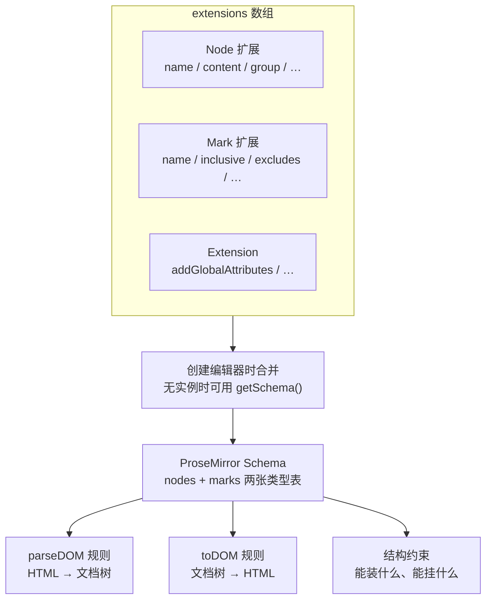

import { Canvas, Controls, Meta } from '@storybook/addon-docs/blocks';
import * as SchemaNodesMarksStories from './schema-nodes-marks.stories';

<Meta of={SchemaNodesMarksStories} name="Docs" />

# Schema、节点与标记

每个 Tiptap 编辑器背后都有一份 ProseMirror schema：一张节点类型表加一张标记类型表，规定文档里允许哪些内容、每种内容带什么属性、彼此如何嵌套、能挂哪些标记。这份 schema 从不手写——`extensions` 数组里的每个 Node / Mark 扩展自带一份类型声明，创建编辑器时由 `@tiptap/core` 合并成最终的 `Schema`。所以读扩展源码就是在读 schema 声明，改一个声明就能预测编辑器行为的改变。

[内容与文档模型课](?path=/docs/content-model--docs)站在使用侧看过这棵树：文档树、content 表达式的含义、非法内容的过滤都已在那一课讲清。本课翻到声明侧，回答四个问题：schema 从哪里来、节点与标记各自声明什么、HTML 如何进（parseHTML）出（renderHTML）、自定义属性（attributes）如何存取。看完开场图和两张参考表，你应该能预测：追加一个扩展后 schema 会多出什么、声明字段会落到 ProseMirror spec 的哪个槽位、`<b>` 粘贴进来后 getHTML 为什么输出 `<strong>`。



节点扩展可用的声明字段（`Node.create` / `Node.extend` 中声明）：

| 字段 | 作用 | 默认 | 内置使用例 |
| --- | --- | --- | --- |
| `content` | 能装什么子内容（表达式） | 缺省 = 不能装内容 | doc `block+`、paragraph `inline*`、codeBlock `text*` |
| `group` | 归入哪个组，供 content 表达式引用 | — | paragraph `block`、text `inline` |
| `marks` | 允许挂哪些标记 | 行内内容默认全部允许；其余默认禁止 | codeBlock `''`（全部禁止） |
| `inline` | 行内渲染 | text 隐含 `true` | mention `true` |
| `atom` | 视作整体、不可直接编辑 | — | mention `true` |
| `selectable` | 可被节点选区选中 | 非 text 节点默认 `true` | hardBreak、mention `false` |
| `draggable` | 不选中即可拖拽 | `false` | image `true` |
| `code` | 内容按代码对待 | — | codeBlock `true` |
| `whitespace` | 解析时空白如何处理 | `normal`；`code: true` 时 `pre` | — |
| `defining` | 内容整体替换时保留节点自身 | `false` | heading、codeBlock `true` |
| `isolating` | 编辑操作（如退格）不越过边界 | `false` | tableCell |
| `topNode` | 作为文档根节点 | `false` | doc `true` |
| `linebreakReplacement` | 充当块间换行的等价节点 | — | hardBreak `true` |

标记扩展可用的声明字段（`Mark.create` / `Mark.extend` 中声明）：

| 字段 | 作用 | 默认 | 内置使用例 |
| --- | --- | --- | --- |
| `inclusive` | 光标在标记末尾继续输入是否延续标记 | `true`（ProseMirror 规范默认） | link 跟随 autolink 选项 |
| `excludes` | 不能与哪些标记共存 | 与同类型标记互斥 | code `'_'`（排除一切标记） |
| `exitable` | 方向键可以"走出"标记 | `false` | link `true` |
| `spanning` | 跨相邻块序列化时是否只开一个标签 | `true`（ProseMirror 规范默认） | — |
| `group` | 归组，供 excludes 与 marks 白名单引用 | — | — |
| `code` | 内容按代码对待 | — | code `true` |
| `keepOnSplit` | 回车拆段后新块是否延续标记 | `true` | link `false` |
| `clearable` | 是否被 `unsetAllMarks` 清除 | `true` | — |

## Schema 由扩展推导

schema 描述文档允许长成什么样，但它不是一份独立的手写配置：`@tiptap/core` 收集全部扩展，把节点扩展与标记扩展分成两组，每个扩展的声明字段被抄写进 ProseMirror 对应的 spec——`content`、`group`、`defining` 等字段同名进入 NodeSpec / MarkSpec，`parseHTML()` 返回的规则数组写入 `spec.parseDOM`，`renderHTML()` 写成 `spec.toDOM`，`addAttributes()` 汇总进 `spec.attrs`——最后组装成 `new Schema({ topNode, nodes, marks })`。装了哪些扩展，schema 就认识哪些类型；schema 之外的内容进不了文档（过滤与报错行为见[内容与文档模型课](?path=/docs/content-model--docs)）。

拿到 schema 有两个入口，推导结果相同：

```ts
// 有编辑器实例时：schema 就挂在实例上
const schema = editor.schema;

// 没有实例时：给一组扩展，直接生成同一份 schema（静态转换、服务端场景）
import { getSchema } from '@tiptap/core';
const schema = getSchema([Document, Paragraph, Text, Bold]);
```

下面的实例把两件事放在一屏：左边是扩展的类型声明（摘自真实源码），右边是 `getSchema()` 推导出的 spec。切换预设，看声明字段一个个落到 spec 的槽位上。

<Canvas of={SchemaNodesMarksStories.SchemaSpec} />
<Controls of={SchemaNodesMarksStories.SchemaSpec} />

| 读者操作 | 可观察证据 |
| --- | --- |
| 切换「扩展预设」为三件套 | nodes 只有 doc · paragraph · text，marks 为（无）；paragraph 声明产生 content · group · parseDOM · toDOM |
| 切换为追加 Heading 节点 | nodes 多出 heading；spec 里出现 `defining` 与 `attrs`（level 默认 1），parseDOM 有 h1–h6 规则 |
| 切换为追加 Bold 标记 | marks 多出 bold；spec 只有 parseDOM 与 toDOM——标记声明不需要 content / group |
| 打开 Show code | 看到该 Canvas 实际执行的 `schema-spec.ts` |

### 节点声明字段

三个字段构成骨架：`content` 用表达式声明本节点能装什么子内容，`group` 把自己归入某个组、从而能被别的 content 表达式引用（doc 的 `block+` 就是引用 `block` 组），`marks` 是标记白名单、声明哪些标记可以挂进本节点的内容。三者的表达式语法与分组规则已在[内容与文档模型课](?path=/docs/content-model--docs)讲过，本课只需记住：改任何一个扩展的这三个字段，整个文档的合法结构就变了。

```ts
// 摘自 @tiptap/extension-code-block：一个"只收纯文本"的代码块
const CodeBlock = Node.create({
  name: 'codeBlock',
  content: 'text*', // 只装 text，不装段落或行内节点
  marks: '',        // 不允许任何标记挂进来
  group: 'block',
  code: true,       // 命令按代码内容对待，whitespace 随之默认 'pre'
  defining: true,   // 内容整体替换（如粘贴覆盖）时保留代码块本身
  // parseHTML / renderHTML / addAttributes 见后文
})
```

`inline` 与 `atom` 描述行内的"另类"：`inline: true` 让节点与文字同行（mention 就是如此），`atom: true` 让它被当作一个整体——不能直接编辑内部内容。行内节点在行首行尾不易选中，官方建议用 CSS 补一个零宽空格（`::after { content: '\200B' }`）。节点的"编辑手感"由 `defining`（整体替换内容时保留节点自身）、`isolating`（退格等操作不越过边界，如表格单元格）、`draggable` / `selectable`（拖拽与节点选区）共同决定，`linebreakReplacement` 指定块间换行的等价节点（hardBreak）。

声明字段还可以写成函数，创建编辑器时按 options 求值——image 的块级行内两用就是这么实现的：

```ts
// 摘自 @tiptap/extension-image：声明随配置变化
const Image = Node.create({
  name: 'image',
  inline() {
    return this.options.inline; // 默认 false
  },
  group() {
    return this.options.inline ? 'inline' : 'block';
  },
  draggable: true,
})
```

### 标记声明字段

标记不需要 `content` 与 `group` 之外的"结构"字段——它不占树的层级，声明的是行为。`inclusive` 决定光标停在标记末尾时继续输入是否延续标记（默认延续，加粗词后打字仍是粗体）；`excludes` 声明不能共存的标记；`exitable` 放行方向键，让光标能"走出"标记；`spanning` 影响跨相邻块的 HTML 序列化；`keepOnSplit` 与 `clearable` 是 Tiptap 层的行为字段（拆段延续、清除白名单），不进 ProseMirror spec。

```ts
// 摘自 @tiptap/extension-code：行内代码排除一切其他标记
const Code = Mark.create({
  name: 'code',
  excludes: '_', // 进入 code 的文本会先摘掉 bold、italic 等
  code: true,
})

// 摘自 @tiptap/extension-link：inclusive 是函数，跟随 autolink 选项
const Link = Mark.create({
  name: 'link',
  keepOnSplit: false,
  exitable: true,
  inclusive() {
    return this.options.autolink;
  },
})
```

## 节点与标记的职责差异

判断入口只有一句话：**要加的东西要不要占树的一层？** 节点构成文档的结构——doc、paragraph、heading 一层层套出来；标记只给已有文本"着色"——粗体、链接挂在 text 节点的 `marks` 数组上，树不会因此加深（形态可在[内容与文档模型课](?path=/docs/content-model--docs)的文档树实例里复核）。落到声明侧，两类扩展的字段差异正是这个分工的体现：节点声明结构与编辑手感，标记声明附着与共存行为。

| 维度 | 节点（node） | 标记（mark） |
| --- | --- | --- |
| 树中的位置 | 占一层：doc → 块级节点 → 行内内容 | 不占层级，挂在 text 的 marks 数组上 |
| JSON 形态 | 嵌套对象，content 递归 | marks 数组项 `{ type: 'bold' }` |
| 携带内容 | content 表达式声明能装什么 | 无内容，只能附着于已有文本 |
| 选择方式 | 节点选区（整块选中） | 文本选区的一部分 |
| 典型命令 | `setNode` / `toggleNode` / `insertContent` | `setMark` / `toggleMark` / `unsetMark` |
| DOM 输出 | 块级或行内元素，内容插在 0 号洞 | 行内包裹元素，内容插在 0 号洞 |

介于两者之间的是**行内节点**：像标记一样与文字同行，但占树的行内位置、可以有 attrs 和内容。schema 官方文档给的判断是——想要"标记的位置 + 节点的功能"（例如带 Node View、带内容、需要节点级属性）时，先试试 `inline: true` 的节点；纯样式注记才用标记。mention 就是典型：像一段文字，实际是一个带 `id`、`label` 属性的原子节点。atom 节点没有可编辑文本，复制时内容为空，用 `renderText` 提供纯文本表示：

```ts
// 摘自 Mention：atom 节点的纯文本表示，映射为 schema 的 toText
renderText({ node }) {
  return `@${node.attrs.id}`
},
```

从零编写节点与标记的完整流程（含命令注册与类型声明）见[自定义 Node 与 Mark 课](?path=/docs/custom-node-mark--docs)。

## parseHTML 与 renderHTML

HTML 在 Tiptap 里从来不是独立真源，只是文档树两端的投影：**parseHTML** 声明"哪些 HTML 收下来、变成什么"，转成 schema 的 `parseDOM` 规则，初始化 `content`、`setContent`、粘贴走的都是它；**renderHTML** 声明"树渲染成什么 HTML"，转成 schema 的 `toDOM`，`getHTML()`、复制、静态渲染走的都是它。两个方向都由扩展声明决定——这就是"多种写法进、一套规范出"的来源。

parseHTML 返回规则数组，常见三种形态与约定：

```ts
// 摘自 @tiptap/extension-strike：三条标签规则 + 一条样式规则
parseHTML() {
  return [
    { tag: 's' },
    { tag: 'del' },
    { tag: 'strike' },
    {
      style: 'text-decoration', // 样式规则：匹配任何带该属性的元素
      consuming: false,         // 不"消费"元素，其他规则还能继续处理它
      getAttrs: (style) => style.includes('line-through') ? {} : false,
    },
  ]
},
renderHTML({ HTMLAttributes }) {
  return ['s', mergeAttributes(this.options.HTMLAttributes, HTMLAttributes), 0]
},
```

- **tag** 是 CSS 选择器（`p`、`a[href]`、`img[src]:not([src^="data:"])` 都合法）；匹配后由属性钩子取值（见下一节）。
- **getAttrs** 的返回值约定：返回 `false` 表示规则不匹配；返回 `null` / `undefined` 表示匹配但不附加属性；返回对象表示匹配并把值写进 attrs。所以 Bold 里 `node.style.fontWeight !== 'normal' && null` 的惯用法成立——条件为真得到 `null`（匹配），为假得到 `false`（不匹配）。tag 规则的 getAttrs 收到 DOM 元素，style 规则收到样式值字符串。
- 多条规则同时命中时按优先级取胜：数组顺序在前者优先，也可以给单条规则加 `priority` 解决与其他扩展的冲突。

renderHTML 返回 DOMOutputSpec 数组：第一项是标签名，可选第二项是属性对象，`0` 是内容插入点（洞）。需要嵌套标签时把洞放在最内层；叶子节点（如 image 的 ``）没有内容，自然没有洞。`mergeAttributes` 用于合并 options 的 `HTMLAttributes` 与运行时属性，同名 `class` 会拼接、`style` 会逐条合并：

```ts
// 摘自 @tiptap/extension-code-block：嵌套标签，0 号洞在最内层
renderHTML({ HTMLAttributes }) {
  return ['pre', ['code', HTMLAttributes, 0]]
},
```

下面的实例把"进"和"出"并排放在一屏：左边是喂给编辑器的 HTML，右边是 `getHTML()` 的实际输出。同一标记的多条 parse 规则收下各种历史写法，输出只剩一套规范标签。

<Canvas of={SchemaNodesMarksStories.ParseRender} />
<Controls of={SchemaNodesMarksStories.ParseRender} />

| 读者操作 | 可观察证据 |
| --- | --- |
| 切换为「strong 与 b 标签」 | 两种写法都收成 bold × 2；getHTML 只输出 strong |
| 切换为「font-weight 与 text-decoration 样式」 | 行内样式被收成 bold 与 underline；输出标签 strong、u |
| 切换为「u、s、del 标签」 | s 与 del 都收成 strike，输出统一为 s；u 收成 underline、输出 u |
| 切换为「font-weight: normal 的 b」 | 规则匹配 b 但 getAttrs 返回 false——按普通文本收下，输出无标记 |
| 打开 Show code | 看到该 Canvas 实际执行的 `parse-render.ts` |

## attributes 定义

节点和标记的属性（attrs）也走声明：`addAttributes()` 返回一个"属性名 → 配置"的对象，声明过的属性才能存在文档里。每个属性的完整链路是三段——属性级 `parseHTML(element)` 从 DOM 收值，值存进节点 / 标记的 attrs（`getJSON()` 里可见），属性级 `renderHTML(attributes)` 决定输出形态。属性钩子会被自动注入扩展的 parseHTML 规则（style 规则除外），所以解析阶段通常不用手写 getAttrs。

| 配置项 | 默认 | 作用 |
| --- | --- | --- |
| `default` | 省略时属性必填 | 属性默认值，写入 schema 的 attrs |
| `parseHTML` | 读同名 HTML attribute | 从 DOM 元素取值；返回 null / undefined 视为未提供 |
| `renderHTML` | 按同名 HTML attribute 输出 | 决定输出形态；返回 `{}` 表示不输出 |
| `rendered` | `true` | `false` 时不渲染进 HTML（纯逻辑属性） |
| `keepOnSplit` | `true` | 回车拆段时新块是否继承该属性值 |
| `isRequired` | `false` | `true` 时不生成默认值，创建节点必须显式给值 |
| `validate` | — | 传给 ProseMirror 的值校验器 |

两个真实声明对照着看：heading 的 `level` 是纯逻辑属性——它决定输出 h1–h6 哪个标签名，本身不需要输出成属性；highlight 的 `color` 则是完整的"收——存——出"定制：

```ts
// 摘自 @tiptap/extension-heading：纯逻辑属性不渲染
addAttributes() {
  return {
    level: {
      default: 1,
      rendered: false,
    },
  }
}

// 摘自 @tiptap/extension-highlight（multicolor: true 时）：颜色三段链路
color: {
  default: null,
  parseHTML: (element) =>
    element.getAttribute('data-color')
      || getStyleProperty(element, 'background-color') // 来自 @tiptap/core，解析 style 属性串
      || element.style.backgroundColor,
  renderHTML: (attributes) => {
    if (!isValidCSSStyleValue(attributes.color)) return {} // 没有有效颜色就不输出
    return {
      'data-color': attributes.color,
      style: `background-color: ${attributes.color}; color: inherit`,
    }
  },
}
```

下面的实例用 highlight 的 color 属性演示完整链路：同一颜色换三种传入方式，attrs 与输出形态逐一对照。

<Canvas of={SchemaNodesMarksStories.AttributePipeline} />
<Controls of={SchemaNodesMarksStories.AttributePipeline} />

| 读者操作 | 可观察证据 |
| --- | --- |
| 切换为「data-color 属性」 | getJSON 的 highlight 标记带 `attrs.color` "#fde047"；getHTML 输出 data-color + style |
| 切换为「内联样式 background-color」 | 同样存进 `attrs.color`；getHTML 输出与上一项完全一致——形态被规范化 |
| 切换为「不带颜色信息」 | `attrs.color` 为 null；getHTML 的 mark 没有任何附加属性 |
| 打开 Show code | 看到该 Canvas 实际执行的 `attribute-pipeline.ts` |

一个属性要同时供给多个类型时，不必逐个扩展重写：任意扩展都能用 `addGlobalAttributes()` 声明全局属性，`types` 指定作用范围，支持数组或 `'*'`（除 text 外的所有节点与全部标记）、`'nodes'`（所有节点）、`'marks'`（所有标记）三个简写。文本对齐、颜色、字号这类"跨类型样式"都是这个机制——text-style 家族（见[文本样式扩展课](?path=/docs/text-style-extensions--docs)）就是这样把 color、fontFamily 等属性挂到各种标记与节点上的：

```ts
// 对齐属性一次挂到 heading 与 paragraph 上（TextAlign 的思路）
addGlobalAttributes() {
  return [
    {
      types: ['heading', 'paragraph'],
      attributes: {
        textAlign: {
          default: 'left',
          parseHTML: (element) => element.style.textAlign || 'left',
          renderHTML: (attributes) => ({
            style: `text-align: ${attributes.textAlign}`,
          }),
        },
      },
    },
  ]
}
```

## 最佳实践

- **读扩展源码先抓声明骨架。** `name`、`content` / `group`、`parseHTML`、`renderHTML`、`addAttributes` 五件套看完，扩展"能收什么、出什么、存什么"就清楚了；命令与快捷键只是这些能力的入口。
- **parse 收宽，render 收窄。** parseHTML 尽量把历史写法都收进来（Bold 收 strong、b、font-weight 样式），renderHTML 只输出一套规范形态（只出 strong）——老内容进得来，新内容出得齐。
- **属性必须声明才存活。** schema 只保留 addAttributes 声明过的属性，DOM 上的其他属性解析时被丢弃；没有有效值时让 renderHTML 返回 `{}`（值 null 本不会被序列化），纯逻辑属性配 `rendered: false`，别让 attrs 变成 HTML 上的噪音。
- **改内置扩展的声明用 `.extend()`，不要复制源码。** 覆盖任意 schema 字段即可，例如 `Blockquote.extend({ content: 'paragraph*' })`；extend 与 options/storage 的机制见[Extension 体系课](?path=/docs/extension-system--docs)。
- **需要 ProseMirror 原生能力时从 `@tiptap/pm/*` 子路径导入。** `editor.schema` / `getSchema()` 给你原生 `Schema` 对象，版本由 `@tiptap/pm` 与 Tiptap 保持对齐，不要自行安装 prosemirror-model 等包。

## 常见问题

- 粘贴或初始化的某个标签没有变成预期的节点或标记
  逐条核对 parseHTML 规则：扩展是否注册、tag 选择器是否真的匹配（含属性、class 选择器）、getAttrs 是否返回了 false、样式规则只读行内 style。多条规则同时命中时，数组顺序在前者优先，必要时给规则加 `priority` 解决与其他扩展的冲突。
- 光标停在加粗词末尾继续打字，新文字自动带着粗体，想让输入"跳出"标记
  这是 `inclusive` 的默认行为——未声明时 ProseMirror 规范默认 true。给标记声明 `inclusive: false` 即可让输入在标记末尾脱离标记；link 的 inclusive 声明成函数、跟随 autolink 选项（见标记声明字段一节）。也可以用 `exitable: true`：保留延续行为，但允许方向键走出标记（会在标记末尾注册 ArrowRight 处理）。
- 两个扩展都想匹配同一个标签，解析结果时对时错
  规则冲突按优先级解决：给 parseHTML 里的关键规则加 `priority`，或收紧 tag 选择器（如 `p[class]`）避免撞车。自定义扩展与内置扩展抢同一标签时尤其要注意，调试时先用预设内容二分定位是哪条规则赢了。
- 复制 mention 这类 atom 节点时内容是空的
  atom 节点没有可直接编辑的文本，取纯文本与复制时为空。给节点声明 `renderText` 提供纯文本表示（mention 返回 `` `@${node.attrs.id}` ``），它映射为 schema 的 toText，`getText()` 与复制行为都会用它。

## 总结回顾

摘要：

Tiptap 的 schema 不手写：`extensions` 数组里的每个 Node / Mark 扩展用一组声明字段描述一种内容类型，`@tiptap/core` 在创建编辑器时把它们合并成 ProseMirror 的 `Schema`——有实例时读 `editor.schema`，没有实例时用 `getSchema()`。节点声明结构：`content` / `group` / `marks` 定下能装什么、属于哪个组、能挂哪些标记，`inline` / `atom` 描述行内另类，`defining` / `isolating` 等控制编辑手感；标记声明行为：`inclusive` / `excludes` / `exitable` / `spanning` 决定附着、共存与序列化。两者的职责边界是"要不要占树的一层"——占一层用节点，只注记文本用标记，要节点功能又想行内就用 inline node。HTML 进出都由声明决定：parseHTML（parseDOM）收得宽，renderHTML（toDOM）出得统一，getAttrs 的 false / null / 对象三种返回值控制匹配与取值；属性经 `addAttributes` 声明后走"parseHTML 收、attrs 存、renderHTML 出"的三段链路，全局属性用 `addGlobalAttributes` 一次供给多个类型。从扩展到 schema 实例展示了声明与 spec 的逐字段对应，多进一出实例对照了收与出，属性链路实例验证了三段链路。

一句话：

> 扩展用声明定义 schema：节点声明结构，标记声明注记；parseHTML 管收、renderHTML 管出、attributes 管存。

知识要点：

- schema 从哪里来？有编辑器实例与没有实例时分别怎么拿到它？
- 节点与标记各有哪些声明字段？哪些控制结构、哪些控制编辑行为、哪些控制标记共存？
- node 与 mark 的职责差异是什么？判断"用节点还是标记"的入口是哪句话？行内节点适合什么场景？
- parseHTML 规则有哪三种形态？getAttrs 返回 false、null、对象分别意味着什么？renderHTML 数组里的 0 是什么？
- addAttributes 声明的属性走怎样的链路？default、rendered、keepOnSplit 的默认值各是多少？
- 全局属性怎么一次给多个类型加属性？`'*'`、`'nodes'`、`'marks'` 各指什么范围？

## 参考资料

- [Schema | Tiptap Editor Docs](https://tiptap.dev/docs/editor/core-concepts/schema)
- [Nodes and Marks | Tiptap Editor Docs](https://tiptap.dev/docs/editor/core-concepts/nodes-and-marks)
- [Node API | Tiptap Editor Docs](https://tiptap.dev/docs/editor/extensions/custom-extensions/create-new/node)
- [Mark API | Tiptap Editor Docs](https://tiptap.dev/docs/editor/extensions/custom-extensions/create-new/mark)
- [Add to an existing extension | Tiptap Editor Docs](https://tiptap.dev/docs/editor/extensions/custom-extensions/extend-existing)
- [ProseMirror（@tiptap/pm）| Tiptap Editor Docs](https://tiptap.dev/docs/editor/core-concepts/prosemirror)
- [ProseMirror Guide: Schema](https://prosemirror.net/docs/guide/#schema)
- [ProseMirror Reference: NodeSpec 与 MarkSpec](https://prosemirror.net/docs/ref/#model.MarkSpec)
