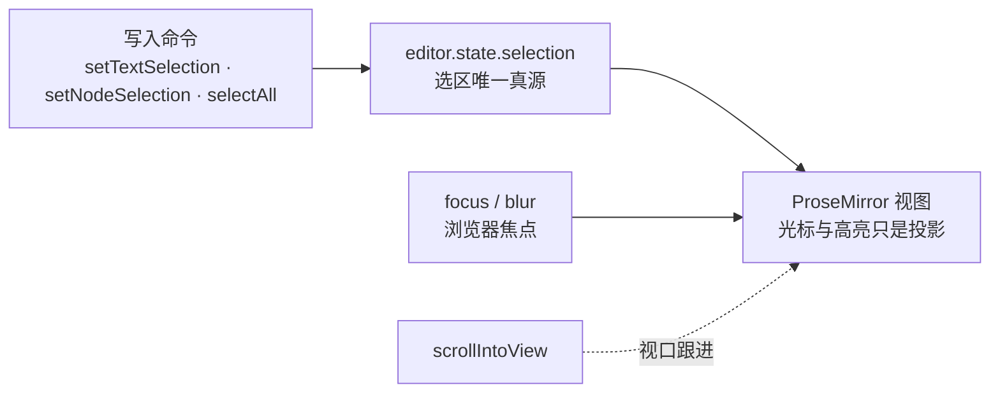

import { Canvas, Controls, Meta } from '@storybook/addon-docs/blocks';
import * as SelectionStories from './selection.stories';

<Meta of={SelectionStories} name="Docs" />

# 选区与焦点

选区（光标与文字高亮）在 Tiptap 里是**编辑器状态的一部分**：读它用 `editor.state.selection`，写它只有命令这一条路。本课覆盖三件事——把选区写到指定位置（文本选区、节点选区、全选）、控制浏览器焦点（`focus` / `blur`）、让视口跟上光标（`scrollIntoView`）。选区与焦点相互独立：失焦后高亮消失，状态里的选区原地保留。记住这一点，"点了工具栏按钮光标就不见了"一类的问题就有了判断依据。

看完开场图和参考表，你应该能预测：把光标命令的位置调成 0 会落在哪里、点普通按钮后 `isFocused` 读数怎么变、哪些命令会带动滚动条。



| API | 作用 | 关键参数与默认值 | 回查要点 |
| --- | --- | --- | --- |
| `editor.state.selection` | 读当前选区 | — | Selection 实例，字段见下表 |
| `setTextSelection(position)` | 写文本选区 | 位置：`number` 或 `Range` | 数字是光标、`Range` 是高亮；不滚动视口 |
| `setNodeSelection(position)` | 写节点选区 | 位置：`number` | 位置须指向可选节点开头 |
| `selectAll()` | 全选 | — | 产生 AllSelection |
| `selectParentNode()` | 选中父节点 | — | 已在最外层时返回 `false` |
| `focus(position?, options?)` | 聚焦 | options 默认 `scrollIntoView: true` | 不传 position 恢复上次光标位置 |
| `blur()` | 移除焦点 | — | DOM 高亮消失，state 选区保留 |
| `scrollIntoView()` | 滚动到选区 | — | 事务标记，须随命令链一起 dispatch |
| `deleteSelection()` | 删除选区内容 | — | 光标状态下无内容可删 |
| `autofocus` 选项 | 创建时聚焦 | 默认 `false` | 只管初始光标，见[配置课](?path=/docs/configure--docs) |

## 读写选区

选区不是 DOM 属性，而是编辑器状态：`editor.state.selection` 是一个 Selection 对象，DOM 里看到的光标和高亮只是它投到视图上的影子。Selection 有三个类型，共享同一组字段——判断选区长什么样、能删多少内容，都从这两个维度入手。

| 类型 | 什么时候出现 | 视觉特征 |
| --- | --- | --- |
| `TextSelection` | 光标停在文字间，或选中一段文字 | 竖线光标 / 文字高亮 |
| `NodeSelection` | 选中一个完整节点（点图片、代码块） | 节点整体加选框 |
| `AllSelection` | 全选整个文档 | 全部内容高亮 |

| 字段 | 含义 |
| --- | --- |
| `from` / `to` | 选区主范围的起止文档位置；节点选区时正好包住节点 |
| `anchor` / `head` | 固定端与移动端，决定拖选方向 |
| `empty` | 是否为空选区——`true` 表示只是光标 |
| `$from` / `$to` | 解析后的位置对象，可在文档树中继续定位 |

写入走命令，读数面板立刻反映状态变化；鼠标拖选、点图片这些 DOM 操作也汇入同一个状态：

```ts
// 读：选区在状态里，随时可读
const selection = editor.state.selection;
selection.from; // 选区起点
selection.empty; // true 表示当前只是光标

// 写：三种选区对应三条命令
editor.commands.setTextSelection(8); // 光标放到位置 8
editor.commands.setTextSelection({ from: 8, to: 20 }); // 高亮 8–20
editor.commands.setNodeSelection(27); // 选中位置 27 处的节点（示例文档里的图片）
editor.commands.selectAll(); // 全选，产生 AllSelection
```

<Canvas of={SelectionStories.SelectionLab} />
<Controls of={SelectionStories.SelectionLab} />

| 读者操作 | 可观察证据 |
| --- | --- |
| 切换「选区命令」为光标，调 from | 类型变 TextSelection 光标，`from – to` 变成两个相同数字 |
| 切换为范围，调 from / to | 文字出现高亮，anchor / head 分别落在固定端与移动端 |
| 切换为节点选区 | 图片加选框，类型变 NodeSelection（image），`from – to` 相差 1 |
| 切换为全选 | 类型变 AllSelection，整个文档高亮 |
| 在编辑器里拖选文字、点图片 | 同一组读数实时变化——DOM 操作与命令写入汇入同一个状态 |
| 打开 Show code | 看到该 Canvas 实际执行的 `selection-lab.ts` |

监听选区变化不用轮询：`onSelectionUpdate` 回调在每次选区变化时触发，参数里的 `editor.state.selection` 就是最新选区；事件时序见[事件课](?path=/docs/events--docs)。

### 位置编号：from 与 to 怎么数

命令里的位置数字不是字符索引，而是**文档树里的累计偏移**：从 0 开始，进入一个节点 +1，每写一个字符 +1，图片这类叶子节点整体只占 1 个位置，离开节点再 +1。用一份小文档算一遍：

```text
文档：<h2>选区</h2><p>拖选</p>

0 doc 开头        4 h2 与 p 的边界
1 "选"之前        5 "拖"之前
2 "选""区"之间    6 "拖""选"之间
3 "区"之后        7 "选"之后     8 doc 末尾
```

两个推论都验证得到：第一个可放置光标的位置是 1 而不是 0（0 在 doc 内、第一个节点之前）；越界的位置会被自动收敛到合法范围——`setTextSelection(0)` 光标落在文档开头，`setTextSelection(999)` 落在文档末尾。选区实例右侧的「位置地图」用同样的规则实时列出每个顶层节点的区间，是调整 from / to 时的对照表。

手数位置很容易错，正确姿势是先查后写：节点位置用 `editor.$node('image')?.pos` 查，或像实例那样遍历 `editor.state.doc`。

### setTextSelection：文本选区

传数字得到光标，传 `Range`（即 `{ from, to }`）得到高亮范围。拖选方向由 anchor 与 head 表达：anchor 是按下鼠标的固定端，head 是跟随拖动的移动端——从右往左拖选时 anchor 大于 head，而 `from` / `to` 永远是两端里的较小值与较大值。

```ts
editor.commands.setTextSelection(5); // 光标
editor.commands.setTextSelection({ from: 5, to: 9 }); // 高亮 5–9
```

两个边界贴着命令记：写入选区不会移动浏览器焦点，也不会滚动视口；`from` 大于 `to` 时命令按两个端点的最小、最大值处理，不需要自己排序。

### setNodeSelection：节点选区

节点选区把**整个节点**当作一个选区单位，典型场景是图片、代码块这类块级叶子节点。它的 `from` / `to` 正好包住节点：示例文档里图片只占 1 个位置，所以读数是 27–28；节点选区里 anchor 等于 `from`、head 等于 `to`。

```ts
// 先查后写：位置必须指向可选节点的开头
const imagePos = editor.$node('image')?.pos;
if (imagePos !== undefined) {
  editor.commands.setNodeSelection(imagePos);
}
```

用户在编辑器里**点击图片**时，ProseMirror 会自动产生节点选区——在实例里点一下图片，读数与「节点选区」命令产生的完全一致。这正是 NodeSelection 的入口之一：选中后立即执行删除、替换等命令，操作的就是整个节点。

### selectAll 与 selectParentNode：全选与外扩

`selectAll()` 产生覆盖整篇文档的 AllSelection，包括文本选区覆盖不了的叶子块（文档首尾的图片、分隔线等）。`selectParentNode()` 产生当前所在**父节点的 NodeSelection**：光标在表格单元格里时，连续调用会依次选中单元格、行、表格，逐层向外扩；顶层段落只到段落本身，再往上没有可选择的节点时返回 `false`，命令链会就此中断，可先用 `editor.can().selectParentNode()` 预判。

```ts
editor.commands.selectAll();
// 光标在段落里：一步选中所在段落（NodeSelection）
editor.chain().selectParentNode().run();
```

一个容易混淆的兄弟：`focus('all')` 也能一次选中整篇，但产生的是覆盖全篇的 TextSelection；需要严格的全选语义（保证包住叶子块）时用 `selectAll()`。

## 焦点控制：focus 与 blur

焦点是浏览器层面的概念：编辑器失焦后，按键不再进入编辑器，但 `state.selection` 原地保留——高亮消失、选区没丢。读写选区靠状态，能不能继续打字靠焦点，这是两件事。`isFocused` 属性随时可读。

<Canvas of={SelectionStories.FocusDemo} />

| 读者操作 | 可观察证据 |
| --- | --- |
| 拖选文字后点「toggleBold() 普通按钮」 | 文字变粗，但 isFocused 变"否"——焦点被按钮抢走，继续打字没反应 |
| 点「toggleBold() + focus()」 | 文字变粗，isFocused 保持"是"——命令链末尾的 focus() 把焦点送回编辑器 |
| 点「blur()」 | 光标高亮消失、isFocused 变"否"，`from – to` 读数纹丝不动 |
| 点「focus()」 | 光标回到失焦前的位置——状态里保留的选区被恢复 |
| 点「focus('end')」 | 光标移到文档末尾并聚焦 |
| 打开 Show code | 看到该 Canvas 实际执行的 `focus-demo.ts` |

`focus` 的 position 参数决定落点：

| 调用 | 行为 |
| --- | --- |
| `focus()` | 恢复上次光标位置并聚焦；已聚焦时是空操作 |
| `focus('start')` / `focus('end')` | 光标到文档开头 / 末尾 |
| `focus(10)` | 光标到位置 10 |
| `focus('all')` | 选中整篇（TextSelection，见上文与 `selectAll` 的区别） |
| `focus(false)` | 空操作 |
| `focus(10, { scrollIntoView: false })` | 聚焦但不滚动；options 默认 `scrollIntoView: true` |

`blur()` 移除焦点并清掉 DOM 里的选区高亮，但不动 `state.selection`。因此"失焦后命令失效"是错觉：`toggleBold()` 这类命令作用于状态，失焦时照样生效（上面实例第三步正是证据），失效的只是键盘输入。创建时的初始光标由 `autofocus` 选项负责，见[配置课](?path=/docs/configure--docs)。

## 滚动定位：scrollIntoView

哪些命令滚动视口、哪些不滚，是"改了选区却看不到光标"的根源：`setTextSelection` / `setNodeSelection` / `selectAll` 都**只改状态、不滚动**；`focus` 默认滚动（`scrollIntoView: true`）；`scrollIntoView()` 命令给当前事务打上滚动标记，让视口滚到选区处。

```ts
// 写选区 + 滚动：接在同一条命令链里 dispatch
editor.chain().setTextSelection(300).scrollIntoView().run();

// 或者直接聚焦到目标位置，一步完成移动、聚焦与滚动
editor.commands.focus(300);
```

`scrollIntoView` 是事务上的标记，单独调用时自己也会 dispatch 一次事务，所以 `editor.commands.scrollIntoView()` 有效；但更常见的用法是接在写选区的命令后面，让一次 dispatch 同时完成两件事。

<Canvas of={SelectionStories.ScrollDemo} />

| 读者操作 | 可观察证据 |
| --- | --- |
| 点「setTextSelection 到文末」 | `from – to` 跳到文档末尾，scrollTop 不动——状态变了，视口没跟上 |
| 点「scrollIntoView()」 | scrollTop 跳到底部，光标进入视野 |
| 点「focus('end')」 | scrollTop 与选区同时到位——聚焦、移动、滚动一步完成 |
| 手动拖动滚动条 | scrollTop 读数同步变化（手动滚动不产生事务，实例单独监听了 scroll） |
| 打开 Show code | 看到该 Canvas 实际执行的 `scroll-demo.ts` |

## 选区命令速查

官方 selection 命令族里其余成员，按用途回查：

| 命令 | 用途 | 时机与关键影响 |
| --- | --- | --- |
| `deleteSelection()` | 删除当前选区的内容 | 光标状态下无内容可删，返回 `false`；删除后自动滚到光标处 |
| `deleteRange({ from, to })` | 删除任意区间 | 不依赖当前选区，配合查到的位置使用 |
| `enter()` | 模拟按回车，新建一行 | 与在编辑器里按 Enter 等效 |
| `selectNodeBackward()` | 光标在文本块开头时，选中它前面的节点 | Backspace 删除流程的组成部分 |
| `selectNodeForward()` | 光标在文本块末尾时，选中它后面的节点 | Delete 删除流程的组成部分 |
| `selectTextblockStart()` / `selectTextblockEnd()` | 选区移到当前文本块的开头 / 末尾 | 不跨块，只在当前段落内移动 |
| `keyboardShortcut(name)` | 触发一个已注册的快捷键 | 模拟按键，见[快捷键与输入规则课](?path=/docs/keyboard-input-rules--docs) |

## 最佳实践

- **工具栏按钮要么拦截 mousedown，要么在命令链末尾补 focus()。** `button.addEventListener('mousedown', (event) => event.preventDefault())` 让按钮从头到尾不抢焦点；已经写好的按钮则在回调里用 `editor.chain().focus().toggleBold().run()` 一类写法，把焦点送回编辑器。两种都做也可以，焦点实验里两个按钮就是这对取舍。
- **"移动选区"与"滚动视口"一起安排。** 长文档里把光标移到远处时，接 `.scrollIntoView()` 或改用 `focus(position)`；反过来，做"跳转到引用位置"等功能时别只写选区——视口不动，用户以为命令没生效。
- **位置一律先查后写。** 手数偏移在文档一变后就失效；节点位置用 `editor.$node('image')?.pos`，任意位置用 `editor.state.doc` 遍历或 `editor.$pos(n)` 解析，把数字交给命令前先让程序算出来。

## 常见问题

- 点了外部按钮后光标消失，继续打字没反应，但命令执行了
  在按钮回调末尾调用 `editor.commands.focus()`，或给按钮加 `mousedown` 的 `preventDefault`。判断依据：点击把浏览器焦点移到按钮，编辑器失焦后按键不再进入编辑器；但 `state.selection` 原地保留，所以命令照样生效，`focus()` 不传参就能把光标恢复回来。
- setTextSelection 后读数变了，但视口没动、看不到光标
  正常行为：写选区的命令不滚动视口。在命令链里补 `.scrollIntoView()`（`chain().setTextSelection(x).scrollIntoView().run()`），或改用 `focus(x)`——它默认 `scrollIntoView: true`。排查同类问题时，给滚动容器加一个 scrollTop 读数最直观。
- setNodeSelection 传了一个位置，结果选不中节点，甚至直接抛错
  位置必须指向可选节点的开头。指向文字中间或文字后缘时，`nodeAfter` 要么为空（直接抛 TypeError），要么把一段文本错误地包进节点选区——两种都不要用。先用 `editor.$node('image')?.pos` 或遍历 `doc` 查出节点位置，再交给命令。

## 总结回顾

摘要：

选区是编辑器状态的一部分：读用 `editor.state.selection`，写只有命令一条路。Selection 分 TextSelection、NodeSelection、AllSelection 三个类型，共享 from/to、anchor/head、empty 等字段；选区读写实例让命令写入与鼠标拖选汇入同一组读数，验证了 DOM 高亮只是状态投影。位置数字是文档树的累计偏移——进入节点 +1、每个字符 +1、叶子节点整体占 1，越界自动收敛，所以先查后写才是可靠做法。焦点与选区解耦：focus / blur 管浏览器焦点，blur 后高亮消失但 state.selection 原地保留，焦点实验里"普通按钮抢走焦点、命令链补 focus() 修复"正是工具栏问题的原型。滚动同理：写选区的命令不滚视口，scrollIntoView 是事务标记，focus 默认滚动——滚动实验用 scrollTop 读数把"谁滚谁不滚"拆开验证。

一句话：

> 选区住在 `editor.state.selection` 里、只能通过命令写入；焦点与滚动是视图层的两件独立事务，失焦选区不丢，写选区不滚动。

知识要点：

- 选区存在哪里、怎么读？三个 Selection 类型和公共字段各是什么？
- 位置数字怎么数？为什么第一个光标位置是 1、越界数字会落在哪里？
- setTextSelection 传数字与传 Range 的区别？anchor 和 head 谁固定谁移动？
- setNodeSelection 的位置有什么要求？用户点击图片时会发生什么？
- selectAll 与 focus('all') 产生的选区类型有何不同？selectParentNode 到最外层时返回什么？
- focus 不传参时做什么？options 的默认值？blur 之后 state.selection 会怎样？
- 哪些写选区的命令不滚动视口？scrollIntoView 的生效方式是什么？

## 参考资料

- [Selection commands | Tiptap Editor Docs](https://tiptap.dev/docs/editor/api/commands/selection)
- [setTextSelection command | Tiptap Editor Docs](https://tiptap.dev/docs/editor/api/commands/selection/set-text-selection)
- [setNodeSelection command | Tiptap Editor Docs](https://tiptap.dev/docs/editor/api/commands/selection/set-node-selection)
- [focus command | Tiptap Editor Docs](https://tiptap.dev/docs/editor/api/commands/selection/focus)
- [blur command | Tiptap Editor Docs](https://tiptap.dev/docs/editor/api/commands/selection/blur)
- [selectAll command | Tiptap Editor Docs](https://tiptap.dev/docs/editor/api/commands/selection/select-all)
- [selectParentNode command | Tiptap Editor Docs](https://tiptap.dev/docs/editor/api/commands/selection/select-parent-node)
- [scrollIntoView command | Tiptap Editor Docs](https://tiptap.dev/docs/editor/api/commands/selection/scroll-into-view)
- [Editor API（state / isFocused）| Tiptap Editor Docs](https://tiptap.dev/docs/editor/api/editor)
- [Selection | ProseMirror Reference](https://prosemirror.net/docs/ref/#state.Selection)
