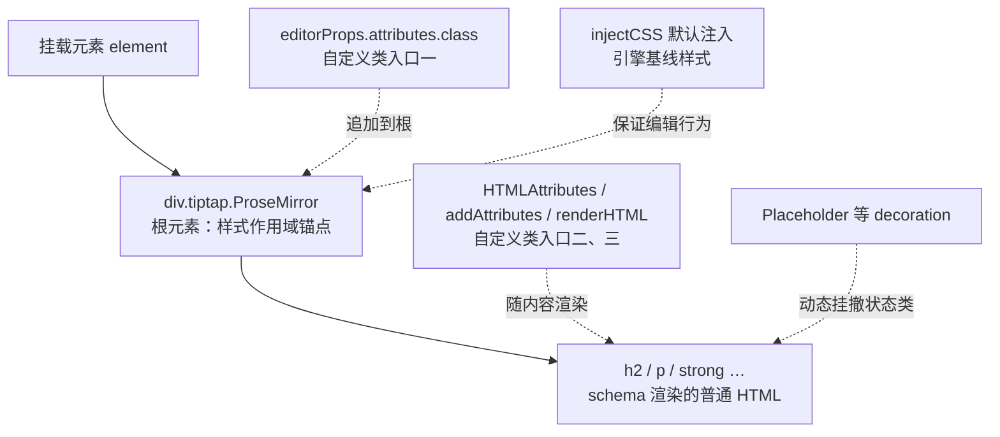

import { Canvas, Controls, Meta } from '@storybook/addon-docs/blocks';
import * as StyleEditorStories from './style-editor.stories';

<Meta of={StyleEditorStories} name="Docs" />

# 样式

Tiptap 是 headless 编辑器：实例本身不带任何外观，编辑区只是挂载元素里一个 `<div class="tiptap ProseMirror">`，标题、段落、加粗都是 schema 渲染出的普通 HTML。所以编辑器的样式不需要专门的 API——在正确的锚点上写 CSS 即可。本课把这些锚点理清楚：根元素类名与注入的基线样式、作用域写法、自定义类进入 DOM 的三个入口、现成的状态类（含占位符），以及深色模式的通行做法。看完开场图和参考表，你应该能预测：一条 `.tiptap p` 会作用到哪、`is-empty` 类从哪来、深浅主题往哪切换。



| 样式锚点 | 默认值 | 回查要点 |
| --- | --- | --- |
| 根元素类 | `tiptap ProseMirror` | 编辑区样式的最外层作用域；`editorProps.attributes.class` 可追加 |
| 注入样式 | `injectCSS` 默认 `true` | 只保证引擎正常（空白渲染、gapcursor 等），不管内容排版 |
| 节点 / 标记类 | 无默认类 | 扩展 `HTMLAttributes`、`addAttributes` 或 `renderHTML` 提供 |
| 占位符 | StarterKit 不含 Placeholder | 空段落挂 `is-empty` / `is-editor-empty` 与 `data-placeholder`，显示 CSS 自己写 |
| 深色模式 | 无官方开关 | 主题类 + CSS 变量，或 Tailwind `dark:` 变体 |

边界：本课只管编辑区本身的外观。工具栏按钮与菜单的样式跟菜单实现绑定（选中态高亮靠 `isActive` 等），见 3.4 菜单；直接用官方成品菜单组件见 6.3 UI Components。

## 快速上手

最小闭环：注册 Placeholder → 写一段 `.tiptap` 作用域 CSS → 空文档出现占位符，输入后消失。`@tiptap` 三件套的安装见 1.2 安装；Placeholder 在 v3 位于 `@tiptap/extensions`，StarterKit 不含它。

```ts
import { Editor } from '@tiptap/core';
import StarterKit from '@tiptap/starter-kit';
import { Placeholder } from '@tiptap/extensions';

new Editor({
  element: document.querySelector<HTMLDivElement>('.element'),
  extensions: [
    StarterKit,
    Placeholder.configure({ placeholder: '写点什么吧…' }),
  ],
});
```

```css
.tiptap {
  outline: none;
}

.tiptap p.is-editor-empty:first-child::before,
.tiptap p.is-empty::before {
  content: attr(data-placeholder);
  float: left;
  height: 0;
  pointer-events: none;
  color: #94a3b8;
}
```

运行验证：空文档显示灰色占位符，输入后消失。三层各管一件事：Placeholder 用 decoration 往空段落挂类和 `data-placeholder` 属性（机制见「占位符」）；`.tiptap` 把选择器圈在编辑区内；`::before` 负责把属性显示出来。本页「占位符」实例就是这套组合的可交互版本。

## 编辑区 DOM

先认清样式的落点。Tiptap 往挂载元素写入视图 div：`tiptap` 类由 Tiptap 加上，`ProseMirror` 类来自底层引擎 prosemirror-view，两者永远同时在根元素上。实例还默认注入一份 `<style data-tiptap-style>`，它只负责「编辑器不坏」，与内容排版无关。

### 根元素与注入样式

下面的实例是真实 Tiptap 编辑器（依赖已装在本工作区 Storybook）。读数直接取自 `editor.view.dom`，在编辑区打字、聚焦都不改变这些属性的来源。

<Canvas of={StyleEditorStories.ViewDom} />

| 读者操作 | 可观察证据 |
| --- | --- |
| 点击进入编辑区 | 根元素 class 多出 `ProseMirror-focused`（失焦后撤掉） |
| 在编辑区打字 | 内容实时渲染为 `<p>`、`<strong>` 等普通 HTML，读数中的根元素属性不变 |
| 打开 Show code | 看到该 Canvas 实际执行的 `view-dom.ts` |

读数里的 `white-space: break-spaces` 就是注入样式生效的痕迹——换行与空格的渲染由它保证。注入内容清单如下（核对自 `@tiptap/core` 源码）：

| 注入内容 | 作用 |
| --- | --- |
| `.ProseMirror { position: relative; word-wrap: break-word; white-space: break-spaces; … }` | 根布局与空白渲染基线 |
| `.ProseMirror [contenteditable="false"] { white-space: normal }` | 只读嵌套区域的空白处理 |
| `.ProseMirror-gapcursor` 定位与闪烁动画 | 光标落到块节点之间空隙时可见 |
| `.ProseMirror-hideselection *::selection` 透明 | 拖拽等场景的选中态隐藏 |
| `img.ProseMirror-separator` 行内规则 | 行内分隔占位不占宽 |

关掉它只改一个构造选项：

```ts
new Editor({
  injectCSS: false, // 自带完整样式系统时关闭；需自己补齐空白渲染与 gapcursor 基线
  extensions: [StarterKit],
});
```

边界：这份 `<style>` 全页共享——同一页多个编辑器复用一份，且在最后一个 `.tiptap` 编辑器销毁时才移除。所以「关掉一个编辑器的 injectCSS」不会立刻移除页面上仍被其他编辑器使用的样式。

### 样式作用域与隔离

- **普通 CSS：** 从 `.tiptap` 进入，例如 `.tiptap p { margin: 0 0 .5em }`。编辑区之外不受影响，页面样式也污染不进来。
- **scoped CSS（CSS Modules、Vue SFC）：** 编辑区 DOM 由 Tiptap 运行时写入，不在组件模板里，scoped 属性选择器够不到。CSS Modules 用 `:global(.tiptap p)`；Vue scoped 用 `:deep(.tiptap p)`。
- **Tailwind CSS：** 在 `.tiptap` 作用域里 `@apply` 排版类；内容排版推荐配 `@tailwindcss/typography` 的 prose 类（挂在根元素上）。在 `renderHTML`、`HTMLAttributes` 里写工具类时，确认 Tailwind 扫描得到这些类名——运行时生成的 HTML 不在模板扫描范围，必要时进 safelist。

### 自定义类的三个入口

| 入口 | 落点 | 典型用途 |
| --- | --- | --- |
| `editorProps.attributes.class` | 根元素 | prose 排版类、主题类（深色模式同理） |
| `addAttributes` / 扩展 `HTMLAttributes` | 节点、标记 | 给图片、标题、段落挂业务类 |
| `renderHTML` 重写 | 标签本身 | 换输出标签，如 `<strong>` → `<b>` |

实例按所选入口重建编辑器，读数对照三层的实际 DOM：

<Canvas of={StyleEditorStories.Classes} />
<Controls of={StyleEditorStories.Classes} />

| 读者操作 | 可观察证据 |
| --- | --- |
| 切「类入口」为根元素 | 读数根元素 class 变为 `tiptap ProseMirror lesson-editor` |
| 切为段落属性 | 首个段落 class 变为 `lead`，段落加色加粗 |
| 切为 renderHTML 换标签 | 加粗标记标签从 `STRONG` 变为 `B` |
| 打开 Show code | 看到该 Canvas 实际执行的 `custom-classes.ts` |

三个入口的最小写法：

```ts
// 1. 根元素：editorProps.attributes
new Editor({
  extensions: [StarterKit],
  editorProps: {
    attributes: { class: 'lesson-editor' },
  },
});

// 2. 节点：扩展 addAttributes 提供默认 class
const LeadParagraph = Paragraph.extend({
  addAttributes() {
    return { ...this.parent?.(), class: { default: 'lead' } };
  },
});
new Editor({
  // 同名扩展会冲突：先从 StarterKit 排除内置 paragraph
  extensions: [StarterKit.configure({ paragraph: false }), LeadParagraph],
  // ...
});

// 3. 标记：renderHTML 换输出标签
const BoldAsB = Bold.extend({
  renderHTML({ HTMLAttributes }) {
    return ['b', HTMLAttributes, 0]; // 0 是内容占位符
  },
});
new Editor({
  extensions: [StarterKit.configure({ bold: false }), BoldAsB],
  // ...
});
```

一次给多种节点类型挂同一个可配置属性，用 `addGlobalAttributes`：

```ts
import { Extension } from '@tiptap/core';
import { Heading } from '@tiptap/extension-heading';
import { Paragraph } from '@tiptap/extension-paragraph';

const BlockClass = Extension.create({
  name: 'blockClass',
  addGlobalAttributes() {
    return [
      {
        types: [Heading.name, Paragraph.name],
        attributes: {
          class: { default: null }, // 为 null 的属性不会渲染进 DOM
        },
      },
    ];
  },
});

// 之后：editor.commands.updateAttributes('heading', { class: 'chapter-title' })
```

`editorProps` 的其余常用项见 1.4 配置；`parseHTML` / `renderHTML` 与 attributes 的完整原理见 4.1 Schema、节点与标记。

## 状态类名

样式钩子大多是「别人挂好的类」，随状态自动加撤，不需要 JS 监听 DOM。来源有两族：prosemirror-view 引擎挂的 `ProseMirror-*` 官方类，以及 Tiptap 扩展用 decoration 动态挂的状态类。官方常说的 ProseMirror 类名体系主要指前一族。

| 类名 | 何时出现 | 典型样式 |
| --- | --- | --- |
| `.ProseMirror-focused` | 编辑器持有焦点 | 焦点描边 |
| `.ProseMirror-selectednode` | 节点被整节点选中（图片等） | 选中描边 |
| `.ProseMirror-hideselection` | 选中被暂时隐藏（拖拽等） | 配合 caret 隐藏方案 |
| `.ProseMirror-gapcursor` | 光标在块节点之间的空隙 | 自定义光标（基线已由 injectCSS 提供） |
| `.ProseMirror-separator` / `.ProseMirror-widget` / `.ProseMirror-trailingBreak` | 引擎内部占位元素 | 排错时认得即可 |
| `.prosemirror-dropcursor-block` / `.prosemirror-dropcursor-inline` | 拖拽悬停指示（Dropcursor 扩展） | 拖放指示线的颜色与形状 |
| `.is-empty` / `.is-editor-empty` | 空文本块 / 整篇为空（Placeholder 扩展） | 占位符 |
| `.has-focus` | 光标所在顶层节点（Focus 扩展，需单独引入） | 当前行高亮 |
| `.selection` | 失焦时保留的选区（Selection 扩展，需单独引入） | 失焦后的选区样式 |

这些类都挂在真实 DOM 上，选择器直接写即可，例如：

```css
.tiptap img.ProseMirror-selectednode {
  outline: 2px solid #4f7cff;
}
```

### 占位符

Placeholder 是一个 Extension：通过 ProseMirror node decoration 把类与 `data-placeholder` 属性挂到空文本块节点上；它不注入任何 CSS，显示完全靠你写的规则（快速上手里的 `::before`）。v3 中位于 `@tiptap/extensions`。

选项与默认值：

| 选项 | 默认值 | 作用 |
| --- | --- | --- |
| `placeholder` | `'Write something …'` | 文案；传函数可按节点定制，参数 `{ editor, node, pos, hasAnchor }` |
| `emptyEditorClass` | `'is-editor-empty'` | 整篇文档为空时额外追加的类 |
| `emptyNodeClass` | `'is-empty'` | 空文本块挂的类 |
| `dataAttribute` | `'placeholder'` | 渲染为 `data-placeholder`，存放文案 |
| `showOnlyWhenEditable` | `true` | 编辑器不可编辑时不显示 |
| `showOnlyCurrent` | `true` | 只显示光标所在的空节点 |
| `includeChildren` | `false` | 是否深入嵌套节点（列表项等） |

实例：真实编辑器加可切换选项，输入、回车、删空观察类的挂撤：

<Canvas of={StyleEditorStories.Placeholder} />
<Controls of={StyleEditorStories.Placeholder} />

| 读者操作 | 可观察证据 |
| --- | --- |
| 空文档直接看 | 空段落 class 为 `is-empty is-editor-empty`，占位符显示 |
| 输入文字再删空 | 输入时类被撤掉、占位符消失；删空后回来 |
| 关闭「showOnlyCurrent」再回车出新空行 | 每个空段落都挂 `is-empty`，各显示占位符 |
| 改「placeholder 文案」 | 读数 `data-placeholder` 同步更新 |
| 打开 Show code | 看到该 Canvas 实际执行的 `placeholder-demo.ts` |

「类挂到哪」由选项决定，「哪些空节点显示」由 CSS 决定，两半按需组合：

```css
/* 只在整篇为空时提示（推荐） */
.tiptap p.is-editor-empty:first-child::before {
  content: attr(data-placeholder);
}

/* 每个空段落都提示 */
.tiptap p.is-empty::before {
  content: attr(data-placeholder);
}
```

```ts
Placeholder.configure({
  // 按节点定制文案：标题行与正文不同提示
  placeholder: ({ node }) =>
    node.type.name === 'heading' ? '标题…' : '写点什么吧…',
});
```

## 深色模式

Tiptap 没有主题开关——外观本来就是你的 CSS，深浅主题只是同一套选择器的两份取值。通行做法是「主题类 + CSS 变量」：用 `editorProps.attributes.class` 往根元素挂 `dark` 类，颜色全部走 CSS 变量，切类即切主题；Tailwind 用户改用 `dark:` 变体（`darkMode: 'class'` 策略），同样往根上放类。

<Canvas of={StyleEditorStories.DarkMode} />
<Controls of={StyleEditorStories.DarkMode} />

| 读者操作 | 可观察证据 |
| --- | --- |
| 开启「深色模式」 | 根元素 class 多出 `dark`，编辑区翻转为深色；读数显示 `--se-fg`、`--se-bg` 的两份取值 |
| 打开 Show code | 看到该 Canvas 实际执行的 `dark-mode.ts` |

```css
.tiptap {
  --editor-bg: #fff;
  --editor-fg: #172033;
  background: var(--editor-bg);
  color: var(--editor-fg);
}

.tiptap.dark {
  --editor-bg: #0f172a;
  --editor-fg: #e2e8f0;
}
```

要成品外观：官方 UI Components 的模板自带明暗模式切换，接入方式见 6.3 UI Components。

## 最佳实践

- **排版与状态分两条线。** 内容排版写 `.tiptap p`、`.tiptap h2` 这类内容选择器（或根上挂 prose 类交给 typography 统一处理）；状态样式一律走状态类选择器，不写 JS 监听 class 变化。
- **类的入口按层级选。** 影响整个编辑区的（主题、prose）走根元素 `editorProps.attributes.class`；只影响某类节点/标记的走 HTMLAttributes 或 addAttributes；需要改变输出标签本身才动 renderHTML——标签会进 `getHTML()`，影响回显与 SEO。
- **injectCSS 默认保留。** 它与引擎行为强耦合（gapcursor 动画、hideselection、空白渲染）；只有自带完整样式系统并愿意自己补齐基线时才关闭。

## 常见问题

- 样式写了没生效
  按序排查：scoped 样式够不到运行时 DOM，改用 `:global(.tiptap …)` 或 `:deep(.tiptap …)`；确认类真的挂上了——用「自定义类」实例的读数核对根元素与节点的实际 class；最后查优先级，用更具体的选择器（如 `.tiptap p.is-empty`）而不是堆 `!important`。
- 占位符不出现
  按序检查：Placeholder 是否单独引入（StarterKit 不含）；`showOnlyCurrent: true` 时光标是否就在该空节点；`showOnlyWhenEditable: true` 时编辑器是否处于只读；CSS 里是否写了 `content: attr(data-placeholder)` 的 `::before` 规则——扩展不注入任何显示样式，漏写就什么都没有。
- 回显的 HTML 样式全丢了
  `getHTML()` 只输出内容 HTML，没有 `.tiptap` 容器，也不带编辑区 CSS。展示页要复用同一套编辑区样式（让 `.tiptap` 作用域规则在展示页同样生效，或给展示容器挂相同的自定义类）；静态渲染与服务端回显见 5.1 输出与静态渲染。

## 总结回顾

摘要：

Tiptap 的外观全部来自你的 CSS，锚点数得清：根元素 `div.tiptap.ProseMirror` 是最外层作用域，`editorProps.attributes.class` 往根上追加类；节点与标记的类由扩展的 HTMLAttributes、addAttributes 或 renderHTML 提供；Placeholder、Focus 等扩展用 decoration 把状态类动态挂到节点上，prosemirror-view 引擎自家的 `ProseMirror-*` 类负责焦点、节点选中、gapcursor 等编辑状态。injectCSS 注入的 `<style>` 只是引擎基线（空白渲染、gapcursor 动画），全页共享、与内容排版无关。占位符 = Placeholder 挂类和 `data-placeholder` 属性，加你的 `::before` 显示规则；深色模式没有官方开关，用主题类加 CSS 变量或 Tailwind `dark:` 变体实现。

一句话：

> 编辑器外观 100% 是你的 CSS：排版写在 `.tiptap` 作用域的内容选择器上，状态写在扩展和引擎挂好的类上，主题写在根元素的自定义类上。

知识要点：

- 编辑器根元素的完整类名是什么？`tiptap` 与 `ProseMirror` 各来自哪？
- `injectCSS` 注入了什么？关闭时要自己补什么？样式标签何时移除？
- 自定义类进入 DOM 的三个入口分别落在哪一层？
- `.is-empty` 与 `.is-editor-empty` 的区别是什么？占位符的显示靠什么？
- 深色模式的通行做法是什么？为什么说 Tiptap 没有主题开关？
- 回显 HTML 时为什么样式会丢？怎么补救？

## 参考资料

- [Style your editor | Tiptap Editor Docs](https://tiptap.dev/docs/editor/getting-started/style-editor)
- [Custom menu | Tiptap Editor Docs](https://tiptap.dev/docs/editor/getting-started/style-editor/custom-menus)
- [Placeholder extension | Tiptap Editor Docs](https://tiptap.dev/docs/editor/extensions/functionality/placeholder)
- [EditorView（attributes 等 props）| ProseMirror Docs](https://prosemirror.net/docs/ref/#view.EditorView)
- [prosemirror.css（引擎默认样式与类名）| ProseMirror GitHub](https://github.com/ProseMirror/prosemirror-view/blob/master/style/prosemirror.css)
- [Simple editor template（自带明暗模式）| Tiptap UI Components](https://tiptap.dev/docs/ui-components/templates/simple-editor)
