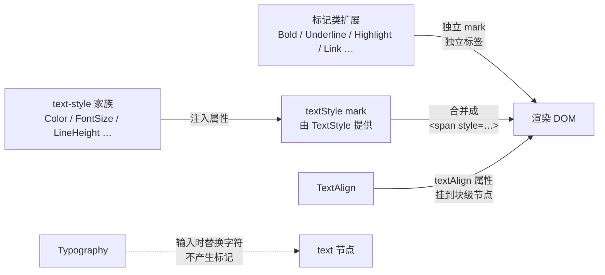

import { Canvas, Controls, Meta } from '@storybook/addon-docs/blocks';
import * as TextStyleExtensionsStories from './text-style-extensions.stories';

<Meta of={TextStyleExtensionsStories} name="Docs" />

# 文本样式扩展

文本样式扩展负责「文字长什么样」。它们分三类工作：标记类扩展把一个 mark 挂到文字上（Bold、Italic、Underline、Highlight、Link 等，各自渲染自己的标签）；text-style 家族把颜色、字号、字体、行高、背景色写进 TextStyle mark 渲染出的同一个 `<span style>`；TextAlign 把对齐属性挂到块级节点上；Typography 则不产生任何标记，只在输入时把 `--`、`1/2` 这类序列替换成排版符号。命令层面全部收敛于[命令课](?path=/docs/commands--docs)讲过的机制：set / toggle / unset 三件套、`isActive` 读状态、空选区切换的是「下一次输入」的格式。

看完开场图和参考表，你应该能预测：给同一段文字同时开加粗和颜色会得到什么 HTML、只装 Color 不装 TextStyle 时 `setColor` 会怎样、打字输入一个网址加空格后会发生什么。



| 扩展 | 输出标签 | 快捷键 | Markdown 输入规则 |
| --- | --- | --- | --- |
| Bold | `strong` | `Mod-b` | `**加粗**`、`__加粗__` |
| Italic | `em` | `Mod-i` | `*斜体*`、`_斜体_` |
| Strike | `s` | `Mod-Shift-s` | `~~删除线~~` |
| Code | `code` | `Mod-e` | `` `代码` `` |
| Underline | `u` | `Mod-u` | — |
| Subscript | `sub` | `Mod-,` | — |
| Superscript | `sup` | `Mod-.` | — |
| Highlight | `mark` | `Mod-Shift-h` | `==高亮==` |
| Link | `a` | 无（建议自绑 `Mod-k`） | 默认关闭，见 `markdownLinks` |
| TextStyle | `span` | — | — |

## 快速上手

一个带全套文本样式的最小编辑器：StarterKit 在 v3 已经包含 Bold、Italic、Underline、Link 等标记类成员，text-style 家族用聚合的 TextStyleKit 一次装齐，Highlight 单独安装。

```ts
import { Editor } from '@tiptap/core';
import { StarterKit } from '@tiptap/starter-kit';
import { TextStyleKit } from '@tiptap/extension-text-style';
import { Highlight } from '@tiptap/extension-highlight';

const editor = new Editor({
  element: document.querySelector('#app'),
  extensions: [
    StarterKit, // 含 Bold、Italic、Underline、Link 等
    TextStyleKit, // TextStyle + Color / FontFamily / FontSize / LineHeight / BackgroundColor
    Highlight, // 需要多色高亮时改用 Highlight.configure({ multicolor: true })
  ],
  content: '<p>选一段文字试试样式。</p>',
});

editor.chain().focus().toggleBold().setColor('#4f7cff').run();
```

## 标记类扩展

标记类扩展的模型是「一个扩展拥有一个 mark 类型」：Bold 注册 bold mark 并渲染 `<strong>`，Italic 渲染 `<em>`，Underline 渲染 `<u>`……mark 挂在 text 节点的 `marks` 数组上、不占树的层级（见[内容与文档模型课](?path=/docs/content-model--docs)），所以叠加多种标记不会改变文档的块级结构——加粗、斜体、链接可以同时存在。

操作统一走三件套命令（`setBold` / `toggleBold` / `unsetBold`，各成员同理），状态用 `isActive` 读取。空选区时 toggle 切换的是 stored marks（下一次输入的格式），已有文档不变——命令课的[扩展命令实例](?path=/docs/commands--docs)演示过这一行为，本课下方的样式实验室同样可以核对。

```ts
editor.commands.toggleBold();
editor.commands.setUnderline();
editor.commands.unsetHighlight();

editor.isActive('bold'); // 光标或选区是否处于加粗状态
```

Markdown 式输入规则随扩展内置：打字过程中输入 `**加粗**`、`*斜体*`、`~~删除线~~`、`` `代码` ``、`==高亮==` 会立即转成对应标记，粘贴时同理——有 Markdown 语法的成员（Bold、Italic、Strike、Code、Highlight）各自自带 inputRegex 与 pasteRegex。关闭或调整这些规则属于扩展定制，见[快捷键与输入规则课](?path=/docs/keyboard-input-rules--docs)。

两个值得记住的边界：

- **输出归一化。** 初始内容里的 `<b>`、`<strong>`、`style="font-weight: ..."` 解析后都会归一成 `<strong>` 输出；Underline 同理把 `<u>` 与 `text-decoration: underline` 归一成 `<u>`。判断内容是否变化应比较 JSON 而不是 HTML 字符串。
- **Code 与其他标记互斥。** Code mark 声明 `excludes: '_'`，与加粗等标记不能共存；`exitable: true` 让光标可以用方向键移出代码片段，不会被一直困在标记内。

Highlight 默认单色（`multicolor` 默认 `false`），`<mark>` 只带浏览器默认的黄色底；开启 `Highlight.configure({ multicolor: true })` 后，命令可以带颜色参数，渲染成 `<mark data-color="…" style="background-color: …; color: inherit">`：

```ts
Highlight.configure({ multicolor: true });

editor.commands.toggleHighlight({ color: '#ffe08a' });
editor.isActive('highlight', { color: '#ffe08a' }); // 带属性判断
```

## text-style 家族

Color、FontFamily、FontSize、LineHeight、BackgroundColor 五个成员不是 Mark，而是五个 Extension：它们各自通过 `addGlobalAttributes` 往 `types` 指定的对象上注入一个属性，默认 `types: ['textStyle']`——也就是全部写进 TextStyle 这个 mark。TextStyle 是唯一的宿主：解析所有带 `style` 的 `<span>`、渲染 `<span>` 标签；家族的多个属性最后合并成同一个 `<span style="color: …; font-size: …">`。所以「文字颜色 + 字号」叠加后读数里只有一个 textStyle mark，`getAttributes('textStyle')` 一次读出全部属性。

| 扩展 | 注入属性 | set 命令 | unset 命令 |
| --- | --- | --- | --- |
| Color | `color` | `setColor(color)` | `unsetColor()` |
| FontFamily | `fontFamily` | `setFontFamily(fontFamily)` | `unsetFontFamily()` |
| FontSize | `fontSize` | `setFontSize(fontSize)` | `unsetFontSize()` |
| LineHeight | `lineHeight` | `setLineHeight(lineHeight)` | `unsetLineHeight()` |
| BackgroundColor | `backgroundColor` | `setBackgroundColor(backgroundColor)` | `unsetBackgroundColor()` |

家族成员没有快捷键，也没有 Markdown 输入规则；set 命令内部就是 `setMark('textStyle', attrs)`，unset 命令把属性置回 `null` 后再调 `removeEmptyTextStyle()` 清掉失去样式的 span。

### TextStyle：宿主与 span

TextStyle 自己只做两件事：渲染 `<span>`（优先级 `priority: 101`）和解析所有带 `style` 属性的 span（`consuming: false`——解析完不独占标签，样式值留给家族扩展的 parseHTML 认领）。它注册两条命令：`toggleTextStyle(attributes)` 切换一组样式属性，`removeEmptyTextStyle()` 移除选区内所有没有任何样式值的空 span。选项 `mergeNestedSpanStyles` 默认 `true`，解析其他编辑器产出的嵌套 span 时把父级样式合并进子级，避免样式丢失。

```ts
import { TextStyle } from '@tiptap/extension-text-style';

editor.commands.toggleTextStyle({ color: 'red' }); // 切换 textStyle 属性
editor.commands.removeEmptyTextStyle(); // 清掉没有样式值的 span
```

### 子路径与 TextStyleKit

五个家族成员与 TextStyle 全部来自 `@tiptap/extension-text-style` 包：主入口一次全拿，也可以按需从子路径引入（`@tiptap/extension-text-style/color`、`/font-size` 等）。TextStyleKit 是全家的聚合入口，逐项传 `false` 关闭成员、传对象配置成员：

```ts
import { TextStyleKit } from '@tiptap/extension-text-style';

TextStyleKit.configure({
  backgroundColor: false, // 不注册 BackgroundColor
  fontSize: { types: ['heading', 'paragraph'] }, // 配置成员选项
});
```

### 挂到块级节点：types 配置

`types` 不必是 `['textStyle']`。改成块级节点后，属性由 span 转移到块级标签上——行高、对齐这类「整段统一」的样式通常这样挂：

```ts
FontSize.configure({ types: ['heading', 'paragraph'] });
// setFontSize('20px') 之后： <h2 style="font-size: 20px">…</h2>
```

### 宿主缺失与空 span 清理

家族扩展只是属性注入器，mark 与 `<span>` 全靠 TextStyle 提供。只装 Color 不装 TextStyle 时，`setColor` 会直接抛错 `There is no mark type named 'textStyle'. Maybe you forgot to add the extension?`——setMark 在 schema 里找不到这个 mark 类型就会抛出。下面的实例把两台编辑器放在一起执行同样的命令，对照有宿主与无宿主的差异；同时核对 unset 的自动清理——`unsetColor` 之后 HTML 回到没有 span 的原始状态，不会留下残留。

<Canvas of={TextStyleExtensionsStories.SpanHost} />

| 读者操作 | 可观察证据 |
| --- | --- |
| 点「setColor」 | 左侧（只有 Color）结果行显示抛错信息，内容不变；右侧正常写入 `<span style="color: …">` |
| 点「unsetColor」 | 右侧结果行回到 `<p>…</p>`，没有残留空 span；左侧依旧抛错 |
| 打开 Show code | 看到该 Canvas 实际执行的 `span-host.ts` |

## 样式叠加与读取

标记类与家族类可以自由叠加：每个标记类扩展是独立 mark，家族属性合并进唯一的 textStyle mark。读取走两条 API——`isActive`（可带属性）回答状态，`getAttributes` 读当前选区挂的属性。下面的实验室把两类操作放在一起，读数实时显示选区 marks、textStyle 属性与渲染出的 span 标签。

<Canvas of={TextStyleExtensionsStories.StyleLab} />
<Controls of={TextStyleExtensionsStories.StyleLab} />

| 读者操作 | 可观察证据 |
| --- | --- |
| 选中文字，依次点「加粗」「文字颜色」「字号 20px」 | 「选区 marks」显示 `bold、textStyle` 两项；「span 标签」同时带上 `color` 与 `font-size` |
| 点「高亮」与「背景色」对比 | 高亮让 marks 多出独立的 `highlight` 项；背景色只出现在 textStyle 属性里——两种底色的实现路径不同 |
| 光标停在文字之间（空选区）点「加粗」 | 「选区 marks」立即显示 bold——切换的是下一次输入的格式 |
| 切换「文字颜色」控件再点「文字颜色」 | textStyle 属性中的 color 换成新色值，span 标签同步 |
| 点「清除全部」 | marks 与属性读数清空——`unsetAllMarks` 移除包括 textStyle 在内的全部标记 |
| 打开 Show code | 看到该 Canvas 实际执行的 `style-lab.ts` |

```ts
editor.isActive('bold'); // 标记状态（空选区时读 stored marks）
editor.isActive('highlight', { color: '#ffe08a' }); // 带属性判断
editor.getAttributes('textStyle'); // { color, fontFamily, fontSize, lineHeight, backgroundColor }
```

一个容易误判的点：FontFamily 的属性判断依赖浏览器解析——`isActive('textStyle', { fontFamily: 'Inter' })` 比较的是 CSS 解析后的字体值，可能与设置值不同（字体回退链被展开）；需要精确判断设置值时读 `getAttributes('textStyle').fontFamily`。

## 链接：Link

Link 也是 mark（渲染 `<a>`），但它带着一整套行为配置：打字自动加链接、粘贴 URL 转链接、点击行为与安全校验，都有对应选项。下面的实例关掉了「点击打开」以便在页面内观察，配置了 `enableClickSelection` 让点击选中整个链接。

<Canvas of={TextStyleExtensionsStories.LinkBehavior} />
<Controls of={TextStyleExtensionsStories.LinkBehavior} />

| 读者操作 | 可观察证据 |
| --- | --- |
| 选中纯文本，点「为选区设置链接」 | 「选区 href」读数变为「链接地址」控件里的 URL，文档中链接数加一 |
| 点编辑器里的链接 | 点击不打开页面，选区扩展到整个链接，href 读数同步显示 |
| 点「模拟输入网址」 | 文档末尾追加的 URL 文本在空格触发后自动变成链接 |
| 点「移除链接」 | href 读数回到「—」，链接数减一 |
| 打开 Show code | 看到该 Canvas 实际执行的 `link-behavior.ts` |

### 配置与默认行为

| 选项 | 默认值 | 作用 |
| --- | --- | --- |
| `autolink` | `true` | 打字时自动把 URL 文本转为链接 |
| `linkOnPaste` | `true` | 粘贴的内容是纯 URL 时，链接到当前选区 |
| `openOnClick` | `true` | 点击链接时 `window.open` 打开 |
| `enableClickSelection` | `false` | 点击时把选区扩展到整个链接 |
| `defaultProtocol` | `'http'` | URL 没写协议时的补全值（`example.com` → `http://example.com`） |
| `protocols` | `[]` | 额外放行的协议（`'ftp'`、`{ scheme: 'tel', optionalSlashes: true }`） |
| `markdownLinks` | `false` | 输入 / 粘贴 `[文本](URL)` 语法时转为链接 |
| `HTMLAttributes` | `{ target: '_blank', rel: 'noopener noreferrer nofollow' }` | 渲染 `<a>` 的默认属性 |
| `isAllowedUri` | 内置白名单校验 | URL 校验入口，拦截 `javascript:` 等危险协议 |
| `shouldAutoLink` | `() => true` | 已通过校验的 URL 是否真的自动加链接 |
| `validate` | — | 已废弃，被 `shouldAutoLink` 取代 |

默认在**新标签页**打开且带 `rel="noopener noreferrer nofollow"`。想当前页打开或去掉 nofollow，用 `HTMLAttributes` 覆盖：

```ts
Link.configure({
  HTMLAttributes: {
    target: null, // 去掉默认的 _blank
    rel: 'noopener noreferrer', // 去掉 nofollow
  },
});
```

### 命令与读取

```ts
editor.commands.setLink({ href: 'https://tiptap.dev' }); // 不合法的 href 直接返回 false
editor.commands.toggleLink({ href: 'https://tiptap.dev' }); // toggle 自带 extendEmptyMarkRange
editor.commands.unsetLink(); // 移除链接（同样扩展到整个标记范围）

editor.getAttributes('link').href; // 读取当前选区链接的 href
editor.isActive('link'); // 光标是否在链接内
```

没有默认快捷键；官方建议为自己的链接输入界面绑定 `Mod-k`（见[快捷键与输入规则课](?path=/docs/keyboard-input-rules--docs)）。

### 自动加链接

autolink 是一个 ProseMirror 插件：文档变化后检查变更范围里「空白前的最后一个词」，能被识别为 URL 就补上 link mark——所以**触发条件是 URL 后面出现空白**（空格或回车），而不是「输入到 URL 末尾」就转。粘贴纯 URL 由 `linkOnPaste` 处理，语义是「链接到当前选区」而不是插入。两个回调控制放行策略：`isAllowedUri` 是安全校验（防 XSS），`shouldAutoLink` 决定业务上要不要转（例如只自动转 `https://` 开头）。

```ts
Link.configure({
  shouldAutoLink: (url) => url.startsWith('https://'),
  isAllowedUri: (url, { defaultValidate }) =>
    url.startsWith('./') || defaultValidate(url), // 额外放行相对路径
});
```

## 对齐与排版

### TextAlign：块级对齐

TextAlign 来自 `@tiptap/extension-text-align`，模型与 text-style 家族相同——通过全局属性注入，但 `types` 指向**块级节点**（`textAlign` 属性渲染在块级标签的 `style="text-align: …"` 上）。`types` 默认是空数组，不配置就什么都不生效。命令与快捷键：

```ts
TextAlign.configure({ types: ['heading', 'paragraph'] });

editor.commands.setTextAlign('center'); // 设置；不在 alignments 里则返回 false
editor.commands.toggleTextAlign('right'); // 已是该值则移除
editor.commands.unsetTextAlign(); // 移除（resetAttributes 回到 defaultAlignment）
```

| 选项 | 默认值 | 作用 |
| --- | --- | --- |
| `types` | `[]` | 属性挂到哪些块级节点，必配 |
| `alignments` | `['left', 'center', 'right', 'justify']` | 允许的对齐值 |
| `defaultAlignment` | `null` | 属性默认值；unset 后回到它 |

快捷键 `Mod-Shift-l` / `Mod-Shift-e` / `Mod-Shift-r` / `Mod-Shift-j` 对应左 / 居中 / 右 / 两端。一个已知限制：Firefox 里 `text-align: justify` 与 `white-space: pre-wrap` 组合不生效。

### Typography：输入时替换排版符号

Typography 来自 `@tiptap/extension-typography`，是一组纯输入规则：打字命中触发序列就替换成排版字符。不产生标记、不加属性，输出就是普通文本；替换后立刻按 Backspace 可以撤销（输入规则的标准行为）。全部规则都可作为选项配置——传 `false` 关闭，传字符串改输出：

```ts
Typography.configure({
  oneHalf: '1 / 2', // 输入 1/2 后插入 "1 / 2" 而不是 ½
  oneQuarter: false, // 关闭 1/4 → ¼
});
```

| 触发 | 输出 | 触发 | 输出 |
| --- | --- | --- | --- |
| `--` | — | `(c)` | © |
| `...` | … | `(r)` | ® |
| `<<` / `>>` | « / » | `(tm)` | ™ |
| `+/-` | ± | `(sm)` | ℠ |
| `!=` | ≠ | `1/2` `1/4` `3/4` | ½ ¼ ¾ |
| `<-` / `->` | ← / → | `^2` `^3` | ² ³ |
| `2*3` 或 `2x3` | 2×3 | 引号规则（四条） | “ ” ‘ ’ |

引号规则支持 RTL 文案：给 `doubleQuotes` / `singleQuotes` 传 `{ rtl: { open, close } }` 可以替换成 RTL 引号，显式配置优先于编辑器的 `textDirection` 设置。

## 最佳实践

- **菜单按钮三件套不变：** 高亮用 `isActive`（带属性判断多色高亮）、禁用用 `can()`、执行用 `chain().focus()…run()`；文本样式扩展全部遵守命令课的这套信号。
- **text-style 家族统一从 `@tiptap/extension-text-style` 引入，并用 TextStyleKit 起步。** 家族成员单独引入时极易漏装 TextStyle（Color 报错的最常见原因）；TextStyleKit 保证宿主与成员一起注册。
- **需要多色高亮时显式开 `multicolor`。** 默认的 Highlight 只有浏览器默认黄色；`toggleHighlight({ color })` 传色值必须配合 `Highlight.configure({ multicolor: true })`。
- **整段统一的样式挂块级节点，行内装饰才用 span。** 行高、对齐传 `types: ['heading', 'paragraph']` 挂到块级标签；颜色、字号这类真正的行内样式留给默认的 textStyle。
- **链接保留默认安全配置。** `rel="noopener noreferrer nofollow"` 与 `isAllowedUri` 白名单是默认防线；自定义协议加进 `protocols`，业务过滤用 `shouldAutoLink`，不要绕过校验。

## 常见问题

- 调用 `setColor` 报错 `There is no mark type named 'textStyle'`
  把 `TextStyle` 和 `Color` 一起装上——家族扩展只注入属性，mark 与 `<span>` 由 TextStyle 提供；TextStyleKit 可以一次装齐，避免再漏。
- 自己 `setMark('textStyle', …)` 之后，getHTML 里留下空的 `<span>`
  调一次 `editor.commands.removeEmptyTextStyle()`。家族的 unset 命令内置了这一步清理，手动 setMark 不会；写循环改属性的场景收尾时记得清一次。
- 打字输入网址没有变成链接
  autolink 的触发条件是 URL 文本后出现空白（空格或回车），真实打字与程序化插入一视同仁。仍不生效时依次检查 `autolink` 是否被关、URL 协议是否在 `protocols` 放行（如 `ftp:`）、`isAllowedUri` / `shouldAutoLink` 是否拦截了该地址。
- TextAlign 装上后命令无效
  `types` 默认是空数组。配置 `TextAlign.configure({ types: ['heading', 'paragraph'] })` 后命令才会作用于对应节点；`alignments` 之外的取值会被 `setTextAlign` 拒绝并返回 `false`。
- 点击链接直接跳出了编辑器页面
  `openOnClick` 默认 `true` 且直接 `window.open`。编辑态通常配 `openOnClick: false`，把点击交给自定义浮层编辑链接；需要「点击选中整个链接」时再开 `enableClickSelection: true`。
- `isActive('textStyle', { fontFamily: 'Inter' })` 判断不准
  浏览器把 font-family 解析成计算值（含回退链），与设置值字符串可能不等；需要按设置值判断时改读 `getAttributes('textStyle').fontFamily`。

## 总结回顾

摘要：

文本样式扩展分三类：标记类扩展各自拥有一个 mark（Bold、Italic、Strike、Code、Underline、Subscript、Superscript、Highlight、Link、TextStyle），三件套命令操作、`isActive` 读状态、自带 Markdown 输入规则，输出标签归一化（`strong`、`u`），Code 与其他标记互斥且可 `exitable`。text-style 家族（Color、FontFamily、FontSize、LineHeight、BackgroundColor）是五个 Extension，把属性注入 TextStyle mark 渲染的同一个 `<span style>`——样式实验室里「高亮新增独立 mark、背景色写进 span 属性」对照了两种底色路径；TextStyle 是唯一宿主，缺了它 `setColor` 直接抛错，宿主实例演示了这一点与 unset 的自动清理。Link 是带行为的 mark：autolink 在 URL 后出现空白时触发、`linkOnPaste` 链接当前选区、默认新标签页打开并带 nofollow，安全由 `isAllowedUri` 与 `shouldAutoLink` 把关。TextAlign 用同样的全局属性机制挂块级节点（`types` 必配），Typography 只是输入规则集合，不产生任何标记。

一句话：

> 标记类扩展各挂一个 mark，text-style 家族共享 TextStyle 的一个 span——判断样式走 isActive / getAttributes，设置样式走三件套命令，宿主 TextStyle 必须在位。

知识要点：

- 标记类扩展共享哪些命令与快捷键？Markdown 输入规则在打字与粘贴时分别怎么触发？
- 为什么叠加多种样式不会改变文档树？textStyle 家族的属性写在哪里、读哪个 API？
- Highlight 的 `multicolor` 开与不开，命令和渲染各有什么差别？
- 只装 Color 不装 TextStyle 时 `setColor` 会发生什么？为什么？
- Link 的 autolink 触发条件是什么？`linkOnPaste`、`markdownLinks`、`enableClickSelection` 各管什么？默认 `target` 与 `rel` 是什么？
- TextAlign 的 `types`、`alignments`、`defaultAlignment` 默认值是什么？为什么装了没反应？
- Typography 替换发生在什么时机？怎么关闭或覆盖一条规则？

## 参考资料

- [Bold | Tiptap Editor Docs](https://tiptap.dev/docs/editor/extensions/marks/bold)
- [Underline | Tiptap Editor Docs](https://tiptap.dev/docs/editor/extensions/marks/underline)
- [TextStyle | Tiptap Editor Docs](https://tiptap.dev/docs/editor/extensions/marks/text-style)
- [Color | Tiptap Editor Docs](https://tiptap.dev/docs/editor/extensions/functionality/color)
- [BackgroundColor | Tiptap Editor Docs](https://tiptap.dev/docs/editor/extensions/functionality/background-color)
- [FontFamily | Tiptap Editor Docs](https://tiptap.dev/docs/editor/extensions/functionality/fontfamily)
- [FontSize | Tiptap Editor Docs](https://tiptap.dev/docs/editor/extensions/functionality/fontsize)
- [Line Height | Tiptap Editor Docs](https://tiptap.dev/docs/editor/extensions/functionality/line-height)
- [Highlight | Tiptap Editor Docs](https://tiptap.dev/docs/editor/extensions/marks/highlight)
- [Link | Tiptap Editor Docs](https://tiptap.dev/docs/editor/extensions/marks/link)
- [TextAlign | Tiptap Editor Docs](https://tiptap.dev/docs/editor/extensions/functionality/textalign)
- [Typography | Tiptap Editor Docs](https://tiptap.dev/docs/editor/extensions/functionality/typography)
- [TextStyleKit | Tiptap Editor Docs](https://tiptap.dev/docs/editor/extensions/functionality/text-style-kit)
- [getMarkType（textStyle 报错来源）| @tiptap/core 源码](https://github.com/ueberdosis/tiptap/blob/main/packages/core/src/helpers/getMarkType.ts)
- [TextAlign 默认值与命令实现 | @tiptap/extension-text-align 源码](https://github.com/ueberdosis/tiptap/blob/main/packages/extension-text-align/src/text-align.ts)
