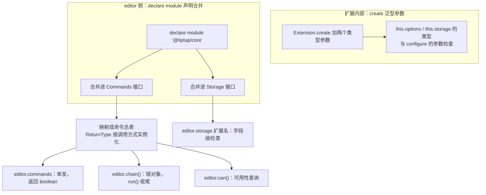

import { Meta } from '@storybook/addon-docs/blocks';

<Meta id="typescript" title="生产化/TypeScript" name="Docs" />

# TypeScript 类型

Tiptap 用 TypeScript 编写，v3 把类型做成了"声明即所得"：只要扩展的类型声明写对位置，`editor.commands` 的补全、`editor.storage.扩展名` 的字段检查就自动就位——不需要给 `Editor` 类传泛型，也不存在一张"类型注册表"要手动登记。反过来，声明缺失或放错轨道时，**代码照常运行，只是补全静默消失或类型退化成 `any`**——这类问题没有运行时报错，只有编译期症状，得按症状反查声明。

本课的核心模型一句话：**类型来自两个空接口和一组泛型参数。** `@tiptap/core` 预置了 `Commands<ReturnType>` 与 `Storage` 两个空接口，扩展作者用 `declare module` 把命令与 storage 类型合并进去，`editor.commands` / `editor.chain()` / `editor.can()` / `editor.storage` 的类型全部由它们推导；扩展内部的 `this.options` / `this.storage` 则由 `create<Options, Storage>` 的泛型参数决定。[自定义 Node 与 Mark 课](?path=/docs/custom-node-mark--docs)在写扩展的流程里演示过命令的 `declare module` 写法，本课把整个类型层系统展开。



三个类型目标的声明方式与生效位置，先放在一张表里供回查：

| 类型目标 | 声明方式 | 生效的访问点 |
| --- | --- | --- |
| 命令 | `declare module` 合并进 `Commands<ReturnType>` | `editor.commands`、`chain()`、`can()` |
| storage | 合并进 `Storage` 接口 **加** `create<O, S>` 第二个泛型参数 | `editor.storage.<扩展名>`、扩展内 `this.storage` |
| options | `create<O, S>` 第一个泛型参数 | 扩展内 `this.options`、`.configure({ ... })` 的参数检查 |

## editor 的类型推导

先看一个容易踩的版本差异：**v3 的 `Editor` 类没有泛型参数。** v2 的 `Editor` 写作 `Editor<Options extends Extensions>`，类型试图跟随 `extensions` 数组推导；v3 的类型重写移除了编辑器级泛型，安装的 3.31.4 里 `Editor` 就是一个普通类，命令与 storage 的访问点直接以合并后的接口为类型：

```ts
// 摘自 @tiptap/core 3.31.4 的 dist/index.d.ts
declare class Editor extends EventEmitter<EditorEvents> {
  get commands(): SingleCommands;
  chain(): ChainedCommands;
  can(): CanCommands;
  get storage(): Storage;
  // …
}
```

这意味着：**类型不随 `extensions` 数组变化，注册扩展本身不会带来任何命令补全**——补全完全取决于 `declare module` 声明有没有被类型系统看到。如果你在旧教程里看到 `Editor<Options extends Extensions>` 泛型或 `ExtensionStorage` / `ExtensionOptions` 接口合并，那是 v2 的写法；v3 只合并 `Commands` 与 `Storage` 两个接口（v2 到 v3 的完整升级清单见[升级与迁移课](?path=/docs/upgrade-migration--docs)）。

那 `SingleCommands` 这些类型又从哪来？核心是两个**空接口**——它们是 core 预留的类型插槽，等着扩展往里合并成员：

```ts
// 摘自 @tiptap/core 3.31.4 的 dist/index.d.ts
interface Commands<ReturnType = any> {}
interface Storage {}
```

core 内部再用映射类型把被合并过的接口展开成命令面。命令的推导链是：`Commands` 接口上每个扩展的分组（如 `bold: { setBold; toggleBold; … }`）先合成一张命令总表，再按调用方式实例化：

```ts
// 摘自 @tiptap/core 3.31.4 的 dist/index.d.ts（有删减）
// 各扩展的命令分组合成一张总表
type UnionCommands<T> = UnionToIntersection</* Commands<T> 各组的值 */>;

// 单发调用：ReturnType 实例化为 boolean
type SingleCommands = { [Item in keyof UnionCommands]: UnionCommands<boolean>[Item] };

// 链式调用：ReturnType 实例化为链对象，链以 run() 收尾
type ChainedCommands = { [Item in keyof UnionCommands]: UnionCommands<ChainedCommands>[Item] } & {
  run: () => boolean;
};

// can() 干跑：命令面与单发相同，另提供 chain()
type CanCommands = SingleCommands & { chain: () => ChainedCommands };
```

storage 的推导链更直接：`Storage` 接口被合并了什么成员，`editor.storage` 上就有什么字段。`editor.storage.characterCount.characters()` 能得到完整补全，靠的是 character-count 扩展包里的一句声明（下文 storage 一节展开）。

官方扩展的 `.d.ts` 就是标准样板。bold 只声明命令、以扩展名分组；heading 的命令参数有自己的类型别名，JSDoc 会跟随补全出现：

```ts
// 摘自 @tiptap/extension-bold 3.31.4 的 dist/index.d.ts
declare module '@tiptap/core' {
  interface Commands<ReturnType> {
    bold: {
      /** Set a bold mark */
      setBold: () => ReturnType;
      /** Toggle a bold mark */
      toggleBold: () => ReturnType;
      /** Unset a bold mark */
      unsetBold: () => ReturnType;
    };
  }
}
```

```ts
// 摘自 @tiptap/extension-heading 3.31.4 的 dist/index.d.ts
type Level = 1 | 2 | 3 | 4 | 5 | 6;

declare module '@tiptap/core' {
  interface Commands<ReturnType> {
    heading: {
      /**
       * Set a heading node
       * @example editor.commands.setHeading({ level: 1 })
       */
      setHeading: (attributes: { level: Level }) => ReturnType;
      toggleHeading: (attributes: { level: Level }) => ReturnType;
    };
  }
}
```

### 命令链的三个形态

同一份 `declare module` 声明，被映射类型实例化成三个命令面——这正是 4.4 课"`=> ReturnType` 由调用方式注入"的机制本体：

| 调用形态 | 类型 | `ReturnType` 取值 | 返回值含义 |
| --- | --- | --- | --- |
| `editor.commands.setBold()` | `SingleCommands` | `boolean` | 命令是否成功 |
| `editor.chain().focus().setBold().run()` | `ChainedCommands` | `ChainedCommands` | 链尾 `.run()` 派发事务，返回整条链各命令返回值的逻辑与 |
| `editor.can().setBold()` | `CanCommands` | `boolean` | 此刻是否可用 |

`ReturnType` 实际只有两个取值：`boolean` 与 `ChainedCommands`。声明里把它写死成 `boolean`，链式调用立刻断型——`.run()` 会报"Property 'run' does not exist on type 'boolean'"。

## 自定义扩展的类型声明

两条轨道的分界线是**访问点在谁手里**：

- **editor 侧的访问点**（`editor.commands.insertShout`、`editor.storage.shout`）：编辑器不知道你的扩展源码在哪，只能通过 `declare module` 合并进 core 的空接口拿到类型。
- **扩展内部的 `this`**（`this.options`、`this.storage`）：类型参数跟着扩展实例走，由 `create<Options, Storage>` 决定，不经过接口合并。

[Extension 体系课](?path=/docs/extension-system--docs)的 Shout 扩展演示过 options 与 storage 的运行时机制。它的范例代码里有这么一行：

```ts
// 摘自 Extension 体系课范例：因为没做 Storage 接口合并，只能强转
const storageTable = current.storage as Record<string, Partial<ShoutStorage> | undefined>;
```

强转就是类型缺位的直接代价。本节把 Shout 的类型层补全，这个 `as` 就能删掉。三段声明与扩展写在同一个文件：

```ts
// shout.ts —— 类型声明与扩展同文件（运行时机制见 Extension 体系课）
import { Extension } from '@tiptap/core';

// options 与 storage 都是普通 interface：形状由你定，运行时默认值在 addOptions / addStorage 里给
export interface ShoutOptions {
  prefix: string;
  suffix: string;
  uppercase: boolean;
}

export interface ShoutStorage {
  applied: number;
}

// editor 侧：合并进两个空接口
declare module '@tiptap/core' {
  // → editor.storage.shout 获得字段检查
  interface Storage {
    shout: ShoutStorage;
  }

  // → editor.commands / chain() / can() 获得补全
  interface Commands<ReturnType> {
    shout: {
      /** 插入一句按 options 加工的文字；JSDoc 会出现在补全提示里 */
      insertShout: (text: string) => ReturnType;
    };
  }
}

// 扩展内部：泛型参数决定 this.options / this.storage 的类型
export const Shout = Extension.create<ShoutOptions, ShoutStorage>({
  name: 'shout',

  addOptions() {
    return { prefix: '【', suffix: '】', uppercase: false };
  },

  addStorage() {
    return { applied: 0 };
  },

  addCommands() {
    return {
      insertShout:
        (text: string) =>
        ({ commands }) => {
          this.storage.applied += 1; // ShoutStorage，字段有检查
          const body = this.options.uppercase ? text.toUpperCase() : text;
          return commands.insertContent({
            type: 'paragraph',
            content: [{ type: 'text', text: `${this.options.prefix}${body}${this.options.suffix}` }],
          });
        },
    };
  },
});
```

使用侧的类型体验：

```ts
editor.chain().focus().insertShout('hello tiptap').run(); // 补全、参数检查、链式不断型

const applied = editor.storage.shout.applied; // number，无需强转
```

### 命令类型

声明有三个要点，与官方扩展的 `.d.ts` 写法一致：

- **以扩展名为命名空间分组**（`shout: { ... }`）。多个扩展的命令合并进同一个 `Commands` 接口，分组避免命令名互相污染。
- **签名末尾必须写 `=> ReturnType`**，机制见上一节"命令链的三个形态"。
- **JSDoc 注释会出现在补全里**——官方指南的原话是"Comments will be added to the autocomplete"，给命令写注释就是给调用方写文档。

声明要生效，三个条件缺一不可（[自定义 Node 与 Mark 课](?path=/docs/custom-node-mark--docs)有完整展开）：文件是模块（顶层有 `import` 或 `export`）、文件被 import 进项目、模块名精确为 `'@tiptap/core'`——包名写错不报错，但合并到了不存在的模块上。

### storage 类型

storage 是唯一需要**两件套**的轨道，官方指南的原文模式：

```ts
import { Extension } from '@tiptap/core';

export interface CustomExtensionStorage {
  awesomeness: number;
}

// 第一件：合并进 Storage 接口 → editor.storage.customExtension 有类型
declare module '@tiptap/core' {
  interface Storage {
    customExtension: CustomExtensionStorage;
  }
}

// 第二件：第二泛型参数 → 扩展内部 this.storage 有类型
const CustomExtension = Extension.create<{}, CustomExtensionStorage>({
  /* … */
});
```

真实的官方扩展也是这么写的，character-count 的声明：

```ts
// 摘自 @tiptap/extensions 3.31.4 的 character-count 声明
interface CharacterCountStorage {
  characters: (options?: { node?: Node; mode?: 'textSize' | 'nodeSize' }) => number;
  words: (options?: { node?: Node }) => number;
}

declare module '@tiptap/core' {
  interface Storage {
    characterCount: CharacterCountStorage;
  }
}

declare const CharacterCount: Extension<CharacterCountOptions, CharacterCountStorage>;
```

两件各管一个访问点，漏一件各有一种症状：

| 漏了哪件 | 症状 |
| --- | --- |
| 漏 `interface Storage` 合并 | `editor.storage.shout` 报错 Property 'shout' does not exist on type 'Storage' |
| 漏第二个泛型参数 | `this.storage.applied` 不报错但毫无检查（`S` 默认 `any`），写错属性名也放行 |

### options 类型

options 只需要**一件**：声明 interface，传给 `create` 的第一个泛型参数。类型随后出现在两个地方——扩展内的 `this.options`，与使用者 `.configure({ ... })` 的参数检查（`configure(options?: Partial<Options>)`，传不存在的键会报错）：

```ts
export interface ShoutOptions {
  prefix: string;
  suffix: string;
  uppercase: boolean;
}

export const Shout = Extension.create<ShoutOptions, ShoutStorage>({ /* … */ });

Shout.configure({ prefix: '≫ ' }); // 通过：prefix 在 ShoutOptions 里
Shout.configure({ prfix: '≫ ' });  // 编译期报错：不存在的键
```

两个容易误判的点：

- **`addOptions` 的默认值不是类型来源。** `create<O = any, S = any>` 的泛型默认是 `any`——只在 `addOptions` 里返回默认值、不给泛型参数，`this.options` 仍是 `any`。类型必须由 interface 显式声明，默认值只决定运行时形状。
- **v3 的 options 不需要接口合并。** v2 文档里常见的 `interface ExtensionOptions` 合并写法已随类型重写废弃；v3 里 options 的类型只走泛型参数。Node 与 Mark 同理：`Node.create<Options, Storage>`、`Mark.create<Options, Storage>`。

`extend` 的类型默认延续原扩展：`Shout.extend({ addOptions() { return { ...this.parent?.(), uppercase: true } } })` 不改形状，`ShoutOptions` 原样保留；形状要变时用 `extend<ExtendedOptions, ExtendedStorage>` 显式指定新类型。

## 内容与 JSON 的类型

所有收内容的入口共用同一个联合类型：

```ts
// 摘自 @tiptap/core 3.31.4 的 dist/index.d.ts
type HTMLContent = string;
type Content = HTMLContent | JSONContent | JSONContent[] | null;
```

`EditorOptions.content`（编辑器初始内容）、`editor.commands.setContent()` 与 `insertContent()`、服务端 `generateHTML()` / `generateJSON()`（见[输出与静态渲染课](?path=/docs/output-rendering--docs)）都收 `Content`。它的主力成员 `JSONContent` 的完整结构：

| 字段 | 类型 | 说明 |
| --- | --- | --- |
| `type?` | `string` | 节点 / 标记类型名 |
| `attrs?` | `Record<string, any>` | 属性，任意可 JSON 序列化的值 |
| `content?` | `JSONContent[]` | 子节点 |
| `marks?` | `{ type: string; attrs?: Record<string, any> }[]` | 行内标记 |
| `text?` | `string` | 仅 text 节点携带 |
| （索引签名） | `[key: string]: any` | 任意额外字段都放行 |

关键边界就藏在最后一行：**`JSONContent` 描述的是"形状"，不是"词汇表"。** 索引签名让 `type: '不存在的节点'`、`{ type: 'h1' }` 这类笔误全部通过编译——内容合法性的真正裁决者是 schema，在运行时解析阶段处理（[内容与文档模型课](?path=/docs/content-model--docs)）。TypeScript 在内容上的价值是结构层面的：写错字段名（`contnet`）、给 `content` 塞非数组，能被拦下。

读侧不需要自己声明：`editor.getJSON()` 的返回值由 core 预先用辅助类型标注（3.31.4 里正是 `DocumentType<...>`），读出来的文档自带形状，也可直接当 `JSONContent` 用。

写侧想在编译期收紧词汇表，v3 提供了一组精确标注辅助类型。core 自身 API 仍收宽松的 `Content`，这些类型用在**你自己的包装函数签名**上：

| 辅助类型 | 标注的形状 |
| --- | --- |
| `MarkType<Type, Attrs>` | `{ type; attrs }` |
| `NodeType<Type, Attrs, Marks, Content>` | `{ type; attrs; content?; marks? }` |
| `TextType<Marks>` | `{ type: 'text'; text; marks }` |
| `DocumentType<Attrs, Content>` | doc 节点形状 |

```ts
import type { NodeType } from '@tiptap/core';

type HeadingNode = NodeType<'heading', { level: 1 | 2 | 3 }>;

function insertHeading(node: HeadingNode) {
  editor.commands.insertContent(node);
}

insertHeading({ type: 'heading', attrs: { level: 2 } }); // 通过
insertHeading({ type: 'h2' });                           // 编译期报错：type 不在词汇表里
```

## 最佳实践

- **声明与扩展同文件。** 生效条件里"被 import"最容易漏，同文件让它不可能漏；官方扩展包正是这样组织的——`.d.ts` 里 `declare module` 与实现声明同在（bold、heading 均如此）。项目级声明集中放 `.d.ts` 也可以，但必须确保它在 tsconfig 的 include 范围内。
- **`ReturnType` 永远原样透传。** 它由调用方式注入 boolean 或链对象；写死返回类型即断链，单发与链式共用一份声明的好处也随之消失。
- **先问访问点，再选轨道。** 类型要用在 editor 侧（`editor.commands`、`editor.storage.扩展名`）就合并进空接口；要用在扩展内部 `this` 上就给 `create` 泛型参数。options 永远只需要泛型，storage 永远是两件套。
- **给命令参数写具体类型与 JSDoc。** `setHeading({ level: Level })` 这种签名让错误参数在调用点就被拦下，注释进补全——补全即文档。

## 常见问题

- 照 v2 教程写 `Editor<Options extends Extensions>`，报 "Type 'Editor' is not generic"
  v3 移除了编辑器级泛型：直接 `new Editor({ extensions: [...] })`，命令与 storage 类型全部走 `declare module` 接口合并。旧资料里的 `ExtensionStorage` / `ExtensionOptions` 接口合并同样是 v2 写法，v3 只认 `Commands` 与 `Storage` 两个接口。
- 链式调用报 "Property 'run' does not exist on type 'boolean'"
  命令声明把返回类型写死成了 `boolean`。改回 `=> ReturnType`：ReturnType 由调用方式注入，单发是 boolean、链式是链对象，写死即断链。
- `editor.storage.shout` 报 "Property 'shout' does not exist on type 'Storage'"
  `interface Storage` 合并缺失或没被类型系统看到。核对三件事：`declare module '@tiptap/core' { interface Storage { shout: ShoutStorage } }` 存在、所在文件被 import、包名拼写精确。
- 扩展内 `this.storage.applied` 没有提示，写错属性名也不报错
  `create` 少了第二个泛型参数，storage 形状默认 `any`。补成 `Extension.create<ShoutOptions, ShoutStorage>`。
- 写了 `declare module` 但 `editor.commands.xxx` 仍无补全
  三个生效条件逐一核对：文件顶层有 `import` / `export`（是模块）、文件被 import 进项目、模块名精确为 `'@tiptap/core'`；详见[自定义 Node 与 Mark 课](?path=/docs/custom-node-mark--docs)。
- `insertContent({ type: 'h1' })` 类型不报错，运行时内容没出现
  `JSONContent` 的索引签名放行任意字符串 type——类型层不认识"词汇表"，合法性由 schema 在运行时判定。要在编译期拦截，用 `NodeType` 给自建包装函数的参数标注（见"内容与 JSON 的类型"一节）。

## 总结回顾

摘要：

v3 的类型体系围绕两个空接口与一组泛型参数运转：`@tiptap/core` 预置 `Commands<ReturnType>` 与 `Storage`，扩展用 `declare module` 把命令分组与 storage 形状合并进去，core 再用映射类型把合并结果展开——单发调用得 `SingleCommands`（boolean）、链式得 `ChainedCommands`（链对象加 `run()`）、`can()` 得 `CanCommands`，`editor.storage` 则直接呈现合并后的字段。`Editor` 类在 v3 没有泛型，类型不随 `extensions` 数组推导，声明到位补全才在。扩展内部的 `this.options` / `this.storage` 由 `create<Options, Storage>` 决定：options 一件泛型参数即可，storage 必须接口合并加泛型两件套，漏一件各有一种症状。内容层面，`Content` 联合类型与宽松的 `JSONContent`（含索引签名）只约束形状不约束词汇表——节点类型是否合法由 schema 运行时裁决，想提前到编译期就用 `NodeType` 等辅助类型给自建包装函数的参数标注。

一句话：

> v3 的类型模型：扩展内部 `this` 靠 `create<Options, Storage>` 泛型参数，editor 侧访问点靠 `declare module` 合并进 `Commands` 与 `Storage` 两个空接口——`Editor` 类本身没有泛型，声明写对轨道，补全自动就位。

知识要点：

- `editor.commands`、`chain()`、`can()`、`editor.storage` 的类型各自从哪里推导而来？`ReturnType` 有哪两个取值？
- v2 的 `Editor<Options extends Extensions>` 在 v3 变成了什么？为什么"注册了扩展"不等于"有了命令补全"？
- 命令、storage、options 三条类型轨道各怎么声明？storage 为什么是两件套，漏一件各是什么症状？
- 为什么 `addOptions` 的默认值不能替代 options 的类型声明？v3 里 options 还需要接口合并吗？
- `JSONContent` 有哪些字段？为什么类型层防不住"不存在的节点类型"？想在编译期收紧该用什么？
- 命令声明写死 `=> boolean` 会破坏什么？报错信息是什么？

## 参考资料

- [Working with TypeScript | Tiptap Guide](https://tiptap.dev/docs/guides/typescript)
  options / storage / command 三种类型声明的官方指南；storage 两件套与"Comments will be added to the autocomplete"的表述来源。
- [Node API | Tiptap Editor Docs](https://tiptap.dev/docs/editor/extensions/custom-extensions/create-new/node)
  Node 扩展配置的声明字段与 `addOptions` 写法核对。
- [Mark API | Tiptap Editor Docs](https://tiptap.dev/docs/editor/extensions/custom-extensions/create-new/mark)
  Mark 扩展配置的声明字段核对。
- [What's new in Tiptap v3 | Tiptap Docs](https://tiptap.dev/docs/resources/whats-new)
  v3 "stricter typing" 的官方表述与升级指引入口。
- [ueberdosis/tiptap 仓库](https://github.com/ueberdosis/tiptap)
  本课类型结论均对照 `@tiptap/core` 3.31.4 的 `dist/index.d.ts` 与 `@tiptap/extension-bold`、`@tiptap/extension-heading`、`@tiptap/extensions`（character-count）的 `.d.ts` 核实；`Editor` 泛型的 v2/v3 差异以安装版 `.d.ts` 为准。
