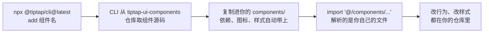

import { Meta } from '@storybook/addon-docs/blocks';

<Meta id="ui-components" title="框架集成与生态/UI Components" name="Docs" />

# UI Components

Tiptap 本体不给菜单——[菜单一课](?path=/docs/menus--docs)里两个菜单扩展只管显隐与定位，按钮 DOM 得自己写。UI Components 是官方补上的那一层：一套基于 React 的现成界面组件（加粗按钮、标题下拉、链接浮层、工具栏……），内部调用与手写菜单相同的命令与状态 API。它的分发方式在组件库里少见：组件不发 npm 包，而是用官方 CLI 把**源码**复制进你的项目——`import` 路径指向你自己仓库里的 `components/` 目录，拿到即拥有，改样式改逻辑都在自己的代码里进行。代价是生态绑定：组件由 JSX 与 React hooks 写成，原生 JS 工作区不能直接挂载，只能借用它的思路。

看完开场图和参考表，你应该能预测：`add` 之后组件落在哪个目录、样式没生效先查哪个文件、原生 JS 项目为什么用不了它。



| 复制后的目录前缀 | 放什么 | 回查要点 |
| --- | --- | --- |
| `components/tiptap-ui/` | 功能组件：`MarkButton`、`HeadingDropdownMenu`、`ListButton`、`LinkPopover`、`ImageUploadButton` 等 | 一个组件配一个编辑器特性与对应扩展 |
| `components/tiptap-ui-primitive/` | 原语：`Button`、`Toolbar`、`DropdownMenu`、`Popover`、`Spacer` | 不懂 Tiptap 的低层积木，负责无障碍与键盘导航 |
| `components/tiptap-node/` | 节点组件：`image-node`、`code-block-node` 等 | 配套 `*-node-extension`，以 Node View 形式进文档 |
| `components/tiptap-templates/` | 模板：`simple-editor` | 整套编辑器开箱即用 |
| `components/tiptap-icons/` | 组件引用的图标 | 随组件依赖自动带入 |

说明：本工作区以原生 TypeScript + DOM 编写示例（见 NOTE.md），不安装 React 与 `@tiptap/cli`；本课为文档讲解课，所有命令与代码均无需在本工作区执行，目录结构以官方 tiptap-ui-components 仓库核对过。

## 快速上手

两条路：要整套用模板，要单件用 `add`。模板与组件全部按源码复制：

```bash
# 新项目：脚手架 + 模板一步到位
npx @tiptap/cli@latest init simple-editor

# 已有 Vite / Next.js 项目：只复制模板源码
npx @tiptap/cli@latest add simple-editor
```

在入口渲染模板（导入路径就在你的源码里）：

```tsx
import { SimpleEditor } from '@/components/tiptap-templates/simple/components/simple-editor';

export default function App() {
  return <SimpleEditor />;
}
```

模板自带 undo/redo、加粗斜体下划线、列表与任务列表、多级标题下拉、文本对齐、图片上传、链接浮层、查找替换、明暗主题与移动端适配，整体 MIT 授权。只要单件时按组件名添加，例如 `npx @tiptap/cli@latest add mark-button`。注意 `add` 完页面不会自己长出编辑器——CLI 只把源码放进 `components/`，import 与渲染是你的事。

## CLI：源码怎样进入项目

| 命令 | 作用 | 关键 flags |
| --- | --- | --- |
| `npx @tiptap/cli@latest init [模板名]` | 空目录搭脚手架；已有项目只做配置与装依赖 | `-f next\|vite`、`--src-dir`、`-c`、`-s` |
| `npx @tiptap/cli@latest add <组件\|模板>` | 把组件或模板源码复制进项目 | `-o` 覆盖同名、`-p` 目标路径 |
| `npx @tiptap/cli@latest info` | 查看项目配置与安装情况 | `-c` |
| `npx @tiptap/cli@latest login / logout / status` | Tiptap Cloud 认证与套餐状态（付费组件用） | `-e`、`-p`、`--write-config` |

依赖自动解析：`add` 一个组件时，它引用的其他组件、hooks、图标、工具库（如 `tiptap-utils`、`react-hotkeys-hook`）一并带入。CLI 只官方支持 Vite 与 Next.js 两类项目；其他技术栈需要从 [tiptap-ui-components 仓库](https://github.com/ueberdosis/tiptap-ui-components)手动搬运源码自行集成。

许可跟着扩展走：开源扩展（Bold、Heading、Image……）对应的组件是 MIT；接 Cloud 的功能（Comments、Version History 等）不开源，需要 Tiptap Cloud 订阅或试用，`login` / `status` 就是为它们准备的。

### 环境要求

官方当前以 React 18 + Next.js 15 为推荐组合；React 19 适配仍在进行中，部分组件可能尚未完全兼容。组件运行在 `@tiptap/react` 的 `EditorContext` 体系上（接入方式见[React 集成课](?path=/docs/react--docs)），并且要求对应扩展已装载：`MarkButton` 要标记扩展在位（StarterKit 自带加粗、斜体、删除线、行内代码，下划线等需另装）。

## 目录结构：复制进来的是什么

上表五个前缀就是复制后的全部家当。`import` 里的 `@/` 别名指向项目源码根（Vite 默认 `src/`），所以 `@/components/tiptap-ui/mark-button` 解析到的是你仓库里的文件，不是 `node_modules`——这是「源码分发」最直接的证据：删掉 `components/`，组件就没了；改了里面的文件，行为就变了。

三层组件各管一段：

- **Components（功能组件）**：一个组件封装一个编辑器特性，自带显隐策略（`hideWhenUnavailable`，条件不满足时整个按钮隐藏）、快捷键注册与无障碍属性。
- **Node Components（节点组件）**：编辑器内容里的节点 UI——图片、代码块等节点的 Node View 外壳，与 `*-node-extension` 成对出现，扩展负责进 schema，组件负责渲染。
- **Primitives（原语）**：不懂 Tiptap 的低层积木，提供焦点管理与键盘导航——`Toolbar` 的 roving focus 模式：方向键在可用控件间移动、Home/End 跳首尾、Tab 直接离开工具栏，禁用项自动跳过。

### mark-button：从组件到 hook

最常用的功能组件长这样：

```tsx
import { MarkButton } from '@/components/tiptap-ui/mark-button';

// type 必填：bold / italic / strike / code / underline / superscript / subscript
<MarkButton editor={editor} type="bold" hideWhenUnavailable showShortcut />
```

想自己画按钮的 DOM 时，退一层用同文件导出的 hook——它返回状态与回调，界面归你：

```tsx
const { isVisible, isActive, canToggle, handleMark } = useMark({ editor, type: 'bold' });
```

三个返回值正好对应菜单一课的手写三件套：`isActive` 对应高亮判断（`editor.isActive('bold')`）、`canToggle` 对应 `can()` 预检、`handleMark` 对应 `chain().focus()…run()`；`isVisible` 则是 `shouldShowButton` 那套显隐判断的封装。组件库没有发明新机制，只是把你在 3.4 手写的判断收进了官方源码。

### toolbar：用原语组装菜单

功能组件与原语自由组合，就是一套工具栏：

```tsx
import { Toolbar, ToolbarGroup, ToolbarSeparator } from '@/components/tiptap-ui-primitive/toolbar';
import { MarkButton } from '@/components/tiptap-ui/mark-button';

<Toolbar variant="fixed">
  <ToolbarGroup>
    <MarkButton editor={editor} type="bold" />
    <MarkButton editor={editor} type="italic" />
  </ToolbarGroup>
  <ToolbarSeparator />
  <ToolbarGroup>{/* 标题下拉、链接浮层等 */}</ToolbarGroup>
</Toolbar>
```

`variant` 取 `'fixed' | 'floating'`（默认 fixed），决定工具栏的样式形态；`Toolbar` 内的按钮用 `data-style="ghost"`、`"primary"` 这类 data 属性切换外观——样式钩子全靠 data 属性，见下一节。

## 样式接入与定制

组件样式用 SCSS 写成。首次 `add` 时 CLI 做两件事：安装 SCSS 编译器（`sass` 或 `sass-embedded`），并把两个导入注入项目全局样式表：

```css
@import '<path-to-styles>/_variables.scss';
@import '<path-to-styles>/_keyframe-animations.scss';
```

注入位置按框架而定：Next.js App Router 是 `app/globals.css`（或 `src/app/globals.css`），Vite + React 是 `src/index.css`。自定义了入口样式表的项目要确认这两个导入还在。Bun 项目的 CLI 会把 `.scss` 转成 `.css` 再更新导入。

定制的正确入口是 `_variables.scss` 里的变量——组件内部靠 `data-style`、`data-plain` 这类 data 属性挂钩子，改变量全局生效；直接散改组件内部样式，会在下次 `add -o` 覆盖时丢掉。

## 与手写菜单的关系：机制不变，UI 易手

回到本课开头的问题：3.4 里菜单扩展只管显隐与定位，UI Components 供给的正是那层你本来要手写的 DOM 与按钮逻辑。分工对照：

| 手写路线（菜单一课） | UI Components 路线 |
| --- | --- |
| `document.createElement` 建菜单 DOM | CLI 复制现成 React 组件进 `components/` |
| `configure({ element })` 交给扩展 | `EditorContext` + 组件 props 接入 |
| `shouldShow` 自己写显隐条件 | `hideWhenUnavailable`、`shouldShowButton` 封装成 hook 返回值 |
| `isActive` / `can()` / `chain().focus()…run()` 三件套 | `isActive` / `canToggle` / `handleMark` 等返回值 |
| 样式与无障碍全部自理 | data 属性挂钩子 + Toolbar roving focus |

对原生 JS 项目，结论要诚实：JSX 与 hooks 离开 React 运行时跑不起来，这套组件**不能直接挂载**。可借走的是思路与素材——组件源码就在你眼前，状态判断（`isActive`、`canToggle`）、`hideWhenUnavailable` 的显隐策略、无障碍属性都可以照抄进手写菜单；样式变量（`_variables.scss`）也可参考。要完整使用它，就得进入 React 项目（见 React 集成课）——这是「源码分发」的另一面：给你代码，不替你选技术栈。

## 最佳实践

- **把复制进来的源码当自己的代码维护。** 升级靠 `add -o` 重新拉取，直接改过的文件会被覆盖——先 diff 再合并，改动越深，升级成本越高。
- **按需 `add`，不要囤货。** 每个组件连同依赖都进你的仓库，就是实打实的维护面；从 `simple-editor` 整套起步再删减，也是常见路径。
- **定制改 `_variables.scss`，不散改组件内部。** data 属性钩子 + 变量是官方预留的定制面。
- **商用前核对许可边界。** 开源扩展对应组件 MIT；Comments、Version History 等 Cloud 组件需订阅，`status` 可查当前套餐。

## 常见问题

- `add` 之后页面没有任何变化
  CLI 只复制源码，不接线。自己 import 组件并渲染（如 `<SimpleEditor />`），同时确认全局样式表里有两个 SCSS 导入。
- 组件能渲染但样式错乱、没有主题
  全局样式表缺 `_variables.scss` 与 `_keyframe-animations.scss` 两个导入——自定义入口样式表或手动集成时最容易漏。
- 非 Vite / Next 项目能跑 CLI 吗
  不能直接用；从 tiptap-ui-components 仓库手动搬源码、按自己构建体系改造，SCSS 编译器要自装。
- React 19 项目能用吗
  官方适配仍在进行中，部分组件可能尚未完全兼容；生产环境以 React 18 + Next.js 15 为稳。
- 原生 JS 项目怎么借力
  不能直接挂载组件；按菜单一课手写菜单，把组件源码里的状态判断与显隐策略抄成原生实现。
- 想要的组件找不到 `add` 的名字
  `add` 的参数就是文档组件页给出的短名（`mark-button`、`toolbar`、`simple-editor`）；以对应组件页或仓库目录里的确切名字为准。

## 总结回顾

摘要：

UI Components 是官方基于 React 的界面组件库，补上 headless 编辑器缺的那层 UI；它不发 npm 包，而是用 `@tiptap/cli` 把组件源码复制进项目的 `components/` 目录——`import` 解析的是你自己的文件，拿到即拥有。CLI 的主命令是 `init`（脚手架或配置）与 `add`（按名复制组件，依赖、图标、样式自动带入），另有 `info` 与面向 Tiptap Cloud 付费组件的 `login` / `status`；官方支持 Vite 与 Next.js，推荐 React 18 + Next.js 15，React 19 适配进行中。复制进来的家当分五类：`tiptap-ui` 功能组件、`tiptap-ui-primitive` 原语、`tiptap-node` 节点组件、`tiptap-templates` 模板与 `tiptap-icons` 图标；`simple-editor` 模板用 `init simple-editor` 或 `add simple-editor` 获取，渲染一个 `<SimpleEditor />` 即得整套编辑器。样式是 SCSS：CLI 自动注入 `_variables.scss` 与 `_keyframe-animations.scss` 到全局样式表，定制改变量而不是改组件内部。组件没有发明新机制——`useMark` 返回的 `isActive` / `canToggle` / `handleMark` 正是菜单一课手写的三件套；原生 JS 项目不能直接挂载这套组件，能借走的是源码里的判断逻辑与样式思路。

一句话：

> UI Components 不是 npm 包，而是「源码送货上门」：CLI 把 React 组件复制进你的 components/，import 的是你自己的文件——代价是必须生活在 React 生态里。

知识要点：

- UI Components 通过什么方式分发？和 `npm install` 的差别是什么？
- `init` 与 `add` 分别做什么？`add` 之后为什么页面不会自己出现编辑器？
- 复制后的五个目录前缀各放什么？`@/` 别名指向哪里？
- Components、Node Components、Primitives 三层各管什么？
- `useMark` 的四个返回值分别对应手写菜单的哪几件事？
- 样式怎么接入？两个必须出现在全局样式表里的导入是什么？定制改哪个文件？
- `simple-editor` 模板怎么获取？包含哪些能力？许可是什么？
- 原生 JS 项目为什么用不了这套组件？可以借走什么？

## 参考资料

- [UI Components Overview | Tiptap UI Components](https://tiptap.dev/docs/ui-components/getting-started/overview)——定位、React 版本要求、许可跟随扩展的分发说明
- [Tiptap CLI | Tiptap UI Components](https://tiptap.dev/docs/ui-components/getting-started/cli)——`init` / `add` / `info` / `login` 等命令与 flags、Vite 与 Next.js 支持
- [Style setup | Tiptap UI Components](https://tiptap.dev/docs/ui-components/getting-started/style)——SCSS 编译器、全局样式表注入位置、Bun 转换
- [Simple template | Tiptap UI Components](https://tiptap.dev/docs/ui-components/templates/simple-editor)——模板获取命令、导入路径、功能与许可清单
- [Components Overview | Tiptap UI Components](https://tiptap.dev/docs/ui-components/components/overview)——Components / Node Components / Primitives 三层分类
- [Mark Button | Tiptap UI Components](https://tiptap.dev/docs/ui-components/components/mark-button)——组件 props、`useMark` hook 返回值、快捷键
- [Toolbar | Tiptap UI Components](https://tiptap.dev/docs/ui-components/primitives/toolbar)——原语用法、roving focus 键盘行为、`variant` 取值
- [ueberdosis/tiptap-ui-components | GitHub](https://github.com/ueberdosis/tiptap-ui-components)——组件源码仓库，目录结构（`tiptap-ui` / `tiptap-ui-primitive` / `tiptap-node` / `tiptap-templates` / `tiptap-icons`）经其 `apps/web/src/components` 核对
