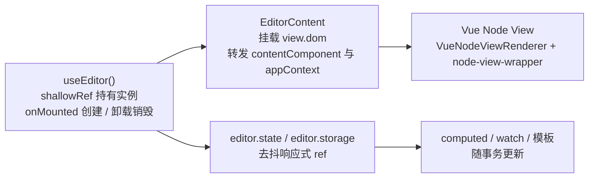

import { Meta } from '@storybook/addon-docs/blocks';

<Meta id="vue" title="框架集成与生态/Vue 集成" name="Docs" />

# Vue 集成

`@tiptap/vue-3` 把编辑器接进 Vue 的动作与 React 版是同一套：用 `useEditor` 管理一次 `new Editor(...)` 的生命周期，用 `EditorContent` 把编辑器 DOM 挂载进组件树，用 `VueNodeViewRenderer` 把节点渲染交给 Vue 组件。但 v3 下两个框架的状态模型方向相反：React 默认零重渲染、靠 `useEditorState` 显式订阅；Vue 版则是一对反向约束——**编辑器实例必须保持非响应式（`shallowRef` + `markRaw`），而它暴露的 `editor.state` 与 `editor.storage` 又是去抖的响应式 ref，读状态的 `computed`、`watch` 和模板天然随事务更新**，因此 `@tiptap/vue-3` 根本没有 `useEditorState`。本课以 vue-3 绑定为主线讲清这条主线的来龙去脉，再覆盖 v-model 包装、菜单组件与 Vue 版 Node View，最后给出与 React 集成的概念对照表。文中默认值均核对到 `@tiptap/vue-3` 3.31.4（npm latest，与手册其余 `@tiptap/*` 包同版）的官方文档与 GitHub 源码（tag v3.31.4）。

说明：本工作区不安装 `@tiptap/vue-3`，本课以源码讲解为主，示例请在读者自己的 Vue 3 项目（Vite、Nuxt 等）中运行验证。



先记最常回查的默认值：

| API / 选项 | 默认值 | 回查要点 |
| --- | --- | --- |
| `useEditor` 创建时机 | `onMounted`（不立即创建） | 没有 `immediatelyRender`；mount 前 `editor.value` 为 `undefined` |
| 实例的响应式容器 | `shallowRef` + 构造器 `markRaw` | 不要自行用 `ref()` / `reactive()` / `data()` 包实例 |
| `editor.state` / `editor.storage` | 去抖响应式（双 `requestAnimationFrame` 后触发） | `computed` 读 `isActive()`、`getHTML()` 等会随事务更新 |
| `BubbleMenu` / `FloatingMenu` 的 `editor` | 必传 | 无 Context 回落；从 `@tiptap/vue-3/menus` 导入 |
| `<node-view-wrapper>` / `<node-view-content>` 的 `as` | `div` | 换标签用 `as`，运行时不可再变 |
| Node View 更新 | 按 `node` 引用比较 | 引用未变只刷新 decoration 类名，不重渲染组件 |
| `trackNodeViewPosition` | `false` | 位置迁移默认不更新组件，`getPos()` 调用时仍取最新值 |
| `selectedOnTextSelection` | `false` | Vue 仍以渲染器选项提供；React 版已改为 `selectionInside` prop |

## 快速上手

装齐三个包（包职责与版本约束见[安装课](?path=/docs/install--docs)，`@tiptap/core` 由 peer 依赖自动带入；`@tiptap/vue-3` 的 peer 里还有 `@floating-ui/dom`，供菜单子路径使用）：

```bash
npm install @tiptap/vue-3 @tiptap/pm @tiptap/starter-kit
```

最小组件只有 `useEditor` 与 `EditorContent` 两个成员（官方 `<script setup>` 写法）：

```vue
<template>
  <editor-content :editor="editor" />
</template>

<script setup>
import { useEditor, EditorContent } from '@tiptap/vue-3'
import StarterKit from '@tiptap/starter-kit'

const editor = useEditor({
  content: '<p>Hello World!</p>',
  extensions: [StarterKit],
})
</script>
```

运行结果是页面上出现一个可输入的编辑器：能打字、换行，StarterKit 的快捷键（如加粗）全部可用。`<script setup>` 的模板会自动解包 ref，`:editor="editor"` 传出的就是编辑器实例（mount 前 `editor.value` 是 `undefined`，`EditorContent` 对此安全）。

对比 React 版有两个立刻可见的差异：这里不需要 `if (!editor) return null` 一类的判空分支（Vue 的实例创建天然推迟到 `onMounted`，SSR 也因此安全）；想要工具栏读数时也没有 `useEditorState` 这样的订阅 API——为什么不需要，下一节解释。

## useEditor

`useEditor` 的源码只有十几行（`packages/vue-3/src/useEditor.ts`），把三件事交给 Vue 的组合式生命周期：

```ts
export const useEditor = (options: Partial<EditorOptions> = {}) => {
  const editor = shallowRef<Editor>()   // 浅层容器，初始 undefined

  onMounted(() => {
    editor.value = new Editor(options)  // 挂载后才创建实例
  })

  onBeforeUnmount(() => {
    editor.value?.destroy()             // 卸载前销毁
  })

  return editor
}
```

要点：

- **返回 `ShallowRef<Editor | undefined>`**：模板自动解包；JS 里要写 `editor.value`。
- **创建时机固定是 `onMounted`**：没有 React 版 `immediatelyRender` 的三个分支，3.31.4 的发布包里不存在该选项。SSR 不执行生命周期钩子，服务端渲染出的就是 `EditorContent` 的空 `div`，客户端水合后实例才创建——两端 DOM 一致，没有 hydration mismatch 问题，官方 Nuxt 指南也因此没有任何 SSR 特殊步骤。
- **销毁固定在 `onBeforeUnmount`**。手写 `new Editor(...)` 的组件要自己在 `onBeforeUnmount` 里调用 `destroy()`（Vue 2 绑定的官方示例用 `beforeDestroy`，同理）。
- **选项就是核心包的 `EditorOptions`**：`extensions`、`content`、`editable`、`autofocus`、`editorProps`、`onUpdate` 等，取值见[配置课](?path=/docs/configure--docs)。React 版特有的 `shouldRerenderOnTransaction` 在 Vue 里不存在。
- **没有 React 版的第二参数 `deps`**："切换文档时重建实例"用模板 `:key` 让组件整体重挂载，或手动 `destroy()` 后重建。

Vue 2 绑定（`@tiptap/vue-2`）与 vue-3 同版本发布（3.31.4，peer 为 `vue: ^2.6.0`），API 形态一致，只作认知：官方示例用 Options API 在 `mounted` 里 `new Editor`，销毁钩子叫 `beforeDestroy`。

## 编辑器实例与 Vue 响应式

React 课的核心判断——实例不随渲染重建、组件不随事务重渲染——在 Vue 里换成了另一对约束：**实例永远不进入深度响应式系统，而它暴露的 `state` 与 `storage` 又必须是响应式的**。两条约束在 Vue 版 `Editor` 类里同时成立（源码 `packages/vue-3/src/Editor.ts`）。

### 不要把实例做成 ref / reactive

编辑器是 ProseMirror 的可变对象，内部挂着视图、状态机与一堆插件；一旦被 Vue 的深层代理包住，每次属性访问都走 Proxy 拦截，性能严重劣化，编辑器内部逻辑也可能被意外的依赖跟踪打乱。绑定层因此做了双重防护：

- `useEditor` 用 **`shallowRef`** 做容器——只跟踪 `.value` 的整体替换，不深入实例内部；
- Vue 版 `Editor` 构造器最后一行 **`return markRaw(this)`**——就算有人把实例放进 `ref()` 或 `reactive()`，Vue 也会跳过对它的代理。

惯例写法就是 `useEditor`；手写时用 `shallowRef`（或 `markRaw(new Editor(...))`）。把实例放进 Options API 的 `data()` 或 `reactive()` 是社区性能问题的常见来源，应当避免——`markRaw` 是兜底，不是许可。

### state 与 storage 是去抖的响应式

`@tiptap/vue-3` 的包入口没有导出 `useEditorState`。Vue 版的对应物是：**`Editor` 类把 `state` 与 `storage` 两个 getter 接到了去抖的 `customRef` 上**（源码节选）：

```ts
// packages/vue-3/src/Editor.ts
this.reactiveState = useDebouncedRef(this.view.state)
this.reactiveExtensionStorage = useDebouncedRef(this.extensionStorage)

this.on('beforeTransaction', ({ nextState }) => {
  this.reactiveState.value = nextState
  this.reactiveExtensionStorage.value = this.extensionStorage
})

get state() {
  return this.reactiveState.value
}
```

`useDebouncedRef` 的行为是"赋值立即生效、通知延迟两帧"：`set` 先更新内部值，再等两层 `requestAnimationFrame` 后才 `trigger()`。于是有一个可直接利用的模型：

- **在 `computed`、`watch` 或模板里读 `editor.state`、`editor.isActive('bold')`、`editor.getHTML()` 都会建立响应式依赖**——这些 API 内部都读 `this.state`（依据 `@tiptap/core` 源码：`isActive` 把 `this.state` 传给判定函数，`getHTML()` 读 `this.state.doc`），事务发生后最多两帧刷新 UI；
- 去抖让同一帧内的连续输入只触发一轮更新，代价是需要逐帧联动的 UI 会有约两帧延迟；
- 订阅粒度不靠选择器，靠组件拆分：谁读了谁更新，没读 `state` 的组件不受影响。

```ts
// 工具栏的激活状态：直接写 computed，不需要订阅 API
const isBold = computed(() => editor.value?.isActive('bold') ?? false)
const canUndo = computed(() => editor.value?.can().undo() ?? false)
```

对照记忆：React 的 `useEditorState({ selector })` 显式圈出订阅范围、深度比较后才重渲染；Vue 里这套机制整体交给了响应式系统——选择器就是 `computed` 函数本身，"相等才更新"由 Vue 的依赖粒度保证。

## EditorContent

`EditorContent` 是编辑器实例在组件树里的挂载点：渲染一个 `div`，在 `watchEffect` + `nextTick` 里把 `editor.view.dom`（contenteditable 区域）搬进这个 `div`（源码 `packages/vue-3/src/EditorContent.ts`）。

```vue
<editor-content :editor="editor" />
```

它还做了两件决定后续能力的事（依据源码）：

- **`editor.contentComponent = 当前组件实例`**——`VueNodeViewRenderer` 只有读到这个字段才开始创建节点视图（否则返回空对象），所以 Vue Node View 成立的前提是编辑器经由 `EditorContent` 挂载；
- **把当前组件的 `provides` 转发进 `editor.appContext`**——之后由 `VueRenderer` 渲染的组件（Node View、mark view、widget）都能 `inject` 到主应用的 provide，app 级插件与全局配置也照常可用。

回查要点：

| 项 | 说明 |
| --- | --- |
| `editor` | prop 默认 `null`，mount 前传 `undefined` 安全 |
| 卸载行为 | `onBeforeUnmount` 里清空 `contentComponent` / `appContext`，**不销毁实例**——销毁由 `useEditor` 的生命周期负责 |
| 内部机制 | `VueRenderer` 在离屏 `div` 里渲染组件，再把 DOM 搬进目标位置；Node View、mark view 与 widget 共用这条通道（菜单组件直接把自己模板里的 `div` 交给插件重新挂载） |

## v-model 双向绑定

编辑器内容与表单状态的双向绑定，官方推荐用包装组件实现（依据 Nuxt 安装指南的完整示例），三要素：`onUpdate` 向外 emit、`watch` 外部值向内同步、同步前先比较去重：

```vue
<template>
  <editor-content :editor="editor" />
</template>

<script setup>
import { watch } from 'vue'
import { useEditor, EditorContent } from '@tiptap/vue-3'
import StarterKit from '@tiptap/starter-kit'

const props = defineProps({
  modelValue: { type: String, default: '' },
})
const emit = defineEmits(['update:modelValue'])

const editor = useEditor({
  content: props.modelValue,
  extensions: [StarterKit],
  onUpdate: () => emit('update:modelValue', editor.value?.getHTML()),
})

watch(
  () => props.modelValue,
  (value) => {
    // 去重：编辑器自己触发的外部值变化不再写回
    if (editor.value?.getHTML() === value) return
    editor.value?.commands.setContent(value, { emitUpdate: false })
  },
)
</script>
```

- 输出取 `getHTML()`；结构化场景换 `getJSON()`，比较方式相应换成 `JSON.stringify` 对照。
- `setContent` 的第二参数在 v3 是选项对象，`emitUpdate: false` 表示这次同步不再触发 `onUpdate`（`@tiptap/core` 源码：选项缺省时默认 `emitUpdate: true`）。官方 Vue 安装指南里 `setContent(value, false)` 的位置布尔写法是 v2 遗留——v3 的实现把第二参数按对象解构，传布尔会被整体忽略、更新照常发出，照抄会留下"外部同步引发 onUpdate"的隐患。
- 只读输出还有一条更 Vue 的路线：`const html = computed(() => editor.value?.getHTML())` 直接利用 `state` 的响应式。v-model 包装适合需要写回的场景（表单回填、协作端外部变更）。

Vue 2 的差异只在约定：`value` prop + `input` 事件（官方 Vue 2 指南），逻辑相同。

## BubbleMenu 与 FloatingMenu

v3 中两个菜单从子路径导入（floating-ui 依赖隔离在子路径，与 React 版同构）：

```ts
import { BubbleMenu, FloatingMenu } from '@tiptap/vue-3/menus'
```

组件在 `onMounted` 里 `editor.registerPlugin(BubbleMenuPlugin(...))`、`onBeforeUnmount` 里 `unregisterPlugin`（源码 `packages/vue-3/src/menus/BubbleMenu.ts`），所以**不需要把 BubbleMenu / FloatingMenu 扩展加进 `extensions`**；菜单 DOM 由组件自己的 `div` 承载，显示时由插件重新挂到选区附近。

```vue
<template>
  <BubbleMenu :editor="editor">
    <button @click="editor.chain().focus().toggleBold().run()">粗体</button>
  </BubbleMenu>
</template>
```

关键 props（以 `BubbleMenu` 为例，依据源码）：

| prop | 说明 |
| --- | --- |
| `editor` | **必传**（源码 `required: true`）——没有 React 版 `editor \|\| currentEditor` 的 Context 回落，既不传又不包 Provider 时菜单不工作 |
| `shouldShow` | 显示条件回调；判定细节与默认行为见[菜单一课](?path=/docs/menus--docs) |
| `pluginKey` | 缺省时组件内部 `new PluginKey('bubbleMenu')`；同一编辑器挂多个菜单、或要从外部触发 `updatePosition` 时必须显式传唯一值 |
| `options` | 透传给底层插件（含 floating-ui 定位配置） |
| `updateDelay` / `resizeDelay` / `appendTo` | 更新节奏与挂载容器，未传时用底层插件默认值 |
| `getReferencedVirtualElement` | 自定义定位参考元素（仅 `BubbleMenu` 有） |

`BubbleMenu` 跟随文本选区出现，`FloatingMenu` 在空节点（如空段落）处出现；`FloatingMenu` 的 props 与上表一致（少 `getReferencedVirtualElement`）。显示条件、定位策略与命令搭配的完整讲解在菜单一课，Vue 版只需记住差别：**注册方式组件化 + `editor` 必传**。

## Vue Node View

原生 Node View（自管 DOM、生命周期钩子、事件拦截）在[Node View 与 Mark View 课](?path=/docs/node-views--docs)讲过。Vue 版与 React 版解决同一个诉求：**把某个文档节点的渲染整体交给框架组件**。写法同样固定五步：定义 Node 扩展 → 写 Vue 组件 → 用 `VueNodeViewRenderer(Component)` 包进 `addNodeView()` → 组件模板根元素用 `<node-view-wrapper>` → 把扩展注册进编辑器：

```ts
import { Node, mergeAttributes } from '@tiptap/core'
import { VueNodeViewRenderer } from '@tiptap/vue-3'
import CounterView from './CounterView.vue'

export const Counter = Node.create({
  name: 'counter',
  group: 'block',
  atom: true,

  addAttributes() {
    return { count: { default: 0 } }
  },

  parseHTML() {
    return [{ tag: 'data-counter' }]
  },

  renderHTML({ HTMLAttributes }) {
    return ['data-counter', mergeAttributes(HTMLAttributes)]
  },

  // 该节点的渲染交给 Vue 组件
  addNodeView() {
    return VueNodeViewRenderer(CounterView)
  },
})
```

```vue
<template>
  <node-view-wrapper class="counter">
    <!-- 交互区：contentEditable 之外，事件由 Vue 管理 -->
    <button @click="increment">计数：{{ node.attrs.count }}</button>
  </node-view-wrapper>
</template>

<script setup>
import { nodeViewProps } from '@tiptap/vue-3'

const props = defineProps(nodeViewProps)

const increment = () =>
  props.updateAttributes({ count: props.node.attrs.count + 1 })
</script>
```

两条硬规则与 React 版一致：

- **组件模板必须以 `<node-view-wrapper>` 为根**——渲染器靠 DOM 上的 `data-node-view-wrapper` 属性识别 node view 的 `dom`，找不到直接抛错 `"Please use the NodeViewWrapper component for your node view."`（源码 `get dom()`）。
- **需要可编辑内容时加 `<node-view-content>`，并且扩展必须声明 `content`**（如 `content: 'inline*'`）。Vue 版更宽容一点：渲染器为非叶子节点**总会**预创建一个 contentDOM 兜底元素，保证 ProseMirror 随时拿到合法 contentDOM（源码注释）；但没有 schema 的 `content` 声明就没有可编辑区，这一点两个框架相同。

更新模型一句话：**属性变化推动组件更新**。渲染器把 props 放进 Vue 的 `reactive()`（`VueRenderer` 源码），`updateAttributes` 或协作端的属性变更让 `node` 引用变化后经 `updateProps` 写入，组件随之更新；`node` 引用未变时只刷新 decoration 类名、跳过重渲染（源码 `update()`：`node !== this.node` 才重渲染）。前置条件：编辑器必须经由 `EditorContent` 挂载——`contentComponent` 未设置时 `VueNodeViewRenderer` 直接返回空对象，节点视图整个不创建。

拖拽与 mark view：扩展声明 `draggable: true` 后，给 wrapper 内任一元素加 `data-drag-handle` 即可充当拖拽把手（`NodeViewWrapper` 通过 inject 接住渲染器提供的 `onDragStart`）；mark 的 Vue 版入口是 `VueMarkViewRenderer`，见本节末尾。

### 组件的 props：nodeViewProps

`defineProps(nodeViewProps)` 一次性声明全部 props（依据源码 `nodeViewProps` 与官方文档）：

| prop | 用途 |
| --- | --- |
| `editor` | 编辑器实例，可直接调命令 |
| `node` | 当前节点，属性在 `node.attrs` |
| `decorations` | 节点上的 decoration |
| `selected` | 节点被 NodeSelection 选中时为 `true` |
| `extension` | 扩展实例；Vue 版是转发 `storage` 读取的代理，读到的永远是编辑器里的最新 storage（源码 `extensionWithSyncedStorage`） |
| `getPos()` | 节点当前位置，调用时总是最新 |
| `updateAttributes(attrs)` | 更新节点属性（发起事务） |
| `deleteNode()` | 删除该节点 |
| `view` / `innerDecorations` / `HTMLAttributes` | ProseMirror 视图、内部 decoration 与渲染属性（源码额外提供，文档表格未列） |

与 React 版的差异：Vue 没有 `ref` 与 `selectionInside` prop；"文本选区完全落在节点内部时也算选中"仍由渲染器选项 `selectedOnTextSelection` 提供。

### 渲染器选项与更新控制

`VueNodeViewRenderer(Component, options)` 的第二参数控制渲染细节（依据官方文档与源码类型 `VueNodeViewRendererOptions` 及其继承的 core `NodeViewRendererOptions`）：

| 选项 | 默认 | 作用 |
| --- | --- | --- |
| `update` | 按 `node` 引用比较 | 自定义"是否更新"的判断，收到新旧 node、decorations 与 `updateProps()` |
| `selectedOnTextSelection` | `false` | 文本选区完全落入节点范围时 `selected` 也为 `true`（React 版已废弃该选项、改用 `selectionInside` prop，Vue 仍在用） |
| `trackNodeViewPosition` | `false` | 开启后节点位置迁移也会 `updateProps` 刷新组件；`getPos()` 调用时本来就总是最新，只有把位置渲染进模板才需要 |
| `contentDOMElementTag` | inline 为 `span`，否则 `div` | 兜底 contentDOM 的标签 |
| `stopEvent` / `ignoreMutation` | `null` | node view 协议的事件/突变拦截，语义见 Node View 课 |

`<node-view-wrapper>` 与 `<node-view-content>` 都用 `as` prop 换标签（默认 `div`），运行时不可再变（官方文档）。位置响应与 React 版同款：节点因上方输入/删除而迁移位置时组件默认不重渲染，把 `getPos()` 渲染进模板（如把手上的位置读数）才开 `trackNodeViewPosition: true`，官方同时提醒频繁重渲染有性能代价。

### Mark view 与 widget 渲染

同一家族还有两个渲染器，机制同源（都经 `VueRenderer`，共享 appContext）：

| 成员 | 用途 | 要点 |
| --- | --- | --- |
| `VueMarkViewRenderer` | 把 mark 的渲染交给 Vue 组件 | props 用 `markViewProps`（`editor`、`mark`、`extension`、`inline`、`updateAttributes` 等）；可编辑文本放 `<mark-view-content>`（`as` 默认 `span`）；选项 `as` / `className` / `attrs` |
| `VueWidgetRenderer` | 把 Vue 组件渲染成 widget decoration | 在扩展的 `addDecorations()` 里调用；选项 `editor`、`pos`、`key`（用与位置无关的稳定 key，如 `comment-${id}`）、`props` |

## 与 React 集成的概念对照

两套绑定解决同一个问题，v3 里的差别集中在"谁负责状态订阅"与"实例生命周期挂在哪"。已读过[React 集成课](?path=/docs/react--docs)的读者用这张表迁移概念：

| 概念 | React（`@tiptap/react`） | Vue（`@tiptap/vue-3`） |
| --- | --- | --- |
| 创建实例 | `useEditor(options, deps)`，首次渲染即创建 | `useEditor(options)`，`onMounted` 才创建 |
| 实例容器 | 组件内部 state | `shallowRef` + 构造器 `markRaw` |
| 默认重渲染 | 组件不随事务重渲染（`shouldRerenderOnTransaction` 默认 `false`，legacy） | 实例不响应式化，但 `state` / `storage` 是去抖响应式，读取方随事务更新 |
| 状态订阅 | `useEditorState({ selector })`，深度比较后重渲染 | 无对应 API；`computed` / `watch` / 模板直接读 `editor.state` 系 |
| 订阅粒度 | 选择器圈定 + 相等性比较 | 组件拆分 + Vue 依赖跟踪；更新有双 rAF 去抖 |
| 挂载组件 | `<EditorContent editor={...} />` | `<editor-content :editor="editor" />`（同职责，另转发 `appContext`） |
| 实例共享 | `EditorProvider` + `useCurrentEditor`；v3 另有 `<Tiptap>` + `useTiptap` | 无内置 Provider；经 `EditorContent` 转发后，Node View / 菜单里可用 provide/inject |
| SSR | `immediatelyRender` 三分支 + `null` 判空 | 无该选项；`onMounted` 天然跳过 SSR，不需要判空分支 |
| 重建实例 | `deps` 第二参 | 无；用 `:key` 重挂载或手动重建 |
| 菜单 | `@tiptap/react/menus`，`editor` 可从 Context 回落 | `@tiptap/vue-3/menus`，`editor` 必传 |
| Node View | `ReactNodeViewRenderer` + `NodeViewWrapper` / `NodeViewContent`，props 平铺 | `VueNodeViewRenderer` + 同名 wrapper，`defineProps(nodeViewProps)` |
| 选区语义 | `selectionInside` prop（`selectedOnTextSelection` 已废弃） | `selectedOnTextSelection` 选项仍在 |
| 专属扩展示例 | `@tiptap/extension-drag-handle-react` | `@tiptap/extension-drag-handle-vue-3`（Vue 2 另有 `-vue-2`） |

一句话归纳：React 把"订阅"做成显式 API，Vue 把"订阅"还给响应式系统。迁移时最大的心智转换是——**在 Vue 里读编辑器状态不需要、也不应该再找订阅钩子，但实例本身必须保持裸对象**。

## 最佳实践

- **实例生命周期只交给 `useEditor`。** 手写 `new Editor` 必须配 `onBeforeUnmount` 里的 `destroy()`；不要把实例放进 `ref()` / `reactive()` / `data()`；需要重建时用 `:key` 而不是手动换引用。
- **读状态的 UI 用 `computed` 收敛。** `isActive()` / `can()` / `getHTML()` 直接读就有响应式；把读取收敛到具体 computed、把工具栏拆成独立组件控制更新范围——这与 React 课"选择器返回扁平小对象"是同一个目标在不同框架里的形态。
- **外部内容同步走 v-model 三要素。** `onUpdate` emit、`watch` 比较、`setContent(value, { emitUpdate: false })`；省掉比较或用错 emitUpdate 会形成"外部同步 → onUpdate → 再同步"的回路。
- **Node View 的更新交给属性变化驱动。** 节点 UI 跟着 `node.attrs` 走；位置要渲染进模板才开 `trackNodeViewPosition`，需要"光标进入即算选中"的交互（如可编辑嵌入块）再开 `selectedOnTextSelection`。
- **多菜单、多把手各自传唯一 `pluginKey`**；配置对象（如 DragHandle 的 `nested` 配置）定义为组件外常量，避免不必要的响应式抖动（官方 DragHandleVue 文档的同一提示）。

## 常见问题

- `<script setup>` 里 `editor.value` 一开始是 `undefined`，按钮调用命令报错或无效。
  用 `v-if="editor"` 包住依赖实例的 UI，或保持可选链。判断依据：`useEditor` 在 `onMounted` 才创建实例，setup 执行与首次渲染时实例尚未存在。
- 把编辑器实例放进 `reactive()` / `data()` 后编辑明显卡顿或行为异常。
  改回 `useEditor` / `shallowRef`。判断依据：深层代理会拦截 ProseMirror 的每次属性访问；构造器 `return markRaw(this)` 说明官方明确要求实例脱离深度响应式。
- v-model 包装组件里 `setContent(value, false)` 不生效，外部回填时仍触发 `onUpdate`。
  改成 `setContent(value, { emitUpdate: false })`。判断依据：v3 的 `setContent` 第二参数是选项对象，位置布尔值会被解构忽略、`emitUpdate` 保持默认 `true`；官方 Vue 指南里的 `setContent(value, false)` 是 v2 写法残留。
- Vue Node View 注册后节点视图完全不渲染，内容回落成普通节点渲染。
  确认编辑器是经 `<editor-content>` 挂载的。判断依据：`VueNodeViewRenderer` 在 `editor.contentComponent` 未设置（没经过 `EditorContent`）时直接返回空对象，节点视图不会创建。
- 控制台抛 `"Please use the NodeViewWrapper component for your node view."`。
  把组件模板根元素换成 `<node-view-wrapper>`；需要可编辑区再加 `<node-view-content>` 并让扩展声明 `content`。判断依据：渲染器靠 `data-node-view-wrapper` 属性识别 node view 的 `dom`，找不到即抛错。

## 总结回顾

摘要：

Vue 集成的全部要点围绕一对反向约束展开：编辑器实例必须保持非响应式——`useEditor` 用 `shallowRef` 持有、构造器 `markRaw` 兜底、`onMounted` 创建、卸载前销毁，没有 React 版的 `immediatelyRender` 与 `deps`；而 `editor.state` 与 `editor.storage` 又被做成双 `requestAnimationFrame` 去抖的响应式 ref，`isActive`、`getHTML` 这类读数写进 `computed`、`watch` 或模板就能随事务更新——这正是 `useEditorState` 在 Vue 缺席的原因。`EditorContent` 负责挂载 DOM 并转发 `contentComponent` 与 `appContext`，是 Vue Node View 与 provide/inject 的前提；v-model 用"onUpdate emit + watch 去重 + `setContent(value, { emitUpdate: false })`"实现双向绑定；菜单组件从 `@tiptap/vue-3/menus` 导入且 `editor` 必传；Node View 用 `VueNodeViewRenderer` + `nodeViewProps` + `<node-view-wrapper>`，属性变化驱动更新，选区与位置语义靠 `selectedOnTextSelection` 与 `trackNodeViewPosition` 两个选项补齐。

一句话：

> 在 Vue 里编辑器实例必须是裸对象（shallowRef + markRaw），而它的 state 和 storage 本身就是响应式的——生命周期交给 useEditor，挂载交给 EditorContent，读状态直接写 computed。

知识要点：

- `useEditor` 返回什么？实例何时创建、何时销毁？mount 前读 `editor.value` 会怎样？
- 为什么不能把实例放进 `ref()` / `reactive()`？`markRaw` 在哪一层兜底？
- Vue 里工具栏读 `isActive` / `can()` 的正确写法是什么？更新为什么有约两帧的去抖延迟？
- `@tiptap/vue-3` 没有 `useEditorState`，它的对应物是什么？
- `EditorContent` 除了搬 DOM 还设置哪两个字段？各决定了什么能力？
- v-model 包装组件的三个要素是什么？v3 的 `setContent` 如何禁止触发 `onUpdate`？
- Vue 菜单组件从哪里导入？与 React 版在 `editor` prop 上有何差异？
- Vue Node View 的五步写法是什么？组件何时因属性更新、何时因位置迁移更新？

## 参考资料

- [Vue 3 安装指南](https://tiptap.dev/docs/editor/getting-started/install/vue3)
  安装命令、`useEditor` / `EditorContent` 最小组件与 Options API、`setup`、`<script setup>` 三种写法。
- [Nuxt 安装指南](https://tiptap.dev/docs/editor/getting-started/install/nuxt)
  v-model 包装组件的官方完整示例（`modelValue` / `update:modelValue` + `watch` 去重）；无 SSR 特殊步骤的佐证。
- [Vue 2 安装指南](https://tiptap.dev/docs/editor/getting-started/install/vue2)
  Vue 2 差异认知：Options API、`beforeDestroy`、`value` / `input` 约定与 `setContent` 旧写法。
- [Vue Node Views](https://tiptap.dev/docs/editor/extensions/custom-extensions/node-views/vue)
  `VueNodeViewRenderer` 五步写法、`node-view-wrapper` / `node-view-content`、props 表、`selectedOnTextSelection` 与 `trackNodeViewPosition`、拖拽。
- [BubbleMenu 扩展页](https://tiptap.dev/docs/editor/extensions/functionality/bubble-menu)
  `@tiptap/vue-3/menus` 导入路径、`editor` 必传、无需注册扩展的官方说明。
- [DragHandleVue 扩展页](https://tiptap.dev/docs/editor/extensions/functionality/drag-handle-vue)
  Vue 专属包装扩展的安装、props 默认值与配置对象常量化提示。
- [useEditor.ts 源码（tag v3.31.4）](https://github.com/ueberdosis/tiptap/blob/v3.31.4/packages/vue-3/src/useEditor.ts)
  `shallowRef` 容器、`onMounted` 创建、`onBeforeUnmount` 销毁、选项类型 `Partial<EditorOptions>`。
- [Editor.ts 源码（tag v3.31.4）](https://github.com/ueberdosis/tiptap/blob/v3.31.4/packages/vue-3/src/Editor.ts)
  `markRaw(this)`、`useDebouncedRef` 双 rAF 去抖、`beforeTransaction` 同步 state/storage、`contentComponent` / `appContext` 字段。
- [EditorContent.ts 源码（tag v3.31.4）](https://github.com/ueberdosis/tiptap/blob/v3.31.4/packages/vue-3/src/EditorContent.ts)
  `watchEffect` / `nextTick` 挂载、`provides` 转发进 `appContext`、卸载清空字段不销毁实例。
- [VueNodeViewRenderer.ts 源码（tag v3.31.4）](https://github.com/ueberdosis/tiptap/blob/v3.31.4/packages/vue-3/src/VueNodeViewRenderer.ts)
  `nodeViewProps`、`contentComponent` 前置检查、按 `node` 引用比较的默认更新、contentDOM 兜底、`dom` 校验抛错、`extensionWithSyncedStorage` 代理。
- [VueRenderer.ts 源码（tag v3.31.4）](https://github.com/ueberdosis/tiptap/blob/v3.31.4/packages/vue-3/src/VueRenderer.ts)
  `reactive(props)`、`appContext` 注入、`updateProps` 更新通道。
- [BubbleMenu.ts 源码（tag v3.31.4）](https://github.com/ueberdosis/tiptap/blob/v3.31.4/packages/vue-3/src/menus/BubbleMenu.ts)
  菜单组件 props（`editor` required）、`registerPlugin` / `unregisterPlugin` 生命周期、`pluginKey` 缺省生成。
- [setContent 命令源码（tag v3.31.4）](https://github.com/ueberdosis/tiptap/blob/v3.31.4/packages/core/src/commands/setContent.ts)
  v3 第二参数是 `SetContentOptions`（`emitUpdate` 默认 `true`），布尔位置参数会被忽略。
- [@tiptap/vue-3（npm 包元数据）](https://www.npmjs.com/package/@tiptap/vue-3)
  当前版本 3.31.4 与 peer 依赖（`vue ^3.0.0`、`@tiptap/core` / `@tiptap/pm` 精确版本、`@floating-ui/dom`）依据。
