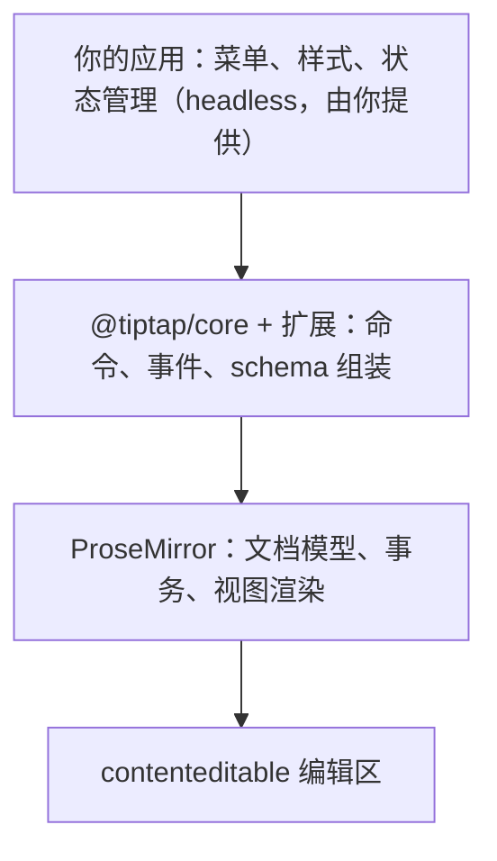

import { Meta } from '@storybook/addon-docs/blocks';

<Meta id="what-is-tiptap" title="上手/是什么" name="Docs" />

# Tiptap 是什么

Tiptap 是一个 headless 富文本编辑器框架：它把经过长期验证的 ProseMirror 库封装成现代、框架无关的 API，让你搭建完全贴合自己产品的编辑器。说它是"框架"而不是"组件"，是因为它不渲染任何默认工具栏、不附带默认样式——界面由你提供，内容引擎由它提供，具体能力通过扩展按需装配。

本课建立整本手册的地基：读完你应该能判断一个编辑器需求里哪些部分由 Tiptap 负责、哪些由你负责，认识 v3 的包生态分层，并且能对"哪些能力免费、哪些要订阅"给出依据。本手册跟随当前稳定大版本 3.x，包名与清单以 3.x 为准；安装命令与包职责的细节由[安装](?path=/docs/install--docs)一课展开。



先记住最常回查的几个包：

| 包 | 一句话职责 | 许可 |
| --- | --- | --- |
| `@tiptap/core` | 编辑器本体：`Editor` 类、命令、事件与扩展系统 | MIT |
| `@tiptap/pm` | ProseMirror 桥接包：按子路径重新导出引擎，保证版本一致 | MIT |
| `@tiptap/starter-kit` | 常用扩展合集，官方推荐的默认起点 | MIT |
| `@tiptap/extension-*` | 单个扩展；v3 起部分合并为聚合包（如 `@tiptap/extension-list`） | MIT |
| `@tiptap/react`、`@tiptap/vue-3` | 框架绑定 | MIT |
| `@tiptap-pro/*` | 付费扩展，从 Tiptap 私有 npm registry 安装 | 需订阅 |

## headless 编辑器

**headless 的意思是：Tiptap 提供内容引擎和操作 API，不提供界面。** 它负责文档模型、schema 校验、输入处理、把内容渲染进 `contenteditable` 区域；你负责工具栏、菜单、样式和整体交互。这与 CKEditor、TinyMCE 这类"开箱带默认 UI"的所见即所得编辑器正好相反——Tiptap 默认是"裸"的，能力从 StarterKit 开始逐项添加。

用官方推荐的方式创建编辑器，只需要容器、内容与扩展，没有任何 UI 配置：

```ts
import { Editor } from '@tiptap/core';
import StarterKit from '@tiptap/starter-kit';

new Editor({
  element: document.querySelector('.element'),
  extensions: [StarterKit],
  content: '<p>Hello World!</p>',
});
```

运行结果是页面上出现一个可以直接编辑的裸段落：能输入、能换行、能用 StarterKit 内置的快捷键加粗，但没有按钮、没有边框、没有字体样式。这就是 headless 的直接观察结果——**你看到的编辑器形态，完全由你写的 UI 决定**。

headless 不等于官方完全不提供 UI。官方另有 UI Components 组件库与编辑器模板两条付费产品线，需要时可以购买接入；开源层面则不含这些，菜单要从命令 API 自己搭（做法见菜单一课）。"为什么选 Tiptap"官方给出的三条理由也印证了这个定位：

- **Modular by default：** 只添加需要的扩展，包体小、schema 可控。
- **Headless first：** 框架无关，可接入 React、Vue、Svelte 或任意前端方案。
- **Open source & Pro extensions：** 核心以 MIT 许可开源，高级能力（评论、AI 等）作为付费扩展提供。

## 与 ProseMirror 的关系

**ProseMirror 是引擎，Tiptap 是封装层。** 官方对 ProseMirror 的定位是"在 Web 上构建富文本编辑器的久经考验的库"；Tiptap 把它封装成现代、框架无关的 API。两层分工是：

- **ProseMirror 负责：** schema 定义的文档模型、state 与 transaction 的状态管理、视图层渲染。编辑器内部的文档就是一个 ProseMirror 节点。
- **Tiptap 补上：** 声明式的扩展系统（不必手写 ProseMirror 插件样板）、`editor.commands` 命令 API、框架绑定、以及 `editor.getJSON()` 输出的 Tiptap JSON——官方推荐的文档存储格式（细节见内容与文档模型一课）。

分层关系意味着：日常用 Tiptap 的扩展与命令就够；需要更底层控制时，可以透过 `@tiptap/pm` 直接使用 ProseMirror 的能力。

### @tiptap/pm 桥接包

`@tiptap/pm` 把 ProseMirror 的核心子包按子路径重新导出。**要引入 ProseMirror 能力时，一律从 `@tiptap/pm` 导入，而不是直接安装 `prosemirror-*` 包**：

```ts
// 从 ProseMirror 的 state 子包加载 EditorState
import { EditorState } from '@tiptap/pm/state';
```

原因是版本一致性：`@tiptap/pm` 保证你拿到的 ProseMirror 与 Tiptap 内部使用的是同一份，直接安装 `prosemirror-*` 可能引入双版本，导致行为不一致。可用的子路径：

`@tiptap/pm/changeset`、`@tiptap/pm/commands`、`@tiptap/pm/dropcursor`、`@tiptap/pm/gapcursor`、`@tiptap/pm/history`、`@tiptap/pm/inputrules`、`@tiptap/pm/keymap`、`@tiptap/pm/model`、`@tiptap/pm/schema-list`、`@tiptap/pm/state`、`@tiptap/pm/tables`、`@tiptap/pm/transform`、`@tiptap/pm/view`。

未被覆盖的 ProseMirror 库（如 `prosemirror-collab`、`prosemirror-markdown`）仍从 npm 直接安装。

### ProseMirror 词汇表

下面这些概念来自 ProseMirror，贯穿 Tiptap 文档和本手册后续课程，先混个脸熟：

| 词汇 | 含义 |
| --- | --- |
| Schema | 配置文档允许的结构 |
| Document | 编辑器中的实际内容 |
| State | 描述当前内容与选区 |
| Transaction | 对 state 的一次变更（更新内容、选区等） |
| Node | 内容类型，如 heading、paragraph |
| Mark | 附加到内容上的行内格式，如 bold |
| Command | 执行一个改变 state 的动作 |
| Extension | 注册新功能的入口 |
| Decoration | 叠加在文档上的样式层，如拼写错误高亮 |

它们由 Schema、节点与标记以及 Decorations 与插件等课程逐一展开，本课只要求能对上号。

## v3 包生态

**v3 的包按职责分四层，从底到顶是：核心引擎、扩展、框架绑定、周边能力。** 判断"某个功能装哪个包"，先定位它属于哪一层：

- **核心引擎层：** `@tiptap/core` 提供 `Editor` 与扩展系统；`@tiptap/pm` 桥接 ProseMirror。任何项目都从这两个包开始。
- **扩展层：** `@tiptap/starter-kit` 打包了常用扩展；单个扩展用 `@tiptap/extension-*`；v3 把相关扩展合并成聚合包减少依赖数量（`@tiptap/extensions` 收纳 Placeholder、CharacterCount 等功能扩展，`@tiptap/extension-list`、`@tiptap/extension-table`、`@tiptap/extension-text-style` 分别是列表、表格、文本样式的 kit）；付费扩展在 `@tiptap-pro/*` scope 下，从 Tiptap 私有 npm registry 安装。
- **框架绑定层：** `@tiptap/react`、`@tiptap/vue-3` 等官方绑定包，让编辑器跟随框架生命周期。
- **周边能力层：** `@tiptap/static-renderer`（v3 新增，在没有编辑器实例的场合输出 HTML/JSON/Vue/React 内容）、`@tiptap/extension-collaboration`（Yjs 实时协作）、`@tiptap/markdown`（Markdown 输入输出）；协作后端可用开源的 Hocuspocus 自托管。

扩展层的起点是 StarterKit。v3 版内含：

| 类别 | 内含扩展 |
| --- | --- |
| 节点 | Blockquote、BulletList、CodeBlock、Document、HardBreak、Heading、HorizontalRule、ListItem、OrderedList、Paragraph、Text |
| 标记 | Bold、Code、Italic、**Link**、Strike、**Underline** |
| 功能扩展 | Dropcursor、Gapcursor、**ListKeymap**、**TrailingNode**、UndoRedo |

加粗的四个是 v3 新收入 StarterKit 的（Link、Underline、ListKeymap、TrailingNode）。装好即可覆盖标题、列表、引用、代码块等常见需求；不要的可以在 `StarterKit.configure()` 中设为 `false` 关闭。

v3 在包生态上还有一处值得记住的变化：**一批原 Pro 扩展转成了 MIT 开源**，包括 Drag Handle、Emoji、Math、File Handling 等。所以判断一个扩展是否免费，要看官方扩展文档页的当前标注，不能凭旧版本的印象。

安装命令、原生 JS / React / Vue 三条安装路径与三个核心包的职责细节，由[安装](?path=/docs/install--docs)一课承接。

## 许可结构

**Tiptap 的付费边界不在"编辑器"上，而在"高级能力与云服务"上。** 官方定价页明确写着编辑器开源（MIT）且免费，可自托管、可用于商业产品。整包生态按许可分三层：

| 层 | 包含什么 | 获取方式 | 授权条件 |
| --- | --- | --- | --- |
| 开源核心 | `@tiptap/core`、`@tiptap/pm`、`@tiptap/starter-kit`、GitHub 上的开源扩展、Hocuspocus 协作后端 | 公共 npm registry 与 GitHub | MIT：可商用、可自托管 |
| Pro 扩展与 UI | `@tiptap-pro/*` 扩展、官方 UI Components、编辑器模板 | Tiptap 私有 npm registry 与官网 | Pro License：活跃订阅期内持续授权 |
| 云与附加产品 | Tiptap Cloud（托管协作、版本历史、评论）、AI Toolkit、Tracked Changes | tiptap.dev 订阅（Start、Team、Business、Enterprise 四档，部分含 30 天试用） | 按套餐计费，额度以 Cloud 文档量与席位为准 |

两层容易误判的边界：

- **协作有免费路线。** 订阅套餐里的协作是 Tiptap Cloud 托管方案；用 Yjs + `@tiptap/extension-collaboration` + 自托管 Hocuspocus 走开源路线时，文档存在自己的数据库里，不消耗 Cloud 额度。
- **Pro 扩展的授权跟着订阅走。** Pro License 条款规定：只要订阅有效，就一直拥有使用授权；续费停止后授权随之失效。升级 v3 后先确认所需扩展是否已经开源，再决定是否订阅。

付费产品线的完整地图与选型判断由付费能力概览一课承接。

## 常见问题

- **"Tiptap 到底免费不免费？"网上说法两极。**
  按三层判断：编辑器核心与开源扩展 MIT 免费，含商用和自托管；需要 Pro 扩展、云协作、AI 等高级能力时才产生订阅费用。依据是官方定价页的表述——编辑器开源（MIT）且免费，付费的是平台功能与云文档。注意 v3 已把 Drag Handle、Emoji、Math、File Handling 等原 Pro 扩展转为 MIT，旧文章的免费/付费清单可能过期，以官方扩展文档页标注为准。
- **为什么导入要写 `@tiptap/pm/state` 而不是 `prosemirror-state`？**
  一律从 `@tiptap/pm` 按子路径导入。判断依据：官方文档说明该包保证 ProseMirror 版本与 Tiptap 内部一致，直接安装 `prosemirror-*` 可能出现双版本导致行为不一致；只有未被桥接的库（如 `prosemirror-collab`、`prosemirror-markdown`）才直接从 npm 安装。
- **headless 是不是连工具栏都要从零手写？**
  开源层面是的，但成本很低：菜单按钮本质上是调用 `editor.commands` 上的命令，具体做法见菜单一课。如果预算允许，官方 UI Components 与模板两条付费产品线可以直接提供成品菜单。

## 总结回顾

摘要：

Tiptap 把久经考验的 ProseMirror 引擎封装成现代、框架无关的编辑器框架，本身不附带 UI 和样式——这是 headless 的含义，也是"编辑器长什么样由你决定"的根源。它通过扩展系统组织能力：`@tiptap/core` 与 `@tiptap/pm` 构成核心引擎，StarterKit 与各类扩展按需装配，`@tiptap/react`、`@tiptap/vue-3` 等绑定框架，`@tiptap/static-renderer`、协作、Markdown 等包提供周边能力。许可按三层划分：核心与开源扩展 MIT 免费，Pro 扩展与 UI 组件需要订阅授权，云托管与附加产品按套餐计费。

一句话：

> Tiptap 是包在 ProseMirror 之上的 headless 扩展框架——内容引擎与文档模型由 ProseMirror 提供，UI 与样式由你提供，能力来自按许可分层的包生态。

知识要点：

- headless 意味着 Tiptap 给你什么、不给你什么？
- Tiptap 与 ProseMirror 各自负责哪一层？
- 为什么从 `@tiptap/pm` 导入而不是直接安装 `prosemirror-*`？
- v3 装一个编辑器最少需要哪几个包？StarterKit 里有什么、哪些是 v3 新收入的？
- 哪些能力 MIT 免费，哪些需要订阅？判断一个扩展是否免费的依据是什么？

## 参考资料

- [Tiptap Editor Introduction](https://tiptap.dev/docs/editor/introduction)
  Tiptap 定义、headless 表述、ProseMirror 关系与"Why pick Tiptap"三条理由。
- [Get started 概览](https://tiptap.dev/docs/editor/getting-started/overview)
  headless rich-text editor framework 定义、开源与 Pro 扩展边界、StarterKit 定位。
- [核心概念（Core concepts）](https://tiptap.dev/docs/editor/core-concepts/introduction)
  Structure / State / Content / Extensions 四个核心概念与词汇表。
- [ProseMirror 与 @tiptap/pm](https://tiptap.dev/docs/editor/core-concepts/prosemirror)
  `@tiptap/pm` 桥接包的版本一致性说明与子路径清单。
- [Tiptap 3.0 稳定版发布说明](https://tiptap.dev/blog/release-notes/tiptap-3-0-is-stable)
  v3 聚合包（Meta-Packages）、Pro 扩展转开源、StarterKit 新增内容。
- [StarterKit 扩展页](https://tiptap.dev/docs/editor/extensions/functionality/starterkit)
  StarterKit 内含扩展清单与 configure 用法。
- [Vanilla JavaScript 安装页](https://tiptap.dev/docs/editor/getting-started/install/vanilla-javascript)
  三个核心包的分工表述与最小编辑器创建代码。
- [Pro Extensions 安装指南](https://tiptap.dev/docs/guides/pro-extensions)
  `@tiptap-pro/*` 扩展从私有 npm registry 安装的方式。
- [Tiptap Pro License](https://tiptap.dev/pro-license)
  Pro 扩展、UI 组件与模板的授权条款。
- [Tiptap Pricing](https://tiptap.dev/pricing)
  编辑器 MIT 免费的官方表述、套餐结构与附加产品。
- [ueberdosis/tiptap 开源仓库](https://github.com/ueberdosis/tiptap)
  开源 monorepo、MIT 许可与 Pro Extensions 说明。
