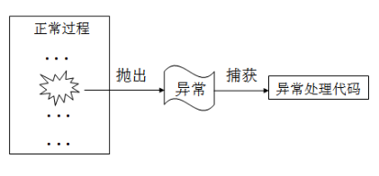
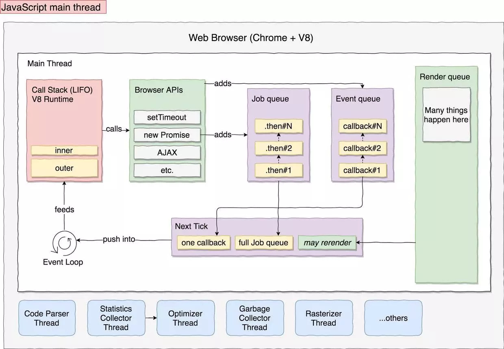

# 异常处理机制

## 什么是异常和异常处理？

### 异常

异常指的是在程序运行过程中发生的异常事件，通常是由外部问题（如硬件错误、输入错误）所导致的。在 Java、JavaScript 等编程语言的异常处理机制中，异常这一术语所描述的通常是一种数据结构，这种数据结构可以存储与某种异常情况相关的信息。

TODO: [错误分类](https://segmentfault.com/a/1190000002741935#articleHeader1)

参考文献

- [异常-百度百科](https://baike.baidu.com/item/异常/5952477)

### 异常处理

异常处理是对异常的确定，是编程语言或计算机硬件里的一种机制，用于处理软件或信息系统中出现的异常状况（即超出程序正常执行流程的某些特殊条件）。通过异常处理，我们可以对用户在程序中的非法输入进行控制和提示，以防程序崩溃。现代编程语言提供了异常处理机制来处理异常，基本思路是：程序运行时如果发生错误，就“抛出”一个异常，而系统能够“捕获”这个异常并执行特定的异常处理代码。



理论上异常处理划分为两个模型（终止模型与继续模型），但实际使用方面我们对终止模型用的比较多，这个模型比较实用，而继续模型则不是那么的应用普遍。

- 终止模型：假设错误非常关键,将以致于程序无法返回到异常发生的地方继续执行.一旦异常被抛出,就表明错误已无法挽回,也不能回来继续执行。
- 恢复模型：意思是异常处理程序的工作是修正错误，然后重新尝试调动出问题的方法，并认为第二次能成功。

TODO: [处理操作失败](https://segmentfault.com/a/1190000002741935#articleHeader2) 和 [处理程序员的失误](https://segmentfault.com/a/1190000002741935#articleHeader3)

参考文献

- [Exception handling - wikipedia](https://en.wikipedia.org/wiki/Exception_handling) / [异常处理](https://zh.wikipedia.org/wiki/异常处理)
- [异常处理-百度百科](https://baike.baidu.com/item/异常处理)
- [程序设计思想与方法-异常处理机制](https://wizardforcel.gitbooks.io/sjtu-cs902-courseware/content/63.html)
- [程序设计语言的异常处理机制探讨](https://blog.csdn.net/autumn20080101/article/details/8235442)

## 编程语言为什么要有异常处理机制？

早期的 C 语言的“异常处理机制”（C 语言一般认为是不支持异常处理的），通常是我们人为的对返回结果加一些标志来进行判定，比如发生错误返回什么标志，正常情况下我们又是返回什么标记，而这些都不是语言本身所赋予我们的，这种机制的问题在于，C 语言的异常处理机制全是我们人为的定义，这样就会造成业务逻辑的主线受到异常处理的牵制，或者说是我们难免会将注意力转移，并且造成业务逻辑与异常处理之间有很大程度上的缠绕。

现代编程语言的异常处理机制是代替日渐衰落的 error code 方法的新法，提供 error code 所未能具体的优势。异常处理分离了接收和处理错误代码。这个功能理清了编程者的思绪，也帮助代码增强了可读性，方便了维护者的阅读和理解。

ps：可以这么认为，现代编程语言的异常处理机制提供了 try...catch 控制流(沿着函数调用栈的函数调用逆向搜索，直到遇到异常处理代码为止)，让我们更简单和易度方式处理异常。虽然 C 语言一般认为是不支持异常处理，但也可以通过 goto 等语法间接的实现“异常处理机制”，从而将业务逻辑和错误处理分离（参考 [C语言中的异常处理机制](http://ibillxia.github.io/blog/2011/05/03/Exception-handling-mechanism-in-c/)）。

示例：下面是一个新增用户的示例，在新建用户时需要检查用户名是否已经存在，如果不存在则可以创建该用户。注意示例中 `getUserByName` 的参数和返回值，`createUser` 内的实现逻辑。

- 错误标识：使用错误标识需要回调返回值里携带错误代码，调用函数的业务逻辑需要加上对错误代码的处理，这样的实现业务逻辑与异常处理缠绕在一起，降低了代码可读性。

    ```ts
    // 错误标识
    function getUserByName(name: string, callback: (result: {
      code: number,
      data: {
        id: string,
        name: string
      }
    }) => void): void {
      // ...一系列异步操作
      callback({
        code: 0,
        data: {
          id: 'a',
          name: '某某某',
        },
      });
    }
    
    function createUser(name: string, callback: (code: number) => void) {
      getUserByName(name, function (result) {
        const {
          code,
          data
        } = result;
        if (code === 0) { // 需要判断错误代码
          // 查询成功
          if (data === null) {
            // 新建用户
            callback(0);
          } else {
            callback(1); // 表示用户已经存在
          }
        } else {
          callback(code); // 向外传 code
        }
      })
    }
    createUser('某某某', function (code) {
      if (code === 0) {
        // 创建成功
      } else {
        // 创建失败
      }
    });
    ```

- 错误对象：Nodejs 写法，确定了统一的函数回调返回值写法，返回值的错误标识和业务对象也分离开来了。

    ```ts
    // 错误对象
    function getUserByName(name: string, callback: (error: Error | null, data: {
      id: string,
      name: string
    }) => void): void {
      // ...一系列异步操作
      callback(
        null, {
          id: 'a',
          name: '某某某',
        },
      );
    }

    function createUser(name: string, callback: (error: Error | null) => void) {
      getUserByName(name, function (error, data) {
        if (error === null) {
          // 查询成功
          if (data === null) {
            // 新建用户
            callback(null);
          } else {
            callback(new Error('用户已经存在'));
          }
        } else {
          callback(error);
        }
      });
    }
    createUser('某某某', function (error: Error | null) {
      if (error === null) {
        // 创建成功
      } else {
        // 创建失败
      }
    });
    ```

- Promsie：基于 Promise 的异常处理机制，让代码变得更加优雅，但还不是原生的异常处理机制。

    ```ts
    // Promise
    function getUserByName(name: string): Promise<{
      id: string,
      name: string
    }> {
      return new Promise(function (resolve, reject) {
        // ...一系列异步操作
        resolve({
          id: 'a',
          name: '某某某',
        });
      });
    }

    function createUser(name: string): Promise < null > {
      // 只需要关心 getUserByName 返回的业务数据，需要处理异常（交给最外层处理）
      return getUserByName(name)
        .then(function (data) {
          if (data === null) {
            // 新建用户
            return null;
          } else {
            return Promise.reject(new Error('用户已经存在'));
          }
        });
    }
    createUser('某某某')
      .then(function () {
        // 创建成功
      })
      .catch(function () {
        // 创建失败
      });
    ```

- 异常处理：基于 async/await 语法，可以使用原生的异常处理机制（try...catch）来处理异常，帮助代码增强了可读性，方便了维护者的阅读和理解。

    ```ts
    // Async
    function todo() {
      // 一系列异步操作
    }
    async function getUserByName(name: string): Promise<{
      id: string,
      name: string
    }> {
      await todo();
      return {
        id: 'a',
        name: '某某某',
      };
    }
    async function createUser(name: string): Promise<null> {
        const data = await getUserByName(name);
        if (data === null) {
          // 新建用户
          return null;
        } else {
          throw new Error('用户已经存在');
        }
      }
      (async function () {
        try {
          await createUser('某某某');
          // 创建成功
        } catch (error) {
          // 创建失败
        }
      }());
    ```

思考：从上文的例子来看，异常确实让代码变得更加清晰和优雅，但是异常处理机制真的要比错误代码要好吗（可以从错误对象，错误传播，错误处理和错误安全等角度去对比思考）？

| VS | 异常 | 错误代码 |
| --- | --- | --- |
| 错误对象 | 异常可以携带更多信息 | 通常错误码在不同的库中有不同的定义，必须手动转换成统一的形式 |
| 错误传播 | 不需要额外的措施就能传播到上层 | 手动传播，当函数层次比较深时，会产生很多 if 语句，同时，每一个错误代码都需要一个 if 语句，if 语句会增加分支数，增加测试成本。 |
| 错误处理 | 异常则集中于一个地方，容易管理 | 错误代码的处理散布各处，伸缩性较差。 |

优缺点

- 错误代码

    - 跨系统/语言边界
    - 资源消耗少

- 异常

    - 优雅性：异常不会侵入接口，使得正常情况下，接口更加优雅
    - 清晰性：代码逻辑更加清晰，没有多余的分支，算法更加透明

参考文献

- [错误码到底比异常优越在哪？](https://www.zhihu.com/question/264724166)
- [「杂谈」异常处理 vs 错误处理](https://zhuanlan.zhihu.com/p/48200804)
- [如何用C语言实现异常/状况处理机制？](https://www.zhihu.com/question/20597909)
- [如何设计一门语言（六）——exception和error code](http://www.cppblog.com/vczh/archive/2013/06/10/200920.html)
- [为什么不建议用 try catch？](https://www.zhihu.com/question/29459586)
- [各种编程语言中的「错误/异常处理」有哪些成熟的，优雅的或是热门的机制/思想？](https://www.zhihu.com/question/35193523)
- [Go 语言的错误处理机制是一个优秀的设计吗？](https://www.zhihu.com/question/27158146)
- [C、C++、Java语言中异常处理机制浅析](http://www.uml.org.cn/c%2B%2B/201208212.asp)
- [运行时异常处理程序是如何实现的？](https://www.zhihu.com/question/58094775/answer/156005907)
- [关于异常的争论](https://www.ibm.com/developerworks/cn/java/j-jtp05254/index.html)
- [Suggestion: `throws` clause and typed catch clause](https://github.com/Microsoft/TypeScript/issues/13219)

## 怎么使用 JavaScript 的异常处理机制？

- [错误处理机制-《JavaScript 标准参考教程》](https://javascript.ruanyifeng.com/grammar/error.html)

### Error 对象

JavaScript 解析或运行时，一旦发生错误，引擎就会抛出一个错误对象。JavaScript 原生提供 Error 构造函数，所有抛出的错误都是这个构造函数的实例（Error 对象也可用于用户自定义的异常的基础对象）。

创建一个 Error 对象示例：`new Error([message[, fileName[,lineNumber]]])`

```js
var err = new Error('出错了'); // 也可以当做函数调用 Error('出错了')，效果和 new 语法一样
err.name // 错误名称，初始值是 `"Error"`
err.message // 错误信息 “错误了”
err.stack // 错误发生时的堆栈
```

- name 和 message 是 ES 标准属性；
- stack 虽然是非标准属性，但现代浏览器都支持该属性；

    - 不同浏览器的错误堆栈格式不一致，参考 [Error.prototype.stack](https://developer.mozilla.org/zh-CN/docs/Web/JavaScript/Reference/Global_Objects/Error/stack)；
    - 匿名函数在错误栈中没有名字，表现为空字符串要么就是Anonymous function（根据不同浏览器会有区别）；
    - 将函数赋值给一个变量时，浏览器通常也会使用匿名函数赋值给的变量作为函数名，在追溯帧中出现；
    - 除了 IE11，函数名的展现也可以通过给函数定义一个 displayName 属性，displayName 会出现在浏览器的 devtools debugger 中，虽然关于 displayName 还没有官方的标准，但是该属性已经在主要的浏览器中实现了。
    - 当抛出一个错误但又没有追溯栈的时候（通过下面的内容了解更多），我们可以通过一些编程的手段来捕获追溯栈。

        - 在 Chrome 中，可以简单的调用 [Error.captureStackTrace API]( https://github.com/v8/v8/wiki/Stack%20Trace%20API) 来获取到追溯栈，关于该API的使用可以通过如下链接了

            ```js
            function ignoreThisFunctionInStackTrace() {
              var err = new Error();
              Error.captureStackTrace(err, ignoreThisFunctionInStackTrace);
              return err.stack;
            }
            ```

        - 在其它浏览器中，追溯栈也可以通过生成一个错误，然后通过 stack 属性来获取追溯栈。

            ```js
            var err = new Error('');return err.stack;
            ```

        - 如果上面的方法都起作用时，我们可以通过 arguments.callee.caller 对象来粗糙的获取一个没有行数和列数的追溯栈，但是这种方法在ES5严格模式下不起作用，因此这种方法也不是一种推荐的做法。

    - 异步追溯栈：在 JavaScript 代码中异步代码是非常常见的。比如 setTimeout 的使用，或者 Promise 对象的使用，这些异步调用入口往往会给追溯栈带来问题，因为异步代码会生成一个新的执行上下文，而追溯栈又会重新形成追溯帧。Chrome DevTools 已经支持了异步追溯栈，换句话说，追溯栈在追溯一个错误的时候也会显示引入异步调用的那一调用帧。目前，异步追溯栈只有 Chrome DevTools 支持，而且只有在 DevTools 打开的情况下才会捕获，在代码中通过Error对象不会获取到异步追溯栈。


- fileName、lineNumber 和 columnNumber 是非标准属性，参考[浏览器的兼容性](https://developer.mozilla.org/en-US/docs/Web/JavaScript/Reference/Global_Objects/Error#Browser_compatibility)，只有 Firefox 支持。

参考文献

- [MDN of Error](https://developer.mozilla.org/en-US/docs/Web/JavaScript/Reference/Global_Objects/Error)
- [Specification of Error](https://www.ecma-international.org/ecma-262/6.0/#sec-error-message)
- [JavaScript Errors 指南 - 错误剖析](https://mp.weixin.qq.com/s/e4_AdSWMxl1BXLfMl-sAgA)
- [Debugging Asynchronous JavaScript with Chrome DevTools](https://www.html5rocks.com/en/tutorials/developertools/async-call-stack/)

### 原生错误类型

Error 实例对象是最一般的错误类型，在它的基础上，JavaScript 还定义了其他 6 种错误对象。也就是说，存在 Error 的6个派生对象。

- SyntaxError
- ReferenceError
- RangeError
- TypeError
- URIError
- EvalError

参考文献

- [原生错误类型](https://javascript.ruanyifeng.com/grammar/error.html#toc9)

### 自定义错误

除了 JavaScript 原生提供的七种错误对象，还可以定义自己的错误对象。

```js
// prototype
function UserError(message) {
  var instance = new Error(message);
  instance.name = 'UserError';
  Object.setPrototypeOf(instance, Object.getPrototypeOf(this));
  if (Error.captureStackTrace) {
    Error.captureStackTrace(instance, UserError);
  }
  return instance;
}
UserError.prototype = Object.create(Error.prototype, {
  constructor: {
    value: Error,
    enumerable: false,
    writable: true,
    configurable: true
  }
});
if (Object.setPrototypeOf){
  Object.setPrototypeOf(UserError, Error);
} else {
  UserError.__proto__ = Error;
}
```

```js
// class
class UserError extends Error {
  constructor(message) {
    super(message);
    this.name = 'UserError';
  }
}
```

参考文献

- [Custom Error Types](https://developer.mozilla.org/en-US/docs/Web/JavaScript/Reference/Global_Objects/Error#Browser_compatibility)
- [What's a good way to extend Error in JavaScript?](https://stackoverflow.com/questions/1382107/whats-a-good-way-to-extend-error-in-javascript)
- [自定义错误](https://javascript.ruanyifeng.com/grammar/error.html#toc9)

### 抛出异常

- [MDN throw](https://developer.mozilla.org/en-US/docs/Web/JavaScript/Reference/Statements/throw)
- [throw 语句](https://javascript.ruanyifeng.com/grammar/error.html#toc9)

### 处理异常

```js
try {
  try_statements
}
[catch (exception_var_1 if condition_1) { // non-standard
  catch_statements_1
}]
...
[catch (exception_var_2) {
  catch_statements_2
}]
[finally {
  finally_statements
}]
```

思考：捕获到错误时要做什么样的处理？

- [MDN try...catch](https://developer.mozilla.org/en-US/docs/Web/JavaScript/Reference/Statements/try...catch)
- [try…catch 结构](https://javascript.ruanyifeng.com/grammar/error.html#toc9)
- [finally 代码块](https://javascript.ruanyifeng.com/grammar/error.html#toc9)
- [[译] NodeJS 错误处理最佳实践](https://segmentfault.com/a/1190000002741935)

## JavaScript 怎么处理异步任务的异常？

`try...catch` 无法捕获 setTimeout 等异步任务中的错误，那其中的原因是什么。以及异步代码在 js 中是特别常见的，我们该怎么做？

```js
// 这段代码中，setTimeout 的回调函数抛出一个错误，并不会在 catch 中捕获，会导致程序直接报错崩掉。
const task = () => {
  setTimeout(() => {
    throw new Error('async error');
  }, 1000)
}
// 主任务
function main() {
  try {
    task();
  } catch(err) {
    console.log(err)
  }
}
```



- 宏任务的回调函数中的错误无法捕获

    这种情况下 main 是无法 catch error 的，这跟浏览器的执行机制有关。异步任务由 eventloop 加入任务队列，并取出入栈(js 主进程)执行，而当 task 取出执行的时候， main 的栈已经退出了，也就是上下文环境已经改变，所以 main 无法捕获 task 的错误。

- 微任务（promise）的回调

    ```js
    // 返回一个 promise 对象
    const task = () => 
      new Promise((reslove) => {
        throw new Error('async error');
      });
    function main() {
      try {
        // 回调函数里抛出错误
        task().then(() => {
          // ...
        });
      } catch(e) {
        console.log(err);
      }
    }
    ```

    promise 的任务，抛出错误同样也无法 catch。因为微任务队列是在两个 task 之间清空的，所以 then 入栈的时候，main 函数也已经出栈了。

参考文献

- [try..catch为什么不能捕获异步的错误](https://cnodejs.org/topic/5867d6be9ff78bc36af0440d)
- [JS 异步错误捕获二三事](https://juejin.im/post/5cc15de5e51d456e68659340#heading-10)
- [Javascript 异常处理的演进](https://zhuanlan.zhihu.com/p/25245932)
- [Callback Promise Generator Async-Await 和异常处理的演进](https://www.jianshu.com/p/78dfb38ac3d7)

### callback

要获取异步任务执行时抛出的错误对象通常会采用回调的方式获取，不同的实现采用了不同的规范，Node.js 采用 error-first 风格的回调函数，有些前端库采用成功回调 + 失败回调的方案，例如 [Geolocation.getCurrentPosition](https://developer.mozilla.org/en-US/docs/Web/API/Geolocation/getCurrentPosition)。

```js
const task = (callback) => {
  setTimeout(() => {
    callback(new Error('async error'))
  }, 1000)
}
function main() {
  task((error, data) => {
    if (error) {
      console.log(error);
    } else {
      // ...
    }
  });
}
```

或者

```js
const task = (success, failure) => {
  setTimeout(() => {
    failure(new Error('async error'))
  }, 1000)
}
function main() {
  task(
    data => {
      // ...
    },
    error => {
      console.log(error);
    }
  );
}
```

###  promise

采用回调方式开发的人都知道回调最大的问题是[“回调地狱”](http://callbackhell.com/)，Promise 是一种编写异步代码的方法，基于它实现的异步代码仍然表现为以自上而下的方式执行。

```js
const task = () => {
  new Promise((reslove) => {
    throw new Error('async error');
  });
}
// 主任务
function main() {
  task()
    .then(() => {
      // ...
    })
    .catch((err) => {
      console.log(err);
    });
}
```

### async/await

```js
const task = async () => {
  await xxx(); // 异步任务
  throw new Error('async error');
}
// 主任务
async function main() {
  try {
    await task();
    // ...
  } catch(error) {
    console.log(error);
  }
}
```

### event

更复杂的情形是，当你在做一个可能会产生多个错误或多个结果的复杂操作的时候，调用者需要监听这个对象的 error 事件。例如 [`<XMLHttpRequest>`](https://developer.mozilla.org/en-US/docs/Web/API/XMLHttpRequest#Events) 在请求过程中可能触发各种事件：`abort`、`error` 和 `timeout` 等。

在那些具有复杂状态机的对象上，这些对象往往伴随着大量的异步事件。例如，一个套接字是一个EventEmitter，它可能会触发“connect“，”end“，”timeout“，”drain“，”close“事件。这样，很自然地可以把”error“作为另外一种可以被触发的事件。在这种情况下，清楚知道”error“还有其它事件何时被触发很重要，同时被触发的还有什么事件（例如”close“），触发的顺序，还有套接字是否在结束的时候处于关闭状态。

## 特定运行环境下的异常处理经验

我们知道 try...catch 不是万能的，它只能捕获到同步的运行时错误，对语法和异步错误却无能为力。除了支持 Promsie API，aync/await 语法外，JavaScript 的运行环境还提供了一些适用于自身使用场景的 API 来捕获异常。例如：浏览器端的 `onerror`。

### 浏览器

- [如何优雅处理前端异常？](http://jartto.wang/2018/11/20/js-exception-handling/)

#### 容易忽略的同步错误

- [JSON.parse](https://developer.mozilla.org/en-US/docs/Web/JavaScript/Reference/Global_Objects/JSON/parse#Exceptions) / [JSON.stringify](https://developer.mozilla.org/en-US/docs/Web/JavaScript/Reference/Global_Objects/JSON/stringify#Exceptions)
- [decodeURI](https://developer.mozilla.org/en-US/docs/Web/JavaScript/Reference/Global_Objects/decodeURI#Exceptions) / [decodeURIComponent](https://developer.mozilla.org/en-US/docs/Web/JavaScript/Reference/Global_Objects/decodeURIComponent#Exceptions)

#### 容易忽略的回调错误

- [`Geolocation.getCurrentPosition()`](https://developer.mozilla.org/en-US/docs/Web/API/Geolocation/getCurrentPosition)
- ...

#### [`onerror`](https://developer.mozilla.org/en-US/docs/Web/API/GlobalEventHandlers/onerror)

前面异步错误中有提到，在复杂的情形下做一个产生多个错误或多个结果的复杂操作的时候，调用者需要监听这个对象的 error 事件。浏览器运行前端代码就是一个很复杂的情形，在运行中可能会产生各种错误，而浏览器的全局对象 `window` 就提供了监听全局错误的方式。

作用机制：

- JavaScript 运行时错误（包括语法错误和一些未捕获的异常）会在 `window` 对象上触发一个基于 [`ErrorEvent`](https://developer.mozilla.org/en-US/docs/Web/API/ErrorEvent) 的错误事件，并调用 `window.onerror`。
- 当某个资源（例如：``、`<script>`等）加载失败时，会在对应元素对象上触发一个基于 [`Error`](https://developer.mozilla.org/en-US/docs/Web/Events/error) 的错误事件，并调用该元素绑定的的 `onerror` 函数。和运行时错误不同的是该事件不会冒泡到 `window` 对象上，但是可以通过事件捕获来监听该事件。

使用方法：

- [`window.onerror`](https://developer.mozilla.org/en-US/docs/Web/API/GlobalEventHandlers/onerror#window.onerror)

    ```js
    window.onerror = function(message, source, lineno, colno, error) { ... }
    ```

    - message：错误信息（字符串）。可用于HTML onerror=""处理程序中的event。
    - source：发生错误的脚本URL（字符串）
    - lineno：发生错误的行号（数字）
    - colno：发生错误的列号（数字）
    - error：Error对象（对象）

    ps：
    
    1. 若该函数返回true，则阻止执行默认事件处理函数（即不会在开发者工具里打印错误信息）。
    2. onerror 最好写在所有 JS 脚本的前面，否则在绑定之前的错误无法捕获；

- [`window.addEventListener('error')`](https://developer.mozilla.org/en-US/docs/Web/API/GlobalEventHandlers/onerror#window.addEventListener('error'))：等同于 `window.onerror`

    ```ts
    window.addEventListener('error', function(event: ErrorEvent) { ... })
    ```

    ErrorEvent 包含同 `window.onerror` 一样的错误信息

    - `ErrorEvent.message`
    - `ErrorEvent.filename `
    - `ErrorEvent.lineno`
    - `ErrorEvent.lineno`
    - `ErrorEvent.error`

- [`element.onerror`](https://developer.mozilla.org/en-US/docs/Web/API/GlobalEventHandlers/onerror#element.onerror)

    ```ts
    element.onerror = function(event: Event) { ... }
    ```

    或者

    ```ts
    window.addEventListener('error', function(event: Event) { ... }, true)
    ```

    由于网络请求异常不会事件冒泡，因此必须在捕获阶段将其捕捉到才行，但是这种方式虽然可以捕捉到网络请求的异常，但是无法判断 HTTP 的状态是 404 还是其他比如 500 等等，所以还需要配合服务端日志才进行排查分析才可以。

[测试示例](./examples/onerror.html)

TODO: [跨域脚本](https://developer.mozilla.org/en-US/docs/Web/API/GlobalEventHandlers/onerror#Notes) 可能无法正常获取异常调用堆栈，可以通过跨域响应头或者改写 `EventTarget.prototype.addEventListener` 来解决。

参考文献

- [GlobalEventHandlers.onerror](https://developer.mozilla.org/en-US/docs/Web/API/GlobalEventHandlers/onerror)
- [How to catch JavaScript Errors with window.onerror (even on Chrome and Firefox)](https://danlimerick.wordpress.com/2014/01/18/how-to-catch-javascript-errors-with-window-onerror-even-on-chrome-and-firefox/)

#### Promsie 没有 catch

在 promise 中使用 catch 可以非常方便的捕获到异步 error，这个很简单。但没有写 catch 的 Promise 中抛出的错误无法被 onerror 或 try-catch 捕获到，所以我们务必要在 Promise 中不要忘记写 catch 处理抛出的异常。为了防止有漏掉的 Promise 异常，建议在全局增加一个对 unhandledrejection 的监听，用来全局监听Uncaught Promise Error。使用方式：

```js
window.addEventListener("unhandledrejection", function(e){
  console.log(e.promise);
  console.log(e.reason);
});
```

TODO: unhandledrejection 的兼容性怎么样？如果不兼容要怎么处理（改写 `Promise.prototype.then`）？

参考文献

- [Promise rejection events](https://developer.mozilla.org/en-US/docs/Web/JavaScript/Guide/Using_promises#Promise_rejection_events)
- [Window: unhandledrejection event](https://developer.mozilla.org/en-US/docs/Web/API/Window/unhandledrejection_event)
- [Window: rejectionhandled event](https://developer.mozilla.org/en-US/docs/Web/API/Window/rejectionhandled_event)
- [PromiseRejectionEvent](https://developer.mozilla.org/en-US/docs/Web/API/PromiseRejectionEvent)

### Node.js

- [[译] NodeJS 错误处理最佳实践](https://segmentfault.com/a/1190000002741935)
- [域模块已死](https://nodejs.org/zh-cn/docs/guides/domain-postmortem/)
- [剑走偏锋！domain模块居然还能这样用！](https://zhuanlan.zhihu.com/p/37280325)
- [Node.js Domain 模块](https://www.runoob.com/nodejs/nodejs-domain-module.html)
- [Node.js 异步异常的处理与domain模块解析](https://cnodejs.org/topic/516b64596d38277306407936)
- [Error Handling in Node.js](https://www.joyent.com/node-js/production/design/errors)
- [Node.js内部是如何捕获异步错误的？](https://zhuanlan.zhihu.com/p/62210238)

#### Error First

- [node-error-first-callback](https://github.com/30-seconds/30-seconds-of-interviews/blob/master/questions/node-error-first-callback.md)
- [The Node.js Way - Understanding Error-First Callbacks](http://fredkschott.com/post/2014/03/understanding-error-first-callbacks-in-node-js/)
- [Why does node prefer error-first callback?](https://stackoverflow.com/questions/40511513/why-does-node-prefer-error-first-callback)
- [Node.js的Error-first回调模式](https://www.jdon.com/idea/nodejs/error-first-callbacks.html)
- [Why does node prefer error-first callback?](https://stackoverflow.com/questions/40511513/why-does-node-prefer-error-first-callback)

#### process

- [uncaughtException](https://nodejs.org/api/process.html#process_event_uncaughtexception)
- [unhandledRejection](https://nodejs.org/api/process.html#process_event_unhandledrejection)
- [rejectionHandled](https://nodejs.org/api/process.html#process_event_rejectionhandled)

#### EventEmitter

- [Events](https://nodejs.org/api/events.html)

#### domain

- [域模块已死](https://nodejs.org/zh-cn/docs/guides/domain-postmortem/)

## 特定开发框架下的异常处理经验

### React

```js
componentDidCatch(error, info) {
  console.log(error, info);
}
```

### Vue

```
Vue.config.errorHandler = (err, vm, info) => {
  console.error(err);
  console.error(vm);
  console.error(info);
}
```

### Angular

TODO

### Express

```js
app.use(function (err, req, res, next) {
  console.error(err);
  res.status(500).send('Something broke!');
});
```

[Error Handling](https://expressjs.com/en/guide/error-handling.html)

## 实际应用

- 性能问题：TODO
- 统一规范：采用一种统一的规范来处理异常，例如：Node.js 的 error-first

    - callback
    - promise
    - try...catch by async/await

## 总结

- 异常和异常处理是什么
- 编程语言为什么需要异常处理机制
- JavaScript 异常错误对象和怎么抛出、捕获和处理异常
- 异步任务的异常处理机制
- 特定运行环境的下异常处理
- 实际应用要注意什么

## TODO

- [前端开发中的Error以及异常捕获](https://segmentfault.com/a/1190000017708563)
- [Top 10 JavaScript errors from 1000+ projects (and how to avoid them)](https://codeburst.io/top-10-javascript-errors-from-1000-projects-and-how-to-avoid-them-2956ce008437) / https://rollbar.com/blog/top-10-javascript-errors/
- [【第1701期】 JavaScript Errors 指南](https://mp.weixin.qq.com/s/e4_AdSWMxl1BXLfMl-sAgA)
- [Introduction to JavaScript Source Maps](https://www.html5rocks.com/en/tutorials/developertools/sourcemaps/)
- [Debugging Asynchronous JavaScript with Chrome DevTools](https://www.html5rocks.com/en/tutorials/developertools/async-call-stack/)
- [异常处理，"try..catch"](https://zh.javascript.info/try-catch)
- [JavaScript 错误处理权威指南](https://www.infoq.cn/article/cQQKlPyjLsLwv_BQt9y0)
