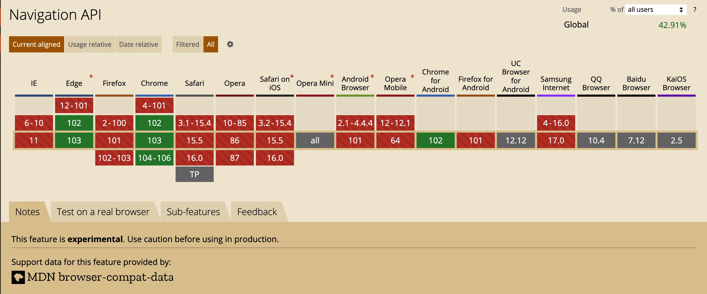

# [Navigation API](https://wicg.github.io/navigation-api/)

Navigation API 是 Chrome 提出的一套导航 API，提供了操作和拦截导航的能力，以及对应用程序的历史导航记录进行访问。这为 window.history 和 window.location 提供了一个更有用的替代品，特别是 SPA 这种模式。目前该 API 只有 Chromium 内核的浏览器才支持。



## Why

> SPA：在用户与网站互动时动态重写其内容，而不是默认的从服务器加载全新页面的方法。

虽然基于 [History API](https://developer.mozilla.org/zh-CN/docs/Web/API/History_API) 已经可以实现 SPA 了，但是 History API 过于简陋，不是专门为 SPA 量身定制的（早在 SPA 成为标准之前就开发出来了）。

如果开发人员在没有了解 History API 的情况下，想要基于 History API 实现类似 vue-router 路由守卫这种的功能时，会发现 `window.onpopstate` 只能监听到导航前进和后退的事件，无法监听到 push 或 replace 事件。此外，在使用超链接标签 `a` 或表单标签 `form` 时，触发的导航都是不支持 SPA 的，像前端常用的路由库 vue-router 或 react-router 都会提供自己的 Link 组件，用于实现 SPA 路由跳转。

在开源社区有已经有一些针对 history 的封装了，例如：[history](https://github.com/remix-run/history)、[history.js](https://github.com/browserstate/history.js)，前者正是 react-router 的路由底层实现。而现在 Navigation API 提供一个全新的标准化客户端路由，专门为 SPA 定制，提供了完整的操作和拦截导航的能力，以及对应用程序的历史导航记录进行访问。

## 快速上手

要使用 Navigation API，首先在 `window.navigation` 上添加一个 “navigate” 事件监听。这个事件基本上是集中的: 它会触发所有类型的导航，无论是用户执行一个操作(如点击链接，提交表单，或回退和前进)或当导航被程序化触发(即，通过您的网站的代码)。在大多数情况下，它允许您的代码覆盖浏览器对该操作的默认行为。对于 SPA，这可能意味着让用户保持在同一个页面上，并加载或更改站点的内容。

```html
<main>
  <ul>
    <li>
      <a href="subpage.html">subpage.html</a>
    </li>
    <li>
      <a href="#console">#console</a>
    </li>
    <li>
      <button onclick="history.pushState(null, '', '/subpage.html')">
        Go to subpage by history.pushState
      </button>
    </li>
    <li>
      <button onclick="history.back()">history.back()</button>
    </li>
    <li>
      <button onclick="location.reload()">location.reload()</button>
    </li>
    <li>
      <button onclick="location.href = 'subpage.html'">
        Go to subpage by location.href
      </button>
    </li>
  </ul>
  <div id="console"></div>
</main>
<script type="module">
  navigation.addEventListener('navigate', (e) => {
    console.log(e);
    console.log(e.navigationType); // "reload", "push", "replace", or "traverse"
    console.log(e.destination); // { url: '', index: '', getState() {} }
    console.log(e.hashChange); // 是否是锚点

    if (e.hashChange) {
      // 忽略锚点跳转
      return;
    }

    e.transitionWhile(
      (async () => {
        e.signal.addEventListener('abort', () => {
          const newMain = document.createElement('main');
          newMain.textContent =
            'Navigation was aborted, potentially by the browser stop button!';
          document.querySelector('main').replaceWith(newMain);
        });

        await delay(2000); // 故意测试用的

        const body = await (
          await fetch(e.destination.url, { signal: e.signal })
        ).text();
        const parser = new DOMParser();
        const doc = parser.parseFromString(htmlString, 'text/html');
        const title = doc.title;
        const main = doc.querySelector('main');

        document.title = title;
        document.querySelector('main').replaceWith(main);
      })()
    );
  });

  navigation.addEventListener('navigatesuccess', () =>
    console.log('navigatesuccess')
  );
  navigation.addEventListener('navigateerror', (ev) =>
    console.log('navigateerror', ev.error)
  );

  function delay(ms) {
    return new Promise((resolve) => setTimeout(resolve, ms));
  }
</script>
```

## 导航切换

## 导航历史栈

## 导航状态

## 代码示例

## 实践应用

- 监听页面内的所有导航事件，包含超链接、表单、location 和 History API，可以用于做埋点上报或特殊的拦截处理；
- 访问历史路由栈，查看当前的导航在路由栈的索引位置，判断当前页面是否是进入应用时的首页，是否可以再后退和前进；
- 可以缓存页面状态，在导航恢复时可以恢复历史状态。

## 参考文献

- https://github.com/WICG/navigation-api
- https://caniuse.com/mdn-api_navigation
- [Modern client-side routing: the Navigation API](https://developer.chrome.com/docs/web-platform/navigation-api/)
- [Feature: Navigation API](https://chromestatus.com/feature/6232287446302720)
