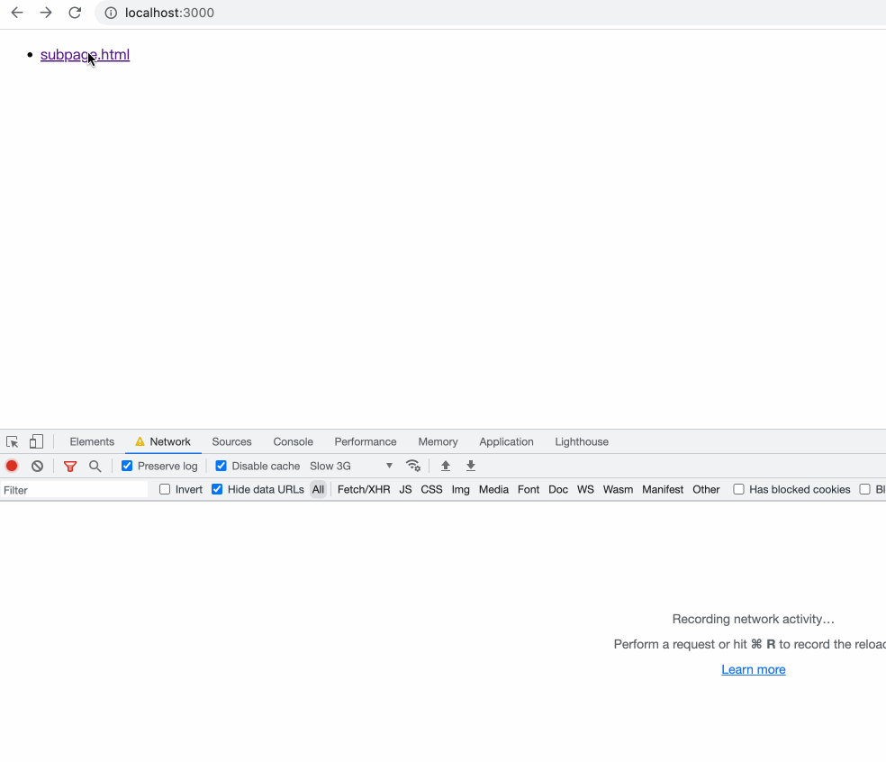
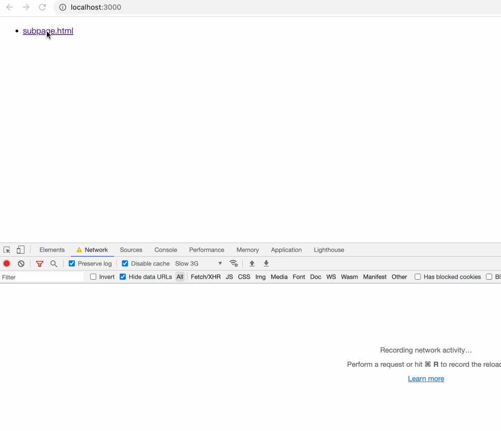

# [Navigation API](https://wicg.github.io/navigation-api/)

Navigation API 是 Chrome 提出的一套导航 API，提供了操作和拦截导航的能力，以及对应用程序的历史导航记录进行访问。这为 window.history 和 window.location 提供了一个更有用的替代品，特别是 SPA 这种模式。目前该 API 只有 Chromium 内核的浏览器才支持。


## Why

> SPA：在用户与网站互动时动态重写其内容，而不是默认的从服务器加载全新页面的方法。

虽然基于 [History API](https://developer.mozilla.org/zh-CN/docs/Web/API/History_API) 已经可以实现 SPA 了，但是 History API 过于简陋，不是专门为 SPA 量身定制的（早在 SPA 成为标准之前就开发出来了），在一些边界情况存在大量的问题，参见 [W3C HTML History Issues](https://github.com/whatwg/html/issues?q=is%3Aissue+is%3Aopen+history)。

如果开发人员在没有了解 History API 的情况下，想要基于 History API 实现类似 vue-router 路由守卫这种的功能时，会发现 `window.onpopstate` 只能监听到导航前进和后退的事件，无法监听到 push 或 replace 事件。此外，在使用超链接标签 `a` 或表单标签 `form` 时，触发的导航都是不支持 SPA 的，像前端常用的路由库 vue-router 或 react-router 都会提供自己的 Link 组件，用于实现 SPA 路由跳转。

在开源社区有已经有一些针对 history 的封装了，例如：[history](https://github.com/remix-run/history)、[history.js](https://github.com/browserstate/history.js)，前者正是 react-router 的路由底层实现。而现在 Navigation API 提供一个全新的标准化客户端路由，专门为 SPA 定制，提供了完整的操作和拦截导航的能力，以及对应用程序的历史导航记录进行访问。

## 快速上手

要使用 Navigation API，首先在 `window.navigation` 上添加一个 “navigate” 事件监听。这个事件代表了页面上的所有同域导航事件，无论是用户点击链接，提交表单，或回退和前进。大多数情况下，在这个事件处理函数里可以重写浏览器对这些操作的默认行为。对于 SPA，这意味着可以让用户保持在同一个页面上，并动态加载或更改站点的内容。

```html
<!DOCTYPE html>
<html lang="en">
  <head>
    <meta charset="UTF-8" />
    <meta http-equiv="X-UA-Compatible" content="IE=edge" />
    <meta name="viewport" content="width=device-width, initial-scale=1.0" />
  </head>
  <body>
    <main>
      <ul>
        <li>
          <a href="subpage.html">subpage.html</a>
        </li>
        <li>
          <a href="#console">#console</a>
        </li>
        <li>
          <button onclick="history.pushState(null, '', '/subpage.html')">
            Go to subpage by history.pushState
          </button>
        </li>
        <li>
          <button onclick="history.back()">history.back()</button>
        </li>
        <li>
          <button onclick="location.reload()">location.reload()</button>
        </li>
        <li>
          <button onclick="location.href = 'subpage.html'">
            Go to subpage by location.href
          </button>
        </li>
        <li>
          <a href="https://www.baidu.com">baidu</a>
        </li>
      </ul>
      <div id="console"></div>
    </main>
    <script type="module">
      navigation.addEventListener("navigate", (e) => {
        console.log(e);
        console.log('navigationType', e.navigationType); // 导航类型： "reload", "push", "replace", or "traverse"
        console.log('destination', e.destination); // 导航目标：{ url: '', index: '', getState() {} }
        console.log('hashChange', e.hashChange); // 是否是锚点
        console.log('canTransition', e.canTransition); // 是否可以拦截，即是否可以使用 transitionWhile

        if (e.hashChange || !e.canTransition) {
          // 忽略锚点跳转
          return;
        }

        e.transitionWhile(
          (async () => {
            e.signal.addEventListener("abort", () => {
              // 监听取消事件
              const newMain = document.createElement("main");
              newMain.textContent =
                "Navigation was aborted, potentially by the browser stop button!";
              document.querySelector("main").replaceWith(newMain);
            });

            await delay(2000); // 故意延迟 2 秒，测试用的

            // 动态加载目标页面内容
            const body = await (
              await fetch(e.destination.url, { signal: e.signal })
            ).text();
            const parser = new DOMParser();
            const doc = parser.parseFromString(body, "text/html");
            const title = doc.title;
            const main = doc.querySelector("main");

            document.title = title;
            document.querySelector("main").replaceWith(main);
          })()
        );
      });

      navigation.addEventListener(
        "navigatesuccess",
        () => console.log("navigatesuccess") // 导航成功事件（transitionWhile 正常响应）
      );
      navigation.addEventListener(
        "navigateerror",
        (ev) => console.log("navigateerror", ev.error) // 导航失败事件（transitionWhile 异常响应）
      );

      function delay(ms) {
        return new Promise((resolve) => setTimeout(resolve, ms));
      }
    </script>
  </body>
</html>
```

如上所示的示例，演示了超链接、history 和 location 操作导航的场景，它们都会触发 navigation 的 navigate 事件。通过事件的 navigationType 属性可以区分导航类型，hashChange 表示是否是锚点跳转，destination 包含了跳转模板页面的信息，可以根据该信息动态的加载目标页面，从而实现 SPA。

## 导航事件

上文所示的 navigate 事件就是浏览器所有涉及到地址变化时都会触发的导航事件，不仅包括 History API 对导航的操作，超链接标签 a、表单标签 form 的提交和 Location API 等对导航的操作都会触发 navigate 事件。在该事件的处理函数里可以对导航进行拦截、重定向和取消。

```ts
window.navigation.addEventListener("navigate", function (event: NavigateEvent) {
  console.log('navigationType', event.navigationType); // 导航类型： "reload", "push", "replace", or "traverse"
  console.log('destination', event.destination); // 导航目标：{ url: '', index: '', getState() {} }
  console.log('hashChange', event.hashChange); // 是否是锚点
  console.log('canTransition', event.canTransition); // 是否可以拦截，即是否可以使用 transitionWhile
});
```

导航类型信息

- `reload`：刷新
- `push`：打开新页面
- `replace`：替换当前页面
- `traverse`：导航前进或后退

导航目标信息主要包含了导航目标地址和状态信息

```ts
event.destination.url; // 目标地址
event.destination.getState(); // 类似 History API 的 state
```

除了以上 destination 和 navigationType 两个主要信息外，event 还提供了一些标识信息

- hashChange：是否是锚点导航
- canTransition：表示是否可以重写本次导航，实现 SPA 的自定义响应，除了跨域的导航无法重写处理外，该标识一般都是为 true。

如果 canTransition 为 true，那么可以调用 `event.transitionWhile` 来重写导航行为，`event.transitionWhile` 会接受一个返回 Promise 的导航重写函数，这个 api 在下文的“导航处理”部分化详细介绍。根据导航重写函数的处理结果，还会触发成功和失败事件。

- `navigatesuccess`：导航重写函数返回的 Promise 响应成功（resolve）时触发；
- `navigateerror`：`导航重写函数返回的 Promise 响应失败（reject）时触发。

## 导航处理

在 navigate 事件处理函数中，我们可以根据需要对导航行为进行拦截以阻止默认的导航行为，也可以自定义导航行为来覆盖默认的导航方式，从而实现 SPA。

### 阻止导航

通过调用 `event.preventDefault()` 可以取消本次导航事件的默认行为，例如：点击超链接时默认会打开新页面。除了不能阻止浏览器的**前进和后退**行为外，其他导航变化事件都可以阻止。

### 自定义导航

当在 navigate 事件处理函数中调用 `transitionWhile()` 时，它通知浏览器现在正在为新的导航目标准备页面，浏览器不需要处理了（相当于阻止了默认行为，从而实现自定义的 SPA）。并且导航可能需要一些时间，传递给 transitionWhile() 的 Promise 会告诉浏览器导航需要多长时间。在这个处理过程中，我们可以让浏览器显示导航的开始、结束或潜在的失败。例如，Chrome 浏览器会显示加载指示器，并允许用户与停止按钮互动。

```js
navigation.addEventLisnter('navigate', () => {
  event.transitionWhile(async () => {
    // 显示导航目标加载动画
    const reponse = await (await fetch('...')).text();
    // 加载失败会触发 navigateerror 事件，否则触发 navigatesuccess 事件
    // 更新 DOM
  });
})
navigation.addEventLisnter('navigatesuccess', () => {
  // 隐藏导航目标加载动画
})
navigation.addEventLisnter('navigateerror', () => {
  // 隐藏导航目标加载动画
  // 显示错误页面 
})
```

需要注意的是，跨域的导航目标是不允许重写导航行为的。此外现有的地址更新模式还存在问题，浏览器默认处理导航时，会在目标地址的服务器响应后才会同步更新地址。但是新的 navigation API 在现阶段修改了这种行为，在重写了导航后，只要 `navigate` 事件处理函数执行结束，就会立刻同步更新浏览器的地址，即使动态加载的内容还没响应回来。这会导致地址和页面显示内容不同步，因为异步加载目标页面时，当前页面还是显示上一个地址的内容，当前内容的一些资源的相对路径引用会出错。

ps：下方左图所示是默认行为，右图是使用 transitionWhile 处理好的效果，后者在点击跳转后地址立刻就发生了变化，但内容还是显示的旧地址页面。

<div style="display: flex; align-items: center; justify-between: center">
  
  
</div>


目前最新的规范已经调整了相关的实现，具体参考下面的一些讨论情况。截止到本文编写时间，浏览器的实现还是旧的方案，所以本文还是按现有的实现去讲解。

- [When should the URL change when using transitionWhile? #232](https://github.com/WICG/navigation-api/issues/232)
- [Will the current transitionWhile() design of updating the URL/history entry immediately meet web developer needs? #66](https://github.com/WICG/navigation-api/issues/66)
- [Make all same-document navigations sync #46](https://github.com/WICG/navigation-api/pull/46)
- [Worries about making all navigations async #19](https://github.com/WICG/navigation-api/issues/19)

### 导航取消

由于自定义处理的导航是一个异步任务，在处理过程中用户可能点击页面上的其他拦截，或者点击了浏览器的导航取消、前进和后退按钮。为了处理这些情况，navigate 事件对象包含一个 AbortController 的信号属性 `signal`，通过这个信号属性可以监听导航取消事件，你也可以将这个信号传给异步网络请求 fetch，以取消网络请求任务，节省带宽。

```js
navigation.addEventLisnter('navigate', (event) => {
  event.signal.addEventListener("abort", () => {
    // ...
  });
  event.transitionWhile(async () => {
    await (await fetch('...', { signal: navigateEvent.signal })).text();
  });
})
```

## 导航操作

除了我们移植的超链接标签 `<a>`, Location 和 History API 外，新的 Navigation API 也封装了导航操作方法。

- `navigation.navigate(url: string, options: { state: any, history: 'auto' | 'push' | 'replace' })`

    打开目标地址页面，相等于 `history.pushState` 和 `history.replaceState`，但是支持跨域地址。

- `navigation.reload({ state: any })`

    刷新当前页面，相当于调用了 `location.reload()`

- `navigation.back()`

    在导航会话历史中向后移动一页，相当于 `history.back()`

- `navigation.forward()`

    在导航会话历史中向前移动一页，相当于 `history.forward()`

- `navigation.traverseTo(key: string)`

    在导航会话历史记录中加载特定页面，相当于 `history.go()`，但区别在于传参不同，navigation 给每个导航会话设置了一个唯一标识，traverseTo 接受的参数正是该唯一标识，下文会介绍该唯一标识。

## 导航历史栈

在过去，History API 只提供了一个 history.length 来标识当前历史栈的大小，但是无法访问导航会话历史栈信息。而 Navigation API 提供了 currentEntry 和 entries 这两个 api 来访问当前导航会话和会话历史栈。

每个导航会话对象的结构：

```ts
interface NavigationHistoryEntry extemds EventTarget {
  readonly id: string;
  readonly url: string;
  readonly key: string;
  readonly index: number;

  getState(): any;

  ondispose: EventHandler;
}
```

- id：导航会话的唯一标识
- url：导航会话的 URL 地址
- key：在导航会话历史栈中的唯一标识

    id 与 key 的区别在于，key 标识是在栈中的唯一标识，id 是 NavigationHistoryEntry 实例的唯一标识。例如：调用 replace 或 reload 时并没有产生新的导航会话，但会生成新的 `NavigationHistoryEntry`，前后两个 NavigationHistoryEntry 实例的 key 相同，但 id 不同。

    上文提到的 `traverseTo` 方法传参就是该 key 值。

- index：指示该导航会话在历史栈的位置，默认从 0 开始
- getState: 返回导航会话存储的状态，类似 history.state，详见下本介绍。
- ondispose：监听 dispose 事件，在该导航会话从历史栈中删除时触发。

如下所示是一个简单示例演示历史栈的工作情况。

```ts
navigation.currentEntry // 当前属于首页 { index: 0, url: '/' }
navigation.navigate('/a', { state: { v: 1 }}) // 打开 a 页面
navigation.navigate('/b', { state: { v: 2 }}) // 打开 b 页面
navigation.navigate('/c', { state: { v: 3 }}) // 打开 c 页面
navigation.back() // 返回上一页
navigation.currentEntry // 当前位于 b 页面 { index: 2, url: '/b' }
navigation.currentEntry.getState() // { v: 2 }
navigation.entries() // 当前导航会话不一定位于栈顶
/*
[
  { index: 0, url: '/' },
  { index: 1, url: '/a' },
  { index: 2, url: '/b' },
  { index: 3, url: '/c' },
]
*/
```

## 导航状态

类似 `history.state`，navigation 在每个导航会话提供了 `getState` 方法来获取当前导航会话的缓存状态，即使刷新了浏览器该状态仍能恢复。

```js
navigation.currentEntry.getState() // 当前导航会话的缓存状态
navigation.entries().map(entry => entry.getState()) // 所有导航会话历史的缓存状态
```

导航会话的状态是在调用 `navigation.navigate(url: string, options: { state: any })` 时设置的。如果要更新当前导航会话的状态，可以调用 `navigation.updateCurrentEntry(options: { state: any })。`，这在过去使用 History API 时，并没有那么方便的类似 API 可用。

在 SPA 里，导航状态还是有很大的应用场景，在过去由于没有方便使用的 API，很多时候需要使用其他方案来代替。例如：有些开发者需要记住页面状态时，会使用全局状态管理来存储。早期 redux 流行时，其官方的示例演示了如何在全局缓存页面状态。但这么做，在一些路由组件在导航历史同时出现时，会出现状态冲突。

假设一个 SPA 存在一个列表页面 `/list` 和一个详细页面 `/detail`，列表页面的每一项点击后打开详情页面，详情页面存在更多链接又可以打开新的列表页面。这样的话，在导航历史栈中就存在两个列表页面，但这两个列表页面的页面状态应该是不一样的。如果按照全局状态管理的方式处理，那么会两个列表页面的页面状态就会存在冲突，要么是新的列表覆盖了就的列表状态，要么就是新的列表错误的使用了旧列表的页面状态。在这种情况下，我们应该使用”导航状态“来缓存页面状态。

## 总结

Navigation API 综合封装了浏览器的导航能力，提供了中心化的监听事件和方便的自定义导航实现方式，而且补充提供了导航会话历史的访问和状态管理，这些大大简化了 SPA 的实现。

## 参考文献

- https://github.com/WICG/navigation-api
- https://caniuse.com/mdn-api_navigation
- [Modern client-side routing: the Navigation API](https://developer.chrome.com/docs/web-platform/navigation-api/)
- [Feature: Navigation API](https://chromestatus.com/feature/6232287446302720)
