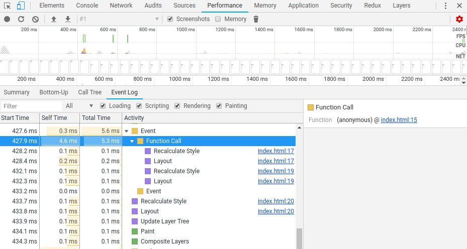

# 使用调试工具查看重排/回流

1. 新建 index.html 文件，内含如下代码：


    ```html
    <!DOCTYPE html>
    <html lang="en">
    <head>
    <meta charset="UTF-8">
    <meta name="viewport" content="width=device-width, initial-scale=1.0">
    <meta http-equiv="X-UA-Compatible" content="ie=edge">
    <title>Reflow</title>
    </head>
    <body>
    <h1 id="target">Reflow</h1>
    <button id="height">height</button>
    <script>
        var target = document.querySelector('#target');
        var heightBtn = document.querySelector('#height');
        heightBtn.addEventListener('click', function () {
        target.style.marginTop = '100px';
        console.log(target.getBoundingClientRect());
        target.style.marginTop = '200px';
        console.log(target.getBoundingClientRect());
        target.style.height = '100px';
        });
    </script>
    </body>
    </html>

    ```

2. Chrome 打开 index.html，并开启调试工具
3. 选择 Chrome 调试工具的 Performance 选项
4. 点击左上角的开始记录按钮，并点击被调试页面内的 reflow 按钮
5. 点击调试工具的停止记录，找到 Call Tree，结果如下所示：

    

    分析 Event log 发现示例中的第 17,19 和 20 行代码都触发了 layout（重排）
