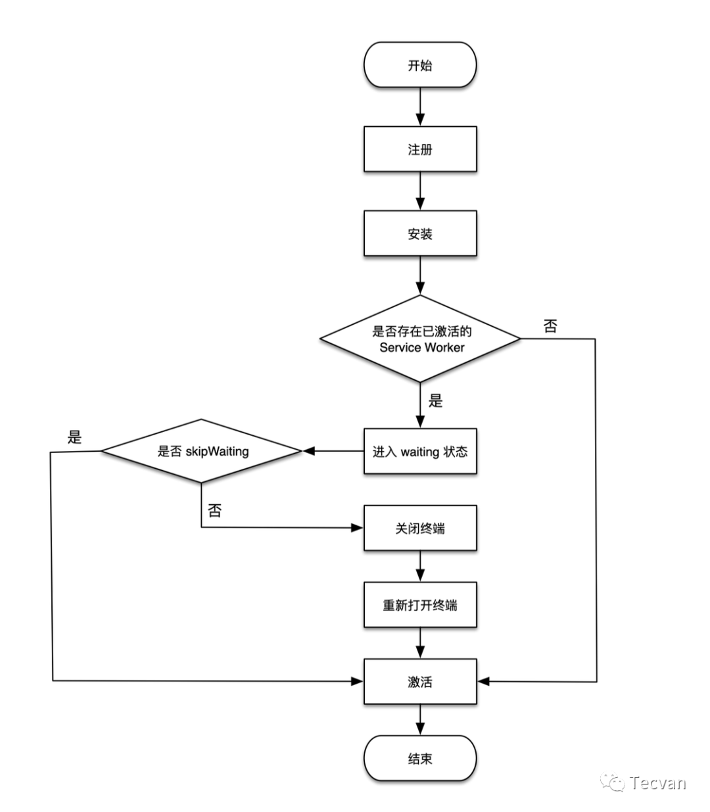
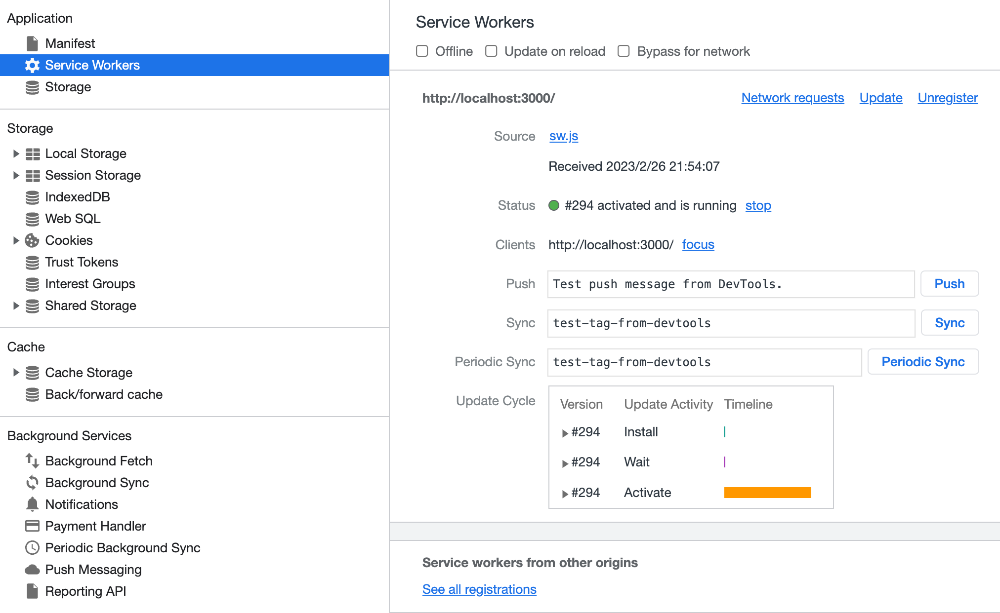

# Service worker

应用场景

- 离线访问：配合 CacheStorage 可以将应用中不变化的资源或者很少变化的资源长久的存储在用户端，提升加载速度、降低流量消耗、降低服务器压力，提高请求速度，让用户体验更加丝滑。
- 消息推送：激活沉睡的用户，推送即时消息、公告通知，激发更新等。如 web 资讯客户端、web 即时通讯工具、h5 游戏等运营产品。
- 事件同步：确保 web 端产生的任务即使在用户关闭了 web 页面也可以顺利完成。如 web 邮件客户端、web即时通讯工具等。
- 定时同步：周期性的触发Service Worker脚本中的定时同步事件，可借助它提前刷新缓存内容。

## 生命周期

### [ServiceWorker API](https://developer.mozilla.org/en-US/docs/Web/API/ServiceWorker)

ServiceWorker API 是用来管理 Service Service 的公共接口，在主线程和 Service Worker 线程都可以获取

- 主线程：

    ```ts
    const registration = ServiceWorkerContainer.getRegistration()
    registration.active // 激活中的 Service Worker 实例
    registration.installing // 安装中的 Service Worker 实例
    registration.waiting // 等待激活的 Service Worker 实例
    ```

- Service Worker 线程：

    ```ts
    self.registration.active // 激活中的 Service Worker 实例
    self.registration.installing // 安装中的 Service Worker 实例
    self.registration.waiting // 等待激活的 Service Worker 实例
    ```

生命周期状态可以通过 [statechange](https://developer.mozilla.org/en-US/docs/Web/API/ServiceWorker/statechange_event) 监听状态变化

1. `parsed`：Service Worker 被下载编译后的初始化状态
2. `installing`：安装中，在这个状态下，Service Worker 可以执行 `ExtendableEvent.waitUntil()` 来做一些前置处理。
3. `installed`：已安装，也叫等待中，通常表示新版本的 Service Worker 已经安装好，在等待当前已激活的 Service Worker 注销。
4. `activating`：激活中，类似 `installing`，可以执行 `ExtendableEvent.waitUntil()` 处理一些激活前置任务。
5. `activated`：已激活
6. `redundant`：注销，可能是被新的 Service Worker 取代了，或者是 Service Worker 安装失败了。


### ServiceWorkerGlobalScope

ServiceWorkerGlobalScope 是 Service Worker 主线程的全局作用域，可以在该线程里通过事件监听 Service Worker 的生命周期变化事件.

```js
self.addEventListener('<name>', handler);
```

ps：在全局作用域监听的可能不是单个 Service Worker 的事件，可能包含激活中、安装中和等待中的 Service Worker。

- [`active`](https://developer.mozilla.org/en-US/docs/Web/API/ServiceWorkerGlobalScope/activate_event)：新 Service Worker 的激活事件
- [`install`](https://developer.mozilla.org/en-US/docs/Web/API/ServiceWorkerGlobalScope/install_event)：新 Service Worker 的安装事件

### ServiceWorkerGlobalScope

ServiceWorkerGlobalScope 是 Service Worker 主线程的全局作用域，可以在该线程里通过事件监听生命周期状态的变化.

```js
self.addEventListener('<name>', handler);
```

- [`active`](https://developer.mozilla.org/en-US/docs/Web/API/ServiceWorkerGlobalScope/activate_event)：激活，某个
- [`install`](https://developer.mozilla.org/en-US/docs/Web/API/ServiceWorkerGlobalScope/install_event)：安装

## 注册更新



- 如果目前尚未有活跃的 Service Worker ，那就直接安装并激活。
- 如果已有 SW 安装着，向新的 swUrl 发起请求，获取内容和和已有的 SW 比较。如没有差别，则结束安装。如有差别，则安装新版本的 SW(执行 install 阶段)，之后令其等待(进入 waiting 阶段)。

    ps：Service Worker 一旦更新，需要**等所有的终端都关闭之后**，再重新打开页面才能激活新的 Service Worker。

- 如果不想等所有的终端都关闭再打开的话，只能通过 [skipWaiting](https://developer.mozilla.org/en-US/docs/Web/API/ServiceWorkerGlobalScope/skipWaiting) 的方法了。

    如果使用了 skipWaiting 的方式跳过 waiting 状态，直接激活了 Service Worker，可能会出现其他终端还没有受当前终端激活的 Service Worker 控制的情况，切回其他终端之后，Service Worker 控制页面的效果可能不符合预期，尤其是如果 Service Worker 需要动态拦截第三方请求的时候。为了保证 Service Worker 激活之后能够马上作用于所有的终端，通常在激活 Service Worker 后，通过在其中调用 self.clients.claim() 方法控制未受控制的客户端。self.clients.claim() 方法返回一个 Promise，可以直接在 waitUntil() 方法中调用。

    ps：Service Worker 在全局提供了一个 skipWaiting() 方法，skipWaiting() 在 waiting 期间调用还是在之前调用并没有什么不同。一般情况下是在 install 事件中调用它。

最佳实践

- 默认机制：等待用户关闭所有窗口后再激活更新

    存在问题：对于一些实时性访问要求较高的页面存在更新不及时问题，例如一些 H5 页面上了一些新的内容，并通过广告形式来引流，用户很可能看到的是旧页面，但用户不会二次访问。

- skipWaiting：上文提到的第三种机制

    存在问题：同一个页面，前半部分的请求是由 sw.v1.js 控制，而后半部分是由 sw.v2.js 控制。这两者的不一致性很容易导致问题，甚至网页报错崩溃，并且同样存在一些实时性要求高的页面不能及时更新的问题。

- skipWaiting + 刷新

    ```js
    navigator.serviceWorker.addEventListener('controllerchange', () => {
      window.location.reload();
    });
    ```

    存在问题：毫无征兆的刷新页面的确不可接受，影响用户体验。

- 用户提示 + skipWaiting + 刷新

    实现流程：

    1. 浏览器检测到存在新的(不同的)SW 时，安装并让它等待，同时触发 updatefound 事件。
    2. 我们监听事件，弹出一个提示条，询问用户是不是要更新 SW。
    3. 如果用户确认，则向处在等待的 SW 发送消息，要求其执行 skipWaiting 并取得控制权。
    4. 因为 SW 的变化触发 controllerchange 事件，我们在这个事件的回调中刷新页面即可。

    存在问题：实现较为复杂。

参考文献

- [ServiceWorkerRegistration: updatefound event](https://developer.mozilla.org/en-US/docs/Web/API/ServiceWorkerRegistration/updatefound_event)：有新的 Service Worker 安装时会触发该事件。
- [ServiceWorkerContainer: controllerchange event](https://developer.mozilla.org/en-US/docs/Web/API/ServiceWorkerContainer/controllerchange_event)：有新的 Service Worker 激活时会触发该事件。

    ```js
    // 主线程
    navigator.serviceWorker.addEventListener('controllerchange', handler)
    ```

## 请求拦截

TODO: ...

## 缓存管理

TOOD: ...

## 调试工具



- 「Offline」：复选框可以将 DevTools 切换至离线模式。它等同于 Network 窗格中的离线模式。
- 「Update on reload」：复选框可以强制 Service Worker 线程在每次页面加载时更新。
- 「Bypass for network」：复选框可以绕过 Service Worker 线程并强制浏览器转至网络寻找请求的资源。
- 「Update」：按钮可以对指定的 Service Worker 线程执行一次性更新。
- 「Unregister」：按钮可以注销指定的 Service Worker 线程。
- 「Push」：按钮可以在没有负载的情况下模拟推送通知。
- 「Sync」：按钮可以模拟后台同步事件。
-「Status」：告诉 Service Worker 线程的状态。

    - 此行上的数字指示 Service Worker 线程已被更新的次数。如果启用 update on reload 复选框，接下来会注意到每次页面加载时此数字都会增大。
    - 在状态旁边会看到 start 按钮(如果 Service Worker 线程已停止)或 stop 按钮(如果 Service Worker 线程正在运行)。
    
        ps：Service Worker 线程设计为可由浏览器随时停止和启动。使用 stop 按钮明确停止 Service Worker 线程可以模拟这一点。停止 Service Worker 线程是测试 Service Worker 线程再次重新启动时的代码行为方式的绝佳方法。它通常可以揭示由于对持续全局状态的不完善假设而引发的错误。
    
- 「Clients」：告诉 Service Worker 线程作用域的网页。

## 常见问题

## 参考文献

- [科普 | Service Worker 入门指南](https://www.51cto.com/article/707436.html)

---

- [Service Worker 实践指南](https://zhuanlan.zhihu.com/p/364621163)
- [网易云课堂 Service Worker 运用与实践](https://mp.weixin.qq.com/s/3Ep5pJULvP7WHJvVJNDV-g)
- [玩转Service Worker生命周期](https://juejin.cn/post/6854573213398073357)
- [使用service worker缓存CDN上的文件，遇到跨域问题](https://blog.csdn.net/kd_2015/article/details/123563118)
- [PWA 入门: 写个非常简单的 PWA 页面](https://zhuanlan.zhihu.com/p/25459319)
- [PWA 入门: 理解和创建 Service Worker 脚本](https://zhuanlan.zhihu.com/p/25524382)
- [service worker 是什么？看这篇就够了](https://zhuanlan.zhihu.com/p/115243059)
- [Random notes around service workers development and testing](https://mmazzarolo.com/blog/2022-06-18-service-workers-tips-and-tricks/)
- [Introduction to Service Worker ](https://developer.chrome.com/docs/workbox/service-worker-overview/) - Google’s introduction to service workers. It’s a great starting point if you know nothing about service workers.
- [Now THAT’S What I Call Service Worker! ](https://alistapart.com/article/now-thats-what-i-call-service-worker/) - Jeremy Wagner breaks down the performance improvements obtainable by using service workers.
- [thirty-four ](https://jeffy.info/) - effrey Posnick’s (WorkBox’s lead dev) blog. Talks mostly about service workers stuff.
- [Stuff I wish I’d known sooner about service workers ](https://gist.github.com/Rich-Harris/fd6c3c73e6e707e312d7c5d7d0f3b2f9) - Rich Harris’ notes around service workers development. Old but gold.
