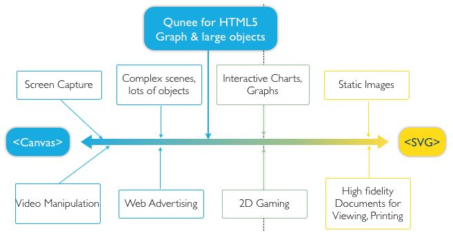
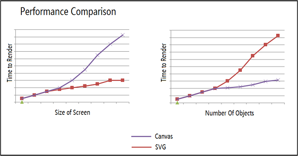

## SVG VS Canvas

SVG 和 Canva 是 HTML5 提供的两种绘图技术，也是多数 Web 图表库使用的渲染技术。

- [SVG 具体的应用场景是怎样的？为什么代替 Flash 的是 Canvas 而不是 SVG 呢？](https://www.zhihu.com/question/20074666)
- [初识canvas和svg | 使用场景及二者的区别](https://juejin.cn/post/6994371316082016287)
- [选择 Canvas 还是 SVG](https://g2-v3.antv.vision/en/docs/manual/tutorial/renderers)

### 工作机制

- Canvas：通过 JavaScript 指令来动态绘图（位图）
- SVG：使用 XML 文档来描述矢量图

### 使用场景

- Canvas：提供的绘图能力更底层，适合做到像素级的图形处理，能动态渲染和绘制大数据量的图形。
- SVG：SVG 抽象层次更高，声明描述式的接口功能更丰富，内置了大量的图形、滤镜和动画等，方便进行文档元素的维护，也能导出为文件脱离浏览器环境使用。 

### 性能对比

- Canvas：Canvas 的性能受画布尺寸影响更大，
- SVG：SVG 的性能受图形元素个数影响更大，在小数据量的情况下，SVG 的方案通常内存占用会更小，做缩放、平移等操作的时候往往帧率也更高

### 定制和交互

比较流行的看法是 SVG 做定制和交互更有优势，因为有类似 DOM 的结构，能快速应用浏览器底层的鼠标事件、CSS 样式、CSS3 动画等。不过基于 Canvas 做上层封装后也能实现类似的定制和交互，并且自由度更高。

### 总结

如果单就图表库的视角来看，选择 Canvas 和 SVG 各有千秋。小画布、大数据量的场景适合用 Canvas，譬如热力图、大数据量的散点图等。如果画布非常大，有缩放、平移等高频的交互，或者移动端对内存占用量非常敏感等场景，可以使用 SVG 的方案。
