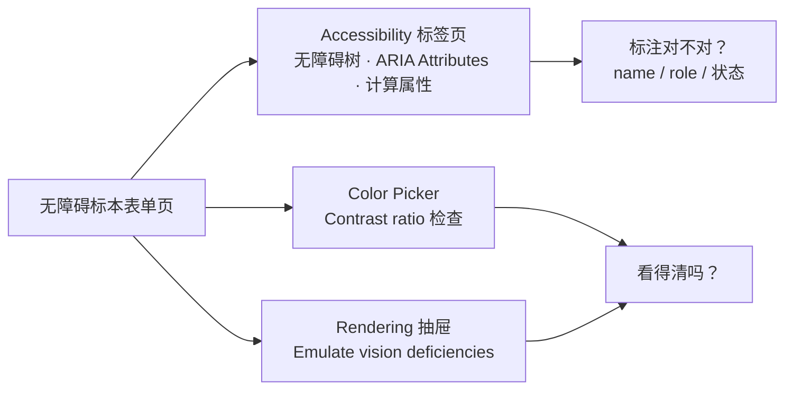

import { Canvas, Controls, Meta } from '@storybook/addon-docs/blocks';
import * as Stories from './accessibility.stories';

<Meta of={Stories} name="Docs" />

# 可访问性调试

判断一个页面的可访问性，官方文档把它拆成两个问题：用户能否用键盘或屏幕阅读器导航，以及页面元素有没有为屏幕阅读器正确标注。第一个问题 DevTools 帮不了——键盘走得通走不通要亲手用 Tab 走一遍，读屏行为要真实屏幕阅读器验证；第二个问题可以自动检测和修复，是 DevTools 无障碍工具的主场。本课就是这第二个问题的逐元素工作流：Elements 面板的 Accessibility（无障碍）标签页回答「浏览器把这个元素算成了什么」，对比度检查器与 Rendering 抽屉的视觉缺陷模拟回答「它看得清吗」。

本课的演示页是一个「无障碍标本」表单：无 label 的输入框、无可访问名称的图标按钮与纯颜色状态点、键盘不可达的假按钮、低对比度提示文字，外加一处视觉顺序与源码顺序相反的区块——五类典型问题各占一处。Controls 的「修复模式」开关切换到修复后的版本；readout 不是摆设，是页面内 mini 检查器的真实统计：用 `getComputedStyle` 逐元素算对比度、真实检查 label 与 aria 名称的存在性。可以预测：问题版报 5 个问题，切到「修复模式」readout 归零。

与[6.4 Lighthouse 审计](?path=/docs/lighthouse--docs)的分工要先划清：Lighthouse 是整页审计工具，一次跑完给分数和问题清单；本课是逐元素检查工作流——定位到具体节点、看它的计算结果与上下文、验证修复。Rendering 抽屉的完整工具面见[渲染诊断](?path=/docs/rendering-tools--docs)。



| 工具 | 入口 | 回答什么 |
| --- | --- | --- |
| Accessibility 标签页 | Elements → 选中节点 → Accessibility（可能藏在 More tabs 后） | 浏览器把元素算成了什么：无障碍树节点、role、name、ARIA 属性 |
| Source Order Viewer | Accessibility 标签页 → 勾选 Show source order | 视觉顺序与源码顺序一致吗 |
| 对比度检查器 | Styles → 颜色方块 → Color Picker → Contrast ratio | 这段文字看得清吗：比率数值与 AA / AAA 评级 |
| Emulate vision deficiencies | Rendering 抽屉 → Emulate vision deficiencies | 色觉与视障用户看到什么 |

## 快速上手

演示页左侧是标本表单（问题版），右侧 readout 四行读数来自页面内 mini 检查器：可检测问题总数、缺可访问名称、键盘不可达、低对比度文字（含它算出的最低比率）。Controls 的「修复模式」在问题版与修复版之间切换。

<Canvas of={Stories.Specimen} />
<Controls of={Stories.Specimen} />

最小闭环：

1. 打开 Elements，点左上角 Inspect（检查）或按 `Command+Shift+C`（macOS）/ `Control+Shift+C`（Windows、Linux），悬停标本里「邮箱」输入框并点选，切到 Accessibility 标签页：Computed properties（计算属性）区显示 role: textbox 而 name 为空——屏幕阅读器只会读到「编辑文本框」，不知道要填什么；readout 的「缺可访问名称」计 3。
2. 依次选中优惠码旁的 × 图标按钮与绿色圆点：图标按钮的 name 同样为空；圆点在计算属性里只有 role: image、没有名称——它的信息只由颜色承载。
3. 选中「优惠码每月 1 日刷新」提示文字，在 Styles 面板点 color 声明旁的颜色方块，展开 Color Picker 的 Contrast ratio 区：比率约 1.92:1，不满足 AA；对照 readout 的「低对比度文字 1 处 · 最低 1.92:1」。
4. 打开 Rendering 抽屉（Command Menu 输入 rendering → Show Rendering），把 Emulate vision deficiencies 切到 Protanopia (no red)：整页（含标本）即时换视角，绿圆点的「有货」信息消失；切到 Achromatopsia (no color) 更彻底。
5. 回到 Accessibility 标签页勾选 Show source order：标本底部两个步骤 chip 被描边标号，编号与视觉顺序相反——DOM 里第 2 步排在第 1 步前面，而屏幕阅读器与 Tab 顺序跟 DOM 走。
6. 把 Controls 的「修复模式」打开：readout 归零；重跑第 1、3 步——输入框的 name 变成「邮箱」，图标按钮有了「清除优惠码」，对比度达标。

| 读者操作 | 可观察证据 |
| --- | --- |
| Inspect 选中输入框、图标按钮、圆点 | Accessibility 标签页里 name 为空；readout「缺可访问名称 3」 |
| 用 Tab 键走一遍标本 | 假按钮被跳过（键盘不可达计 1）；修复后可聚焦 |
| Color Picker 展开 Contrast ratio | 修复前约 1.92:1 不满足 AA，修复后达标 |
| Emulate vision deficiencies 切 Protanopia | 纯颜色状态点的信息消失，修复版由文字承载 |
| 打开 Show code | 看到该 Canvas 实际执行的 `a11y-specimen.ts` |

边界：mini 检查器只覆盖缺名称、键盘不可达、低对比度三类可以在本地真实判定的问题，源码顺序不一致不计入其中；「键盘走不走得通」永远要亲手 Tab 验证。

## Elements 的 Accessibility 标签页

这个标签页把「屏幕阅读器眼中的元素」拆成两块来源：Computed properties 显示浏览器最终算出的结果——role、name 和各类状态，这是辅助技术实际拿到的东西；ARIA Attributes 显示作者写在 DOM 上的 `aria-*` 属性，是声明的来源。检查顺序由此确定：先看计算属性确认「暴露了什么」，发现 name 缺失或 role 不对，再回 ARIA 区和 DOM 树找「为什么」。

入口回查：

- Elements → DOM 树选中节点 → Accessibility 标签页；找不到时点 More tabs（更多标签页）展开，常用可拖到前排。
- Source Order Viewer：Accessibility 标签页内勾选 Show source order，视口里嵌套元素被描边并标注源码序号。页面视觉顺序常被 CSS 改变（flex order、定位），读屏与键盘 Tab 顺序却跟源码走——标本底部两个步骤 chip 用 `flex-direction: row-reverse` 把视觉顺序翻转，就是供它检查的例子。

### 无障碍树

无障碍树（accessibility tree）是 DOM 树的子集，只保留对屏幕阅读器呈现页面内容有用的节点。在 Accessibility 标签页顶部打开 Show accessibility tree（显示无障碍树）开关，Elements 主区就从 DOM 树换成全页无障碍树；展开并选择节点，细节显示在下方的计算属性区。随时切回 DOM 树，对应 DOM 节点保持选中——用这个来回切换理解「DOM 节点与无障碍树节点」的映射，是本课最常用的检查动作。

在标本上练习：打开全页无障碍树，找到标本表单——问题版里「邮箱」输入框的节点没有 name，屏幕阅读器无从读出字段用途；切「修复模式」后，label 文本成为 name 出现在节点上。注意树是浏览器算出来的结果，不是 DOM 里写了什么：所以「看树」是验证手段，源码里堆了 ARIA 不代表树里就有。

### ARIA 属性与计算属性

accessible name（可访问名称）可以来自多个来源——`<label>` 关联、`aria-label`、`aria-labelledby` 指向的元素文本、元素自身的文本内容——name 为空时按这个清单回查来源。ARIA 区把 DOM 上的 `aria-*` 原样列出，方便确认「声明了没」；计算属性区显示「最终生效了没」，两者不一致时以计算属性为准。

标本里的假按钮是本课最重要的反例：`<div role="button">使用此优惠码</div>` 的计算属性 role: button、name: 使用此优惠码，在 Accessibility 标签页里无懈可击——但它是假按钮，没有 tabindex、没有键盘行为，Tab 永远跳过它，Enter 与 Space 也触发不了。这正对应开场的问题一：标签页显示「浏览器算成了什么」，不保证「用起来如何」；键盘可用性要人工走查（标本里点假按钮，readout 的「键盘不可达」计 1）。修复方式不是继续堆 ARIA，而是换成原生 `<button>`。

## 颜色对比度

对比度（contrast ratio）是前景文字与背景的相对亮度之比，范围 1:1 到 21:1，阈值按文字大小分档：

| 文字 | AA | AAA |
| --- | --- | --- |
| 正文（小于 24px，或小于 18.66px 的粗体） | 至少 4.5:1 | 至少 7:1 |
| 大文字（至少 24px，或至少 18.66px 的粗体） | 至少 3:1 | 至少 4.5:1 |

整页发现问题用三路扫描，各接一个入口：

| 入口 | 用法 | 特点 |
| --- | --- | --- |
| CSS Overview | 捕获 overview → Colors 区 → Contrast issues → 点条目跳转元素 | 一次性列出全页低对比文字 |
| Issues 面板 | Settings → Experimental 搜 contrast issue，开启实验开关后刷新 DevTools | 边开发边自动报告（实验性功能） |
| Lighthouse | Categories 勾 Accessibility → Analyze page load → Contrast 区点元素链接 | 整页审计报告，与逐元素工作流的分工见开场 |

修复路径是逐元素的：点报告里的元素链接或在页面上用 Inspect 悬停——检查提示（inspector tooltip）里对比度数值旁出现警告图标；在 Elements 选中该文字，点 Styles 里 color 声明旁的颜色方块打开 Color Picker，展开 Contrast ratio 区，直接读出当前比率与 AA / AAA 评级。修复有两个动作：点 Use suggested color（使用建议颜色）一键应用 AAA 达标色，或在 shades（明暗梯度）预览里把圆点拖到 AA / AAA 分界线下方；改完从 Changes 面板整体复制，或配合 Workspace 直接写回源文件。

readout 的「低对比度文字」就是这么算出来的——mini 检查器对表单区内每个带直接文本的元素，取 `getComputedStyle` 的 color 与沿祖先链找到的第一个不透明背景，按 WCAG 相对亮度公式真算：

```ts
// WCAG 相对亮度：sRGB 通道先线性化，再按人眼敏感度加权
function relativeLuminance(rgb: [number, number, number]): number {
  const channel = (value: number): number => {
    const v = value / 255;
    return v <= 0.04045 ? v / 12.92 : ((v + 0.055) / 1.055) ** 2.4;
  };
  return 0.2126 * channel(rgb[0]) + 0.7152 * channel(rgb[1]) + 0.0722 * channel(rgb[2]);
}
// 对比率 =（较亮的亮度 + 0.05）/（较暗的亮度 + 0.05），范围 1:1 – 21:1
```

切「修复模式」，提示文字换成深灰、比率升到 7:1 以上，readout 显示「达标」。边界：mini 检查器统一按 4.5:1 判定（标本文字都是正文尺寸），大文字用 3:1；对比度只衡量亮度差，不衡量色相差——原因见常见问题。

## 视觉缺陷模拟

Rendering 抽屉的 Emulate vision deficiencies（模拟视觉缺陷）不改代码与样式，让整页——包括标本——即时按视障用户的视角渲染。对比度检查器给数字，模拟给体感，两者互补：数字回答「达没达标」，模拟回答「用起来是什么样」。

| 选项 | 模拟什么 |
| --- | --- |
| No emulation | 关闭模拟 |
| Blurred vision | 视力模糊 |
| Reduced contrast | 对比度下降 |
| Protanopia (no red) | 红色感知弱，绿红黄难以分辨 |
| Deuteranopia (no green) | 绿色感知弱，绿红黄难以分辨 |
| Tritanopia (no blue) | 蓝色感知弱，绿蓝难以分辨 |
| Achromatopsia (no color) | 部分或完全色盲 |

模拟最擅长暴露的问题恰是数字测不出的那种：标本问题版的绿圆点把「有货」这个信息完全交给颜色承载，切到 Protanopia 或 Achromatopsia，颜色信息消失，读不出任何状态；修复版改用文字徽章「有货」，任何模拟下信息都在。这也是修这类问题的通用做法——补文字或图形差异，而不是挑一个「色盲也分得清」的颜色组合。低对比提示文字在 Reduced contrast 下更难辨认，可再回对比度检查器拿数字。

边界：视觉缺陷模拟即时生效、不需要刷新；它只改变「看到什么」，不产生任何报告或评级，判定与修复仍回到 Contrast ratio 的数值。Rendering 抽屉里的另一组模拟——CSS 媒体特性（`prefers-contrast`、`forced-colors`、`prefers-color-scheme` 等）——服务于高对比度与强制配色场景，抽屉全貌见[渲染诊断](?path=/docs/rendering-tools--docs)。

## 最佳实践

- 先整页扫描，再逐元素：用 Lighthouse 或 CSS Overview 拿到问题清单，逐条进 Accessibility 标签页看计算结果与上下文，修复后复扫验证。整页工具告诉「哪里有」，标签页告诉「为什么、怎么修」，顺序反过来就是在逐元素扫全页。
- 优先原生语义：真 `<button>` 自带 role、键盘行为与名称来源，`<div role="button">` 全要手工补齐且极易漏 tabindex；`<label>` 关联比 placeholder 可靠——placeholder 不是名称来源，且输入后消失。
- 数字与体感各司其职：判定达标看 Contrast ratio 数值，发现「颜色是唯一信息载体」靠视觉缺陷模拟；两者都过了，再亲手用 Tab 走一遍键盘路径——这是模拟和数字都替代不了的最后一步。

## 常见问题

- Accessibility 标签页里 role、name 看起来都对，屏幕阅读器或键盘还是用不了。
  回到两问题模型：标签页只回答「浏览器算成了什么」，不验证「用起来如何」。用 Tab 走一遍——标本里 `role="button"` 的 div 计算属性无懈可击，但没有 tabindex，Tab 永远跳过它；换成原生 `<button>`，而不是继续堆 ARIA。
- 在 Elements 里找不到无障碍树。
  树不是默认主视图：先选中一个节点切到 Accessibility 标签页（可能藏在 More tabs 后），再打开其中的 Show accessibility tree 开关，Elements 主区才从 DOM 树换成全页无障碍树；两者随时互切，选中节点保持对应。
- 对比度过了 AA，Protanopia 模拟下两个状态还是分不清。
  对比度只衡量明度差，不衡量色相差——明度接近、色相不同的两个状态色可以同时达标，模拟把色相压缩后却趋同。这类问题靠视觉缺陷模拟发现，修复方式是补文字或形状差异，不必纠结换色。

## 总结回顾

摘要：

DevTools 的无障碍工具服务于「元素有没有为屏幕阅读器正确标注」这半个问题，键盘与读屏走查仍需人工。Elements 的 Accessibility 标签页把检查拆成计算属性（浏览器最终算出的 role、name、状态）与 ARIA Attributes（DOM 上的声明来源），Show accessibility tree 把主区换成全页无障碍树验证映射，Source Order Viewer 对照视觉顺序与源码顺序；假按钮的反例说明计算属性全对也不保证键盘可用。颜色对比度按 WCAG 阈值（正文 4.5:1、大文字 3:1 起）在 Color Picker 的 Contrast ratio 区读取与修复，整页发现交给 CSS Overview、Issues 实验开关或 Lighthouse；Rendering 抽屉的 Emulate vision deficiencies 提供七档视障视角，专治「纯颜色承载信息」这类数字测不出的问题。演示页的 mini 检查器用真实计算统计三类问题，切「修复模式」从 5 归零，把上述每一步都变成可对照的证据。

一句话：

> Accessibility 标签页验证「浏览器把它算成了什么」，对比度检查器与视觉缺陷模拟验证「它看得清吗」——逐元素修，整页扫交给 Lighthouse。

知识要点：

- DevTools 能自动检查哪类无障碍问题？哪类必须人工验证、怎么验证？
- Accessibility 标签页的 Computed properties 与 ARIA Attributes 各显示什么？全页无障碍树怎么开？
- accessible name 可以来自哪些来源？name 为空时按什么清单回查？
- 为什么 `role="button"` 的 div 在计算属性里全对却仍然不可用？修复方向是什么？
- WCAG 的 AA / AAA 对比度阈值是多少？Color Picker 里怎么读、怎么一键修复？
- Emulate vision deficiencies 有哪些选项？它与对比度数值怎么分工？
- 视觉顺序与源码顺序为什么会不一致？用什么工具对照？

## 参考资料

- [Accessibility features reference](https://developer.chrome.com/docs/devtools/accessibility/reference)
- [Make your website more readable](https://developer.chrome.com/docs/devtools/accessibility/contrast)
- [Apply other effects: enable automatic dark theme, emulate focus, and more](https://developer.chrome.com/docs/devtools/rendering/apply-effects)
- [Understanding WCAG 2.2: Contrast (Minimum)](https://www.w3.org/TR/WCAG22/#contrast-minimum)
