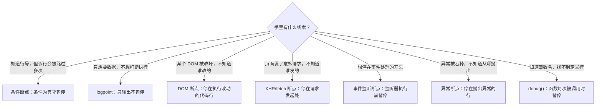

import { Canvas, Controls, Meta } from '@storybook/addon-docs/blocks';
import * as Stories from './advanced-breakpoints.stories';

<Meta of={Stories} name="Docs" />

# 高级断点

[行断点](?path=/docs/breakpoints--docs)要求你先回答「停在哪一行」，但真实问题往往从相反方向来：列表被改坏了却不知道是哪行代码改的、页面发了多余的请求却找不到发起者、异常打红了 Console 却看不到抛出点。本课的断点类型把「在哪里停」的判断交给 DevTools——按条件、按 DOM 变更、按请求 URL、按事件、按异常自动暂停；logpoint（日志点）则只记录、不暂停。它们全部服务于一个目标：在你不知道行号的时候，让执行停在正确的时刻。暂停之后的读现场手法（Scope、Watch、调用栈、单步）与上一课完全相同，本课不再重复。

设置入口只有三个位置：Sources 行号沟槽的右键菜单（条件断点、logpoint），Sources 右侧的专用窗格（DOM、XHR、事件监听、异常断点），以及 Console（`debug()` 函数断点）。遇到问题时按「手里有什么线索」选类型：

八类断点速查（官方按用途归类；Trusted Type 断点用于调试 Trusted Types 策略违规，属 DOM XSS 防护的安全专题，本课不展开）：

| 类型 | 中文释义 | 设置入口 | 停止或输出时机 |
| --- | --- | --- | --- |
| Conditional line-of-code | 条件断点 | Sources → 右键行号 → Add conditional breakpoint | 每次到达该行先求值条件，为真才暂停 |
| Logpoint | 日志点 | Sources → 右键行号 → Add logpoint | 到达该行向 Console 输出消息，从不暂停 |
| DOM | DOM 变更断点 | Elements → 右键节点 → Break on | 有代码改动目标节点时，停在改动处 |
| XHR / fetch | 请求断点 | Sources → XHR Breakpoints → Add breakpoint | 请求 URL 包含指定字符串时，停在请求发起处 |
| Event listener | 事件监听断点 | Sources → Event Listener Breakpoints 勾选事件 | 事件触发后、监听器执行前暂停 |
| Exception | 异常断点 | Sources → Breakpoints 窗格勾选 Pause on exceptions | 停在抛出异常的行 |
| Function | 函数断点 | Console 里执行 `debug(fn)` | 函数每次被调用时，等同首行行断点 |
| Trusted Type | CSP 违规断点 | Sources → CSP Violation Breakpoints | Trusted Types 违规（Sink / Policy Violations）时暂停 |

## 快速上手

演示页是一个「交互标本」：面板里的按钮分别触发未捕获异常、已捕获异常、fetch 请求、列表项修改、节点移除与整体重置；Controls 提供请求路径与修改目标两个参数，作为条件断点与 XHR 断点练习的输入。readout 实时显示未捕获异常、已捕获异常、请求、DOM 修改四类计数与最近一次动作的结果。所有动作函数都挂在全局 `specimen` 对象上，供函数断点一节在 Console 里调用。

<Canvas of={Stories.Specimen} />
<Controls of={Stories.Specimen} />

| 读者操作 | 可观察证据 |
| --- | --- |
| 点标本内任一动作按钮 | readout 对应计数与列表内容即时变化；Console 出现一条 `[标本]` 日志（「触发类型错误」伴随红色报错，属预期现象） |
| 切换「请求路径」「修改第几项」 | readout 的「请求路径」「修改目标」同步更新——这是 XHR 与条件断点练习要用的输入 |
| 按正文设好断点后再次点按钮 | 页面冻结，Sources 停在标本源码相应行，按 `F8` 恢复 |
| 打开 Show code | 看到该 Canvas 实际执行的 `trigger-specimen.ts`，六个动作函数一目了然 |

最小闭环——不读源码、不选行号，直接抓住「谁改了这个列表」：

1. 点两次「修改列表项」：目标项文本变化，「DOM 修改」计数增长。
2. 右键列表任意一项选检查（Inspect），Elements 自动定位到该 `li` 节点；再在 Elements 里右键它的父节点 `<ul>`，选 Break on → Subtree modifications（子树修改）。
3. 回到演示页再点「修改列表项」——页面冻结，Sources 自动停在标本中执行改动的代码行，Elements 的 DOM Breakpoints 窗格出现对应条目。
4. 按 `F8` 恢复；在 DOM Breakpoints 窗格右键该条目选 Remove，解除断点。

你刚完成的就是本课的主题：向 DevTools 描述「什么事件发生」，它替你找到「哪行代码干的」。接下来逐类展开。

## 条件断点与 logpoint

两者都设在**已经打开的已知行**上，都从右键行号沟槽的菜单进入，且共享同一个内联编辑器——右键行号选 Edit breakpoint（或在 Breakpoints 窗格右键条目选 Edit condition or logpoint），可以在下拉里互相切换类型、增删条件。它们解决行断点的两个痛点：该行会被路过多余的多次（条件断点做过滤——条件为真才暂停），以及不想暂停、只想要数据（logpoint 从不暂停，只向 Console 输出）。

### 条件断点

右键目标行行号 → Add conditional breakpoint（添加条件断点）→ 行下方弹出编辑框 → 输入任意合法 JavaScript 表达式 → 回车。执行每次到达该行都**先求值条件**（在该行执行之前），为真才暂停。图标是橙色问号。

- 条件里可以使用该行作用域内已经存在的参数与变量——求值发生在行执行前，变量必须已定义。
- 典型场景：循环或高频回调里只关心特定取值的那一次，例如 `x > 10` 或 `index === 3`。
- 修改或删除条件：右键行号选 Edit breakpoint，或右键 Breakpoints 窗格条目选 Edit condition or logpoint。

可观察证据（标本会话）：给 changeItem 中执行修改的行设条件断点，条件输入 `index === 3`；把「修改第几项」调到 2，点「修改列表项」——不暂停，计数照常更新；调到 3 再点——页面冻结，暂停在该行。

边界：条件表达式每次路过都会**真实求值**——带副作用的条件（自增、改 DOM）会改变页面行为；引用尚未初始化的变量会得到意料之外的结果。

### logpoint

右键目标行行号 → Add logpoint（添加日志点）→ 编辑框输入要输出的内容 → 回车。语法与 `console.log()` 完全相同：支持多个参数与任意表达式，例如 `"发起请求:", path, new Date().toLocaleTimeString()`。执行到达该行时向 Console 输出一条消息，**执行从不暂停**。图标是粉色双点。

与手写 `console.log()` 的分工：logpoint 不改源码、随设随删、可以加在第三方压缩代码上；手写日志要改源码并重新加载页面。需要「只在某些时候记录」时升级为条件日志点：在断点编辑框里给 logpoint 加上条件，条件为真时才输出。

可观察证据（标本会话）：给 sendRequest 里的 fetch 行设 logpoint，内容输入 `"发起请求:", path`；连点几次「发送请求」——Console 每次输出一条你定义格式的消息，页面从不暂停，请求计数照常增长。注意分辨：`[标本]` 开头的是演示页自己的日志，logpoint 输出的是你自定义的内容。

边界：logpoint 的求值同样发生在到达该行时——表达式引用的变量必须是该行执行前已存在的。

## DOM 断点

一个节点被改坏，你想找的是「改它的代码」。DOM 断点（DOM change breakpoints）从节点出发反查代码：设置入口在 Elements（元素）面板——右键目标节点 → Break on（暂停于）→ 选一类变更。启停与管理在 Elements → DOM Breakpoints 窗格；暂停时 Sources 右侧也有 DOM Breakpoints 窗格，可取消勾选或右键 Remove / Reveal。

三类变更的触发范围：

| Break on 类别 | 触发 | 不触发 |
| --- | --- | --- |
| Subtree modifications（子树修改） | 子节点增删、子节点内容变化 | 当前节点自身的属性变化 |
| Attribute modifications（属性修改） | 当前节点属性增删或值变化 | 子节点的任何变化 |
| Node removal（节点移除） | 当前节点被移除 | 移除它的子节点 |

可观察证据（标本会话）：

- 对 `<ul>` 设 Subtree modifications：点「修改列表项」（文本节点变化）或「移除列表项」（删除子节点）都会暂停。
- 对某个 `li` 设 Attribute modifications：点「修改列表项」会暂停——标本给目标项写入了 `data-modified` 属性；点「移除列表项」（移除的是另一项）不暂停。
- 对某个 `li` 设 Node removal：点「移除列表项」——暂停在执行移除的代码行。点「重置标本」恢复列表再练。

边界：DOM 断点暂停在「执行改动的代码」处，不是 DOM 变化的时间点；同一节点可能被多处代码改动——每一处都会触发。

## XHR/fetch 断点

页面请求了错误的 URL，想找到发起请求的源码。XHR/fetch 断点按 URL 子串匹配：Sources → 展开 XHR Breakpoints（XHR 断点）窗格 → 点 Add breakpoint → 输入字符串 → 回车。当任何请求的 URL **任意位置**包含该字符串时暂停，停在发起请求的调用处——XMLHttpRequest 是调用 send() 的那一行，fetch 就是 fetch() 调用行。

可观察证据（标本会话）：「请求路径」保持 `/api/items`，在 XHR Breakpoints 添加 `items`；点「发送请求」——暂停在标本的 fetch 调用行。把「请求路径」切到 `/api/users` 再点——不暂停（URL 不再包含 items）；切回 `/api/items`——恢复暂停。这就是「包含子串」的匹配规则：断点字符串不要求完整路径。

边界：匹配只看 URL，不能区分请求方法或响应内容；暂停发生在请求发出时，与响应成败无关（本标本的请求打在 Storybook 开发服务器上，状态码是什么不影响练习）。按方法、状态、负载等维度筛选请求是 Network 面板的职责。

## 事件监听断点

想停在某个事件处理的开头，却不知道监听器写在哪。事件监听断点（event listener breakpoints）按事件类型全局生效：Sources → 展开 Event Listener Breakpoints（事件监听断点）窗格 → 展开类别（如 Mouse）→ 勾选具体事件（如 click）；勾选类别名等于勾选该类全部事件。事件触发后、监听器第一行执行前暂停。类别覆盖 Animation、Clipboard、Device、Keyboard、Mouse、Timer、Load 等常见事件族，以窗格内实际列表为准。

与 Elements → Event Listeners（事件监听器）窗格的分工：那里列出**选中元素已注册**的监听器并可跳到源码，是静态清单；事件监听断点不挑元素、按事件类型动态捕捉，适合「不知道谁在监听」的场景。

可观察证据（标本会话）：勾选 Mouse → click，点「发送请求」按钮——页面冻结，Sources 停在标本点击处理器的第一行；按 `F8` 后点其他按钮——同样暂停。练完取消勾选，否则点页面任何地方都会暂停。

边界：它是全局开关，对页面所有元素、所有 frame 的该类事件生效（包括 Storybook Controls 所在的界面，见常见问题）；要精确到单个元素的单个监听器，用 Event Listeners 窗格定位处理器源码设行断点，或用下一节的 `debug()`。

## 异常断点

异常打红了 Console，但堆栈里全是框架代码或根本没堆栈。异常断点（exception breakpoints）按异常是否被捕获分两档，位于 Sources → 右侧 Breakpoints 窗格：

- **Pause on uncaught exceptions**（未捕获异常时暂停）：任何没有被 catch 的异常抛出时，停在抛出行。
- **Pause on caught exceptions**（已捕获异常时暂停）：连将被 catch 的异常也停在 throw 行——用于「异常被框架吞掉了、看不到现场」的场景。

可观察证据（标本会话）：

1. 勾选 Pause on uncaught exceptions，点「触发类型错误」——暂停在标本的 throw 行，此时 Console 还没有红色报错（执行停在报错发生之前）；按 `F8` 后红色报错出现，「未捕获异常」计数已更新。
2. 只保留 uncaught 勾选，点「触发已捕获错误」——不暂停，异常被标本的 try/catch 捕获。
3. 勾选 Pause on caught exceptions 再点——暂停在 try 块内的 throw 行；按 `F8` 后 catch 才执行，「已捕获异常」计数更新。

边界：

- 异步代码中异常会跨 promise 传递——DevTools 会查找 rejection 处理器来决定按哪一档暂停。
- 大型框架内部大量使用 try/catch 做控制流：开启 caught 后会频繁暂停在第三方代码里，配合 Ignore List 处理（右键调用栈中的帧或脚本 → Add script to ignore list），异常经过被忽略的脚本时不再暂停。

## 函数断点 debug()

知道函数名、不想在压缩代码里翻行号时，用 Console Utilities API 的 `debug(fn)`：传入**函数对象**（不是函数名字符串），该函数每次被调用时自动暂停——等同在函数首行设了行断点。`undebug(fn)` 解除。

- 作用域限制：函数对象必须能被 Console 引用，否则抛 ReferenceError。官方策略：先设任意行断点暂停，再在 Console 里调用 `debug()`——暂停时刻作用域可见的函数都能传。
- 同族 `monitor(fn)`：不暂停，每次调用向 Console 输出函数名与实参——函数版的 logpoint，`unmonitor(fn)` 解除。

可观察证据（标本会话）：演示页把动作函数挂在全局 `specimen` 对象上，可直接练习：

1. Console 执行 `debug(specimen.sendRequest)`，点「发送请求」——暂停在 sendRequest 第一行。
2. 执行 `undebug(specimen.sendRequest)` 再点——不再暂停。
3. 执行 `monitor(specimen.changeItem)`，点「修改列表项」——Console 输出函数名与实参（`index` 的当前值），执行不暂停。

边界：Console Utilities API 只能在 DevTools 的 Console 里调用，写进页面源码无效；`debug()` 是会话级的——刷新页面后函数对象重建，需要重新执行。

## 最佳实践

- **按打扰代价从低到高选。** 能 logpoint 就别条件断点，能条件断点就别行断点，行断点解决不了再上事件、异常这类全局开关。先用不打断的手段看清频率与取值，再决定要不要真的停——每次暂停都要手动 Resume。
- **全局断点用完立即关。** 事件监听断点、Pause on caught exceptions 全局生效，查完一个问题就取消勾选；否则之后每次点击、每个框架内部的 catch 都会打断你。
- **从现象反查代码，用 DOM 与 XHR 断点。** 「谁改了这个节点」「谁发了这个请求」不必读源码找行号——在 Elements 或 XHR Breakpoints 窗格描述目标现象，让 DevTools 停在肇事代码上；条件断点回答的是另一个问题：「这一行这次为什么不一样」。
- **临时监控函数先用 debug() / monitor()。** 比在压缩代码里翻行号快，随加随删；但它们是会话级的，刷新即失效，需要长期生效的记录改用 logpoint。

## 常见问题

- 勾选了 Mouse → click 之后，点 Controls 里的滑块也会暂停。
  设计行为：事件监听断点对页面所有 frame 的该类事件生效，调试界面也在其中。练习时只点演示页内的按钮；尽量展开类别、只勾具体事件而不是勾整个类别；排查完成后取消勾选。要针对单个元素，改用 Elements → Event Listeners 窗格定位处理器。
- 开了 Pause on caught exceptions 后，不停暂停在框架代码里。
  正常现象：框架内部大量用 try/catch 做控制流。右键调用栈中的框架帧选 Add script to ignore list（或 Settings → Ignore List），异常经过被忽略的脚本时不再暂停；日常只勾 uncaught，需要看被吞掉的异常时再临时打开 caught。
- XHR 断点设了却一直不暂停。
  匹配规则是「请求 URL 任意位置包含该字符串」——核对子串确实出现在请求 URL 里（协议、域名、路径、查询参数的任一处都算）。另外它停在请求发起处而不是响应到达时，请求成功与否不影响触发。
- 对节点设了 DOM 断点，改动发生了却没暂停。
  检查类别是否选对：Subtree modifications 不含当前节点自身的属性变化——属性变化要选 Attribute modifications；Node removal 只对「当前节点被移除」生效，移除它的子节点不算。在 DOM Breakpoints 窗格里逐条核对已设的类别，再对照上表确认改动类型。

## 总结回顾

摘要：

上一课的行断点要求先知道停在哪一行；本课把选行工作交给 DevTools。条件断点（右键行号 → Add conditional breakpoint）在每次到达该行时先求值条件、为真才暂停，适合过滤循环与高频回调；logpoint 用 `console.log()` 同款语法在到达该行时输出、从不暂停，加上条件就成了条件日志点。DOM 断点在 Elements 里对节点右键 → Break on，按 Subtree modifications / Attribute modifications / Node removal 三类变更暂停在执行改动的代码行；XHR/fetch 断点在请求 URL 包含指定子串时停在请求发起处；事件监听断点勾选事件类别，在监听器执行前全局暂停；异常断点用 Pause on uncaught / caught exceptions 分别停在未捕获与被捕获异常的抛出行，必要时配合 Ignore List 排除框架代码；Console 里 `debug(fn)` 等同函数首行行断点，`monitor(fn)` 只记录调用与实参。所有暂停后的读现场手法与上一课一致。

一句话：

> 行断点问「停在哪一行」，高级断点问「什么条件、什么事件」——把选行交给 DevTools，就能从未知的源码里直接抓到改 DOM、发请求、抛异常的那段代码。

知识要点：

- 条件断点的条件何时求值？条件为假时会怎样？写条件要注意什么？
- logpoint 与手写 console.log 的分工是什么？如何只在条件为真时记录？
- DOM 断点的三类各在什么时机触发、何时不触发？设置与管理入口在哪？
- XHR/fetch 断点按什么规则匹配？停在哪个位置？
- 事件监听断点的生效范围是什么？与 Elements → Event Listeners 窗格如何分工？
- Pause on uncaught / caught exceptions 有什么区别？暂停过多时如何配合 Ignore List？
- debug() 与 monitor() 各做什么？作用域与会话上的限制怎么处理？

## 参考资料

- [Pause your code with breakpoints](https://developer.chrome.com/docs/devtools/javascript/breakpoints)
- [Console Utilities API reference](https://developer.chrome.com/docs/devtools/console/utilities)
