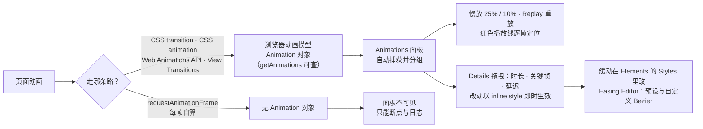

import { Canvas, Controls, Meta } from '@storybook/addon-docs/blocks';
import * as Stories from './animations.stories';

<Meta of={Stories} name="Docs" />

# 动画调试

Animations（动画）面板是挂在 Drawer（抽屉区）里的动画观察台：面板开着的时候，页面动画一发生就被自动捕获、按组陈列，之后随时可以慢放、重放、逐帧拖动播放线，甚至直接在时间轴上拖拽修改时序。本课的核心判断只有一句：**面板捕获的是浏览器动画模型里的 `Animation` 对象——CSS transition、CSS animation、Web Animations API（Web 动画接口）、View Transitions API 与滚动驱动动画都在这套模型里；而 JS 用 requestAnimationFrame（rAF，请求动画帧）逐帧自绘的动画不产生 `Animation` 对象，面板永远看不到**。排查「动画在面板里怎么不出现」，第一步永远是分清动画走的哪条路。

演示页是一个「动画标本」：同一段从左到右的滑行，用四种实现各放一遍——Controls 切换动画类型、时长（ms）与缓动曲线，点标本里的「播放」触发一轮。readout 四行读数全部来自页面侧的动画模型与真实计时：`Animation.playState` 状态、墙钟实测耗时、结束时的 `Animation.currentTime` 与页面 `Animation` 对象数。可以预测：前三种模式对象数为 1、面板能捕获；切到「JS 驱动（rAF）」，状态读数照常从 running 走到 finished，对象数却是 0、面板里空空如也——这就是捕获边界的现场证据。



| 区域 | 位置 | 作用 |
| --- | --- | --- |
| Controls | 面板顶部 | Clear all 清空捕获、Pause 暂停、速度按钮（100% / 25% / 10%） |
| Overview | Controls 下方 | 陈列捕获的动画分组；悬停缩略图即时预览 |
| Timeline | 面板中部 | 时间轴；红色播放线可点击或拖动定位 |
| Details | 面板下部 | 逐行动画明细；拖拽圆点改时长、关键帧、延迟 |

一条边界先画清楚：本课管「动画本身的检查与修改」。动画卡不卡、掉不掉帧是渲染健康问题——用[渲染诊断](?path=/docs/rendering-tools--docs)的叠加层看「哪里异常」，用[录制与分析轨迹](?path=/docs/performance-traces--docs)回答「为什么」。

## 快速上手

标本分三块：舞台区是一段轨道与一颗会滑行的球；「播放」按钮每次触发一轮完整动画（从左到右）；readout 四行读数全部来自页面侧的动画模型与真实计时。Controls 的「动画类型」「时长（ms）」「缓动曲线」设定下一次播放，改动会立刻把标本重置回待播放。

<Canvas of={Stories.Specimen} />
<Controls of={Stories.Specimen} />

最小闭环——把捕获、慢放、重放、改时序串一遍：

1. 打开 DevTools，按 `Command+Shift+P`（macOS）或 `Control+Shift+P`（Windows、Linux）打开 Command Menu，输入 animations，选 **Show Animations**——面板出现在底部 Drawer。也可以走 ⋮ → More tools → **Animations**。
2. 点标本的「播放」：Overview 里出现一个动画分组，Details 里多出一条动画明细；readout「页面 Animation 对象数」为 1。
3. 选中分组，把速度按钮切到 **10%**，点 **Replay**：球以约十分之一速度重跑——这就是慢放。速度档设置的是文档时间轴的 playbackRate（播放速率），之后新触发的动画也按慢速播放：「实测耗时」读数拉长到约 10 倍，而结束时的「Animation.currentTime」仍接近设定时长——两把钟各量各的。
4. 把速度档切回 **100%**，在 Timeline 上点击或拖动红色播放线：球的位置跟着播放线走——逐帧 scrub（刮擦）定位。
5. 在 Details 里把动画条两端的圆点向外拖：时长被改长，改动以 inline style 写到球元素上，Elements 里能看到这行样式；重放即按新时序走。
6. Controls 切到「JS 驱动（rAF）」再点播放：readout 状态照常 running → finished，但「页面 Animation 对象数」为 0，Overview 不会再出现新分组——rAF 自绘动画在捕获边界之外。

| 读者操作 | 可观察证据 |
| --- | --- |
| 点「播放」（前三种模式） | Overview 出现分组；readout 状态 running → finished，对象数 1，实测耗时 ≈ 设定时长 |
| 10% 速度档 + Replay 或再播放 | 球以约 1/10 速度移动；实测耗时 ≈ 10 × 设定时长，currentTime 仍 ≈ 设定时长 |
| 拖动红色播放线 | 球的位置跟随播放线，可逐帧定位 |
| 拖 Details 动画条端点 / 中段 | 时长或延迟即时改变，改动以 inline style 落在元素上 |
| 切到「JS 驱动（rAF）」播放 | 状态读数照常走完，对象数 0，面板无新分组 |
| 打开 Show code | 看到该 Canvas 实际执行的 `animation-specimen.ts` |

## 捕获与分组

面板的捕获模型一句话：**打开面板 = 开始监听动画模型**。动画一创建就被记录成一个动画分组（animation group），动画结束后分组仍留在面板里，随时慢放重放，点 Clear all 才清空。因此「看不看得到」由两件事决定：动画走不走动画模型，以及面板是否先于动画打开——页面加载即播的动画，要开着面板刷新页面才捕得到。

### 会被捕获的动画

| 动画类型 | Details 里的对象 | 面板行为 |
| --- | --- | --- |
| CSS transition | `CSSTransition` | 捕获，一条动画明细 |
| CSS animation | `CSSAnimation` | 捕获，含关键帧条 |
| Web Animations API | `WebAnimation`（`element.animate()` 创建） | 捕获 |
| View Transitions API | 视图过渡动画 | 捕获并自动暂停，便于编辑 `::view-transition` 伪元素 |
| 滚动驱动动画（scroll-driven） | 含滚动时间轴的动画 | 捕获；Overview 用图标区分滚动驱动与时间驱动，时间轴单位是像素而不是毫秒 |
| requestAnimationFrame 自绘 | 无（不产生 `Animation` 对象） | 不捕获 |

判断入口就在页面侧：`document.getAnimations()` 返回当前文档动画模型里的全部 `Animation` 对象——它查得到的，面板才捕获得到。标本 readout 的「页面 Animation 对象数」就是这个 API 的读数：前三种模式播放中都是 1，rAF 模式恒为 0。

```ts
// 页面侧自查：这个动画走没走动画模型？
document.getAnimations().length; // 0 = 面板不会捕获到任何东西
const anim = document.getAnimations()[0];
if (anim) {
  anim.playState; // 'running' | 'paused' | 'finished' | ...
  anim.currentTime; // 动画时间轴上的当前时间（毫秒）
}
```

View Transitions（视图过渡）是捕获里的特例：面板开着时触发视图过渡，动画被捕获并立即暂停——在 Elements 顶部展开的 `::view-transition` 伪元素树里慢慢改样式，再 Resume / Replay 看效果，适合逐帧调过渡动画。

### 动画分组与元素联动

分组规则：面板按「开始时间（不含 delay）相近」推断分组——同一段脚本里触发的动画进同一组，异步触发的各归各组。同一条动画用在两个元素上时共用一种颜色，颜色本身随机、没有含义；无限循环的动画把定义段画成深色、后续迭代淡出。

Details 与页面双向联动：悬停某行动画，页面里对应元素高亮；点击一行，Elements 面板选中该元素——从「哪条动画」到「哪个元素」一步跳转。名字列默认较窄，拖宽可看全元素名。

## 回放与慢放

回放有四个入口，全部作用于已捕获的分组：

- **Replay 按钮**：选中分组后点击，整组动画从头重跑——动画结束后分组仍在，任何时候可用。
- **红色播放线**：在 Timeline 上点击或拖动，把播放线挪到那一刻，页面动画同步走到对应进度——逐帧定位。
- **缩略图悬停**：Overview 里把鼠标悬在分组缩略图上，页面即时预览那一段。
- **速度按钮 25% / 10%**：把播放放慢，配合 Replay 就是慢动作复盘。

慢放是真实放慢，不只是预览特效：速度档通过文档时间轴的 playbackRate 放慢页面里的动画，事件时序随之被拉长。标本读数把这一点变成可核对的证据：10% 档下重放或再点「播放」，「实测耗时（墙钟）」≈ 10 × 设定时长，而结束时的「Animation.currentTime」仍 ≈ 设定时长——currentTime 量动画时间轴，实测耗时走墙钟。排查「动画时序不对」先看这对读数：实测耗时异常，十有八九是速度档没切回 100%。

## 修改时序

Details 里每行动画都可拖，三种拖拽对应三个参数：

| 拖拽目标 | 改什么 |
| --- | --- |
| 动画条两端的圆点 | duration（时长） |
| 动画条内的白色圆点 | 关键帧时间（keyframe offset） |
| 动画条本体（非圆点处）横向拖 | delay（延迟）与开始时间 |

改动即时生效：页面里对应元素的下一次运动立刻按新时序走；改动以 inline style 写到元素上，Elements 里能看到这行样式。

两条边界：修改不回写源码——刷新页面或重新触发动画就回到代码里的设定，确认参数后要回 CSS / JS 里改真源；面板不负责改关键帧定义与缓动曲线，后者在下一节的 Easing Editor。

## 缓动编辑（Easing Editor）

缓动（easing，缓动函数）不在 Animations 面板里改。入口在 Elements > Styles：`transition-timing-function` 或 `animation-timing-function` 声明旁有一个紫色图标，点开是 Easing Editor（缓动编辑器）——关键词预设（linear、ease-in、ease-out、ease-in-out）、弹性与回弹等曲线预设、自定义 cubic-bezier 控制点，编辑时右侧小球实时预览手感。

标本上的操作路径：动画类型选「CSS animation」或「CSS transition」播放一次，在 Elements 里选中球元素，Styles 里找到内联的 timing 声明，点紫色图标调曲线，回标本再点「播放」对照。Web Animations API 的缓动写在 `element.animate()` 的参数里，Styles 里没有对应声明——去 Show code 看 `animation-specimen.ts`。

## 最佳实践

- **先开面板，再触发动画。** 捕获只发生在面板打开期间；页面加载即播的动画，开着面板刷新页面再捕。
- **调试不改源。** 慢放用速度档、改时序用拖拽，确认手感后把参数抄回 CSS / JS——面板改动是 inline style，刷新即失、重播即覆。
- **两把钟分开读。** 实测耗时走墙钟、`Animation.currentTime` 走动画时间轴；前者异常先查速度档是否没回 100%。
- **动画性能是另一门仪器。** 掉帧卡顿交给渲染诊断叠加层与 Performance 录制；Animations 面板回答「动画长什么样、怎么改」，不回答「卡不卡」。

## 常见问题

- 点了播放，Overview 里什么都没有。
  先看面板是否后开——捕获只记录面板打开后发生的动画，开着面板重新触发或刷新页面；再切「JS 驱动（rAF）」对照：readout「页面 Animation 对象数」为 0 说明动画不经过动画模型（rAF 每帧自算），面板永远捕获不到，这类动画用断点与日志排查。
- 在 Storybook 文档页里打开 DevTools，怎么都捕获不到标本的动画。
  标本跑在 iframe 里，个别环境下外层页面的 Animations 面板不含它。把标本作为独立页面打开再试：地址栏访问 `http://localhost:6006/iframe.html?id=animations--specimen`（本地默认端口），在标本页上打开 DevTools 与 Animations 面板。

## 总结回顾

摘要：

Animations 面板挂在 Drawer 里，自动捕获浏览器动画模型里的 `Animation` 对象：CSS transition、CSS animation、Web Animations API、View Transitions API 与滚动驱动动画都在射程内；rAF 每帧自算的动画不产生 `Animation` 对象、永远捕获不到，页面侧可用 `document.getAnimations()` 预判。捕获按开始时间自动分组、留存到 Clear all 为止；Overview 悬停预览、Timeline 红色播放线逐帧定位、Replay 随时重跑，25% / 10% 速度档把文档时间轴真实放慢——实测耗时长到约 10 倍而 `Animation.currentTime` 不变，两把钟各量各的。Details 里拖拽圆点直接改时长、关键帧与延迟，改动以 inline style 即时生效、不回写源码；缓动曲线要到 Elements > Styles 的 Easing Editor 里改。动画标本用四种实现同一段滑行，把「哪些动画走模型、哪些不走」变成可核对的读数。

一句话：

> Animations 面板只认浏览器动画模型里的 Animation 对象——getAnimations 查得到才有得调，rAF 自绘的动画要用断点与日志。

知识要点：

- 打开面板有哪两条路？捕获发生在什么时间窗口，动画结束后分组还在吗？
- 哪些动画类型会被捕获？为什么 rAF 自绘的动画面板永远看不到？页面侧用什么 API 预判？
- 动画分组按什么规则推断？颜色有没有含义？
- 回放的四个入口分别怎么用？
- 慢放为什么能拉长实测耗时，却拉不长 `Animation.currentTime`？
- Details 里三种拖拽各改什么参数？改动落在哪里、什么时候失效？
- 缓动曲线在哪里改？Web Animations API 的缓动为什么在 Styles 里看不到？

## 参考资料

- [Inspect and modify CSS animation effects](https://developer.chrome.com/docs/devtools/css/animations)
- [CSS feature reference](https://developer.chrome.com/docs/devtools/css/reference)
- [Chrome DevTools Protocol: Animation](https://chromedevtools.github.io/devtools-protocol/tot/Animation/)
