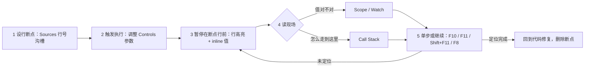

import { Canvas, Controls, Meta } from '@storybook/addon-docs/blocks';
import * as Stories from './breakpoints.stories';

<Meta of={Stories} name="Docs" />

# 断点调试

[Console 入门](?path=/docs/console--docs)里的日志是「事后回看」：消息打出来时，值已经是结果。断点调试反过来——把执行**停在问题发生的那一刻**，当场读取每个变量。本课在 Sources（源代码）面板完成这件事：设置行断点（line-of-code breakpoint，让执行在指定行执行前暂停），用单步操作控制执行节奏，在 Scope（作用域）、Watch（监视表达式）与 Call Stack（调用栈）三个窗格里读取暂停时刻的现场。主线只有一条：**先停得住，再看得到，最后走得动**。演示页是一个带稳定 bug 的「计算标本」：报告行的应付金额与人工核算不符，你会沿着计算链设断点、暂停、单步、回溯，自己找出算错的那一行——正文不直接给出答案。条件断点、logpoint（日志点）、DOM / XHR / 事件监听器 / 异常断点见[高级断点](?path=/docs/advanced-breakpoints--docs)，本课只覆盖行断点与调试器基本工作流。

一次断点调试会话的完整循环：

调试器操作速查（单步按钮在 Sources 右上调试工具条；快捷键在焦点位于 DevTools 时生效）：

| 操作 | 快捷键（Mac / Windows·Linux） | 作用 |
| --- | --- | --- |
| 暂停 / 继续 Resume script execution | `F8` 或 `Command+\` / `Control+\` | 继续执行到下一个断点或结束 |
| 单步跳过 Step over next function call | `F10` 或 `Command+'` / `Control+'` | 整行执行，不进入行内调用的函数，停在下一行 |
| 单步进入 Step into next function call | `F11` 或 `Command+;` / `Control+;` | 进入当前行所调用函数的第一行 |
| 单步跳出 Step out of current function | `Shift+F11` 或 `Command+Shift+;` / `Control+Shift+;` | 执行完当前函数剩余部分，停在调用者 |
| 运行到指定行 Continue to here | 右键该行选 Continue to here；或按住 `Command` 点击行号（Windows、Linux `Control`） | 暂停期间一次执行到该行，比连续单步快 |
| 增 / 删行断点 | 光标在行内 `Command+B` / `Control+B` | 在当前行增删行断点 |
| 相邻帧切换 | `Control+.` / `Control+,` | 在调用栈的相邻帧间上下移动 |

## 快速上手

演示页是一个「计算标本」：Controls 提供单价、数量、折扣三个参数，任一变化触发一轮重新计算；报告行显示算出的应付金额，人工核算行显示正确金额——两者不一致，bug 稳定复现。每轮计算还会向浏览器真实的 Console 输出一条 `[标本]` 消息，源链接可直接跳进 Sources。

<Canvas of={Stories.Specimen} />
<Controls of={Stories.Specimen} />

| 读者操作 | 可观察证据 |
| --- | --- |
| 调整「单价」「数量」「折扣」 | 报告行与 readout 同步更新；DevTools 打开时 Console 每轮多一条 `[标本]` 消息 |
| 点 Console 消息尾部的 `calc-specimen.ts:行号` 源链接 | 跳到 Sources 面板该文件对应行 |
| 点行号沟槽设断点 | 行号出现蓝色标记，Breakpoints 窗格出现条目 |
| 再调整任一参数 | 页面暂停：断点行高亮、行内出现 inline 值、Scope 窗格出现 Local 分组 |
| 打开 Show code | 看到该 Canvas 实际执行的 `calc-specimen.ts` |

最小闭环——先把会话跑起来，完成一次「暂停并恢复」：

1. 点 Canvas 右上 Show code 通读 `calc-specimen.ts`：从 runSpecimen 经 buildReport、calcOrder 分岔到 subtotal 与 applyDiscount，最后 formatYuan 拼出报告行——bug 就藏在这条链上。
2. 打开 DevTools（macOS 按 `Command+Option+I`；Windows、Linux 按 `F12` 或 `Control+Shift+I`），点顶部标签切到 Sources 面板；找不到文件时按 `Command+P`（Windows、Linux `Control+P`）按文件名搜索，或先调整一次参数、再点 Console 里 `[标本]` 消息尾部的源链接直达。
3. 给 calcOrder 的 `return applyDiscount(amount, discount);` 行点击行号沟槽设断点——行号出现蓝色标记，右侧 Breakpoints 窗格列出该条目。
4. 回到 Docs 页，调整「折扣 %」——预览页冻结，断点行高亮，行内变量以 inline 值显示，Scope 窗格出现 Local 分组。
5. 按 `F8`（或点 Resume 按钮）恢复——报告行与 readout 更新为新一轮结果。

会话已经能停、能看、能走。接下来三个小节把「哪一行把金额算坏」拆到三个面板上：单步执行控制节奏，Scope 与 Watch 验证值，调用栈回溯来路。

## 行断点

行断点让执行在指定行**执行前**暂停，适合「已经圈定可疑区域」的场景——标本里应付金额的整条计算链。设法有三种，效果完全相同：

- 在 Sources 编辑器里点击目标行行号左侧的沟槽（gutter），行号上出现蓝色标记；
- 光标停在目标行内，按 `Command+B`（Windows、Linux `Control+B`）；
- 在源码里写 `debugger;` 语句——与 UI 行断点等价，区别是它长在代码里，不删就会一直暂停。

暂停后的样子：断点行高亮，行内变量以 inline 值（内联值）标在声明旁，右侧 Breakpoints 窗格出现对应条目，页面整体冻结。

Breakpoints 窗格是断点的管理中枢：

| 操作 | 做法（Sources → 右侧 Breakpoints 窗格） |
| --- | --- |
| 逐条启停 | 条目前的复选框；停用后编辑器里的断点标记变透明 |
| 编辑 / 删除单条 | 悬停条目点编辑或删除图标，或右键条目 |
| 批量启停 / 删除 | 右键文件分组或条目，菜单里有启用 / 禁用 / 移除全部等批量动作 |
| 全部停用（不删除） | 调试工具条点 Deactivate breakpoints，点亮表示停用生效中，再点恢复 |
| 无视断点恢复一次 | 按住 Resume 按钮选 Force script execution |

可观察证据（标本会话）：给 calcOrder 的 `return applyDiscount(amount, discount);` 行设断点，调整「折扣 %」——预览页冻结、该行高亮、参与运算的值以 inline 显示；Breakpoints 窗格出现 `calc-specimen.ts` 分组与该条目；取消条目复选框后再调参数，不再暂停，重新勾选即恢复。

边界：

- 断点在**行执行前**触发——执行流不经过该行就不会暂停；标本只在参数变化时重新计算，参数没变就不触发。
- 右键行号选 Never pause here（橙色标记）：该语句永不暂停，并会屏蔽 `debugger` 语句等在该处的暂停。

## 单步执行

暂停只停住了时间，单步操作决定接下来往哪走（快捷键见开场速查表）：

- **Step over（`F10`）** 把当前行整行执行完——行内调用的函数被完整执行但不进入——停在下一行。相信这一行没问题、只想往下走时用。
- **Step into（`F11`）** 进入当前行所调用函数的第一行。要检查函数内部时用——这是沿计算链往里走的动作。
- **Step out（`Shift+F11`）** 执行完当前函数剩余部分，停在调用者。看完内部回到上层时用。
- **Resume（`F8`）** 执行到下一个断点或结束。
- **Continue to here** 暂停期间右键某行选 Continue to here，或按住 `Command` 点击行号（Windows、Linux `Control`）——一次执行到该行，比连续单步快。

可观察证据（标本会话）——把断点挪到 calcOrder 的第一行 `const amount = subtotal(price, quantity);`，调整参数触发暂停，然后走一遍四种动作：

| 操作 | 观察 |
| --- | --- |
| `F10` | subtotal 被整体执行（没有进入），高亮移到 return 行 |
| `F11` | 进入 applyDiscount 第一行，Call Stack 顶部多出一帧 |
| `Shift+F11` | 执行完 applyDiscount 剩余部分，高亮回到调用者 calcOrder |
| `F8` | 继续执行，报告行与 readout 更新为本轮结果 |

边界：快捷键在焦点位于 DevTools 时生效，先点一下 DevTools 再按；暂停期间页面整体冻结是正常现象（见常见问题）。

## Scope 与 Watch

暂停时刻的变量现场读两处：Scope 窗格给全景，Watch 窗格盯单点。

**Scope（作用域）** 按作用域分组列出当前帧可访问的一切：Local（局部）是当前函数的参数与变量，Closure（闭包）是外层闭包捕获的变量，Global（全局）是全局作用域；未暂停时为空。双击任何值可直接编辑——不改代码就能验证「如果这个值是对的，结果会怎样」。

**Watch** 点 Add expression 添加任意合法 JavaScript 表达式，单步与暂停切换时自动刷新，悬停可删除。与 Console 的分工：Watch 的表达式跨单步持续盯着，适合同时对照「现在的算式」与「你推测的正确算式」。

**Inline 值** 暂停时编辑器把当前函数里变量与常量的当前值直接标在对应代码旁，不用打开任何窗格。

可观察证据（标本会话）——暂停在 applyDiscount 的 return 行：

- Scope 的 Local 里能看到参与折算的两个值，与 readout 的输入一致。
- 在 Watch 添加你推测的正确算式（参与运算的变量都在 Local 里），对照报告行与人工核算行，判断哪个算式是对的。
- 双击把 Local 里折扣的值改成 0，按 `F8`——报告恰好等于不打折的小计，说明金额主干没问题、偏差只随折扣出现，嫌疑收窄到折扣折算这一步。注意这是本次运行的一次性修改：下次再调参数，代码原值照旧生效。

## 调用栈

Call Stack（调用栈）窗格从上到下还原「执行如何走到当前暂停点」：栈顶是当前函数，往下每一帧是谁调用了它；未暂停时为空。

- 蓝色箭头标出当前选中帧。点击任意帧，编辑器跳到该函数被调用的位置，Scope 与 Watch 同时切到该帧的现场——这是回溯定位的主力操作。
- `Control+.` 与 `Control+,` 在相邻帧间上下移动。
- 右键帧选 Restart frame：把执行指针移回该函数开头重跑——注意它不重置参数，调用时传进来的值保持原样；重跑会再次经过链路上的断点，按 `F8` 继续。
- 右键选 Copy stack trace 复制整条堆栈，贴进 issue 或排查记录。
- 演示会话里 runSpecimen 之上还有 Storybook 外壳的帧，属于演示容器自身的调用，定位问题从你自己的函数帧看起。被加入 Settings → Ignore List 的脚本帧默认淡化或折叠，勾选 Show ignore-listed frames 可全部显示。

可观察证据（标本会话）——从结果倒着找：暂停在 applyDiscount 内，Call Stack 从上到下依次是 applyDiscount、calcOrder、buildReport、runSpecimen，再往上才是外壳帧。从栈底 runSpecimen 往栈顶逐帧点击，对照每帧 Scope 里的中间值，找出金额从哪一层开始偏离人工核算。

## 最佳实践

- **从出口倒着找，不要从头单步。** 先在链路出口（返回值、报告行）设断点看最终值对不对；不对就沿调用栈逐帧回溯、用 Scope 对照中间值，把范围缩到一层，再 Step into 进去细看——比从入口一路 `F10` 快得多。
- **断点用完即删或停用。** 忘删的断点会让之后每次路过都暂停；暂时不用就 Deactivate breakpoints 一键全停，确认不要了再删。临时快速停点可以直接在代码里插 `debugger;`，但提交前必须删掉——UI 断点不改代码、随时增删，是默认选择。
- **暂停现场是活现场。** 怀疑某个值时先在 Scope 双击改、在 Watch 里求值假设，不改代码就能验证；确认结论后再改源码，比「改代码 → 刷新 → 再看」的循环快。

## 常见问题

- 设了断点，调整参数却没有暂停。
  按序排查：Breakpoints 窗格里该断点的复选框是否被取消勾选（编辑器里的标记会变透明）；是否点过 Deactivate breakpoints——停用生效中 DevTools 忽略所有断点，再点一次恢复；代码是否真的执行到了该行——断点只在行执行前生效，标本只在参数变化时重新计算。恢复后又立刻暂停，是暂停期间积压的参数变化补跑了一轮，再按一次 `F8` 即可。
- 暂停后页面点不动、动画停住，像卡死了。
  正常现象：暂停会冻结整个页面的 JavaScript（单线程），包括点击处理器与动画。按 `F8` 或点 Resume 恢复；需要操作页面时先恢复执行。
- 在 Scope 里改了值，报告行没有变化。
  修改立即生效，但要等执行继续走到重新输出报告的位置才会体现——改完按 `F8`。且修改只属于本次运行：下次触发重新计算时回到代码原值。
- Sources 里找不到 calc-specimen.ts。
  触发一轮计算，点 Console 里 `[标本]` 消息尾部的源链接直接跳转；或在 Sources 里按 `Command+P`（Windows、Linux `Control+P`）按文件名打开。

## 总结回顾

摘要：

断点调试把「看日志猜」换成「停现场查」：在 Sources 里对可疑行设置行断点（点击行号沟槽、`Command+B`，或代码里的 `debugger;` 语句），执行流经过该行时页面冻结、断点行高亮、行内出现 inline 值。Breakpoints 窗格管理全部断点的启停与删除，Deactivate breakpoints 一键全停，按住 Resume 可 Force script execution 无视断点恢复。暂停后用 Step over / Step into / Step out / Continue to here 控制节奏，`F8` 继续到下一个断点；Scope 窗格按 Local / Closure / Global 分组列出当前帧的变量并可双击改值，Watch 添加任意合法 JavaScript 表达式跨单步持续求值，Call Stack 从栈顶到栈底还原来路——点击帧跳回调用处并切换 Scope 现场，Restart frame 可从头重跑当前函数。定位 bug 的路径：在链路出口暂停，沿调用栈逐帧回溯，用 Scope 与 Watch 对准期望值，找出偏离的那一层。

一句话：

> 日志回看结果，断点审问现场——把断点设在执行流的必经之路上，用 Scope、Watch 与调用栈读取暂停时刻，比往代码里加更多日志更快找到算错的那一行。

知识要点：

- 行断点有哪几种设置方式？Breakpoints 窗格如何启停、删除、全部停用？
- Step over / Step into / Step out / Resume / Continue to here 各做什么？快捷键分别是什么？
- Scope 窗格按什么分组？如何不改代码直接改值验证猜想？修改的生效范围是什么？
- Watch 能写什么？值何时刷新？与 Console 的分工是什么？
- 调用栈的帧怎么读？点击帧、Restart frame、Copy stack trace 分别做什么？
- 暂停期间页面处于什么状态？「设了断点不暂停」按什么顺序排查？

## 参考资料

- [Pause your code with breakpoints](https://developer.chrome.com/docs/devtools/javascript/breakpoints)
- [Debug JavaScript](https://developer.chrome.com/docs/devtools/javascript)
- [JavaScript debugging reference](https://developer.chrome.com/docs/devtools/javascript/reference)
- [Keyboard shortcuts](https://developer.chrome.com/docs/devtools/shortcuts)
