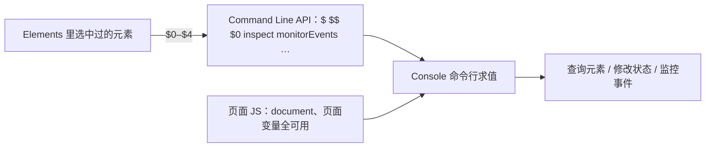

import { Canvas, Controls, Meta } from '@storybook/addon-docs/blocks';
import * as Stories from './command-line-api.stories';

<Meta of={Stories} name="Docs" />

# 与页面交互

Console 底部的命令行不只能看日志，它是一个真正执行 JavaScript 的环境：在命令行里求值的就是当前页面，`window`、`document`、页面定义的变量与函数全部可用——查一个元素、改一段文本、给按钮挂监听，都直接敲回车。在这之上，DevTools 还预置了一组只为命令行服务的快捷函数，官方称 Command Line API（命令行 API）：`$`、`$$`、`$0`、`inspect()`、`monitorEvents()` 等，把最常用的调试动作压缩成一两个字符。本课讲两件事：怎么用这层快捷方式查询、修改、监控页面状态；以及 Live Expression（实时表达式）——把一条表达式钉在 Console 顶部、每 250 毫秒刷新一次的持续读数。日志的输出与过滤归 [Console 入门](?path=/docs/console--docs)管，本课全部关于命令行求值本身。

命令行、页面与面板之间的关系：



Command Line API 速查（以官方 Console utilities API reference 为准）：

| 成员 | 用途与时机 |
| --- | --- |
| `$(selector)` / `$$(selector)` | CSS 查询：首个匹配 / 全部匹配（返回数组）；底层是 `document.querySelector` / `querySelectorAll` |
| `$x(xpath)` | XPath 查询，返回数组 |
| `$0` – `$4` | 最近在 Elements（或 Profiles）里检查过的五个对象，`$0` 最新 |
| `$_` | 最近一次命令行求值的结果 |
| `inspect(obj)` | 跳到对应面板：DOM 进 Elements、函数进 Sources、堆对象进 Profiles |
| `copy(obj)` | 把对象的字符串表示复制到剪贴板 |
| `dir(obj)` / `dirxml(obj)` / `table(data)` / `clear()` | `console.dir` / `console.dirxml` / `console.table` / `console.clear` 的快捷方式 |
| `keys(obj)` / `values(obj)` | 属性名数组 / 属性值数组 |
| `getEventListeners(obj)` | 列出对象上注册的监听器，按事件类型分组 |
| `monitorEvents(obj, events?)` / `unmonitorEvents(obj, events?)` | 打印对象收到的事件 / 停止打印；events 支持映射组 mouse、key、touch、control |
| `monitor(fn)` / `unmonitor(fn)` | 函数被调用时打印名称与实参 / 停止 |
| `debug(fn)` / `undebug(fn)` | 函数被调用时中断到 Sources / 停止（断点调试的命令行入口） |
| `profile(name?)` / `profileEnd(name?)` | 开始 / 结束一段 CPU 采样，结果在 Performance 面板 |
| `queryObjects(ctor)` | 当前执行上下文中由该构造器创建的实例（内存分析的入口） |

## 快速上手

演示页是一个「查询标本」：页面上排着带辨识度的按钮、待办列表、输入框和一个主视觉块；Controls 切换「目标选择器」，readout 用与命令行相同的语义（`$` 取首个、`$$` 数个数）显示匹配结果。你在 Console 里运行同样的表达式，就是在和 readout 对答案。

<Canvas of={Stories.Specimen} />
<Controls of={Stories.Specimen} />

最小闭环：

1. 按 `Command+Option+J`（macOS）或 `Control+Shift+J`（Windows、Linux）打开 Console，执行上下文保持默认的 top。
2. Controls 保持「.specimen-btn（三个按钮）」，在命令行运行 `$$('.specimen-btn')`——返回长度为 3 的数组，与 readout「$$() 匹配数」一致；再运行 `$('.specimen-btn')`——返回第一个按钮，与 readout「$() 首个匹配」一致。
3. 在 Elements 面板里点选某个标本元素，回命令行运行 `$0`——就是刚选中的那个。
4. 运行 `monitorEvents($('.specimen-input'), 'key')`，点一下演示页输入框并打几个字——Console 逐条打印事件对象，readout「输入框 keydown」同步加 1；结束后运行 `unmonitorEvents($('.specimen-input'))`。
5. 运行 `inspect($$('.specimen-list li')[0])`——Elements 跳到并高亮第一个待办项。

| 读者操作 | 可观察证据 |
| --- | --- |
| 切换「目标选择器」 | readout「$() 首个匹配」与「$$() 匹配数」同步变化 |
| 命令行运行 `$$('<选择器>')` | 返回数组，长度与 readout 一致，可直接 `forEach` / `map` |
| Elements 选中元素后运行 `$0` | 返回该元素，可继续读 `.textContent`、改 `.style` |
| `monitorEvents(...)` 之后与标本交互 | Console 逐条打印事件对象；readout 的交互计数同步加 1 |
| 打开 Show code | 看到该 Canvas 实际执行的 `query-specimen.ts` |

## 页面上下文

命令行求值发生在当前页面里：页面的全局变量、函数、DOM、`document` 都能直接访问，所以任何能改页面状态的 JS 都可以直接在命令行里跑——这就是「修改页面状态」的全部秘密，没有特殊 API，就是普通 JS 加上一个更方便的执行位置：

```js
$('.specimen-input').value = '命令行改的';
$$('.specimen-btn').forEach((btn) => {
  btn.disabled = true;
});
$0.style.outline = '3px solid #b91c1c'; // 给 Elements 里刚选中的元素画个框
```

Command Line API 的成员不属于页面，只在从命令行求值时存在——页面脚本里看不到也用不了。这层快捷方式还有一个让位规则：页面若定义了同名成员（最常见的是 jQuery 的 `$`），页面版本优先。所以用 `$` 之前值得确认返回的是不是 DOM 元素；被遮蔽时改用 `document.querySelector`（见常见问题）。

页面里有 iframe 时，命令行左上角的执行上下文（execution context）下拉决定求值发生在哪个 frame，默认 top；`queryObjects` 这类按上下文求值的成员也都以当前选中项为准。

## 查询元素

三个查询函数共享同一框架：第一个参数是选择器（`$x` 是 XPath 表达式），可选第二个参数 `startNode` 把搜索起点限定到某个子树。演示页 readout 正是用它们的底层语义计算的——切换「目标选择器」，运行相同的表达式对答案。

### $：首个匹配

`$(selector, startNode?)` 等同 `document.querySelector()`，返回第一个匹配元素：

```js
$('.specimen-btn');        // 第一个按钮
$('.specimen-btn', $0);    // 只在 $0 的子树里找
$('.specimen-nothing');    // undefined——演示页下拉里可复现
```

右键结果选 Reveal in Elements panel（在 Elements 中显示）可直接跳面板。边界：页面引入 jQuery 时 `$` 是页面的版本，返回的是 jQuery 包装对象而不是 DOM 元素。

### $$：全部匹配，返回数组

`$$(selector, startNode?)` 等同 `Array.from(document.querySelectorAll())`——返回真数组，`map`、`filter`、`forEach` 直接链，不需要 `[...展开]`：

```js
$$('.specimen-list li').length;                       // 与 readout「$$() 匹配数」一致
$$('.specimen-list li').forEach((li) => console.log(li.textContent));
```

### $x：XPath 查询

`$x(xpath, startNode?)` 按 XPath 表达式查询，返回数组。要按结构条件选元素（按文本、按父子关系）时，XPath 比 CSS 选择器表达力强：

```js
$x('//li');                           // 所有 li
$x('//li[contains(@class, "done")]'); // 含 done 类的项——1 个，与 '.specimen-list li.done' 的 $$(…) 结果一致
```

## $0 与 inspect

`$0`–`$4` 记录你最近在 Elements 面板里检查过的五个 DOM 元素（Profiles 面板里选中的堆对象也占位），`$0` 最新，`$1` 前一个，依次类推。`inspect(objectOrFunction)` 是反向操作：DOM 元素跳 Elements、函数跳 Sources、堆对象跳 Profiles。两个方向合起来，Console 与其他面板就通了：

```js
$0;                                // Elements 里刚点选的元素，直接拿到引用
inspect($$('.specimen-btn')[0]);   // Elements 跳到并高亮该按钮
```

经典工作流：Elements 点选目标 → 命令行用 `$0` 拿到引用 → 顺手改状态或读值 → `inspect($0)` 跳回 Elements 确认效果。比手写一长串选择器快得多。

注意 `$0`–`$4` 只认在 Elements 面板里检查过（或在 Profiles 里选中过）的对象——Elements 里点选目标，再用 `$0`。

## 监控事件与函数

查询和修改是静态动作；调试的另一半是观察运行时发生了什么——谁在收事件、谁注册了监听、哪个函数被调用。

### monitorEvents：打印事件流

`monitorEvents(object, events?)` 在对象收到指定事件时向 Console 打印 Event 对象；`unmonitorEvents(object, events?)` 停止。events 支持三种写法：单个事件名、事件名数组、映射组（一组预打包的事件）：

| 映射组 | 包含的事件 |
| --- | --- |
| `mouse` | `mousedown`、`mouseup`、`click`、`dblclick`、`mousemove`、`mouseover`、`mouseout`、`mousewheel` |
| `key` | `keydown`、`keyup`、`keypress`、`textInput` |
| `touch` | `touchstart`、`touchmove`、`touchend`、`touchcancel` |
| `control` | `resize`、`scroll`、`zoom`、`focus`、`blur`、`select`、`change`、`submit`、`reset` |

```js
monitorEvents($('.specimen-input'), 'key');   // 打字：Console 逐条打印 key 组事件
monitorEvents($0, 'click');                   // 只盯点击
unmonitorEvents($('.specimen-input'));        // 不传 events 时停掉该对象的全部监控
```

`unmonitorEvents` 也可以只停一类事件：先 `monitorEvents($0, 'mouse')` 再 `unmonitorEvents($0, 'mousemove')`，保留其余。mouse 组含高频的 `mousemove`，监控组比监控单事件更容易刷屏——见常见问题。

### getEventListeners：先查谁注册了

`getEventListeners(object)` 返回一个对象：每个已注册的事件类型一个数组，成员是监听器描述（含 `listener`、`useCapture`、`passive`）。监控或清理之前先用它看对象上挂着什么：

```js
getEventListeners(document);
getEventListeners($('.specimen-input'));
```

要「事件发生时停下来」而不只是打印，用事件监听器断点（Event Listener Breakpoints），见[高级断点](?path=/docs/advanced-breakpoints--docs)。

### monitor 与 debug：盯函数

`monitor(fn)` 在函数被调用时打印函数名与实参，不中断执行；`debug(fn)` 则调用时直接中断到 Sources，`undebug(fn)` 解除。两者是同一件事的两种力度：

```js
function sum(x, y) {
  return x + y;
}
monitor(sum);   // sum(1, 2) 后 Console 打印函数被调用的记录
debug(sum);     // sum 被调用时中断；undebug(sum) 停止
```

debug 的界面等价物（在代码行上设断点、单步执行）见[断点调试](?path=/docs/breakpoints--docs)。

## 取值与对象查询

本节的成员负责把值取出来、送出去、按构造器找出来。先说四个 console 快捷方式：`dir`、`dirxml`、`table`、`clear` 分别是 `console.dir`、`console.dirxml`、`console.table`、`console.clear` 的快捷方式，行为与级别完全一致（见 [Console 入门](?path=/docs/console--docs)）——命令行里少打几个字而已。

### $_：最近一次求值的结果

```js
2 + 2;    // 4
$_;       // 4：最近一次求值的结果
```

`$_` 保存的是引用，可以接着用：运行 `$$('.specimen-btn')` 之后 `$_[0]` 就是第一个按钮，省一次重复求值。

### copy：复制到剪贴板

`copy(object)` 把对象的字符串表示放进剪贴板，页面里到处能粘：

```js
copy($0);                       // 把 Elements 里选中的元素复制成字符串
copy($$('.specimen-list li'));  // 把整个匹配数组复制出去
```

### keys 与 values

`keys(object)` 返回属性名数组，`values(object)` 返回属性值数组：

```js
const player = { name: 'Parzival', number: 1, state: 'ready', easterEggs: 3 };
keys(player);    // ['name', 'number', 'state', 'easterEggs']
values(player);  // ['Parzival', 1, 'ready', 3]
```

### queryObjects：按构造器找实例

`queryObjects(constructor)` 返回当前执行上下文中由该构造器（或其子类）创建的实例数组：

```js
queryObjects(Promise);      // 页面里所有 Promise 实例
queryObjects(HTMLElement);  // 所有 HTML 元素——结果可能非常长
```

它是内存排查的命令行入口：想看某类对象还剩多少实例、是否只增不减，从这里开始；系统性的堆分析（快照、泄漏定位）见[内存快照](?path=/docs/memory-snapshots--docs)。

## Live Expression

发现自己在反复输入同一条表达式时，改用 Live Expression：把表达式钉在 Console 顶部，值每 250 毫秒自动刷新——高频变化的读数不用反复回车，也不会把消息流刷满。

创建：点 Console 顶部的 Create Live Expression（眼睛图标）按钮，输入表达式（`Shift+Enter` 换行），按 `Enter` 或点击输入框外保存。值显示在钉住的表达式下方。可以钉多条（列表滚动可见），点每条旁的 Close 移除。

在演示页上练一条官方推荐的用途——追踪焦点：钉 `document.activeElement.className`，然后点演示页的按钮、点输入框、按 `Tab` 在元素间移动，读数始终跟着焦点走，全程没有输出一行日志。

边界：Live Expression 每 250 毫秒重新求值一次，表达式里不要放 `console.log` 或改状态这类有副作用的调用；需要「此刻的快照」而不是持续读数时，回命令行直接求值。

## 输入体验

两个只影响输入手感、不改变求值语义的设置，都在 Console 设置（齿轮图标）里：

- Eager Evaluation（即时求值）：边打字边在表达式下方预览返回值——输入 `$$('.specimen-btn').length` 还没回车，下方已显示 `3`。写长表达式时先看一眼对不对，能省一轮来回。
- Autocomplete from history（按历史补全）：补全弹层里以 `>` 前缀列出你跑过的表达式，选中直接重跑——昨天调过的那条长选择器不用重新打。

另外，长表达式用 `Shift+Enter` 换行，不触发执行。

## 最佳实践

- 用面板联调循环代替手写长选择器：Elements 点选 → `$0` 拿引用 → 改状态或读值 → `inspect` 跳回确认。`$0` 是两个面板之间最短的桥。
- 默认用 `$$`：它返回真数组，`forEach` / `map` / `filter` 直接链；只在确定「只要第一个」时用 `$`，并留意 `$` 可能被页面库遮蔽。
- 三种「持续观察」分工不同：盯值的变化用 Live Expression；盯事件流用 `monitorEvents`；盯函数调用用 `monitor`（只记录）或 `debug`（要中断）。下手前先用 `getEventListeners` 看看对象上已经注册了什么。
- 监控与断点用完即停：`unmonitorEvents` / `unmonitor` / `undebug`。只要对象还活着，监控就一直在打日志——既刷屏也拖慢交互。

## 常见问题

- 命令行里 `$` 返回的不是 DOM 元素，行为完全不对。
  页面引入了 jQuery 之类的库，同名函数遮蔽了 DevTools 的 `$`。改用 `document.querySelector` / `document.querySelectorAll`，或先确认返回值的类型（jQuery 包装对象不是 Element）。
- 在页面脚本里调用 `$()`、`monitorEvents()` 报 `$ is not defined`。
  Command Line API 只在从 Console 命令行求值时存在，不是页面的全局对象。脚本里用等价的 `document.querySelector` 等原生 API。
- `$0` 是 `undefined`，或不是你想要的元素。
  `$0` 只记录在 Elements 面板里检查过（或在 Profiles 里选中过）的对象。回 Elements 点选目标元素，再回命令行用 `$0`。
- `monitorEvents($0, 'mouse')` 之后 Console 疯狂刷屏。
  mouse 组包含高频的 `mousemove`，移动鼠标就触发。改监控单一事件 `monitorEvents($0, 'click')`，或立即 `unmonitorEvents($0)` 停掉。
- `$$('.specimen-btn').map(...)` 能跑，`document.querySelectorAll('.specimen-btn').map(...)` 报错。
  `$$` 返回真数组（等同 `Array.from(querySelectorAll())`），原生 `querySelectorAll` 返回 NodeList——两者都有 `forEach`，只有数组有 `map` / `filter`。想在 NodeList 上用数组方法，先 `Array.from(...)`。

## 总结回顾

摘要：

命令行求值发生在当前页面上下文里，页面的变量、DOM、函数都可直接访问，所以改状态就是普通 JS 加一个更顺手的执行位置。Command Line API 是叠加在这之上的快捷层，只在命令行求值时存在，页面若定义同名成员会让位：查询用 `$`（首个）、`$$`（数组）、`$x`（XPath）；面板互通靠 `$0`–`$4`（Elements 里最近检查的五个对象）与 `inspect`（跳 Elements / Sources / Profiles）；观察运行时靠 `monitorEvents`（打印事件流，支持 mouse、key、touch、control 映射组）、`getEventListeners`（查注册）、`monitor` 与 `debug`（盯函数）；取值与输出靠 `$_`、`copy`、`keys` / `values`、`queryObjects` 以及 `dir` / `dirxml` / `table` / `clear` 四个 console 快捷方式。Live Expression 把一条表达式钉在 Console 顶部，每 250 毫秒刷新，适合持续观察高频变化的值；Eager Evaluation 与 Autocomplete from history 则让输入本身更快。

一句话：

> 命令行求值就发生在页面里——Command Line API 把查询、面板跳转与监控压缩成一两个字符的快捷方式，Live Expression 再把最常用的那条钉成持续读数。

知识要点：

- `$`、`$$`、`$x` 分别返回什么？`$$` 与 `document.querySelectorAll` 的差别是什么？
- `$0`–`$4` 记录哪些对象？怎么让 `$0` 有值？
- `inspect`、`copy`、`$_` 各做什么？`inspect` 面对不同类型的对象跳到哪里？
- `monitorEvents` 的 events 参数支持哪三种写法？四个映射组各包含什么？怎么停？
- `monitor` 与 `debug` 的区别是什么？分别配对哪个停止函数？
- `queryObjects` 的结果受什么限制？它是哪类分析的入口？
- Live Expression 怎么创建、多久刷新、为什么不能放有副作用的调用？
- Eager Evaluation 与 Autocomplete from history 分别做什么？在哪里开关？

## 参考资料

- [Console utilities API reference](https://developer.chrome.com/docs/devtools/console/utilities)
- [Watch JavaScript expression values in real-time with Live Expressions](https://developer.chrome.com/docs/devtools/console/live-expressions)
- [Console features reference](https://developer.chrome.com/docs/devtools/console/reference)
