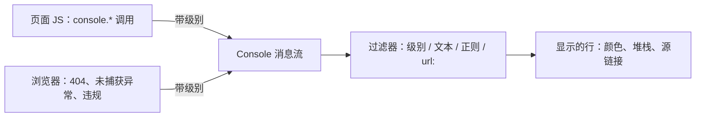

import { Canvas, Controls, Meta } from '@storybook/addon-docs/blocks';
import * as Stories from './console.stories';

<Meta of={Stories} name="Docs" />

# Console 入门

Console（控制台）面板是 DevTools 里与 JavaScript 日志打交道的地方：页面代码与浏览器自身产生的消息在这里汇集，你也能通过 console API（浏览器提供的 `console` 对象方法集）主动写日志、分组、计数和计时。本课主线只有一条——每条消息都带级别：Verbose（详细）、Info（信息）、Warning（警告）、Error（错误）；console 的每个方法都绑定其中一个级别，面板的过滤、折叠与设置全部围绕级别运转，把级别用对，过滤才有意义。本课只覆盖查看、过滤与 console API；Console 底部命令行里的 `$`、`$$` 等 Command Line API（命令行 API）见[与页面交互](?path=/docs/command-line-api--docs)。

消息如何到达你眼前：



console API 速查（级别以官方 Console API reference 为准）：

| 方法 | 级别 | 输出与用途 |
| --- | --- | --- |
| `console.log(obj, …)` | Info | 基础输出，最常用 |
| `console.info(obj, …)` | Info | 与 log 完全相同 |
| `console.debug(obj, …)` | Verbose | 与 log 相同，走 Verbose 级 |
| `console.warn(obj, …)` | Warning | 黄色警告 |
| `console.error(obj, …)` | Error | 红色错误，自带调用堆栈 |
| `console.assert(expression, object)` | Error（失败时） | 表达式为 false 才输出，不中断脚本 |
| `console.table(data, columns?)` | Info | 数组/对象输出成表格，第二个参数可选显示的列 |
| `console.dir(obj)` | Info | 以 JSON 表示打印对象 |
| `console.dirxml(node)` | Info | 以 XML 形式打印节点的后代 |
| `console.trace(obj?)` | Info | 打印当前调用堆栈 |
| `console.group(label)` / `groupCollapsed(label)` / `groupEnd()` | — | 视觉分组；groupCollapsed 初始折叠 |
| `console.count(label?)` / `countReset(label?)` | Info / — | 同 label 递增计数 / 归零 |
| `console.time(label?)` / `timeLog(label?)` / `timeEnd(label?)` | — / Info / Info | 启动计时（本身无输出）/ 打印已耗时间 / 结束并打印总耗时 |
| `console.clear()` | — | 清屏；Preserve log 开启时被禁用 |
| `console.createTask(name)` | — | 异步堆栈标记（Async Stack Tagging），一般由框架内部调用 |

## 快速上手

演示页是一个「日志发生器」：Controls 选择要触发的 console API 与连发次数，每次参数变化都向浏览器真实的 Console 输出一轮日志；readout（读数）按四个级别统计本实例创建以来已输出的条数。证据不在页面上，而在你打开的 DevTools Console 里。

<Canvas of={Stories.Specimen} />
<Controls of={Stories.Specimen} />

最小闭环：

1. 按 `Command+Option+J`（macOS）或 `Control+Shift+J`（Windows、Linux）打开 Console 面板。
2. Controls 把「console API」切到 console.warn——Console 出现一条黄色警告，readout「Warning」加 1。
3. 切到 console.error——红色错误自带调用堆栈；点消息尾部 `log-specimen.ts:行号` 源链接，跳到 Sources（源代码）面板。
4. 切到 console.debug——Console 里可能没有新行：debug 输出 Verbose 级，点左上 Log Levels 下拉勾上 Verbose 就能看到，readout「Verbose」加 1。
5. 把「连发次数」调到 3，再切回 console.log——相同消息被折叠成一条，右侧带 ×3 计数（Group similar messages 的默认行为）。

| 读者操作 | 可观察证据 |
| --- | --- |
| 切换「console API」 | Console 出现对应方法的消息，颜色与级别对应；readout 四级计数与「计数」「计时器」读数同步更新 |
| 调整「连发次数」 | 一次触发连发多条相同消息，Console 折叠为一条并显示计数角标 |
| 连续触发 console.count | Console 里依次出现「请求: 1」「请求: 2」……，readout「计数」同步递增 |
| 连续触发 console.time 三次 | 第一次无新行（启动本身不输出），后两次各打印一条「导出: … ms」 |
| 打开 Show code | 看到该 Canvas 实际执行的 `log-specimen.ts` |

过滤器只影响显示，消息始终在产生；重新进入本页会重建实例，readout 从零重新统计。

## 消息从哪来

Console 里的消息有三类来源：

- 页面 JS 的 `console.*` 调用（user messages，用户消息）——「快速上手」里触发的就是这类。
- 浏览器自身产生的失败与异常：网络请求失败（404、500）、未捕获的 TypeError、浏览器规则违反（例如非 HTTPS 页面里的密码输入框会得到 Violation 警告）。
- 其他调试设施转发的消息：条件断点与 logpoint（日志点）里的 `console.*` 输出会带橙色标记——见[高级断点](?path=/docs/advanced-breakpoints--docs)。

每条消息尾部的源链接（如 `log-specimen.ts:96`）标明来源文件与行号，点击跳到 Sources；error 与 warn 自带调用堆栈（stack trace，调用栈），最新的调用排在最上面。需要一边用其他面板一边看日志时，按 `Esc` 打开 Drawer（抽屉）里的 Console 标签——面板与抽屉是同一份消息的两种形态。

## 过滤消息

过滤器只影响显示，不影响产生——排查「日志不见了」先看这里。

- Log Levels（日志级别）下拉：按 Verbose / Info / Warnings / Errors 四个勾选项开关显示；console.debug 属于 Verbose，不勾就看不到。
- Hide network（隐藏网络）勾选框：隐藏网络失败产生的消息（如 404）。
- `Command+F`（Windows、Linux `Control+F`）打开搜索栏，在全部消息中搜索文本或正则——与过滤器独立。

Filter（过滤）框支持的语法：

| 输入 | 作用 |
| --- | --- |
| `弃用` | 只显示包含该文本的消息 |
| `/^建立/` | 正则表达式匹配 |
| `-WebSocket` | 排除包含该文本的消息 |
| `url:specimen` | 只显示来源 URL 匹配的消息 |
| `context:top` | 只显示指定执行上下文的消息，区分 top frame 与 iframe |

多个条件用空格分隔，同时生效。按来源分组点选时，点 Filter 框右侧的 filters 图标打开 Sidebar（侧栏），按 Severity（严重度）、Time（时间）、Source（来源）、Context（上下文）、User messages（用户消息）过滤。

在演示页上练一遍：Filter 框输入 `/已弃用/` 只剩 warn 消息；输入 `-配置` 后分组里的「读取配置完成」被排除；把 Log Levels 里的 Warnings 取消勾选，warn 消息立即消失。

## console API 家族

console 是页面里的全局对象，方法都向 Console 输出带级别的消息（开场速查表是总览）。本节按用途展开成员主线；没进演示页下拉的成员，把示例粘进 Console 底部命令行回车即可——Console 本身就是一个可运行 JS 的环境。

### 基础输出：log / info / warn / error / debug

五个方法签名相同，差别只在级别与随之而来的颜色、过滤归属：

```js
console.log('常规进展', { 阶段: '渲染' }); // Info
console.debug('帧耗时 3.2 ms');            // Verbose，常被级别过滤挡住
console.warn('fetchUser() 已弃用');        // Warning
console.error('加载失败：500');            // Error，自带堆栈
```

info 与 log 完全相同（官方 API 参考的用词是 "identical to console.log"）；debug 也与 log 相同，但输出 Verbose 级。在演示页下拉里逐个切换，对照颜色与 readout 四级计数。

### 格式化：说明符与 %c 样式

输出方法都支持格式化说明符（format specifier），第一个参数里的占位符依次消费后面的参数：

| 说明符 | 含义 |
| --- | --- |
| `%s` | 字符串（数字会被转成字符串） |
| `%d` / `%i` | 整数 |
| `%f` | 浮点数 |
| `%o` | 可展开的 DOM 元素 |
| `%O` | 可展开的 JavaScript 对象 |
| `%c` | 把 CSS 样式应用到这条消息 |

```js
console.log('请求 %s 返回 %d', '/api/user', 200);
console.log('%c 重要提示 ', 'background: #b91c1c; color: #fff; padding: 2px 6px');
```

粘进命令行运行即可看到效果。两个易错点：`%d` 收到非数字时输出 NaN；`%s` 收到数字时会先转成字符串。

### 结构化输出：table、dir、trace

- `console.table(data, columns?)`：把数组（或对象）输出成表格；第二个参数传列名（字符串或字符串数组）时只显示这些列。演示页选 console.table 看三行请求日志，readout「Info」加 1。
- `console.dir(obj)`：以 JSON 表示打印对象。与 log 对比 DOM 节点最直观：`console.log(document.body)` 显示 DOM 树形式，`console.dir(document.body)` 显示属性形式的 JSON 表示——粘进命令行试试。
- `console.trace(obj?)`：打印当前调用堆栈，Info 级；与 error 的区别是只记录栈，不代表出错。演示页选 console.trace，能看到从日志发生器一路到触发的完整链路。

### 分组：group / groupCollapsed / groupEnd

```js
console.group('初始化');
console.log('读取配置完成');
console.log('建立 WebSocket 连接');
console.groupEnd();
```

group 之后的消息都归入该组，直到配对的 groupEnd；分组可嵌套。groupCollapsed 相同，只是初始折叠。演示页选 console.group 一次输出完整分组——组标签本身不计级别，组内两条 log 各计一条 Info。

### 计数：count / countReset

`console.count(label?)` 按 label 递增计数，每次输出「label: n」；`console.countReset(label?)` 把对应计数归零。演示页连续触发 console.count，Console 里依次出现「请求: 1」「请求: 2」，readout「计数」同步递增。怀疑某个函数被反复调用时，count 是最轻量的探针。

### 计时：time / timeLog / timeEnd

三个方法按 label 配对：`console.time(label)` 启动计时（本身不输出任何行）、`console.timeLog(label)` 打印已耗时间、`console.timeEnd(label)` 结束并打印总耗时。同名 label 未结束就再次 time 会报 `Timer '…' already exists`；timeLog 与 timeEnd 用了不存在的 label 会报 does not exist。演示页选 console.time 连续触发三次，正好走完「启动 → 读数 → 结束」。

### 断言与清屏：assert、clear

- `console.assert(expression, object)`：表达式为 false 时输出一条 Error 级消息（前缀 Assertion failed），只记录、不中断脚本。演示页选 console.assert 会交替触发：失败输出一条 error、成功无输出——readout 只在失败时加 1。
- `console.clear()`：清空 Console。Preserve log（保留日志）开启时它被禁用。

## Console 设置

入口：Console 面板右上角的齿轮图标，直接定位到设置里的 Console 组。

| 设置 | 作用 |
| --- | --- |
| Preserve log | 跨页面刷新与导航保留日志；开启后 `console.clear()` 被禁用 |
| Hide network | 隐藏网络失败产生的消息（如 404） |
| Log XMLHttpRequests | 把 XHR 与 Fetch 请求记录为日志 |
| Show CORS errors in console | 显示 CORS 失败消息 |
| Selected context only | 只显示当前选中执行上下文（top frame 或某个 iframe）的消息 |
| Group similar messages in console | 相同消息折叠为一条，右侧显示重复次数 |

在演示页验证 Group similar：「连发次数」调到 3 触发 console.log——Console 折叠成一条带计数；取消勾选 Group similar messages in console 后再次触发——三条逐条显示。勾选 Preserve log 后刷新页面，日志仍在——这也是回查「上一页报了什么错」的常用手段。

Eager evaluation（即时求值）与 Autocomplete from history（按历史补全）改变的是命令行输入表达式的体验，归入[与页面交互](?path=/docs/command-line-api--docs)。

## 最佳实践

- 用对级别，过滤才有意义：常规进展用 log，预期内的异常用 warn，失败用 error，噪音细节用 debug——debug 的 Verbose 级通常被级别过滤挡住，正好把细节与主线分开，需要时再勾 Verbose。
- 按目的选记录对象的方式：要看最新值用 log（展开时读的是活引用）；多行同构数据要一屏对比用 console.table；看对象的 JSON 表示用 console.dir；要冻结快照就 `console.log(JSON.parse(JSON.stringify(obj)))`。
- 并发或重复场景给 count / time 配 label：默认标签把所有调用计在一起，按「请求」「导出」这类用途命名才能分别统计、正确配对。

## 常见问题

- 切换了 API 或改了连发次数，Console 里却没有新消息。
  先查过滤：Filter 框是否残留文本或正则、Log Levels 是否勾掉了对应级别（debug 是 Verbose）、是否勾了 Hide network。判断依据：过滤器只影响显示，消息仍在产生；清空 Filter 框、勾全四个级别即可恢复。
- 同一条消息只显示一次，右侧带一个数字角标。
  这是 Group similar messages in console 在折叠重复消息，角标是重复次数；取消勾选后逐条显示。
- 刷新页面后之前的日志全没了。
  勾选 Preserve log。边界：它保留的是跨刷新与导航的日志；同一页里 `console.clear()` 仍会清屏，且 Preserve log 开启时 clear 被禁用。
- `console.log` 打印的对象，展开时值和打印时不一样。
  Console 保存的是对象引用，展开时才读取当前值，页面随后的改动会反映进去。需要定格就 `console.table(obj)` 或 `console.log(JSON.parse(JSON.stringify(obj)))`。
- `console.assert(条件, 消息)` 条件为真时没有输出，也没有中断脚本。
  assert 的语义是「表达式为 false 才输出一条 Error」，只记录不抛异常。要中断执行用 debugger 语句或异常断点，见[断点调试](?path=/docs/breakpoints--docs)。
- Console 报 `Timer '导出' already exists` 或 `Timer '…' does not exist`。
  time / timeLog / timeEnd 按 label 配对：同名计时器未结束就再次 time 报 already exists，timeLog 与 timeEnd 用了不存在的 label 报 does not exist。检查 label 拼写并保证配对。

## 总结回顾

摘要：

Console 是查看日志与写日志的同一块地方：页面 `console.*` 调用与浏览器自身的失败、异常、违规都汇入消息流，每条消息带 Verbose / Info / Warning / Error 之一，error 与 warn 自带堆栈和源链接。Log Levels 下拉与 Filter 框（文本、正则、`-` 排除、`url:`、`context:`）决定哪些行显示，Hide network 与 Sidebar 提供按来源的批量开关。console API 家族覆盖基础输出（log / info / debug / warn / error）、格式化说明符（`%s` `%d` `%f` `%o` `%O` `%c`）、结构化输出（table / dir / trace）、组织与诊断（group / count / time / assert）以及 clear；Console 设置里的 Preserve log、Group similar messages 等控制日志的留存与折叠形态。

一句话：

> 每条消息都有级别，console 的每个方法都绑定一个级别——用对级别，过滤才有意义。

知识要点：

- 消息有哪些级别？哪些方法输出 Verbose / Warning / Error？debug 与 log 的差别是什么？
- Filter 框支持哪几种语法？怎么排除消息、按 URL 过滤？
- `console.table` 的第二个参数做什么？dir 与 log 打印 DOM 节点有何不同？
- group / count / time / assert 各自靠什么配对或触发输出？
- 为什么 `console.log` 的对象展开后值会变？怎么拍快照？
- Preserve log 开启后哪些行为会改变？

## 参考资料

- [Log messages in the Console](https://developer.chrome.com/docs/devtools/console/log)
- [Console API reference](https://developer.chrome.com/docs/devtools/console/api)
- [Console features reference](https://developer.chrome.com/docs/devtools/console/reference)
- [Format and style messages in the Console](https://developer.chrome.com/docs/devtools/console/format-style)
