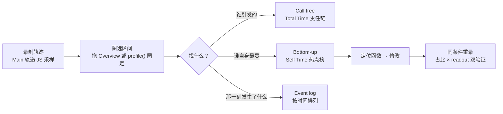

import { Canvas, Controls, Meta } from '@storybook/addon-docs/blocks';
import * as Stories from './cpu-profiler.stories';

<Meta of={Stories} name="Docs" />

# CPU 热点

轨迹录出来了，Main 轨道一大片黄色 Scripting——然后呢？本课回答性能分析的最后一问：**慢在哪个函数**。Chrome 的答案是采样剖析（sampling profiler，采样式 CPU 分析器）：录制期间周期性记录主线程的调用栈，把成千上万份栈聚合成每个函数的 Self Time（自耗时，直接花在这个函数自身的时间）与 Total Time（总耗时，函数自身加上它调用的全部子活动）。

先对齐一个入口事实：老教程里独立的 JavaScript Profiler（JavaScript 分析器）面板已弃用并移除（分阶段完成，记录在各版 What's new in DevTools 发布说明里）。函数级 CPU 剖析现在由 Performance（性能）面板承担——Main 轨道默认记录函数级调用栈，底部的 Call tree（调用树）、Bottom-up（自底向上）、Event log（事件日志）三张表是找热点的仪表盘；Console 里还能用 `profile()` / `profileEnd()` 圈定精确区间。轨迹的整体录制操作与瀑布图解读是[录制与分析轨迹](?path=/docs/performance-traces--docs)的内容，本课不再重复。

本课演示页是一个「算法对比」标本：Controls 选择算法组（冒泡排序 vs 内置 sort、朴素递归斐波那契 vs 记忆化）与数据规模，点「运行基准」后 readout 显示 `performance.now()` 实测耗时。对标本做录制或剖析后，你在面板里看到的函数名与 Self Time 占比，应当能和这些读数互相验证——预测一下：Self Time 榜首一定是慢实现的名字。



视图速查（回查入口）：

| 视图 / 入口 | 回答的问题 | 默认值与回查点 |
| --- | --- | --- |
| Main 轨道火焰图 | 谁在什么时候被调用 | JavaScript samples 默认开启；超过 50ms 的长任务标红三角 |
| Call tree | 哪些根活动引发最多工作 | Grouping 默认 No Grouping；可排序、Filter、Show Heaviest Stack |
| Bottom-up | 哪个活动自身累计最贵 | Self Time 聚合所有出现——找热点从这里开始 |
| Event log | 期间按时间发生了什么 | Duration 默认 All，可只看 1ms / 15ms 以上 |
| `profile()` / `profileEnd()` | 精确圈定可疑区间 | 结果显示在 Performance > Main 轨道，无需点 Record |

## 快速上手

演示页的三个 Controls 分别是算法组、数组长度（排序）与 n（斐波那契），各自只在自己的算法组里生效；「运行基准」对同一份确定性输入各跑一次慢实现与快实现。慢实现故意保持最朴素的写法——热循环和递归都聚在单个函数的 Self Time 里，正是剖析器最容易暴露的形态。

<Canvas of={Stories.Specimen} />
<Controls of={Stories.Specimen} />

最小闭环：

1. 按 `Command+Option+J`（macOS）或 `Control+Shift+J`（Windows、Linux）打开 DevTools，切到 Performance 面板——函数级 CPU 剖析已并入这里。
2. 点齿轮打开 Capture settings（捕获设置），确认 **JavaScript samples** 处于默认的开启状态——Main 轨道是否记录函数级调用栈由它决定。
3. 点 Record（录制），再点标本页「运行基准」，然后 Stop。运行期间页面冻结零点几秒属正常——那正是被剖析的长任务。
4. 在 Overview（概览）里拖选「运行基准」出现的那段：三张表都只统计圈选的部分，圈完噪音立刻消失。
5. 底部切到 Bottom-up，按 Self Time 列降序排（点列头切换）——榜首就是热点函数名：排序对比是 `bubbleSort`，斐波那契对比是 `fibNaive`。
6. 切到 Call tree，从顶层的 `Event (click)` 往下展开：`Function Call` → `runBenchmark` → 热点函数，这条就是 Total Time 的责任链；再对照 readout 里慢实现的实测毫秒，量级应当对得上。

| 读者操作 | 可观察证据 |
| --- | --- |
| 切换「算法组」或调整规模滑块 | 标本按新设置执行；readout 的数据规模、两种实现耗时与倍数同步更新 |
| 点击「运行基准」 | readout 给出两种实现的 `performance.now()` 实测毫秒、慢/快倍数与输出一致性校验 |
| 录制后读 Bottom-up | Self Time 榜首与 readout 里最慢的实现同名，Self Time 毫秒与之同量级 |
| 打开 Show code | 看到该 Canvas 实际执行的 `benchmark-specimen.ts` |

readout 是单次实测（有噪声），采样占比是估计值；两者互相对齐看量级，不逐位对表。

## Self Time 与 Total Time

采样剖析按固定间隔暂停主线程并记录当时的调用栈，而不是在每个函数入口插桩，所以开销小、函数名可见；代价是耗时为估计值，执行极短的函数可能漏采。Main 轨道把它画成火焰图（flame chart）：x 轴是时间，y 轴是调用栈，上面的块引发下面的块；不同脚本用随机配色区分。若在 Capture settings 勾选 **Disable JavaScript Samples**，Main 轨道只剩 `Event (click)`、`Function Call` 这类高层事件——录制更轻，但函数级热点随之消失，保持默认开启。

两个读数的分工：

- **Self Time（自耗时）**：直接花在这个活动自身的时间。热点先看它——函数自己的循环、计算、字符串拼接都记在这里。
- **Total Time（总耗时）**：花在这个活动及其全部子活动上的时间。责任链看它——Total 很高而 Self 很低的活动多半只是调用者（比如标本页的 `runBenchmark`），别急着改它本身。

Bottom-up 的聚合语义让它成为热点榜：同一个函数被调用一万次，Call tree 里是一万个分支，Bottom-up 把它所有出现处的 Self Time 加总成一行。递归是最极端的例子——`fibNaive` 的调用树在 Call tree 里深不见底，在 Bottom-up 里只是一行合计。所以顺序是：**Bottom-up 找热点，Call tree 查责任链**。

在标本页验证：跑「斐波那契对比」，`fibNaive` 的 Self Time 应当与 readout 的实测毫秒同量级，`fibMemo` 趋近于零；跑「排序对比」，你会看到内置 sort 的部分耗时落在 V8 内建的排序帧上——传入的比较器回调 `(a, b) => a - b` 自己也会被采成帧。`(garbage collector)` 等引擎内部帧同样会上榜，见常见问题。

## 三个分析视图

三张表是同一份采样数据的三种投影，共同点：只统计**圈选部分**的录制（拖 Overview 圈选，或聚焦后按 W、A、S、D 缩放平移）；每行是一个活动；Activity 列的链接直接跳到 Sources 面板里对应的函数声明——配置了 source maps（源码映射）时自动映射回原始源码。选择入口：谁引发的看 Call tree，谁自身最贵看 Bottom-up，那一刻发生了什么看 Event log。

### Call tree（调用树）

从根活动（root activities，导致浏览器开始工作的活动——一次点击派发的 `Event` 就是根活动）自上而下展开，回答「哪些根活动引发最多工作」；嵌套层级就是调用栈。

操作：点击 Self Time、Total Time 或 Activity 列头排序；Filter 框按名称过滤；Grouping 菜单按维度分组（默认 No Grouping）；点击 **Show Heaviest Stack**（显示最重堆栈）在右侧展开所选活动最耗时的子路径。

标本页落点：圈选运行区间后，顶层是 `Event` → `Function Call` → `runBenchmark` → `bubbleSort`——这条链就是 Total Time 的责任链，每一层告诉你「它是被谁调进来的」。

### Bottom-up（自底向上）

视角反转到叶子：把所有出现的活动按 Self Time 聚合，回答「哪个函数自身累计最贵」。点 Self Time 列头按降序排下来就是热点榜，同样支持 Filter。

标本页落点：榜首应当是 `bubbleSort` 或 `fibNaive`；把它的 Self Time 与 readout 里慢实现的实测毫秒并排看——同一件事的两种测量，量级一致即验证通过。

### Event log（事件日志）

按发生顺序列出活动，回答「那一刻到底执行了什么」。Start Time 列是相对录制起点的时刻，Self Time 与 Total Time 两列照旧可排序。

操作：Duration（时长）菜单默认 All，可切到只显示 1ms / 15ms 以上的活动；取消勾选 Loading、Scripting、Rendering、Painting 类别可整类过滤。活动行多时先圈选再打开。

标本页落点：找到点击之后的那条 `Function Call`——「运行基准」就是那一刻 Scripting 的主体，Start Time 告诉你它发生在录制的第几毫秒。

## 用 profile() 圈定区间

拖选 Overview 圈的是「你看到的那段」，而 `profile()` / `profileEnd()`（Console utilities，`console.profile()` / `console.profileEnd()` 的缩写）圈的是「你确定的代码」：前者启动一次带名字的 CPU 剖析会话，后者结束它——结果显示在 Performance 面板的 Main 轨道上，无需点 Record。多个剖析可同时进行，支持嵌套、不必按创建顺序关闭，名字用来区分：

```js
profile('bench');
runCpuBenchmark(); // 演示页把基准入口挂在了 window 上
profileEnd('bench');
```

标本页把当前设置的基准暴露为 `window.runCpuBenchmark()`：打开 Performance 面板，在 Console 依次执行上面三行，Main 轨道会出现名为 `bench` 的剖析块，区间精确等于基准的执行时间。这段脚本可以存成 Snippet（代码片段）反复执行——保存与复用是[修改落盘与复用](?path=/docs/persist-edits--docs)的内容。边界：`profile()` 只覆盖你圈住的代码；页面自己跑出来的热点仍需录制轨迹后圈选分析。

## 最佳实践

- **先圈选，再读表。** 三张表都只统计圈选部分：拖 Overview 把「运行基准」那段圈出来，页面其余活动的噪音立刻消失；要更精确就用 `profile()` 圈定代码区间，再在 Main 轨道读同名剖析块。
- **节流贴近目标设备。** Capture settings → **CPU** 选 slowdown（如 4x、20x）让热点占比接近低端设备上的分布——官方明确说明节流只是相对本机变慢，无法真实模拟移动端架构，结论仍要回真机验证。
- **修复后同条件重录对比。** 看占比变化（Self Time 从 80% 降到多少）加 readout 实测毫秒，双指标一起看；单次毫秒数有噪声，占比与倍数比绝对值稳。
- **让采样保持开启。** JavaScript samples 决定 Main 轨道有没有函数级调用栈；只有想看更大粒度的高层事件、或嫌录制太重时才临时关闭，读完热点记得改回默认。

## 常见问题

- Main 轨道看不到函数名，只有稀疏的 `Event (click)`、`Function Call` 块。
  先检查 Capture settings 里是否勾选了 **Disable JavaScript Samples**——它关闭后 Main 轨道只剩高层事件。取消勾选并重新录制；若函数块仍然稀少，多半是采样窗口太短，延长录制或多次运行被测操作。
- Bottom-up 榜首是 `(garbage collector)`、`(program)` 这类引擎内部帧，认不出业务函数。
  引擎帧也是真实开销：GC（垃圾回收）居首说明分配压力大——标本页的 `fibNaive` 每次递归调用都压栈、产生临时对象，正会让 GC 前列。处理动作是回 Call tree 或 Event log 看是谁的调用链在触发，优化分配源头，而不是对着引擎帧猜。
- Bottom-up 的 Self Time 毫秒和 readout 实测耗时对不上。
  两把尺子：readout 是 `performance.now()` 的单次实测（有噪声）；采样是周期性抽样的估计，短函数会被低估。比较时看量级与占比，必要时多次运行取稳定值，不逐位对表。
- Call tree 里栈太深、太吵，找不到目标函数。
  用 Filter 按函数名过滤，用 Grouping 换聚合维度，用 Show Heaviest Stack 直接展开最耗时的子路径；点击 Activity 列的链接跳到 Sources 对应函数——有 source maps 时显示的就是原始源码。

## 总结回顾

摘要：

函数级 CPU 剖析由 Performance 面板承担（独立 JavaScript Profiler 面板已弃用移除）：录制时 Main 轨道默认采样函数级调用栈，Capture settings 里的 JavaScript samples 控制开关。采样数据聚合成两个读数——Self Time 是函数自身的时间，Total Time 是自身加全部子活动；Bottom-up 把同一函数所有出现处的 Self Time 加总成热点榜，Call tree 从根活动自上而下给出 Total Time 责任链，Event log 按时间列出活动并提供 Start Time / Self Time / Total Time 三列与时长、类别过滤；三张表都只统计圈选部分，Activity 链接直达 Sources。`profile()` / `profileEnd()` 在 Console 圈定精确区间，结果显示在 Main 轨道。算法对比标本用 `performance.now()` 实测做第二把尺子：Bottom-up 榜首与 readout 最慢实现同名、量级一致即完成验证，修复后同条件重录看占比变化。

一句话：

> 找热点看 Bottom-up 的 Self Time，查责任链看 Call tree 的 Total Time——修复后用同条件重录的占比变化与 `performance.now()` 实测双验证。

知识要点：

- 函数级 CPU 剖析现在在哪个面板？老的 JavaScript Profiler 面板怎么了？
- Self Time 与 Total Time 分别怎么读？Total 高而 Self 低的活动说明什么？
- Call tree、Bottom-up、Event log 各回答什么问题？它们都受什么范围的约束？
- 为什么递归函数最适合用 Bottom-up 看？它在 Call tree 里是什么形态？
- `profile()` / `profileEnd()` 的结果显示在哪里？怎么用标本页的 `runCpuBenchmark()` 圈定区间？
- Main 轨道看不到函数名时先检查什么？Bottom-up 榜首出现引擎内部帧时该做什么？

## 参考资料

- [Performance features reference](https://developer.chrome.com/docs/devtools/performance/reference)
- [Console utilities API reference](https://developer.chrome.com/docs/devtools/console/utilities)
- [What's new in DevTools](https://developer.chrome.com/docs/devtools/whats-new)
