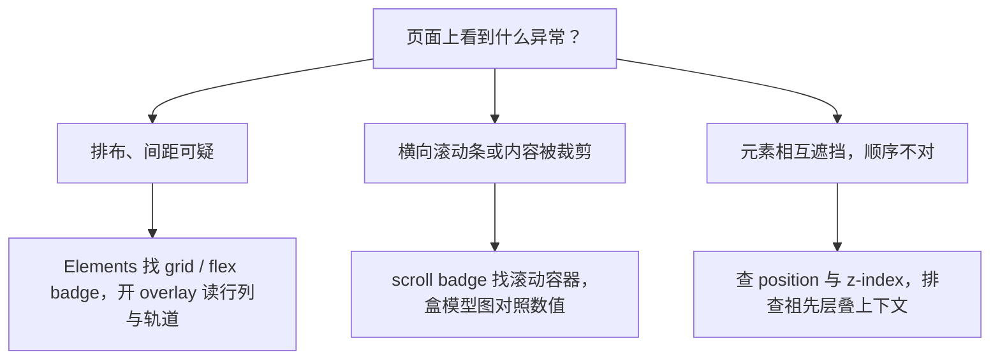

import { Canvas, Controls, Meta } from '@storybook/addon-docs/blocks';
import * as Stories from './debug-layout.stories';

<Meta of={Stories} name="Docs" />

# 调试布局

布局问题的本质不是玄学：浏览器按确定的规则算出了每个盒子的大小和位置，只是结果和你预期不一致。调试布局就是把「算出来的结果」变成看得见、可核对的证据——先用 badge（标记）找到容器，再用 overlay（覆盖层）把行列、轨道和间隙画回页面，用盒模型图核对数值，最后回到 CSS 改那一条真正起作用的声明。

DevTools 的证据分三层：Elements（元素）面板 DOM 树里的 badge 指出页面上有哪些布局容器；Elements 侧栏的 Layout（布局）标签集中管理 overlay 的开关与显示选项；盒模型图和 `scrollWidth` 给出可核对的数值。层叠（z-index）问题则回到 `position`、`z-index` 与层叠上下文的判断，工具不同，但思路同样是「先看证据，再改声明」。

本课带两个练习标本：布局标本可切换 Flex/Grid 并制造溢出与换行，层叠标本复现「大 z-index 打不过小 z-index」的经典场景。对标本页按 `F12` 打开你自己的 DevTools 边读边练；标本自带的 readout 会显示溢出量、行列数、重叠区最上层等读数，用来核对你在 DevTools 里看到的结论。先建立排查分流的直觉：



badge 与核心工具的速查表：

| 标记 / 工具 | 位置 | 出现条件 | 点击或用途 |
| --- | --- | --- | --- |
| grid badge | Elements DOM 树 | `display: grid` 或 `inline-grid` | 点击开关 grid overlay |
| flex badge | Elements DOM 树 | `display: flex` 或 `inline-flex` | 悬停预览，点击开关 flex overlay |
| scroll badge | Elements DOM 树 | `overflow: scroll` / `auto` 且内容实际溢出 | 标记滚动容器（不可点击） |
| Layout 标签 | Elements 侧栏 | 页面存在 grid / flex 容器 | 集中开关 overlay、改颜色、调显示设置 |
| 盒模型图 | Styles → Show sidebar | 选中任意元素 | 查 margin / border / padding / content 数值，双击修改 |

## 发现布局容器

排查布局的第一步是回答「容器在哪、是谁」。Elements 的 DOM 树会自动给布局容器挂 badge：`display: grid` / `inline-grid` 的元素旁出现 grid badge，`display: flex` / `inline-flex` 的元素旁出现 flex badge。悬停 flex badge 会在页面上用点线预览子项位置；点击 badge 即可开关 overlay——overlay 是画在页面上的布局计算结果可视化，可以常驻显示，不必按住悬停。

badge 的显隐由 Badge settings（标记设置）控制：右键 DOM 树 → Badge settings 勾选。容器一多就用 Elements 侧栏的 Layout 标签集中管理：Grid 与 Flexbox 两个分区列出页面上所有对应容器（新版标题写作 Grid / grid lanes，grid lanes 是仍在实验阶段的瀑布流布局），每个容器一行——勾选开关 overlay、点色块换颜色、点高亮按钮跳转并选中该元素。多个 overlay 可以同时开启，用不同颜色区分。

页面没有对应容器时，分区会显示 No grid / No flexbox layouts found on this page；找不到 badge 先查 Badge settings，再确认元素是不是真的容器。

## 排查 Flexbox 与 Grid

overlay 把「算出来的布局」画回页面：grid overlay 画出列线、行线、行号与间隙，flex overlay 用点线画出容器内容与各子项的位置。样式一改，overlay 立即重画——每改一条声明就能立刻看到因果。下面的布局标本同时支持两种布局模式并内置三个问题场景，对标本页打开你自己的 DevTools 就能完成本节全部操作。

<Canvas of={Stories.LayoutSpecimen} />
<Controls of={Stories.LayoutSpecimen} />

| 读者操作 | 可观察证据 |
| --- | --- |
| 切换「布局模式」flex ↔ grid | 子项排布改变；检查容器时 DOM 树里的 badge 在 flex 与 grid 间切换，overlay 随之变成列线或点线 |
| 「问题场景」切到制造溢出 | 出现横向滚动条，readout 水平溢出量大于 0（容器 620px 宽时 flex 约 124px、grid 约 184px）；DOM 树里标本外框出现 scroll badge |
| 「问题场景」切到允许换行 | readout 排布读数变成 2 行；flex 子项分两行，grid 退为 2 列 |
| Layout 标签勾选 Show track sizes | grid overlay 的轨道标签显示「写的值 - 算出的值」（如 1fr - 198.67px），与 readout 的容器宽度对照 |
| 在 Styles 里把子项的 `min-width: 240px` 改为 0 | readout 溢出量归 0，横向滚动条消失（flex 制造溢出场景） |
| 在 Styles 里把 `repeat(3, 260px)` 改为 `repeat(3, 1fr)` | 溢出量归 0（grid 制造溢出场景） |

### Grid overlay 读数

Layout 标签 Grid 分区里的 Overlay display settings 控制所有 grid overlay 的画法：

| 设置 | 作用 |
| --- | --- |
| Show line labels 下拉 | Hide line labels 隐藏行号标签；Show line numbers 显示行号（默认，正负行号都标）；Show line names 在有命名行时显示名字，配合 `grid-column: left / right` 这类按名字跨列 |
| Show track sizes | 轨道标签显示 [写的值] - [算出的值]：写的值是样式表里的值（没写就省略），算出的值是实际像素，回答「这列为什么这么宽」的第一证据 |
| Show area names | 显示 `grid-template-areas` 定义的命名区域 |
| Extend grid lines | 默认网格线只画在容器内；勾选后沿两轴延伸到视口边缘，方便容器内外对齐 |

容器多时在 Grid overlays 列表里逐个勾选、各配一种颜色，点高亮按钮直接跳到元素。Styles 里 `display: grid` 旁还有 grid editor（网格编辑器）按钮：一键设置 `align-*` / `justify-*`，不必手打属性值。

标本练习：切到 grid 模式并勾选 Show track sizes，轨道标签与 readout 的容器宽度一致；切到制造溢出后，固定轨道显示 260px - 260px——轨道拒绝收缩，这就是溢出的直接证据。

### Flexbox overlay 读数

flex overlay 的读法比 grid 简单：悬停 flex badge 用点线预览，点击常驻开关；点线显示容器内容与每个子项的位置，改 `justify-content`、`flex-direction` 等声明时点线实时移动。Styles 里 `display: flex` 旁的 flexbox editor（弹性盒编辑器）把这些属性做成图标按钮，图标还会随 `flex-direction` 旋转，避免纵横方向选错；Layout 标签的 Flexbox 分区与 Grid 分区一样提供常驻开关、颜色和跳转。

标本练习：切到 flex 模式的允许换行，观察 `flex-wrap: wrap` 后子项分行的位置；再切到制造溢出，看点线显示子项已经伸出容器右缘。

## 定位溢出

现象：页面底部出现横向滚动条，或容器内容被裁掉一截。三步定位：

1. **scroll badge 找滚动容器。** `overflow: scroll` 或 `auto` 且内容实际溢出的元素会带 scroll badge（不可点击，只做标记）——它就是「装着溢出内容的框」。
2. **盒模型图核对数值。** Elements → Styles → 点动作栏的 Show sidebar（显示侧栏）按钮，图上从内到外是 content、padding、border、margin；双击任意数值可以直接改。把 content 宽度与父容器或视口宽度对照，立刻看出「谁比谁宽」。Styles 与 Computed 的完整用法见[查看与修改 CSS](?path=/docs/edit-css--docs)。
3. **Console 脚本揪肇元素。** 页面级的横向滚动找不到源头时，列出所有超出视口右边缘的元素：

```js
// 列出所有超出视口右边缘的元素及其右边缘坐标
[...document.querySelectorAll('*')]
  .filter((el) => el.getBoundingClientRect().right > document.documentElement.clientWidth)
  .forEach((el) => console.log(el, el.getBoundingClientRect().right));
```

两类典型根因，正好对应标本的制造溢出场景：

- **flex：** 子项默认不能收缩到内容最小宽度以下（`min-width: auto` 的默认行为），显式的 `min-width` 或不可断行的长内容都会把行撑破。解法：给子项 `min-width: 0`，或让内容可断行。
- **grid：** 固定轨道（如 `repeat(3, 260px)`）总宽超过容器。解法：`1fr`、`minmax()` 或 `auto-fill` 让轨道随容器伸缩。

练习路径：把标本切到制造溢出 → 在 DOM 树找到带 scroll badge 的标本外框 → 盒模型图读 content 宽度 → 在 Styles 里改 `min-width` 或轨道值 → readout 溢出量归零。

## 排查层叠顺序

现象：元素被不该盖住它的元素盖住，或设了很大的 `z-index` 却毫无效果。

模型：`z-index` 只在同一个层叠上下文（stacking context）内比较。`position` 非 `static` 的元素和 flex / grid 子项才能用 `z-index`；`transform`、`opacity < 1`、`filter`、`will-change` 等会让元素自己创建新的层叠上下文，把后代的 `z-index` 关在里面——祖先整体只按它在上一层级的位置参与比较。同一上下文内 `z-index` 相同或都为 `auto` 时，DOM 树里靠后者在上。

判断路径：

1. Elements 选中两个重叠元素，在 Computed 里对比 `position` 与 `z-index`。
2. 高 `z-index` 不生效时，逐级向上检查祖先有没有创建层叠上下文的属性（`transform`、`opacity`、`filter`、`will-change` 等）。
3. 用下面标本的开关，或直接在 Styles 里划掉祖先的 `transform`，验证因果。

<Canvas of={Stories.StackSpecimen} />
<Controls of={Stories.StackSpecimen} />

| 读者操作 | 可观察证据 |
| --- | --- |
| 保持「祖先层叠上下文」开启（默认） | wrapper 带 `transform` 创建层叠上下文，`z-index: 1` 的卡片 B 盖住 `z-index: 1000` 的卡片 A；readout 显示「卡片 B」 |
| 关闭开关，或在 Styles 里划掉 wrapper 的 `transform` | 卡片 A 回到最上层，readout 同步变为「卡片 A」 |

修复取舍：优先移除祖先多余的上下文触发属性；动画确实需要 `transform` 时，把 `z-index` 提到真正参与比较的祖先层级上，而不是继续加大数值。

边界：Chrome 目前没有专门的层叠上下文可视化工具。Edge DevTools 的 3D View（Z-index 模式）能画出层叠上下文树，可作为跨浏览器补充；Chrome 与 Safari 的 Layers 面板展示的是合成层（composited layers），与层叠上下文不是一回事，不要混用判断。

## 最佳实践

- **overlay 看关系，盒模型看数值。** overlay 直观显示行列、间隙和子项归属，回答「谁在哪里」；「差多少像素」要用 Show track sizes 的轨道标签和盒模型图核对。两者对照，「谁比谁宽」一眼可见。
- **每次只改一条声明。** overlay 和标本 readout 都实时更新，改一条 `min-width`、一个轨道值就能立刻验证因果，比凭经验改一堆再刷新快得多。
- **层叠问题先查祖先，再动数值。** `z-index` 失效多半是后代被祖先的层叠上下文困住；先确认比较发生在哪个上下文里，无脑加大数值修不好另一个上下文里的比较。

## 常见问题

- DOM 树里看不到 grid / flex badge。
  右键 DOM 树 → Badge settings（标记设置）勾选 grid / flex。判断依据：badge 显隐受 Badge settings 控制；选中元素后在 Styles 里确认 `display` 值，排除「它本来就不是容器」。
- Layout 标签里 Grid / Flexbox 分区是空的。
  说明当前页面没有对应容器，分区只在页面存在 grid / flex 容器时才列出条目。先在 DOM 树确认存在 `display: grid` / `flex` 的元素；新版分区标题写作 Grid / grid lanes，属正常现象。
- 给子元素设了很大的 `z-index` 还是压不上去。
  逐级检查祖先是否用 `transform`、`opacity`、`filter`、`will-change` 创建了层叠上下文——比较只发生在同一个上下文内。用本课层叠标本复现：划掉 wrapper 的 `transform`，卡片 A 立即回到上层。
- flex 子项怎么都不收缩，把容器撑出横向滚动。
  flex 子项默认不能收缩到内容最小宽度以下（`min-width: auto`）。给子项 `min-width: 0` 或让内容可断行；改完用 readout 或盒模型图确认溢出量归零。

## 总结回顾

摘要：

Chrome DevTools 用三层证据支撑布局排查：DOM 树里的 badge（grid、flex、scroll）先回答「容器在哪、是谁」，点击 grid / flex badge 开关 overlay，把行号、轨道、间隙与子项位置画回页面；Elements 侧栏的 Layout 标签集中列出所有 Flexbox 与 Grid 容器并管理 overlay 显示设置——Show track sizes 给出「写的值 - 算出的值」，行号下拉、Show area names 与 Extend grid lines 补齐其余读法，Styles 里的 grid / flexbox 编辑器一键改对齐。溢出问题按 scroll badge → 盒模型图 → Console 脚本的顺序定位，flex 的典型根因是子项默认拒绝收缩（`min-width: auto`），grid 是固定轨道总宽超过容器。层叠问题回到 `position`、`z-index` 与层叠上下文：`transform`、`opacity`、`filter` 等会让祖先创建上下文，把后代的 `z-index` 关在里面；Chrome 没有专门的层叠可视化工具，Edge 的 3D View 可作补充。

一句话：

> 布局调试先让计算结果可见（badge → overlay → 盒模型图），再决定改哪条 CSS；层叠问题先确认比较发生在哪个层叠上下文里。

知识要点：

- grid、flex、scroll badge 分别在什么条件下出现？点击各有什么效果？
- Layout 标签的 Show track sizes 显示什么格式的轨道标签？
- overlay、轨道尺寸标签与盒模型图分别回答什么问题？
- flex 子项拒绝收缩的默认原因是什么？两种修法是什么？
- 怎么用一段 Console 脚本找出撑出横向滚动条的元素？
- `z-index: 1000` 打不过 `z-index: 1` 的常见原因是什么？怎么验证？

## 参考资料

- [Inspect CSS Grid](https://developer.chrome.com/docs/devtools/css/grid)
- [Inspect Flexbox](https://developer.chrome.com/docs/devtools/css/flexbox)
- [Badges reference](https://developer.chrome.com/docs/devtools/elements/badges)
- [CSS features reference](https://developer.chrome.com/docs/devtools/css/reference)
- [Debug unwanted scrollbars](https://devtoolstips.org/tips/en/debug-unwanted-scrollbars/)
- [See the page in 3D](https://devtoolstips.org/tips/en/see-the-page-in-3d/)
