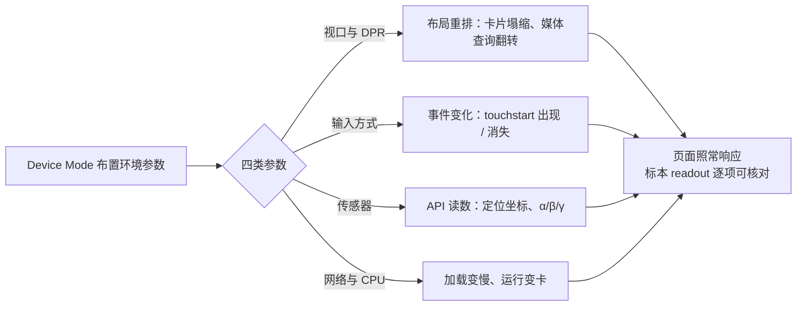

import { Canvas, Controls, Meta } from '@storybook/addon-docs/blocks';
import * as Stories from './device-mode.stories';

<Meta of={Stories} name="Docs" />

# 设备与网络模拟

前面各课里，DevTools 一直在「如实」观察页面；这一课开始，它会动手布置环境：Device Mode（设备模式）把当前页面放进一个可调的假设备里——视口宽度可以拖、触摸可以合成、传感器读数可以覆盖、网速和 CPU 可以压慢。本课的核心判断只有一句：**Device Mode 改变的不是你的页面，而是页面所处的环境参数——页面对这些参数的反应，与它上线后在真机上的反应，走的是同一套响应逻辑**。所以响应式布局、触摸交互、定位与朝向功能、低端设备体验，都可以先在桌面上验证一轮。

同时要带着它的定位用：官方文档称 Device Mode 是一阶近似（first-order approximation）——它不运行移动端 CPU，也不是移动端浏览器实现。布局与功能逻辑的正确性可以放心交给它；帧率、加载时长这类性能结论，要交给[远程与移动端调试](?path=/docs/remote-debugging--docs)的真机复核。

演示页是一个「响应式标本」：经典的 导航 / 内容 / 侧栏 三栏布局，只对自身容器宽度敏感——容器窄于 768px 时塌成单栏。readout 提供六项真实读数：标本宽度（按容器测量）、断点（按容器宽判定）、媒体查询 `(min-width: 768px)`（按整页视口判定）、devicePixelRatio、触摸能力与最近收到的事件序列；传感器行提供「获取定位」按钮与朝向读数。标本不伪造任何「手机视角」——它显示的就是页面真实收到的输入与读数，读者开启 Device Mode 后逐项对照。



| 维度 | 入口 | 改变什么 |
| --- | --- | --- |
| 视口尺寸 | 顶栏 Toggle device toolbar → Dimensions（默认 Responsive） | 布局可用的 CSS 像素空间 |
| 设备预设 | Dimensions 下拉选具体设备 | 尺寸 + DPR + 触摸 + UA 一整套 |
| 设备像素比 DPR | More options → Add device pixel ratio | 物理像素与 CSS 像素之比 |
| 输入与渲染 | Device Type 列表 | 渲染方式、光标形状、事件类型 |
| 传感器 | More tools → Sensors | 地理位置、设备朝向等 API 读数 |
| 身份 | More tools → Network conditions → User agent | 请求头里自报的浏览器身份 |
| 网络与 CPU | 顶栏 Throttle 下拉 | 网速档位 + CPU 减速组合 |

一条边界先画清楚：本课只管「布置环境」。网络节流的档位细节与请求级操作（阻断、覆盖）在[控制请求](?path=/docs/network-overrides--docs)已完整讲过，本课只补 Device Mode 里「网络 + CPU 组合档位」这一个入口。

## 快速上手

<Canvas of={Stories.Specimen} />
<Controls of={Stories.Specimen} />

| 读者操作 | 可观察证据 |
| --- | --- |
| 打开 DevTools → 顶栏 Toggle device toolbar，拖动视口宽度 | 卡片在三栏 / 单栏间塌缩；「标本宽度」「断点（容器）」同步，视口跨过 768px 时「媒体查询（视口）」翻转 |
| 拖动 Controls「标本宽度」滑块 | 「断点（容器）」与卡片布局变化，但「媒体查询（视口）」不动——滑块只改容器宽，不改视口 |
| Device Type 切到 Mobile，点标本触摸测试区 | 「最近事件」出现 `touchstart` 一族；切回 Desktop 再点，事件序列里没有 touch 一族 |
| More options → Add device pixel ratio，调大 DPR | 「devicePixelRatio」读数跟着变（读数每秒刷新一次，等一拍） |
| More tools → Sensors：Location 选 Tokyo，点「获取定位」 | 定位读数显示东京坐标；选 Location unavailable 再点，报「错误 2 · 位置不可用」 |
| Sensors：Orientation 拖动模型或选预设角度 | 朝向读数 α / β / γ 实时跟随 |
| Network conditions → User agent 取消 Use browser default，选预设后刷新 | Network 里请求头的 `User-Agent` 变成所选身份 |
| 打开 Show code | 看到该 Canvas 实际执行的 `viewport-specimen.ts` |

最小闭环——一条线把主要维度串一遍：

1. 打开 DevTools，点顶栏 **Toggle device toolbar**（切换设备工具栏）：Dimensions 变为 **Responsive**（响应式）。拖动视口边缘手柄或直接输入宽度，观察卡片塌缩点与 readout 两把尺的差异。
2. 点 More options（更多选项，⋮）→ **Show media queries**（显示媒体查询）：视口上方出现断点条——标本的 768px 断点就在橙色的 `min-width` 区段里。
3. Device Type（设备类型）切到 **Mobile**，点标本触摸测试区：readout「最近事件」里出现 `touchstart`；切回 Desktop 对比事件序列。
4. More options → **Add device pixel ratio**（添加设备像素比），把 DPR 调到 3，看「devicePixelRatio」读数变化。
5. More tools → **Sensors**（传感器）：Location 选 **Tokyo**，点「获取定位」读出覆盖坐标；换 **Location unavailable** 再点，看错误路径。练完关闭 device toolbar。

## 视口模拟

视口模拟有两种工作方式：**Responsive** 自由宽度（拖手柄、直接输入、点预设条）与**具体设备预设**（Dimensions 下拉选设备，尺寸 + DPR + 触摸 + UA 打包生效）。它们改变的都是页面收到的 CSS 像素视口——媒体查询、`vw` 单位、流式容器随之重排，页面代码一个字节都不用动。

### 断点与媒体查询条

Responsive 模式的宽度输入有三种：拖视口边缘手柄；Dimensions 里直接输入宽 × 高；点宽度预设条一键到位——Mobile S 320 / Mobile M 375 / Mobile L 425 / Tablet 768 / Laptop 1024 / Laptop L 1440 / 4K 2560。

More options → **Show media queries** 在视口上方拉出断点条：**蓝条是 `max-width` 断点，橙条是 `min-width` 断点**。点击条内区段，视口宽度直接调到该范围；右键断点 → **Reveal in source code**（在源代码中显示），跳到 Sources 里对应的 `@media` 规则——从「这个宽度有问题」到「改哪行 CSS」一步到位。

可观察证据（标本会话）：同一个 `768px`，两把尺。「媒体查询（视口）」按整页视口判定，只有 Device Mode 或浏览器窗口能推动它；「断点（容器）」按标本容器宽判定，侧栏、页边距和文档最大宽度都算在两者的差值里。把视口拖到 768：媒体查询命中了，标本可能还是三栏；继续缩小，等容器本身过线，卡片才塌缩。排查「响应式不生效」时，先用这两把尺分清是**视口没过线**还是**容器没过线**。标本读媒体查询用的就是页面标准 API：

```ts
const query = window.matchMedia('(min-width: 768px)');
query.matches; // 视口 ≥ 768px 时为 true
query.addEventListener('change', () => {
  // 视口跨线时触发
});
```

### 设备预设与自定义设备

Dimensions 下拉里选具体设备，等于一次布置整套环境：尺寸、DPR、触摸与 UA 随设备走——验证「这台设备上长什么样」比 Responsive 更省事。预设没有的设备自己加：设备列表 → **Edit** → Settings → **Devices** → **Add custom device**（添加自定义设备），name、width、height 必填，DPR、User agent string、device type 可选（类型默认 Mobile）。

工具栏其余控件按需取用：

| 控件 | 用途 |
| --- | --- |
| Rotate（旋转） | 横竖屏切换 |
| Dual-screen / Device posture | 双屏与折叠形态（Surface Duo、Zenbook Fold 等设备预设下出现；posture 分 Continuous / Folded） |
| More options → Show device frame（显示设备外观） | 给视口套设备外壳，并非每种设备都有外观素材 |
| More options → Show rulers（显示标尺） | 视口顶部与左侧显示像素标尺，点击刻度可直接设宽高 |
| Zoom | 调整 Device Mode 里预览的显示比例 |
| More options → Capture a full size screenshot | 截取整个页面；先开 device frame 可把外观一起截进 |

### 设备像素比（DPR）

DPR（device pixel ratio，设备像素比）= 物理像素 / CSS 像素。它决定 `1px` 边框的真实粗细、位图在屏上是清晰还是发虚——`@2x`、`@3x` 图片资源与发丝线问题都在这一层。

入口：More options → **Add device pixel ratio**，工具栏出现 DPR 下拉后按需选值。Responsive 模式想手调 DPR 就在这里调；设备预设自带各自的 DPR，不用手动对。可观察证据（标本会话）：readout「devicePixelRatio」就是页面上报的当前值，调 DPR 下拉它跟着变。

## 触摸与设备类型

Device Type 列表决定页面的渲染方式、光标形状与收到的事件类型（列表默认隐藏时走 More options → **Add device type**）：

| 选项 | 渲染 | 光标 | 事件 |
| --- | --- | --- | --- |
| Mobile | 移动版 | 圆点 | touch |
| Mobile (no touch) | 移动版 | 普通 | click |
| Desktop | 桌面版 | 普通 | click |
| Desktop (touch) | 桌面版 | 圆点 | touch |

可观察证据（标本会话）：切到 **Mobile** 后点击触摸测试区，readout「最近事件」里 `touchstart`、`touchend` 一族到货，伴随派生的鼠标兼容事件（`mousedown`、`click`）——合成触摸会顺带派发兼容鼠标事件，两者并存是正常现象；切回 **Desktop**，事件序列里只剩鼠标一族。「触摸支持」读数（`maxTouchPoints` 与 `ontouchstart`）反映页面看到的能力，个别版本要刷新页面后才更新——这正是能力检测与真实事件流要分开设两个读数的原因。

需要模拟按压力度（force click）时，到 Sensors 面板的 Touch 下拉选 **Force touch**，按提示点 **Reload DevTools** 生效。

## 传感器模拟

Sensors（传感器）面板覆盖的是 Web API 的读数。打开方式：More tools → **Sensors**，或命令菜单（`Command/Ctrl + Shift + P`）输入 sensors → **Show Sensors**。页面侧照常用标准 API 收数据——标本监听 `deviceorientation` 事件、点按钮调 `navigator.geolocation.getCurrentPosition`，Sensors 里覆盖什么，它们就读到什么。

### 地理位置

Location（位置）下拉三档：

| 档位 | 行为 |
| --- | --- |
| 预设城市（Tokyo、Munich 等） | 定位返回该城市坐标 |
| Custom location（自定义位置） | 手动填经纬度，精确复现场景 |
| Location unavailable（位置不可用） | 定位 API 报「位置不可用」——专测错误处理路径 |

可观察证据（标本会话）：选 **Tokyo** 后点「获取定位」，读数显示东京坐标；换 **Location unavailable** 再点，读数报「错误 2 · 位置不可用」。成功与失败两条路径，都是页面降级逻辑要接住的输入。标本的调用就是标准 API：

```ts
navigator.geolocation.getCurrentPosition(
  (position) => {
    // 用 position.coords 渲染
  },
  (error) => {
    // error.code：1 权限被拒 / 2 位置不可用 / 3 超时
  },
  { timeout: 10_000 },
);
```

两点边界：浏览器弹出定位权限提示时选「允许」即可（覆盖改变的是位置数据，权限流程该走还走）；未开启覆盖时拿到的是你的**真实位置**——先选预设再点按钮，别把自己的坐标当成东京记进笔记。

### 设备朝向

Orientation（朝向）下拉提供预设角度（如 Portrait upside down）与 **Custom orientation**（自定义朝向）——填 alpha / beta / gamma 三个角度，或直接拖动 **Orientation Model**（朝向模型）摆姿势，按住 Shift 拖动则沿 alpha 轴旋转。页面侧一行代码接住：

```ts
window.addEventListener('deviceorientation', (event) => {
  // event.alpha 指南针朝向 / event.beta 前后倾 / event.gamma 左右倾
});
```

可观察证据（标本会话）：拖动 Orientation Model，朝向读数 `α / β / γ` 实时跟随；Orientation 停在未覆盖状态时读数保持「未收到 deviceorientation 事件」——桌面没有真实传感器，没有覆盖就没有事件，读数空白本身就是证据。

### 其他传感器选项

| 选项 | 覆盖什么 | 备注 |
| --- | --- | --- |
| Touch → Force touch | 按压力度（force click） | 按提示点 Reload DevTools 生效 |
| Emulate Idle detector State | Idle Detector API 的用户 / 屏幕状态（User active/idle × Screen locked/unlocked 四种组合） | 先勾 Ephemeral（瞬时）再选状态 |
| Hardware concurrency | `navigator.hardwareConcurrency`（逻辑核心数） | 默认 12，超出可能拖慢性能；Reset 恢复 |
| CPU pressure | Compute Pressure API 压力状态：Nominal / Fair / Serious / Critical | 按提示点 Reload DevTools |

## UA 覆盖

User agent（UA，用户代理）是请求头里浏览器自报的身份，服务端常按它下发不同内容。设备预设可以自带 UA（自定义设备里填 User agent string）；手动覆盖的入口在 **Network conditions**（网络条件）抽屉：More tools → Network conditions，或命令菜单输入 network conditions → **Show Network conditions**。

步骤（全部在该抽屉的 User agent 区完成）：

1. 取消勾选 **Use browser default**（使用浏览器默认）。
2. 从预设列表选一个身份，或直接输入自定义 UA 字符串。
3. 刷新页面——覆盖作用于请求头，**必须刷新才生效**。
4. 核对：Network 里点任意请求 → Headers → Request Headers 的 `User-Agent` 已被替换。

现代服务端越来越多读 User agent client hints（`Sec-CH-UA` 系列头）而非裸 UA 字符串——把身份覆盖完整，两组都要给：展开 **User agent client hints** 下拉，表单按所选 UA 自动预填，可编辑条目、**Delete** 移除、**Add brand** 追加品牌与版本，点 **Update** 后再刷新。

边界：UA 覆盖只改变服务器看到的身份，**不改变 Chrome 的内部行为**——页面的特性检测与渲染能力照旧按真实能力走。想「像一台设备那样渲染」，回 Device Type 与设备预设；想「让服务器以为你是那台设备」，才用 UA 覆盖。它与节流、Disable cache 同住 Network conditions 抽屉，网络视角的用法见[控制请求](?path=/docs/network-overrides--docs)。

## 网络与 CPU 节流

Device Mode 顶栏的 Throttle（节流）下拉把两个维度打包成组合档：

| 档位 | 组合 |
| --- | --- |
| Mid-tier mobile | fast 3G + CPU 减速 4 倍 |
| Low-end mobile | slow 3G + CPU 减速 6 倍 |

它回答的问题是「中低端手机的整体体验」——加载慢和跑不快同时发生。两个细节：减速是相对你这台开发机能力的倍率，不是真机的绝对速度；只调一个维度时各回各家——网速档位与自定义档位在 Network 面板（细节见[控制请求](?path=/docs/network-overrides--docs)），CPU 减速在 Performance 面板的 Capture Settings → CPU（4× / 6× / 20×）。观察手段也是现成的：网速看 Network 面板的请求用时，CPU 看 Performance 录制——把环境换成「低端设备」再跑一遍即可。

## 最佳实践

- **一个问题开一个维度。** 布局与断点 → 视口；交互 → Device Type；功能 → Sensors；身份 → UA；体验 → 组合节流。全维度一起开，会让每个读数都失去参照——先想清楚这一轮要回答什么。
- **把 Device Mode 当初筛，不当终审。** 一阶近似验证布局、逻辑与降级路径足够可信；帧率、加载时长、真机特有行为交给真机复核（进阶阶段的[远程与移动端调试](?path=/docs/remote-debugging--docs)）。
- **练完复原环境。** 关闭 device toolbar 恢复真实视口；UA 覆盖在勾回 Use browser default 之前会持续顶替身份，练完勾回；Sensors 的覆盖只在 DevTools 打开期间生效，关闭即失效，但长时间调试中不用就先关掉，避免下一轮读数串场。
- **视口与容器分清两把尺。** 媒体查询量视口，容器查询与 JS 布局量容器；标本「断点（容器）」与「媒体查询（视口）」读数的差值就是侧栏与页边距。排「断点没生效」先确认是哪把尺没过线。
- **测服务端分支时把身份给全。** UA 字符串与 client hints 一起覆盖并刷新；核对以 Network 请求头为准，不以页面外观为准。

## 常见问题

- Device Type 切到 Mobile，触摸测试区还是收不到 `touchstart`。
  先确认选的是 **Mobile** 而不是 **Mobile (no touch)**；再看「触摸支持」读数——若 `maxTouchPoints` 仍是 0，刷新一次页面：个别版本里能力注入要重新加载才完整。判断时把两个读数分开看：「触摸支持」是页面看到的能力，「最近事件」是真实收到的事件流。
- 改了 User agent，页面没有变化。
  UA 覆盖要刷新页面才生效；确认 **Use browser default** 已取消；若服务端读的是 client hints，还要展开 **User agent client hints** 改完点 **Update** 再刷新。核对以 Network 请求头里的 `User-Agent` / `Sec-CH-UA` 为准。
- 点了「获取定位」，报错或返回的不是 Sensors 里选的城市。
  看错误码：1 是权限被拒（浏览器弹出提示时选「允许」）；2 是位置不可用——确认 Location 没停在 **Location unavailable** 档；3 是超时，再点一次。返回的是真实位置，说明覆盖没开或没生效——先在 Sensors 里选一个预设城市再点按钮。
- 朝向读数一直停在「未收到 deviceorientation 事件」。
  桌面没有真实传感器，Orientation 停在未覆盖状态时事件不会发生。选一个预设角度或 Custom orientation，拖动 Orientation Model——读数会立刻跟上来。

## 总结回顾

摘要：

Device Mode 在不改动页面代码的前提下布置移动设备的环境参数：视口模拟提供 Responsive 自由宽度（手柄、直接输入、预设条）与设备预设两条路，Show media queries 把断点拉成可点击的蓝橙条；DPR 下拉改变物理像素与 CSS 像素之比；Device Type 决定渲染方式、光标与 touch / click 事件；Sensors 面板覆盖地理位置（预设城市 / Custom location / Location unavailable）与设备朝向（alpha / beta / gamma），并可覆盖按压力度、空闲状态、逻辑核心数与 CPU 压力；Network conditions 抽屉覆盖 UA 与 client hints，刷新后生效、只改身份不改行为；Throttle 下拉用 Mid-tier mobile / Low-end mobile 把网速与 CPU 减速打包成中低端设备组合档。响应式标本的 readout 把这些环境参数转成可核对的真实读数，也现场演示了「媒体查询量视口、容器布局量容器」这两把尺的差别。它是一阶近似：布局与逻辑的正确性可信，性能结论要真机复核。

一句话：

> Device Mode 改的是页面身处的环境，不是页面本身——每布置一个维度，就要在页面的反应里找到对应的读数。

知识要点：

- Device Mode 改变哪几类环境参数？各自的入口在哪？
- Responsive 模式与设备预设分别适合什么场景？宽度预设条有哪些档位？
- 媒体查询条怎么读？蓝条与橙条各对应什么断点？右键断点能跳到哪里？
- 为什么标本的「断点（容器）」与「媒体查询（视口）」读数会不一致？
- Device Type 四个选项在渲染、光标、事件上的差别是什么？`touchstart` 从哪来？
- DPR 改变什么？在哪里把 DPR 下拉加进工具栏？
- Sensors 面板能覆盖哪些读数？Location 的三档分别用来测什么？
- UA 覆盖的入口、生效条件与 client hints 的角色是什么？它不改变什么？
- Mid-tier mobile 与 Low-end mobile 各对应什么组合？单独调网速或 CPU 该去哪？
- 哪些结论应该交给真机复核？

## 参考资料

- [Simulate mobile devices with device mode](https://developer.chrome.com/docs/devtools/device-mode)
- [Sensors: Emulate device sensors](https://developer.chrome.com/docs/devtools/sensors)
- [Override the user agent string](https://developer.chrome.com/docs/devtools/device-mode/override-user-agent)
