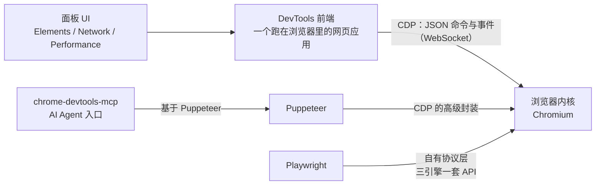

import { Canvas, Controls, Meta } from '@storybook/addon-docs/blocks';
import * as Stories from './devtools-protocol.stories';

<Meta of={Stories} name="Docs" />

# 协议与自动化

本课回答一个生态问题：DevTools 面板背后是什么，Puppeteer、Playwright 这些自动化工具和它是什么关系。核心判断先给出：DevTools 本身就是一个 CDP（Chrome DevTools Protocol，Chrome 开发者工具协议）客户端——你在 Elements、Network、Performance 面板里做的每一次检查，最终都是一条 JSON 命令发进浏览器；自动化工具复用（或对应）同一条通道，只是封装的高度不同。本页的「协议地图」演示就是这个判断的任务级展开：切换自动化任务，读出它在 CDP、Puppeteer、Playwright、chrome-devtools-mcp 四层各叫什么名字，MCP 行会用颜色标出覆盖判断。

先立两条边界。其一，本课是生态总览与入口：讲清分层模型、协议形态、最小 CDP 会话的跑法和工具选型，不展开 Puppeteer / Playwright 的用法教程（见各自官方文档），面板操作见前面各课——真机调试是同一条协议换了个通道，见[远程与移动端调试](?path=/docs/remote-debugging--docs)；把用户流录成自动化脚本的另一个入口见[录制与回放用户流](?path=/docs/recorder--docs)。其二，CDP 官方明确声明它不是公开或受支持的 API，不保证向后兼容——学会它是为了看懂 DevTools 和自动化工具，生产自动化请走官方支持的接入层。

四层各就各位：



回查入口：

| 要查什么 | 入口 |
| --- | --- |
| CDP 官方文档与协议查看器 | chromedevtools.github.io/devtools-protocol（ToT 最新版 / stable 1.3） |
| 当前浏览器的完整协议 schema | `http://127.0.0.1:9222/json/protocol` |
| 可调试目标列表 | `http://127.0.0.1:9222/json/list`（简写 `/json`） |
| 版本与浏览器级 WebSocket 地址 | `/json/version` 响应里的 `webSocketDebuggerUrl` 字段 |
| 页面级 WebSocket 端点 | `/devtools/page/{targetId}` |
| 面板里实时看 CDP 流量 | DevTools → Settings → Experiments → Protocol Monitor |
| 任务到工具的映射 | 本页「协议地图」演示与「自动化工具地图」一节 |
| chrome-devtools-mcp 工具清单 | 仓库 `docs/tool-reference.md` |

## DevTools 的分层模型

四层结构自上而下是：面板 UI（你操作的组件）跑在 DevTools 前端里；DevTools 前端是一个独立的网页应用；它和浏览器内核之间只隔一条 CDP 通道——JSON 序列化的命令（command）与事件（event），命令请求带结果回来，事件由浏览器单向推送。可调试对象在协议里叫 target（目标）：一个页面、一个 worker、一个 service_worker，甚至浏览器进程本身（browser target）都是一个目标，各自有自己的 WebSocket 端点。

这个模型给出两条可以反复使用的判断：

- **面板能做的，协议都能做**——自动化工具的能力上限就是 DevTools 的能力上限，同一条通道。
- **协议能做的，未必有面板入口**——例如 `Page.printToPDF`、`Emulation.setUserAgentOverride` 这类能力散落在各域里，面板只把常用子集做成了界面。

### 目标与域

CDP 按域（domain）组织功能：DOM、CSS、Network、Page、Emulation、Input、Fetch、Tracing、Target……每个域定义自己的一组命令与事件。权威定义源是两份 PDL 文件：

| 定义源 | 覆盖 |
| --- | --- |
| `browser_protocol.pdl` | 浏览器侧域：Page、Network、DOM、Emulation、Input、Fetch、Tracing 等 |
| `js_protocol.pdl` | V8 侧域：Runtime、Debugger、Profiler——Node.js 调试复用的正是这一部分 |

版本意识：协议查看器分 ToT（tip-of-tree，跟随 Chromium 最新定义）与 stable 1.3（Chrome 64 时的历史快照）；协议项可能标注 experimental（随时可能变）或 deprecated（已被取代，如网络拦截旧命令被 Fetch 域取代）。要知道你手上这个浏览器到底支持什么，不用猜——`/json/protocol` 会返回当前实例的完整协议 schema。

Node.js 边界：`node --inspect` 走的就是 js_protocol 那几个域，所以读得懂 CDP 域文档，Node 的调试协议也看得懂。Node 调试本身不属于本手册，这里只认下这层亲缘。

### Protocol Monitor：在面板里看协议

「DevTools 就是 CDP 客户端」不用信，可以看。打开路径：先在 Settings → Experiments 勾选 Protocol Monitor（协议监视器），再从主面板 ⋮ 菜单 → More tools → Protocol Monitor。打开后，面板产生的每一条 CDP 请求、响应和事件都实时滚动在列表里；底部输入框还能直接发命令——无参数命令直接输方法名（如 `Page.captureScreenshot`），带参数则用 JSON 格式（如 `{"cmd":"Page.captureScreenshot","args":{"format":"jpeg"}}`）。

可观察证据：打开 Protocol Monitor 后随便点一下 Elements 树或切换一个面板，列表立刻出现成串的 DOM.getDocument、CSS.getMatchedStylesForNode 之类的命令——面板的每个动作最终都是一条 CDP 消息，协议监视器就是这条通道的窗口。这也是不写任何代码就能验证「任务 X 在协议里叫什么」的最快办法：去面板点一遍，看命令名。

## 最小 CDP 会话

自动化工具只是帮你管理连接和消息；底下的会话形态极简，值得手搓一遍。四步：

1. 启动一个开着调试端口的 Chrome（用独立的 `--user-data-dir` 避免被已运行的 Chrome 实例吃掉进程，原因见常见问题）：

```sh
/Applications/Google\ Chrome.app/Contents/MacOS/Google\ Chrome \
  --remote-debugging-port=9222 --user-data-dir=/tmp/cdp-lab
```

2. 查版本，拿浏览器级 WebSocket 地址：

```sh
curl -s http://127.0.0.1:9222/json/version
```

预期是一个 JSON：`Browser`、`Protocol-Version` 等字段，`webSocketDebuggerUrl` 指向 `ws://127.0.0.1:9222/devtools/browser/<uuid>`——这是浏览器级根会话的地址。

3. 列出可调试目标：

```sh
curl -s http://127.0.0.1:9222/json/list
```

预期：一个数组，每个元素是一个 target——`type: "page"` 的普通标签页、`type: "service_worker"` 的后台脚本等，每个都带自己的 `webSocketDebuggerUrl`（形如 `/devtools/page/<id>`）与 `devtoolsFrontendUrl`（chrome://inspect 与远程调试看到的"目标列表"就是这份数据）。

4. 连上页面级 WebSocket，发一条命令（Node 22+ 自带 WebSocket 客户端，无需安装依赖；旧版 Node 用 `ws` 包替换 `new WebSocket` 即可）：

```js
// cdp-min.mjs —— 最小 CDP 会话：连第一个页面目标，发 Runtime.evaluate 读页面标题
const targets = await (await fetch('http://127.0.0.1:9222/json/list')).json();
const page = targets.find((target) => target.type === 'page');
const socket = new WebSocket(page.webSocketDebuggerUrl);
let nextId = 0;

socket.onopen = () => {
  socket.send(
    JSON.stringify({
      id: ++nextId,
      method: 'Runtime.evaluate',
      params: { expression: 'document.title' },
    }),
  );
};

socket.onmessage = (event) => {
  console.log(event.data);
  socket.close();
};
```

运行 `node cdp-min.mjs`，预期收到一条响应：`id` 与请求对应，`result.result.value` 是页面标题——这就是面板里 Console 输入 `document.title` 背后发生的事。

协议通道的安全边界（官方设计，影响你能不能连、怎么连）：

- 调试端口的 HTTP 端点只接受 Host 为 IP 或 localhost 的请求（防 DNS rebinding 攻击），用域名访问会拿到 500；
- 端点从不发送 CORS 头——网页里的 fetch 读不到目标列表，这条通道不会暴露给任意页面；
- 浏览器环境发起的 WebSocket 带 Origin 头，不在 `--remote-allow-origins` 白名单里会被 403 拒绝；Node 脚本、curl 这类不带 Origin 的客户端不受影响；
- Chrome 63 起允许多个客户端同时连接同一个目标——DevTools 和你的脚本可以并存。

## 自动化工具地图

三条常用路线的选型入口：

| 你的任务 | 顺手的那条路 |
| --- | --- |
| 让 AI Agent 检查、操控 Chrome | chrome-devtools-mcp |
| Chrome 深度自动化：截图、PDF、trace、改写请求 | Puppeteer（或直接 CDP） |
| 跨浏览器端到端测试 | Playwright |
| 学协议本身、写一次性脚本 | WebSocket 直连（「最小 CDP 会话」一节） |

<Canvas of={Stories.ProtocolMap} />
<Controls of={Stories.ProtocolMap} />

| 读者操作 | 可观察证据 |
| --- | --- |
| 切换「自动化任务」 | Canvas 按 CDP → Puppeteer → Playwright → MCP 四层重画映射；readout 的覆盖判断同步更新 |
| 切到「PDF」或「网络拦截」 | chrome-devtools-mcp 行变红（未覆盖）——这类任务要落到 Puppeteer / Playwright |
| 切到「设备模拟」 | MCP 行变黄（部分覆盖）：`emulate` 只管 CPU 节流与网络条件 |
| 打开 Show code | 看到该 Canvas 实际执行的 `protocol-map.ts` |

### Puppeteer：CDP 的高级封装

Puppeteer 是 ChromeDevTools 团队维护的 Node 库，把 CDP 命令与事件编排成 `page` 对象上的高级 API，支持 Chrome 与 Firefox（协议层面是 CDP 与 WebDriver BiDi 两条通道），默认 headless（无界面）模式运行；`npm i puppeteer` 会自动下载配套的 Chrome for Testing，`puppeteer-core` 则不下载浏览器。

它与 CDP 是「薄封装」关系：`page.screenshot()` 背后就是 `Page.captureScreenshot`（拿 base64 存成文件），`page.tracing` 直通 Tracing 域。协议没有被包装到的地方，用 `page.createCDPSession()` 拿到原始会话直接发命令——所以本课的协议知识在 Puppeteer 里全部适用。

### Playwright：三引擎一套 API 的自有协议层

Playwright 是微软的 Web 测试与自动化框架，一套 API 驱动 Chromium、Firefox、WebKit 三种引擎。这正是它与 Puppeteer 的本质区别，也是必须如实区分的一点：**Playwright 不是「CDP 封装」**——Firefox 和 WebKit 根本没有 CDP。它的主 API 是自己的抽象层，浏览器侧由微软维护的补丁版引擎（仓库里的 browser_patches）承接自动化能力；CDP 只是 Chromium 上的一个逃生舱口：`CDPSession` 在官方文档里明确标注 only supported on Chromium-based browsers（仅支持 Chromium 系浏览器）。

这层自有协议在任务级看得最清楚：性能追踪走 `context.tracing`，产出 Playwright 自有 trace 格式（配 Trace Viewer 回放），而不是 Chrome trace；网络拦截用 `page.route()`，语义也与 CDP 事件流不同。另外 Playwright 也有自己的 MCP 服务器，靠结构化 accessibility snapshot（无障碍快照）让 Agent 操作浏览器、不依赖截图——AI 入口不止一条，选型时按任务挑。

### chrome-devtools-mcp：AI Agent 的 DevTools 入口

chrome-devtools-mcp 是 Chrome 官方的 MCP（Model Context Protocol，模型上下文协议）服务器，让 Claude、Cursor 这类 AI 编码代理操控真实 Chrome。它基于 Puppeteer 实现自动化，调试与性能分析用 DevTools 前端能力——所以它的工具语义就是 DevTools 面板语义。官方支持 Google Chrome 与 Chrome for Testing；浏览器由 MCP 服务器在客户端首次调用工具时自动启动，也可用 `--headless`、`--slim`（精简工具集）等参数。

工具覆盖按面板分组（节选，完整清单见 Tool Reference）：性能组 `performance_start_trace` / `performance_stop_trace` / `performance_analyze_insight`；调试组 `list_console_messages`、`take_screenshot`、`take_snapshot`、`evaluate_script`；网络组 `list_network_requests` / `get_network_request`；模拟组 `emulate`（CPU 节流、网络条件）与 `resize_page`；输入组 `click` / `fill` / `press_key` / `hover` 等。

选型判断：它覆盖的是「DevTools 视角」的任务——检查、截图、性能分析、输入操作都直接；PDF 导出、改写网络请求这类生成/干预型任务不在工具集里（协议地图里红了的两格），此时落到 Puppeteer / Playwright。安全边界也来自 README：MCP 客户端能访问浏览器实例的全部内容，敏感会话不要交给它。

## 常见问题

- 加了 `--remote-debugging-port=9222`，`/json/list` 却连接被拒。
  桌面上已有 Chrome 在运行：新进程只是把参数转交给现有实例后退出，现有实例并没有开端口。处理：用独立的 `--user-data-dir` 启动一个隔离实例（最小会话的命令里已带上），验证通过后再按需合并配置。
- `/json/new` 想新开标签页却返回 405。
  这个端点严格要求 PUT 动词，GET、POST 一律 405：`curl -X PUT "http://127.0.0.1:9222/json/new?https://example.com"`。它是官方文档里唯一强制指定 HTTP 动词的调试端点。
- WebSocket 握手被 403 拒绝。
  浏览器环境发起的连接带 Origin 头，必须命中 `--remote-allow-origins` 启动参数的白名单（或设为 `=*`）才会放行；Node 脚本与 curl 不带 Origin 头，不受影响。先分清客户端是哪一类再对症加参数。

## 总结回顾

摘要：

DevTools 面板、协议与自动化工具是四层结构：面板 UI 跑在 DevTools 前端里，前端与浏览器内核之间是 CDP——按 target（目标）与 domain（域）组织的 JSON 命令与事件协议，权威定义在 `browser_protocol.pdl`（浏览器侧域）与 `js_protocol.pdl`（V8 侧的 Runtime、Debugger、Profiler，Node.js 调试共用）两份文件里；协议查看器分 ToT 与 stable 1.3，当前实例的真实协议用 `/json/protocol` 查。DevTools 自己就是一个 CDP 客户端，Protocol Monitor 能在面板里实时看到并直接发送命令。手工会话四步：`--remote-debugging-port` 启动（配独立 `--user-data-dir`）、`/json/version` 拿浏览器级地址、`/json/list` 拿目标列表、在页面级 WebSocket 上发 `{id, method, params}` 格式的命令。自动化三条路各有定位：Puppeteer 是 CDP 的高级封装（覆盖 Chrome 与 Firefox）；Playwright 用自有协议层统一三引擎，CDP 只是 Chromium 上的逃生舱；chrome-devtools-mcp 基于 Puppeteer、以 DevTools 语义把能力开放给 AI Agent——检查类任务全覆盖，PDF 导出与网络改写要落到封装层。

一句话：

> DevTools 本身就是一个 CDP 客户端——面板、Puppeteer、Playwright、MCP 是同一条协议通道上不同高度的入口。

知识要点：

- 四层各是什么？「面板能做的协议都能做、协议能做的未必有面板入口」分别推出什么结论？
- CDP 怎么组织功能？target 与 domain 各指什么？两份 PDL 定义源各覆盖什么？
- Protocol Monitor 从哪里开？它能证明什么、能直接做什么？
- 最小 CDP 会话四步分别用什么命令？`{id, method, params}` 消息怎么发、响应怎么认？
- 调试端口有哪些安全边界？哪类客户端会被 Origin 白名单拦住？
- Puppeteer、Playwright 与 CDP 各是什么关系？为什么 Playwright 不能算 CDP 封装？
- chrome-devtools-mcp 基于什么实现？哪些任务它直接覆盖、哪些要落到 Puppeteer / Playwright？

## 参考资料

- [Chrome DevTools Protocol](https://chromedevtools.github.io/devtools-protocol/)
- [devtools-protocol 仓库（协议定义 PDL 与生成的 JSON）](https://github.com/ChromeDevTools/devtools-protocol)
- [chrome-devtools-mcp](https://github.com/ChromeDevTools/chrome-devtools-mcp)
- [chrome-devtools-mcp Tool Reference](https://github.com/ChromeDevTools/chrome-devtools-mcp/blob/main/docs/tool-reference.md)
- [Puppeteer](https://github.com/puppeteer/puppeteer)
- [Playwright](https://github.com/microsoft/playwright)
- [Playwright · BrowserContext.newCDPSession（CDP sessions are only supported on Chromium-based browsers）](https://playwright.dev/docs/api/class-browsercontext#browser-context-new-cdp-session)
