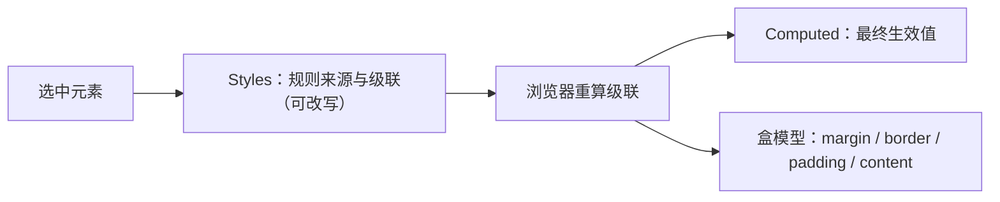

import { Canvas, Controls, Meta } from '@storybook/addon-docs/blocks';
import * as Stories from './edit-css.stories';

<Meta of={Stories} name="Docs" />

# 查看与修改 CSS

选中一个元素后，CSS 的调试在 Elements（元素）面板内分三个区域配合完成：Styles（样式）面板列出所有命中该元素的规则，回答「样式从哪来、谁覆盖谁」，并允许直接改写；Computed（计算样式）面板只显示浏览器最终算出的值，回答「到底生效的是多少」；盒模型图把元素拆成 margin、border、padding、content 四层，回答「空间占了多大」。所有修改实时生效，但只存在内存里，刷新页面即恢复原样。

三个区域如何配合：

区域分工速查表：

| 区域 | 回答什么问题 | 关键操作 |
| --- | --- | --- |
| Styles（样式） | 规则从哪来、谁覆盖谁 | `element.style` 加行内声明、`.cls` 加类、`:hov` 强制伪类、双击或方向键改值、声明前勾选框开关、New Style Rule（新建规则） |
| Computed（计算样式） | 最终算出的值是多少 | Filter（过滤）、Show all（显示全部，含继承属性）、Group（分组） |
| 盒模型（Styles → Show sidebar） | 空间占了多大、每条边多少 | 悬停高亮对应区域、双击改 width / height / margin / padding / border |

## 快速上手

在下方演示页完成第一次改样式。演示页是一张「CSS 标本」卡片：样式有层次——自定义属性做主题、两条特异性不同的规则在竞争、还有伪类与伪元素；readout（读数）直接读自 getComputedStyle（计算样式 API），所以无论改动来自 Controls 输入还是你自己的 DevTools，读数都会实时刷新。

<Canvas of={Stories.Specimen} />
<Controls of={Stories.Specimen} />

最小闭环：

1. 在演示页右键「标本卡片」的标题，选 Inspect（检查）——DevTools 打开 Elements 并选中 `<h3 class="card-title">`。
2. 在 DOM 树里点上一行 `<section class="specimen-card">`，让卡片本身成为选中元素。
3. 在 Styles 标签最上方的 `element.style`（元素行内样式）里点一下，输入 `background: #ffe58f` 后回车——卡片立刻变成淡黄色。
4. 切到 Computed 标签，在 Filter 框输入 `background`，看到 `background-color: rgb(255, 229, 143)`——这就是浏览器最终算出的值。
5. 刷新浏览器页面：改动消失，恢复原样。样式修改是实时的，也是临时的。改乱了随时刷新重来。

| 读者操作 | 可观察证据 |
| --- | --- |
| 在 Controls 里把「状态类」切到 is-active | 卡片背景变化，readout「状态类」「背景颜色」同步更新；Styles 里 `.specimen-card.is-active` 规则生效 |
| 在 Controls 里换「--card-accent 主题色」 | readout「边框颜色」变化；Styles 顶部出现 element.style 行内的 `--card-accent` 声明 |
| 在演示页右键注释段落选 Inspect | Styles 里列出两条 `.card-note` 规则，输掉的一条被划线 |
| 双击胜出规则的 `color` 值，改成 `crimson` | 注释文字立即变色 |
| 选中卡片后用 `:hov` 勾选 `:hover` | 卡片浮起出现阴影，无需真的悬停 |
| 点 Styles 右上角 Show sidebar | 打开盒模型图，悬停各层时页面对应区域高亮 |
| 刷新页面 | 所有改动恢复原样 |

Controls 的两个输入改的正是你要在 DevTools 里练的两个对象——类名与自定义属性。反过来，你在 DevTools 里用 `.cls` 勾上 `is-active`、或手动改 `--card-accent`，readout 也会跟着变，两边可以互相验证。右键 Inspect 与 DOM 树操作的更多细节，见[检查 DOM](?path=/docs/inspect-dom--docs)。

## Styles 面板

Styles 面板自上而下大致分这几段（以选中演示页卡片为例）：

| 区段 | 内容 |
| --- | --- |
| `element.style` | 行内样式（元素的 style 属性），初始为空 |
| 匹配规则 | 所有命中该元素的规则；悬停选择器显示特异性（specificity）权重，悬停属性名显示文档 tooltip，点 Learn more 打开 MDN |
| 来源链接 | 点规则旁的样式表文件名，跳到 Sources（源代码）面板对应位置 |
| 链接跳转 | 点 `var(--card-accent)` 跳到自定义属性声明处；`animation` 简写可点跳到 `@keyframes` |
| `Inherited from …` | 从祖先元素继承来的样式段；演示页标题的颜色就来自 `Inherited from .css-specimen` |
| `Pseudo ::before / ::after element` | 伪元素规则段；卡片右上角的「标本」角标就是 `::after` 画出来的 |

被覆盖的声明显示为划线：可能是输掉了级联（特异性、出现顺序、行内样式、`!important`），也可能是你取消了声明前的勾选。属性名 tooltip 如果被关掉，到 Settings → Preferences → Elements 里重新开启。

### 行内声明：element.style

`element.style` 对应元素的 style 属性，是优先级最高的作者样式：不带 `!important` 时它赢过任何选择器规则，只有对方也带 `!important` 才会输。

- 加声明：点 `element.style` 区域，输入属性名（有自动补全），回车后再输入值。
- 写进已有规则：点该规则大括号内的空白行，同样输入属性与值。
- New Style Rule（新建规则）：点动作栏的这个按钮，为选中元素生成一条新规则；按住不放可选择写入哪个样式表。

验证优先级：在 Controls 里把主题色换成非默认值，`element.style` 会多出一行 `--card-accent`；它压过了样式表里 `.css-specimen` 的定义。删掉这行（或换回默认色），页面主题回到样式表原来的值。

### 加类与强制状态：.cls 与 :hov

- `.cls`：点开后在输入框输入新类名回车，即可给元素加类；元素已有的类以勾选框列出，可随时开关。Controls 的「状态类」切换的就是 `is-active`——你也可以用 `.cls` 手动勾上它，readout 会给出同样的读数。
- `:hov`：勾选 `:hover`、`:active`、`:focus`、`:focus-within`、`:focus-visible`、`:target`，把对应伪类状态强制到选中元素上。演示页卡片有一条 `:hover` 阴影规则——勾上 `:hover`，不用真的悬停就能看到阴影。同一弹出层里还有 Emulate a focused page（模拟聚焦页面），用于模拟整页获得焦点的场景。

强制状态只作用于选中元素本身：选择器里靠祖先或后代联动的部分照常生效，但它不会触发页面的 `mouseenter` 一类 JS 事件（见「常见问题」）。

### 改值、开关与复制

- 改属性名或值：双击直接编辑。
- 键盘步进（焦点在数值上时，`Down` 系列对应递减）：

| 按键 | 步进 |
| --- | --- |
| `Up` / `Down` | ±1（当前值在 -1 到 1 之间时为 ±0.1） |
| `Alt+Up` / `Alt+Down`（macOS：`Option+Up` / `Option+Down`） | ±0.1 |
| `Shift+Up` / `Shift+Down` | ±10 |
| `Ctrl+Shift+Page Up` / `Page Down`（macOS：`Shift+Command+Up` / `Shift+Command+Down`） | ±100 |

- 声明前的勾选框：临时停用一条声明，被停用的显示划线；再勾上即恢复。
- 专属编辑器：颜色声明左侧的色块点开 Color Picker（取色器），取色、调色、看对比度、切换 hex / rgb / hsl / hwb 格式都在里面，`Shift+点击色块` 可直接切格式；`45deg` 一类角度值旁的图标打开 Angle Clock（角度表盘）；阴影值旁的图标打开 Shadow Editor（阴影编辑器）；`transition-timing-function` 旁的紫色图标打开 Easing Editor（缓动编辑器）。
- 复制：右键声明可选 Copy declaration（复制声明）、Copy rule（复制规则）、Copy all declarations as JS（全部声明复制为 JS 对象）等。
- 长度值还支持悬停后左右拖动改数值（Chrome 123 起弃用；如需临时启用，在 Settings → Experiments 里取消勾选 Deprecate CSS length authoring tool 实验）。

### 盒模型

- 打开：Styles 标签动作栏点 Show sidebar（显示侧栏），右侧出现盒模型图；Computed 标签顶部也有同一张图。
- 悬停：margin / border / padding / content 各层会在页面上高亮对应区域，颜色含义与 Elements 里一致。
- 编辑：双击图中任一数值直接改；默认单位是 px，也可以输入 `25%`、`10vw` 等其他单位。
- 演示页素材：卡片四边 margin 不同（上 16、右 24、下 16、左 8）、左边 border 8px 其余 2px、padding 上下 14 左右 20——盒模型图里一眼能对上；改任一数值，readout 的「内边距」「尺寸」立即变化。

## Computed 面板

Computed 只列出实际应用到该元素的属性及其最终值——划线的、被覆盖的中间结果统统不出现，所以「查最终值」永远来这里。Styles 与 Computed 的分工：Styles 回答「从哪来、谁说了算」，Computed 回答「最终是多少」。

- Filter 框：按属性名或值搜索；想连继承来的属性一起搜，先勾选 Show all。
- Show all（显示全部）：勾上后列出所有属性，包括未应用与继承的。
- Group（分组）：把过滤结果按类别折叠分组，长属性列表更好导航。

在演示页上验证：给卡片加行内 `background: #ffe58f` 后，Computed 的 `background-color` 是新值的 rgb 形式；刷新后再看，它回到 `rgb(255, 255, 255)`——计算值永远是「现在」的结果。

## 改动是临时的

Styles 里的一切修改（行内声明、类、强制状态、盒模型数值）都只作用于当前页面状态：刷新或跳转即全部还原。这是「实时试验」的设计，不是保存机制。要留住成果：

- 复制走：右键声明用 Copy 系列菜单，或复制整段规则贴回源码。
- 持久化到磁盘：Workspaces（工作区）与 Local Overrides（本地覆盖）能把修改保存为本地文件、跨刷新生效——见[修改落盘与复用](?path=/docs/persist-edits--docs)。

## 常见问题

- 改了声明，页面没反应，值上还带着划线。
  先到 Computed 搜该属性确认最终生效值；再回 Styles 在 Filter 框搜这个属性，列出所有写它的规则，找出没有被划线的胜者。判断依据：划线意味着输掉了级联（对方特异性更高、出现顺序更靠后、是行内样式或带 `!important`），或是你自己取消了勾选。
- Computed 里搜不到某个属性。
  勾选 Show all 再搜。判断依据：Computed 默认只显示实际应用到该元素的属性，未应用与继承来的都被隐藏。
- 用 `:hov` 强制了 `:hover`，效果却和真悬停不一样，或根本没反应。
  先确认选中元素（或其祖先）真的有 `:hover` 规则：在 Styles 的 Filter 框搜 `:hover`。判断依据：`:hov` 只是把伪类状态强制到选中元素上，CSS 联动照常生效，但它不会触发 `mouseenter` / `mouseleave` 等 JS 事件——依赖 JS 的悬停效果不会出现。

## 总结回顾

摘要：

本课在 Elements 面板内调试 CSS，三个区域各管一个问题：Styles 列出命中元素的全部规则（行内、匹配规则、继承段、伪元素段），负责改写——`element.style` 加行内声明、`.cls` 加类、`:hov` 强制伪类状态、双击或方向键步进改值、勾选框开关声明、New Style Rule 新建规则、色块与角度等专属编辑器、盒模型图双击改几何；被覆盖的声明显示划线，来源、`var()` 与 `@keyframes` 都可以点跳。Computed 只显示最终生效值，用 Filter、Show all、Group 定位。所有修改实时生效、刷新即失，要留存就复制出去，或用 Workspaces / Local Overrides 持久化。

一句话：

> 查「最终是多少」去 Computed，问「从哪来、谁说了算」回 Styles——改样式是实时试验，刷新即失，要留住就得复制出去或持久化。

知识要点：

- Styles 面板从上到下有哪些区段？划线的声明意味着什么？
- `element.style`、`.cls`、`:hov` 分别用来做什么？行内声明的优先级规则是什么？
- 改数值时 `Up`、`Alt+Up`、`Shift+Up`、`Ctrl+Shift+Page Up` 各步进多少？
- 盒模型图怎么打开、怎么编辑？默认接受什么单位？
- Computed 与 Styles 的分工是什么？搜不到属性时勾哪个框？
- 为什么刷新后改动会消失？有哪两类留住改动的方式？

## 参考资料

- [View and change CSS](https://developer.chrome.com/docs/devtools/css)
- [CSS features reference](https://developer.chrome.com/docs/devtools/css/reference)
- [Inspect and debug with the Color Picker](https://developer.chrome.com/docs/devtools/css/color)
