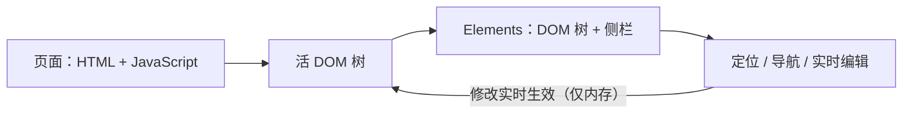

import { Canvas, Controls, Meta } from '@storybook/addon-docs/blocks';
import * as Stories from './inspect-dom.stories';

<Meta of={Stories} name="Docs" />

# 检查 DOM

Elements（元素）面板是 DevTools 检查和修改页面结构的入口：主区域是一棵 DOM 树，旁边一排侧栏标签负责样式、布局等专项。先建立一个可预测的直觉：树里显示的不是你写的 HTML 源码，而是浏览器解析后、并被页面 JavaScript 持续改写的活 DOM——JS 每次增删改节点都会实时反映到树上，你在树上的每次编辑也会立刻作用于页面。本课就围绕这棵树解决三件事：定位元素（把目标选中）、导航树（看清层级）、实时编辑（试验性修改）。

Elements 面板结构速查：

| 区域 | 位置 | 回答什么问题 | 深入课程 |
| --- | --- | --- | --- |
| DOM 树 | 主区域 | 页面结构现在长什么样？ | 本课 |
| Breadcrumbs（面包屑） | 面板底部 | 选中元素嵌在哪些祖先里？ | 本课 |
| Styles（样式） | 侧栏 | 规则从哪来、谁覆盖谁？ | [查看与修改 CSS](?path=/docs/edit-css--docs) |
| Computed（计算样式） | 侧栏 | 最终生效值是多少？ | [查看与修改 CSS](?path=/docs/edit-css--docs) |
| Layout（布局） | 侧栏 | Flex / Grid 是怎么排的？ | [调试布局](?path=/docs/debug-layout--docs) |
| Event Listeners（事件监听器） | 侧栏 | 元素上注册了哪些监听器？ | 事件断点见[高级断点](?path=/docs/advanced-breakpoints--docs) |
| DOM Breakpoints（DOM 断点） | 侧栏 | 谁在改这个节点？ | [高级断点](?path=/docs/advanced-breakpoints--docs) |
| Properties（属性） | 侧栏 | 元素对应的 JS 对象长什么样？ | —— |
| Accessibility（无障碍） | 侧栏 | 无障碍树里它是什么？ | [可访问性调试](?path=/docs/accessibility--docs) |

## 快速上手

在下方演示页完成第一次检查与编辑。演示页是一块「DOM 标本」：嵌套容器、带 `data-id` 属性的列表项、一个真实按钮，还有由页面 JS 动态插入的列表项；readout（读数）轮询的是真实 DOM——无论改动来自 Controls 还是你在 DevTools 里的编辑，读数都会实时刷新。

<Canvas of={Stories.Specimen} />
<Controls of={Stories.Specimen} />

最小闭环：

1. 在演示页右键「标本面板」标题，选 Inspect（检查）——DevTools 打开 Elements 并选中那个 `<h3>`。
2. 用 `Up` / `Down` 方向键在树里移动；`Left` 折叠当前节点、`Right` 展开。
3. 按 Ctrl+F（macOS：Command+F）打开搜索条，输入 `动态项` 回车——搜索支持字符串、CSS 选择器与 XPath。
4. 双击「静态项一」的文本改成任意内容，回车确认——页面文字立即变化。
5. 选中任一列表项按 `H` 隐藏、再按 `H` 恢复；再选一项按 `Delete` 删除，按 Ctrl+Z（macOS：Command+Z）撤销。
6. 全程盯住 readout：元素总数、列表项、动态项随真实 DOM 同步变化。
7. 刷新浏览器页面：你在 Elements 里的全部编辑还原。

| 读者操作 | 可观察证据 |
| --- | --- |
| 把「动态插入项」调到 4 | 列表末尾出现新节点，readout「动态项」「元素总数」同步增加——这就是页面 JS 在改 DOM |
| 勾选「hidden 属性」 | 第 4 个列表项从页面上消失，但树里仍在、带 `hidden` 属性；readout「列表项」不变 |
| 右键任意元素选 Inspect | Elements 选中该元素，底部 Breadcrumbs 显示从 `html` 到它的路径 |
| 按 Ctrl+F 搜索 `[data-id="item-2"]` | 树里跳到并高亮该节点——搜索同样接受 CSS 选择器与 XPath |
| 双击某项 `data-id` 的值改名 | 树里的属性立即变化 |
| 选中列表项按 `H` / 再按 `H` | 页面上消失 / 恢复；readout 不变——隐藏不减少节点，删除才会 |
| 按 `Delete` 再按 Ctrl+Z | 节点删除后被撤销恢复 |
| 先在树里选中并修改一个动态项，再调大「动态插入项」 | 你的修改被 JS 重建覆盖——页面脚本更新 DOM 时同样如此 |
| 在 DevTools 里删掉整个列表，再动任意 Controls | 标本按当前输入重建结构，随时可恢复 |

## 定位元素

目标：让目标元素成为 Elements 的选中元素。样式、监听器、断点等所有专项检查都作用于当前选中的元素，定位是一切的第一步。三类入口：

- 从页面出发：右键目标元素选 Inspect（检查）。等价路径：DevTools 左上角 → Select an element（选择元素）按钮，或按 Ctrl+Shift+C（macOS：Command+Shift+C）进入选择模式后点页面——悬停时页面高亮目标区域并显示尺寸标签。
- 在树里搜：Ctrl+F / Command+F 在树底部打开搜索条，支持字符串、CSS 选择器、XPath 三种写法，回车在匹配之间跳转。
- 视口定位：树里选中节点后右键 → Scroll into view（滚动到可见处），让页面视口滚到该元素；目标不在首屏时必用。

### Console 双向桥

Elements 与 Console 能互相把对方送到目标元素：

| 方向 | 做法 |
| --- | --- |
| Elements → Console | 选中元素后，Console 里 `$0` 就是它（树里该节点旁会显示 `== $0` 标记）；`$1`–`$4` 是更早选中过的元素 |
| Elements → Console 存变量 | 右键节点 → Store as global variable（存为全局变量），生成 `temp1` 等可直接使用的变量 |
| Console → Elements | 执行 `inspect(element)`，Elements 打开并选中该元素，例如 `inspect(document.querySelector('.dom-specimen__list'))` |
| 两者 → 剪贴板 | 右键节点 → Copy → Copy JS path，复制一条可直接执行的 `document.querySelector()` 表达式 |

在演示页上验证：先在 Elements 选中任意元素，到 Console 输入 `$0` 回车，返回的就是它；再执行 `inspect($0)`，焦点跳回 Elements——两边来回切换靠这两个名字就够。Console 的完整用法见[Console 入门](?path=/docs/console--docs)。

## 导航 DOM 树

目标：在深层级里快速移动、看清结构。树按 DOM 层级缩进，折叠展开是一切导航的基础。

| 按键 | 行为 |
| --- | --- |
| `Up` / `Down` | 选中上 / 下一个元素 |
| `Right` | 展开当前节点；已展开则选中下一个元素 |
| `Left` | 折叠当前节点；已折叠则选中父元素 |
| `Enter` | 进入属性编辑模式；`Tab` / `Shift+Tab` 在属性之间切换 |
| Option+点击箭头（Windows / Linux：Ctrl+Alt+点击） | 一次性展开或折叠该节点及其全部子节点 |

- Breadcrumbs（面包屑）：面板底部的路径条，显示从 `html` 到当前元素的祖先链；点击任意祖先直接选中它。层级太深、路径条放不下时左侧出现省略号，悬停可展开被挤掉的更上层祖先。
- 徽章（badges）：部分节点右侧的小标签（如 flex、grid），点击可开关页面上对应的 overlay（覆盖层）；布局调试的完整用法见[调试布局](?path=/docs/debug-layout--docs)。

在演示页上验证：右键 Inspect 选中「标本面板」标题，按 `Left` 折回 `<section>`，再按住 Option 点它的箭头一次性全展开；然后点底部面包屑里的 `html`，一步跳到树顶。

## 实时编辑

目标：把 Elements 当作页面结构的试验台——每种编辑都有最短路径：

| 想做什么 | 最短路径 |
| --- | --- |
| 改文本 | 双击节点间的文本，改完回车 |
| 改属性名 / 属性值 | 双击属性名或值（演示页每个列表项都带 `data-id`，可直接练） |
| 改标签名 | 双击标签名（如把 `<li>` 改成 `<button>`） |
| 整块重写 | 右键 → Edit as HTML（编辑为 HTML），或选中后按 `F2`（macOS：Function+F2）；Ctrl+Enter（macOS：Command+Enter）应用 |
| 复制节点 | 右键 → Duplicate element；快捷键 Shift+Option+Down（Windows / Linux：Shift+Alt+Down） |
| 移动节点 | 按住拖到新位置 |
| 隐藏 / 恢复 | 按 `H`——节点还在树上，只是页面不可见（readout 不变） |
| 删除 | 按 `Delete` |
| 撤销 / 重做 | Ctrl+Z / Command+Z；重做 Ctrl+Y 或 Command+Shift+Z |
| 强制伪类状态 | 右键 → Force state，勾选 `:hover`、`:active`、`:focus`、`:focus-within`、`:visited`；配合 Styles 的 `:hov` 用法见[查看与修改 CSS](?path=/docs/edit-css--docs) |
| 给节点拍照 | 右键 → Capture node screenshot（截取节点截图），只截该元素并存入下载 |

两条边界必须记住：

- **编辑只存在内存里。** 刷新或跳转即全部还原。要留存：右键 → Copy → Copy element / Copy outerHTML 复制出去；跨刷新持久化用 Workspaces / Local Overrides，见[修改落盘与复用](?path=/docs/persist-edits--docs)。
- **页面 JS 会覆盖你。** 脚本下一次更新 DOM 时，你在这些节点上的修改会被脚本里的值覆盖——演示页里调一下「动态插入项」就能亲眼看到。

## 常见问题

- Elements 里的结构和源码对不上：多出节点、嵌套被重排、标签被挪走。
  这不是显示错误：Elements 显示浏览器解析后的活 DOM，无效 HTML 会被解析器修正，页面 JS 的增删改也会实时体现。核对初始 HTML 用 view-source（地址栏 `view-source:` 前缀）或 Sources 面板；想确认是不是 JS 改的，刷新后立刻对比，或在演示页动 Controls 亲眼看节点被插入。
- 元素在树里存在，页面上却看不见。
  先查两类原因：节点带 `hidden` 属性（勾选演示页「hidden 属性」可复现），或被 CSS 的 display / visibility 藏起（到 Styles 面板查证，见[查看与修改 CSS](?path=/docs/edit-css--docs)）。树里找不到了，再用右键 → Scroll into view 确认它是否只是不在视口内。
- 右键菜单里找不到正文提到的选项。
  不要点在文字上：把右键位置挪到标签名或行空白处再试；部分选项收在 Copy、Force state 等子菜单里。
- 删错了节点、改乱了结构。
  先按 Ctrl+Z / Command+Z 撤销（撤销的是你在 DevTools 里的编辑，重做用 Ctrl+Y 或 Command+Shift+Z）；演示页里动任意 Controls 可按当前输入重建标本结构；刷新浏览器回到完全初始状态。

## 总结回顾

摘要：

Elements 面板的主区域是一棵活 DOM 树：它显示的不是 HTML 源码，而是浏览器解析并持续被页面 JavaScript 改写的实时结构。定位元素有三类入口——页面右键 Inspect（或 Select an element 按钮、Ctrl+Shift+C）、Ctrl+F 搜索（字符串、CSS 选择器、XPath）、Scroll into view，外加 Console 的 `$0` / `inspect()` 双向桥；导航靠方向键、Option+点击箭头全展开与底部 Breadcrumbs；实时编辑覆盖双击改文本 / 属性 / 标签、Edit as HTML、复制、拖动、隐藏（`H`）、删除（`Delete`）、Force state 与节点截图，Ctrl+Z 随时撤销。所有编辑实时生效、只存在内存里：刷新即还原，页面 JS 的下一次更新也会覆盖你的手改；要留存就 Copy 出去，或用 Workspaces / Local Overrides 持久化。

一句话：

> Elements 显示的是活的 DOM 而非 HTML 源码——定位、导航、编辑都发生在这棵实时树上，Ctrl+Z 管撤销，刷新管归零。

知识要点：

- Elements 为什么和 HTML 源码不一样？想核对初始 HTML 应该去哪里？
- 把页面元素定位到 Elements 有哪几类入口？搜索框接受哪三种写法？
- `$0`、`inspect()`、Store as global variable、Copy JS path 分别解决什么问题？
- 方向键、`Enter`、Option+点击箭头、Breadcrumbs 各承担什么导航？
- 双击分别能改什么？Edit as HTML 怎么进入、用什么键应用？
- `H` 隐藏和 `Delete` 删除的区别是什么？readout 怎么证明这一点？
- 为什么刷新后编辑消失、JS 更新会覆盖手改？要跨刷新留存有哪些途径？

## 参考资料

- [Get started with viewing and changing the DOM](https://developer.chrome.com/docs/devtools/dom)
- [Elements panel overview](https://developer.chrome.com/docs/devtools/elements)
- [Keyboard shortcuts](https://developer.chrome.com/docs/devtools/shortcuts)
- [Console utilities API reference](https://developer.chrome.com/docs/devtools/console/utilities)
