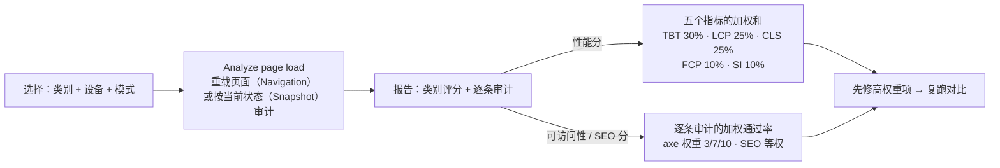

import { Canvas, Controls, Meta } from '@storybook/addon-docs/blocks';
import * as Stories from './lighthouse.stories';

<Meta of={Stories} name="Docs" />

# Lighthouse 审计

前面的课程大多在教你「针对一件事深入看一个面板」；这一课换成「一键把页面的整体质量清单拉出来」。Lighthouse（灯塔）是 Chrome 内置的开源自动化质量审计工具，DevTools 的 Lighthouse 面板对当前页面跑一组自动化检查，产出 Performance（性能）、Accessibility（可访问性）、Best Practices（最佳实践）与 SEO（搜索引擎优化）四个类别的评分和逐条建议。本课的核心判断只有一句：**报告的分数不是黑盒——性能分是五个指标的加权和，可访问性与 SEO 分是逐条审计的加权通过率——先读构成、先修高权重项，比追某一次的分数有用得多**。边界也先画清：深入的性能调试归 Performance 面板（官方文档现在的建议正是如此），Lighthouse 的强项在可访问性、最佳实践与 SEO 这类「逐条可核对」的清单。

| 项 | 默认 / 取值 | 回查要点 |
| --- | --- | --- |
| 打开方式 | More options（⋮）→ More tools → Lighthouse | 点 Analyze page load 后约 30–60 秒出报告 |
| 类别 | Performance / Accessibility / Best Practices / SEO 四类可选 | 只勾需要的类别更快 |
| 模式 | Navigation（默认）/ Timespan / Snapshot | 见「三种模式」 |
| 设备 | Mobile / Desktop | 可选设备与类别，是与 PageSpeed Insights 的差异 |
| 评分色带 | 0–49 红（差）/ 50–89 橙（需改进）/ 90–100 绿（良好） | 90+ 视为良好 |
| 性能分构成 | TBT 30% · LCP 25% · CLS 25% · FCP 10% · SI 10%（Lighthouse 10） | 只有指标计入分数 |
| 可访问性分构成 | 逐条审计按 3 / 7 / 10 权重（基于 axe 影响评估） | 二元通过，人工审计不计分 |
| 其他运行方式 | CLI / PageSpeed Insights / Node 模块 / Lighthouse CI | 见「其他运行方式」 |

演示页是一个自带典型问题的「可审计标本」：低对比度文本、缺 alt 的图片、没有可访问名称的图标按钮、跳跃的标题层级和一个节点密集的局部。页面内的 mini 检查器会真实计算这些可本地复现的读数——按 WCAG（Web 内容无障碍指南）的对比度公式逐元素计算、逐项计数。读者对整个 Storybook 标签页跑一次 Lighthouse，再把报告条目与 readout 对照。审计对象是整个标签页而不是页面里的某个元素，报告会混入 Storybook 界面自身的条目——按审计条目对照，不必对齐总分。

## 快速上手

<Canvas of={Stories.Specimen} />
<Controls of={Stories.Specimen} />

| 读者操作 | 可观察证据 |
| --- | --- |
| 保持「问题密度」为「集中」（默认） | readout 列出真实计数：对比度不足 2 处、最低约 1.5:1、图片缺 alt 2 处、按钮缺名称 1 处、标题跳跃 1 处、DOM 节点约 190 个、问题合计 6 项 |
| 切到「少量」 | 计数同步下降：对比度不足 1 处、最低约 2.6:1、缺 alt 1 处，缺名称与标题跳跃归零，DOM 节点约 20 个、合计 2 项 |
| 打开 Show code | 看到该 Canvas 实际执行的 `audit-specimen.ts`——mini 检查器按 WCAG 公式逐元素计算对比度并逐项计数 |

最小闭环——把「跑审计 → 对照 readout → 换状态复跑」走一遍：

1. 记下 readout 在「集中」下的计数。
2. 打开 DevTools → More options（⋮）→ **More tools → Lighthouse**；类别只勾 **Accessibility**（更快更聚焦），设备 Mobile 或 Desktop 均可，模式保持 **Navigation**（默认）。
3. 点 **Analyze page load**，等 30–60 秒出报告。
4. 在 Accessibility 类别里展开 color-contrast、button-name、image-alt 条目，把列出的元素与 readout 计数对照：标本埋的低对比度文本、缺 alt 图片与无名按钮都应出现在报告里；报告同时含 Storybook 界面自身的条目，按条目对、不对总分。
5. Controls 把「问题密度」切到「少量」→ 模式换成 **Snapshot**（快照模式：按当前状态审计、不重载，密度设置得以保留）→ 再跑一次，标本相关条目应当减少。

两个操作方式上的说明。其一，Navigation 模式会重载整页，Storybook 参数随之回到默认的「集中」——所以默认流程里报告与 readout 恰好一致；想让报告与你刚调的密度一致，就用 Snapshot 模式，或者先复跑再对照。其二，重载后 Lighthouse 要等页面加载完成才开始审计，开发服务器首屏较慢时报告可能漏掉尚未渲染的标本条目——等页面完全渲染后用 Snapshot 复跑即可。

## 运行审计

面板上的选择不多，每一个都直接改变报告的形状：类别决定审什么，设备决定按哪套环境模拟，模式决定审计哪种页面状态。**Settings**（设置）按钮展开高级项：**Clear storage**（清除存储）清空站点存储以模拟首访；**Enable JS sampling** 增加采样数据，后续打开 Performance 轨迹时更细；**Throttling** 下拉在 Lighthouse 模拟节流（更快，但数字按比例缩放）与 DevTools 节流（Performance 面板里的轨迹读数与 Lighthouse 一致）之间切换。报告跑完后，三点菜单提供 Print / Copy / Save，可以把报告在 DevTools 之外的独立查看器打开、切 Dark mode，或用 **View Trace** 把性能审计的轨迹打开在 Performance 面板——Lighthouse 的性能审计与 Performance 面板共用同一套轨迹引擎，轨迹怎么读见[录制与分析轨迹](?path=/docs/performance-traces--docs)。

### 三种模式

| 模式 | 审计对象 | 适合 |
| --- | --- | --- |
| Navigation（导航，默认） | 重新加载页面，审一次完整导航 | 首屏加载质量，对标真实用户的「打开页面」 |
| Timespan（时间段） | 点开始后的一段时间，可不含导航 | 交互过程中的表现 |
| Snapshot（快照） | 当前状态，不重载页面 | 调好状态后的即时审计——演示页换密度后用它 |

三种模式都可以用 Puppeteer 脚本化，DevTools 的价值在于不写脚本就能选好场景。与演示页直接相关的判断只有一条：**Navigation 重载页面，Snapshot 保留当前状态**——前者审「页面加载成什么样」，后者审「我把状态调好之后的这个状态」。

### 结果公平性

分数受本机状态影响：设备负载、已装扩展、已有的 cookies 与存储都会写进结果。官方建议在无痕窗口里跑（也不完全免疫）；不同机器跑出的分数不能直接比较；要稳定可比的数字，用 PageSpeed Insights 或独立服务器上的 CI。本机单次分数适合定位问题，不适合排名；深挖性能轨迹则回到 Performance 面板。

## 读懂评分

三类分数共用同一个解读框架：**分数 = 固定权重的加权构成**。先看构成，再按权重排修复顺序——高权重项的修复对分数影响最大；只看分数本身，既不知道该修什么，也不知道为什么变。色带先把住：0–49 红（差）、50–89 橙（需改进）、90–100 绿（良好）。

### 性能分：五个指标的加权和

Lighthouse 10 的性能分只由五个指标加权而成：

| 指标 | 权重 | 含义 |
| --- | --- | --- |
| TBT（Total Blocking Time，总阻塞时间） | 30% | 主线程被长任务阻塞的总量 |
| LCP（Largest Contentful Paint，最大内容绘制） | 25% | 主内容渲染完成的时刻 |
| CLS（Cumulative Layout Shift，累积布局偏移） | 25% | 页面生命周期内的布局稳定性 |
| FCP（First Contentful Paint，首次内容绘制） | 10% | 首个内容出现的时刻 |
| SI（Speed Index，速度指数） | 10% | 内容填充视觉进度的快慢 |

三条边界值得记住。**只有指标计入分数**：报告里的 Opportunities（改进机会）与 Diagnostics（诊断）不直接计入，但按它们修常常能改善指标。原始指标值按对数正态分布归一到 0–100，分布来自 HTTP Archive 的真实数据（第 25 百分位约等于 50 分，第 8 百分位约等于 90 分），所以 100 分极难——官方给的参照是 99 分到 100 分需要的指标提升，约等于 90 分到 94 分。TTI、FMP 等**退役指标**不再计入（指标体系见[性能指标](?path=/docs/performance-metrics--docs)）。

还有一条与手册本身相关的边界：本页是本地静态文档页，性能分反映的是 Storybook 文档应用（节点多、开发模式资源），不代表你的真实项目——性能分数请拿真实项目跑，或用 PageSpeed Insights / CI 取稳定数字；本课的演示对照聚焦 Accessibility 类别。

### 可访问性分：逐条审计的加权通过率

可访问性审计与性能审计的计分方式根本不同：**每条审计只有通过与不通过，没有部分得分**——页面上只有一半按钮有可访问名称，button-name 这条按 0 分计。类别分是全部计分审计的加权平均，权重来自 axe（axe-core，Deque 的开源无障碍规则引擎）的影响评估，分三档：

| 权重 | 代表审计 |
| --- | --- |
| 10 | button-name、image-alt、label、aria-roles、meta-viewport 等结构性硬伤 |
| 7 | color-contrast、document-title、html-has-lang、link-name、tabindex 等 |
| 3 | heading-order、landmark-one-main、skip-link 等低影响项 |

人工审计（焦点顺序、键盘可用性这类自动化测不了的项目）不计入分数，需要人工核对。对照演示页：标本埋的问题里，button-name 与 image-alt 是权重 10 的审计，color-contrast 是 7，heading-order 是 3——同一份标本，修复的收益排序一目了然，这就是「先读构成再修」的直接含义。逐元素的检查（无障碍树、ARIA 属性、对比度取色）在 Elements 面板里做，见[可访问性调试](?path=/docs/accessibility--docs)。

### SEO 分：等权的逐条审计

SEO 类别检查的是单页基础 SEO，不是关键词与外链这类整站优化。审计分三组，各条等权计入分数（人工检查除外）：

- 帮助搜索引擎理解内容：meta-description、link-text（链接描述文本）、hreflang、rel=canonical；
- 帮助搜索引擎抓取与索引：HTTP 状态码、robots.txt 有效性、是否还在使用过时插件；
- 移动友好：tap targets（点按目标尺寸合适）。

人工检查只有一条——结构化数据有效性——不计入分数。

## 其他运行方式

DevTools 面板之外还有三条官方路线与一个 CI 场景，输入都是同一个 Lighthouse，差别在运行环境：

| 方式 | 怎么跑 | 适合 |
| --- | --- | --- |
| DevTools（本课） | 面板里选类别、设备、模式 | 本地页面与登录态页面——这是官方不建议用扩展版 Lighthouse 的原因：扩展做不到这两点 |
| CLI | `npm install -g lighthouse` 后 `lighthouse <url>` | `--output json --output-path ./report.json` 导出 JSON，交给查看器或脚本 |
| PageSpeed Insights | pagespeed.web.dev 输入 URL | 远端受控环境，数字稳定可比 |
| Node 模块 | 编程调用 | 自定义集成与批量审计 |
| Lighthouse CI | 官方 CI 工具 | 在持续集成里防回归 |

CLI 与 Node 两种方式都要求本机装有 Chrome。

## 最佳实践

- **按构成排修复优先级。** 性能先动 TBT、LCP、CLS（30% / 25% / 25%）；可访问性先清权重 10 的审计（button-name、image-alt、label）；Opportunities 与 Diagnostics 不直接计分，但常是指标修复的入口。
- **只勾需要的类别。** 单类别审计更快也更聚焦；深入的性能调试走 Performance 面板（官方现在的建议），Lighthouse 的强项在 Accessibility、Best Practices、SEO。
- **用模式匹配你要审计的状态。** 首屏加载用 Navigation；交互过程用 Timespan；调好的当前状态用 Snapshot——演示页换密度后，只有 Snapshot 能审到切换后的状态。
- **可比的数字不在本机。** 跨机器、跨时间的对比用 PageSpeed Insights 或 CI 上的固定环境；本机分数用于定位，不用于排名。
- **别追 100。** 99 分到 100 分需要的指标提升约等于 90 分到 94 分；90+ 已是绿色区间，把精力放在下一个高权重项。

## 常见问题

- 同一页面每次跑分都不一样。
  结果受本机负载、扩展与已有存储影响：用无痕窗口并在 Settings 里 Clear storage，看多次结果的构成而不是记单次分数；要稳定数字用 PageSpeed Insights 或 CI。
- 本机 DevTools 的分数和 PageSpeed Insights 对不上。
  正常：PSI 在远端服务器上以受控环境运行，本机结果随你的设备、扩展与网络变化。PSI 的数字适合对外报告，本机结果适合定位问题。
- 跑完 Navigation 模式，演示页的密度被复位，readout 与报告对不上。
  Navigation 会重载整页，Storybook 参数回到默认的「集中」。先复跑再对照，或改用 Snapshot 模式按当前状态审计。
- 本地 localhost 或需要登录的页面能审计吗？
  能。DevTools 面板支持本地页面与登录态页面——这正是官方建议用 DevTools 而不是 Chrome 扩展版 Lighthouse 的原因，扩展不支持这两类页面。
- 报告里出现一堆与我代码无关的条目。
  审计对象是整个标签页，框架与文档界面的元素一样会被审。按审计条目（如 color-contrast）展开定位元素，与你自己的清单逐条对照，不必对齐类别总分。

## 总结回顾

摘要：

Lighthouse 是 DevTools 内置的一键质量审计：选类别（Performance / Accessibility / Best Practices / SEO）、设备（Mobile / Desktop）与模式（Navigation / Timespan / Snapshot），点 Analyze page load，约 30–60 秒得到一份「类别评分 + 逐条审计」的报告。三类分数的构成不同：性能分只由五个指标加权而成（Lighthouse 10：TBT 30%、LCP 25%、CLS 25%、FCP 10%、SI 10%），Opportunities 与 Diagnostics 不计入；可访问性分是逐条二元审计的加权通过率，权重按 axe 影响评估分 3 / 7 / 10，人工审计不计分；SEO 分对逐条审计等权（人工的结构化数据检查除外）。结果受本机负载、扩展与存储影响，跨机器比较要靠 PageSpeed Insights 或 CI。演示页把可本地真实计算的问题（对比度、alt、可访问名称、标题层级、DOM 节点）做成 readout，与整页报告的条目对照——分数是构成，条目才是行动清单。

一句话：

> 解读 Lighthouse 先读构成再读分数：性能分是五个指标的加权和，可访问性与 SEO 分是逐条审计的加权通过率——先修高权重项，复跑对比，不追单次分数。

知识要点：

- Lighthouse 面板提供哪四个类别、哪三种模式？三种模式各审计什么？
- 为什么换密度后要用 Snapshot 模式才能审到切换后的状态？
- 性能分由哪些指标构成、各占多少权重？报告中哪些内容不计入分数？
- 指标原始值怎样变成 0–100 分？为什么 100 分极难？
- 可访问性分的权重分哪三档？button-name、color-contrast、heading-order 各在哪一档？
- 可访问性审计为什么没有「部分得分」？
- SEO 分怎么计？哪条检查不计入？
- 分数色带怎么划分？为什么本机分数不能跨机器比较？
- 演示页的 mini 检查器真实计算了哪些内容？与报告对照的正确做法是什么？

## 参考资料

- [Run Lighthouse in Chrome DevTools](https://developer.chrome.com/docs/devtools/lighthouse)
- [Lighthouse overview](https://developer.chrome.com/docs/lighthouse/overview)
- [Performance scoring](https://developer.chrome.com/docs/lighthouse/performance/performance-scoring)
- [Accessibility scoring](https://developer.chrome.com/docs/lighthouse/accessibility/scoring)
- [SEO audits](https://developer.chrome.com/docs/lighthouse/seo)
- [GoogleChrome/lighthouse](https://github.com/GoogleChrome/lighthouse)
