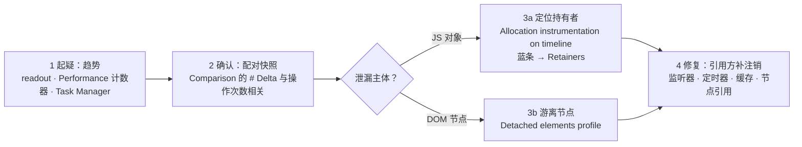

import { Canvas, Controls, Meta } from '@storybook/addon-docs/blocks';
import * as Stories from './memory-leaks.stories';

<Meta of={Stories} name="Docs" />

# 定位内存泄漏

内存上涨不一定是泄漏——GC 还没运行、缓存正常增长、框架反复渲染都会让曲线抬升。泄漏的定义是「只涨不跌」：反复执行同一操作、垃圾回收多次发生之后，内存仍随每次操作阶梯上涨。本课给一条从怀疑到修复的完整链路：先靠计数器与趋势起疑，再用配对快照的 Comparison 证明净增长与操作次数相关，然后用 Allocation instrumentation on timeline（时间线分配记录）把「录完还活着」的分配连到 Retainers（保留者链）里的持有者，用 Detached elements（游离元素）profile 专查「已脱离文档、仍被 JS 引用」的 DOM 节点，最后把监听器、定时器、缓存、游离节点四种常见泄漏模式对号入座。快照三视图的列读法在[内存快照](?path=/docs/memory-snapshots--docs)已经讲清，本课只引用不重复。

先建立判断模型：泄漏的本质是「该注销的资源没有注销」——对象其实已经用完，但某条引用链仍把它拽在可达集合里。所以排查只有两个问题：「真的只涨不跌吗」（趋势与 Delta），「谁在拽着它」（Retainers）。修复永远是改引用方——移除监听器、清理定时器、给缓存设上限、释放节点引用——而不是想办法「删掉对象」。

本课演示页是「泄漏对照」标本：同一个「收到一条消息」的操作提供泄漏 / 修复两种实现——泄漏实现每次操作都新增一个不再移除的事件监听器、新开一个不清的 interval、往缓存数组只进不出地推消息，并把被挤出 feed 的卡片留在数组里（从此 detached 但可达）；修复实现完成同样的功能，但每张「登记表」都随手注销。预测：保持泄漏模式，每点一次「执行一次操作」，readout 四项计数各涨一截；切到修复模式，同样的操作只会让计数在常数附近波动。



四种常见泄漏模式速查（回查入口）：

| 模式 | 典型来源 | 堆里的签名 | 修复要点 |
| --- | --- | --- | --- |
| 遗忘的事件监听器 | 重复注册、卸载不反注册 | `system / Context` 闭包组随操作上涨 | 成对注册与移除；一次性用 `{ once: true }` |
| 失控的定时器 | 每次操作开 `setInterval` 不清 | 闭包链留住大对象；周期性小分配不断 | 保存 id 并 `clearInterval`；单次用 `setTimeout` |
| 无限增长的缓存 | 模块级数组 / Map 只进不出 | 业务类 # Delta 持续为正 | 设上限并淘汰；弱索引用 `WeakMap` |
| 游离的 DOM 节点 | 节点 `remove()` 后 JS 仍持有 | Class filter 搜 `Detached` 有存量 | 移除后不留引用；复用走有淘汰的池 |

## 快速上手

Controls 提供两个输入：「实现模式」切换泄漏 / 修复两种实现，「每条消息的负载条数」决定单条消息的体积（点操作时生效）；页内按钮「执行一次操作」模拟收到一条消息，「清理已积累」把已登记的资源一次性注销——这是修复已发生泄漏的动作。readout 五项都是页面真实测量：累计操作、window 上的监听器数、存活 interval 数、缓存数组长度、detached 节点数（本标本创建、已不在文档、仍被引用的节点）。本页状态挂在 `window.leakSpecimen`，Console 里随时可核对。

<Canvas of={Stories.Specimen} />
<Controls of={Stories.Specimen} />

最小闭环：

1. 保持「泄漏模式」，点「执行一次操作」约 10 次：监听器、interval、缓存、detached 四项计数随操作阶梯上涨——这就是趋势观察。
2. 按 `Command+Option+J`（macOS）或 `Control+Shift+J`（Windows、Linux）打开 DevTools，切到 Memory 面板，选 **Heap snapshot** 点 **Take snapshot** 拍基线；再点 5 次「执行一次操作」拍第二张，视图切到 **Comparison**：`MessageEnvelope` 与 `Detached <div>` 的 # New / # Delta 大约等于两次快照之间的操作次数，(string) 组的增量约是操作次数 × 负载条数。
3. 点「清理已积累」重置状态，切「修复模式」，重复同样的「拍基线 → 操作 → 再拍」：Delta 停在缓存上限附近并出现回收（# Deleted / Freed size），detached 恒为 0。
4. 回「泄漏模式」再攒一批，点「清理已积累」：四项计数回落到基线。

| 读者操作 | 可观察证据 |
| --- | --- |
| 泄漏模式连点「执行一次操作」 | 四项计数阶梯上涨；detached 节点从第 4 次操作开始出现——feed 只保留最近 3 张卡片 |
| 修复模式重复同样操作 | 监听器恒为 1（共享处理器）、interval 恒为 0、缓存不超过 8、detached 恒为 0 |
| 切「实现模式」 | settings 行同步切换；切换只影响后续操作，已积累的泄漏保持不变 |
| 点「清理已积累」 | 四项计数回落；再执行 `getEventListeners(window)` 看不到本标本的 `specimen:sync` 监听器 |
| 打开 Show code | 看到该 Canvas 实际执行的 `leak-specimen.ts` |

Console 交叉核对：`leakSpecimen.cache.length` 应等于 readout 的缓存数组长度；`getEventListeners(window)`（Command Line API，仅 Console 可用，见[与页面交互](?path=/docs/command-line-api--docs)）应列出泄漏模式注册的 `specimen:sync` 监听器。

## 观察趋势

排查从「建立可疑」开始：找到会随时间增长的计数器，反复执行被测操作，确认「只涨不跌」而不是「涨了」。三处入口，由轻到重：

- **本页 readout。** 五项计数各对应一张「登记表」，是最直观的趋势——标本已经把泄漏实现写好，趋势立等可取。
- **Performance 面板录制。** 勾选 Memory（内存）后录制，Overview 里出现 HEAP 曲线，Counter 窗格拆出 JS heap、Documents、DOM Nodes、Listeners、GPU memory 五条计数——DOM Nodes 或 Listeners 随操作阶梯上涨，是游离节点或监听器泄漏的直观信号。官方建议录制首尾各点一次 Collect garbage（强制垃圾回收，扫帚图标），末尾仍高于开头才可疑。录制与火焰图读法见[录制与分析轨迹](?path=/docs/performance-traces--docs)。
- **Chrome Task Manager（`Shift+Esc`）。** 按 Memory footprint（内存占用）排序，JavaScript 一列有两个值，括号里的数字是「实际存活」的 JS 内存——只涨不跌比锯齿波动更可疑。

边界：上涨不等于泄漏。GC 是异步的，刚释放的对象可能还在堆里；缓存、复用池的正常增长也会推高曲线。可疑的形状是「操作后不回落 + 随操作阶梯上涨」——确认它，靠下一步的配对快照。

## 配对快照确认

配对快照把「净增长」量化成数字，是证明泄漏的标准动作：拍基线快照 → 只重复被测操作 N 次 → 拍第二张 → 视图切到 Comparison。Summary、Comparison 各列的读法[内存快照](?path=/docs/memory-snapshots--docs)已讲全，本课的关键是**操作相关性**：# Delta 应约等于「每次操作新增的对象数 × N」——换一个 N 再来一组，Delta 跟着等比变化，才能排除偶发波动。

三个比较细节（上一课最佳实践的引用）：

- 比较前点 Collect garbage、清空 Console、移除断点，否则 Delta 混入这些持有者的贡献。
- Class filter 先收窄到业务类（本页搜 `Message`）。
- 游离 DOM 直接搜：Class filter 输入 `Detached`，游离的 DOM 树以 `Detached <div>` 这类条目出现——这是官方总览推荐的经典入口；点开实例读 Retainers，链的顶端就是持有者。

标本落点：泄漏模式的配对快照里，`MessageEnvelope` 的 # Delta 等于操作次数，(string) 组同步上涨（每条消息的负载字符串），`Detached <div>` 组从第 4 次操作起出现；监听器与 interval 的闭包还让 `system / Context`（上一课讲过的引擎条目）阶梯上涨。修复模式下信封数停在 8 以内、旧信封被 GC（出现 # Deleted 与 Freed size），detached 组不增长。

## Allocation instrumentation on timeline

配对快照回答「多了多少」，Allocation instrumentation on timeline 回答「哪次分配活了下来、被谁持有」。它把堆快照的细节与时间线的增量追踪结合：录制期间周期性拍快照（最快约 50 ms 一次），结束时再拍一张；对象行 `@` 后面的数字是跨快照稳定的对象 ID。**蓝条**表示录完时仍存活的对象——正是泄漏候选；**灰条**表示录制期间分配、随后已被回收。

操作路径：

1. Memory 面板选 **Allocation instrumentation on timeline**，点 **Start**。
2. 只执行被测操作（本页点若干次「执行一次操作」），点 **Stop**。
3. 在时间线上拖选一段，Constructor pane 只显示该时段的分配。
4. 过滤 `MessageEnvelope`，点构造器展开实例，Retainers pane 给出「为什么没被回收」的链。

判断：蓝条随每次操作稳定增长，候选确认；Retainers 链的顶端（谁在拽着对象）就是修复点——本页会看到 `leakSpecimen` → `cache` → 信封，或经监听器 / interval 的闭包到达。

标本落点：泄漏模式下每点一次操作出现一条蓝条，且这批条目从不转灰；修复模式录制的同批操作大多转为灰条——分配很快被回收，这正是「随手注销」在分配图上的样子。

边界：页面（尤其框架与 Storybook 应用）自身在不断分配，时间线会满屏噪声——用小录制窗口（只包被测操作）加类过滤收窄；蓝灰交替本身是正常 GC，要看的是「同类的蓝条是否随操作单调累积」。

## Allocation sampling

Allocation sampling（分配采样）按调用栈聚合「谁在分配」，开销小，适合长时间观察或高频操作；它不回答「分配后谁还活着」——那是 timeline 的职责。典型分工：先用 sampling 找到分配热点函数，再用 timeline 确认这些分配是否存活。

操作路径：Memory 面板选 **Allocation sampling** → 点 **Start** → 执行操作 → 点 **Stop**。默认 **Heavy (Bottom Up)**（自底向上）视图，分配最多的函数排在顶部；页面有 iframe 或 worker 时，先在 **JavaScript VM instance** 下拉里选对目标——四种 profile 类型都按这个选择器分别记录。

标本落点：泄漏模式录一段，顶部会聚集到标本的操作函数与 `MessageEnvelope` 的分配点；修复模式同样的操作，分配量明显收敛。

## Detached elements

Detached elements（游离元素）是 Memory 面板的第 4 种 profile 类型（Chrome 110 起内置；早期以独立的 Detached Elements 工具面板形式提供，现已并入 Memory——网上旧教程里带 Collect garbage、Analyze 按钮的独立面板对应的就是这个单选项）。它专列「已脱离文档、仍被 JS 引用」的 DOM 节点：选 **Detached elements** 单选项 → 点 **Start** → 生成的 profile 在 **Detached nodes** 列出游离节点，可以像 Elements 树一样展开看子节点。

判断：**detached 不等于泄漏**。官方示例聊天室在切换房间时会把消息元素脱离文档、保留引用，以便切回时恢复——这是刻意的复用；feed 虚拟滚动同理。按泄漏处理的判断标准有两条：数量随操作只涨不跌；持有者不是预期的复用方。数量会回落、或引用链指向复用池的，不按泄漏处理。

找持有者：profile 只列出节点；要找「谁拽着它」，拍一张 Heap snapshot，Class filter 搜 `Detached`，点实例读 Retainers——链的顶端就是该释放引用的代码。更轻的趋势交叉验证：更多工具（More tools）→ Performance monitor（性能监视器），盯 DOM Nodes 计数器。

标本落点：泄漏模式攒下的卡片全部出现在 profile 里，数量随操作只涨不跌；修复模式为 0。游离卡片的持有链是 `leakSpecimen` → `detachedNodes` 数组 → 卡片。

## 泄漏模式与修复

四种常见泄漏模式共享同一个形状：「资源登记了，没注销」。监听器、定时器、缓存、节点引用各是一张登记表；堆里能看到增长（趋势、Delta、蓝条），Retainers 或 Detached elements 能找到持有者，修复统一是「给引用方补注销」。下面按模式对号入座——堆里的签名帮你在排查时认出模式，修复要点直接可抄。

### 遗忘的事件监听器

堆里的签名：`system / Context` 闭包组随操作上涨；`getEventListeners(window)` 里同名监听器越积越多。

修复要点：注册与移除成对出现（组件卸载、对象销毁时反注册）；只需要触发一次的监听器用 `{ once: true }`；同一组监听器交给一个 AbortController，销毁时批量撤销。

```ts
const controller = new AbortController();
element.addEventListener('click', onClick, { signal: controller.signal });
window.addEventListener('resize', onResize, { signal: controller.signal });
// 销毁时一行撤销全部：
controller.abort();
```

### 失控的定时器

堆里的签名：interval 回调的闭包把整条引用链留住；Allocation timeline 里周期性的小分配不断线。

修复要点：`setInterval` / `setTimeout` 返回的 id 必须保存，在适当时机 `clearInterval` / `clearTimeout`；单次任务用 `setTimeout`（跑完自动结束）；组件卸载时清掉自己开过的全部 timer。

```ts
const timer = window.setInterval(poll, 4000);
window.clearInterval(timer); // 不再需要轮询时
```

### 无限增长的缓存

堆里的签名：业务类的 # Delta 持续为正；(string)、(array) 等引擎条目同步膨胀。

修复要点：给缓存设上限并淘汰（FIFO / LRU）；只想做「弱索引」、不阻止键被回收时用 `WeakMap` / `WeakRef`，键不可达后条目自动消失。

```ts
const MAX = 8;
cache.push(envelope);
while (cache.length > MAX) {
  cache.shift(); // 淘汰最旧的；被淘汰者失去引用，交给 GC
}
```

### 游离的 DOM 节点

堆里的签名：Class filter 搜 `Detached` 有存量；Detached elements profile 数量随操作上涨。

修复要点：`remove()` 之后不留任何 JS 引用；确实要复用（虚拟列表、切页保活）就放进有淘汰机制的池；框架组件要正确卸载——React 组件不卸载时，泄漏的可能是大片虚拟 DOM。

```ts
card.remove();
detachedNodes.push(card); // 泄漏：文档外仍持有引用
// 修复：remove() 之后什么都不留，节点交给 GC
```

## 最佳实践

- **录制窗口只包被测操作。** timeline 与快照都会把页面自身的分配计入——Start 与 Stop 之间只放被测操作，配对快照之间不混入无关交互。
- **用操作相关性说话。** N 次操作应产生约 N 条蓝条、约 N 个 # Delta；换一个 N 重复仍等比，才能排除偶发——单次观察不下泄漏结论。
- **修引用方，不删对象。** JS 没有手动 free；Retainers 链顶端的持有者（全局变量、闭包、数组、定时器）才是改动点，改完对象自然可回收。
- **修复后同条件对照验证。** 同样的操作序列、同样的清理前置（Collect garbage、清 Console），修复前后各一组配对快照或 readout 趋势对比。

## 常见问题

- Allocation timeline 满屏蓝条灰条，搜不到业务对象。
  先缩小录制窗口只包被测操作，再用 Constructor pane 顶部的类过滤框输入类名（本页 `MessageEnvelope`）；蓝灰交替是正常 GC，要关注的是同类蓝条是否随操作单调累积。
- Detached elements 列出节点，但代码「看起来没有 bug」。
  detached 不等于泄漏：切页保活、虚拟滚动、复用池都会先拆后挂；只有「数量只涨不跌 + 持有者不是预期复用方」才按泄漏处理，用 Retainers 链确认持有者身份。
- Memory 面板里找不到本页的类，读数对不上。
  页面有 iframe 或 worker 时，先在面板顶部的 **JavaScript VM instance** 下拉里选对上下文——快照、两种 allocation 记录、Detached elements 都按该实例分别记录。
- Console 之外执行 `getEventListeners` 报 not defined。
  它是 Console 专用的 Command Line API（见[与页面交互](?path=/docs/command-line-api--docs)），页面脚本里不可用；页面内统计监听器需要自己维护注册表——本页 readout 的「window 上的监听器」就是这样做出的。

## 总结回顾

摘要：

排查泄漏的链路是「起疑 → 确认 → 定位 → 修复」：趋势（readout、Performance 的 HEAP 曲线与计数器、Task Manager 的存活内存）建立「只涨不跌」的怀疑；配对快照用 Comparison 的 # Delta 把净增长量化，并靠换 N 重测验证操作相关性；Allocation instrumentation on timeline 用蓝条（录完仍存活）连到 Retainers 里的持有者，Allocation sampling 按调用栈回答「谁在分配」；Detached elements 专查脱离文档仍被引用的 DOM 节点，且 detached 不等于泄漏——切页保活与虚拟滚动是刻意的先拆后挂。监听器、定时器、缓存、游离节点四种常见模式都是「登记了没注销」，修复永远是给引用方补注销。

一句话：

> 泄漏不是「内存涨了」，而是「只涨不跌」；先证明增长与操作相关，再顺 Retainers 找持有者，修复永远是改引用方而不是删对象。

知识要点：

- 「上涨」和「泄漏」怎么区分？哪三处入口能观察趋势？
- 配对快照怎么证明泄漏？为什么换一个 N 再测一遍？
- Allocation instrumentation on timeline 里蓝条、灰条各代表什么？对象行 `@` 后面的数字是什么？
- Allocation sampling 与 timeline 的分工是什么？Heavy (Bottom Up) 视图怎么读？
- Detached elements 怎么用？「detached 不等于泄漏」的判断标准是哪两条？
- 四种常见泄漏模式在堆里各有什么签名？各自的修复要点是什么？

## 参考资料

- [Fix memory problems（内存问题排查总览）](https://developer.chrome.com/docs/devtools/memory-problems)
- [Memory panel overview（Memory 面板概览）](https://developer.chrome.com/docs/devtools/memory)
- [How to use the Allocation Timeline tool（分配时间线工具）](https://developer.chrome.com/docs/devtools/memory-problems/allocation-profiler)
- [Debug DOM memory leaks（Detached elements profile 与 detached ≠ 泄漏边界，Chromium 与 Edge 共享工具的官方说明）](https://learn.microsoft.com/en-us/microsoft-edge/devtools/memory-problems/dom-leaks-memory-tool-detached-elements)
