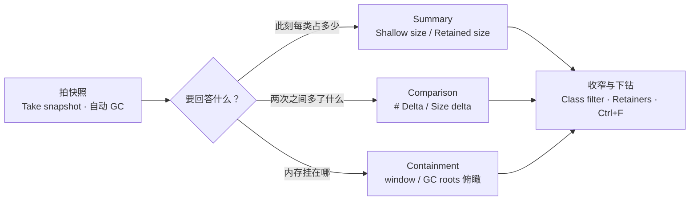

import { Canvas, Controls, Meta } from '@storybook/addon-docs/blocks';
import * as Stories from './memory-snapshots.stories';

<Meta of={Stories} name="Docs" />

# 内存快照

页面的内存到底花在哪？Memory（内存）面板的 Heap snapshot（堆快照）把某一刻的 JS 堆拍成一张对象清单：每个类有多少实例、各占多少字节、被谁引用。本课只做两件事——拍快照，以及读懂它的三个视图：Summary（按类盘点）、Comparison（跨快照对比）、Containment（从根俯瞰）；如何据此判定泄漏模式、走完整排查链路，是[定位内存泄漏](?path=/docs/memory-leaks--docs)的内容，本课不展开。

先建立模型：快照是一张堆图（heap graph）——节点是对象、边是引用，只包含「从全局对象可达」的部分。所以 Console 里随手保存的变量、断点停住的帧里的对象也算可达，会出现在快照里。每拍一张快照，DevTools 都会先做一次垃圾回收（GC，garbage collection）：快照反映的是清理过后的「真实存活」。

本课演示页是一个「对象分配」标本：Controls 调整每次分配的对象数量、字段数与字符串数组长度，点「分配」往页面堆里放一批真实对象，点「释放」清空引用。预测一下：分配后拍快照，Summary 里搜 `Snapshot` 能找到按类分组的新对象；释放后重拍，Comparison 里会出现删除计数与释放的字节。

视图与操作速查（回查入口）：

| 视图 / 操作 | 回答的问题 | 关键列与入口 |
| --- | --- | --- |
| Summary | 此刻每类对象多少个、占多少 | Constructor、Distance、Shallow size、Retained size |
| Comparison | 两次快照之间多了什么、少了什么 | # New、# Deleted、# Delta、Alloc. size、Freed size、Size delta |
| Containment | 内存从 GC roots 往下挂在哪 | window / GC roots / 原生对象三类入口 |
| Statistics | 堆的构成占比 | code、strings、JS arrays、typed arrays、system objects 饼图 |
| Take snapshot（`Command+E`） | 拍快照 | Memory 面板 → Heap snapshot；每次拍摄自动先 GC |
| Collect garbage（扫帚图标） | 手动强制 GC | 比较快照前的清理动作，见最佳实践 |

## 快速上手

演示页的三个滑块——对象数量、字段数、字符串数组长度——决定下一批分配的形态；「分配」往堆里放一批 `SnapshotSpecimen`，「释放」清空全部引用。存活对象数是页面里数出来的真实值，估算总占用由公式粗估，两者都给快照列读数做数量级参照。

<Canvas of={Stories.Specimen} />
<Controls of={Stories.Specimen} />

最小闭环：

1. 按 `Command+Option+J`（macOS）或 `Control+Shift+J`（Windows、Linux）打开 DevTools，用 Command Menu（`Command+Shift+P`）搜 Memory 选 **Show Memory**，或在顶部 More panels 里选 Memory，切到 Memory 面板。
2. 左侧 profile 类型选 **Heap snapshot**（页面带多个执行上下文时，先在旁边的下拉里选对 JavaScript VM instance），点 **Take snapshot**——第一张快照就是基线；选好类型后按 `Command+E` / `Control+E` 可连续快拍。
3. 在快照顶部的 Class filter（类过滤框）输入 `Snapshot`：Storybook 自身的对象也全在这张快照里，真实页面同理——先用类名收窄。
4. 展开 **SnapshotSpecimen**：每行是一个实例，`@` 后面的数字是实例 ID（`Ctrl+F`，macOS 为 `Command+F`，可按 ID 搜索）；读三列——Distance、Shallow size、Retained size。
5. 点一个实例：底部 **Retainers**（保留者）面板给出「谁在引用它」的链——本页是 `window.allocSpecimens` → 批次数组 → 对象。
6. 回演示页点「分配」，再拍一张快照并把视图切到 **Comparison**（与上一张对比）：`SnapshotSpecimen` 行的 # New 与 # Delta 应等于「对象数量」滑块的值，Alloc. size 与 readout 的估算总占用同量级。

| 读者操作 | 可观察证据 |
| --- | --- |
| 点「分配」 | readout 的存活对象数与估算总占用立刻上升；新快照 Summary 里 SnapshotSpecimen 行按滑块数量增加 |
| 点「释放」 | readout 存活对象数归零；再拍快照的 Comparison 里出现 # Deleted 与 Freed size，# Delta 转负 |
| 调大「字段数」后分配 | 新对象的 Shallow size 估算变大——payload 的数值字段内联在对象存储里 |
| 调大「字符串数组长度」后分配 | Retained size 与 Shallow size 的差距拉开——字符串数组挂在对象之下 |
| 打开 Show code | 看到该 Canvas 实际执行的 `alloc-specimen.ts` |

readout 的估算公式：每对象 ≈ 64（对象壳）+ 字段数 × 8（数值字段）+ 24（数组头）+ 数组长度 × (40 + 16 × 2)（每条字符串按双字节保守估算）。它只做数量级对照，不等于 V8 的真实布局；真实大小以快照的 Shallow size / Retained size 列为准。

## 快照视图

四个视图是同一份堆数据的不同投影，由快照顶部下拉切换；共同交互也一致：点列头排序、Class filter 收窄、`Ctrl+F` 按实例 ID 搜索、底部 Retainers 面板看引用链。内容边界：只含从全局可达的对象；数字这类非字符串原始值与 getter 取值不会作为独立条目出现，字符串则单独占堆、自成条目。

### Summary（按构造器分组）

默认视图：对象按 Constructor（构造器）分组，同名的再按「源文件：行号」细分，名字旁的数字是实例总数。回答「此刻每类对象多少个、占多少」。

三列读数：

| 列 | 含义与读法 |
| --- | --- |
| Distance | 从 window 到该对象最短保持路径上的引用（属性）数。同类对象 Distance 相同，个别明显更远的值得点开看 |
| Shallow size | 对象自身占用的内存。数组、字符串的 Shallow 通常最大；业务对象往往是「小壳」 |
| Retained size | 删掉它、使其依赖不可达后能释放的内存。Retained ≥ Shallow |

Retained size 不能按子孙相加理解：多个对象共享的依赖，只由它们的支配节点（dominator，所有到达路径的必经点）计入一次——所以 Retained size 才回答「删掉它真能省多少」。

操作：Class filter 搜构造器名；Constructor 列头按实例数或大小排序；最右侧下拉按分配时机过滤——**All objects**（全部对象）、**Objects allocated before Snapshot 1**（快照 1 之前分配的）、**Objects allocated between Snapshots 1 and 2**（两次快照之间分配的）、**Duplicated strings**（重复字符串）、**Objects retained by detached nodes**（被游离节点保留的）、**Objects retained by the DevTools console**（被 DevTools 控制台保留的）。

组名里的引擎条目不是业务对象，别当成可疑目标：

| 条目 | 是什么 |
| --- | --- |
| (string)、(concatenated string)、(sliced string) | 字符串及拼接、切片的内部形态 |
| (array)、(object shape) | 数组；对象形状（隐藏类）描述 |
| (compiled code) | V8 编译后的代码 |
| system / Context | 闭包变量——匿名函数的变量环境都挂在这里 |
| InternalNode、(system) | Blink/C++ 原生侧对象与系统对象 |

标本落点：`SnapshotSpecimen` 与 `SnapshotPayload` 两行——payload 是每个 specimen 的子对象，所以实例的 Retained size 大于 Shallow size；展开组、点实例，Retainers 面板自下而上给出 `allocSpecimens → 批次数组 → 对象` 的引用链，这正是 readout 数字在堆里的样子。

### Comparison（跨快照对比）

两张快照的差集，回答「这期间多了什么、少了什么」。工作流：拍基线快照 → 做被测操作（可重复几次）→ 再拍一张 → 把新快照的视图切到 Comparison（与上一张对比）。展开任一行能看到新增（added）与被回收（deleted）的实例。

六列含义：

| 列 | 含义 |
| --- | --- |
| # New | 新增实例数 |
| # Deleted | 被回收的实例数 |
| # Delta | 净变化：# New − # Deleted，正数即净增长 |
| Alloc. size | 新增实例占用的内存 |
| Freed size | 被回收实例释放的内存 |
| Size delta | 净内存变化：Alloc. size − Freed size |

标本落点：点「分配」后拍快照，SnapshotSpecimen 的 # New / # Delta 等于滑块数量，Alloc. size 与 readout 的估算总占用同量级；点「释放」后重拍，# Deleted 与 Freed size 出现，# Delta 转负。注意时序：释放后 readout 立即归零，那是「引用清空」；# Deleted 要等 GC 真正回收后才计入——拍快照会自动触发 GC，所以快照里能看到，而 readout 不会替你等它。

### Containment（从 GC roots 俯瞰）

自顶向下的堆结构树，回答「内存从根往下挂在哪」。三类入口：**window / DOMWindow**（每个 iframe 一个全局对象）、**GC roots**（原生代码持有的句柄，如 Handle scope、Global handles）、**原生对象**（native objects，DOM 节点等不在 JS 堆里、经 JS 包装器访问的对象）。

它最适合回答「谁把内存挂在了全局」：全局命名空间的引用、闭包变量（挂在 `system / Context` 条目下）从这里往下找；树很大时配合 Class filter 与搜索定位，不要逐层手翻。

标本落点：从 window 往下展开 `allocSpecimens → 批次数组 → SnapshotSpecimen → payload / tags`——Distance 逐层加一，与 Summary 里的读数对应；点「分配」加出来的整棵子树在这里一览无余。

### Statistics（占比饼图）

一张饼图列出 code（编译代码）、strings（字符串）、JS arrays、typed arrays、system objects 的相对占比。它不列对象、不回答「哪个类」，适合一眼判断堆的构成——字符串占比异常大、代码占比异常大这类方向性线索。

## 最佳实践

- **比较前先清理三件事。** 点工具栏的 Collect garbage（强制垃圾回收，扫帚图标）、清空 Console（保存的变量与 Live Expression（实时表达式）都在持有对象）、去掉断点。拍快照自身会先 GC，但清不掉这些持有者——先清理，# Delta 与 Size delta 才反映页面本身的行为。
- **用配对快照隔离变量。** 基线快照 → 只做被测操作（重复几次抵消偶发）→ 第二张快照，中间别混入无关操作；比两张随手拍的快照得出的 Delta 可信得多。
- **先收窄再细读。** Class filter 搜业务构造器名，按 Retained size 排序找大头；同类对象里 Distance 异常的先点开——它们多半被意外的长期持有者拉着。
- **给闭包与类命名。** 匿名函数的变量环境在快照里只剩 `system / Context`，具名的类与函数自带可搜索的 Constructor 名——官方也建议为闭包命名，方便日后辨认。
- **估算与快照各司其职。** readout 的估算只看数量级；确认「真的多了还是少了」以快照列为准（# Delta / Size delta），修复前后用同条件的配对快照对比。

## 常见问题

- 点了「释放」，Comparison 里 # Deleted 还是 0。
  先确认引用真的清空了：Console 里保存的变量、Live Expression、断点停住的帧都会把对象留在可达集合里——清空 Console、移除断点，点 Collect garbage 后重拍；快照自动 GC 只回收不可达对象，仍被持有的永远不会进 # Deleted。
- 快照里涨得最多的是 (string)、(array)、(compiled code)，看不出业务对象。
  这些是引擎与原生条目，反映页面总噪音而非泄漏嫌疑本身；用 Class filter 搜业务构造器名，对它读 # Delta / Size delta——异常增长落在自定义类上才值得进入排查。

## 总结回顾

摘要：

Heap snapshot 把某一刻「从全局可达」的 JS 堆拍成对象清单，每次拍摄自动先 GC。四个视图共享同一份堆数据：Summary 按 Constructor 分组，用 Distance、Shallow size（对象自身）、Retained size（删掉它能释放多少，共享依赖按支配节点计入一次）回答「每类占多少」；Comparison 给出两张快照的差集，# New / # Deleted / # Delta 管数量，Alloc. size / Freed size / Size delta 管字节；Containment 从 window、GC roots、原生对象三类入口自顶向下看内存挂在哪，闭包变量藏在 system / Context；Statistics 用饼图看堆构成。演示页把分配与释放做成可调标本：分配后 # New 等于滑块数量，释放并重拍后 # Deleted 与 Freed size 出现——引用清空立即反映在 readout，快照里的增删要等 GC；比较前先点 Collect garbage、清 Console、去断点，Delta 才反映页面本身的行为。

一句话：

> 快照回答「某刻堆里有什么、谁引用它」：Summary 盘点、Comparison 找差、Containment 看挂载——引用清空与内存回收并不同步，快照会替你 GC，却清不掉 Console 与断点的持有。

知识要点：

- 快照里有什么、没有什么？为什么 Console 里保存的变量会出现在快照里？
- Shallow size 与 Retained size 各是什么？为什么 Retained 不能按子孙相加？
- Comparison 六列各是什么？# Delta 与 Size delta 的正负怎么读？
- Containment 的三类入口是什么？闭包变量挂在哪个条目下？
- Distance 异常说明什么？(string)、(compiled code) 这类引擎条目该怎么对待？
- 释放对象后 readout 与快照为什么不同步？# Deleted 什么时候才出现？

## 参考资料

- [Memory panel overview（Memory 面板概览）](https://developer.chrome.com/docs/devtools/memory)
- [Record heap snapshots](https://developer.chrome.com/docs/devtools/memory-problems/heap-snapshots)
- [Memory terminology](https://developer.chrome.com/docs/devtools/memory-problems/memory-101)
- [Fix memory problems](https://developer.chrome.com/docs/devtools/memory-problems)
- [HeapSnapshotDataGrids.ts（Comparison 列标签的源码真源）](https://github.com/ChromeDevTools/devtools-frontend/blob/main/front_end/panels/profiler/HeapSnapshotDataGrids.ts)
