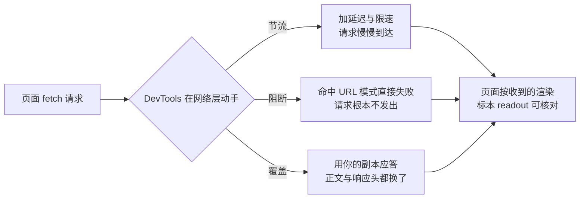

import { Canvas, Controls, Meta } from '@storybook/addon-docs/blocks';
import * as Stories from './network-overrides.stories';

<Meta of={Stories} name="Docs" />

# 控制请求

在[查看请求](?path=/docs/network--docs)一课里，你学会了在 Network（网络）面板里看请求、筛选与导出 HAR；那一课的地盘是「观察」。这一课开始「改变」：把网调慢、把请求拦下、把响应换掉——而且全部在**不碰服务器**的前提下完成。本课的核心判断只有一句：**网络调试的很多答案不在服务器上，而在「页面与网络之间」**——DevTools 允许你在三个位置动手：给传输加延迟限速（节流），让命中模式的请求直接失败（阻断），把响应正文与响应头换成你的副本（覆盖）。页面对此毫无感知，它只会以为自己遇到了一个慢的、坏的或不太一样的网络；这正是验证降级逻辑、提前联调前端的原理。

演示页是一个「配置驱动」标本：每次加载与重新请求都会真实 `fetch` 一份同源 JSON 配置（production 与 beta 两份路径可选），横幅的文案、开关、图标全部来自网络响应。标本刻意写好了应用层该有的健壮性：请求超过 4000 ms 主动放弃（`AbortController`，中止控制器），拿不到配置就退回打包进页面的内置降级配置。于是你做的每个动作都会在 readout 里留下可核对的证据：请求状态（成功 · 用时 / 失败 / 超时）、生效配置来源、渲染值。三份控制手段各回答一个问题：



| 控制 | 入口 | 改变什么 | 典型用途 |
| --- | --- | --- | --- |
| 网络节流 Throttling | Network 面板工具栏下拉；Network conditions 抽屉 | 请求的往返延迟与吞吐 | 验证弱网下的超时与降级 |
| 请求阻断 Request blocking | 右键请求 → Block request；Request conditions 抽屉 | 命中 URL 模式的请求直接失败 | 验证资源缺失的降级、屏蔽第三方 |
| 覆盖响应内容 Override content | 右键请求 → Override content | 响应正文 | mock 接口、后端未就绪先调前端 |
| 覆盖响应头 Override headers | 右键请求 → Override headers | HTTP 响应头 | 无服务器权限时补 CORS 等响应头 |
| 请求身份 User agent | Network conditions 抽屉 → User agent | 请求头中的 User-Agent | 验证按 UA 下发的内容 |

一个贯穿全课的前提：**缓存命中的请求不经过网络层**——它既不会在 Network 面板里出现，也不会被节流、阻断或覆盖命中。演示请求都带 `cache: 'no-store'`，保证每次「重新请求」都真实走网络；调试真实页面时，对应的开关是 Network 面板里的 **Disable cache**（禁用缓存，DevTools 打开期间生效）。

## 快速上手

演示页的全部渲染来自网络配置，所以「改变网络」会立刻变成「改变页面」。配置请求带 `cache: 'no-store'`，配置文件体积特意超出构建内联阈值——静态构建后它们仍是真实的网络文件，练习可复现。

<Canvas of={Stories.Specimen} />
<Controls of={Stories.Specimen} />

| 读者操作 | 可观察证据 |
| --- | --- |
| 点标本「重新请求」（或拨动 Controls 同名开关） | readout「请求状态」显示成功与用时；Network 面板出现对应的 JSON 请求 |
| 右键配置请求 → Block request，再「重新请求」 | readout 立即失败、生效配置变「内置降级」；Network 里该请求红字，Status 显示 (blocked:devtools) |
| 取消勾选 Enable blocking and throttling，再「重新请求」 | 恢复成功 |
| 右键配置请求 → Override content，改 `headline` 或 `showPromo` 后保存，再「重新请求」 | 横幅按新值渲染，readout 与新值一致 |
| Throttling 下拉选 Slow 4G 再「重新请求」，随后换 3G | Slow 4G 下用时涨到秒级；3G 下超过 4000 ms 触发超时，退回内置降级 |
| 右键配置请求 → Override headers → Add header 名 `x-config-env` 值 `overridden`，保存后「重新请求」 | readout「响应头 x-config-env」从 (无) 变为 overridden |
| 切换 Controls「请求路径」到 beta | 请求换成 `app-config-beta.json`；对 production 做的阻断与覆盖不再影响它 |
| 打开 Show code | 看到该 Canvas 实际执行的 `config-specimen.ts` |

最小闭环——三种控制各来一遍：

1. 打开 DevTools 切到 Network 面板，点标本「重新请求」，认识目标请求：`app-config.json`。
2. **阻断**：右键该请求 → **Block request**（部分版本写作 Block request URL）——DevTools 会打开 Request conditions（请求条件）抽屉并自动勾选启用。点「重新请求」：readout 立即失败、横幅退回内置降级配置；Network 里这条请求红字、Status 列显示 (blocked:devtools)。取消勾选 **Enable blocking and throttling** 恢复。
3. **覆盖**：右键请求 → **Override content**，首次使用会让你选一个覆盖文件夹并点 **Allow**（机制细节见[修改落盘与复用](?path=/docs/persist-edits--docs)）；把副本里的 `headline` 改成一句你自己的话（保持 JSON 合法），`Command/Ctrl+S` 保存，点「重新请求」——标本发出的下一次请求就由副本接管（通用场景里，官方建议刷新页面使覆盖生效）。
4. **节流**：Network 工具栏的 Throttling（节流）下拉选 **Slow 4G**，点「重新请求」看用时涨到秒级；换 **3G**，等到 readout 显示「超时 · 约 4000 ms 放弃」——降级路径触发。测完改回 **No throttling**。
5. **响应头**：右键请求 → **Override headers**，在 Response Headers 编辑器里点 **Add header**，名字 `x-config-env`、值 `overridden`，保存后「重新请求」：readout 读回了这个头——静态服务器本来没有它，这是你从网络层塞进去的。

## 网络节流

节流（throttling）在网络层给请求加往返延迟与限速，页面不知道自己被调过——它只会「体验变差」。入口在 Network 面板工具栏的 Throttling 下拉（挨着 Disable cache 复选框），选择即生效；节流期间 Network 标签旁会出现警告图标，提醒你「现在看到的慢网是调出来的」。它管所有经网络栈的请求，WebSocket 连接也不例外（Chrome 99 起）。

| 档位 | 定位 | 标本上的典型表现 |
| --- | --- | --- |
| No throttling（无节流，旧版本叫 Online） | 不限制 | 请求几十毫秒成功 |
| Fast 4G | 快速移动网络 | 请求仍在一秒内完成 |
| Slow 4G | 慢速移动网络（旧版本叫 Fast 3G） | 170 KB 的配置约需 1~2 秒 |
| 3G | 很慢的移动网络（旧版本叫 Slow 3G） | 4000 ms 超时触发，退回内置降级 |
| Offline | 完全离线 | 请求立即失败 |
| Custom | 自定义档位 | 在 Settings → Throttling 里配置延迟与吞吐后选用 |

档位名称随版本调整过，以你当前 Chrome 的下拉为准。预设不够用时走 **Custom → Add…**：在 Settings → Throttling 里按需填 download / upload 吞吐与延迟，适合精确复现某类设备环境。要说明的是，这里调的只是**网速**——CPU 节流（慢设备模拟）是另一个维度，属于 Performance 面板与 Device Mode 的能力，见[设备与网络模拟](?path=/docs/device-mode--docs)。

可观察证据（标本会话）：readout 的「请求状态」就是一块网速表——无节流几十毫秒，Slow 4G 涨到秒级，3G 下等满 4000 ms 触发「超时」。这引出本节真正的落点：**超时与降级是应用层的责任**。弱网不是可选项，用户会真的遇到；页面必须在代码里决定「等多久、等不到怎么办」：

```ts
const controller = new AbortController();
const timer = setTimeout(() => controller.abort(), REQUEST_TIMEOUT_MS);
try {
  const response = await fetch(url, { signal: controller.signal, cache: 'no-store' });
  return parseConfig(await response.text());
} catch (error) {
  // AbortError 是主动放弃；TypeError 是被阻断或网络失败——应用层统一按「拿不到配置」降级
  return FALLBACK_CONFIG;
} finally {
  clearTimeout(timer);
}
```

演示页的 4000 ms 阈值就写在这段逻辑里（见 Show code 的 `REQUEST_TIMEOUT_MS`）：Slow 4G 能等到，3G 等不到——「弱网下成功、更弱网下降级」这条分界线，用节流才能亲眼验证。

## 阻断请求

阻断（request blocking）让命中 URL 模式的请求直接失败：请求根本不发出，页面看到的就是一次普通网络失败——`fetch` 抛 `TypeError`，`img` 触发 `error`。所以它验证的是**真实的降级路径**：第三方脚本被墙、接口 404、静态资源 CDN 故障，页面到底体不体面。

| 动作 | 做法 |
| --- | --- |
| 阻断单个请求 | Network 里右键请求 → **Block request**（部分版本写作 Block request URL） |
| 打开 Request conditions 抽屉 | 命令菜单输入 request conditions → Show Request conditions；或右上角 More tools → Request conditions |
| 打开经典 Request blocking 抽屉 | 命令菜单输入 block → Show Request Blocking |
| 手动添加模式 | Request conditions 里点 **Add condition**；经典抽屉里点 **Add pattern** |
| 停用 / 启用 | 勾选框 **Enable blocking and throttling**（经典抽屉为 Enable request blocking） |
| 删除模式 | 逐条点 Delete；或 **Remove all network blocking patterns** 一键清空 |

模式用通配符 `*` 匹配 URL 中的动态部分（语法基于 URL Pattern API），例如 `*://cdn.example.com` 拦下整个图片域、`*.svg` 拦下所有图标。多条规则按列表顺序**先匹配先生效**，旁边箭头可调优先级；同一条规则也可以只配节流不配阻断——这正是 Request conditions 抽屉把两件事合在一起的原因。

被阻断的请求在 Network 面板里红字显示，Status 列标注 (blocked:devtools)；被节流的请求则在 URL 旁带一枚金色图标，悬停可见所用的网络条件。可观察证据（标本会话）：阻断配置请求后「重新请求」，readout 显示「失败 · 几毫秒（请求没有到达服务器）」、生效配置退回内置降级——对比节流触发的「超时 · 约 4000 ms 放弃」，两条降级路径在时间轴上完全不同；再添加模式 `*.svg` 并「重新请求」，横幅图标变占位符、readout 显示「缺失（降级）」，而页面其余部分照常——这就是按 URL 粒度阻断的价值。

边界：**关闭 DevTools，阻断与节流立即失效**（模式列表会保留，下次打开需重新勾选启用）；想模拟「全部断网」，用 Throttling 的 Offline 档，不必逐条添加模式。

## 覆盖响应

覆盖把「页面收到什么」整个换掉。这套机制叫 Local Overrides（本地覆盖）：你在 Network 里右键请求选 **Override content**，DevTools 把响应副本存进你授权的文件夹，此后同一 URL 的请求一律由副本应答。它与前两种控制的分工：节流与阻断改变请求的**传输与成败**，覆盖改变**响应本身**——后端没改完先验证前端、mock 接口与第三方资源，都靠它。持久化机制（文件夹授权、紫点标记、启用与删除、启用时自动禁用缓存）在[修改落盘与复用](?path=/docs/persist-edits--docs)一课已完整讲过，这里把它当网络控制手段用：

1. 右键配置请求 → **Override content**（首次需选文件夹并 Allow）。
2. DevTools 跳到 Sources 打开响应副本：改 `headline`、把 `showPromo` 改成 `true`、或把 `icon` 换成 `leaf`——保持 JSON 合法。
3. `Command/Ctrl+S` 保存，点标本「重新请求」：渲染按新值变化，readout 与新值一致。

覆盖按 URL 匹配：演示页的 production 与 beta 是两条 URL，Controls 切到 beta 后，对 production 的覆盖不再命中——mock 环境与生产环境互不干扰。把 JSON 改坏也不危险：标本按「字段不完整」处理，readout 退回内置降级并在 Console 给出警告——恰好演示了前端对异常响应的防御。

### 覆盖响应头

**Override headers** 与内容覆盖同一套机制，改的是 HTTP 响应头：右键请求 → **Override headers**，进入该请求 Headers 标签的 Response Headers 编辑器。点值直接改，**Add header** 加新头，删掉一条即还原原始值；修改过的头绿色高亮，被移除的红色删除线，Headers 标签旁出现紫点。最典型的场景是**没有服务器权限时改头**：给接口补 `Access-Control-Allow-Origin` 解 CORS（跨源资源共享）错误，或调整 Permissions-Policy、跨域隔离头。

一组头的全部修改也能集中管理：点 Response Headers 旁的 **.headers**，跳到 Sources → Overrides 的规则文件——**Add override rule** 一条规则等于「一组头与值 + 一个或多个 URL 模式」，模式支持 `*`（任意多字符）与 `?`（单个字符）通配符，`Command/Ctrl+S` 保存后刷新生效。

可观察证据（标本会话）：静态服务器并不会给配置文件加 `x-config-env` 头——按快速上手第 5 步加上它，「重新请求」后 readout「响应头 x-config-env」显示 `overridden`。这个读数由标本用 `response.headers.get()` 从响应里读回，证明头真的在网络层被换过，而不是页面自己变了。

## 网络条件抽屉

Network 面板的 Throttling 与 Disable cache 都「长在」Network 面板里；当你正在 Console、Elements 或 Performance 里干活时，**Network conditions**（网络条件）抽屉让这些条件保持可用。打开方式：Network 面板旁的 More network conditions 按钮、命令菜单输入 network conditions → Show Network conditions、或右上角 More tools → Network conditions。抽屉里三块：

- **Throttling**：与 Network 面板同一套档位（含自定义档位），作用相同。
- **User agent**（用户代理）：取消勾选「Select automatically」（使用浏览器默认），从预设列表选择或输入自定义 UA 字符串；还可以展开 User-Agent Client Hints 表单补充品牌与版本。**需要刷新页面生效**。核对方法：刷新后点配置请求 → Headers → Request Headers 里的 User-Agent 已被替换。边界：它只改变请求向服务器表明的身份，不改变 Chrome 内部行为。
- **Disable cache**：与 Network 面板同名复选框等效——DevTools 打开期间，所有请求绕过缓存。排查「明明改了却没生效」时，先想到它。

何时用哪个：调试网络本身时用面板内控件；要在其他面板工作的同时保持弱网、离线或特定 UA，用抽屉。

## 最佳实践

- **按成本排序：先阻断，再节流，最后覆盖。** 阻断只添一条模式就能验证降级；节流验证弱网体验的全过程；覆盖改的是响应内容，成本最高、也最容易忘记清理。能用轻手段回答的问题，不动重手段。
- **练完就关，别让调试状态过夜。** 阻断与节流在关闭 DevTools 时自动失效；覆盖却是持久的——它会一直替真实响应出场。练习结束到 Sources → Overrides 点 Clear 或取消 Enable Local Overrides，把覆盖文件夹当草稿而不是配置。
- **排查「没生效」先勾 Disable cache。** 缓存命中的请求不走网络层：不显示、不节流、不阻断、不覆盖。演示请求用 `cache: 'no-store'` 从根上避开；真实页面里这是 Network 面板与 Network conditions 抽屉里的同一个开关。
- **超时与降级写进代码，而不是寄希望于网络。** `AbortController` 定时放弃、失败退回兜底配置，是弱网体验的底线；用节流验证它们，用阻断验证资源缺失的分支。
- **临时验证用覆盖，长期 mock 用真方案。** 覆盖副本不进版本库、静默顶替真实响应；团队级的接口 mock 交给专门的工具或平台，覆盖留给「就这一次」的联调。

## 常见问题

- 点了「重新请求」，状态与横幅没有变化，Network 里也找不到这条请求。
  多半命中了缓存：缓存命中不经过网络层，自然拦不住、也看不到。勾选 Disable cache（或让请求带 `cache: 'no-store'`）再试；也可以在 Requests 表右键 → Clear browser cache 清一次缓存。
- 明明加了阻断，请求还是成功。
  按序检查：Enable blocking and throttling 是否勾选；模式是否匹配这条 URL（通配符 `*` 的写法、协议与路径都要对得上）；规则列表是按顺序先匹配先生效——排在前面的可能是一条节流规则，把它移到阻断之后或删掉。最后用 readout 与 Network 里的请求状态交叉确认。
- 选了 3G 却没等到超时降级。
  先看 readout 的用时：如果明显低于 4000 ms，说明当前档位在你的版本里比预期快（档位数值随版本调整过）。要么在 Throttling 下拉走 Custom → Add… 自定义一个更慢的档位（Settings → Throttling 里配置），要么多「重新请求」几次——演示请求带 `cache: 'no-store'`，每次都真实走网络。
- Override content 改完，「重新请求」却没有变化。
  按序检查：副本编辑器里是否按过 `Command/Ctrl+S`（名字旁星号未消失就是没保存）；Sources → Overrides 的 Enable Local Overrides 是否被取消勾选；覆盖按 URL 匹配——Controls 切到 beta 后，production 的覆盖不会命中。把 JSON 改坏时标本会退回内置降级配置并在 Console 警告，修好语法即可。
- 关掉 DevTools 后页面「自己恢复正常」，再打开又出问题。
  正常现象：阻断与节流只在 DevTools 打开期间生效（模式列表保留，启用状态要重新勾选）；覆盖则相反，删除之前会一直生效。两者留存特性不同，判断「是谁在改我的页面」时先想到这条分界线。

## 总结回顾

摘要：

本课把网络调试从「观察」推进到「改变」，动手位置都在页面与网络之间：节流在传输层加延迟与限速（Fast 4G / Slow 4G / 3G / Offline，不够用就走 Settings → Throttling 的自定义档位），验证弱网下的超时与降级——演示页用 `AbortController` 等 4000 ms 后主动放弃、退回内置降级配置；阻断让命中 URL 模式的请求直接失败（Network 面板红字、Status 显示 (blocked:devtools)，页面侧只是一次普通失败），验证资源缺失时的降级是否体面；覆盖用本地副本替掉响应正文与响应头（Override content / Override headers，`.headers` 文件集中管理、通配符匹配），验证前端在响应内容与头不理想时的表现。Network conditions 抽屉把这些条件（含 User agent 与 Disable cache）带进任何面板。贯穿全课的前提是缓存：命中缓存的请求不走网络层，调试时先 Disable cache。

一句话：

> 节流改速度、阻断改成败、覆盖改内容与响应头——页面只会看到一个不太正常的网络，而你要保证它体面地扛住每一种不正常。

知识要点：

- 三种控制各自改变什么？入口在哪？哪些是临时的、关闭 DevTools 即失效，哪些是持久的？
- 节流档位有哪些？Slow 4G 与 3G 在演示页的 readout 上分别表现为什么？
- 超时与降级是谁的责任？演示页的 4000 ms 放弃逻辑用了什么 API？
- 阻断的 URL 模式怎么写？多条规则按什么顺序生效？被阻断的请求在 Network 与页面侧各是什么表现？
- Override content 与 Override headers 的操作路径、生效方式与状态标记是什么？`.headers` 文件的通配符规则是什么？
- Network conditions 抽屉提供哪三块能力？各自如何核对生效？
- 为什么缓存命中的请求拦不住？调试时的对应开关是什么？

## 参考资料

- [Network features reference](https://developer.chrome.com/docs/devtools/network/reference)
- [Inspect network activity](https://developer.chrome.com/docs/devtools/network)
- [Request conditions](https://developer.chrome.com/docs/devtools/request-conditions)
- [Override web content and HTTP response headers locally](https://developer.chrome.com/docs/devtools/overrides)
- [Override the user agent string](https://developer.chrome.com/docs/devtools/device-mode/override-user-agent)
