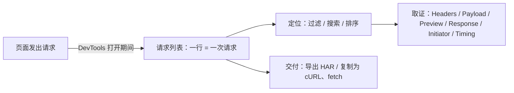

import { Canvas, Controls, Meta } from '@storybook/addon-docs/blocks';
import * as Stories from './network.stories';

<Meta of={Stories} name="Docs" />

# 查看请求

Network（网络）面板是 DevTools 里回答「页面到底发了哪些请求、结果如何、时间花在哪」的地方：DevTools 打开期间，页面发出的每个 HTTP 请求都会在请求列表里留下一行，行的默认列给出结论（状态、类型、大小、耗时），点开一行有详情页签给出证据。本课主线是把一行请求读完整：先让请求被记录，再在列表里定位目标（过滤、搜索、排序），到详情页签里取证，需要交付或复盘时导出 HAR。本课边界是「看」：改变请求行为的节流、阻断与本地覆盖见[控制请求](?path=/docs/network-overrides--docs)。

请求从发出到被你看到的路径：

回查入口（记录开关与快捷键）：

| 操作 | 默认 / 入口 |
| --- | --- |
| 打开面板 | 顶部 Network 选项卡，或 Command Menu（`Command+Shift+P`，Windows、Linux `Control+Shift+P`）执行 Show Network panel |
| 记录 | DevTools 打开期间自动记录；Record（录制）按钮手动开关，面板聚焦时 `Command+E`（Windows、Linux `Control+E`） |
| 保留请求 | Preserve log（保留日志）默认关闭——页面刷新或跳转即清空列表 |
| 清空列表 | Clear（清空）按钮 |
| 搜索 | `Command+F`（Windows、Linux `Control+F`）打开 Search 抽屉 |
| 重放单个请求 | 右键 → Replay XHR（重放 XHR），或选中后按 `R` |
| 导出 | 工具栏 Export HAR (sanitized)… 按钮 |

## 快速上手

演示页是一个「请求发生器」：Controls 选择请求场景（成功 JSON / 404 / 慢速 / 混合一批），每次切换都真实发出一批 fetch 请求；readout（读数）统计已发出请求数与各状态码的条数。证据不在页面上，而在你打开的 DevTools Network 面板里。

<Canvas of={Stories.Specimen} />
<Controls of={Stories.Specimen} />

最小闭环：

1. 按 `Command+Option+J`（macOS）或 `Control+Shift+J`（Windows、Linux）打开 DevTools，切到 Network 面板——面板只记录打开期间的请求，先开面板再触发。
2. Controls 切到「404（失败请求）」——列表新增一行，Status（状态）显示 404，readout「404 失败」加 1；Console 同时收到一条失败消息。
3. 切到「成功 JSON（单个 200）」——新增 Status 200 的一行；点这一行的 Name（名称）打开详情：Headers（标头）看请求与响应头，Payload（载荷）看查询字符串参数 `req`，Preview（预览）看解析后的 JSON，Response（响应）看原始正文，Timing（耗时）看各阶段拆解。
4. 切到「混合一批（4 成功 + 2 失败）」——一次新增 6 行；Filter（过滤）框输入 `status-code:404`，列表只剩失败的两行。
5. 切到「慢速（并发排队）」——一次新增 12 行；点开其中后完成几行的 Timing 页签，Queueing（排队）阶段明显更长——这是本地能观察到的真实「慢」。

| 读者操作 | 可观察证据 |
| --- | --- |
| 切换「请求场景」 | Network 列表新增对应请求行；readout 已发出数与 200 / 404 / 其他计数同步更新 |
| 点开 Name 看详情 | 各页签可切换；悬停 Waterfall（瀑布图）列，浅色段为等待时间、深色段为下载时间 |
| 打开 Show code | 看到该 Canvas 实际执行的 `fetch-specimen.ts` |

每个请求都带递增的 `?req=` 查询参数，保证每次都是新请求而不是缓存命中。本页加载时实例已按默认场景发出过一轮请求——在打开面板之前发出的那批不会出现在列表里，这正是下面「常见问题」的第一条。

## 请求列表

一行就是一次请求，按发出时间排列。记录在 DevTools 打开期间自动进行，需要跨页面保留时勾选 Preserve log——排查「跳转后请求丢失」的第一开关。列表底部状态栏汇总打开以来的请求数与传输 / 解压总大小，所以「一共发了多少」也只统计这个时段。

默认列的含义：

| 列 | 含义 |
| --- | --- |
| Name | 资源名；悬停显示完整 URL |
| Status | HTTP 状态码；特殊值：CORS error（跨域拦截）、(blocked:origin)（来源被阻止，悬停有提示）、(failed)（请求失败，附错误信息） |
| Type | 资源类型 |
| Initiator（发起者） | 发起来源：Parser（HTML 解析）、Redirect（重定向）、Script（脚本）、Other（其他）；悬停显示调用堆栈 |
| Size | 两个数：线上传输大小 / 解压后大小 |
| Time | 从发出到收到最后一个字节的总耗时 |
| Waterfall | 时间轴可视化：浅色段为等待、深色段为下载；蓝色竖线是 DOMContentLoaded，红色竖线是 load |

右键表头可以补列：Domain（域名）、Method（方法）、Protocol（协议，h2 / h3 等）、Priority（优先级）、Remote Address（远程地址）等；Response Headers → Manage Header Columns（管理标头列）能把任意响应头变成一列。Settings 里的两个显示开关：Big request rows（大请求行）让每行直接显示未压缩大小；Group by frame（按 frame 分组）把请求按所属 frame 归组。勾选 Network 设置里的 Capture screenshots（捕获屏幕截图）后重载页面，会按时间拍下快照——点缩略图能把列表过滤到该时刻之后的请求。

## 过滤请求

过滤器只影响显示，不影响记录——「请求不见了」先查过滤。Filter 框支持文本（`png`）、正则（`/.*\.[cj]s+$/`）与负向排除（`-main.css`）；Invert（反转）勾选框把整个条件取反。多个条件用空格分隔同时生效（AND 组合），不支持 OR。

属性过滤语法（回查表）：

| 属性 | 示例与含义 |
| --- | --- |
| `domain` | `domain:*.com`——按域名过滤，支持通配符 |
| `url` | `url:api`——按完整 URL 匹配 |
| `method` | `method:POST`——按请求方法 |
| `status-code` | `status-code:404`——按状态码 |
| `resource-type` | `resource-type:image`——按资源类型 |
| `mime-type` | `mime-type:application/json`——按 MIME 类型 |
| `scheme` | `scheme:https`——只看 http 或 https |
| `priority` | `priority:high`——按加载优先级 |
| `larger-than` | `larger-than:1000`——大于该字节数（1000 等于 1k） |
| `has-response-header` | `has-response-header:Cache-Control`——带指定响应头 |
| `has-overrides` | `has-overrides:yes`——被本地覆盖过的请求（见[修改落盘与复用](?path=/docs/persist-edits--docs)） |
| `is` | `is:running`——进行中的 WebSocket 请求 |
| `mixed-content` | `mixed-content:all` 或 `mixed-content:displayed`——按混合内容 |
| `cookie-*` 与 `set-cookie-*` | `cookie-name`、`cookie-domain`、`cookie-path`、`cookie-value`、`set-cookie-name`、`set-cookie-domain`、`set-cookie-value`、`response-header-set-cookie`——按请求设置或收到的 Cookie 及其属性 |

Filter 框旁的类型按钮：All、Fetch/XHR、JS、CSS、Img、Media、Font、Doc、WS、Wasm、Manifest、Other——`Command` / `Control`+点击可多选，点 All 清除。More filters（更多过滤）勾选框：Hide data URLs（隐藏 data URL）、Hide extension URLs（隐藏扩展页请求）、Blocked response cookies、Blocked requests（被阻止的请求）、3rd-party requests（第三方请求）；被阻止的请求在列表里标红。在列表上方的 Overview 概览图上拖选一段时间，列表只显示该时间段内的请求；概览图本身可通过设置里的 Show overview 隐藏。

在演示页上练一遍：切到混合一批后，Filter 框输入 `status-code:404` 只剩两行失败请求；再勾上 Invert，变成只剩成功的行；点 All 类型按钮清除类型筛选。

## 搜索请求

`Command+F`（Windows、Linux `Control+F`）打开 Drawer（抽屉）里的 Search（搜索）——在所有请求的标头与响应内容里找字符串或正则，与过滤器相互独立。结果列出命中的请求：命中在标头里点开进 Headers 页签，命中在内容里进 Response 页签，并高亮匹配处；面板上有 match_case（区分大小写）与 regular_expression（正则表达式）开关。排查「这个字段是哪个接口返回的」就是它的主场。

## 排序请求

点任意列头按该列排序，再点一次反向。Waterfall 列头右键可以按活动阶段排：Start Time（开始时间）、Response Time（响应时间）、End Time（结束时间）、Total Duration（总耗时）、Latency（延迟）。找「谁最慢」用 Total Duration，找「谁先发起」用 Start Time。

## 请求详情

点 Name 打开详情。同一个请求在不同页签里是不同投影：Headers 是元数据，Payload 是发出的参数，Preview / Response 是收到的内容，Initiator 是为什么发出，Timing 是时间花在哪。

| 页签 | 用途 |
| --- | --- |
| Headers | 请求与响应的标头 |
| Payload | 查询字符串参数与请求体 |
| Preview | 按内容类型渲染的响应 |
| Response | 原始响应正文 |
| Initiator | 发起该请求的调用链 |
| Timing | 各阶段耗时拆解 |
| Cookies | 本请求携带与收到的 Cookie |
| EventStream / Messages | 流式响应与 WebSocket 帧，见[检查 WebSocket 与 SSE](?path=/docs/websocket--docs) |
| Device bound sessions | 设备绑定会话的延后与刷新原因 |

### Headers

General（概况）区有 Request URL、Method 与 Status Code，下方是 Response Headers（响应标头）与 Request Headers（请求标头）。两个实用开关：view source（查看源码）按服务器发送的原始顺序显示标头；对某个响应标头点 Edit（编辑）会创建本地覆盖——那是[控制请求](?path=/docs/network-overrides--docs)的内容。

标头里最常见的提示是 Provisional headers are shown（显示的是临时标头）——浏览器没有完整标头可显示，典型情形有三种：响应来自缓存、请求从未有效到达服务器、被安全策略拦截。要区分「缓存假象」与「真请求」，勾选 Disable cache（禁用缓存）后重试。

### Payload

GET 请求的查询字符串参数在 Query String Parameters（查询字符串参数）区——演示页每次请求带的 `req` 参数就在这里；请求体在 Form Data（表单数据）区。view source 与 view decoded 切换 URL 编码的原始形式与解码后的形式。

### Preview 与 Response

两个页签看的是同一份响应：Preview 按 Content-Type 渲染——JSON 解析成树、HTML 渲染成页面、图片直接预览；Response 是原始正文。响应被压缩成一行时，点 Format（格式化）按钮重新排版（对 JSON 与压缩过的 JS 都有效）。

### Initiator

Initiator 页签展示请求链（request chain）——这个请求由哪个脚本、哪次重定向或哪个解析动作发起。两个配套观察点：悬停列表的 Initiator 列可看调用堆栈，点进去直达 Sources；按住 `Shift` 悬停行，绿色高亮它的发起者链、红色高亮它引发的依赖。排查「这个请求是谁发的」用这里。

### Timing

Timing 把一次请求拆成阶段：

| 阶段 | 含义 |
| --- | --- |
| Queueing（排队） | 连接开始前的等待：更高优先级的请求在先、HTTP/1.1 同源六连接上限、磁盘缓存条目分配 |
| Stalled（停滞） | 连接开始后因同类原因停滞 |
| DNS Lookup（DNS 查询） | 解析 IP 地址 |
| Initial connection（初始连接） | 建立 TCP 连接，含握手、重试与 SSL 协商 |
| Proxy negotiation（代理协商） | 与代理服务器协商 |
| Request sent（发送请求） | 发出请求 |
| ServiceWorker Preparation / Request to ServiceWorker | Service Worker 启动与接管 |
| Waiting（TTFB，等待首字节） | 等待响应第一个字节：一个往返的延迟加服务器处理时间 |
| Content Download（内容下载） | 接收响应体 |

悬停 Waterfall 列可以直接预览这些阶段。演示页的慢速场景把 12 个请求同时发出：本地开发服务器按 HTTP/1.1 提供服务时同源连接数有限，后发的请求会在 Queueing 里等待——对比几行的 Timing 页签，能看到排队长短的差异。如果你的环境用 HTTP/2 或 HTTP/3（补一列 Protocol 就能看到），连接多路复用后排队会消失。真实慢网络下的表现用 Throttling（节流）模拟，见[控制请求](?path=/docs/network-overrides--docs)。

## 导出 HAR

HAR（HTTP Archive）是把整个请求日志存成 JSON 的标准格式——附在 bug 报告里、交给别人离线分析、留给日后对比都用它。

- 导出：工具栏 Export HAR (sanitized)…（导出已脱敏 HAR）；下拉里的 Export HAR (with sensitive data)（含敏感数据）需要先在 Settings → Preferences → Network 勾选 Allow to generate HAR with sensitive data——默认关闭，防止误把 Cookie、令牌发出去。
- 复制：右键请求 → Copy。单条可 Copy URL、Copy as cURL（把请求原样复现成 curl 命令，交给后端复现最顺手）、Copy as fetch、Copy as fetch (Node.js)、Copy as PowerShell、Copy response、Copy stack trace；批量分两组——Copy all as HAR 作用于整个日志，Copy all listed as HAR 只作用于当前过滤后的列表。
- 导入：把 `.har` 文件拖进请求列表，或点 Import HAR（导入 HAR）按钮——导入的请求可回看标头与正文，Initiator 关系一并保留。

## 最佳实践

- 排查先搭观察条件：打开面板 →（跨页面场景勾 Preserve log）→ 复现 → 过滤缩围 → 点行取证 → 需要交付时导 HAR。列表是空的多半不是没请求，而是面板开晚了；Preserve log 管跨页面丢失，重新复现管时序。
- 先过滤再读行：大页面上肉眼找行不如一次 `status-code:404` 或 `domain:` 过滤；属性条件是 AND 组合，条件越精确列表越干净，不支持 OR 时分开查或用 Invert 取反。
- 对外交付默认 sanitized：默认导出的 HAR 已脱敏敏感标头；只有自己确认过内容、确需完整 Cookie 与鉴权头时才开 with sensitive data。

## 常见问题

- 切换了场景，Network 列表里却没有新行。
  先确认面板是否已经打开——Network 只记录打开期间的请求；再确认 Record 按钮是否处于录制状态（`Command+E` / `Control+E` 切换）、Filter 框与类型按钮是否残留条件。演示页的 readout 不受这些影响，它统计的是实例真实发出的请求。
- Headers 里只有 Provisional headers are shown，看不到完整响应标头。
  出现该提示说明浏览器没有完整标头可显示：响应来自缓存、请求未有效到达服务器或被安全策略拦截。勾选 Disable cache 后重试即可区分「缓存假象」与「真请求」；Size 列显示 (disk cache) 同理——那一行根本没有走网络。
- 404 之后 Console 里也冒出红色错误。
  这是正常联动：网络失败会以消息形式进入 Console。不想看就勾选 Console 设置里的 Hide network（隐藏网络），见[Console 入门](?path=/docs/console--docs)。
- 想同时过滤 `status-code:404` 和 `status-code:500`，写成两个条件却查不到任何行。
  过滤属性之间是 AND，不支持 OR——两个条件同时满足的请求不存在。分开查两次，或改用更宽的单一条件。
- Copy all listed as HAR 导出的文件里少了请求。
  listed 系列只包含当前过滤后的列表；要完整日志用 Copy all as HAR，或先清空 Filter 框、点 All 恢复类型显示再导出。
- 慢速场景里 Timing 的 Queueing 都是 0。
  排队依赖 HTTP/1.1 的同源连接上限；页面若经 HTTP/2 / HTTP/3 提供（补 Protocol 列看 h2 / h3），多路复用后不排队。要看 Queueing 需在 HTTP/1.1 环境下并发大量请求，或用 Throttling 制造真实瓶颈（见[控制请求](?path=/docs/network-overrides--docs)）。

## 总结回顾

摘要：

Network 面板把 DevTools 打开期间页面发出的每个请求记成一行，Preserve log 管跨页面保留，Record / `Command+E` 管录制开关，底部状态栏汇总这段时段的请求数与大小。默认列 Name、Status、Type、Initiator、Size、Time、Waterfall 给出结论，右键表头可补 Method、Protocol、Priority 等列。定位目标请求靠 Filter 框（文本、正则、负向与属性条件，AND 组合、不支持 OR，Invert 整体取反）、类型按钮、More filters 与 Overview 时间拖选；搜索用 `Command+F` 的 Search 抽屉，命中直接定位到 Headers 或 Response 并高亮；排序点列头，或从 Waterfall 右键按开始时间、总耗时等阶段排。点开一行，Headers 给标头（Provisional headers 提示缓存或未真正发出）、Payload 给查询参数与请求体、Preview 与 Response 给渲染后与原始的内容、Initiator 给调用链（`Shift`+悬停看绿红依赖）、Timing 把耗时拆成 Queueing 到 Content Download 的阶段。最后用 Export HAR (sanitized)… 导出脱敏存档，Copy as cURL 等把请求原样交给后端，Import HAR 把日志拖回面板复盘。

一句话：

> 一行请求的读法固定三步：列表里过滤定位，详情页签取证，HAR 导出交付——而这一切的前提是先开面板再复现。

知识要点：

- Network 在什么时段记录请求？Preserve log、Record、Clear 分别管什么？
- 默认列各给出什么结论？Status 有哪些特殊值？Size 的两个数是什么？
- Filter 框支持哪些属性条件？多个条件怎么组合？Invert 做什么？
- 搜索与过滤有何不同？命中结果会定位到哪个页签？
- 详情各页签分别回答什么问题？Provisional headers 提示哪三种情形？
- Timing 从 Queueing 到 Content Download 各对应什么耗时？
- HAR 的 sanitized 与 with sensitive data 差别是什么？Copy all 与 Copy all listed 差别是什么？

## 参考资料

- [Inspect network activity](https://developer.chrome.com/docs/devtools/network)
- [Network features reference](https://developer.chrome.com/docs/devtools/network/reference)
- [Network panel: Analyze network load and resources](https://developer.chrome.com/docs/devtools/network/overview)
