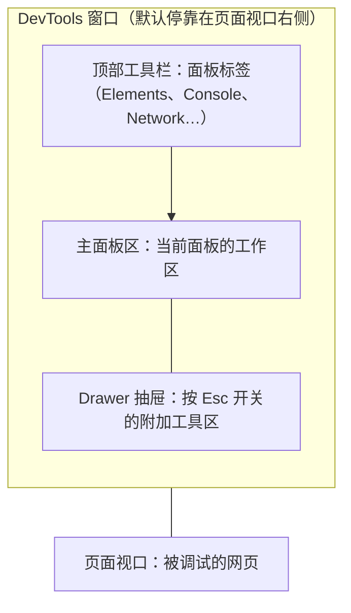

import { Canvas, Controls, Meta } from '@storybook/addon-docs/blocks';
import * as Stories from './overview.stories';

<Meta of={Stories} name="Docs" />

# 认识 DevTools

Chrome DevTools（Chrome 开发者工具）是内置于 Google Chrome 的网页开发者工具集，用来即时编辑页面、快速诊断问题。它按「面板（panel）」组织：窗口顶部的每个标签是一个面板，专注一类调试对象——查结构进 Elements（元素），查请求进 Network（网络），查速度进 Performance（性能）。

本课回答三个问题：怎么打开 DevTools、窗口怎么分区、拿到一个调试任务该进哪个面板。本课还带一个演示页（见「面板地图」一节）：它既是任务到面板的查找器，也是练习标本——你可以直接在它上面按 `F12`、右键元素选 Inspect，完成第一次亲手检查。

先建立窗口结构的直觉：



打开方式与界面操作的速查表：

| 目标 | 做法 |
| --- | --- |
| 打开上次使用的面板 | `F12` 或 `Ctrl+Shift+I`（macOS：`Fn+F12` 或 `Cmd+Option+I`） |
| 直达 Elements 并进入检查模式 | 右键元素选 Inspect（检查）；或 `Ctrl+Shift+C`（macOS：`Cmd+Option+C`） |
| 直达 Console（控制台） | `Ctrl+Shift+J`（macOS：`Cmd+Option+J`） |
| 切换上 / 下一个面板 | `Ctrl+[` / `Ctrl+]`（macOS：`Cmd+[` / `Cmd+]`） |
| 开关 Drawer（抽屉） | `Esc` |
| 打开 Settings（设置） | `F1` 或 `?`（macOS 的 F1 为 `Fn+F1`） |
| 每个新标签页自动打开 DevTools | 以 `--auto-open-devtools-for-tabs` 参数启动 Chrome |

## 打开方式

三类常规入口，按「手里有什么」选：

- **键盘：** `F12` 或 `Ctrl+Shift+I`（macOS：`Fn+F12` 或 `Cmd+Option+I`），打开上次使用的面板，是最快的日常入口。
- **菜单：** 点地址栏旁的 Chrome 菜单（⋮）→ More Tools（更多工具）→ Developer Tools（开发者工具），同样打开上次使用的面板。
- **右键检查：** 右键页面元素选 Inspect。DevTools 会打开 Elements 面板并选中该元素。它的快捷键 `Ctrl+Shift+C`（macOS：`Cmd+Option+C`）以检查模式打开 Elements：悬停页面元素出现提示，点击后 Styles 标签立即显示它的 CSS——这是改样式前的最短路径。

官方给的记忆法：C 代表 CSS，J 代表 JavaScript，I 是你上次的选择。

知道目标面板时用速查表的直达快捷键；不确定时先按 `F12`，再用 `Ctrl+[` / `Ctrl+]`（macOS：`Cmd+[` / `Cmd+]`）在面板间循环切换。

**每个新标签页自动打开**——适合反复跳页的调试场景。先完全退出 Chrome（确认没有残留的 Chrome 进程），再带参数启动：该参数只对第一个 Chrome 实例生效，本次关闭 Chrome 之前每个新标签页都会自动打开 DevTools。

```bash
# macOS
open -a "Google Chrome" --args --auto-open-devtools-for-tabs

# Windows
start chrome --auto-open-devtools-for-tabs

# Linux
google-chrome --auto-open-devtools-for-tabs
```

完整快捷键表、Command Menu（命令面板）与设置定制，见[高效操作](?path=/docs/shortcuts--docs)。

## 界面布局

DevTools 窗口自上而下分三块。顶部工具栏排着面板标签，点哪个标签，下方主面板区就切换到哪个面板；工具栏右上角的 Customize and control DevTools（自定义并控制 DevTools，⋮）菜单集中了停靠位置、设置等全局入口。主面板区内部还有更小的子区域，官方称为 pane（窗格）：例如 Elements 里的 Styles、Computed、Layout，Sources 里的 Page、Workspace、Overrides。本手册用「面板 → 区域 → 操作」描述 GUI 操作，指的就是先切到哪个面板、再看哪个窗格。

按 `F1` 或 `?`（macOS 的 F1 为 `Fn+F1`）打开 Settings，里面有 Preferences（偏好设置）、Shortcuts（快捷键）、Experiments（实验特性）等设置区；涉及实验功能的课程会标注具体开关位置。

### Drawer 抽屉

按 `Esc` 打开或关闭 Drawer（抽屉）——主面板区底部的附加工具条。抽屉的工具不止当前显示的几个：点 More Tools（更多工具）可以勾选 Sensors、Coverage、Performance monitor、Network conditions、Protocol monitor、Quick source 等。

标签摆位可以自由调整：拖动面板标签左右换序；右键标签选 Move to top（移到顶部）或 Move to bottom（移到底部），把工具在主面板区和抽屉之间搬动。自定义顺序与摆位会跨会话保留。同一工具摆在顶部还是抽屉里，不同版本可能不同——找不到时先按 `Esc` 看抽屉，再用 More Tools 找一遍。

### 停靠位置

DevTools 默认停靠在页面视口右侧。改摆放：打开 Customize and control DevTools（⋮）菜单，在 Dock side（停靠位置）里选 Undock into separate window（拆分为独立窗口）、Dock to left / bottom / right（停靠到左 / 底 / 右）；也可以在 Command Menu 输入 dock 直达这些命令（命令面板详见[高效操作](?path=/docs/shortcuts--docs)）。快捷键 `Ctrl+Shift+D`（macOS：`Cmd+Shift+D`）在当前停靠位置与上一次停靠位置之间切换。停靠设置不跨设备同步，每台设备各配一次。

选法经验：宽屏调样式停靠右侧，代码与页面并排；排查布局时停靠底部，把纵向空间留给页面；投屏或双屏讲解用独立窗口。

## 面板地图

DevTools 的十几个面板不是背清单，而是按调试对象分工：先判断「问题属于哪一类」，再进对应面板。下面的查找器收集了常用任务到面板的映射——在 Controls 里选一个任务，readout 会给出面板名、所在位置、打开方式和官方说明。演示页同时是练习标本，可以当场按 `F12`、右键 Inspect、开 Console 看日志。

<Canvas of={Stories.PanelFinder} />
<Controls of={Stories.PanelFinder} />

| 读者操作 | 可观察证据 |
| --- | --- |
| 在 Controls 里切换「调试任务」 | readout 的面板名、所在位置、打开方式与说明同步更新 |
| 在演示页上按 `F12` | 本页打开 DevTools，显示上次使用的面板 |
| 在演示页右键按钮 / 表单 / 图片选 Inspect | Elements 打开并选中该元素 |
| 用 `Ctrl+Shift+J` 打开 Console 后点按钮、提交表单 | Console 打印以 `[练习标本]` 开头的日志 |

主面板速查，面板名与说明取自官方 overview 文档：

| 面板 | 回答什么问题 | 手册深入课 |
| --- | --- | --- |
| Elements（元素） | DOM 和 CSS 长什么样、怎么改 | [检查 DOM](?path=/docs/inspect-dom--docs) |
| Console（控制台） | 页面打了什么日志、JS 即时执行结果 | [Console 入门](?path=/docs/console--docs) |
| Sources（源代码） | JS 为什么算错——断点单步与工作区 | [断点调试](?path=/docs/breakpoints--docs) |
| Network（网络） | 发了哪些请求、耗时与响应内容 | [查看请求](?path=/docs/network--docs) |
| Performance（性能） | 页面为什么慢——录制轨迹找瓶颈 | [录制与分析轨迹](?path=/docs/performance-traces--docs) |
| Memory（内存） | 内存为什么涨——快照与泄漏 | [内存快照](?path=/docs/memory-snapshots--docs) |
| Application（应用） | 存储、Cookie、缓存里存了什么 | [浏览器存储调试](?path=/docs/storage--docs) |
| Security（安全） | 证书、混合内容等安全隐患 | [安全与问题排查](?path=/docs/security-issues--docs) |
| Lighthouse | 整页质量审计报告 | [Lighthouse 审计](?path=/docs/lighthouse--docs) |
| Recorder（录制器） | 怎么录制、回放用户操作流 | [录制与回放用户流](?path=/docs/recorder--docs) |

视口与传感器的模拟走 Device Mode（设备模式）：点 DevTools 工具栏的设备图标，或按 `Ctrl+Shift+M`（macOS：`Cmd+Shift+M`），详见[设备与网络模拟](?path=/docs/device-mode--docs)。

常用工具默认不在顶部工具栏，按 `Esc` 打开抽屉、点 More Tools 勾选开启：

| 工具 | 用途 | 手册深入课 |
| --- | --- | --- |
| Rendering（渲染） | 模拟 light / dark 主题等 CSS 媒体特性，检查渲染问题 | [渲染诊断](?path=/docs/rendering-tools--docs) |
| Animations（动画） | 慢放、重放和修改动画 | [动画调试](?path=/docs/animations--docs) |
| Coverage（覆盖率） | 找出未使用的 CSS 和 JavaScript | — |
| Sensors（传感器） | 模拟地理位置、设备方向等传感器输入 | [设备与网络模拟](?path=/docs/device-mode--docs) |
| Performance monitor（性能监视器） | 实时查看 CPU、内存等指标曲线 | — |
| Network conditions（网络状况） | 模拟网络状况 | [设备与网络模拟](?path=/docs/device-mode--docs) |
| Issues（问题） | 汇总页面问题与修复建议 | [安全与问题排查](?path=/docs/security-issues--docs) |

其余工具（Layers、Media、WebAudio、WebAuthn、Memory Inspector、Changes、CSS overview、Quick source、Protocol monitor 等）同样通过 More Tools 按需开启。

## 常见问题

- 按 `F12` 没反应。
  换备选入口：`Ctrl+Shift+I`（macOS：`Cmd+Option+I`），或 Chrome 菜单（⋮）→ More Tools → Developer Tools。判断依据：macOS 键盘默认把 F 键映射为媒体键，需要按 `Fn+F12`；部分笔记本键盘同样需要 `Fn` 配合。
- 顶部工具栏找不到某个面板。
  按 `Esc` 打开抽屉，点 More Tools 勾选对应工具；或右键任意标签选 Move to top / Move to bottom 调整摆位。判断依据：工具的默认摆位随版本变化，主面板区与抽屉之间可以自由搬动。
- 网页禁用了右键，看不到 Inspect 选项。
  先用快捷键或菜单打开 DevTools，再点工具栏左上角的检查工具图标（`Ctrl+Shift+C`，macOS：`Cmd+Shift+C` 或 `Cmd+Option+C`），回到页面点目标元素。判断依据：禁用右键只拦截了上下文菜单，不影响 DevTools 的检查模式。

## 总结回顾

摘要：

Chrome DevTools 是内置于 Chrome 的网页开发者工具集，按面板组织：顶部标签是面板（panel），面板内的子区域叫 pane（窗格），底部是按 `Esc` 开关的 Drawer（抽屉）；窗口默认停靠在视口右侧，可改为底部、左侧或独立窗口。打开 DevTools 有三类入口：快捷键（`F12` 打开上次的面板，`Ctrl+Shift+C` 直达 Elements 检查模式，`Ctrl+Shift+J` 直达 Console）、Chrome 菜单和右键 Inspect；长期调试可用 `--auto-open-devtools-for-tabs` 让每个新标签页自动打开。面板按调试对象分工：结构查 Elements、日志与即时代码查 Console、断点查 Sources、请求查 Network、速度查 Performance、内存查 Memory、存储查 Application、安全查 Security、整页质量查 Lighthouse、用户流查 Recorder；找不到的工具先按 `Esc` 看 Drawer，再用 More Tools 勾选。

一句话：

> 面板按调试对象分工：先判断任务属于哪一类，再进对应面板，比背面板清单更可靠。

知识要点：

- 打开 DevTools 的三类入口分别是什么？各适合什么场景？
- 面板（panel）、pane（窗格）、Drawer（抽屉）各指窗口的哪部分？
- 怎么把一个工具在主面板区和抽屉之间搬动？
- 「查内存」该进哪个面板？「看存储」呢？「找未使用 CSS」呢？
- DevTools 默认停靠在哪里？怎么改成独立窗口或停靠到底部？

## 参考资料

- [Chrome DevTools overview](https://developer.chrome.com/docs/devtools/overview)
- [Open Chrome DevTools](https://developer.chrome.com/docs/devtools/open)
- [Customize DevTools](https://developer.chrome.com/docs/devtools/customize)
- [Keyboard shortcuts](https://developer.chrome.com/docs/devtools/shortcuts)
