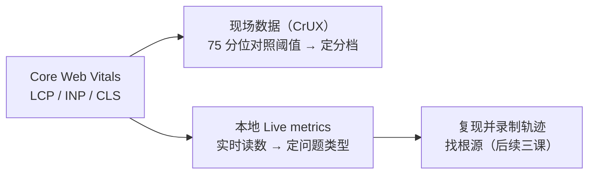

import { Canvas, Controls, Meta } from '@storybook/addon-docs/blocks';
import * as Stories from './performance-metrics.stories';

<Meta of={Stories} name="Docs" />

# 性能指标

「性能好不好」要先变成可判定的数字，后面才有录制与排查。Chrome 把这件事收敛成三个以用户为中心的指标，合称 Core Web Vitals（核心网页指标）：LCP（Largest Contentful Paint，最大内容绘制）回答「主要内容多快看见」，INP（Interaction to Next Paint，交互到下一次绘制）回答「点下去多快有反应」，CLS（Cumulative Layout Shift，累积布局偏移）回答「画面会不会跳」。每个指标都有「良好 / 需要改进 / 差」三档阈值，最终按真实用户数据的第 75 百分位判定。DevTools 的 Performance（性能）面板打开即显示本地实时指标（Live metrics）。本课的演示页是一个「负载发生器」：滑块控制注入主线程的阻塞时长，一次真实点击把 INP 的三个阶段拆成实测读数——把负载调大，你可以预测处理耗时、交互延迟与 FPS 会同步变差，这正是后续课程要录进轨迹里的现象。

本课只负责指标模型与分析思路：指标衡量什么、阈值是多少、在面板哪里看、实验室数据与现场数据怎么分工。录制轨迹与解读火焰图、定位 CPU 热点、渲染诊断由后续三课承接。

指标读数的两条去向：

阈值速查（回查入口）：

| 指标 | 衡量什么 | 良好 | 需要改进 | 差 | 面板里的位置 |
| --- | --- | --- | --- | --- | --- |
| LCP（最大内容绘制） | 主要内容渲染完成的时间 | ≤ 2.5 s | 2.5–4 s | > 4 s | Live metrics 卡片；Timings 轨道的 LCP 标记 |
| INP（交互到下一次绘制） | 最差交互从输入到下一帧的延迟 | ≤ 200 ms | 200–500 ms | > 500 ms | Live metrics INP 卡片；Interactions 表 |
| CLS（累积布局偏移） | 最大会话窗口内的意外偏移分数 | ≤ 0.1 | 0.1–0.25 | > 0.25 | Live metrics CLS 卡片；Layout shifts 表 |

判定按每次页面加载的第 75 百分位，移动端与桌面端分开统计——单次本地读数不参与这个判定。

## 快速上手

演示页是一个「负载发生器」：Controls 的「任务负载」滑块设定每次注入主线程的同步阻塞时长；页面每约 4 秒自动注入一次，模拟与点击无关的后台任务；「触发一次交互」按钮做一次真实点击。readout 全部是真实测量：一次点击的输入延迟 / 处理耗时 / 呈现延迟三阶段、近 6 帧 rAF 间隔的 FPS 估计、超过 50ms 的长任务实测次数。

<Canvas of={Stories.Specimen} />
<Controls of={Stories.Specimen} />

最小闭环：

1. 按 `Command+Option+J`（macOS）或 `Control+Shift+J`（Windows、Linux）打开 DevTools，切到 Performance 面板——打开即显示 Live metrics，无需录制；指标在后台持续收集，即使面板后开也不会错过本次加载。
2. 保持默认负载 150 ms，点「触发一次交互」——按钮按下到读数刷新之间有一顿挫；readout 的处理耗时约 150 ms，最近交互延迟等于三段之和。
3. 把滑块拉到 500 ms 再点——处理耗时与最近交互延迟逼近 500 ms，FPS 估计瞬间深跌、随后恢复；如果点击落在心跳阻塞期间，「输入延迟」一栏也会被拉长——那一下「点不动」就是输入延迟。
4. 回到 Performance 面板：Interactions 表逐条记录刚才的点击（类型、目标元素、延迟与阶段拆解）；Layout shifts 表保持为空——本页没有制造意外偏移。
5. 点 Record（录制），等 4–8 秒后 Stop——Main 轨道出现右上角带红三角的 Task（长任务），这正是 Live metrics 里 INP 与 TBT 背后的元凶。

| 读者操作 | 可观察证据 |
| --- | --- |
| 调整「任务负载」滑块 | 「当前负载」读数同步变化；下一次心跳与点击按新时长阻塞 |
| 点击「触发一次交互」 | 输入延迟 / 处理耗时 / 呈现延迟三行更新为实测值，三段相加等于最近交互延迟 |
| 停留观察 readout | FPS 估计在每次阻塞瞬间跌落、随后恢复；长任务计数持续增长 |
| 打开 Show code | 看到该 Canvas 实际执行的 `load-specimen.ts` |

FPS 估计取近 6 个 rAF 帧间隔求平均，数值取决于显示器刷新率（60 Hz 或 120 Hz）；离屏或切走标签页时演示页的循环会暂停，读数冻结属于正常现象。

## Core Web Vitals

三个指标把「性能」拆成三类可判定的体验问题：加载、交互、稳定。判定规则一致：按页面加载的第 75 百分位、移动端与桌面端分开统计，对照阈值分档。选 75 分位是权衡的结果——既要求多数访问达标，又不让少数离群值左右结论（100 次访问里，95 分位只需 5 个异常样本就会失真，75 分位需要 25 个）。

指标数据分两类，分工不同：

- **实验室数据（lab data）**：DevTools、Lighthouse 在受控环境里测出的单次读数。适合开发阶段复现问题、发布前做回归对比，但设备快、网络好、没有真实用户的行为分布，不能用来下「页面达标」的结论。
- **现场数据（field data）**：Chrome UX Report（CrUX，Chrome 用户体验报告）汇总的真实用户读数，按 28 天窗口聚合到第 75 百分位。三档阈值的判定以它为准。

一句话分工：**判定看现场，诊断用本地**——现场数据告诉你哪个指标差，本地工具帮你找到为什么差。除三指标外还有几个辅助指标：TTFB（Time to First Byte，首字节时间）与 FCP（First Contentful Paint，首次内容绘制）用于诊断 LCP 的前置环节；TBT（Total Blocking Time，总阻塞时间）统计从 FCP 到页面可交互之间，主线程被长任务阻塞、超出 50ms 部分的总和，是 INP 在实验室里的代理——Lighthouse 测不到 INP 就看它。

### LCP 最大内容绘制

LCP 从用户发起导航开始计时，到视口中「最大」的图像或文本块渲染完成——近似回答「主要内容什么时候看见了」。候选元素包括：`` 图片、`<svg>` 内的 `<image>`、`<video>` 的海报帧或首帧、CSS `url()` 加载的背景图、包含文本的块级元素；更大的元素渲染出来时，LCP 会被替换成更晚的那个值，所以它不是一个时刻而是「一路更新到最大」的过程。前置的所有延迟（TTFB、重定向、连接建立）都算在 LCP 里。

在面板里：Live metrics 的 LCP 卡片打开 Performance 面板即可读，悬停可在页面上高亮 LCP 元素；录制轨迹后 Timings 轨道有 LCP 标记（相邻还有 FCP、DCL、Onload 标记）。

边界：本地开发环境网络快、资源少，LCP 读数普遍偏好，价值在于同环境回归对比（改动前后对比），绝对分档以现场数据为准。本课演示页跑在 Storybook 文档里，加载形态与真实站点差异大，所以不拿它的读数冒充 LCP 证据——这本身就是 lab 与 field 需要分开看的实例。

### INP 交互到下一次绘制

INP 衡量页面整个生命周期里对交互的响应速度。统计的交互只有三类：鼠标点击、触屏点按、键盘按键；悬停、滚动、缩放不计。报告的是最差的那次交互从输入到绘制下一帧的总延迟——交互次数多于 50 次时，每 50 次忽略 1 个最高值，避免偶发异常绑架结论。

每次交互拆成三个阶段，演示页的 readout 就是按这个划分实测的：

| 阶段 | 什么时候变长 | 演示页怎么触发 |
| --- | --- | --- |
| 输入延迟（input delay） | 回调开始前主线程被长任务占着 | 在心跳阻塞的瞬间点按钮 |
| 处理耗时（processing time） | 事件回调本身做重活 | 「任务负载」滑块直接控制这一段 |
| 呈现延迟（presentation delay） | 回调结束后渲染任务过重 | 大负载下点击后读数仍要等一拍才刷新 |

在面板里：Live metrics 的 INP 卡片需要有真实交互后才产生读数；Interactions 表逐条记录交互，悬停可高亮目标元素；录制轨迹后 Interactions 轨道用须状线拆出三阶段，超过 200ms 的交互标红三角并给出 INP 提示。

边界：单次点击的延迟受本机性能影响极大——开发机上「感觉很快」不等于真实用户达标；现场数据的 INP 来自真实用户的设备与交互分布。

### CLS 累积布局偏移

CLS 只统计「意外」的偏移：已渲染帧之间，可见元素的起始位置突然改变。新插入元素或元素自己变大不算——除非它们把别的可见元素挤走。单次偏移的分数：

> 偏移分数 = 影响分数（impact fraction，前后两帧中不稳定元素并集占视口的比例）× 距离分数（distance fraction，移动距离占视口最大维度的比例）

官方例子：元素占视口一半、向下移动 25% 视口高度，则 0.75 × 0.25 = 0.1875。累积规则不是把所有偏移加总：偏移按「会话窗口」分组——相邻偏移间隔小于 1 秒、窗口总时长不超过 5 秒——CLS 取分数最高的那个窗口。用户引发的偏移不计入：交互后 500ms 内发生的偏移带 `hadRecentInput` 标记被排除（但滚动、拖拽这类连续输入不算 recent input，由此暴露的偏移仍计入）。

在面板里：Live metrics 的 CLS 卡片持续累加；Layout shifts 表列出每次偏移的元素与分数；录制轨迹后 Layout shifts 轨道用紫色菱形按时间聚簇，悬停高亮页面元素，点击看分数与原因。

边界：实验室工具只能捕捉加载阶段的偏移，现场数据通常更高——不少偏移要慢网络才暴露（请求返回晚、内容插入时才挤动布局），本地复现这类问题需要 Network throttling。

## 在面板里看指标

指标在 DevTools 里有一个常驻入口和一种投影形态，分工如下：

- **Live metrics（实时指标）**：打开 Performance 面板默认就是它，无需录制。三张指标卡按阈值着色，Interactions 与 Layout shifts 两个表格记录历史，可点 Clear 清空。指标在页面后台持续收集（DevTools 没开也在记），所以面板后开也不会错过本次加载。调试加载期问题（LCP、加载期 CLS）用 Record and reload（录制并重载）按钮；交互类问题直接 Record 手动复现。
- **Field data（现场数据）**：Live metrics 旁的 Field data 区点 Configure 接入 CrUX——同一页面或来源近 28 天真实用户的 75 分位读数，按移动 / 桌面分组，DevTools 自动匹配与你本地相同的 URL 与设备类型；悬停任一指标可看各档占比。它还会给出环境建议（如 CPU 20x slowdown、Fast 4G 节流），让本地读数贴近目标用户。
- **轨迹里的指标痕迹**：录制轨迹后，Timings 轨道标出 FCP、LCP、DCL（DOMContentLoaded）、Onload（L）；Main 轨道里超过 50ms 的任务标红三角、超出部分画红色阴影；Interactions 与 Layout shifts 轨道同 Live metrics 的表格同源。火焰图的解读与操作是[录制与分析轨迹](?path=/docs/performance-traces--docs)的内容。
- **Insights（洞见）**：轨迹左侧的 Insights 页签给出按指标组织的可执行建议。旧教程截图里的 Performance Insights 独立面板已于 2025 年并入这里——找不到面板时，认准 Performance。

## 最佳实践

- 先定档、再诊断：用现场数据找出 75 分位最差的指标，再进本地工具找根源。跳过定档直接在本地「优化到绿」，容易修错方向——开发机的 CPU 与网络都不代表真实用户。
- 优化单项指标时检查连坐：给图片补宽高或预留占位能压 CLS 且不伤 LCP；拆掉长任务同时改善 INP 与 TBT；但把内容推迟到交互后加载，降了首屏却可能制造加载后的偏移。每次改动先想清楚它作用于指标的哪个阶段，改完同环境对比 lab 读数，再回现场验证。
- 本地读数要贴近目标设备才有意义：Field data 的环境建议（CPU 节流、网络节流）照着设，读数才有对比价值；裸跑本机的数字只用于改动前后的自我对照。

## 常见问题

- 本地 Live metrics 三张卡全绿，现场数据却有一项差。
  以现场数据为准做判定，再用本地复现找原因。差异来自环境：开发机的 CPU、网络远好于真实用户，视口、交互分布也不同。按 Field data 的建议开 CPU throttling（如 20x slowdown）与 Network throttling，问题通常就能在本地复现。
- INP 卡片一直空着，Interactions 表也没有记录。
  INP 来自真实交互——打开面板后还没点击过页面就没有读数。在演示页点几下「触发一次交互」即可；注意悬停与滚动不算交互，Live metrics 也不统计它们。
- 页面明明跳了好几下，CLS 却不高。
  CLS 不是所有偏移的加总：偏移按会话窗口分组（间隔小于 1 秒、窗口不超过 5 秒），只取分数最高的窗口；交互后 500ms 内用户引发的偏移也不计入。想让 CLS 变高，得让某个窗口内的偏移足够多，或在多个窗口分别制造大偏移。

## 总结回顾

摘要：

Core Web Vitals 用 LCP、INP、CLS 三个指标分别判定加载、交互响应与视觉稳定性，各有「良好 / 需要改进 / 差」三档阈值，按页面加载的第 75 百分位、移动与桌面分开判定。数据分两类：现场数据（CrUX）负责判定，实验室数据（DevTools、Lighthouse）负责诊断与回归。DevTools Performance 面板打开即显示本地实时指标（Live metrics），指标在后台持续收集；Interactions 与 Layout shifts 表记录细节，Field data 区可接入现场数据做对比并给出环境建议；录制轨迹里 Timings 标记、长任务红三角、交互须状线与偏移菱形是同一批指标的另一种投影。INP 把一次交互拆成输入延迟、处理耗时、呈现延迟三阶段；long task（超过 50ms 的任务）是 INP 与 TBT 共同的根源。负载发生器把这套模型落到实测：任务负载滑块控制主线程阻塞时长，一次真实点击拆出三阶段读数，rAF 间隔采样给出 FPS 估计。

一句话：

> 指标回答「快不快」，轨迹回答「为什么慢」——判定永远看现场数据的 75 分位，本地读数只用于复现与定位。

知识要点：

- 三个 Core Web Vitals 各衡量什么？三档阈值分别是多少？按什么分位判定？
- 实验室数据与现场数据的分工是什么？为什么本地全绿不等于现场达标？
- 一次交互的 INP 分哪三个阶段？各阶段在什么情况下变长？
- CLS 的单次分数怎么算？会话窗口规则是什么？哪些偏移不计入？
- Live metrics 何时开始收集？Record 与 Record and reload 各适合什么问题？
- long task 的判定阈值是多少？它与 INP、TBT 什么关系？

## 参考资料

- [Performance panel: Analyze your website's performance](https://developer.chrome.com/docs/devtools/performance/overview)
- [Performance features reference](https://developer.chrome.com/docs/devtools/performance/reference)
- [Monitor local and real-user Core Web Vitals](https://developer.chrome.com/blog/devtools-realtime-cwv)
- [Core Web Vitals](https://web.dev/articles/vitals)
- [Largest Contentful Paint (LCP)](https://web.dev/articles/lcp)
- [Interaction to Next Paint (INP)](https://web.dev/articles/inp)
- [Cumulative Layout Shift (CLS)](https://web.dev/articles/cls)
- [How the Core Web Vitals metrics thresholds were defined](https://web.dev/articles/defining-core-web-vitals-thresholds)
- [Deprecation of the Performance Insights panel](https://developer.chrome.com/blog/insights-panel-deprecation)
