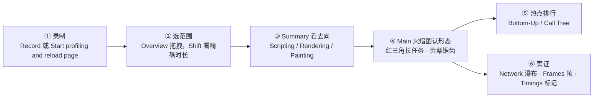

import { Canvas, Controls, Meta } from '@storybook/addon-docs/blocks';
import * as Stories from './performance-traces.stories';

<Meta of={Stories} name="Docs" />

# 录制与分析轨迹

指标回答「快不快」，轨迹回答「为什么慢」。用 Performance（性能）面板录一条轨迹（trace），浏览器会把主线程调用栈、网络请求、交互与帧采样到同一条时间轴上；轨迹只是采样，结论全部来自解读——火焰图回答「什么时候慢、慢在哪条调用栈」，Bottom-Up 与 Call Tree 把散落的耗时排成函数榜，Network 瀑布图回答「请求何时发生、彼此怎么等待」。本课的演示页是一个「工作负载标本」：Controls 的「负载类型」切换三种可复现负载（长脚本任务 / 布局抖动 / 混合），点一次「执行一次操作」做一次操作，readout 给出本次实测耗时——把这次操作录进轨迹，用耗时作锚点在 Main 火焰图里把它找出来。可以预测：切到「布局抖动」再录，同一条 Task 内部会变成黄紫交替的锯齿，readout 的强制布局次数从 — 变成几百次。

本课边界是面板内的录制与解读：指标阈值与 Live metrics 属于指标模型，不在本课重复；把采样做成独立会话的 JavaScript Profiler 与渲染过程的持续诊断是另两条工作流，这里只留边界。

每条轨迹都按同一条链读：

## 快速上手

演示页是一个「工作负载标本」：Controls 的「负载类型」决定点按钮时注入什么负载——`长脚本任务`是一段纯 JavaScript 忙等；`布局抖动`连续交替「读布局 → 写样式」，制造强制同步布局；`混合`先跑一段脚本、再发三条同源请求、最后抖动。readout 全是真实测量：「本次耗时」是整次操作全程（混合负载含网络等待），「长任务」用 PerformanceObserver 统计超过 50ms 的任务，「强制布局」是最近一次抖动的读-写往返数，「Timings 标记」是每次操作写入的 `performance.measure` 名称。

<Canvas of={Stories.Specimen} />
<Controls of={Stories.Specimen} />

最小闭环（录一条自己的轨迹）：

1. 按 `Command+Option+J`（macOS）或 `Control+Shift+J`（Windows、Linux）打开 DevTools，切到 Performance 面板；「负载类型」保持混合。
2. 点 Record（录制）开始采样，点标本的「执行一次操作」，readout 刷新后点 Stop（停止）。录制控制在 10 秒内——越短越好读。
3. 在 Timings 轨道找到 `workload-1`：两条标记夹着一条黄色区段，宽度与 readout 的「本次耗时」相当，是这次操作的边界。Main 轨道（标本跑在 iframe 里，长任务在对应 iframe 分组下）里，它横跨两条带红三角的长任务——约 100ms 的脚本段与约 120ms 的抖动段。
4. 点击其中一条 Task：下方 Summary 页签给出总时长、自身耗时（Self time）与调用栈；火焰图上超出 50ms 的部分被红色阴影覆盖——这就是长任务的判定线。
5. 把「负载类型」切到布局抖动，再录一条：这次只有一条约 250ms 的长任务，内部是黄色与紫色交替的锯齿，紫色 Layout（布局）事件同样带红三角——强制同步布局的标志形态。

| 读者操作 | 可观察证据 |
| --- | --- |
| 切换「负载类型」 | 按钮旁的当前负载同步变化；下一次操作按新类型注入 |
| 点击「执行一次操作」 | 「本次耗时」更新为实测值；长任务计数累加；混合负载下圆点先冻结、抖动时标本左右晃动 |
| 打开 Show code | 看到该 Canvas 实际执行的 `workload-specimen.ts` |

圆点动画让空闲时也有帧可录；离屏或切走标签页时循环暂停，读数冻结属正常现象。

## 录制轨迹

两个录制入口对应两类问题，选错入口会录出没有结论的轨迹：

| 入口 | 适合 | 行为 |
| --- | --- | --- |
| Record（录制） | 运行时问题：交互卡顿、点击响应慢、滚动掉帧 | 手动开始，复现操作后手动 Stop |
| Start profiling and reload page（开始分析并重新加载页面） | 加载期问题：首屏慢、资源抢占主线程 | 先导航到 about:blank 清掉旧轨迹与截图，随页面重载录制，加载完成后几秒自动停止，并把缩放自动跳到最活跃的时间段 |

采集设置（Capture settings，齿轮）里与结论直接相关的项：

| 设置 | 作用 | 使用建议 |
| --- | --- | --- |
| CPU 节流 | 按倍数放慢 CPU，如 2x slowdown 即半速；Calibrate（校准）可为低、中端设备生成自定义档位 | 对照目标设备选倍数；开发机裸跑数值普遍偏好 |
| Network 节流 | 模拟慢网络下的资源竞争 | 加载期问题基本必开 |
| Screenshots | 每帧截屏，悬停时间轴可回放当时的画面 | 保持开启，解读时的画面旁证 |
| Disable JavaScript samples | 不采集函数级调用栈，Main 轨道大幅缩短，只剩 Event (click)、Function Call 等高层事件 | 要定位函数时不要开 |
| Enable CSS Selector stats | 为长的 Recalculate Style 事件附加选择器统计 | 排查样式开销时开 |
| Enable advanced paint instrumentation | 解锁 Layers 与 Paint Profiler | 只在排查绘制时开 |

三条录制纪律：

- 短而有靶。先想清楚要复现哪个操作，Record 之后只做它——轨迹越长噪声越多，火焰图越难缩放到目标区域。
- 匿名窗口（Incognito）录制。扩展脚本会混进轨迹，冒充页面自身的开销。
- 归档对比。顶部操作栏的下载按钮 → Save trace（保存轨迹）把轨迹存成文件（可选包含注释、资源内容与 source maps，含源码内容的轨迹注意脱敏）；改动前后各存一条，回归对比才有基准。

## 轨道一览

一条录制由多条并排的轨道组成。右键任意轨道 → Configure tracks（配置轨道）可展开、隐藏与排序；这套配置对之后的新录制保留，但不跨 DevTools 会话。

| 轨道 | 显示什么 | 什么时候看 |
| --- | --- | --- |
| Overview 概览 | 顶部的 CPU 与 NET 两张图 | 点击拖拽选范围；CPU 图饱和说明该让页面少干活 |
| Timings | `performance.mark()` 标记与 `performance.measure()` 黄色区段 | 自己标注操作边界，在录制里当路标 |
| Screenshots | 每帧页面截图 | 回放「当时页面长什么样」 |
| Main | 主线程火焰图 | 「什么时候慢、慢在哪条调用栈」的主战场 |
| Network | 请求瀑布图 | 请求时机、排队与相互等待 |
| Interactions | 每次交互及三阶段须状线 | 拆解一次点击为什么慢；超过 200ms 的交互右上角带红三角与 INP 提示 |
| Layout shifts | 紫色菱形（按聚簇连线） | 偏移发生的位置与原因，悬停高亮页面元素 |
| GPU | GPU 活动 | 排查合成与绘制压力 |
| Thread pool | 光栅化（raster）线程活动 | 大面积渲染时的栅格化开销 |
| Frames | 每帧时长与类型 | 掉帧与帧间隔 |
| HEAP | JS 堆内存曲线（勾选 Memory 复选框出现） | 曲线与录制范围的对应关系；泄漏排查属于内存分析专课 |

两条补充：时间轴上的 FCP、LCP、DCL、L 竖线是导航期标记，悬停显示时刻；Interactions 的三阶段拆解口径（输入延迟 / 处理耗时 / 呈现延迟）见[性能指标](?path=/docs/performance-metrics--docs)。

## 火焰图

Main 轨道把主线程活动画成火焰图（flame chart）：X 轴是时间，Y 轴是调用栈——上层事件引发下层事件，条越宽占时越久。颜色是活动类型的语言：深黄 Scripting（脚本执行）、紫 Rendering（样式与布局）、绿 Painting（绘制）、灰 System（浏览器内部）；每个脚本还会分到各自的随机颜色，方便区分来源。

两种最该认识的形态：

### 长任务

超过 50ms 的 Task 右上角带红三角，超出 50ms 的部分覆盖红色阴影——例如一条 400ms 的任务，后 350ms 都是红影。红三角的含义是「主线程在这里被独占」：输入、样式、渲染、rAF 都只能排队。演示页的长脚本任务负载就是一条这样的任务，Bottom-Up 里排最前的 `busyBlock` 与它一一对应。

### 强制同步布局

Layout 事件上出现红三角、且紧跟在每次样式写入之后，是 forced reflow（强制回流，即强制同步布局）的标志：脚本「读布局 → 写样式 → 再读布局」交替进行，每次读都被迫等一次完整重排。火焰图上的形态是一段黄紫交替的锯齿，切到布局抖动负载再录一条即可看到。判定技巧：Bottom-Up 会把所有散落的 Layout 与 Recalculate Style 加总成醒目的一行——锯齿吞掉的正是这一大块时间。

操作火焰图的手法（回查）：

- 缩放与平移：W / S 缩放，A / D 平移；概览里拖拽选中一段会出现 `N ms zoom_in` 按钮，可层层下钻。
- 看精确时长：概览里 Shift + 拖拽，选中区间的精确毫秒数会显示出来。
- 点事件：Summary 给出总时长、自身耗时、耗时拆解饼图与调用栈，源码链接点击直达 Sources 对应行；Initiated by（由谁发起）/ Initiator for（引发了谁）负责追因果，选中事件后轨迹里会画出发起箭头——例如 Request Animation Frame → Animation Frame Fired、样式失效 → Recalculate Style。
- 收噪声：右键事件可 Hide function（H，隐藏函数）、Hide children（C，隐藏子项）、Reset trace（T，还原）；Add script to ignore list（I，加入忽略列表）把第三方脚本折叠置灰；过滤栏勾选 Hide third-party（隐藏第三方）一键淡化第三方活动。
- 搜索：`Command+F`（macOS）/ `Control+F`（Windows、Linux），支持大小写与正则。

## Bottom-Up 与 Call Tree

选中一段范围（或不选，看整条录制）后，下方页签回答不同的问题——先选对页签，再谈解读：

| 页签 | 回答的问题 | 什么时候用 |
| --- | --- | --- |
| Summary | 选中的这个事件是什么、花了多久 | 已经手握一个具体事件 |
| Bottom-Up | 哪个函数「自身」花的时间最多 | 已知慢，找最贵的函数 |
| Call Tree | 哪条调用链从根上花的总时间最多 | 已知慢，找最贵的路径 |
| Event Log | 事件按时间先后怎么排 | 还原「先后发生了什么」 |

### Bottom-Up

Bottom-Up（自下而上）把所有活动按名字聚合：同名的所有调用合并成一行，不再关心调用栈。两列决定怎么读：

- Self time（自身耗时）：这个活动自己、不含子活动的时间总和——排这一列，榜首通常就是最该改的函数。
- Total time（总耗时）：含全部子活动的时间总和——同名函数无论被谁调用、被调用多少次都加在一起。

用演示页验证：长脚本任务录制的 Bottom-Up 里，`busyBlock` 的 Self time 一枝独秀；布局抖动录制里，Layout 与 Recalculate Style 的 Self time 合计逼近整条任务——两种形态在同一张表里得到数值确认。GC 等浏览器内部活动也会入榜，先筛掉与业务无关的行。Heaviest stack（最重栈）视图给出聚合之外的另一面：最贵的嵌套调用栈长什么样。表格支持筛选（大小写、正则、全字匹配）与 Grouping（分组）菜单；点击任意行会在轨迹里高亮对应事件——榜单与火焰图在这里互为入口。

### Call Tree

Call Tree（调用树）从根活动（root activities——火焰图最顶层、由浏览器发起的活动，如 Task、Animation Frame Fired）展开成树：嵌套即调用栈。按 Total time 排序回答「哪条根上的调用链最贵」，按 Self time 排序回答「这条链里哪个环节自身最贵」。比起 Bottom-Up 的函数榜，Call Tree 保留路径——需要回答「这个函数从哪条入口进来」时用它。

Event Log（事件日志）是第四种投影：按时间先后列出全部事件（Start time / Self time / Total time 三列），Duration 菜单可只看 ≥ 1ms 或 ≥ 15ms 的事件，Loading / Scripting / Rendering / Painting 复选框按类型过滤——还原操作序列时比火焰图直观。

## 瀑布与帧

**Network 轨道**用一条横杠表示一个请求，横杠的形状拆出请求的一生：

| 形状 | 含义 |
| --- | --- |
| 左侧细线 | 发出请求（Request sent）之前的一切：排队、连接、请求前等待 |
| 浅色条 | Request sent 与 Waiting for server response（等待服务器响应） |
| 深色条 | Content download（内容下载） |
| 右侧细线 | 等待主线程的时间——只有 Performance 面板画这一段，Network 面板没有 |

右上角红三角表示 render-blocking（渲染阻塞）请求。悬停显示 URL、总时长、优先级（含是否被调整）、渲染阻塞状态与耗时拆解；点击请求会画出从发起者（initiator）到它的箭头，右键 → Show in Network（在 Network 面板中显示）跳转详单。混合负载录制的三条请求就是练手材料：浅色等待段、深色下载段与右端「等主线程」的间隙都能对上号。

**Frames 轨道**把渲染结果按帧落格，四种颜色就是帧的四种命运：

| 颜色 | 含义 |
| --- | --- |
| 白 | 空闲帧（idle） |
| 绿 | 已渲染（rendered） |
| 黄（虚线框） | 部分呈现（partially presented） |
| 红 | 被丢弃（discarded）——这一帧没能画出来 |

点击任意帧，Summary 给出该帧的截图缩略（可点开放大）。把一次长任务录进来再看 Frames：任务横跨的帧从绿变红——主线程被独占时，帧就是产不出来；Overview 的 FPS 红条与这里是同一件事的两个视角。

## 最佳实践

- 录制要短、要贴目标设备：短录制让火焰图一屏可读、噪声少；CPU 与 Network 节流按现场数据的环境建议设置——不节流的数字只代表你的开发机。先定环境，再录。
- 先榜单、后火焰图：火焰图适合回答「什么时候慢」，而「慢在哪个函数」直接用 Bottom-Up 按 Self time 排序更快——先在榜单锁定函数名，再回火焰图看它的调用栈与触发时机，比逐格扫描快一个量级。
- 把操作边界写进轨迹：用 `performance.mark()` / `performance.measure()` 标注操作起点与终点（演示页每次操作都在写），配合 Save trace 前后各存一条——对比才可复查。

## 常见问题

- 录完在 Main 轨道里找不到自己的操作。
  按三个锚点找：readout 的「本次耗时」数值（去 Main 里找宽度相当的 Task）、Timings 轨道的 `workload-N` 黄色区段（操作边界）、概览 Shift + 拖拽核对区间时长。演示页跑在 iframe 里时，先展开对应 iframe 分组的线程轨道。
- Bottom-Up 里找不到自己的函数。
  先查采集设置里是否勾了 Disable JavaScript samples——勾上后函数级调用栈根本不会被采集，Main 轨道只剩高层事件；再用筛选框输入函数名（支持正则）收窄，框架与第三方脚本用忽略列表折叠。
- 火焰图全是看不清的细条，无从下手。
  缩放不够：把鼠标放在目标区域按 W 放大，或先在概览拖出小块、用 `N ms zoom_in` 面包屑层层进入。毫秒级事件在顶部概览的粒度下本来就画不开——细条不是没采到，是没放大。

## 总结回顾

摘要：

Performance 面板把一次复现采样成一条时间轴对齐的轨迹。录制入口有两种：Record 手动录运行时操作，Start profiling and reload page 随重载自动录加载过程、完成后几秒停止并把缩放跳到最活跃处；采集设置里的 CPU/Network 节流与 JavaScript 采样开关决定轨迹形态。解读按固定顺序推进：概览选范围，Summary 看时间去向，Main 火焰图认两种形态（红三角长任务、黄紫锯齿的强制同步布局），Bottom-Up 与 Call Tree 把聚合耗时排成函数榜与调用链，Event Log 还原时间顺序；Network 瀑布拆出请求的一生（含只在面板可见的「等主线程」段），Frames 用四种颜色区分帧的命运。工作负载标本提供三种可切换负载，readout 的实测耗时与 Timings 标记是录制里的锚点，让解读从对照开始而不是从盲找开始。

一句话：

> 火焰图回答「什么时候慢」，Bottom-Up 回答「慢在哪个函数」——录得短、读得窄，结论才能落到一条具体调用栈上。

知识要点：

- Record 与 Start profiling and reload page 各适合什么问题？后者录制结束后停在哪、缩放跳到哪？
- 火焰图的 X 轴、Y 轴与四种活动颜色各代表什么？长任务的判定阈值与视觉标记是什么？
- 强制同步布局的成因是什么？它在火焰图与 Bottom-Up 里各是什么形态？
- Self time 与 Total time 的区别是什么？Bottom-Up 与 Call Tree 各优先回答什么问题？
- Network 轨道的浅色条、深色条与左右细线各代表哪段耗时？哪一段只有 Performance 面板能看到？
- Frames 轨道的四种颜色分别意味着什么？哪类任务会让帧变红？
- 哪个采集设置会让 Bottom-Up 里看不到自己的函数？

## 参考资料

- [Performance features reference](https://developer.chrome.com/docs/devtools/performance/reference)
- [Analyze runtime performance](https://developer.chrome.com/docs/devtools/performance)
- [How to save and share performance traces](https://developer.chrome.com/docs/devtools/performance/save-trace)
