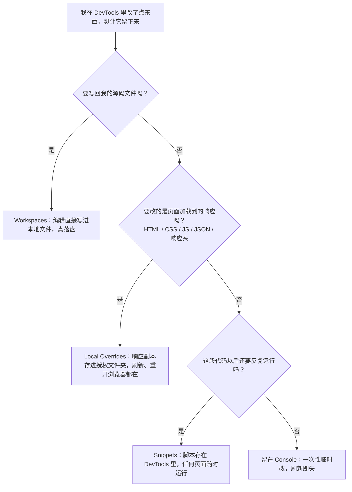

import { Canvas, Controls, Meta } from '@storybook/addon-docs/blocks';
import * as Stories from './persist-edits.stories';

<Meta of={Stories} name="Docs" />

# 修改落盘与复用

前面几课里，你在[查看与修改 CSS](?path=/docs/edit-css--docs) 的 Styles 面板里调过的颜色、在[Console 入门](?path=/docs/console--docs) 里跑过的状态修改命令，都有一个共同的命运：**刷新一下，全部消失**。这不是故障——那些改动只落在「本次加载出来的页面」上，不落在任何存储里。本课专门解决「改动留下来」的问题，核心判断只有一句：**改动会不会留下，取决于它附着在什么对象上**——改运行中的页面，是临时的；改网络响应的副本，跨刷新存活；改本地源文件，才真正落盘；想复用的是一段脚本而不是某次效果，就把它存成 Snippet。

演示页是一个「待修改标本」：横幅卡片配色呆板（出厂灰）、文案过时（还停在 2019 年的 Beta 标语），等你动手改进。标本加载时会发出一个真实的网络请求 `specimen-config.json`——它就是你的覆盖练习对象；标本还把一套脚本 API 挂在全局的 `specimen` 上，供 Console 与 Snippet 调用。readout 始终显示当前生效状态（主题色、标语、相对本次加载、脚本调用次数），刷新后 Overrides 的修改仍在——这正是本课要你亲眼确认的核心证据。

改完的东西想留下来，先判断它是什么：



改动去向速查（Local Overrides（本地覆盖）、Workspaces（工作区）、Snippets（代码片段）都在 Sources（源代码）面板里安家）：

| 去向 | 它保存什么 | 存在哪里 | 刷新后 | 关闭浏览器后 | 写回源码 |
| --- | --- | --- | --- | --- | --- |
| Console 临时改 | 什么都不保存，只改运行中的页面 | 内存 | 消失 | 消失 | 否 |
| Elements / Styles 的改动 | 同上：改的是运行中的 DOM 与样式表 | 内存 | 消失 | 消失 | 否——DOM 不等于 HTML |
| Local Overrides | 被你改过的网络响应副本 | 你授权的本地文件夹 | 仍在 | 仍在 | 否——不映射回你的项目 |
| Workspaces | 你在 Sources 里的编辑本身 | 你的源码文件夹 | 仍在 | 仍在 | 是——`Command/Ctrl+S` 即写盘 |
| Snippets | 脚本本身（不是它产生的效果） | DevTools 本地偏好 | 效果消失，脚本还在 | 脚本还在 | 否——可随时复制出去 |

## 快速上手

演示页的横幅由 `specimen-config.json` 驱动：`accent` 是主题色，`tagline` 是标语，`presets` 是 36 套备选方案。Controls 提供「重置」开关（拨到任意一侧触发一次重置），标本内部还有一个「重置到本次加载状态」按钮，二者等价，供你反复练习。标本把自己的 API 同时挂到了预览 iframe 与顶层窗口——Console 保持默认的 top 上下文就能直接用（真实页面里需要自己切换上下文，见[与页面交互](?path=/docs/command-line-api--docs)讲过的执行上下文下拉）。

<Canvas of={Stories.Specimen} />
<Controls of={Stories.Specimen} />

| 读者操作 | 可观察证据 |
| --- | --- |
| 在 Console 执行 `specimen.applyPreset()` | 横幅立刻换配色与文案；readout「相对本次加载」变为「已修改」、「脚本调用」加一 |
| 再执行几次 `specimen.applyPreset()`，然后点标本上的「重置」 | 方案按列表循环切换；重置后回到出厂灰，「相对本次加载」回到「原样」 |
| 按 `F5` 刷新本页 | 脚本改过的横幅回到加载时的样子——Console 与 Snippet 的改动不跨刷新 |
| Network 面板右键 `specimen-config.json` 选 Override content，改 `tagline` 或 `accent` 后保存并刷新 | 横幅与 readout 显示新值；刷新多次仍在，点「重置」也回不去——覆盖按 URL 生效，删除覆盖文件才恢复 |
| Sources → Snippets 新建脚本、粘贴下方代码并按 `Command/Ctrl+Enter` | Console Drawer（抽屉）打印当前生效状态；重开 Chrome 再运行仍然可用 |
| 打开 Show code | 看到该 Canvas 实际执行的 `editable-specimen.ts` |

最小闭环——先体会「消失」，再体会「留下」：

1. 打开 DevTools（macOS 按 `Command+Option+I`；Windows、Linux 按 `F12` 或 `Control+Shift+I`），切到 Console，执行 `specimen.setTagline('2026，重新出发')`——横幅立即改口。按 `F5`：改动消失。这就是临时改。
2. 在 Elements → Styles 里把 `.editable-specimen__badge` 的颜色改一个值，然后打开 Changes 面板：`Command+Shift+P`（Windows、Linux `Control+Shift+P`）调出命令菜单，输入 changes 选 Show Changes——改动以 diff 形式被记录着，这是「会话内记账本」。按 `F5`：diff 清空，横幅还原。
3. 切到 Network（网络）面板（界面细节见[查看请求](?path=/docs/network--docs)，本课只用「右键单条请求」这一个动作），找到 `specimen-config.json` 请求，右键选 **Override content**（覆盖内容）：首次使用会让你选择一个覆盖文件夹并点 **Allow** 授权——这是 DevTools 第一次向你申请磁盘写权限——然后 DevTools 跳到 Sources 打开响应副本。
4. 把副本里的 `tagline` 改成一句你自己的标语、`accent` 改成 `#0f766e`，按 `Command/Ctrl+S` 保存，刷新页面：横幅换装，readout 显示新值；再刷新、点「重置」，修改都不走。
5. 切到 Sources → Snippets，点 **New snippet** 新建片段，粘贴下方脚本并保存，按 `Command/Ctrl+Enter` 运行：

```js
// 反复运行也不会累积副作用：每跑一次，标本切到下一个备选方案
if (typeof specimen === 'undefined') {
  console.log('这个页面没有标本 API——Snippets 在任何页面都能跑，输出随页面上下文变化。');
} else {
  specimen.applyPreset();
  console.log('[Snippet] 当前生效：', specimen.state());
}
```

6. 到别的网站开个新标签页再运行同一段 Snippet：打印的是兜底消息——脚本本体跨页存活，效果只属于有这个 API 的页面。回到本课 Docs 页，刷新之后 Snippet 依然可用。

三条主小节分别展开：Local Overrides 怎么管，Workspaces 怎么落盘，Snippets 怎么复用。

## 临时改

Console 求值、Elements 里增删的节点、Styles 里改的规则、Sources 里编辑过但没接 Workspaces 的文件——它们的宿主都是「本次加载出来的页面状态」。刷新会重建页面，宿主没了，改动跟着消失。所以临时改不是需要避免的错误用法，而是最快的试错路径；要避免的只是「误以为它已经存下来了」。

**Changes 面板**（更改面板）是临时改的记账本：它汇总你在 DevTools 里对 CSS（Styles 或 Sources）、JavaScript（Sources）以及 HTML（Sources 编辑，需先启用 Local Overrides）的手动改动，自动 pretty-print（美化排版）后以 diff 呈现，不用横向滚动就能看清每行变化。打开方式：命令菜单输入 changes 选 Show Changes，或 DevTools 右上角菜单 **More tools → Changes**，默认落在底部 Drawer。左侧选中文件查看 diff；Styles 里的 CSS 改动可点面板底部的复制按钮一键带走；**Revert all changes made to the current file**（还原对当前文件的所有更改）一键还原。

可观察证据（标本会话）：在 Styles 面板把 `.editable-specimen__badge` 的 `background` 改成任意值——Changes 立即出现一条对应的 diff（按样式表分组）；按 `F5`，diff 清空，横幅回到加载时的样子。注意 Console / Snippet 对标本的脚本改动（如 `specimen.setAccent()`）不会被 Changes 记录——Changes 只记账 DevTools 界面里的人工编辑，脚本改的东西看 readout。

## Local Overrides：跨刷新覆盖

Local Overrides（本地覆盖）把「每次都改一遍」变成「改一次，一直生效」：你在 DevTools 里对某条网络响应做的修改，会保存为一份副本文件存进你授权的文件夹；此后只要页面再请求同一 URL，DevTools 就直接回这份本地副本，网络上的原响应不再出场。它最适合的场景：后端没改完先验证前端、mock 接口与第三方资源、给不受你控制的页面「做手术」。一个重要的副作用：**启用 Overrides 会自动禁用缓存**——每个请求都真实发出，覆盖才能拦住它。

主线流程（标本会话）——把过时文案和呆板配色换掉：

1. Network 面板筛选出 `specimen-config.json`，右键请求选 **Override content**。
2. 首次使用：动作条提示选择覆盖文件夹——选一个专用文件夹（如 `~/devtools-overrides`），点 **Allow** 授权。
3. DevTools 跳到 Sources → Overrides 并打开响应副本：把 `tagline` 改成新标语，`accent` 改成你选的颜色（保持 JSON 合法，写坏了的后果见常见问题）。
4. `Command/Ctrl+S` 保存副本，刷新页面——横幅换装，readout 与新值一致；反复刷新、点「重置」，修改都在。
5. 恢复出厂：Sources → Overrides 里右键该文件选 **Delete**（确认后不可逆），或点 **Clear** 清空全部覆盖，或取消勾选 **Enable Local Overrides** 临时停用。

覆盖状态在哪里看：

| 位置 | 看什么 |
| --- | --- |
| Network 面板 Response / Headers 标签旁的紫点 | 该请求的内容 / 响应头正在被覆盖 |
| Sources → Overrides | 全部覆盖文件：勾选框启停、Clear 一键清空、右键 Delete 单删 |
| Network 里右键请求 → Show all overrides | 列出命中该请求的所有覆盖文件 |
| 覆盖文件编辑器里右键 → Open in containing folder | 拿自己的编辑器修改这份副本 |
| Changes 面板 | 本次会话全部改动的 diff 汇总 |

### 覆盖响应头

**Override headers**（覆盖响应头）与内容覆盖同一套机制，改的是 HTTP 响应头而不是正文——最常见的是在没有服务器权限时加 `Access-Control-Allow-Origin` 解 CORS（跨源资源共享）问题，或调整 Permissions-Policy、跨域隔离头。入口同样是 Network 里右键请求。编辑器里点值直接改，**Add header** 加一条，删掉一条即还原原始值；修改过的头显示绿色，被移除的显示红色删除线。点 Response Headers 旁的 **.headers** 可以在单个文件里编辑全部规则，支持通配符匹配 URL（`*` 任意多字符、`?` 单个字符），`Command/Ctrl+S` 保存后刷新生效。

### 什么盖不住

- Elements 里的 DOM 改动永远不会被保存——被覆盖的是「网络给了页面什么」，DOM 是页面吃进去之后加工出来的结果（Workspaces 一节细说）。
- Styles 面板的 CSS 改动要能持久，前提是样式来自一个真实文件。标本的样式由脚本注入 `<style>` 标签（构造出来的样式表，没有文件可映射），所以本标本的持久化练习走 JSON 覆盖；内联在 HTML 里的样式同理，要改 HTML 副本本身。
- 带着可靠 source map（源码映射）的打包文件，点 Override content 时 DevTools 会弹窗把你引向原始源文件——该覆盖源头，而不是覆盖产物。

网络侧还有节流、阻断请求等更多控制手段，属于 Network 的领地，见[控制请求](?path=/docs/network-overrides--docs)；本课只关心「改了能不能留下来」。

## Workspaces：写回源码

Workspaces（工作区）把 Sources 面板变成你的编辑器：在 Sources → Workspace（工作区）标签里授权一个本地文件夹后，DevTools 与磁盘上的真实文件建立双向映射——你在编辑器里的修改，按 `Command/Ctrl+S` 就写进源文件。它与 Local Overrides 的本质区别：Overrides 存的是**响应副本**、不映射回你的项目；Workspaces 保存的是**编辑本身**、直接落盘。文件名旁的绿点表示该文件已成功映射到磁盘。

这一节没有 Canvas：授权本地文件夹、起本地服务器，都是演示页无法替你完成的动作，步骤需要自己动手。课程目录里备好了 `workspaces-lab/`（`index.html`、`styles.css`、`script.js`，延续同一个「待改进标本」的思路）：

1. 把练习场复制到任意本地文件夹：`cp -R cheatsheets/persist-edits/workspaces-lab ~/workspaces-lab`（Windows 用资源管理器复制即可）。
2. 起一个静态服务器并打开页面：`cd ~/workspaces-lab && python3 -m http.server 8000`，浏览器访问 `http://localhost:8000`。
3. DevTools → Sources → Workspace → **Add folder manually**，选择同一个文件夹，弹窗点 **Edit files** 授权；也可以直接把文件夹拖进 Sources 面板。
4. 确认 Workspace 树里三个文件旁都出现绿点（映射成功）。
5. 照下表完成三个练习点，每个都按 `Command/Ctrl+S` 保存：

| 练习点 | 在哪改 | 落盘证据 |
| --- | --- | --- |
| 徽标配色 | Sources 编辑器或 Styles 面板，改 `styles.css` 里 `.lab__badge` 的 `background` | 保存后 CSS 立即生效；用自己的编辑器打开或 `cat styles.css`，磁盘内容真的变了 |
| 过时文案 | Sources 编辑器，改 `index.html` 的横幅标题 | 保存后**刷新页面**生效；磁盘上的 HTML 已更新 |
| 写死的年份 | Sources 编辑器，改 `script.js` 的 `stamp()`（提示写在文件注释里） | 保存后**刷新页面**生效——DevTools 不会替你重跑已经执行过的脚本 |

三类文件的生效时机（Workspaces 回查表）：

| 文件 | 生效方式 |
| --- | --- |
| CSS | 改动立即应用到页面，保存即写盘，无需刷新 |
| JavaScript | `Command/Ctrl+S` 写盘；页面里的旧脚本不会自动重跑——刷新页面，或让 dev server 的热更新接管 |
| HTML | 在 Sources 编辑并保存，然后刷新页面生效；Elements 里的 DOM 改动不算数 |

回查点：

- **自动连接**：本地服务器在 `/.well-known/appspecific/com.chrome.devtools.json` 路径下提供 `{"workspace": {"uuid": "<随机 v4 UUID>", "root": "<项目根>"}}` 时，Workspace 标签会直接出现 **Connect** 按钮——不少框架工具已按此协议自动接好工作区。
- **断开与管理**：右键 Workspace 里的文件夹选 **Remove from workspace**（需再确认一次）；已授权文件夹统一在 Settings → Workspace 管理。练习结束记得移除——你授权的是对真实磁盘的写权限。
- **框架与打包项目**：DevTools 靠 source map 把打包产物对回源文件；出现「改了 A 文件、生效的却是 B」的映射错乱时，先检查 source map 是否可靠。
- **为什么 Elements 的 DOM 改动永远落不了盘**：DOM 树是 HTML 被浏览器加载后，经过 CSS（如 `content` 属性）与 JavaScript 加工的结果——「DOM 树不等于 HTML」，DevTools 无法从 DOM 反推回源 HTML。要把改动留给下一次加载，改的必须是 Sources 里的源文件，或让加载来源本身被覆盖（Local Overrides）。

## Snippets：保存与复用脚本

Console 里手打的脚本不会留下——Snippets（代码片段）解决的就是这件事：把「以后还会再跑」的脚本存在 DevTools 里，随时对任何页面运行（包括无痕窗口）。运行时它拥有页面完整的 JavaScript 上下文：页面变量、`$`（查询元素）等 Console 工具都能直接用。官方把它定位为 bookmarklet（小书签脚本）的现代替代。存放位置是 DevTools 的本地偏好——不进文件系统、不随设置同步，换浏览器配置文件或换电脑都不在。

| 操作 | 做法 |
| --- | --- |
| 新建 | Sources → Snippets → **New snippet** → 输入名字 → `Enter` |
| 保存 | 编辑器里 `Command/Ctrl+S`；名字旁出现星号 `*` 表示有未保存改动 |
| 运行 | 打开片段，点编辑器底部动作条的 **Run**，或按 `Command/Ctrl+Enter` |
| 从命令菜单运行 | `Command/Ctrl+O`，输入 `!` 加片段名 → `Enter` |
| 重命名 / 删除 | 右键片段名 → **Rename** / **Delete** |

可观察证据（标本会话）：快速上手第 5 步的片段，在标本上每运行一次，横幅切到下一个备选方案、Console Drawer 打印当前 `state()`；按 `F5` 刷新——横幅回到加载状态（效果消失），Snippets 列表里脚本原样还在，再按一次 `Command/Ctrl+Enter` 照样运行。到任意其他网站运行它，打印的是兜底消息——脚本本体跨页存活，效果只属于所在页面。

边界：

- Snippet 保存的是脚本，不是效果。它不改变页面加载什么（那是 Local Overrides 的领地），也不写任何文件（那是 Workspaces 的领地）。
- 想让脚本进版本库、跨团队共享：把它复制出去提交到仓库；Snippet 本体永远只活在这台浏览器的这份 DevTools 偏好里。

## 最佳实践

- **先想清楚「留下来」的对象，再动手改。** 速查：要改回源码 → Workspaces；要 mock 接口或第三方响应 → Local Overrides；要反复运行的脚本 → Snippets；一次性验证 → 留在 Console。动手前十秒的判断，省掉事后「我的修改去哪了」的十分钟。
- **临时改先行，落盘确认后跟上。** 快速试错本来就该发生在不落盘的层面（Console、Styles、断点现场的 Scope）；方向确认后，再选合适的路径把改动固化——验证要便宜，固化要准确。
- **把 Overrides 文件夹当草稿，别当源码。** 用专用文件夹（如 `~/devtools-overrides`）并定期 Clear；覆盖副本不映射回项目、不进版本库，长期 mock 应该用真正的 mock 方案——否则它会静默地在每次刷新里顶替真实响应。
- **Workspaces 授权最小化。** 只 Add 真正需要的文件夹，练完 Remove from workspace；对源文件的写权限值得谨慎。
- **同一段 Console 脚本手打第二遍时，存成 Snippet。** 这是成本最低的复用习惯：试错在 Console，沉淀在 Snippets。
- **收工前过一遍 Changes。** 它是本次会话全部改动的 diff 总账：需要带走的复制出来，不该保留的 Revert，然后决定哪些走 Local Overrides、哪些走 Workspaces。

## 常见问题

- Override content 改完刷新，页面没有变化。
  按序排查：副本编辑器里是否按过 `Command/Ctrl+S`——名字旁的星号没消失就是没保存；Sources → Overrides 的 **Enable Local Overrides** 是否被取消勾选；覆盖按 URL 匹配，确认改的是同一条请求的副本；改动把 JSON 写坏了会让标本「加载失败」（readout 可见，Console 有警告）——修复语法，或删除覆盖文件。
- 点了「重置」，有的修改被清掉了，有的还在。
  「重置」只回到本次加载到的配置：Console / Snippet 的临时改会被清掉；覆盖改变的就是「加载」本身，所以重置救不回——要恢复出厂值，到 Sources → Overrides 删除覆盖文件或点 Clear。
- Console 里输入 `specimen` 提示 undefined。
  两种情况：标本配置还没加载完成（readout 显示加载中），或离开过本课 Docs 页——预览 iframe 被销毁时标本会摘掉自己的 API，回到本课页面重新进入即可。也可以把 Console 左上角的执行上下文下拉切到预览 iframe，那里挂着同一套 API。
- Workspaces 里改了 CSS，磁盘上的文件没变。
  确认编辑的是 Workspace 树里带绿点的文件（Page 树里的同名文件不属于映射）；确认按了 `Command/Ctrl+S`；在 Elements 里改的是 DOM，永远不会写盘——回 Sources 编辑器改；框架项目里映射错乱先怀疑 source map。
- Snippet 换台电脑或换个浏览器配置文件就不见了。
  正常现象：Snippet 存在 DevTools 本地偏好里，不进文件系统、不随账号同步。需要长期保留，把它复制进仓库或笔记。

## 总结回顾

摘要：

DevTools 里的一切手动改动，命运由它附着的对象决定：改运行中的页面（Console、Elements、Styles）是临时的，Changes 面板替本次会话记账，刷新即清零；Local Overrides 把你改过的网络响应存成授权文件夹里的副本，此后同 URL 的请求一律回本地副本——刷新、重开浏览器都在，重置救不回，只有删除覆盖文件才恢复；Workspaces 在 Sources 与本地源文件之间建立双向映射，`Command/Ctrl+S` 直接写盘，CSS 即改即生效，JavaScript 与 HTML 保存后刷新生效，而 Elements 里的 DOM 改动因为「DOM 树不等于 HTML」永远落不了盘；Snippets 把反复要用的脚本存在 DevTools 本地偏好里，运行时拥有页面完整上下文、任何页面可跑，保存的是脚本本体而非效果。四条路径回答同一个问题：改动想留下来，就得存到对的地方。

一句话：

> DevTools 没有「保存」按钮——改动会不会留下，取决于它落在运行中的页面、响应的副本，还是源码文件上；想复用脚本而不是某次效果时，存成 Snippet。

知识要点：

- 四种去向各自保存什么对象？存在哪里？刷新后、关闭浏览器后分别剩什么？
- 如何在 Network 里对一条请求做 Override content？为什么启用 Overrides 会自动禁用缓存？
- Sources → Overrides 如何启用、启停、清空、删除单个覆盖？哪些改动盖不住？
- 覆盖响应头怎么改？`.headers` 文件的通配符规则是什么？
- Workspaces 如何建立映射？CSS / JavaScript / HTML 保存后各在何时生效？为什么 Elements 的 DOM 改动永远不落盘？
- Snippet 如何新建、保存、运行？脚本本体与运行效果各自的存活范围是什么？
- Changes 面板记录什么？如何打开、复制与还原改动？

## 参考资料

- [Edit files with Workspaces](https://developer.chrome.com/docs/devtools/workspaces)
- [Override web content and HTTP response headers locally](https://developer.chrome.com/docs/devtools/overrides)
- [Run snippets of JavaScript](https://developer.chrome.com/docs/devtools/javascript/snippets)
- [Sources panel overview](https://developer.chrome.com/docs/devtools/sources)
- [Changes: Track your HTML, CSS, and JavaScript changes](https://developer.chrome.com/docs/devtools/changes)
