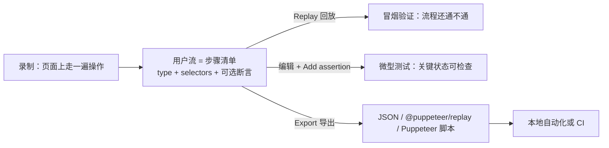

import { Canvas, Controls, Meta } from '@storybook/addon-docs/blocks';
import * as Stories from './recorder.stories';

<Meta of={Stories} name="Docs" />

# 录制与回放用户流

前面课程里的 DevTools 面板大多在帮你「看」页面；这一课换成「记」：Recorder（录制器）把你在页面上做的一串操作录成一份结构化的步骤清单，然后可以在面板里回放、打断点、编辑步骤、加断言，或整体导出成 JSON 与 Puppeteer 脚本。本课的核心判断只有一句：**Recorder 录下的不是操作录像，而是步骤清单——每一步都有类型、选择器和可选断言，所以同一条用户流可以同时当回放冒烟、微型测试和自动化脚本的起点用**。调试对象也因此不同：断点调试类课程调试的是 JS 执行，Animations 面板回放的是动画，这里回放的是「用户操作流」；Puppeteer / Playwright 生态本身在路线末尾的「协议与自动化」一课展开。



| 项 | 默认 / 取值 | 回查要点 |
| --- | --- | --- |
| 打开方式 | More options → More tools → Recorder；命令菜单输入 recorder | 面板名 Recorder（录制器），仅 Chrome 提供 |
| 产物 | 用户流（user flow）：`{ title, steps }` 的 JSON | 每步有 type、selectors、可选断言 |
| 自动补的步骤 | `setViewport` + `navigate` | 回放时 `navigate` 先重载页面 |
| 回放速度 | Normal（默认）/ Slow / Very slow / Extremely slow | 顶栏速度下拉 |
| 断言步骤 | `waitForNode`（Chrome 133 前为 `waitForElement`）、`waitForExpression` | 等元素出现 / 等表达式为真 |
| 选择器优先级 | 自定义属性 → `data-testid` 等测试属性 → ARIA → CSS → XPath → Pierce | Pierce 可穿透 shadow DOM |
| 导入 | 仅 JSON | 导出的脚本导不回来 |
| 导出 | JSON / @puppeteer/replay / Puppeteer 系列 + 扩展格式 | 见「导出自动化脚本」 |

一条边界先画清楚：Recorder 挂在当前标签页上录制真实交互，下面的演示页只是靶场——它不会被 Recorder 自动驱动，你要先手动走一遍流程，再让 Recorder 回放这一遍。演示页所有交互元素都带 `data-testid`，复位的入口有两个：Controls 的「重置」开关和页上的重置按钮。

## 快速上手

<Canvas of={Stories.Specimen} />
<Controls of={Stories.Specimen} />

| 读者操作 | 可观察证据 |
| --- | --- |
| 在标本上走完流程：输入姓名 → 选场次 → 勾选同意 → 提交 | 「流程进度」五个标记逐个点亮，「提交结果」变为「已提交：…」，表单下方出现成功面板 |
| 漏掉一步直接点提交 | 「提交结果」报「校验失败：…」，缺哪步写哪步，成功面板不出现 |
| Controls 向任一方向切换「重置」 | 输入清空、成功面板隐藏、「流程进度」归零 |
| 打开 Show code | 看到该 Canvas 实际执行的 `form-specimen.ts`——所有交互元素都带 `data-testid` |

最小闭环——把「录 → 回放 → 改」走一遍：

1. 打开 DevTools → More options（⋮）→ **More tools → Recorder**（或命令菜单 `Ctrl/Cmd + Shift + P` → Show Recorder）。
2. 点 **Start new recording**，命名「报名流程」，点 **Start recording**。步骤列表里自动出现 `setViewport` 与 `navigate` 两步。
3. 在标本上走完流程：输入姓名 → 选场次 → 勾选同意 → 提交。每一步实时落进步骤列表；录完点 **End recording**。
4. 点 **Replay**：Recorder 先执行 `navigate` 重载页面（演示页随之回到初始态），再自动走完五步，成功面板再次出现。
5. 改一步试试：Controls 切一次「重置」，删掉步骤列表里的勾选一步（右键 → **Remove step**），再 **Replay**——「提交结果」变成校验失败。这条失败读数就是下一节「编辑与断言」的入口。

对整个 Storybook 标签页录制即可：本手册的实例直接渲染在 Docs 页面的文档流里，不涉及额外框架处理；若你的环境把演示页嵌在 `iframe` 里，步骤会以 `frame` 属性标识嵌套框架，对顶层页面录制与回放照常覆盖。

## 录制用户流

Recorder 把当前标签页上的真实交互逐步翻译成步骤对象：你在页面上操作，步骤列表里同步落步。它对元素有等待机制——会等到元素可见、可点击，或尝试自动滚动到元素，所以页面的滚动位置基本不用管。录完的产物叫用户流（user flow）：顶层是 `{ title, steps }`，`steps` 是步骤对象的数组——这正是后面一切回放、编辑、断言、导出的操作对象。

导出的用户流 JSON 长这样（节选，略去勾选与断言步骤）：

```json
{
  "title": "报名流程",
  "steps": [
    { "type": "setViewport", "width": 1280, "height": 720 },
    { "type": "navigate", "url": "http://localhost:6006/?path=/docs/recorder--docs" },
    {
      "type": "change",
      "selectors": [["aria/姓名"], [".form-specimen__name"]],
      "value": "林晓"
    },
    {
      "type": "click",
      "target": "main",
      "selectors": [["aria/提交报名"], ["text/提交报名"], [".form-specimen__submit"]]
    }
  ]
}
```

`selectors` 是备选数组：Recorder 按顺序逐个尝试，前面的命中就用它；编辑时可以删掉不稳的备选、留下最稳的一条。普通文本输入只落成一步 `change`，值是最终输入；特殊按键（如 Enter）才出现 `keyDown` / `keyUp`。hover 这类不改变页面状态的操作不会被自动录制——需要时手动补步骤（见「编辑与断言」）。

### 步骤类型

| type | 什么时候产生 | 关键属性 |
| --- | --- | --- |
| `setViewport` | 自动补，每条一条 | width、height |
| `navigate` | 页面加载 / 跳转 | url |
| `click` / `doubleClick` | 点按 | selectors、offset |
| `change` | 输入框、下拉、复选框的值变化 | selectors、value |
| `keyUp` / `keyDown` | 特殊按键（如 Enter） | key |
| `hover` | 不会自动捕获，手动补 | selectors |
| `scroll` | 滚动页面或元素 | selectors 或 x / y |
| `waitForNode` | 断言：等元素出现，可加可见性、属性、数量条件 | selectors |
| `waitForExpression` | 断言：等 JS 表达式为真 | expression |
| `close` | 关闭页面 | — |

`waitForNode` 是 Chrome 133 起的新名字，取代已弃用的 `waitForElement`——旧 JSON 里的 `waitForElement` 仍能回放，只是新加断言会生成 `waitForNode`。步骤上还可挂 `assertedEvents`（目前只支持导航事件）；`frame` 属性用零基下标数组标识嵌套 `iframe`（如 `[1, 0]` = 主页面里第二个 `iframe` 内的第一个 `iframe`）。

### 选择器策略

Recorder 默认按这个优先级生成备选选择器：

1. 录制前在面板顶部指定的自定义 Selector attribute（选择器属性）
2. 常见测试属性：`data-testid`、`data-test`、`data-qa`、`data-cy` 等
3. ARIA 语义（`aria/…`）
4. id 与普通 CSS
5. XPath
6. Pierce（可穿透 shadow DOM）

结论先给：**录制前定选择器策略，比录完再修划算得多**。本手册标本的所有交互元素都带 `data-testid`——录制前把面板顶部的 **Selector attribute** 填成 `data-testid`（或直接依赖默认的常见测试属性识别），录完展开任一步骤核对 `selectors`，再对照 Show code 里的实现。稳定性有个现成判断：换一次页面结构再回放，`aria/` 与 `data-testid` 基本不动，位置型选择器（`nth-child`、深层 CSS 路径）最容易碎。

已录的步骤也能修：展开步骤直接改选择器文本（如改成 `aria/提交报名`）；点 **Select** 后到页面上重新点元素、重新生成；多余的备选悬停后点 `-` 删除——`selectors` 反正按序尝试，留一条最稳的即可。

## 回放与断点

回放把整条清单原样执行一遍：点 **Replay**，回放进度显示在面板里。两个常用旋钮：顶栏速度下拉 **Normal（默认）/ Slow / Very slow / Extremely slow**，看不清就放慢；**Replay settings**（回放设置）里的 timeout 控制单步等待上限。

断点把回放变成流程调试：悬停步骤左侧的圆圈，变成断点图标后点击；再点 **Replay**，回放停在断点这一步。停住时页面就停在「这一步刚要执行」的真实状态——用 **Execute one step**（执行一步）逐格走，**Cancel replay** 中途取消。

可观察证据（标本会话）：在「提交」步骤前打断点 → 回放停在提交前，页面上的「当前值」读数显示已填的姓名与场次、成功面板还没出现 → **Execute one step** 走过提交，「提交结果」读数立即更新。它比日志验证直观的地方就在这：断点停在哪一步，页面状态就一目了然。

## 编辑与断言

步骤清单是可编辑的，这正是「录制」区别于「录像」的地方：

- **加步骤**：目标步骤的三点菜单 → **Add step before**（在此之前添加步骤），新步骤默认类型是 `waitForNode`，改成 `hover`、`scroll` 等再用 **Select** 选元素。hover 不自动录，就靠这步手动补。
- **删步骤**：右键或三点菜单 → **Remove step**。
- **改属性**：展开步骤直接改值、选择器、timeout、delay 等。

断言让回放「自己判断对错」：点 **Add assertion**（添加断言），两种选择——`waitForNode` 等元素出现（可加可见性、属性、数量条件），`waitForExpression` 等一个 JS 表达式为真。断言加在「页面应该变而没变就说明坏了」的位置，而不是每步都加。

可观察证据（标本会话）：

1. 提交步骤后加断言 `waitForNode`，选择器指向 `data-testid="success-panel"`（或用 `waitForExpression` 等成功面板文本包含「报名成功」）→ 回放走完，最后一步的「成功」标记点亮，断言通过。
2. 删掉勾选一步再加同一条断言 → 回放走到提交后失败：成功面板没出现，页面上的「提交结果」读数报「校验失败：还没有勾选同意」。校验失败路径就是断言替你抓到的回归。

## 度量用户流

**Measure performance** 按钮：先自动回放一遍用户流，再把轨迹打开在 Performance 面板——把轨迹分析方法直接接到「一条用户流」上：慢在哪个请求、哪段脚本，轨迹里看。建议先在 Performance 面板的设置里勾选 **Web Vitals** 复选框，轨迹里会直接标出 LCP、CLS 等指标；轨迹怎么读，见[录制与分析轨迹](?path=/docs/performance-traces--docs)。

两种读法分清：回放回答「流程通不通」，度量回答「流程快不快」——同一份步骤清单，两个视角。

## 导出自动化脚本

导出菜单在面板顶部 **Export** 图标下，内置格式与用途：

| 导出格式 | 得到什么 | 适合 |
| --- | --- | --- |
| JSON 文件 | 用户流本身（`{ title, steps }`） | 正本：可再导入 Recorder，入库维护 |
| @puppeteer/replay 脚本 | 引用 `@puppeteer/replay` 库的脚本 | 想在 Node 里回放或继续加工 |
| Puppeteer | 纯 `puppeteer` 脚本 | 直接进现有 Puppeteer 项目 |
| Puppeteer 变体 | for Firefox / including Lighthouse analysis | 跨浏览器回放 / 回放同时跑 Lighthouse 分析 |

右键单个步骤也有 **Copy as …**（JSON / Puppeteer / @puppeteer/replay），不必整条导出。方向性先记住：**导入只认 JSON**——导出的脚本改完导不回 Recorder，所以脚本当产物、JSON 当正本。

菜单里没有的格式靠扩展：安装 Recorder 扩展后导出菜单会多出对应条目（社区的 Playwright 导出扩展即如此），自写导出扩展的接口见官方扩展文档。

`@puppeteer/replay` 是官方的回放与代码生成库，两种用法。CLI——拿到 JSON 直接回放，默认无头运行，`--headless false` 开有头看过程：

```bash
npx @puppeteer/replay recording.json
```

编程——`parse` 建清单、`createRunner` 建执行器、`stringify` 生成脚本：

```ts
import { createRunner, parse } from '@puppeteer/replay';

const recording = parse(JSON.parse(recordingText));
const runner = await createRunner(recording);
await runner.run();
```

想接自己的逻辑（每步截图、对接第三方库）继承 `PuppeteerRunnerExtension`；想把用户流转成其他测试框架的脚本，继承 `PuppeteerStringifyExtension`——Cypress、Nightwatch、WebdriverIO 的转换器就是这么来的。

## 最佳实践

- **先定选择器策略再录制。** 给被测元素统一 `data-testid`（或在面板顶部指定 Selector attribute），生成稳定的选择器；事后修脆选择器花的工夫远大于录制前几秒的设置。
- **一条流只做一件事。** 流程越长，编辑、断点和失败定位越贵；把「登录 → 下单」拆成两条流，回放顺序用 JSON 或测试框架编排。
- **断言放在状态变化点。** 只在「页面应该变而没变就说明坏了」的位置（成功面板出现、跳转发生）加 `waitForNode` / `waitForExpression`，不要每步都断。
- **JSON 是正本，脚本是产物。** 导出的脚本改完导不回 Recorder；把用户流 JSON 入库维护，需要定制时在 `@puppeteer/replay` 的脚本侧生成或回放。
- **回放失败先看状态，再换选择器。** 保留自动补的 `navigate` 步骤让页面回到初始态；靶场停在「已提交」态时先重置再回放。

## 常见问题

- 明明悬停过某个元素，步骤列表里却没有对应步骤。
  Recorder 不自动捕获 hover 事件。在目标位置的三点菜单选 **Add step before**，类型改成 `hover`，再用 **Select** 在页面上点选该元素。
- 回放到某一步失败，提示找不到元素。
  先看状态，再换选择器：回放开头没有 `navigate` 时页面可能停在「已提交」态，用重置复位或保留 `navigate` 步骤；选择器太脆（`nth-child`、动态 id）时，把 Selector attribute 设为 `data-testid` 重录，或展开该步用 **Select** 重新点选元素。
- 导出的 Puppeteer 脚本想再导回 Recorder 编辑。
  导不回去——导入只认 JSON。编辑要么在 Recorder 里改步骤，要么直接改 JSON 文件再导入；脚本视为一次性产物。
- 步骤类型里找不到 `waitForElement`，老流程打开却有。
  Chrome 133 起 `waitForElement` 已弃用、改名为 `waitForNode`，行为不变：旧 JSON 里的 `waitForElement` 仍能回放，新加断言会生成 `waitForNode`。

## 总结回顾

摘要：

Recorder 把页面上的真实操作录成一份结构化步骤清单：每步带类型、备选选择器与可选断言，自动补 `setViewport` 与 `navigate` 两步；清单可以在面板里回放（四档速度、断点停步、单步执行），也可以编辑（加删步骤、改选择器、手动补 hover）并加 `waitForNode` / `waitForExpression` 断言；Measure performance 把清单回放一遍并在 Performance 面板打开轨迹。导出端，JSON 是唯一可再导入的正本，`@puppeteer/replay` 提供 CLI 与编程回放，Puppeteer 系列脚本是一次性产物，其他格式（如 Playwright）走扩展。选择器策略决定清单的寿命：录制前定好 `data-testid` 一类稳定属性，比事后修脆选择器划算。

一句话：

> Recorder 录下的是可编辑的步骤清单，不是操作录像——清单可回放、可断言、可编辑，也能整体导出成自动化脚本的起点。

知识要点：

- Recorder 的产物是什么形状？自动补哪两步？
- 哪些交互不会被自动录制？补上它们的入口在哪？
- 选择器按什么优先级生成？为什么录制前要设 Selector attribute？
- 回放怎么调速？断点怎么打？停住后怎么单步执行？
- 怎么加、删、改步骤？Add assertion 提供哪两种断言，各等什么？
- `waitForNode` 与 `waitForElement` 是什么关系？
- Measure performance 做什么？它把哪个面板接进来？
- 内置导出格式有哪几种？哪种能重新导入 Recorder？
- `@puppeteer/replay` 的 CLI 与编程入口分别是什么？想转出其他测试框架的脚本靠什么机制？

## 参考资料

- [Record, replay, and measure user flows](https://developer.chrome.com/docs/devtools/recorder)
- [Recorder features reference](https://developer.chrome.com/docs/devtools/recorder/reference)
- [Customize the Recorder with extensions](https://developer.chrome.com/docs/devtools/recorder/extensions)
- [@puppeteer/replay](https://github.com/puppeteer/replay)
