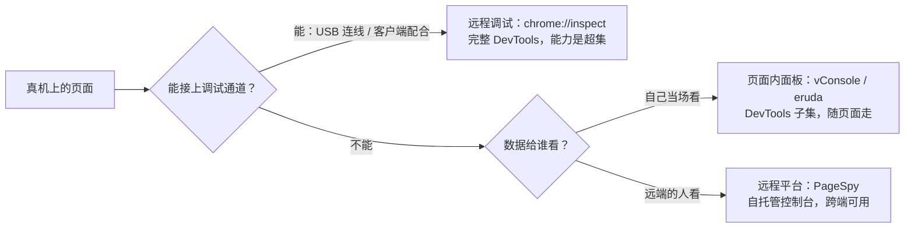

import { Canvas, Controls, Meta } from '@storybook/addon-docs/blocks';
import * as Stories from './remote-debugging.stories';

<Meta of={Stories} name="Docs" />

# 远程与移动端调试

桌面模拟的 Device Mode 让 Chrome 假装成手机；这一课处理假装不出来的部分——真机。核心判断只有一句：**真机调试只有两条路线——远程调试把真机页面的调试通道接到桌面 DevTools 上，换来完整能力，但要求连得上；页面内调试把迷你调试面板打进页面里，换来随时随地可用，但能力只是子集**。能不能连上调试通道、页面跑在哪、数据给谁看，这三个问题的答案决定了走哪条路线、用哪个工具。



演示页是一个「方案选型器」：`chrome://inspect` 的连接过程——插 USB 线、手机上的授权弹窗、设备发现——无法在 Storybook 页面里复现，所以演示页不做假连接。Controls 选择调试场景，画布在决策树上高亮该场景的路线，readout 给出推荐方案、接入方式与关键局限；每个方案的完整工作流在后面两个主题小节里。

边界先画清楚：桌面上的设备模拟见[设备与网络模拟](?path=/docs/device-mode--docs)——模拟是一阶近似，真机复核就是本课的任务；Node 调试本课只给 `chrome://inspect` 里的入口，CDP 与 Puppeteer/Playwright 的关系在[协议与自动化](?path=/docs/devtools-protocol--docs)展开。

## 调试方案选型

两条路线的分工：**远程调试**中，桌面 DevTools 与真机页面之间是一条调试通道（USB 或网络），DevTools 的 Elements、Console、Network、Performance 全部作用在真机页面上——能力完整，但通道本身有前提。**页面内调试**中，工具就是页面的一部分：vConsole、eruda 把迷你面板渲染在页面里，PageSpy 把运行数据传到远端控制台——不受设备与连接限制，代价是接入代码随页面发布。

<Canvas of={Stories.Picker} />
<Controls of={Stories.Picker} />

| 读者操作 | 可观察证据 |
| --- | --- |
| Controls 切换「调试场景」 | 决策树上该场景走过的判断节点与推荐叶子按路线着色（远程蓝 / 页面内绿 / 远程平台紫），其余节点变灰 |
| 看 readout 三行 | 「推荐方案」「接入方式」「关键局限」给出该场景可直接照做的结论；场景选「微信等 App 内网页」或「现场无连线」时，叶子副标签在 vConsole / eruda 间切换 |
| 打开 Show code | 看到该 Canvas 实际执行的 `scenario-picker.ts` |

五个场景的完整选型速查表：

| 场景 | 推荐方案 | 接入方式 | 关键局限 |
| --- | --- | --- | --- |
| Android 手机上的 Chrome 页面 | `chrome://inspect` | 手机开 USB 调试 → 桌面勾选 Discover USB devices → Inspect | 需要 USB 连线与手机端授权 |
| App 内嵌 WebView（Android） | `chrome://inspect` + WebView 调试 | 客户端调 `WebView.setWebContentsDebuggingEnabled(true)`，其余同上 | 开关对应用内所有 WebView 生效，发布版需运行时控制 |
| 微信等 App 内网页（未开 WebView 调试） | vConsole | `npm install vconsole` → `new VConsole()`，或 CDN script 后取 `window.VConsole` | 迷你面板是 DevTools 的子集；调试代码随页面发布 |
| 现场无连线的自有页面 | eruda | CDN `<script src="https://cdn.jsdelivr.net/npm/eruda"></script>` → `eruda.init()` | 同为 DevTools 子集；建议按 URL 参数等条件加载 |
| 远程协助他人 / 跨地区协作 | PageSpy | 自托管 page-spy-api（Node / Docker）→ 页面接入 SDK 加入同一 Room | 需要部署服务端；数据经 SDK 转发，只能查看不能操控 |

## chrome://inspect 真机调试

`chrome://inspect` 是 Chrome 的一个内部页，扮演桌面 DevTools 与远程目标之间的「调试总机」：勾选发现方式（USB 设备 / 网络目标）后，它列出目标上所有可调试的页面、WebView 与扩展，每一项都能点 Inspect 打开一个**独立的 DevTools 窗口**。窗口里的面板能力与桌面调试一致，唯一差别是实例版本跟随被调试端的 Chrome——手机 Chrome 是旧版，远程窗口里就不会有新面板。

### 连接 Android 真机

把 Android 手机的页面接到桌面 DevTools，一共四步：

1. 手机进入 设置 → 开发者选项 → 启用 **USB debugging**（USB 调试）。
2. 电脑 Chrome 打开 `chrome://inspect#devices`，勾选 **Discover USB devices**（发现 USB 设备）。
3. USB 线直连电脑；首次连接手机会弹出调试授权确认，点允许——设备型号出现在列表里即连接成功。
4. 点目标页面旁的 **Inspect**：独立 DevTools 窗口弹出，Elements、Console、Network、Performance 从此都作用在真机页面上。

两个顺手的入口：列表上方的 **Open tab with url** 输入框填 URL 点 Open，直接在手机上新开标签页，省去在手机上打字；**Toggle Screencast**（屏幕投影）把手机画面投进 DevTools——点击变成触摸事件、电脑键盘直接输入到设备、按住 Shift 拖动是双指缩放、滚轮滚动页面。投影只显示页面内容，页面外的区域（地址栏、键盘等系统界面）是透明的；投影本身会拖慢帧率，测滚动或动画性能前先关掉。

可观察证据：在远程 DevTools 的 Elements 里选中一个节点，手机屏幕上对应元素同步高亮；Screencast 里点击按钮，Console 里出现对应的事件日志——远程调试至此闭环。设备一直不出现时，按下方「常见问题」的排查单走一遍。

### 端口转发

真机调试里一半的「连不上」是端口方向问题。转发有两条方向相反、用途不同的路。

**手机 → 电脑：chrome://inspect 的 Port forwarding。** 页面跑在电脑的 dev server 上、想用手机真机访问时：点设备列表旁的 **Port forwarding** → 勾选 **Enable port forwarding** → 规则左侧 **Port** 填手机侧端口（默认已有一条 `localhost:8080`），右侧 **IP address and port** 填电脑侧地址（如 `localhost:5000`）→ **Done**。此后手机 Chrome 打开 `localhost:5000`，实际到达的是电脑上的服务——流量走 USB 线，不依赖网络配置，换 Wi-Fi、无外网都不受影响。

**电脑 → 手机：adb forward。** 需要直连 CDP（Chrome DevTools Protocol，Chrome 调试协议）时用这条：

```bash
adb devices -l                                             # 确认设备在列
adb forward tcp:9222 localabstract:chrome_devtools_remote  # 手机 CDP socket → 电脑 9222 端口
```

手机端 Chrome 在 Unix socket `chrome_devtools_remote` 上监听 CDP，forward 把它映射到电脑的 9222 端口。之后 `http://localhost:9222/json` 列出手机上可调试的页面，`/json/version` 暴露浏览器级 endpoint；`chrome://inspect` 也会自动列出这台设备——即使没有勾选 Discover USB devices。

### 调试 App 内嵌 WebView

App 里的 WebView 默认不出现在 `chrome://inspect`——要客户端代码先打开开关（Android 4.4+）：

```java
if (Build.VERSION.SDK_INT >= Build.VERSION_CODES.KITKAT) {
  WebView.setWebContentsDebuggingEnabled(true);
}
```

三个要点：这是 `WebView` 类的静态方法，开关对应用内**所有** WebView 生效；它与 manifest 的 debuggable 标志无关——debuggable 为 false 的发布版照样能开；因此发布版本应在运行时判断该标志后再决定是否开启：

```java
if (0 != (getApplicationInfo().flags & ApplicationInfo.FLAG_DEBUGGABLE)) {
  WebView.setWebContentsDebuggingEnabled(true);
}
```

开关打开后，设备上每个 WebView 在 `chrome://inspect#devices` 里各占一节，灰色缩略图显示它相对屏幕的大小与位置；点 inspect 后的调试体验与网页完全一致。列表里看不到 WebView 时：确认客户端已调开关，并在手机上打开含 WebView 的页面后**刷新** `chrome://inspect`。

### 调试 Node 进程

`chrome://inspect` 还是 Node 的调试入口。Node 进程带 `--inspect` 启动后，调试器默认监听 `127.0.0.1:9229`；在同一页面里点 **Open dedicated DevTools for Node** 打开专属 DevTools 窗口，或勾选 **Discover network targets** → **Configure**，把 `localhost:9229` 加入网络目标列表。

```bash
node --inspect server.js      # 调试器监听 127.0.0.1:9229
node --inspect-brk server.js  # 同上，并在首行暂停
```

Node 侧只到入口为止——CDP 协议本身与 Puppeteer/Playwright 的关系，在[协议与自动化](?path=/docs/devtools-protocol--docs)展开。

## 页面内调试工具

连不上调试通道时，让工具跟着页面走。两个页面内面板（vConsole、eruda）把迷你 DevTools 渲染进页面，手机上点开悬浮按钮直接看；PageSpy 走远程平台形态，页面只负责上报数据，面板在远端控制台里。共同代价：接入代码进了页面本身——生产环境如何不暴露调试入口，见下方「最佳实践」。

### eruda

eruda 的定位是 Console for Mobile Browsers——给手机浏览器装一个页面内控制台。CDN 两行接入：

```html
<script src="https://cdn.jsdelivr.net/npm/eruda"></script>
<script>eruda.init();</script>
```

npm 的装法是 `npm install eruda --save-dev`——官方姿态本身就是提醒：它是开发辅助，按需加载而非常驻。init 后页面角落出现悬浮按钮，点开是完整的面板组：console / elements / network / resources / sources / info / snippets 七个面板默认全开；`eruda.init()` 支持裁剪与定制——`tool` 选面板集合，`container` 指定挂载元素，`autoScale` 适配视口缩放，`useShadowDom` 用 Shadow DOM 隔离样式。不用时 `eruda.destroy()` 整体移除。插件生态里有 eruda-pixel（UI 像素还原）、eruda-vue-devtools（Vue 组件树）等扩展。

### vConsole

vConsole 是腾讯开源的轻量级、可扩展移动端调试面板，不依赖框架，也是微信小程序的官方调试工具——调微信生态内的页面，它是最顺的选择。npm 接入三行：

```js
import VConsole from 'vconsole';
const vConsole = new VConsole({ theme: 'dark' });
// 调试结束移除面板
vConsole.destroy();
```

CDN 方式引入 `vconsole.min.js` 后从 `window.VConsole` 取构造函数。面板覆盖 Logs（普通 `console.log` 原样进面板）、Network（XMLHttpRequest / Fetch / sendBeacon）、Element（实时 DOM 树）、Storage（Cookies / localStorage / sessionStorage 可增删改）、System（`console.log('[system]', ...)` 前缀输出）与命令行。构建期插件有 vconsole-webpack-plugin、vite-plugin-vconsole 等，可按环境自动注入。

### PageSpy

PageSpy 换了一条路：不在页面上渲染面板，而是由 SDK 包装原生 API——console、请求、存储的调用参数被过滤、序列化成标准格式，实时传给远端调试端，在类似本地 DevTools 控制台的界面里呈现。README 给出三个典型场景：手机屏幕小、页面内面板操作不便的 H5/WebView 调试；跨地区协作时电话邮件说不清的故障细节；用户端白屏问题排查。

控制台需自托管，部署二选一：

```bash
# Node：全局安装后启动，控制台默认 http://localhost:6752
npm install -g @huolala-tech/page-spy-api
page-spy-api

# Docker
docker run -d --restart=always -v ./log:/app/log -v ./data:/app/data \
  -p 6752:6752 --name="pageSpy" ghcr.io/huolalatech/page-spy-web:latest
```

页面侧接入 SDK，script 或 ESM 二选一：

```html
<!-- script 方式：从部署地址加载 SDK 后初始化 -->
<script crossorigin="anonymous" src="{deployUrl}/page-spy/index.min.js"></script>
<script>window.$pageSpy = new PageSpy();</script>
```

ESM 方式（`@huolala-tech/page-spy-browser`）无法自动推断部署地址，必须手动配置 `api`、`clientOrigin`、`enableSSL`。接入后客户端与调试端加入同一 Room（房间），控制台的 Console / Network / Element / Storage / System 面板与页面内工具一一对应，新数据实时推送。两个官方插件扩展能力：DataHarborPlugin 支持离线日志回放——不要求双方同时在线；RRWebPlugin 记录用户操作轨迹供回放。SDK 覆盖浏览器之外还有微信小程序、uniapp、Taro、HarmonyOS、React Native 等平台包；另有浏览器扩展，可在不接入代码的网页上直接调试（少数 CSP 严格的站点除外）。官方明确提倡自托管——数据留在自己手里。

## 最佳实践

- **生产环境把调试入口藏进条件加载。** eruda / vConsole 按 URL 参数或环境变量决定是否 init（eruda 官方的 `--save-dev` 姿态就是这个意思）；vConsole 用完 `destroy()`；PageSpy 自托管并控制接入范围；WebView 开关在运行时判断 `FLAG_DEBUGGABLE`。调试代码常驻生产，等于给所有用户开了一个控制台。
- **能连上就走 chrome://inspect，页面内方案当兜底。** 远程路线的 DevTools 能力完整且不进生产包；页面内面板只有子集能力，还要随页面发布。先判断「连得上吗」，再选工具。
- **Screencast 是取景器，不是性能仪器。** 复现交互路径、指认元素用它；录 Performance 轨迹前关掉，别让投影开销污染帧率数据。
- **用端口转发 + Open tab with url 组成真机开发闭环。** dev server 在电脑上，手机经 Port forwarding 访问 `localhost`，`chrome://inspect` 直接在手机上开页面并 Inspect——开发、真机验证、调试三点一线，不部署任何环境。

## 常见问题

- `chrome://inspect` 里设备一直不出现。
  按「硬件 → 驱动 → 模式 → 授权」排查：不用 USB hub、换一根确认可用的线直连电脑（双方屏幕解锁时插拔）；Windows 装对应厂商的 OEM USB 驱动；把手机的 USB 模式改为 PTP；仍无授权弹窗时，在开发者选项点 **Revoke USB Debugging Authorizations**（撤销 USB 调试授权）重置后重插。
- App 打开了，`chrome://inspect` 里还是看不到 WebView。
  先确认客户端调用了 `WebView.setWebContentsDebuggingEnabled(true)`——默认是关的；再在手机上打开含 WebView 的页面后**刷新** `chrome://inspect`，设备列表不会实时推送。
- 端口转发「配了但不通」，先查方向。
  手机访问电脑上的 dev server 走 Port forwarding（规则是手机侧 Port ↔ 电脑侧 `localhost:端口`）；电脑直连手机 CDP 走 `adb forward tcp:9222 localabstract:chrome_devtools_remote`。两条路方向相反、用途不同，接反了自然不通。

## 总结回顾

摘要：

真机调试的起点是选路线：连得上调试通道就走 `chrome://inspect`——手机开 USB 调试、桌面勾选 Discover USB devices、授权后 Inspect，得到一个能力完整、版本跟随手机端 Chrome 的独立 DevTools 窗口，Screencast 可投屏指认但测性能时要关；Port forwarding 让手机经 USB 访问电脑上的 dev server，`adb forward` 反向把手机 CDP socket 映射到电脑 9222 端口供协议直连；App 内嵌 WebView 需客户端调用 `setWebContentsDebuggingEnabled(true)`（影响所有 WebView、不受 debuggable 标志约束），Node 进程经 `--inspect` 从同一页面接入。连不上时让工具跟着页面走：页面内面板 eruda（七个默认面板、init 配置裁剪）与 vConsole（轻量、微信生态顺选、用完 destroy）打进页面随取随用；PageSpy 把运行数据实时传到自托管控制台，跨多端、支持离线回放与操作轨迹。三条路共同的底线是：生产环境按条件加载调试代码，不让调试入口常驻。

一句话：

> 真机调试先选路线再选工具：连得上调试通道就走 chrome://inspect 拿完整 DevTools；连不上就让工具跟着页面走——自己当场看用页面内面板，远端的人看用 PageSpy。

知识要点：

- 远程调试与页面内调试两条路线各自换来什么、付出什么？
- `chrome://inspect` 连真机的完整步骤是什么？inspect 打开的 DevTools 与桌面版有何差别？
- 设备不出现在列表里时，按什么顺序排查？
- 两种端口转发的方向、入口与用途分别是什么？
- WebView 调试开关影响什么、与 debuggable 标志是什么关系、发布版怎么处理？
- Node 进程的调试入口在 `chrome://inspect` 的哪里？`--inspect` 与 `--inspect-brk` 的区别是什么？
- eruda、vConsole、PageSpy 分别把面板放在哪里？各自最适合的场景与接入方式是什么？
- 三种方案的共同代价是什么？生产环境如何控制调试入口的暴露？

## 参考资料

- [Remote debug Android devices（Chrome DevTools 官方文档）](https://developer.chrome.com/docs/devtools/remote-debugging)
- [Access local web servers（端口转发，Chrome DevTools 官方文档）](https://developer.chrome.com/docs/devtools/remote-debugging/local-server)
- [Remote debugging WebViews（Chrome DevTools 官方文档）](https://developer.chrome.com/docs/devtools/remote-debugging/webviews)
- [Debugging Node.js（Node.js 官方指南）](https://nodejs.org/en/learn/getting-started/debugging)
- [eruda（GitHub）](https://github.com/liriliri/eruda)
- [vConsole（GitHub）](https://github.com/Tencent/vConsole)
- [PageSpy（GitHub）](https://github.com/HuolalaTech/page-spy-web)
