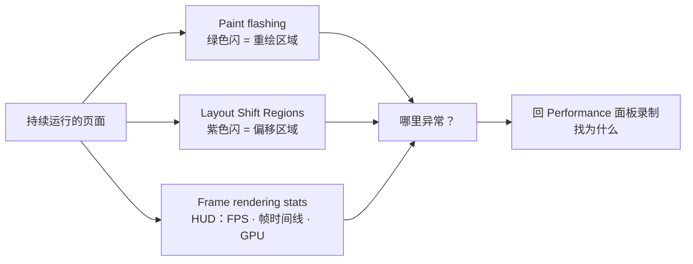

import { Canvas, Controls, Meta } from '@storybook/addon-docs/blocks';
import * as Stories from './rendering-tools.stories';

<Meta of={Stories} name="Docs" />

# 渲染诊断

Rendering（渲染）抽屉是挂在 DevTools 底部 Drawer（抽屉区）里的一排「叠加层仪器」：勾选开关后，浏览器把渲染健康信号直接画在页面本身上——不需要录制、不需要停止，页面持续运行着就能看。三个核心开关各管一路信号：Paint flashing（重绘闪烁）把每次重绘的像素区域闪成绿色；Layout Shift Regions（布局偏移区域）把发生布局偏移的区域闪成紫色；Frame rendering stats（帧渲染统计）在视口右上角挂一块常驻 HUD（heads-up display，平视显示层），显示实时 FPS 估计、逐帧时间线与 GPU 状态。

本课的演示页是一个「渲染负载标本」：Controls 的「动画实现」切换同一段往返运动的两种写法（每帧改 top/left 与只用 transform），「插入方式」决定内容横幅何时出现；readout 全是真实测量——FPS 估计取自 rAF 间隔，偏移事件计数与分值取自 PerformanceObserver 的 layout-shift API。可以预测：动画保持「每帧改 top/left」，Paint flashing 每帧闪绿；切到「只用 transform」，绿闪消失。插入方式选「点击立即插入」，紫色照样闪，readout 却显示这次偏移不计入。

本课聚焦页面持续运行时的渲染健康：叠加层回答「哪里异常」——哪块在反复重绘、哪里在跳、帧有没有掉；「为什么异常」要回 Performance 面板录制轨迹（见[录制与分析轨迹](?path=/docs/performance-traces--docs)）或采样函数热点（见[CPU 热点](?path=/docs/cpu-profiler--docs)）；偏移的分值模型与阈值属于 CLS 指标，见[性能指标](?path=/docs/performance-metrics--docs)。



| 叠加层开关 | 开启后看到什么 | 回答什么 |
| --- | --- | --- |
| Paint flashing | 发生重绘的区域每帧闪绿色 | 页面上谁在反复重绘？ |
| Layout Shift Regions | 发生布局偏移的区域短暂闪紫色 | 什么东西把画面挤跳了？ |
| Frame rendering stats | 视口右上角常驻 HUD：FPS 估计、帧时间线（蓝/黄/红）、GPU 光栅状态与显存 | 帧产出还健康吗？ |

## 快速上手

演示页分三块：动画区是一颗持续往返移动的渐变卡片；内容区里点「插入一段内容」会在顶部插入一条没有预留高度的横幅，把原有内容挤下去；readout 的三行读数分别是 FPS 估计（近 12 帧 rAF 间隔均值）、偏移事件计数（计入/总数）与最近一次偏移的分值（含是否计入）。Controls 的「动画实现」与「插入方式」各控制一个变量。

<Canvas of={Stories.Specimen} />
<Controls of={Stories.Specimen} />

最小闭环：

1. 按 `Command+Shift+P`（macOS）或 `Control+Shift+P`（Windows、Linux）打开 Command Menu（命令面板），输入 rendering，选 Show Rendering（显示渲染）——Rendering 抽屉出现在 DevTools 底部。
2. 勾选 Paint flashing，动画保持「每帧改 top/left」：动画区整片每帧闪绿——top/left 是布局属性，每帧都触发布局与重绘。
3. 把「动画实现」切到「只用 transform」：绿闪基本消失——transform 动画由合成器直接移动已经绘制好的层，不再重新填充像素。
4. 勾选 Layout Shift Regions，「插入方式」保持「网络返回后插入」，点「插入一段内容」：约 0.7 秒后横幅出现、内容被挤下，内容区闪紫，readout 的偏移事件计入 +1。
5. 把「插入方式」切到「点击立即插入」再点一次：紫色照样闪、位移幅度相同，但 readout 显示「不计入（hadRecentInput）」——偏移与点击同帧发生，落在输入后 500ms 窗口内，CLS 排除用户引发的偏移。
6. 勾选 Frame rendering stats：视口右上角出现 HUD，动画持续运行时帧时间线以蓝色为主、FPS 估计贴近显示器刷新率；对照 readout 的 FPS 估计——两者独立采样，稳态下读数一致。

| 读者操作 | 可观察证据 |
| --- | --- |
| 切换「动画实现」 | Paint flashing 下：top/left 每帧闪绿，transform 基本不闪绿 |
| 点击「插入一段内容」 | Layout Shift Regions 闪紫；readout 的偏移事件与最近分值更新，计入与否随插入方式变化 |
| 勾选 Frame rendering stats | HUD 常驻视口右上角；FPS 估计与 readout 同向 |
| 打开 Show code | 看到该 Canvas 实际执行的 `render-specimen.ts` |

HUD 与叠加层作用于整个页面（标本跑在 iframe 里，信号不限于标本区）；FPS 估计的上限是显示器刷新率（60 Hz 或 120 Hz），跨设备不要比绝对值。

## Rendering 抽屉

叠加层与 Performance 面板录制是两种互补的观测方式：叠加层实时、持续、零操作，看的是「现在哪里异常」；录制事后回放，带时间轴与调用栈，回答「为什么异常」。诊断节奏由此确定——先开叠加层把异常圈到具体区域，再带着已知区域去录制，比在轨迹里盲扫快得多。

打开方式回查：

- Command Menu：`Command+Shift+P`（macOS）/ `Control+Shift+P`（Windows、Linux），输入 rendering → Show Rendering。
- 已开抽屉时：按 `Esc` 打开 Drawer → 抽屉菜单的 More tools（更多工具）→ Rendering。
- 右上角 More options（更多选项，⋮）→ More tools → Rendering。

抽屉里的开关按功能分三组：渲染性能检查（Paint flashing、Layout Shift Regions、Layer borders、Frame rendering stats、Scrolling performance issues）、CSS 媒体特性模拟、页面效果。Command Menu 也能直达单个开关——输入 paint、shift、stats 即可勾选，不必先打开抽屉。

### Paint flashing 重绘闪烁

渲染流水线把「画面变一下」拆成三步：layout（重排，重新计算几何）、paint（重绘，重新填充像素）、composite（合成，把现成的层贴到屏幕），成本依次递减——重绘不一定伴随重排，重排几乎必然连带重绘，而合成器移动一个已绘制的层两样都不需要。Paint flashing 把发生重绘的像素区域闪成绿色；它是「重绘监控器」，只标出哪里在重绘，不评价这次重绘贵不贵——绿闪不等于卡顿，代价取决于面积、内容复杂度与设备。

| 动画实现 | Paint flashing 表现 | 原因 |
| --- | --- | --- |
| 每帧改 top/left | 动画区每帧闪绿 | top/left 是布局属性，每帧触发布局与重绘，是主线程的逐帧工作 |
| 只用 transform | 基本不闪绿 | 元素被提升为合成层，合成器直接移动它，像素没有重新填充 |

判断：动画、滚动期间「大面积、持续」的绿闪是首要信号——重绘成本随面积增长，开发机流畅不代表低端设备流畅。健康动画的经验法则：动画属性只用 transform 与 opacity，两者可由合成器接管；改完用 Layer borders 确认层确实被提升（见「抽屉里的其他工具」）。

### Layout Shift Regions 布局偏移区域

布局偏移（layout shift）指已渲染帧之间，可见元素的位置突然改变。Layout Shift Regions 把偏移发生的区域短暂闪成紫色——它给位置，不给分值；单次分值怎么算、CLS 怎么按会话窗口累积，属于指标模型，见[性能指标](?path=/docs/performance-metrics--docs)。位置与分值在演示页里由 PerformanceObserver 的 layout-shift API 补齐：`entry.value` 是单次偏移分值，`entry.hadRecentInput` 标记偏移是否发生在用户输入后 500ms 内。

```ts
const observer = new PerformanceObserver((list) => {
  for (const entry of list.getEntries()) {
    // entry.value：单次偏移分值；entry.hadRecentInput：输入后 500ms 内为 true；
    // entry.sources：被移动的元素及其前后位置（previousRect / currentRect）
    console.log(entry.value, entry.hadRecentInput, entry.sources);
  }
});
observer.observe({ type: 'layout-shift', buffered: true });
```

| 插入方式 | 页面表现 | readout |
| --- | --- | --- |
| 网络返回后插入（约 700ms） | 闪紫，内容被挤下 | 计入（hadRecentInput=false） |
| 点击立即插入 | 闪紫，位移幅度相同 | 不计入（hadRecentInput=true） |

两种插入的紫闪与位移肉眼几乎一样，唯一区别是「有没有输入」——这正是 CLS 排除用户引发偏移的设计：用户点了按钮、页面跟着动，不算意外；网络晚到的内容把布局挤跳，才算事故。

边界：紫色高亮很短暂，错过就靠 readout 的计数兜底；加载期的偏移要在勾选后刷新页面、盯着首屏看；演示页的「重置标本」按钮可清空内容并归零读数，便于反复练习。

### Frame rendering stats 帧渲染统计

Frame rendering stats 在视口右上角挂一块常驻 HUD，把「帧产出是否健康」变成一眼可读的数字与颜色：

| HUD 元素 | 含义 |
| --- | --- |
| FPS 估计 | 实时帧率估计，上限是显示器刷新率（60/120 Hz） |
| 帧时间线 | 蓝 = 成功渲染，黄 = 部分呈现，红 = 被丢弃（掉帧） |
| GPU raster | GPU 光栅化（raster）开关状态 |
| GPU memory | GPU 显存占用（已用/上限） |

解读：红色帧意味着这一帧没能在帧预算内画完、被丢弃——持续出现红色就是掉帧；黄色是部分呈现，屏幕上一半新、一半旧。这套三色语言与 Performance 面板 Frames 轨道的白/绿/黄/红同源不同色——录制视角的逐帧归档见[录制与分析轨迹](?path=/docs/performance-traces--docs)。

观察：标本空闲时 FPS 贴近刷新率、时间线以蓝为主；把「动画实现」切到「每帧改 top/left」再看——开发机上 FPS 可能依旧平滑，这正说明 Paint flashing 捕捉的重绘是「结构性成本」，本机不卡不等于低端设备不卡；给本机降速（见最佳实践）后重看，差距才显形。

边界：HUD 的 FPS 是估计值，与 readout 的 rAF 估计各自独立采样，短窗口内有抖动属正常；HUD 不回答「为什么掉帧」——带着掉帧的时间点回 Performance 面板录制。

## 抽屉里的其他工具

除三件核心仪器外，抽屉里还有两组成员：渲染检查类回答另一类「哪里」的问题，模拟类把页面放进特定的媒体或能力环境。

渲染检查：

| 选项 | 做什么 | 何时用 |
| --- | --- | --- |
| Layer borders | 橙色与橄榄色描出合成层边界，青色描出瓦片（tile） | 确认动画元素是否被提升为合成层；排查层过多挤占显存 |
| Scrolling performance issues | 高亮带有「可能拖慢滚动」的滚动相关事件监听的元素 | 滚动卡顿时圈出嫌疑元素 |

媒体特性模拟（下拉选择，改动后需刷新页面生效）：

| 选项 | 模拟什么 |
| --- | --- |
| Emulate CSS media type | 强制 print 媒体类型，检查打印样式 |
| prefers-color-scheme | 浅色 / 深色偏好 |
| prefers-reduced-motion | 减少动效 |
| prefers-reduced-transparency | 减少透明效果（Chrome 118 起） |
| prefers-contrast | 更高 / 更低对比度 |
| forced-colors | 强制配色（如 Windows 高对比模式） |
| color-gamut | sRGB / P3 / Rec2020 色域 |

页面效果：

| 选项 | 做什么 |
| --- | --- |
| Highlight ad frames | 红色高亮被标记为广告的 iframe |
| Emulate a focused page | DevTools 获焦时页面仍视同聚焦，调试下拉、日期选择器等失焦即关的控件 |
| Disable local fonts | 禁用本地字体回退，强制走 `@font-face` 的网络字体（需刷新） |
| Enable automatic dark mode | 给浅色站点套用 Chrome 自动生成的深色主题 |
| Emulate vision deficiencies | 模拟视力模糊、对比度降低与各类色觉缺陷 |
| Disable AVIF / Disable WebP | 禁用图片格式，测试 `<picture>` 的回退链路（需刷新，且自动禁用图片缓存） |

媒体模拟与视觉缺陷同时是设备模拟与可访问性调试的交汇点——视口与网络模拟属于「设备与网络模拟」，颜色对比度检查属于「可访问性调试」，本课只留入口。

## 最佳实践

- 一次只开一个信号：三路叠加层同时开，绿闪会盖过紫闪、HUD 分走注意力。排查时先定一路信号、读完结论再切下一路。
- 先叠加层、后录制：叠加层把异常圈到「哪个区域、哪类问题」，随后的录制就有了靶子——绿闪区域对应火焰图里的 Painting（绘制）事件，紫色偏移对应 Layout shifts 轨道，掉帧对应 Frames 轨道。带着区域看轨迹，比盲扫快一个量级。
- 判断重绘先给设备降速：大面积重绘与掉帧常被开发机的高性能掩盖。用 Performance 面板采集设置里的 CPU throttling（CPU 节流）或 Settings 的对应开关降速后重看——本机的绿闪区在低端设备上就是掉帧区。

## 常见问题

- 旧教程里的 FPS meter 复选框找不到了。
  它已并入 Frame rendering stats：勾选后 HUD 顶部的 FPS 估计就是实时帧率读数。旧教程截图里的抽屉条目与当前 Chrome 可能对不上，以抽屉里的实际列表为准。
- Layout Shift Regions 勾了却一直没看到紫色。
  紫色只在偏移发生的瞬间短暂闪现，页面静止就什么都没有。在演示页点「插入一段内容」即可看到；想看加载期偏移，勾选后刷新页面盯着首屏。
- 开着 Paint flashing，感觉整页都在闪绿，页面是不是坏了？
  先分区判断：鼠标划过带 hover 效果的元素、滚动时的可视区重绘、文本输入的光标闪烁都是正常绿闪。异常信号是「没人交互也持续整片闪绿」——通常有循环在反复改布局或样式属性；回 Performance 面板录一条轨迹，看 Rendering 与 Painting 的时间占比即可锁定。
- HUD 的 FPS 与演示页 readout 的 FPS 估计对不上。
  两者是独立采样：HUD 是浏览器逐帧统计，readout 取近 12 帧 rAF 间隔的平均，短窗口内数值抖动属正常，稳态下都逼近显示器刷新率。120 Hz 屏幕上两者上限都约为 120，与 60 Hz 设备不可直接比较。

## 总结回顾

摘要：

Rendering 抽屉把渲染健康诊断做成一排常驻叠加层：Paint flashing 把每次重绘闪成绿色，「每帧改 top/left 持续闪绿、只用 transform 不闪绿」的对照把触发布局绘制的属性与合成器接管的属性区分开；Layout Shift Regions 把布局偏移闪成紫色，标出位置；Frame rendering stats 的 HUD 用 FPS 估计、蓝黄红帧时间线与 GPU 状态回答帧产出是否健康。演示页用 PerformanceObserver 的 layout-shift API 实测偏移事件、分值与 hadRecentInput——网络返回后的插入计入、点击同帧的插入不计入，揭示了 CLS 排除用户引发偏移的规则。叠加层回答「哪里异常」，根源定位回 Performance 面板录制；抽屉其余成员——Layer borders、Scrolling performance issues、媒体特性模拟与页面效果——按回查表取用。

一句话：

> 叠加层负责「哪里不健康」，录制负责「为什么不健康」——先开 Rendering 抽屉圈出异常区域，再带着它去录制。

知识要点：

- 三个核心开关各把什么画在页面上？各回答什么问题？
- 为什么 top/left 动画每帧闪绿而 transform 动画不闪？健康动画应该只用哪些属性？
- CLS 如何排除用户引发的偏移？layout-shift 条目的哪个字段反映这一点？
- Frame rendering stats 的 HUD 有哪些元素？帧时间线三色各代表什么？
- Rendering 抽屉与 Performance 面板录制在诊断流程里怎么分工？
- Layer borders 与 Scrolling performance issues 各用来查什么？

## 参考资料

- [Rendering tab overview](https://developer.chrome.com/docs/devtools/rendering)
- [Discover issues with rendering performance](https://developer.chrome.com/docs/devtools/rendering/performance)
- [Emulate CSS media features](https://developer.chrome.com/docs/devtools/rendering/emulate-css)
- [Apply other effects: enable automatic dark theme, emulate focus, and more](https://developer.chrome.com/docs/devtools/rendering/apply-effects)
- [Cumulative Layout Shift (CLS)](https://web.dev/articles/cls)
