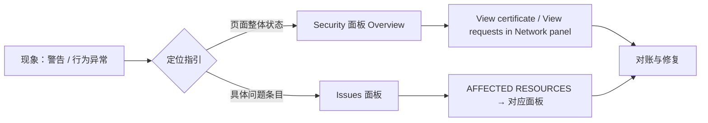

import { Canvas, Controls, Meta } from '@storybook/addon-docs/blocks';
import * as Stories from './security-issues.stories';

<Meta of={Stories} name="Docs" />

# 安全与问题排查

安全问题的第一现场往往不是你的代码，而是浏览器的两份「体检报告」。**Privacy and security 面板**（Security 面板的现名，Privacy 管第三方 cookie、Security 管本页 HTTPS 状态）回答「这一页安不安全」：Overview 区给整体结论，证书、子资源、第三方 cookie 逐项展开。**Issues 面板**把浏览器检测到的具体问题——混合内容、cookie 被拦、CORS、CSP 违规、弃用警告——聚合成带修复指引的条目。本课建立「现象 → 面板 → 对账 → 修复」的定位路线，并以混合内容为例走完整条修复链。

演示页跑在 `http://localhost`——localhost 是浏览器的可信来源，混合内容、证书错误、第三方 cookie 限制都需要特定 HTTP 环境才能复现，演示页**不伪造**这些读数；它提供两样真实的东西：一个「问题定位指引」查询工具（选现象、得路径、如实标注能否在本页复现），以及一个能真实触发弃用警告的按钮——在本页自己的 DevTools 里立即可查。



| 面板 | 打开方式 | 回答什么 | 不回答什么 |
| --- | --- | --- | --- |
| Privacy and security | More tools → Privacy and security；或 Command Menu（`Command+Shift+P`）执行 "Show privacy and security" | 本页整体安全状态、主源证书、子资源是否非安全、第三方 cookie 收发 | 某个警告具体怎么修 |
| Issues | DevTools 操作栏 Settings 旁的 "Open Issues" 按钮；或 More tools → Issues | 浏览器检测到的具体问题、受影响资源、修复指引 | 页面整体安全评分 |

## 快速上手

演示页是一个「问题定位指引」查询工具：Controls 的「选择现象」切换手头故障，readout 给出该现象的检查入口、Issue 类别、修复方向，并如实标注能否在本页复现；「触发演示 Issue」开关在本页代码里执行一次主线程同步 XHR，触发一条真实的 [Deprecation] 弃用警告。

<Canvas of={Stories.Locator} />
<Controls of={Stories.Locator} />

最小闭环：

1. 「选择现象」默认是混合内容：readout 给出 Security 面板与 Issues 面板两条入口，「本页复现」行如实标注「否」——原因写在括号里。
2. 把「选择现象」切到「Console 报 [Deprecation] 弃用警告」：唯一标注「是」的现象。
3. 打开「触发演示 Issue」：readout「最近触发」显示已发送。打开 DevTools（`Command+Option+J`，macOS；`Control+Shift+J`，Windows/Linux）：Console 立即出现 [Deprecation] 警告，点操作栏的 "Open Issues" 按钮，Issues 面板里有对应条目——这就是「浏览器发现问题 → 报告到面板」的完整到达路径。
4. 关闭再打开该开关可重复触发；其余现象按 readout 的「检查入口」去对应面板，需要的环境条件见各节正文。

| 读者操作 | 可观察证据 |
| --- | --- |
| 「选择现象」切到弃用警告 | readout「本页复现」变为绿色的「是」 |
| 打开「触发演示 Issue」 | Console 出现 [Deprecation] 警告，Issues 面板出现对应条目 |
| 「选择现象」切到混合内容 | readout 同时给出 Security 面板与 Issues 面板两条入口 |
| 「选择现象」切到证书警告 | readout 说明证书错误发生在加载前、面板体检的是已放行页面 |
| 打开 Show code | 看到该 Canvas 实际执行的 `issue-locator.ts`：现象 → 指引数据表与触发实现 |

边界：同步 XHR 的响应（本页文档）读完即弃，它只负责让浏览器发出弃用警告，不留任何页面状态；标注「否」的现象没有对应的假读数，指引数据表的来源是本课参考资料中的官方页面。

## Security 面板

这个面板在当前版本的 DevTools 里叫 **Privacy and security**，但读者检索与报错信息里仍是 Security 面板的名字，本节沿用 Security 面板称呼。它的共同模型是对「这一页」整体体检：Privacy 节管第三方 cookie 的收发与限制，Security 节管本页的 HTTPS 状态——先在 Overview 区给整体结论，再按主源（main origin）与子资源分组展开。页面安不安全是「主源 + 全部子资源」的合取：任何一环走 HTTP，Overview 都不会给绿灯。

### Overview 状态

Overview 区一行字加一个信息图标给出结论；出问题时它会写明出了什么事。四种状态与下一步：

| Overview 结论 | 什么情况 | 下一步 |
| --- | --- | --- |
| This page is secure（有效 HTTPS） | 主源 HTTPS、证书有效、无混合内容 | 无 |
| This page is not secure | 主源本身走 HTTP（Non-secure main origins） | 服务端启用 HTTPS 重定向；证书可用 Let's Encrypt，或托管到支持 HTTPS 的 CDN |
| This page is not secure（broken HTTPS） | 主源 HTTPS 但证书有问题：过期、域名不匹配、证书链不完整；Overview 会写明原因（例如「缺少有效证书，因为已过期」） | View certificate 核对证书，在签发与部署侧修复 |
| This page is not secure（混合内容） | 主源 HTTPS，页面又与 HTTP 源交互——页面只是部分受保护（partially protected） | 看 Non-secure origins 区块，走「混合内容」一节的修复链 |

### 源与证书

Security 节按源分组：Main origin 区块展开是主源的连接与证书摘要；Non-secure origins 区块列出所有非安全源，两个关键动作把「页面不安全」落到实处：

- **View certificate**：查看完整证书——签发者、有效期、绑定的域名、certificate transparency（证书透明度）状态。排查 broken HTTPS 先看这里：过期、域名对不上还是链不完整，一眼可辨。
- **View requests in Network panel**：跳到 Network 面板并自动应用筛选，只显示来自非安全源的请求。混合内容排查靠它把「部分受保护」翻译成一条条具体请求。

边界：Security 面板体检的是**已放行的页面**。证书无效时 Chrome 先用插页警告拦在门外，页面根本没有加载，面板无从体检——线上证书问题在签发与部署侧修；本课示例环境无法复现证书错误（需要一个证书无效的 HTTPS 服务），演示页不给假读数。

### 第三方 cookie（Privacy 区）

Privacy 节当前的核心是第三方 cookie，三块内容：

- 「临时限制第三方 cookie」开关（Temporarily limit third-party cookies），带豁免项（第三方 cookie 宽限期、基于启发式的例外）与 Reload prompt（重载提示）；调整后按提示重载页面生效。
- **Third-party cookies 表格**：本页涉及的第三方 cookie 逐行列出，用 All / Allowed / Blocked 筛选；被拦的那一行就是 cookie 异常的第一现场。
- 页面没有任何第三方 cookie 时显示 "Not a crumb left"。

处理路径：表格里 Blocked 的行 → Issues 面板的对应 cookie 条目看原因 → 服务端 `Set-Cookie` 补齐 `Secure` / `SameSite` 属性根治；浏览器的豁免开关只影响调试中的这台浏览器。

## Issues 面板

Console 把警告混进日志流、导航即清空；Issues 面板把浏览器检测到的问题聚合成结构化条目，官方定位是「可操作的洞察（actionable insights）」。它持续新增问题类型，当前覆盖：cookie（SameSite、第三方 cookie）、Mixed content、CSP 违规、COEP、CORS 错误、Quirks mode、样式表加载问题、无效的 `@property` 规则、autocomplete 属性问题等。

打开方式：DevTools 操作栏右侧 Settings 旁的 **"Open Issues" 按钮**——有新问题时图标按严重程度显示红、黄或蓝色；或 More tools → Issues。打开后**重载页面**，才能捕获页面加载阶段产生的问题。

条目结构：标题旁标受影响资源数；展开后四部分——描述问题的标题、给出上下文与解决方案的说明、**AFFECTED RESOURCES**（链到 Network / Sources / Elements 等面板的具体资源）、进一步指引的链接。点资源链接就是「在上下文中看问题」：跳到对应面板选中该资源，悬停行内信息图标即可看到问题说明与修复入口。

分组与过滤：

- **Group by kind**（实验功能：Settings > Experiments 勾选 "Allow grouping and hiding of issues by issue kind" 后，面板出现 Group by kind 勾选框）：Page Errors（页面错误）/ Breaking Changes（如弃用警告）/ Improvements（改进建议）。
- **Include third-party cookie issues**：取消勾选可隐藏第三方 cookie 问题。
- 条目三点菜单 **Hide issues like this**：收进 Hidden issues 区块，可逐条恢复或 Unhide all。

真实证据：快速上手的「触发演示 Issue」按钮在本页执行主线程同步 XHR——Console 出现 [Deprecation] 弃用警告，Issues 面板收录对应条目；启用 Group by kind 实验后它归入 Breaking Changes 类。这是本课唯一能在本页复现的面板现象，其余现象的环境条件见「混合内容」一节与演示页 readout。

## 混合内容

混合内容（mixed content）：HTTPS 页面又去加载 HTTP 子资源。风险在于 HTTPS 只保护了主文档——HTTP 子资源在传输中可被篡改或替换。浏览器按风险分两类处理，遵循 mixed content 规范的分类：

| 类别 | 例子 | 浏览器处理 | 页面上的现象 |
| --- | --- | --- | --- |
| 被动（passive，规范称 optionally-blockable） | 图片、音频、视频 | 能升级就自动升级为 https（auto-upgrade）；没有 https 版本就不加载 | Console 提示已自动升级，或资源加载失败 |
| 主动（active，规范称 blockable） | 脚本、样式表、iframe 等可执行的代码 | 默认直接阻止（blocked） | Console 报错说明请求已被阻止 |

主动内容一旦被注入，攻击者可完全控制页面——窃取表单、会话 cookie、重定向用户；被动内容攻击面有限（换图误导、借请求追踪用户），但旧浏览器可能两类都不拦——**修复源代码仍是唯一可靠手段**。

排查路径，全程在浏览器里闭环：

1. **Console / Issues 面板**：Console 对每个 HTTP 子资源给出「页面经 HTTPS 加载、却请求了不安全资源」的提示并说明阻止或升级状态；Issues 面板的 Mixed content 条目列出每个不安全资源与处理结果。
2. **Security 面板**：Overview 标为部分受保护；Security > Non-secure origins → View requests in Network panel，在 Network 面板过滤出这些请求逐条核对。
3. **源码搜 `http://`**：定位带 HTTP URL 的属性。`<a>` 的 href 里的 http:// 一般只是页面导航、不算混合内容（例外：lightbox 一类脚本会把它指定的资源加载进页面内展示）。

修复顺序：

1. **逐条升级 URL 为 https**。先在地址栏验证该资源的 https 版本可用再改；Console 已显示「自动升级」的资源，说明 https 版本在位，可放心改。
2. **没有 https 版本的资源三选一**：换可用主机引入、在合法前提下下载后自托管、或移除。
3. **兜底与追踪**：`Content-Security-Policy: upgrade-insecure-requests`（响应头或 `<head>` 里的 meta 标签均可）让浏览器在发请求前升级所有不安全 URL，并级联进 `<iframe>` 文档——比浏览器自动升级覆盖更广；但没有 https 版本的资源升级后照样失败、不加载。全站摸底用 `Content-Security-Policy-Report-Only` 加上报端点：用户访问过的页面都会回报违规报告，低流量页面可能长期没有报告。

复现条件（本页不可复现）：混合内容要求 HTTPS 主源 + HTTP 子资源。最小样本是把一个 http:// 资源放进 https:// 页面：

```html
<!-- 部署在 https:// 的页面里引用 http:// 资源 -->

<script src="http://active-mixed-content.glitch.me/script.js"></script>
```

官方修复指南提供两个在线靶场：passive-mixed-content.glitch.me（被动，观察自动升级）与 active-mixed-content.glitch.me（主动，观察阻止）。本页跑在 `http://localhost`：加载 http 资源不构成混合内容，证书环节也无从谈起——演示页不伪造这些读数。

## 最佳实践

- **发布前体检顺序固定：Overview → Issues 清零 → Console 无警告。** Security 面板 Overview 不标「不安全」、Issues 面板无未处理条目、Console 无安全类警告，三关都过 HTTPS 化才算收尾；只看 Console 容易漏掉聚合在 Issues 面板里的条目。
- **先修 URL，再谈 CSP 兜底。** `upgrade-insecure-requests` 只是兜底——没有 https 版本的资源升级后照样不加载。用 Report-Only 摸清全站违规，逐条升级 URL，最后才把强制指令留在响应头里；一上来就开强制，只会把「可修的资源」变成「静默的缺失」。
- **cookie 问题修在服务端属性上。** `Set-Cookie` 补齐 `Secure` / `SameSite` 是根治；Privacy 面板的豁免开关和 DevTools 设置只影响调试中的这台浏览器，用户的访问环境不会跟你一样。

## 常见问题

- 本地开发用 http://localhost，会不会被标记「不安全」？线上部署是不是也一样？
  浏览器把 localhost 视为可信来源（trustworthy origin）：地址栏不标记，`Secure` 属性 cookie 等行为等同安全上下文。但同一段代码部署到线上走 HTTP 就会被标记。体检结论以部署站点为准，本机结论不外推。
- Console 里没有报错，Issues 面板却有条目；或者反过来。
  两边不是一份数据的两种显示：Console 只显示一部分浏览器报告的问题，且每次导航即清空；Issues 面板持续聚合。先重载页面——打开面板之前的加载期问题要重载才被捕获；再用条目里的 AFFECTED RESOURCES 跳到具体请求核对。
- 页面报证书错误，Security 面板里却什么都没有。
  证书无效时 Chrome 用插页警告拦截，页面没有加载，面板没有可体检的对象。先解决证书本身：有效期、域名匹配、证书链完整；本地开发给服务配置受信证书。插页警告页上的「继续访问」是风险自负的逃生口，不是修复。
- Privacy 区表格里某个 cookie 显示 Blocked。
  先确认它是不是第三方 cookie 且撞上了限制：Issues 面板对应条目给出原因（属性缺失或被限制），修复方向是服务端补 `SameSite` / `Secure` 属性；确认必需且合规时，才用面板开关临时豁免，且只对本机生效。

## 总结回顾

摘要：

DevTools 给每个页面配了两份体检报告。Privacy and security 面板回答「这一页安不安全」：Overview 区把页面归入有效 HTTPS、走 HTTP、broken HTTPS、混合内容四类状态；Security 节按主源与子资源分组，View certificate 看证书细节，Non-secure origins 的 View requests in Network panel 把「不安全」落到具体请求；Privacy 节用限制开关与 Third-party cookies 表格展示第三方 cookie 的收发与放行。Issues 面板把浏览器检测到的具体问题——混合内容、cookie、CORS、CSP 违规、弃用警告等——聚合成结构化条目，展开后有描述、AFFECTED RESOURCES 资源链接与修复指引，Group by kind 实验把问题按 Page Errors / Breaking Changes / Improvements 分组，Hide issues 支持降噪。混合内容是两个面板的交汇点：被动资源（图片、音视频）能升级就自动升级为 https，主动资源（脚本、样式表、iframe）默认阻止；修复顺序是逐条升级 URL、无 https 版本换源／自托管／移除，再用 upgrade-insecure-requests 兜底、Report-Only 全站追踪。演示页提供问题定位指引工具与一个真实可触发的弃用警告；混合内容、证书错误需要特定 HTTP 环境，本页不伪造。

一句话：

> 安全问题先读报告再对账：Security 面板判断「这一页安不安全」，Issues 面板把每个问题连到可修的资源——报告指向哪里，就回 Network、Console 与代码核对。

知识要点：

- 地址栏「不安全」、证书警告、混合内容在 Overview 里分别显示为什么？各走哪条下一步？
- Non-secure origins 区块的两个按钮各把问题落到哪里？
- Issues 面板的条目由哪几部分构成？Group by kind 把问题分成哪三类？打开面板后为什么建议重载页面？
- 主动与被动混合内容浏览器分别怎么处理？Console 与 Issues 面板各给什么线索？
- 混合内容的修复顺序是什么？`upgrade-insecure-requests` 管什么、不管什么？
- 第三方 cookie 被拦在哪里看、怎么修？localhost 的体检结论为什么不外推？

## 参考资料

- [Privacy and security panel](https://developer.chrome.com/docs/devtools/security)
- [Issues panel](https://developer.chrome.com/docs/devtools/issues)
- [What is mixed content（web.dev）](https://web.dev/what-is-mixed-content/)
- [Fixing mixed content（web.dev）](https://web.dev/articles/fixing-mixed-content)
