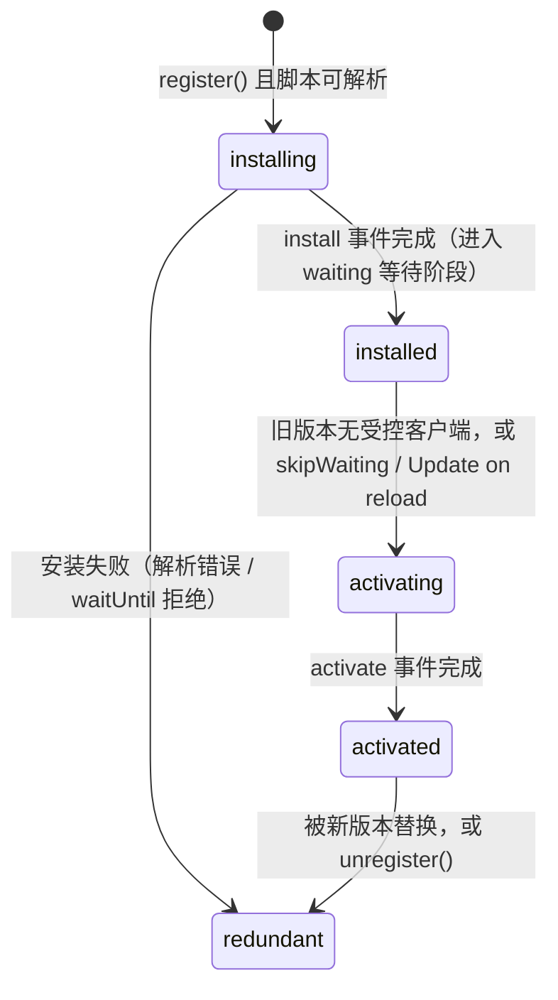

import { Canvas, Controls, Meta } from '@storybook/addon-docs/blocks';
import * as Stories from './service-worker-pwa.stories';

<Meta of={Stories} name="Docs" />

# Service Worker 与 PWA

Service Worker（SW，服务工作线程）是挂在页面之外的一条可编程代理线程：注册后常驻浏览器，按 scope（作用域）接管管辖范围内的网络请求，可以写缓存、离线应答、接收推送——PWA（Progressive Web App，渐进式 Web 应用）的离线、安装与推送能力都由它支撑。本课覆盖 Application（应用）面板的三块 PWA 能力：**Service Workers 面板**看线程状态、用开关控制它；**Manifest 面板**检查应用清单；**Background Services 分栏**记录推送与后台同步等"页面关闭后仍在发生的事"。上一课已看过 Cache Storage 里缓存的数据本体，本课聚焦这条线程本身：它在哪个状态、面板每个开关拨下去会发生什么。

演示页在 `http://localhost`（安全上下文）里注册了一个真实的 Service Worker：读者在 Application > Service Workers 面板做的每个操作，都能在页面 readout 上找到对应结果。

调试前先记住它的生命周期是一条单向状态机——遇到问题时第一问永远是"它在哪个状态、为什么卡住"：



## 快速上手

演示页是一个「Service Worker 操作台」：打开页面即注册 v1（`sw-v1.js`）；Controls 的「目标版本」驱动真实的注册、更新与注销，「发起演示请求」让一个位于 scope 内的演示 Worker 发起真实 fetch。证据分三层——readout 在页面上，注册本体在 Application > Service Workers 面板里，缓存本体在 Cache Storage 分栏里。

<Canvas of={Stories.Specimen} />
<Controls of={Stories.Specimen} />

最小闭环：

1. 打开页面即自动注册：readout「注册状态」走到 `active：sw-v1.js（v1 · activated）`（installing 阶段预缓存很快，可能一闪而过），「Worker 受控」变为 `sw-v1.js`。
2. 打开 DevTools（`Command+Option+J`，macOS；`Control+Shift+J`，Windows/Linux）选 Application 面板：Service Workers 分栏出现这个注册——Source 行指向 `sw-v1.js`，Status 行显示当前状态与更新次数，下方一排就是 Offline、Update on reload、Bypass for network 开关。
3. 「发起演示请求」打开：readout「演示请求」显示 `200 ✓ SW 回应（缓存）`，响应体来自 v1，「SW 拦截计数」加 1——这条请求没碰网络，是 SW 从 `sw-demo-cache-v1` 回应的（Cache Storage 分栏可看到这个缓存）。
4. 「目标版本」切到 v2：状态行出现 `waiting：sw-v2.js`——新版本装好了，但 v1 还控制着客户端，它只能等。勾上「立即接管」：`active` 换成 `sw-v2.js`，再发一次请求，响应体换成 v2 的文案。
5. 面板勾选 Bypass for network，再发请求：`404 ✗ 网络直连（未走 SW）`——请求绕过 SW 直连网络，而 `/sw-demo/*` 在服务器上并不存在。取消 Bypass、改勾 Offline 再请求：仍是 `200 ✓`——SW 用缓存应答，这就是 PWA 离线能力的最小样本。
6. 收尾把「目标版本」切到「未注册」（等价面板 Unregister）：注册消失，active worker 转为 redundant（冗余）后被丢弃。

| 读者操作 | 可观察证据 |
| --- | --- |
| 打开页面 | Service Workers 分栏出现注册，readout 状态走到 activated |
| 「发起演示请求」 | readout 显示 200 与 v1 响应体，SW 拦截计数加 1 |
| 「目标版本」切 v2 | 状态行出现 `waiting：sw-v2.js` |
| 勾「立即接管」 | active 换成 `sw-v2.js`，后续请求响应体变 v2 |
| 面板勾 Bypass for network | 同一请求变成网络 404 |
| 面板勾 Offline（不勾 Bypass） | 请求仍 200：SW 用缓存应答 |
| 面板 Push / Sync 按钮 | readout「最近事件」出现 push / sync 记录 |
| 面板 stop 链接 | 线程停止；再请求时重启，拦截计数归零 |
| 打开 Show code | 看到页面、SW 线程与 Worker 三份实际执行的源码 |

两个边界先说清，避免误读证据。其一，演示 SW 的 scope 只覆盖本课示例目录，所以受控客户端是同目录的演示 Worker 而不是 Storybook 页面本身——这是 scope 规则的现场教材，「作用域与受控」一节展开；其二，注册与缓存常驻本 origin（源），跨刷新、跨课程页都存在，调试完把「目标版本」切到「未注册」即可清掉。

## 生命周期：六个状态

状态机属于线程本身，页面只能旁路观测：`navigator.serviceWorker.getRegistration()` 返回的 ServiceWorkerRegistration 上有三个槽位——`installing`、`waiting`、`active`——每个槽位是一个 ServiceWorker 对象，它的 `.state` 给出六个状态之一。SW 与页面没有共享变量，通信只有 `postMessage`。

| 状态 | 含义 | 什么触发它 | 在哪里看到 |
| --- | --- | --- | --- |
| installing | 新脚本正在安装 | 首次 register()，或更新检查发现字节不同的新脚本 | 注册状态行；install 事件里预缓存，`event.waitUntil()` 的 Promise 拒绝即安装失败 |
| installed（waiting） | 安装完成，排队等待 | 旧版本仍在控制客户端 | 同一注册同时出现两个版本 |
| activating | activate 事件执行中 | 旧版本不再控制任何客户端，或等待被跳过 | 短暂过渡态，常一闪而过 |
| activated | 激活完成 | — | 从此刻起 fetch 事件才会触发 |
| redundant | 被丢弃 | 安装失败；被新版本替换；unregister() | 注册状态行；对应的 ServiceWorker 不再属于任何槽位 |

观测代码就是「注册状态」行的实现方式：

```js
const registration = await navigator.serviceWorker.register('/sw.js');
registration.addEventListener('updatefound', () => {
  const installing = registration.installing; // 新版本从这里进入生命周期
  installing?.addEventListener('statechange', () => {
    console.log(installing.state); // installing → installed → activating → activated
  });
});
```

在演示页验证：切 v2 时「注册状态」同屏显示 `waiting：sw-v2.js ／ active：sw-v1.js` 两个槽位，这就是 waiting 的直接来源。边界：注册要求安全上下文（HTTPS 或 localhost）；脚本语法错误时连 installing 都不会出现，`register()` 直接 reject。

## 作用域与受控

scope（作用域）由脚本路径决定：`register('/sw.js')` 的默认 scope 就是 `/`，脚本放在 `/subdir/sw.js` 则 scope 是 `/subdir/`——不指定 `scope` 选项时，最大 scope 就是脚本所在目录，想超出必须由服务端发 `Service-Worker-Allowed` 响应头，所以官方建议把 sw.js 放在站点根目录。scope 决定"控制哪些页面"，不限制"拦截哪些 URL"：scope 内的页面发出的跨源请求照样能被拦截。

受控（control）：URL 落在 scope 内的页面与 Worker 才是这个 SW 的 client（受控客户端），它们的请求才会走 fetch 事件。两条最常被误判的规则：

- 新 SW 激活后**默认不接管已经打开的页面**——控制从下一次导航开始；`clients.claim()` 让它立即接管已有客户端。
- 演示页的 Storybook 页面在根路径、不在演示 SW 的 scope 内，而演示 Worker 的脚本 URL 在——所以「Worker 受控」行显示的是 Worker 而不是页面。真实项目把 sw.js 放根目录，页面天然受控，这正是演示刻意保留的差异。

在演示页验证：注销（「未注册」或面板 Unregister）后「Worker 受控」变回「无（网络直连）」，再发请求立刻 404——受控与否，请求走向立见分晓。

## 更新：等待与接管

浏览器在三种时机检查 SW 脚本更新：导航进入 scope 内页面；push、sync 等功能事件触发时（距上次检查超过 24 小时才查）；页面调用 `register()` 或 `registration.update()`。

判定"新版本"的标准是**主脚本逐字节对比**。Chrome 68+ 检查主脚本时忽略 HTTP 缓存头（`importScripts()` 引入的资源仍看缓存头，可用注册选项 `updateViaCache` 调整）；字节相同就没有新版本——在演示页把「目标版本」反复切到已是当前的版本，状态行纹丝不动，这就是字节对比在生效。由此两条工程纪律：别改 SW 文件名，别依赖 HTTP 缓存策略控制 SW 更新。

新版本安装完成后进入 waiting（installed），旧版本继续控制客户端；等所有受控页面关闭，新版本才自动激活。三种"插队"手段：

| 手段 | 做法 | 代价 |
| --- | --- | --- |
| skipWaiting() | SW 自己调用，或页面向 waiting 版本 postMessage（演示页「立即接管」） | 立即激活新版本；出现"一半请求旧版本、一半新版本"的不一致窗口 |
| clients.claim() | activate 里调用 | 接管中途打开的客户端，与页面加载存在竞态 |
| 面板 Update on reload | 勾选后每次页面加载强制检查更新并跳过等待 | 只影响调试中的这台浏览器 |

完整走一遍：v1 激活 → 切 v2（waiting）→ 勾「立即接管」（activated）→ 请求响应体变 v2。`sw-v2.js` 激活时还会删除 `sw-demo-cache-v1`——旧版本缓存的清理约定俗成放在 activate 里做，避免新旧缓存同时占配额。

`unregister()` 把注册从注册表移除：active worker 转冗余被丢弃，受控客户端立即失去控制（演示请求回落网络 404）。注意它不删缓存——清数据走 Cache Storage 分栏或 Clear site data（上一课）。

## 面板开关

Service Workers 分栏每个注册自带的开关与按钮（位置：注册条目的 Offline / Update on reload / Bypass for network 复选框排，Status 行的 start / stop 链接与更新次数，条目右侧的 Update / Unregister 链接和 Push / Sync 按钮；较新版本面板还有 Update cycle 表格展示 install、waiting、activate 各阶段的耗时）：

| 开关 / 按钮 | 作用 | 用它观察什么 |
| --- | --- | --- |
| Offline | DevTools 整体断网（等价 Network 面板离线） | 不勾 Bypass 时 SW 仍用缓存应答：离线能力 |
| Update on reload | 每次页面加载强制检查更新、跳过等待 | waiting 的新版本在下次刷新后直接激活 |
| Bypass for network | 请求跳过 SW 直连网络 | 同一请求从 200 变 404：证明响应真来自 SW |
| Update | 手动触发一次更新检查 | 改了 SW 后不想刷新页面时 |
| Unregister | 注销注册 | worker 转冗余；受控请求回落网络 |
| start / stop | 手动启停线程 | 重启后全局变量丢失——演示页拦截计数归零 |
| Push | 向 SW 派发一个无 payload 的 push 事件 | 不需要真实推送服务即可验证 push 处理逻辑 |
| Sync | 派发一个 background sync 事件 | 同上，配合 Background Services > Sync 录制 |
| Network requests 链接 | 跳到 Network 面板 | 自动带上 `is:service-worker-intercepted` 筛选，只看被拦截的请求 |
| See all registrations | 打开 chrome://serviceworker-internals/?devtools | 浏览器内部的完整注册表 |

在演示页做两组对照：勾 stop，readout 的拦截计数停在原值，再发一次请求——线程重启、计数从 1 重新累计。浏览器本来就会随时停掉空闲 SW、按需再唤醒，这是设计而非故障；依赖全局变量的逻辑（如内存计数）重启即丢，重要状态应写进 Cache Storage 或 IndexedDB 并在启动时恢复。再勾 Bypass for network 发请求，200 变 404——这是排查"这行数据到底来自缓存还是网络"最干脆的手段。

## Manifest 面板

Manifest（应用清单）的调试需要一个真正挂了 manifest 文件的独立页面——本课示例页没有清单文件，本节用面板结构 + 检查清单回查，不伪造演示。面板路径：Application > Manifest。

| 区块 | 内容 |
| --- | --- |
| Identity | name、short_name 等身份字段 |
| Presentation | display、orientation、theme_color 等外观字段 |
| Icons | 声明的全部图标；勾选框可只看 maskable 图标的最小安全区 |
| Protocol Handlers | 填入 URL 点 Test protocol，验证 URL 协议处理器的注册 |
| Shortcut #N | 清单里声明的应用快捷方式 |
| Screenshot #N | 丰富安装界面的截图 |
| Installability | 检测到安装问题才出现，例如图标不可加载 |
| App Manifest 链接 | 打开原始 manifest 文件 |

安装流程：满足条件时地址栏出现 Install 按钮（移动端是菜单里的 Add to Home screen），安装过程的问题与生命周期信息保持 Console 打开可见；页面可监听 `beforeinstallprompt` 自定义安装引导。桌面安装无法模拟移动端流程，真机走远程调试（进阶课）。

安装条件清单（web app install criteria）：`name` 或 `short_name`；`icons` 含 192px 与 512px；`start_url`；`display` 为 standalone、fullscreen、minimal-ui 或 window-controls-overlay；HTTPS；以及参与度启发（用户至少交互过一次、停留约 30 秒，可以是历史访问）。带 fetch handler 的 Service Worker 曾是硬性条件，Chrome 已放宽（Chrome 89 起）——拿不准就打开面板看 Installability 区报什么，它列的就是当前缺的那一项。

## 后台服务

Application > Background Services 记录"页面关闭后仍在发生的事"。分栏覆盖：

| 分栏 | 记录什么 |
| --- | --- |
| Background Fetch | 后台大下载（视频、播客）的可靠下载事件 |
| Background Sync | 断网期间发起、恢复联网后补发的同步事件 |
| Notifications | SW 展示的通知事件 |
| Push Messages | Push API 收到的推送事件 |
| Speculative loads | 预加载规则与尝试（失败行给出原因） |

新版本 Chrome 还在加入 Reporting API、DBSC（设备绑定会话）等分栏，结构同为"事件表 + 详情"。

录制流程：进入对应分栏 → 点 Start recording → 触发活动（或用 Service Workers 面板的 Push / Sync 按钮）→ 事件落入表格，点事件在下方面板看详情 → Stop 停止。关键设定：**DevTools 关闭后录制仍继续，最长保留三天**——专门用于捕捉页面关闭很久之后才发生的事件。

在演示页验证：Service Workers 面板点 Push、Sync 按钮，readout「最近事件」立即出现 `push（v2）· 无 payload`、`sync（v2）· tag: …`——事件由面板直接派发给 SW，不经过真实推送服务与订阅；先在 Background Sync 分栏点 Start recording 再点 Sync 按钮，记录表里能看到这条事件。边界：模拟验证的是 SW 的事件处理逻辑，推送到达率、订阅管理仍需真实后端。

## 最佳实践

- **别让更新检查失灵。** SW 文件名保持稳定、放在根目录，靠字节差异触发更新；不要用文件名加版本号（`sw-v2.js` 是给本课示学用的特例）、不要把 SW 脚本放进强缓存，`importScripts` 的资源记得配 `updateViaCache`。
- **skipWaiting 想清楚再调。** 它让新版本立即接管"加载到一半"的页面，一半请求走旧缓存、一半走新逻辑；对结果一致性敏感的应用宁可让用户刷新，或仅在用户确认后发送接管指令。
- **激活即清理旧缓存。** 新版本 activate 时按前缀删除旧缓存（演示页 v2 删 `sw-demo-cache-v1`），否则配额迟早被一轮轮版本吃光——超配额的表现上一课已经见过（`QuotaExceededError`）。
- **模拟先行，后端后置。** Push / Sync 按钮和 Background Services 录制能在没有推送服务、没有联调环境时验证事件处理逻辑；真实后端接进来之前，先用这套组合把 SW 的事件处理调试干净。

## 常见问题

- 改了 sw.js、刷新好几次，页面还在跑旧逻辑。
  新版本多半卡在 waiting：面板勾 Update on reload 再刷新，或向 waiting 版本发 skipWaiting。若连 waiting 都没有，确认改动真的让脚本字节变了（字节相同不算新版本）。
- 勾了 Bypass for network，页面还是有"缓存行为"。
  它只对之后的请求生效，已加载的资源不变；要彻底排除 SW 影响，配合 Unregister 和 Clear site data（上一课）一起做。
- 面板里 SW 状态一会儿 activated、一会儿变成 stopped。
  正常行为：浏览器随时停掉空闲线程、按需唤醒，stop 链接只是手动触发同一过程；全局变量不跨重启保留，重要状态写进 Cache Storage / IndexedDB 并在 SW 启动时恢复。
- `register()` 报 SecurityError。
  三种常见原因：页面不在安全上下文（非 HTTPS / localhost）；脚本 URL 跨源；请求的 scope 超出脚本目录又没有 `Service-Worker-Allowed` 响应头。
- 新 SW 一直 waiting 不激活。
  旧版本还有受控客户端：关掉所有受控标签页，或客户端调 `clients.claim()` 配合 skipWaiting，或面板勾 Update on reload。刷新页面不够——刷新后的页面仍被旧版本控制。
- Cache Storage 分栏看不到刚写入的缓存名。
  首次填充缓存后刷新页面（或点 Refresh）让面板重新检测；确认没看错 origin 与缓存名。

## 总结回顾

摘要：

Service Worker 是页面之外的可编程代理线程，注册后按 scope 接管受控客户端的网络请求，PWA 的离线、安装与推送都由它支撑。它的生命周期是一条单向状态机——installing、installed（waiting）、activating、activated、redundant——页面只能通过 ServiceWorkerRegistration 的 installing / waiting / active 三个槽位和 postMessage 观测与驱动。scope 由脚本路径决定且控制"哪些页面受控"，新 SW 默认不接管已打开的页面，clients.claim() 与导航才改变控制。更新靠主脚本逐字节对比触发，新版本先 waiting、等旧版本不再控制客户端才激活，skipWaiting、clients.claim 与面板 Update on reload 是三种插队手段；unregister 只移除注册、不删缓存。Application > Service Workers 面板用 Offline、Update on reload、Bypass for network、Unregister、Push、Sync 等开关直接控制这条线程，Background Services 分栏则把推送、后台同步等事件录制三天备查。Manifest 面板按 Identity、Icons、Installability 等区块核对应用清单，安装条件以 Installability 区的报错为准。

一句话：

> 调试 Service Worker 就是把三条证据线对上：注册对象的 installing / waiting / active 槽位、面板开关的即时效果、受控请求的缓存命中与否——演示页让三条线同屏可查。

知识要点：

- 六个生命周期状态分别由什么触发？页面通过哪三个槽位观测它们？
- scope 怎么决定？为什么新 SW 默认不接管已打开的页面？claim 改变什么？
- 更新检查在什么时机发生？字节对比意味着哪些写法会失效？
- waiting 什么时候出现？skipWaiting、clients.claim、Update on reload 各解决什么？
- Bypass for network、Offline、Unregister、stop 各改变什么？stopped 状态说明什么？
- Manifest 面板各区块看什么？安装条件清单有哪些？
- Background Services 能记录哪些事件？录制与 Push / Sync 按钮怎么配合？

## 参考资料

- [Debugging Progressive Web Apps](https://developer.chrome.com/docs/devtools/progressive-web-apps)
- [Debug background services](https://developer.chrome.com/docs/devtools/javascript/background-services)
- [The service worker lifecycle](https://developer.chrome.com/docs/workbox/service-worker-lifecycle)
- [The service worker lifecycle（web.dev）](https://web.dev/articles/service-worker-lifecycle)
- [Web app install criteria](https://web.dev/articles/install-criteria)
- [ServiceWorkerContainer - Web APIs | MDN](https://developer.mozilla.org/en-US/docs/Web/API/ServiceWorkerContainer)
