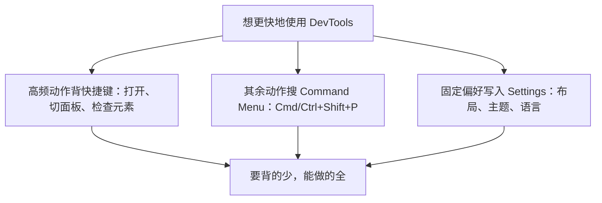

import { Canvas, Controls, Meta } from '@storybook/addon-docs/blocks';
import * as Shortcuts from './shortcuts.stories';

<Meta of={Shortcuts} name="Docs" />

# 快捷键与命令面板

高效操作 DevTools 靠的不是背下几十个快捷键，而是三层策略配合：把打开、切换、检查这类每天多次的全局动作交给少数快捷键形成肌肉记忆；其余操作记住一个入口——Command Menu（命令菜单），要什么就搜什么；停靠布局、主题这类每次会话都不变的偏好，固化进 Settings（设置）一次到位。三层各消化一类动作，记忆负担最小，覆盖的操作却最全。

本文快捷键一律双平台写法：macOS 在前、Windows/Linux 在后，用「/」分隔（如 Cmd+Opt+I / Ctrl+Shift+I）。下面的速查表 Canvas 就是本课练习场：读者可以直接在本页按 Cmd+Opt+I 或 F12 / Ctrl+Shift+I 打开 DevTools，边查表边把每条快捷键按一遍。

先记这张全局入口表，其余快捷键用到时再回查：

| 操作 | macOS | Windows/Linux |
| --- | --- | --- |
| 打开 DevTools（上次面板） | Cmd+Opt+I | F12 或 Ctrl+Shift+I |
| 打开 Console（控制台）面板 | Cmd+Opt+J | Ctrl+Shift+J |
| 进入检查元素模式 | Cmd+Shift+C | Ctrl+Shift+C |
| 打开 Command Menu | Cmd+Shift+P | Ctrl+Shift+P |
| 打开文件 | Cmd+O 或 Cmd+P | Ctrl+O 或 Ctrl+P |
| 打开 Settings | ? 或 Fn+F1 | ? 或 F1 |
| 下一个 / 上一个面板 | Cmd+] / Cmd+[ | Ctrl+] / Ctrl+[ |
| 恢复上次的停靠位置 | Cmd+Shift+D | Ctrl+Shift+D |
| 打开/关闭抽屉（Drawer） | Esc | Esc |

## 快速上手

在任意页面（比如当前演示页）完成三步，体验「打开 → 执行命令 → 调整布局」的最小闭环：

1. 按 Cmd+Opt+I（macOS）或 F12 / Ctrl+Shift+I（Windows/Linux）打开 DevTools。
2. 按 Cmd+Shift+P / Ctrl+Shift+P 打开 Command Menu，输入 screenshot，选择 Capture full size screenshot（截取完整页面截图），整页图片会出现在下载目录。
3. 再次打开 Command Menu 输入 dock，选择停靠到底部一类的命令切换面板位置；然后按 Cmd+Shift+D / Ctrl+Shift+D，面板回到上一个停靠位置。

可核对结果：截图文件出现在下载目录；面板位置随命令变化；Cmd+Shift+D / Ctrl+Shift+D 总在最近两个停靠位置之间往返。

## 快捷键

DevTools 快捷键分两层作用域：DevTools 全局（焦点在 DevTools 任何位置时生效，如切面板、开命令面板）与面板内（焦点必须在对应面板，如 Console 清屏、Sources 单步调试）。F12 / Ctrl+Shift+I 是浏览器级入口，页面获得焦点时也能打开 DevTools；而焦点进入 DevTools 后，页面自己的快捷键不会被执行，调试时不用担心互相干扰。

条目记不住时有两个比搜索更快的回查出口：

- 悬停任意 DevTools 按钮，tooltip（工具提示）会直接显示可用快捷键。
- 在 Settings 的 Shortcuts 标签页查看全部快捷键，也可以在此改绑。

下面的速查表按面板与场景分组收录了高频条目，Controls 可按分组过滤：

<Canvas of={Shortcuts.Interactive} />
<Controls of={Shortcuts.Interactive} />

| 读者操作 | 可观察证据 |
| --- | --- |
| 在「分组过滤」中只勾选 Console | 画布只剩 Console 分组的 5 条，readout 显示「1 / 6 组、5 条」 |
| 取消全部分组 | 画布中央出现提示文字，readout 显示「未选择、0 条」 |
| 打开 Show code | 看到分组数据与分栏绘制逻辑：`shortcut-groups.ts` 与 `shortcut-table.ts` |

## 命令面板

Command Menu 是「记不住快捷键」时的统一答案：一个输入框搜索并执行几乎所有 DevTools 动作，包括不少没有按钮的隐藏能力。它与 VS Code 的 Command Palette（命令面板）同源。打开方式有两种：Cmd+Shift+P / Ctrl+Shift+P，或点 DevTools 右上角 ⋮（Customize and control DevTools，自定义并控制 DevTools）按钮选 Run command（运行命令）。

输入框的前缀决定查找模式，这是它唯一的语法：

| 输入前缀 | 模式 | 用途 |
| --- | --- | --- |
| `>`（打开时自带） | 运行命令 | 搜索并执行 DevTools 动作 |
| 清空 `>` 后留空 | 打开文件 | 按名称搜索并打开页面加载的源文件 |
| `?` | 查看动作 | 列出 Command Menu 支持的全部动作 |

### 运行命令

保持 `>` 前缀，输入动作关键词后回车执行。高频命令举例：

- Capture full size screenshot / Capture area screenshot / Capture node screenshot：整页、框选区域、单节点三种截图；区域截图要求 DevTools 停靠在浏览器窗口内。
- Disable JavaScript：临时禁用页面 JavaScript，验证无 JS 降级或懒加载兜底；再执行一次即恢复。
- Switch to dark theme / light theme：一键切换深浅主题。
- 直接输入设置项名称（如 language、theme）跳到 Settings 对应项，不必翻对话框。

命令远不止这些：输入 `?` 可以列出全部动作，不认识的命令先看说明再执行。

### 打开文件

清空 `>` 前缀（或直接按 Cmd+O / Ctrl+O、Cmd+P / Ctrl+P）进入文件模式，按名称搜索当前页面加载的所有源文件。两个加分项：

- 输入 `:行号`（如 `:120`）直接跳到该行；文件内找函数、CSS 规则用 Cmd+Shift+O / Ctrl+Shift+O 跳到成员定义。
- 第三方依赖默认被隐藏、不参与搜索：需要时在 Sources（源代码）面板设置里关闭 Hide sources from the ignore list（隐藏忽略列表中的源文件）。

## 设置定制

Settings 把「每次都想手动做」变成「默认就是这样」。按 ? 或 F1（macOS 笔记本按 Fn+F1）打开，标签页分九类：

| 标签页 | 用途 |
| --- | --- |
| Preferences | 外观、面板布局、搜索等全局偏好 |
| Workspace | 把本地目录映射为可持久保存修改的工作区 |
| AI innovations | AI 辅助功能开关 |
| Experiments | 实验性功能开关 |
| Ignore List | 自定义调试时跳过的脚本 |
| Devices | 自定义设备模拟列表 |
| Throttling | 自定义网络与 CPU 节流配置 |
| Locations | 自定义地理位置模拟 |
| Shortcuts | 查看并自定义快捷键 |

Workspace、Throttling 等标签页在路线中各有独立课程，这里只记总入口。改设置也可以不走对话框：Command Menu 里直接输入设置名即可跳到对应项。

### 停靠与抽屉

停靠位置（Dock side，DevTools 贴附浏览器窗口的方式）有四种：右侧（默认）、左侧、底部、独立窗口。调整入口两处：⋮ 菜单里的 Dock side，或 Command Menu 输入 dock。快捷键 Cmd+Shift+D / Ctrl+Shift+D 在当前与上一个停靠位置之间切换——临时挪到底部看宽元素、看完切回，一次按键完成。

抽屉（Drawer）是面板下方的第二工作区，Esc 开关。主区放 Elements（元素）面板，抽屉里放 Console、Rendering 这类辅助工具：点抽屉栏的加号或 ⋮ 菜单 > More tools（更多工具）添加标签页。

### 外观与行为

- 主题：Settings > Preferences > Appearance > Themes 选 dark / light / system；也可以开 Match browser color scheme（跟随 Chrome 配色），或用命令面板输入 theme 一步切换。
- 界面语言：Appearance > Language，修改后重载 DevTools 生效。
- 面板布局：Appearance 里可关闭面板自动重排，让 Styles（样式）等侧栏始终保持垂直堆叠。
- 设置同步（Settings sync）：偏好随 Chrome 账号跨设备同步；Workspace、Experiments、Devices、Snippets（代码片段）不在同步范围。

## 最佳实践

- 按动作频率选入口：每天多次的动作背快捷键，一次投入长期复利；一周几次的交给 Command Menu 搜索执行，免背；每次会话都要重复的调整（停靠位置、主题、语言等）直接进 Settings 改默认值，改一次永久生效。三层入口对应三种频率，任何一类动作都有且只有一个最省力的去处。
- 双平台团队统一写法：文档、注释、交接说明里快捷键一律双写（如 Cmd+Shift+P / Ctrl+Shift+P）；避免只给 F1、F12 这类在 macOS 键盘上需要配合 Fn 的功能键，写 `?` 或 Cmd+Opt+I 更不容易出错。

## 常见问题

- 按 F1 或 ? 没有打开 Settings。
  先确认焦点在 DevTools 内：? 只在 DevTools 获得焦点时触发，光标还在页面里时无效；macOS 笔记本默认把 F1 当媒体/亮度键，改按 Fn+F1。
- Command Menu 里搜不到想要的功能或设置。
  检查前缀：`>` 模式只匹配命令动作，想改设置就直接输入设置项名称；想找文件要清空 `>`；不确定有什么可输 `?` 列出全部动作再选。
- 运行 Capture area screenshot 后无法框选页面。
  区域截图要求 DevTools 停靠在浏览器窗口内：先按 Cmd+Shift+D / Ctrl+Shift+D 切回停靠状态，或从 ⋮ 菜单选择 Dock side，再重新执行命令。

## 总结回顾

摘要：

本课把 DevTools 的高效操作拆成三层入口。全局与面板内快捷键负责打开 DevTools、Console、检查模式、切换面板、录制与调试这类高频动作，演示页的分组速查表可按需过滤回查；Command Menu 用一个输入框覆盖几乎所有命令与文件打开，`>` 运行命令、空前缀找文件、`?` 列出全部动作；Settings 把停靠布局、抽屉、主题、语言等偏好固化成默认，Shortcuts 标签页还支持自定义键位。三层配合，要背的最少，能做的最全。

一句话：

> 记住少数全局快捷键，其余操作统一交给 Command Menu，每次都要做的定制固化进 Settings。

知识要点：

- 打开 DevTools、Console、Command Menu 和 Settings 的双平台快捷键分别是什么？
- Command Menu 的 `>` 前缀、空前缀、`?` 各对应哪种查找模式？
- 哪些命令适合用 Command Menu 执行（截图、禁用 JavaScript、切主题、跳设置）？
- 停靠位置与抽屉如何调整，各自对应什么快捷键？
- 记不住快捷键时，去哪里回查或自定义？

## 参考资料

- [Keyboard shortcuts - Chrome DevTools](https://developer.chrome.com/docs/devtools/shortcuts)
- [Command Menu - Chrome DevTools](https://developer.chrome.com/docs/devtools/command-menu)
- [Settings overview - Chrome DevTools](https://developer.chrome.com/docs/devtools/settings)
- [Customize DevTools - Chrome DevTools](https://developer.chrome.com/docs/devtools/customize)
