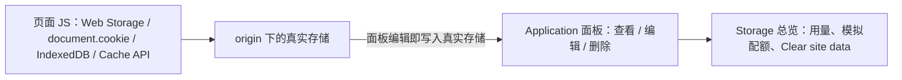

import { Canvas, Controls, Meta } from '@storybook/addon-docs/blocks';
import * as Stories from './storage.stories';

<Meta of={Stories} name="Docs" />

# 浏览器存储调试

Application（应用）面板是 DevTools 里查看页面持久化数据的统一入口：Web Storage（localStorage 与 sessionStorage，本地存储与会话存储）、Cookies、IndexedDB（浏览器内置的结构化数据库）与 Cache Storage（缓存存储）都在左侧树里按 origin（源，即协议 + 域名 + 端口）分栏列出。本课主线只有一条——这四类存储在面板里的能力不同：**查看与删除全部可用；编辑只有 Web Storage 与 Cookies 支持，IndexedDB 与 Cache Storage 是只读视图，改数据要回到页面 JS**。另一个贯穿全课的事实是存储跨刷新常驻：你调试时读到的旧数据可能来自上一轮实验，清理动作（单类 clear 与 Clear site data）是每天的日常操作。Service Worker 相关的存储（Storage 树里的 Service Workers 分类、SW 维护的缓存）在下一课展开，本课只把数据本身看清、改对、清干净。

页面 JS 与面板怎么共享同一份数据：



开场参考表——四类存储的模型与面板能力（容量数据来自官方 Storage for the web）：

| 存储 | 面板分栏 | 数据模型 | 面板内编辑 | 面板内删除 | 容量量级 |
| --- | --- | --- | --- | --- | --- |
| localStorage | Local Storage | origin 隔离的字符串键值对，持久 | 双击单元格 | Delete Selected / Clear All | 约 5 MB |
| sessionStorage | Session Storage | 同上，标签页会话结束即清空 | 同上 | 同上 | 约 5 MB |
| Cookies | Cookies | name=value 加一串属性字段 | 除 Size 外字段级 | Delete Selected / Delete All | 单条以 KB 计 |
| IndexedDB | IndexedDB | 数据库 → object store → 记录 | 不可编辑 | 单条 / Clear object store / Delete database | origin 配额池，Chrome 单源最高约 60% 磁盘 |
| Cache Storage | Cache Storage | 按缓存名分组的 Request/Response 对 | 不可编辑 | Delete Selected | 与 IndexedDB 同池 |

## 快速上手

演示页是一个「存储操作台」：Controls 选择存储类型与操作，每次参数变化对该存储执行一次真实读写；readout（读数）显示五类存储各自的键数量、最近操作与操作回显。证据分两层——readout 在页面上，数据本体在你打开的 DevTools Application 面板里。

<Canvas of={Stories.Specimen} />
<Controls of={Stories.Specimen} />

最小闭环：

1. Controls 保持「localStorage + write」——「最近操作」显示 `localStorage ← write（3 条）`。
2. 按 `Command+Option+J`（macOS）或 `Control+Shift+J`（Windows、Linux）打开 DevTools，选 Application 面板，左侧树展开 Local Storage 点当前 origin——表格里就是 `demo:theme`、`demo:cart`、`demo:token` 三行。
3. 双击 `demo:theme` 的 Value 改成 `light`，回到演示页把「操作」切到 read——「操作回显」里出现 `demo:theme=light`：面板写入的就是页面读到的存储。
4. 「存储类型」切到 IndexedDB 再 write——在面板树 IndexedDB > demo-notes > notes 点 Refresh 才能看到 3 条记录（IndexedDB 表格不实时更新）。
5. 左侧树点最上层的 Storage，保持默认勾选，点 Clear site data——readout 五个计数全部归零，而「最近操作」不变：清空由浏览器执行，不经过页面 JS。

| 读者操作 | 可观察证据 |
| --- | --- |
| 「操作」切到 write | readout 对应存储计数增加，Application 对应分栏出现 demo 样例数据 |
| 面板双击编辑 Web Storage 的值，回演示页切 read | 「操作回显」显示编辑后的值 |
| 「操作」切到 remove | 删一条样例：计数减 1，面板对应行消失（IndexedDB 需先 Refresh） |
| 「操作」切到 clear | 只清当前选中的一类：该计数归零，其余不变 |
| 面板 Clear site data | 五个计数同时归零，「最近操作」不变 |
| 打开 Show code | 看到该 Canvas 实际执行的 `storage-specimen.ts` |

readout 的计数统计的是整个 origin（IndexedDB 与 Cache Storage 只统计演示用的 `demo-notes` 与 `demo-assets-v1`），所以如果本 origin 还被其他脚本写过数据，面板和计数会一并体现；readout 只在你操作 Controls 后重新统计，面板里直接改完后动一次 Controls 即可同步。

## Web Storage：键值对的编辑入口

localStorage 与 sessionStorage 是挂在 window 上的两个同名形状的 API：同为 origin 隔离的字符串键值对表，只差生命周期——localStorage 持久保存、跨标签页共享，sessionStorage 绑定「标签页会话」，跨刷新保留、关掉标签页才清空。两者容量都在约 5 MB 量级，值只能是字符串（存对象要 `JSON.stringify` 写入、`JSON.parse` 读出，面板里看到的就是序列化后的字符串）。

| | localStorage | sessionStorage |
| --- | --- | --- |
| 生命周期 | 持久，跨标签页共享 | 跨刷新保留，标签页会话结束清空 |
| 典型内容 | 主题、语言等偏好 | 表单草稿、滚动位置等一次性状态 |

面板路径：Application > Storage > Local Storage（或 Session Storage）> 点击 origin。操作是同一套：

| 操作 | 做法 |
| --- | --- |
| 查看 | 点 origin 显示键值对表格；选中一行在表格下方预览完整值 |
| 筛选 | 表格上方 Filter 框，匹配键或值 |
| 新增 | 双击表格空白处，新行落在 Key 列，输入键与值 |
| 编辑 | 双击 Key 或 Value 单元格；官方提示改动后刷新页面才对页面代码生效 |
| 删除 | 选中行点 Delete Selected；Clear All 清空该 origin 全部 |
| 刷新 | Refresh 手动重载表格 |

面板与页面 JS 读写同一份存储：在 Console 里跑 `localStorage.setItem('demo:token', 'changed')`，回面板点 Refresh 就能看到；反过来在面板里双击改值，回演示页切 read，「操作回显」就是改后的值。Console 的 JavaScript context 下拉可切换到其他 iframe 的上下文，查看对应 origin 的存储。

在演示页验证一轮：write 后 Local Storage 分栏出现三行；双击把 `demo:theme` 的值改成 `light`，回演示页切 read 看回显；点 Clear All，readout 计数归零，再切 write 又写回来。把「存储类型」切到 sessionStorage 再 write，Session Storage 分栏出现的是另一套独立数据。

## Cookies：字段级编辑

每个 cookie 不是简单的键值对，而是 name=value 加一串控制行为的属性字段。面板路径：Application > Storage > Cookies > 点击 origin。

| 字段 | 含义 |
| --- | --- |
| Name / Value | 名称与值；选中一行在表格下方看完整值，勾选 Show URL-decoded 去掉百分号编码 |
| Domain | 允许收到该 cookie 的主机 |
| Path | 请求 URL 必须包含的路径前缀 |
| Expires / Max-Age | 过期时间；会话 cookie 恒显示 Session |
| Size | 字节大小，自动计算，不可编辑 |
| HttpOnly | 勾选后只能随 HTTP 收发，JavaScript 不可读写 |
| Secure | 仅 HTTPS 连接发送 |
| SameSite | Strict / Lax / None，控制跨站请求是否携带 |
| Partition Key | 分区 cookie（CHIPS）所属的顶级站点 |
| Priority | Low / Medium（默认）/ High |

| 操作 | 做法 |
| --- | --- |
| 筛选 | Filter 框只按 Name 或 Value 匹配，不区分大小写 |
| 新增 | 双击空行，填 Name 与 Value，其余字段 DevTools 自动补全 |
| 编辑 | 双击字段；除 Size 外都可改，非法值整行标红 |
| 只看问题 cookie | 勾选「只显示有问题的 cookie」过滤掉正常行 |
| 删除 | Delete Selected 删选中项；Delete All 清空 |

第三方 cookie（由与顶级页面不同的站点设置，带 SameSite=None）在表格里带警告图标，点击图标打开 Issues 面板看具体问题；Network 面板里请求的 Cookies 标签也会高亮受影响的 cookie。

用 JS 写 cookie 有明确局限，正文的演示用 `document.cookie` 实现：一次只能写一条、只能读到 name=value、读不到也改不了 HttpOnly——HttpOnly cookie 只能来自 HTTP 响应头 `Set-Cookie`。而面板完全可见、可编辑：调试服务端写下的会话 cookie 时，面板是唯一能直接改它的地方，这也是「面板能做而页面 JS 不能做」的典型例子。

在演示页验证一轮：选 Cookies 再 write，面板 Cookies 分栏出现 `demo_lang`、`demo_theme`、`demo_visitor` 三行，Expires / Max-Age 是一小时后，Domain 是当前 origin；双击 `demo_theme` 的 Value 改成 `light`，回演示页切 read——`document.cookie` 只会回显 name=value，新值已生效；面板里 Delete All 后再 read，回显里已没有这三条。

## IndexedDB：只读查看与分层删除

IndexedDB 的数据分四层：origin → 数据库（带版本号）→ object store（对象仓库，可建索引）→ 键值记录。面板树按层级展开：Application > IndexedDB > 数据库名 - origin。点数据库看 origin 与版本号；点 object store 看键值对表与总条数（使用自增键 generator 的仓库还会显示下一个可用键）；点击值单元格展开完整值；点索引可按该索引排序——演示库 demo-notes 的 notes 仓库下就有一个 title 索引。

两个关键边界：

- **表格不实时更新。** 页面刚写入的数据不会自己出现，要点仓库级的 Refresh 或数据库级的 Refresh database。排查「明明写进去了却看不到」先点它。
- **面板不能修改键和值。** 只能查看与删除；改数据用页面 JS——Console 直接跑，或存成 Snippets（代码片段）反复使用。把下面这段粘进 Console，就能改掉演示库 id 为 1 的记录，改完回面板点 Refresh 对照：

```js
const db = await new Promise((resolve, reject) => {
  const open = indexedDB.open('demo-notes', 1);
  open.onsuccess = () => resolve(open.result);
  open.onerror = () => reject(open.error);
});
db.transaction('notes', 'readwrite')
  .objectStore('notes')
  .put({ id: 1, title: '改过的标题', body: '面板改不了，要用 JS' });
```

删除按范围分四层：

| 范围 | 操作 |
| --- | --- |
| 单条记录 | 选中 → Delete Selected（或 Delete 键） |
| 整个仓库 | Clear object store |
| 整个数据库 | Delete database |
| 站点全部 IndexedDB | Storage 总览 > 勾 IndexedDB > Clear site data |

已知限制：第三方 iframe（如广告网络）写入的 IndexedDB 数据不会显示在面板里。

在演示页验证一轮：选 IndexedDB 再 write，面板树展开 demo-notes > notes，点 Refresh 出现 3 条记录；点 title 索引，记录按标题重排；选 Cookies 不动、把「操作」切到 remove，回面板 Refresh——id 最小的那条没了；点 Clear object store，readout 的 IndexedDB 计数归零，Delete database 则连树里的 demo-notes 一起消失。

## Cache Storage：查看缓存的响应

Cache Storage 存的是 Cache API（`caches` 对象）写入的 Request/Response 对，按缓存名分组。它与 HTTP 缓存无关——HTTP 缓存去 Network 面板的 Size 列看。Cache Storage 通常由 Service Worker 维护（那是下一课的内容），本课先看数据本身：演示页用页面 JS 直接写入一个名为 demo-assets-v1 的缓存，装了三个手工构造的响应。

面板路径：Application > Storage > Cache Storage > 点击缓存名。

| 操作 | 做法 |
| --- | --- |
| 查看列表 | 点缓存名，表格按 URL 列出全部资源 |
| 看请求头与内容 | 点资源在下方看 HTTP headers；切 Preview 标签看响应内容 |
| 筛选 | Filter by path 框按路径匹配 |
| 刷新 | 选中资源（高亮蓝色）点 Refresh |
| 删除 | 选中资源点 Delete Selected；清空全部走 Storage 总览 > 勾 Cache storage > Clear site data |

在演示页验证一轮：选 Cache Storage 再 write，面板树出现 demo-assets-v1，点开有 `/demo/hero.json` 等三行；点 `hero.json` 看到请求 URL 与 Content-Type: application/json 的响应头，切 Preview 看到 JSON 内容；Filter by path 输入 hero 只剩一行；Delete Selected 删掉它，readout 的 Cache Storage 计数减 1。

## Storage 总览与 Clear site data

左侧树最上层的 Storage 分栏是整个 origin 的存储总览：用量分布图按类别（cache storage、IndexedDB、service workers 等）显示占用；Clear site data 按勾选的类别（IndexedDB、Cache storage、Cookies 等）一键清空，旁边的开关可连带第三方 cookie；Simulate custom storage quota 勾选后填入自定义配额，用来模拟低磁盘环境（Chrome 88 引入）。

页面代码自己查配额用 `navigator.storage.estimate()`（返回的 usage 与 quota 覆盖 IndexedDB 与 Cache API 的占用）：

```js
const estimate = await navigator.storage.estimate();
const mb = (bytes) => `${(bytes / 1024 / 1024).toFixed(1)} MB`;
console.log(`已用 ${mb(estimate.usage)} / 上限 ${mb(estimate.quota)}`);
```

超配额时 IndexedDB 事务中断、Cache Storage 的 put 抛 `QuotaExceededError`——这是模拟小配额后最容易看到的报错。

在演示页做一组对照：把「操作」切到 clear（比如选 Cookies）——只有 Cookies 一个计数归零，其余不动，这是单类清理；再点面板的 Clear site data——五个计数同时归零，「最近操作」保持原样，因为清空由浏览器执行、不经过页面 JS。想验证模拟配额，勾上 Simulate custom storage quota 填 0.1 MB，再往 IndexedDB 写入大数据，就能在 Console 看到配额报错。

## 最佳实践

- **复现问题前先清一次。** 存储跨刷新常驻，上一轮实验写入的键会把新 bug 伪装成旧 bug；换环境、换账号测试用 Clear site data 一次到位，定点回归用各分栏的 Clear All / Clear object store。
- **改数据先选对渠道。** Web Storage 与 Cookies 面板直接双击改最快；IndexedDB 与 Cache Storage 面板只读，把修改脚本放进 Snippets，改完点 Refresh 对照——不要在只读面板里反复找「编辑」入口。
- **readout 与面板互为对照。** 演示页的计数与面板行数读的是同一份存储；怀疑某个键「到底在不在」，两处各看一眼就能排除「页面读错存储」或「面板看错 origin」。

## 常见问题

- 在面板里双击改了 localStorage 的值，页面行为没变。
  刷新页面，让页面代码重新读存储。判断依据：面板写入的是真实存储，但已加载的页面不会被动感知；`storage` 事件也只通知同源的其他标签页，当前页不触发。
- localStorage 里存的对象读出来是一串带转义引号的字符串。
  Web Storage 只能存字符串，对象要 `JSON.stringify` 写、`JSON.parse` 读；面板里看到的就是序列化后的原文，不是坏数据。
- `document.cookie` 读不到某个面板里明明存在的 cookie。
  它是 HttpOnly：只能随 HTTP 收发，JS 读写都被拒绝，来源是响应头 `Set-Cookie`；面板里仍然可见、可编辑。
- 刚写入的 IndexedDB 数据在面板里没有出现。
  点仓库的 Refresh 或数据库的 Refresh database——表格不实时更新。仍没有就确认没点错数据库或 origin；第三方 iframe 写入的数据本来就不可见（已知限制）。
- 写 IndexedDB 或 Cache Storage 抛 `QuotaExceededError`。
  配额触顶，或 Storage 总览的 Simulate custom storage quota 还开着；用 `navigator.storage.estimate()` 查用量，清掉不需要的数据或调大模拟配额。
- sessionStorage 为什么刷新页面还在？
  它的生命周期绑定「标签页会话」而不是页面加载：跨刷新保留，关掉标签页才清空；名字里的 session 指浏览器会话，不是登录会话。

## 总结回顾

摘要：

Application 面板把一个 origin 下的持久化数据集中到左侧树：Web Storage 是 origin 隔离的字符串键值对（约 5 MB），localStorage 持久、sessionStorage 随标签页会话消失，两者都可在面板双击增删改；Cookies 是 name=value 加属性字段，除 Size 外字段级可编辑，HttpOnly 只能来自响应头；IndexedDB 以数据库 → object store → 记录分层，表格不实时更新、面板只读，改数据用 Console/Snippets，删除分单条、仓库、数据库、Clear site data 四层；Cache Storage 存 Cache API 的 Request/Response 对，可看 headers 与 Preview，与 HTTP 缓存无关。Storage 总览显示用量、支持模拟自定义配额，并用 Clear site data 按类别一键清空——它与单类 clear 的差别是「浏览器一次清全部，不经过页面 JS」。

一句话：

> 四类存储在 Application 面板里都能查看和删除，但只有 Web Storage 与 Cookies 能在面板里编辑——IndexedDB 与 Cache Storage 是只读视图，改数据要回到页面 JS。

知识要点：

- 面板里怎么查看、新增、编辑、删除 Web Storage 的键值对？改动何时对页面生效？
- Cookies 的各字段控制什么？哪些能在面板直接编辑？第三方 cookie 的警告图标通向哪里？
- IndexedDB 的分栏怎么读（数据库、object store、索引、版本号）？为什么要点 Refresh？删除有哪几个层级？
- Cache Storage 与 HTTP 缓存有什么区别？Preview 标签能看到什么？
- Clear site data 一次清掉什么？和单类 clear 的差别是什么？
- Web Storage 与 IndexedDB / Cache Storage 的配额量级各是多少？怎么用 `estimate()` 查询？

## 参考资料

- [View and edit local storage](https://developer.chrome.com/docs/devtools/storage/localstorage)
- [View and edit session storage](https://developer.chrome.com/docs/devtools/storage/sessionstorage)
- [View, add, edit, and delete cookies](https://developer.chrome.com/docs/devtools/application/cookies)
- [View and change IndexedDB data](https://developer.chrome.com/docs/devtools/storage/indexeddb)
- [View Cache Storage data](https://developer.chrome.com/docs/devtools/storage/cache)
- [Application panel overview](https://developer.chrome.com/docs/devtools/application)
- [Storage for the web](https://web.dev/articles/storage-for-the-web)
