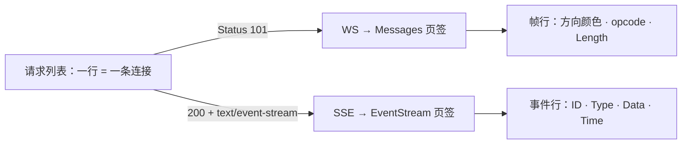

import { Canvas, Controls, Meta } from '@storybook/addon-docs/blocks';
import * as Stories from './websocket.stories';

<Meta of={Stories} name="Docs" />

# 检查 WebSocket 与 SSE

WebSocket 与 EventSource（即 SSE，Server-Sent Events，服务器单向事件流）都是长连接：标头只交换一次，消息在连接里持续流动。Network 面板把每条长连接记为一行请求，但和普通 HTTP 请求不同——连接建立后列表不再新增行，消息在详情页签里按帧追加。本课的读法固定两步：先在请求列表与 Headers（标头）页签确认连接状态，再进 Messages（消息帧）或 EventStream（事件流）页签读消息流。

两个边界先说清。其一，本课聚焦长连接的消息流检查，HTTP 请求的基础操作（过滤、搜索、导出 HAR）见[查看请求](?path=/docs/network--docs)，节流、阻断等改变请求行为的手段见[控制请求](?path=/docs/network-overrides--docs)。其二，WS 与 SSE 都需要真实服务端，静态演示页无法稳定复现连接——本课 Canvas 是「消息帧阅读器」，用预置帧序列练习 Messages 页签的读法，不伪造真实连接；跑真实连接的最小服务端代码在「最小服务端与客户端」一节。

消息检查的两条路径：



回查入口：

| 任务 | 入口与关键读数 |
| --- | --- |
| 定位 WS 连接 | 类型按钮 WS，或属性过滤 `is:running`（进行中的 WebSocket） |
| 定位 EventSource 请求 | 类型按钮 Fetch/XHR；补 Type 列可见 EventSource |
| 确认连接状态 | Headers 页签：WS 是 `101 Switching Protocols`；SSE 是普通 200 |
| 读 WS 消息 | 详情 → Messages 页签（只保留最近 100 条，重新点连接名刷新） |
| 读 SSE 消息 | 详情 → EventStream 页签 |
| 帧行配色 | 发出浅绿、到达白、opcode（操作码，帧类型的数字编号）控制帧浅黄、错误浅红 |
| 过滤消息 | 页签内 regex 输入框；WS 另有 All / Send / Receive 下拉 |
| 清空与复制 | Clear all（全部清除）按钮；右键 Copy message（复制消息） |

## 快速上手

演示页是「消息帧阅读器」：Controls 的「帧场景」切换四组预置帧序列，Canvas 按 Messages 页签的配色与列含义画出帧行（行首箭头：↑ = 发出，↓ = 到达），readout（读数）给出读法结论。这是练习读法的模拟帧，不是真实连接。

<Canvas of={Stories.FrameReader} />
<Controls of={Stories.FrameReader} />

最小闭环——按 Messages 页签的读法读一遍四个场景：

1. 「文本往返」：浅绿行是你发出的文本帧、白行是到达的文本帧；文本帧的 Data 列直接显示消息内容，Length 是 payload（载荷）字节数。
2. 「二进制与分片」：Data 列不再显示内容，而是 opcode 名称——`Binary message (Opcode 2)` 是二进制消息，`Continuation frame (Opcode 0)` 接续上一条消息的分片。
3. 「心跳保活」：到达 `Ping message (Opcode 9)` 后紧随发出 `Pong message (Opcode 10, mask)`——这对帧由协议层处理，JS 收不到 message 事件；行尾的 mask（掩码）表示这一帧由客户端发出。
4. 「关闭握手」：`Connection close message (Opcode 8)` 一来一回——谁先发起看方向，payload 前 2 字节是 close code（关闭码），1000 表示正常关闭。

| 读者操作 | 可观察证据 |
| --- | --- |
| 切换「帧场景」 | Canvas 按 Messages 页签配色重画帧行；readout 的读法结论同步更新 |
| 打开 Show code | 看到该 Canvas 实际执行的 `frame-reader.ts` |

## 找到长连接

长连接与普通请求共用一个列表，但行的含义不同：HTTP 请求一行 = 一次请求响应；长连接一行 = 一条连接，行上的 Status 与 Headers 描述的是握手那一刻，之后的一切都在页签里流动。面板状态与 JS 状态互为对照：

| `WebSocket.readyState` | 值 | 含义 |
| --- | --- | --- |
| `WebSocket.CONNECTING` | 0 | 已创建，连接尚未打开 |
| `WebSocket.OPEN` | 1 | 连接打开，可以通信 |
| `WebSocket.CLOSING` | 2 | 正在关闭 |
| `WebSocket.CLOSED` | 3 | 已关闭，或连接根本没能建立 |

| `EventSource.readyState` | 值 | 含义 |
| --- | --- | --- |
| `EventSource.CONNECTING` | 0 | 连接中（含等待重连） |
| `EventSource.OPEN` | 1 | 连接打开 |
| `EventSource.CLOSED` | 2 | 已关闭（调用过 `close()`） |

### WebSocket 的握手行

WS 连接以一次 HTTP Upgrade（协议升级）握手开始：客户端发 GET 请求，带 `Upgrade: websocket`、`Connection: Upgrade` 标头与 `Sec-WebSocket-Key`；服务器以 `101 Switching Protocols` 应答，之后同一条连接就切换成 WS 帧通道。所以这条行的 Status 是 101——它不是普通响应码，而是握手成功的证据；Headers 页签里能看到上述升级标头。握手被拒时（如服务器返回 400），行上就是那个普通状态码，JS 侧依次触发 error 与 close，`onclose` 的 `CloseEvent.code` 是 1006（Abnormal Closure，异常关闭）这类保留码——由浏览器本地合成，不来自服务器。

实践要点：

- 找进行中的连接：类型按钮 WS，或 Filter 框输入 `is:running`。
- 原生 WebSocket API 没有自动重连：连接断开后，除非应用代码重连，列表不会出现新行——排查「断了没人管」时先分清这是协议行为还是代码缺失。

### EventSource 的请求行

EventSource 就是普通 HTTP GET：服务器以 200 应答并保持连接打开，响应头 `Content-Type: text/event-stream`（事件流格式）是它唯一的身份标记。列表行上 Type 列显示 EventSource（资源类型 eventsource，归在 Fetch/XHR 分类下），没有专门的类型按钮。

与 WS 的两个关键差异都写在列表行为里：

- 这条行长期处于进行中：连接不断开就不算完成。
- 自动重连会出新行：连接断开后，浏览器按内建间隔（服务器可用 `retry:` 字段调整）重新发起请求——同一个 EventSource 的生命周期在列表里是多条连续的行。看到 SSE 同名请求不断新增，先想「是不是服务器一直没给出正确响应」。

## 读 WebSocket 消息帧

点开 WS 行切到 Messages 页签：表格只保留最近 100 条消息，重新点 Name 下的连接名可刷新视图。列的含义：

| 列 | 含义 |
| --- | --- |
| Data | 消息内容；文本帧直接显示文本，其余帧显示 opcode 名称（见下表） |
| Length | 消息 payload 的字节数 |
| Time | 该帧发出或到达的时间 |

行配色即方向语义（与快速上手的模拟帧一致）：

| 行色 | 含义 |
| --- | --- |
| 浅绿 | 发出的文本帧 |
| 白 | 到达的文本帧 |
| 浅黄 | opcode 控制帧（不分方向） |
| 浅红 | 协议层错误行（Length 显示 N/A） |

opcode 回查表——Data 列对非文本帧的显示格式是 `名称 (Opcode 数字)`：

| Opcode | Data 列显示 | 语义 |
| --- | --- | --- |
| 0 | `Continuation frame (Opcode 0)` | 上一条消息的后续分片 |
| 1 | （显示消息文本本身） | 文本消息 |
| 2 | `Binary message (Opcode 2)` | 二进制消息，Length 给字节数 |
| 8 | `Connection close message (Opcode 8)` | 关闭握手帧 |
| 9 | `Ping message (Opcode 9)` | 心跳探测 |
| 10 | `Pong message (Opcode 10)` | 心跳应答 |

两个协议细节会让读数更可读：其一，客户端发出的 opcode 行带 `, mask` 后缀——协议要求客户端到服务器的帧必须掩码（masking，用随机密钥混淆 payload 的安全机制），服务器发出的不掩码，所以 mask 是「这一帧是谁发的」的旁证；其二，Ping 与 Pong 是协议层心跳，收到 Ping 必须尽快以相同 payload 回 Pong，浏览器自动完成应答，JS 代码收不到这对事件——面板里这对浅黄行就是保活正常的证据。

页签内的操作：顶部下拉在 All / Send / Receive 间切换方向，regex 输入框按内容过滤消息；Clear all 清空当前视图；点选一行后在下方窗格查看该帧内容，右键 Copy message 复制单帧。要留证据别依赖面板——100 条滚动上限会丢早期消息，清空后的帧也不再回来。

## 读 EventStream 事件流

EventStream 页签服务 EventSource API 以及流式返回的 fetch / XHR 请求。打开方式相同：点请求行 → EventStream 页签。列：

| 列 | 含义 |
| --- | --- |
| ID | 事件流的 `id:` 字段值 |
| Type | 事件类型（`event:` 字段）；没有 `event:` 字段的事件按默认类型 message 分发 |
| Data | 事件数据（`data:` 字段内容） |
| Time | 事件到达时间 |

过滤与 WS 类似：regex 输入框匹配类型、ID 与数据三者；Clear all 清空，右键 Copy message 复制单条。

要读懂 Data 列，得知道服务器发的是什么。事件流是 UTF-8 文本，`Content-Type: text/event-stream`；事件之间用空行分隔，每个事件由若干字段行组成：

| 字段行 | 作用 |
| --- | --- |
| `data:` | 事件数据；连续多条 `data:` 行拼接成一条数据（中间补换行） |
| `event:` | 事件类型，客户端用 `addEventListener` 按名监听 |
| `id:` | 事件 ID，写入 EventSource 对象的 last event ID 值 |
| `retry:` | 重连等待毫秒数，服务器用它调整浏览器重连节奏 |
| `:` 开头 | 注释行，被浏览器忽略——服务器常用它做保活 |

自动重连是 EventSource 的内建行为：连接断开（除非你调用了 `close()`）浏览器会重连，readyState 回到 CONNECTING（0）。所以「EventStream 停止增长 + 列表新增同名行」是服务器掉线的完整证据链。

## 最小服务端与客户端

跑真实连接前先备好观察条件：先打开 Network 面板再刷新页面——面板只记录打开期间的活动，先建立的连接不在列表里。

WS 需要 `ws` 包（`npm install ws`），SSE 用原生 http，零依赖。

最小 WS 服务器：

```js
// ws-server.mjs —— 最小回显服务器：每 3 秒 ping 一次，收到的文本原样回显
import { WebSocketServer } from 'ws';

const wss = new WebSocketServer({ port: 8080 });
wss.on('connection', (socket) => {
  socket.on('message', (data) => socket.send(`echo: ${data}`));
  setInterval(() => socket.ping(), 3000);
});
```

客户端在页面 Console（控制台）里执行：

```js
const socket = new WebSocket('ws://localhost:8080');
socket.onopen = () => socket.send('hello');
socket.onmessage = (event) => console.log('到达:', event.data);
socket.onclose = (event) => console.log('关闭:', event.code, event.reason);
```

预期：列表出现 `ws://localhost:8080` 的行，Status 101；Messages 页签里浅绿 `hello`、白 `echo: hello` 交替，每 3 秒一对 Ping / Pong 浅黄行——`socket.ping()` 由 `ws` 库发出，浏览器自动应答，与真实服务器的保活行为一致。

最小 SSE 服务器：

```js
// sse-server.mjs —— 原生 http：每秒推一条带 event 与 id 字段的事件
import { createServer } from 'node:http';

createServer((req, res) => {
  res.writeHead(200, {
    'Content-Type': 'text/event-stream',
    'Cache-Control': 'no-cache',
  });
  let id = 0;
  const timer = setInterval(() => {
    res.write(`event: tick\nid: ${++id}\ndata: now=${Date.now()}\n\n`);
  }, 1000);
  req.on('close', () => clearInterval(timer));
}).listen(8090);
```

客户端：

```js
const source = new EventSource('http://localhost:8090');
source.addEventListener('tick', (event) => console.log(event.data));
source.addEventListener('error', () => console.log('连接中断，等待重连'));
```

预期：列表出现 `http://localhost:8090` 的行，Type 列 EventSource；EventStream 页签里 ID 递增、Type 为 tick。两个必做实验：`Ctrl+C` 停掉 SSE 服务器——EventStream 停止增长，几秒后列表新增一条同名请求行（自动重连）；停掉 WS 服务器——列表没有任何新行，Console 打出「关闭: 1006」（异常关闭，对面没有发 close 帧）。这一对比是两种协议在面板里最重要的行为差异。

弱网验证：Network 面板的 Throttling（节流）自 Chrome 99 起对 WS 连接生效——用上面的回显服务器，对比发出消息与回显消息的 Time 差即可量化节流效果（Throttling 的设置入口见[控制请求](?path=/docs/network-overrides--docs)）。

## 最佳实践

- 排查长连接固定两步走：先连接层后消息层。连接层问题（握手失败、意外断开）在请求行 Status 与 Headers 页签；消息层问题（丢消息、内容不对）在 Messages / EventStream。JS 侧 readyState、`onclose` 的 `CloseEvent.code` 与面板互为对照：面板有 101 而 JS 报 CLOSED，先查代码路径；JS 报 1006，先查服务器与中间代理。
- 要留证据就别依赖面板：WS 消息只保留最近 100 条，长会话的早期帧会被滚出——重要消息用 Copy message 即时取证，或依赖应用层日志。
- 节流是 WS 弱网测试的正解：Throttling 自 Chrome 99 起作用于 WS，用回显时间差读数，而不是凭感觉猜。
- 多标签页测试 SSE 会互相挤占连接：HTTP/1.1 下同一浏览器 + 域名的 EventSource 连接上限约 6 条，超出的连接被挂起；HTTP/2 下按流协商，没有这个问题。本地多开验证时优先走 HTTP/2 或把事件合并进一条流。

## 常见问题

- Messages 页签里找不到刚收发的消息。
  重新点 Name 下的连接名刷新视图；再查页签内过滤是否残留——All / Send / Receive 下拉与 regex 输入框都只影响显示；超过 100 条的早期消息已被滚出，Clear all 清掉的帧也不再回来。
- `onclose` 报 1006，Messages 里却没有 Connection close 行。
  1006 是浏览器本地合成的保留码（Abnormal Closure），表示根本没收到 close 帧——服务器进程崩溃、网络中断或中间代理超时都是这个表现。处理：确认服务器存活，检查代理的空闲超时设置。
- EventSource 不断报 error，列表里同名请求反复新增。
  服务器没给出 `Content-Type: text/event-stream`（或被 CORS 拒绝），EventSource 视为连接失败并按内建间隔一直重连。修正响应头后，新行会稳定为一条长连接。
- WS 断线后页面没有恢复，列表也没有新行。
  原生 WebSocket API 没有自动重连——恢复必须由应用代码实现（重建连接、重新订阅）。别用 EventSource 的内建重连预期它。
- JS 收到的 data 和 Data 列对不上。
  事件流里连续多条 `data:` 行会拼接成一条数据（行间补换行）；另外 `:` 开头的行是注释，不会成为事件。对照「读 EventStream 事件流」的字段表检查原始流。
- 发送侧越积越多、消息延迟越来越大。
  读 `socket.bufferedAmount`（已入队尚未发出的字节数）：持续增长说明接收方或网络消化不了。WebSocket API 没有背压（backpressure）机制，限流要应用层自己做。

## 总结回顾

摘要：

Network 面板把每条 WS 或 SSE 连接记为一行，握手之后不再新增行（SSE 自动重连除外），消息在详情页签里流动：WS 在 Messages 页签读帧——浅绿发出、白到达、浅黄 opcode 控制帧、浅红错误，Data 列对文本帧显示内容、对其余帧显示 opcode 名称（客户端发出的带 mask 后缀），Length 是 payload 字节数，最近 100 条之外会被滚出；SSE 在 EventStream 页签读事件——ID、Type、Data、Time 对应事件流的 `id:`、`event:`、`data:` 字段，regex 过滤匹配类型、ID 与数据。连接层状态在请求行与 Headers：WS 是 `101 Switching Protocols` 的握手行，`is:running` 找进行中的连接，断开不重连（1006 是本地合成的保留码）；SSE 是 200 + `text/event-stream` 的普通请求，断开后按 `retry:` 节奏自动重连并出新行。真实连接用最小服务端跑起来观察，Throttling 自 Chrome 99 起可对 WS 做弱网验证。

一句话：

> 长连接在 Network 里「一行连接、页签流消息」：连接状态看请求行与 Headers，消息问题进 Messages 或 EventStream 逐帧读。

知识要点：

- WS 与 SSE 在请求列表里分别长什么样？`is:running`、WS 类型按钮、Type 列 EventSource 各定位什么？
- WS 握手行为什么是 101？握手被拒时 JS 侧会收到什么？
- Messages 页签三列各给什么？四种行色分别是什么语义？mask 后缀说明什么？
- 六个 opcode 的数字与语义分别是什么？Ping/Pong 为什么 JS 收不到？
- EventStream 四列对应事件流的哪些字段？`data:` 多行与 `:` 注释行如何处理？
- WS 与 SSE 在断线后的列表行为有什么差异？1006 从哪里来？
- 演示页的帧阅读器是真实连接吗？真实连接怎么跑起来？

## 参考资料

- [Network features reference](https://developer.chrome.com/docs/devtools/network/reference)
- [ResourceWebSocketFrameView.ts](https://chromium.googlesource.com/devtools/devtools-frontend/+/main/front_end/panels/network/ResourceWebSocketFrameView.ts)
- [ResourceChunkView.ts](https://chromium.googlesource.com/devtools/devtools-frontend/+/main/front_end/panels/network/ResourceChunkView.ts)
- [EventSourceMessagesView.ts](https://chromium.googlesource.com/devtools/devtools-frontend/+/main/front_end/panels/network/EventSourceMessagesView.ts)
- [ResourceType.ts](https://chromium.googlesource.com/devtools/devtools-frontend/+/main/front_end/core/common/ResourceType.ts)
- [WebSocket.readyState - MDN](https://developer.mozilla.org/en-US/docs/Web/API/WebSocket/readyState)
- [CloseEvent.code - MDN](https://developer.mozilla.org/en-US/docs/Web/API/CloseEvent/code)
- [WebSocket - MDN](https://developer.mozilla.org/en-US/docs/Web/API/WebSocket)
- [EventSource - MDN](https://developer.mozilla.org/en-US/docs/Web/API/EventSource)
- [Using server-sent events - MDN](https://developer.mozilla.org/en-US/docs/Web/API/Server-sent_events/Using_server-sent_events)
- [Writing WebSocket servers - MDN](https://developer.mozilla.org/en-US/docs/Web/API/WebSockets_API/Writing_WebSocket_servers)
