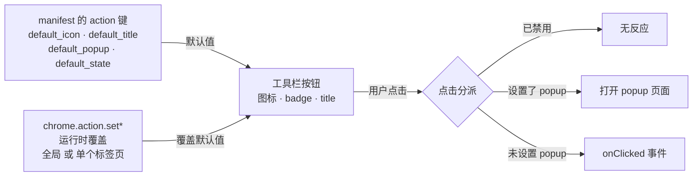

import { Canvas, Controls, Meta } from '@storybook/addon-docs/blocks';
import * as ActionPopup from './action-popup.stories';

<Meta of={ActionPopup} name="Docs" />

# Action 与弹窗

[第一个扩展](?path=/docs/first-extension--docs)里，`action.default_popup` 只负责一件事：点击工具栏图标时弹出页面。实际上整颗工具栏按钮都归 `action` 管：manifest 里的 `action` 键声明按钮的默认样子——图标、悬停提示、点击弹出的页面；运行时用 `chrome.action` API 覆盖这些默认值，还能按标签页分别设置。读完本课，你能回答四个问题：按钮的样子怎么设、badge 怎么用、点击后发生什么由谁决定、不同标签页怎么显示不同状态。

按钮的状态来源与点击分派是全课的主线：



没有 `action` 键的扩展同样有工具栏图标，只是点击没有任何反应。家族成员一览（`getBadgeText` 等对应的 `get*` 方法查询当前值）：

| 成员 | 作用 | 关键输入 | 备注 |
| --- | --- | --- | --- |
| manifest `action` | 声明默认值 | `default_icon` / `default_title` / `default_popup` / `default_state` | 四个字段都可省略 |
| `setIcon` | 换图标 | `path` 或 `imageData` | 可带 `tabId` |
| `setBadgeText` | badge 文字 | `text`，`''` 清空 | 可带 `tabId`；空间约 4 字符 |
| `setBadgeBackgroundColor` | badge 底色 | CSS 字符串或 `[r,g,b,a]` | |
| `setBadgeTextColor` | badge 文字色 | 同上 | Chrome 110+；不设置自动取对比色 |
| `setTitle` | 悬停提示 | `title` | 可带 `tabId` |
| `setPopup` | 点击弹出的页面 | `popup` 路径，`''` 移除 | 可带 `tabId` |
| `enable` / `disable` | 启用 / 禁用 | 可选 `tabId` | 禁用只置灰，不移除图标 |
| `onClicked` | 无 popup 时的点击事件 | 回调参数 `tabs.Tab` | 设置了 popup 就不触发 |
| `openPopup` | 代码打开 popup | `windowId` 可选 | Chrome 127+ |
| `isEnabled` / `getUserSettings` | 查询启用状态 / 是否固定在工具栏 | —— | 110+ / 91+ |

## 快速上手

沿用《第一个扩展》的扩展目录（本课目录下的 `extension/` 是这套文件的现成副本，可直接加载）。做三件事：给按钮补名字和图标、安装时点亮 badge、打开 popup 时清除 badge。

**第一步：manifest.json 补全 `action` 默认值，并注册 service worker。**

```json
{
  "manifest_version": 3,
  "name": "action-popup-demo",
  "version": "1.0",
  "action": {
    "default_icon": {
      "16": "icons/icon-16.png",
      "24": "icons/icon-24.png",
      "32": "icons/icon-32.png"
    },
    "default_title": "Action 与弹窗示例",
    "default_popup": "popup.html"
  },
  "background": {
    "service_worker": "sw.js"
  }
}
```

`default_title` 是悬停提示；`default_icon` 的键是像素尺寸，三个 PNG 在 `extension/icons/` 里可整目录拷走——没有图标文件时删掉 `default_icon`，Chrome 会显示扩展名首字母。

**第二步：新建 `sw.js`，安装时点亮 badge。**

```js
// 本示例演示：manifest 默认值 + chrome.action 运行时设置怎样配合。
// 安装或更新扩展时点亮 badge；打开 popup 时由 popup.js 清除。
chrome.runtime.onInstalled.addListener(() => {
  chrome.action.setBadgeBackgroundColor({ color: '#b91c1c' });
  chrome.action.setBadgeText({ text: 'NEW' });
});

// 点击事件只在“没有 popup”时触发。想体验这条分支：
// 从 manifest.json 的 action 里删掉 "default_popup"，点「重新加载」，
// 再点击工具栏图标。
chrome.action.onClicked.addListener((tab) => {
  // 只给当前标签页加 badge：其他标签页保持全局状态
  chrome.action.setBadgeText({ tabId: tab.id, text: 'HI' });
});
```

第二段监听器现在不会触发——popup 存在时点击会打开弹窗（原因见《onClicked：没有 popup 的点击》）；它同时是后面点击实验的现成代码。

**第三步：写 `popup.html` 与 `popup.js`，打开弹窗时清除 badge。**

```html
<!DOCTYPE html>
<html lang="zh-CN">
  <head>
    <meta charset="UTF-8" />
    <style>
      body { width: 220px; margin: 0; padding: 16px; font: 14px/1.6 system-ui, sans-serif; }
      h1 { margin: 0 0 8px; font-size: 15px; }
      p { margin: 0; color: #555; }
    </style>
  </head>
  <body>
    <h1>popup 已打开</h1>
    <p>打开弹窗即视为已读，工具栏上的 NEW badge 会被清除。</p>
    <script src="popup.js"></script>
  </body>
</html>
```

```js
// popup 是扩展上下文，可以直接调用 chrome.action。
// 空字符串 = 清空全局 badge，所有标签页的角标一起消失。
chrome.action.setBadgeText({ text: '' });
```

**加载与观察：** 到 `chrome://extensions` 重载扩展（或点「加载已解压的扩展程序」选本课的 `extension/`）：

| 操作 | 可观察结果 |
| --- | --- |
| 重载扩展（重新触发 `onInstalled`） | 图标右下角出现红底 "NEW"，悬停显示「Action 与弹窗示例」 |
| 点击图标 | popup 弹出，badge 同步消失 |
| 再次重载扩展 | "NEW" 重新出现 |

## 按钮外观：图标、badge 与 title

图标、badge、title 是按钮的三个外观成员，遵循同一设法：manifest 里用 `default_*` 声明默认值，运行时用对应的 `set*` 方法覆盖。覆盖分两级：调用不带 `tabId` 改的是**全局值**，对所有标签页生效；带 `tabId` 只改该标签页，且优先于全局值（机制详见《按标签页覆盖》）。

MV2 时代这套能力拆在 `chrome.browserAction`（常驻工具栏）与 `chrome.pageAction`（仅特定页面显示）两个 API 里；MV3 统一为一个 `chrome.action`，「仅某些页面可用」改用 tab 级覆盖与 enable/disable 表达。

### 图标：default_icon 与 setIcon

manifest 里按尺寸声明图标，键是像素值：

```json
"action": {
  "default_icon": {
    "16": "icons/icon-16.png",
    "24": "icons/icon-24.png",
    "32": "icons/icon-32.png"
  }
}
```

只有一个尺寸时直接写字符串路径：`"default_icon": "icons/icon-32.png"`。图标以 16 DIP 渲染，Chrome 选最接近的尺寸缩放填充，所以高倍屏（1.5x、2x）下最好提供 16/24/32 三档，否则缩放会发糊。格式边界：未打包的扩展必须用 PNG；打包成 .crx 后可用 JPEG、BMP、ICO 等位图格式，SVG 一律不支持。

运行时换图标用 `setIcon`，`path` 的写法与 `default_icon` 相同；在 popup 这类有 canvas 的上下文里也可以传 `imageData`（程序化生成图标）：

```js
await chrome.action.setIcon({
  path: { 16: 'icons/on-16.png', 24: 'icons/on-24.png', 32: 'icons/on-32.png' },
});
```

### badge：文字、底色与前景色

badge 是图标右下角的文字浮层，适合放轻量的计数或状态提示。三个方法各管一层：

```js
chrome.action.setBadgeText({ text: '7' });
chrome.action.setBadgeBackgroundColor({ color: '#b91c1c' }); // 也可写 [185, 28, 28, 255]
chrome.action.setBadgeTextColor({ color: '#ffffff' }); // Chrome 110+，不设置时自动取对比色
```

边界：

- 文字传任意长度都合法，但空间只放得下约 4 个字符，超出会被截断；中文等全角字符占位更宽，放得更少。
- `text: ''` 清空 badge；`{ tabId, text: null }` 清除该标签页的覆盖值，回退到全局值。
- badge 只是显示层，数字本身由扩展自己维护——什么时候刷新、用什么数据刷新，见《按标签页覆盖》与最佳实践。

### title：悬停提示

`default_title` 是鼠标悬停在图标上时显示的文字，运行时用 `setTitle` 覆盖：

```js
chrome.action.setTitle({ title: '当前页有 12 条未读' });
```

manifest 里也支持本地化写法 `"default_title": "__MSG_actionTitle__"`，配合 `_locales` 目录使用（见[国际化](?path=/docs/i18n--docs)）。

## 点击行为：popup、onClicked 与启用状态

用户点击按钮时，Chrome 按固定顺序分派：图标被禁用 → 无反应；设置了 popup → 打开 popup 页面；未设置 popup → 派发 `action.onClicked` 事件。popup 与 `onClicked` 互斥——一次点击只会走其中一条路。

### popup：default_popup 与 setPopup

`"default_popup": "popup.html"` 指向扩展根目录下的 HTML 文件，点击图标时以弹窗打开。popup 就是一个普通页面：任意 HTML/CSS，但脚本必须放在独立文件里（不能内联）；尺寸限制与「点外部即关闭」的生命周期见[第一个扩展](?path=/docs/first-extension--docs)。

运行时用 `setPopup` 切换或移除：

```js
await chrome.action.setPopup({ popup: 'settings.html' }); // 换一个页面
await chrome.action.setPopup({ popup: '' }); // 移除 popup，点击回落到 onClicked
```

需要展示多项功能或配置面板的扩展用 popup；单一动作的扩展省掉 popup，直接在 `onClicked` 里干活。Chrome 127+ 还提供 `chrome.action.openPopup()`，让扩展代码（如响应快捷键或菜单点击）主动打开 popup。popup 关闭即销毁，进行到一半的异步工作不要依赖它存活——跨关闭的状态交给 `chrome.storage` 或 service worker（见[扩展架构](?path=/docs/extension-architecture--docs)）。

### onClicked：没有 popup 的点击

```js
// sw.js —— 监听器要注册在 service worker 顶层
chrome.action.onClicked.addListener((tab) => {
  // tab.id 可直接使用；tab.url 等字段需要 "tabs" 或匹配的 host 权限（见[标签页与窗口](?path=/docs/tabs-windows--docs)）
});
```

回调参数是点击发生时所在标签页的 `tabs.Tab`。没有 popup 的扩展必须靠它才有点击行为。本课目录 `extension/` 的 sw.js 里就带着这个监听器：从 manifest 删掉 `default_popup` 并重载扩展，再点图标就能走这条分支——观察结果是当前标签页出现 "HI" badge，而其他标签页保持全局状态。

### enable 与 disable

`disable` 让图标置灰、点击失效，但图标仍留在工具栏上；它只影响 popup 的打开与 `onClicked` 的派发，不影响你用 `setBadgeText` 等方法继续更新外观。

```js
await chrome.action.disable(tabId); // 该标签页上置灰
await chrome.action.enable(tabId);
```

不带 `tabId` 是全局启停；manifest 里可用 `"default_state": "disabled"` 声明默认禁用（缺省为 `"enabled"`）。运行时用 `isEnabled()`（Chrome 110+）查询当前状态。

## 按标签页覆盖

上面所有 `set*` 方法的 `details` 都接受可选的 `tabId`，机制是同一条：

- 不带 `tabId`：设置**全局值**，对所有标签页生效；
- 带 `tabId`：只对该标签页生效，**优先于**全局值；
- 标签页关闭时，该页的 tab 级状态自动清除，外观回落到全局值；
- `getBadgeText({ tabId })` 等查询方法同样接受 `tabId`。

「仅在特定站点点亮」是最典型的用法：manifest 默认启用，service worker 监听标签页变化，按 URL 决定启用或禁用：

```js
// sw.js —— tab.url 需要 "tabs" 权限或匹配的 host 权限
chrome.tabs.onUpdated.addListener(async (tabId, changeInfo, tab) => {
  if (tab.url?.startsWith('https://api.example.com/')) {
    await chrome.action.enable(tabId);
  } else {
    await chrome.action.disable(tabId);
  }
});
```

badge 的每标签页计数是同一机制的另一面：给 `setBadgeText` 传 `tabId`，就只改当前页的角标。下面的演算把两级状态放在同一颗按钮上对照——调整全局值、标签页覆盖值与点击设置，观察两颗按钮与点击结果如何合成：

<Canvas of={ActionPopup.Interactive} />
<Controls of={ActionPopup.Interactive} />

| 读者操作 | 可观察证据 |
| --- | --- |
| 修改「全局 badge 文字」 | 两颗按钮的 badge 同步变化 |
| 修改「标签页 42 badge 覆盖」 | 只有「标签页 42」按钮变化，其他标签页仍是全局值 |
| 开关「设置了 popup」 | 点击结果在「打开 popup.html」与「派发 onClicked」之间切换 |
| 取消「启用状态」 | 按钮置灰，点击结果变为「无反应」；此时修改 badge 文字仍会渲染（呈灰色淡化） |
| 输入超过 4 个字符的 badge 文字 | 演算只显示前 4 个字符，对应文档「约 4 字符可容纳」的示意 |

## 最佳实践

- **popup 与 onClicked 按功能量取舍。** 一个入口做一件事的扩展（收藏此页、截图当前页）省掉 popup，点击直接执行，少一次页面打开销毁；需要多项功能或配置面板时才用 popup。两种形态可以运行时切换：`setPopup` 设置或移除，让按钮在不同页面呈现不同形态。
- **页面相关的状态一律带 `tabId`。** 全局 `setBadgeText` 会同时改掉所有标签页的角标；只有安装提示这类一次性全局场景才不带 `tabId`，跟页面内容相关的状态（如当前页未读数）都传 `tabId`。
- **badge 的数据别放在 service worker 内存里。** 角标显示由浏览器保存，service worker 休眠不会清掉它；但驱动它的业务计数会随 worker 终止而丢失。把计数写进 `chrome.storage`，在相关事件里读取后重设 badge（分区选择见[存储](?path=/docs/storage--docs)）。

## 常见问题

- 给 `action.onClicked` 注册了监听，点击图标却毫无反应
  检查 manifest 里是否还留着 `default_popup`，或代码里对当前标签页调用过 `setPopup`。删掉 `default_popup` 并重载扩展，或用 `setPopup({ popup: '' })` 移除后再试。
  判断依据：设置了 popup 的点击会打开 popup，不会派发 `onClicked`，两者互斥。
- badge 的数字过一会儿就「不更新了」或回到旧值
  把业务数据写进 `chrome.storage`，在每个相关事件里读取后重新调用 `setBadgeText`。
  判断依据：badge 显示本身不会消失（由浏览器保存），丢的是 service worker 内存里驱动它的业务状态——worker 被终止后按冷启动处理，没人替你重算角标。
- badge 文字显示不全或只剩一两个字符
  缩短文字，或改用图标、badge 底色来表达状态。
  判断依据：badge 空间约 4 个字符宽，中文等全角字符占位加倍，超出部分被截断。
- 在 content script 里调用 `chrome.action` 报 `undefined`
  通过 `runtime.sendMessage` 把要做的设置转交给 service worker 执行（用法见[消息通信](?path=/docs/messaging--docs)）。
  判断依据：action API 只在扩展上下文（service worker、popup 等）可用，content script 只有受限的 API 子集。

## 总结回顾

摘要：

工具栏上的 action 按钮由 manifest 的 `action` 键声明默认值——图标、悬停提示、点击弹出的页面与默认启用状态；运行时通过 `chrome.action` 的 `set*` 方法覆盖，覆盖分全局与标签页两级，tab 级优先且随标签页关闭自动回落到全局值。外观三件套是图标（16/24/32 多尺寸 PNG，不支持 SVG）、badge（文字、底色、前景色，约 4 字符宽）与 title（悬停提示）。点击按「禁用 → 有 popup → 无 popup」三步分派为无反应、打开 popup、派发 `onClicked` 三种结果。按标签页覆盖让按钮能做到「仅特定站点点亮」与每页独立角标。

一句话：

> action 按钮的每项外观与行为都有「manifest 默认值 + 运行时覆盖」两种设法，覆盖可全局也可按标签页；点击按「禁用 → popup → onClicked」三步分派。

知识要点：

- manifest 的 `action` 键有哪几个字段，各自声明什么默认值？
- `set*` 方法带与不带 `tabId` 有什么区别？tab 级状态什么时候清除？
- badge 三件套分别设置什么？badge 文字能放多少？
- 什么时候点击会触发 `onClicked`，什么时候不会？
- `disable` 之后图标与点击各处于什么状态？
- 怎样让按钮只在匹配的站点上可用？

## 参考资料

- [chrome.action API 参考](https://developer.chrome.com/docs/extensions/reference/api/action)
- [为扩展添加弹窗](https://developer.chrome.com/docs/extensions/develop/ui/add-popup)
- [manifest 字段参考](https://developer.chrome.com/docs/extensions/reference/manifest)
