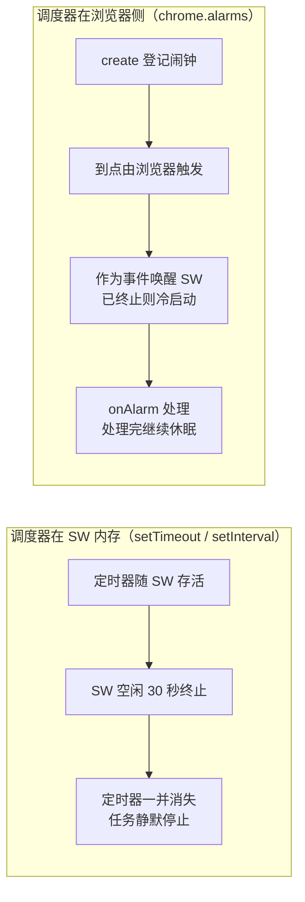

import { Canvas, Controls, Meta } from '@storybook/addon-docs/blocks';
import * as AlarmsStories from './alarms.stories';

<Meta of={AlarmsStories} name="Docs" />

# 定时任务

[Service Worker](?path=/docs/service-worker--docs)一课立过规矩：SW 空闲 30 秒即终止，全局作用域清零。推论到「定时」：任何活在 SW 内存里的定时器——`setTimeout`、`setInterval`——都会随终止一起消失，周期任务静默断掉。chrome.alarms 把调度的责任人换成浏览器：`create` 把闹钟登记在浏览器侧，不属于任何一次 SW 生命周期；到点由浏览器作为事件唤醒 SW、派发 `onAlarm`，处理完继续休眠。读完本课，遇到定时需求时先问一个问题：**调度器放在谁那里？** 放在 SW 里，终止即失效；放在浏览器里，跨终止、跨重启。



写代码前值得记住的数字与字段：

| 事项 | 值 | 说明 |
| --- | --- | --- |
| 权限 | manifest 的 `permissions` 加 `"alarms"` | 没声明时 `chrome.alarms` 是 `undefined`，调用即抛 `TypeError` |
| 创建 | `chrome.alarms.create(name?, alarmInfo)` | name 默认 `""`；同名闹钟是取消重建，不是报错 |
| 单次触发 | `when`（绝对时刻）或 `delayInMinutes`（相对延迟） | 二选一，都传会报错 |
| 周期触发 | `periodInMinutes` | 首次触发默认等一个周期，可用 when / delay 提前 |
| 最小间隔 | 0.5 分钟（Chrome 120+，此前 1 分钟） | 更小的 delay / period 被警告并按 0.5 执行；未打包开发模式无下限 |
| 触发精度 | 尽力而为 | 下限之外还可能被任意推迟；设备休眠错过后唤醒补发 |
| 持久性 | 跨 SW 终止与浏览器重启保留 | 扩展更新或重载会清空，需重建（见「管理闹钟」） |
| 接收 | `chrome.alarms.onAlarm` | 闹钟是唤醒源；监听器顶层同步注册（[Service Worker](?path=/docs/service-worker--docs)） |

## 为什么不用 setInterval

`setInterval` 的回调链只存在于 SW 的全局作用域里：SW 终止，定时器连同回调一起消失——没有报错、没有日志，任务只是静默停止。两种周期都会踩中：

- 周期 ≥ 30 秒：下一次回调还没等到，SW 已经终止，回调一次都跑不上。
- 周期 < 30 秒：只在 SW 存活的前 30 秒里跑几轮，之后全部沉默；而且只要中间断过一次（设备休眠、一次拖过 30 秒的等待），链就永久断了，不会自行恢复。

`chrome.alarms.create` 把闹钟登记到浏览器侧：闹钟不活在任何一次 SW 生命周期里，到点触发本身就是扩展事件，与 `tabs.onUpdated` 同类，能唤醒 SW（2.2「事件驱动」列出的唤醒源之一）。

下面的模拟把同一个任务交给两种调度器（任务本身不调用扩展 API），调整「任务间隔」即可预测两条时间轴的分岔。

<Canvas of={AlarmsStories.IntervalVsAlarms} />
<Controls of={AlarmsStories.IntervalVsAlarms} />

| 读者操作 | 可观察证据 |
| --- | --- |
| 把「任务间隔」调到 45 秒 | 场景 A 一次回调都没触发，30 秒处出现终止线；场景 B 仍按间隔到点，每次都带一段 SW 存活条（冷启动唤醒） |
| 调到 10 秒 | 场景 A 在终止前触发两次后沉默；场景 B 的到点间隔小于 30 秒，SW 存活条连成一片——空闲计时不断被重置 |
| 看「alarms 场景冷启动」读数 | 间隔超过 30 秒时每次到点都是冷启动；小于 30 秒时为 0 次 |

边界：只活在单次事件处理内的短等待（处理中防抖 500 ms、等待一个节流窗口）用 `setTimeout` 没有问题——它不需要活过本次处理。「周期任务每次都调用扩展 API」的确可能踩着 30 秒续命（Chrome 110+），但链断一次就永久停摆，属于反模式，见本文「最佳实践」。

想在真实扩展里核对：往 `sw.js` 挂一个 `setInterval`，再挂一个 `chrome.alarms.create('demo', { periodInMinutes: 1 })` 与 `onAlarm` 日志，重载扩展后关掉它的 DevTools 等 SW 休眠；几分钟后 `setInterval` 的日志早已沉默，闹钟日志每分钟照常出现，`chrome://extensions` 卡片的 SW 状态随之从 Inactive 短暂变为 Active（调试入口见[调试扩展](?path=/docs/debugging--docs)）。

## 创建闹钟

`chrome.alarms.create(name?, alarmInfo)` 负责登记。`name` 省略时默认 `""`；**同名闹钟是取消重建**——重复调用 create 会清掉旧计划重新排程，创建代码被意外重复执行时最容易在这里踩坑。一个扩展可以同时挂多个不同名的闹钟，到点后按 `name` 分发。创建是扩展 API 调用，本身会唤醒（或续命）SW，但闹钟之后的生命周期由浏览器管理，不随这次调用所在的处理结束而消失。

先在 manifest 声明权限：

```json
{
  "permissions": ["alarms"]
}
```

```js
// sw.js —— 登记一个每小时触发一次的闹钟
chrome.alarms.create('sync', { periodInMinutes: 60 });
```

### 时间参数与触发计划

`alarmInfo` 的三个时间参数回答「什么时候开始、多久一次」：

| 参数 | 含义 | 首次触发 | 典型用法 |
| --- | --- | --- | --- |
| `when` | 绝对时刻，epoch 毫秒（如 `Date.now() + n`） | 时刻到达时 | 「明早 9 点提醒一次」 |
| `delayInMinutes` | 距创建时刻的延迟（分钟） | 延迟结束时 | 「10 分钟后检查一次」 |
| `periodInMinutes` | 重复周期（分钟） | 一个周期之后 | 「每小时同步一次」 |

- 单次触发：`when` 与 `delayInMinutes` 二选一，都传会报错。
- 周期触发：`periodInMinutes` 决定重复；首次触发默认就在一个周期之后，需要更早的首跑时与 when / delay 组合：

```js
// 10 分钟后首跑，之后每 30 分钟一次
chrome.alarms.create('poll', { delayInMinutes: 10, periodInMinutes: 30 });
// 明早 9 点单次：when 用 epoch 毫秒
chrome.alarms.create('morning', { when: nextNineAm() });
```

下面的模拟从 `create` 调用画出后续计划：上泳道是代码请求的触发时刻，下泳道是 Chrome 实际执行的触发时刻。

<Canvas of={AlarmsStories.Create} />
<Controls of={AlarmsStories.Create} />

| 读者操作 | 可观察证据 |
| --- | --- |
| 把「时长」拖到 0.25 分钟，保持已打包 | 上泳道标在 15 秒，下泳道被上调到 30 秒；读数给出「被上调为 30 秒」 |
| 切到「未打包（开发模式）」 | 15 秒请求原样执行——开发期没有频率下限 |
| 切换「时间参数」为 when、时长 0.25 分钟 | 不出现警告文案，但实际触发同样不早于 30 秒 |
| 打开「20 秒后同名 create」 | 两条泳道都从重建时刻重排，未触发的请求作废 |

### 周期下限与精度

- **30 秒下限（Chrome 120+）。** 打包扩展的闹钟至多每 30 秒触发一次，此前是 1 分钟。`delayInMinutes` / `periodInMinutes` 低于 0.5 分钟不被采纳：控制台出现一条警告，实际按下限执行。
- **`when` 的下限不警告。** `when` 可以写在 30 秒内、不会报错，但实际触发不会早于 30 秒之后。
- **开发模式没有下限。** 以「加载已解压的扩展程序」运行时，闹钟触发频率不受限制——密集触发在开发环境调试，上架打包后再核对真实节奏。
- **下限不是承诺。** Chrome 可能在 30 秒之外再任意推迟（负载、节能）；`alarm.scheduledTime` 是计划时刻，不是实际触发时刻。
- **设备休眠。** 休眠期间闹钟照常计时，但不会唤醒设备；错过的到点在唤醒后尽快补发——周期闹钟至多补发一次，然后从唤醒时刻重新排程。睡了一夜的每小时闹钟醒来只补跑一次，不是补跑八次。

## 接收闹钟

`chrome.alarms.onAlarm` 是到点的唯一接收口。监听器遵守与 2.2 相同的规则：**顶层同步注册**——闹钟是唤醒源，SW 被唤醒后事件立即派发，异步注册的监听器接不住。

监听器收到一个 Alarm 对象：

| 字段 | 含义 |
| --- | --- |
| `name` | 创建时的名字，分发依据 |
| `scheduledTime` | 计划触发时刻（epoch 毫秒）；实际触发可能晚于它 |
| `periodInMinutes` | 周期闹钟才有；可以用它区分单次与周期 |

```js
// sw.js —— 顶层注册；处理函数按冷启动写：状态从 storage 读，结果写回 storage
chrome.alarms.onAlarm.addListener(async (alarm) => {
  if (alarm.name !== 'sync') return;
  const { cursor = 0 } = await chrome.storage.local.get('cursor');
  const next = await syncFrom(cursor);
  await chrome.storage.local.set({ cursor: next });
});
```

处理函数写完后可以在 SW 的 DevTools Console 里执行 `chrome.alarms.create('demo', { delayInMinutes: 1 })`，关掉 DevTools 让 SW 休眠；约一分钟后日志出现、`chrome://extensions` 卡片的 SW 状态短暂变为 Active——这就是闹钟把 SW 从终止状态里唤醒（调试入口见[调试扩展](?path=/docs/debugging--docs)）。

## 管理闹钟

| 方法 | 返回 | 用途 |
| --- | --- | --- |
| `chrome.alarms.get(name?)` | `Promise<Alarm \| undefined>` | 查单个闹钟；name 默认 `""` |
| `chrome.alarms.getAll()` | `Promise<Alarm[]>` | 列出全部闹钟 |
| `chrome.alarms.clear(name?)` | `Promise<boolean>` | 清除单个；返回是否有闹钟被清除 |
| `chrome.alarms.clearAll()` | `Promise<boolean>` | 清除全部 |

闹钟登记在浏览器侧，SW 终止、浏览器重启都不清空（Chrome 默认行为）；**扩展更新与「加载已解压」的重载会清空全部闹钟**。Chrome 150 起可在 `alarmInfo` 里显式传 `persistAcrossSessions: false`（重载或重启即清空），此前版本该字段无效；`Alarm` 对象上也会带出这个字段。

因此定时任务的创建要自带恢复：每次 SW 启动都自检一次，缺了就重建。

```js
// sw.js —— 顶层自检：安装、更新、重载、被事件唤醒的每次启动都会执行
const SYNC_ALARM = 'sync';

async function ensureAlarm() {
  const alarm = await chrome.alarms.get(SYNC_ALARM);
  if (!alarm) {
    await chrome.alarms.create(SYNC_ALARM, { periodInMinutes: 60 });
  }
}

ensureAlarm();
```

核对一遍：在 SW DevTools 里执行 `chrome.alarms.getAll()` 看清单；点击 `chrome://extensions` 上的重新加载后再查——清单被清空，顶层自检随即把它重建。

## 最佳实践

- **按等待时长选工具。** 单次等待不到 30 秒、也不需要跨终止的（处理中的防抖、限流），留在当前事件处理内用 `setTimeout`；30 秒以上或要跨终止的，一律 `chrome.alarms`（Chrome 120 官方博客给出的分工）。
- **不要用「setInterval + 每次调用扩展 API」续命做周期调度。** Chrome 110+ 确实会被续住，但链路断一次就永久停摆，且与平台缩短 SW 存活的方向相悖；续命手段的正确用途见 [Service Worker](?path=/docs/service-worker--docs)。
- **能用事件驱动的不要轮询。** `tabs`、`webNavigation`、消息等事件到了再干；确实由时间驱动的需求（每天一次、每小时一次）才交给闹钟。
- **周期任务按冷启动写。** 闹钟只负责唤醒；状态从 `chrome.storage` 读、结果写回（见[存储](?path=/docs/storage--docs)），需要「距上次执行满 X 分钟」这类判断时自己记录时间戳，不要依赖 `scheduledTime`。
- **创建保持幂等。** 顶层自检保证任何启动路径下闹钟都在；用有语义的 `name`，`onAlarm` 里按 `name` 分发。

## 常见问题

- 重载扩展或发布新版本后，之前创建的闹钟全部消失了
  闹钟随扩展重载与更新被清空是正常行为。把创建写成顶层自检（见「管理闹钟」）：SW 每次启动查一次 `chrome.alarms.get`，缺了就重建；只依赖 `onInstalled` 单点创建，在异常启动路径下会漏。

- `periodInMinutes` 设了 0.1，不报错，但每次都要等满 30 秒
  打包扩展有 30 秒下限（Chrome 120+）：低于 0.5 分钟的 delay / period 只有控制台警告，实际按下限执行。开发期用「加载已解压」验证密集触发；上架后仍需要秒级节奏，说明任务设计错了——改事件驱动，或把等待放进单次处理内。

- 闹钟没在排定时刻响，晚了几十秒甚至更久
  预期行为：下限之外 Chrome 还可能任意推迟，设备休眠错过的到点唤醒后才补发（周期只补一次）。需要相对精确的耗时判断时，把上次执行时刻写进 storage 自己计算，不要依赖 `scheduledTime`。

## 总结回顾

摘要：

MV3 的 service worker 按需启停，SW 内存里的 `setTimeout` / `setInterval` 随终止一起消失，周期任务会静默断掉；跨终止的定时只能交给登记在浏览器侧的 chrome.alarms。`create` 用 `name` 标识闹钟（同名即取消重建），`alarmInfo` 用 `when` / `delayInMinutes` 安排首次触发、用 `periodInMinutes` 安排周期；打包扩展受 30 秒最小间隔限制（Chrome 120+，此前 1 分钟），未打包的开发模式没有下限，实际触发还可能被任意推迟、设备休眠错过后唤醒补发。`onAlarm` 在顶层同步注册接收，Alarm 对象带 `name` / `scheduledTime` / `periodInMinutes`，处理函数按冷启动写、状态走 `chrome.storage`。闹钟默认跨 SW 终止与浏览器重启保留，但扩展更新或重载会清空，用顶层自检保证它始终存在；`get` / `getAll` / `clear` / `clearAll` 负责查看与撤销。

一句话：

> 定时的责任人是浏览器：SW 内存里的定时器随终止消失，chrome.alarms 登记在浏览器侧，到点作为事件唤醒 service worker。

知识要点：

- 为什么 `setInterval` 在 MV3 SW 里不可靠？什么样的 `setTimeout` 仍然可用？
- `create` 的三种时间参数各管什么？单次与周期怎么组合？同名 create 会发生什么？
- 打包扩展的最小触发间隔是多少？开发模式有什么不同？
- `onAlarm` 监听器要遵守什么注册规则？Alarm 对象有哪些字段？
- 闹钟在什么时候被清空？怎样保证它始终存在？
- `get` / `getAll` / `clear` / `clearAll` 各自的签名与返回值是什么？

## 参考资料

- [chrome.alarms API 参考](https://developer.chrome.com/docs/extensions/reference/api/alarms)：create 参数与同名重建、Alarm 对象、30 秒下限与未打包差异、persistAcrossSessions、设备休眠行为。
- [Chrome 120 beta：扩展新特性](https://developer.chrome.com/blog/chrome-120-beta-whats-new-for-extensions/)：最小闹钟间隔从 1 分钟放宽到 30 秒，以及 setTimeout 与 alarms 的分工建议。
- [Service worker 生命周期](https://developer.chrome.com/docs/extensions/develop/concepts/service-workers/lifecycle)：空闲 30 秒终止、定时器随终止取消的行为依据。
