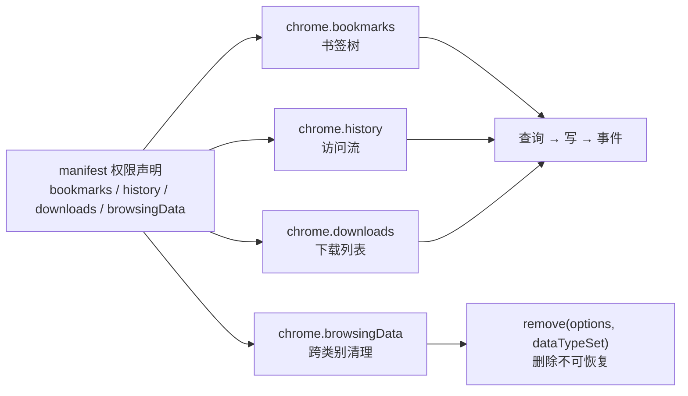

import { Canvas, Controls, Meta } from '@storybook/addon-docs/blocks';
import * as BrowserDataStories from './browser-data.stories';

<Meta of={BrowserDataStories} name="Docs" />

# 浏览器数据

书签、历史记录、下载列表是浏览器替用户保管的数据，扩展不是它们的主人，只是按权限进出的访客。Chrome 用四个 API 族向扩展开放这些数据：`chrome.bookmarks`、`chrome.history`、`chrome.downloads` 各管一份，`chrome.browsingData` 跨份清理。前三族形状相同——查询拿现状、写操作改现状、`on*` 事件广播现状变化；第四族只做删除，且删了就不可恢复。记住这个分工，本课每个操作的结果都能预测：查询 API 返回什么结构、写操作默认落在哪里、事件什么时候把 service worker 唤醒。



写代码前先立住权限表：每个族有且只有一个对应的具名权限，缺了权限时对应的 `chrome.*` 命名空间是 `undefined`，调用即 `TypeError`（权限声明与运行时申请的规则见 [Manifest 与权限](?path=/docs/manifest-permissions--docs)）。

| API 族 | manifest 权限 | 数据 | 读 | 写 / 删 | 事件 |
| --- | --- | --- | --- | --- | --- |
| `chrome.bookmarks` | `"bookmarks"` | 书签树 | `getTree` / `getSubTree` / `getChildren` / `getRecent` / `search` | `create` / `move` / `update` / `remove` / `removeTree` | `onCreated` / `onChanged` / `onMoved` / `onRemoved` |
| `chrome.history` | `"history"` | 访问历史 | `search` / `getVisits` | `addUrl` / `deleteUrl` / `deleteRange` / `deleteAll` | `onVisited` / `onVisitRemoved` |
| `chrome.downloads` | `"downloads"`；`open` 另需 `"downloads.open"`，`setUiOptions` 另需 `"downloads.ui"` | 下载列表与文件状态 | `search` / `getFileIcon` | `download` / `pause` / `resume` / `cancel` / `erase` / `removeFile` | `onCreated` / `onChanged` / `onErased` / `onDeterminingFilename` |
| `chrome.browsingData` | `"browsingData"` | cookie、缓存、网站存储、历史、下载列表等 | `settings()` | `remove()` 与 `removeCookies` 等便捷方法 | 无 |
| `chrome.topSites` | `"topSites"` | 新标签页常用网站 | `get()` | 无 | 无 |
| `chrome.readingList` | `"readingList"` | 阅读列表 | `query` | `addEntry` / `updateEntry` / `removeEntry` | `onEntryAdded` / `onEntryUpdated` / `onEntryRemoved` |

本课按「书签 → 历史 → 下载 → 清理」展开，末尾补两个小接口。除 `browsingData` 外每个族的核心机制都有可操作的模拟实例，真实环境里的核对步骤随文给出。

## 书签

书签是一棵树：一个根节点挂着书签栏、其他书签、移动书签等内置文件夹，文件夹下还可以继续嵌套子节点。所有定位都归结为一对数——**父节点 id 加 0 基 index**；所有事件都在回答「哪个节点的什么属性变了」。

### 读取书签树

`getTree()` 取整棵树：

```js
const [root] = await chrome.bookmarks.getTree();
// root.children = 各内置文件夹（顺序即界面顺序），children 再递归
```

`BookmarkTreeNode` 的字段：

| 字段 | 说明 |
| --- | --- |
| `id` | 节点唯一 id，浏览器重启后仍有效 |
| `parentId` | 父文件夹 id；根节点省略 |
| `index` | 在父文件夹中的 0 基位置 |
| `title` / `url` | 标题 / 目标地址；文件夹没有 `url` |
| `children` | 直接子节点数组，顺序即界面顺序；叶子省略 |
| `dateAdded` / `dateGroupModified` / `dateLastUsed` | 创建时间 / 文件夹内容最后变更 / 上次打开（`dateLastUsed` 自 Chrome 114+，文件夹不设） |
| `folderType` | 自 Chrome 134+：`'bookmarks-bar'` / `'other'` / `'mobile'` / `'managed'`，标识浏览器创建、用户与扩展都不可改的文件夹 |
| `syncing` | 自 Chrome 134+：是否随账号同步 |
| `unmodifiable` | `'managed'`（自 Chrome 44+）：企业管控节点，不可改名 / 移动 / 删除 |

定位内置文件夹有两条路：根节点 id 是 `"0"`（Chrome 145+ 起有常量 `chrome.bookmarks.ROOT_NODE_ID`），书签栏、其他书签、移动书签多年沿用 `"1"` / `"2"` / `"3"` 三个 id，但现行文档已不再列出它们——Chrome 134+ 起按 `folderType` 识别更稳。注意边界：根目录下不能增删节点，三个内置文件夹不能改名、移动、删除，`unmodifiable: 'managed'` 的节点同样动不得。

按需取数还有其他入口：`getSubTree(id)` 取某节点为根的子树，`getChildren(id)` 只取直接子节点，`getRecent(numberOfItems)` 取最近添加的若干条，`search(query)` 接受字符串或 `{ query, url, title }` 对象按 URL 与标题匹配。

下面的模拟把「父文件夹 + index」的定位规则和写操作触发的事件放在同一棵树上：

<Canvas of={BrowserDataStories.BookmarkTree} />
<Controls of={BrowserDataStories.BookmarkTree} />

| 读者操作 | 可观察证据 |
| --- | --- |
| 选「其他书签」，把「index」从 0 调到 2，点「create」 | 新节点出现在所选父文件夹的第 2 位；原第 2 位及之后的兄弟节点 index 各自 +1，日志出现 `onCreated(id, bookmark)` |
| 「节点类型」切到「文件夹（无 url）」再 create | 同一位置出现文件夹节点（无 url 标记），后续写操作都按文件夹对待 |
| 点「move 末尾书签到所选位置」 | 日志出现 `onMoved(id, { index, oldIndex, oldParentId, parentId })`，树上该节点从一个父文件夹跳到另一个 |
| 点「update 标题」 | 只改 `title`，日志 `onChanged(id, { title })`，界面标题同步更换 |
| 点「removeTree 首个文件夹」 | 该文件夹整支消失，`onRemoved` 只响一次（子节点不单独触发），读数「onRemoved 次数」加一 |
| 打开 Show code | 看到该 Canvas 实际执行的 `bookmark-tree.ts` |

真实核对：在 service worker 的 DevTools Console（入口见[调试扩展](?path=/docs/debugging--docs)）先执行 `const [root] = await chrome.bookmarks.getTree(); root.children.map(n => n.id + ' ' + n.title + ' ' + (n.folderType ?? ''))` 看清内置文件夹，再 `await chrome.bookmarks.create({ parentId: root.children[0].id, title: '定位验证', url: 'https://example.com' })`，最后 `await chrome.bookmarks.getChildren(root.children[0].id)` 看它落在第几位。

### 增删改移

`create` 接收 `CreateDetails`，四个字段全部可选：

```js
// sw.js —— 需要 "bookmarks" 权限
const node = await chrome.bookmarks.create({
  parentId: barId,      // 省略时默认落在「其他书签」文件夹
  index: 0,             // 省略时追加到末尾
  title: '扩展开发文档',
  url: 'https://developer.chrome.com/docs/extensions',
});
```

| 字段 | 省略时 |
| --- | --- |
| `parentId` | 默认落在「其他书签」文件夹 |
| `index` | 追加到父文件夹末尾 |
| `title` | 留空标题 |
| `url` | 创建文件夹——这是「书签」与「书签文件夹」唯一的区分方式 |

其余写操作：

| 方法 | 行为 |
| --- | --- |
| `update(id, changes)` | 只接受 `title` 与 `url` 两个字段，其他字段传入无效 |
| `move(id, { parentId?, index? })` | 跨文件夹移动或同文件夹内重排，返回移动后的节点 |
| `remove(id)` | 删除书签或**空**文件夹；对非空文件夹调用会失败 |
| `removeTree(id)` | 递归删除文件夹及其全部内容 |

### 监听书签变化

| 事件 | 回调参数 | 触发时机 |
| --- | --- | --- |
| `onCreated` | `(id, bookmark)` | 书签或文件夹创建后 |
| `onChanged` | `(id, changeInfo)` | `changeInfo` 只含 `title` 与可选的 `url`——目前只有这两项变化会触发 |
| `onMoved` | `(id, moveInfo)` | `moveInfo`：`index`、`oldIndex`、`oldParentId`、`parentId` |
| `onRemoved` | `(id, removeInfo)` | `removeInfo`：`index`、`parentId`、`node`（被删节点快照，Chrome 48+） |

三个补充：用户在浏览器里导入书签文件时派发 `onImportBegan` / `onImportEnded`（无参数）；`removeTree` 删整棵文件夹只对文件夹本身触发一次 `onRemoved`，子节点不逐个触发；`onRemoved` 的 `removeInfo.node` 是删除前的节点快照，做撤销提示或备份靠它。四个事件与 `alarms.onAlarm` 一样是 service worker 的唤醒源，监听器必须写在 SW 顶层同步注册（规则见 [Service Worker](?path=/docs/service-worker--docs)）。

## 历史

历史是一条按时间展开的访问流，但 `search` 不返回流，而是**按页聚合**：每个匹配页一条 `HistoryItem`，取该页最近一次访问。

### 搜索与统计

```js
// sw.js —— 需要 "history" 权限
// 默认只查最近 24 小时、最多 100 条
const today = await chrome.history.search({ text: '' });

// 全时段、最多 10 条
const top = await chrome.history.search({
  text: 'chrome',
  startTime: 0,        // 0 = 不限起点
  maxResults: 10,
});
```

`search` 的 query 对象：

| 字段 | 默认值 | 说明 |
| --- | --- | --- |
| `text` | — | 自由文本查询；空串返回全部页面 |
| `startTime` | 24 小时前 | 只返回该时刻之后的访问；`0` 表示不限 |
| `endTime` | 不限 | 限定更早的边界 |
| `maxResults` | 100 | 返回条数上限 |

每个 `HistoryItem` 自带 `visitCount`（导航到该页的次数）与 `typedCount`（其中在地址栏键入直达的次数）——「最常访问」按前者排即可，不需要自己维护计数。`getVisits({ url })` 进一步展开单页的每一次访问，返回 `VisitItem[]`：`visitTime`、`transition`（`link` / `typed` / `reload` 等 `TransitionType`）、`referringVisitId`、`isLocal`（Chrome 115+，`false` 表示这条访问是其他设备同步来的）。

下面的模拟把同一份历史交给不同参数组合，观察结果如何被过滤、聚合和统计：

<Canvas of={BrowserDataStories.HistorySearch} />
<Controls of={BrowserDataStories.HistorySearch} />

| 读者操作 | 可观察证据 |
| --- | --- |
| 「text」留空 | text 不再过滤内容，但「时间窗」仍默认只放行最近 24 小时的页面——两个默认值是叠加的 |
| 输入 `chrome` | 只剩 URL 或标题含该词的页面，逐行可核对 |
| 「时间窗」从「最近 24 小时（默认）」切到「全部时间（startTime: 0）」 | 几天前访问的页面出现——`startTime` 的默认值把它们挡在默认查询之外 |
| 「maxResults」调到 3 | 结果只剩 3 行，读数「被 maxResults 截断」显示窗口外还有多少匹配页 |
| 打开 Show code | 看到该 Canvas 实际执行的 `history-search.ts` |

真实核对：在 SW Console 里分别执行 `await chrome.history.search({ text: 'a' })` 与 `await chrome.history.search({ text: 'a', startTime: 0, maxResults: 5 })`，对比条数与 `lastVisitTime` 的时间跨度，即可验证两个默认值。

### 增删与监听

| 方法 | 行为 |
| --- | --- |
| `addUrl({ url })` | 以当前时间、`transition: 'link'` 写入一条访问 |
| `deleteUrl({ url })` | 删除该 URL 的全部出现；`url` 用 `search` 返回的格式 |
| `deleteRange({ startTime, endTime })` | 删除时间范围内的访问；**某页只有当全部访问都落在范围内时才整页消失** |
| `deleteAll()` | 清空全部历史 |

两个事件都在 service worker 上派发：

- `onVisited(result)`——页面**开始加载前**触发，回调参数就是该页的 `HistoryItem`。要在跳转前判断「这个站点去没去过」就用它；它和 `alarms.onAlarm` 一样能唤醒 SW，监听器要顶层注册。
- `onVisitRemoved({ allHistory, urls? })`——`deleteUrl` / `deleteRange` / `deleteAll` 之后派发；`deleteAll` 时 `allHistory` 为 `true`、`urls` 为空，否则 `urls` 是被删的 URL 列表。

`onVisited` 是唯一「实时」看到访问的入口：`search` 是快照，事件是流。

## 下载

下载是一个有状态机的长任务：`'in_progress'` 正常结束后变 `'complete'`，任何异常停在 `'interrupted'` 并由 `error`（`InterruptReason`）说明原因。扩展可以代用户发起、暂停、继续、取消，也可以只听进度、在文件名定下之前插手改名。

### 发起下载

```js
// sw.js —— 需要 "downloads" 权限
const id = await chrome.downloads.download({
  url: 'https://example.com/report.pdf',
  filename: 'reports/2026-10.pdf',   // 相对下载目录，可带子目录
  conflictAction: 'uniquify',
});
```

`DownloadOptions`：

| 字段 | 说明 |
| --- | --- |
| `url` | 必填，下载地址 |
| `filename` | 相对下载目录的文件名，可含子目录；绝对路径、空串、含 `..` 都会让 `download()` 直接报错 |
| `saveAs` | 总弹出另存为对话框；与 `filename` 同用会预填对话框 |
| `conflictAction` | `'uniquify'`（在扩展名之前插入计数） / `'overwrite'` / `'prompt'` |
| `method` + `headers` + `body` | `'GET'` / `'POST'`；需要时自定义请求头与请求体 |

`download()` 本身不需要用户手势，返回新下载的 id（number）；失败时返回 `undefined` 且 `chrome.runtime.lastError` 有值——错误字符串不保证跨版本稳定，别解析它，只用来判断「失败了」。`danger` 不是 `'safe'` 时下载会等用户裁定，`acceptDanger()` 替用户接受，但它只能从可见上下文（标签页、窗口、popup）调用，且 Promise 在对话框关闭后才 resolve。

### 控制与查询

```js
await chrome.downloads.pause(id);    // 暂停：连接保持，只是不再收数据
await chrome.downloads.resume(id);   // 继续
await chrome.downloads.cancel(id);   // 取消 → interrupted + error: 'USER_CANCELED'
await chrome.downloads.open(id);     // 打开文件；需要 "downloads.open" 且必须响应用户手势
chrome.downloads.show(id);           // 在下载界面中高亮这一项
```

`DownloadItem` 上要盯的字段：

| 字段 | 说明 |
| --- | --- |
| `state` | `'in_progress'` / `'interrupted'` / `'complete'` |
| `paused` | 暂停中：没有数据读取但连接保持 |
| `canResume` | 是否可续传（中断且条件允许时） |
| `error` | `InterruptReason`：`USER_CANCELED`、`FILE_NO_SPACE`、`NETWORK_FAILED`、`FILE_VIRUS_INFECTED` 等 |
| `filename` | 绝对本地路径；`bytesReceived` / `totalBytes` / `fileSize` 共同描述进度与体积 |
| `byExtensionId` / `byExtensionName` | 由哪个扩展发起；用户自己发起的下载这两个字段为空 |
| `exists` | 文件是否还在；**不主动监测**，`search()` 最多每 10 秒触发一次检查且不等待结果 |

`search(query)` 按 `DownloadQuery` 过滤下载列表：`limit` 默认 1000（传 `0` 表示全部）、`orderBy` 如 `['startTime']`（`'-'` 前缀倒序）、`query` 关键词（连字符前缀表示排除匹配）、`startedAfter` / `startedBefore` / `state` / `paused` / `error` 等字段过滤。另有 `erase(query)` 从列表抹掉记录（返回被抹掉的 id 数组，不动文件）、`removeFile(id)` 反过来只删文件、`getFileIcon(id, { size })` 取 16 或 32 像素图标。`setUiOptions({ enabled })` 控制下载界面显隐（需 `"downloads.ui"`）；旧的 `setShelfEnabled` 自 Chrome 117 起弃用。

下面的模拟把三种网络结局交给 pause / resume / cancel，看状态、读数与事件的对应关系：

<Canvas of={BrowserDataStories.DownloadLifecycle} />
<Controls of={BrowserDataStories.DownloadLifecycle} />

| 读者操作 | 可观察证据 |
| --- | --- |
| 点「download()」 | 下载进入列表，日志 `onCreated({ id: 7, state: "in_progress", … })`，进度条开始前进 |
| 下载中点「pause(id)」再点「resume(id)」 | 暂停时读数 `paused` 变 `true`、状态仍是 `in_progress`；日志分别是 `pause(7)` 与 `resume(7)`，继续后进度恢复前进 |
| 下载中点「cancel(id)」 | 状态变 `interrupted`，读数「error」为 `USER_CANCELED`，日志 `onChanged({ id: 7, state: { current: "interrupted", previous: "in_progress" }, error: … })` |
| 「网络结局」切到「磁盘空间不足」 | 下载推进到约四成时自动中断，`error` 变为 `FILE_NO_SPACE`，`canResume` 为 `false` |
| 打开 Show code | 看到该 Canvas 实际执行的 `download-lifecycle.ts` |

真实核对：在 SW Console 里 `const id = await chrome.downloads.download({ url: 'https://example.com/big.zip' })`，随后依次 `await chrome.downloads.pause(id)`、`await chrome.downloads.resume(id)`、`await chrome.downloads.cancel(id)`，每步都用 `chrome.downloads.search({ id })` 回读 `state` 与 `paused`。

### 监听下载事件

| 事件 | 回调参数 | 触发时机 |
| --- | --- | --- |
| `onCreated` | `(downloadItem)` | 下载进入列表 |
| `onChanged` | `(downloadDelta)` | `DownloadItem` 任何字段变化，**`bytesReceived` 与 `estimatedEndTime` 除外**；delta 里每项都是 `{ current, previous }` |
| `onErased` | `(downloadId)` | `erase()` 抹掉记录之后 |
| `onDeterminingFilename` | `(downloadItem, suggest)` | 浏览器确定文件名之前，给扩展一次改名机会 |

`onDeterminingFilename` 的规则要记牢：每个扩展只有一个监听器；`suggest({ filename, conflictAction })` 必须**恰好调用一次**，异步调用时监听器要返回 `true`，不传参数调用表示保留原文件名；多个扩展同时改时，最近安装且给出建议的胜出。目标文件名在调用 `download()` 时就已知道，优先直接传 `filename`，比事后拦截简单。

## 清理浏览数据

前三族是「读写用户的数据」，`chrome.browsingData` 是「删用户的数据」——没有确认对话框兜底，删掉不可恢复，参数选择本身就是安全设计。

### 数据类别与删除方法

`remove` 一次删多类，Promise 完成才表示删完：

```js
// sw.js —— 需要 "browsingData" 权限
await chrome.browsingData.remove(
  { since: Date.now() - 3600_000 },        // 过去一小时
  { cookies: true, cache: true, history: true },
);
```

两个参数分别是 `RemovalOptions`（何时、删哪些源的数据）与 `DataTypeSet`（删哪些类别）。`DataTypeSet` 成员全部可选、布尔值，缺省为 `false`：

| 类别 | 删掉什么 |
| --- | --- |
| `cookies` | cookie（连同服务端绑定证书），效果是所有网站登出 |
| `cache` | 浏览器缓存；`cacheStorage`（Chrome 72+）清 Cache API 数据 |
| `history` | 浏览历史——地址栏建议与新标签页常用网站随之变化 |
| `downloads` | 下载列表记录，不删本地文件 |
| `fileSystems` | 网站文件系统；`serviceWorkers`（Chrome 72+）清网站注册的 service worker |
| `indexedDB` / `localStorage` | 网站在本地存的全部结构化数据与键值对 |
| `formData` | 表单与自动填充数据 |
| `appcache` / `webSQL` / `pluginData` / `passwords` / `serverBoundCertificates` | 已弃用的类别（Chrome 76 起陆续），传了也没有效果 |

每个类别都有同名便捷方法 `removeCookies(options)`、`removeHistory(options)`、`removeCache(options)`、`removeDownloads(options)`、`removeLocalStorage(options)`、`removeIndexedDB(options)`、`removeFileSystems(options)`、`removeFormData(options)`、`removeCacheStorage(options)`、`removeServiceWorkers(options)`——只删一类时更短，签名与 `remove` 的 `options` 相同。`settings()` 返回用户当前在「清除浏览数据」界面勾选的类别，可以做默认值参考，但界面选项与 API 类别不是一一对应。清理没有任何事件，删完只能等 Promise。

删除在后台执行，可能持续数十秒，`remove()` 的 Promise 在这期间都不 resolve——不要轮询，也不要在 resolve 前假设数据已删完。

### 时间范围与源

`RemovalOptions`：

| 字段 | 默认值 | 说明 |
| --- | --- | --- |
| `since` | `0` | epoch 毫秒，删除该时刻之后累积的数据；省略即全部历史 |
| `origins` | 所有源 | Chrome 74+；只删列出的源，仅对 cookies、cache 与网站存储类生效 |
| `excludeOrigins` | — | Chrome 74+；保留列出的源；与 `origins` 互斥 |
| `originTypes` | 仅 `unprotectedWeb` | `unprotectedWeb`（普通网站）/ `protectedWeb`（以托管应用安装的站点）/ `extension`（`chrome-extension://` 源，文档要求格外小心） |

两点容易误判：`origins` 只对 cookies、cache 和网站存储类生效，删 `history` 时它不起作用，削弱不了历史删除的范围；清 cookie 覆盖整个可注册域名——清 `https://www.example.com` 会连同 `.example.com` 的 cookie 一起删。`browsingData` 权限在[权限列表](https://developer.chrome.com/docs/extensions/reference/permissions-list)里没有对应安装警告：用户安装时根本看不到这个扩展会清数据，所以删除动作必须自带确认界面，权限也尽量放进 `optional_permissions` 运行时申请（见 [Manifest 与权限](?path=/docs/manifest-permissions--docs)）。

下面的模拟把「类别 × 时间范围 × 源范围」交给同一份数据，勾选、调范围、执行，剩下的就是没被删的：

<Canvas of={BrowserDataStories.BrowsingDataRemoval} />
<Controls of={BrowserDataStories.BrowsingDataRemoval} />

| 读者操作 | 可观察证据 |
| --- | --- |
| 保持默认（`since` 省略、所有源），勾 cookies 与 history，点「执行 remove()」 | 删除量先按类别与范围算出，约 1 秒「删除中……」后两个类别清零，结果面板列出命中条数与「不可恢复」标记；其余类别原样保留 |
| 「时间范围」切到「过去一小时」 | 同一勾选下删除量骤降——`since` 默认 0 即全部历史，时间范围是收窄删除的第一道闸 |
| 「源范围」切到「仅 example.com（origins）」 | 只有该源的 cookies 与存储类数据被计入；勾选项若包含 history，其删除量不变——`origins` 对它无效 |
| 打开「originTypes.extension」 | 调用框追加 `originTypes: { extension: true }`，删除量计入 `chrome-extension://` 源的存储数据，并标注文档要求的「格外小心」 |
| 打开 Show code | 看到该 Canvas 实际执行的 `browsing-data-removal.ts` |

真实核对：在 SW Console 里 `await chrome.browsingData.settings()` 看用户当前勾选的类别，再 `const t = Date.now(); await chrome.browsingData.remove({ since: t }, { cache: true }); console.log(Date.now() - t, 'ms')` 感受一次真实清理的耗时与 Promise 落地时机。

## 其他数据接口

两个只读或单一职责的小接口，用到再查：

| 接口 | 权限 | 能力 | 备注 |
| --- | --- | --- | --- |
| `chrome.topSites` | `"topSites"` | `get()` 返回 `MostVisitedURL[]`（字段 `url` / `title`） | Chrome 96+；覆盖新标签页展示的常用网站，**不含用户自定义的快捷方式** |
| `chrome.readingList` | `"readingList"` | `addEntry({ hasBeenRead?, title?, url })` / `query({ hasBeenRead?, title?, url })` / `updateEntry` / `removeEntry({ url })`；事件 `onEntryAdded` / `onEntryUpdated` / `onEntryRemoved` | Chrome 120+ 起提供，现行文档以 `browser.readingList` 命名；`query` 中未指定的属性不参与匹配 |

## 最佳实践

- **破坏性权限运行时申请。** `bookmarks` / `history` / `downloads` / `browsingData` 都放进 `optional_permissions`，在用户点「清理」这类动作里用 `chrome.permissions.request` 再拿（规则见 [Manifest 与权限](?path=/docs/manifest-permissions--docs)）。`browsingData` 没有安装警告，更不能安装时静默常驻。
- **删除前展示将受影响的内容。** `removeTree` 前先 `getSubTree` 把条目列给用户看；`browsingData.remove` 前把类别清单、时间范围、源范围写进确认弹窗，绝不让一次点击删掉默认的全部历史（`since` 省略 = 0）。
- **清理范围先收窄。** 默认用「过去一小时」加 `origins` 白名单或 `excludeOrigins` 黑名单，而不是 `since: 0` 加全类别；删 cookie 一定附带「会登出所有站点」的提示。
- **大目录按需取。** `getTree` 是整棵树，书签几千条时整棵树可能很大：逐层导航用 `getChildren`，找一条用 `search`；history / downloads 的查询永远显式带 `maxResults` / `limit`。
- **下载进度用对通道。** 状态变化（暂停 / 完成 / 失败）跟 `onChanged`；字节级进度 `onChanged` 不触发，要实时百分比就用 `search` 轮询并节流；最终文件名用 `onDeterminingFilename` 的 `suggest`。
- **事件监听器写在 service worker 顶层。** 四族的 `on*` 与 `alarms.onAlarm` 一样是唤醒源，异步注册的监听器接不住（见 [Service Worker](?path=/docs/service-worker--docs)）。

## 常见问题

- `chrome.bookmarks`、`chrome.history`、`chrome.downloads` 是 `undefined`，一调用就 `TypeError`
  manifest 缺对应权限（四个权限名见开场参考表）。补上后到 `chrome://extensions` 点重新加载，在 SW Console 里确认 `typeof chrome.bookmarks` 是 `'object'` 再继续（调试入口见[调试扩展](?path=/docs/debugging--docs)）。

- `create` 的书签出现在「其他书签」，不在书签栏
  `CreateDetails.parentId` 省略时默认落在「其他书签」文件夹。显式传 `parentId`，且不要裸写 `'1'`——Chrome 134+ 起先 `getTree` 找 `folderType === 'bookmarks-bar'` 的节点再定位，比硬编码 id 稳。

- `history.search` 只返回最近几十条，「上周也访问过这个页面」
  两个默认值叠乘：`startTime` 默认 24 小时前、`maxResults` 默认 100。全时段查询显式 `startTime: 0` 并放大 `maxResults`；另外结果是每页一条、取最近访问，不是逐次访问的流水。

- `deleteRange` 之后部分页面还在历史里
  `deleteRange` 只删「全部访问都落在范围内」的页面，时间窗内只访问过几次的页面会留下。要精确删单页用 `deleteUrl({ url })`，`url` 用 `search` 返回的格式。

- `downloads.open()` 调用报错
  `open` 需要 `"downloads.open"` 权限，且只能作为用户手势的响应调用；`acceptDanger()` 同样只能从可见上下文（标签页、窗口、popup）调用，service worker 里调不了。

- `browsingData.remove()` 的 Promise 几十秒才 resolve，是卡住了吗
  不是。清理在后台执行，可能持续数十秒，Promise resolve 才表示删除完成；期间别轮询，也别在 resolve 前假设数据已删。

- 清完 cookie，用户在所有网站都掉登录了，更早的数据也没了
  `since` 省略等于 0（全部历史时段），`origins` 省略等于所有源，且清 cookie 覆盖整个可注册域名。先用 `since` 收窄时间范围、用 `origins` / `excludeOrigins` 收窄源范围，并在删除前提示登出后果。

- 下载进度用 `onChanged` 推不动，字节数一直不更新
  `onChanged` 明确不触发 `bytesReceived` 与 `estimatedEndTime` 的变化。状态类更新跟事件，字节进度用 `search` 轮询。

- `removeTree` 删了文件夹，`onRemoved` 只响了一次
  设计如此：递归删除只对文件夹本身触发一次 `onRemoved`，子节点不逐个触发。要给用户「删了 12 条」的提示，删前先 `getSubTree` 数一遍。

- `onDeterminingFilename` 里 `suggest` 没调用或调了两次
  每个扩展只有一个监听器，`suggest` 必须恰好调用一次；异步调用时监听器要返回 `true`。多个扩展都改同一文件名时，最近安装且给出建议的胜出。

## 总结回顾

摘要：

本课围绕四个操作「用户数据」的 API 族展开。`chrome.bookmarks` 把书签建模为树，定位永远是「父节点 id + 0 基 index」两个字段：读用 `getTree` / `getSubTree` / `search`，写用 `create`（无 `url` 即文件夹、`parentId` 省略落在其他书签）、`update`（只能改 `title` / `url`）、`move`、`remove` 与 `removeTree`；四个 `on*` 事件分别报告创建、变更、移动与删除，删除文件夹只响一次。`chrome.history` 的 `search` 按页聚合而非返回访问流，默认只查最近 24 小时、最多 100 条，`HistoryItem` 自带 `visitCount` / `typedCount`；`addUrl` / `deleteUrl` / `deleteRange` / `deleteAll` 写历史，`onVisited` 在页面加载前触发，`onVisitRemoved` 报告删除。`chrome.downloads` 是有状态机的长任务：`download()` 代发起，`pause` / `resume` / `cancel` 控制状态，`search` 查询列表，`open` 需要 `"downloads.open"` 与用户手势；`onChanged` 不触发 `bytesReceived`，`onDeterminingFilename` 的 `suggest` 必须恰好调用一次。`chrome.browsingData` 只做删除且不可恢复：`remove(options, dataTypeSet)` 按「时间范围 × 源范围 × 类别」执行，`since` 省略即全部历史，`origins` 删不了历史，删除无事件可听、只能等 Promise。四族共用同一地基——按族声明的具名权限，缺权限时对应命名空间是 `undefined`；破坏性操作走 `optional_permissions` 运行时申请，删除前让用户看清范围。

一句话：

> 浏览器数据 API 都是「持权限进出用户数据」：前三族查询拿现状、写操作改现状、`on*` 事件广播变化，而 `chrome.browsingData` 删了就不可恢复——时间范围、源范围与类别清单的参数选择，就是扩展对用户数据安全负的责任本身。

知识要点：

- 四个 API 族各需要哪个 manifest 权限？缺权限时对应的 `chrome.*` 是什么状态？
- 书签定位由哪两个字段决定？内置文件夹怎么稳妥识别？`create` 不带 `url` 创建的是什么？
- `remove` 与 `removeTree` 的差别是什么？删除文件夹时 `onRemoved` 触发几次？
- `history.search` 的两个默认值是什么？它返回的是访问流还是按页聚合的记录？
- `deleteRange` 为什么可能删不掉某些页面？`onVisited` 在页面生命周期的什么时刻触发？
- `chrome.downloads` 的状态机有哪三个状态？`pause` / `resume` / `cancel` 分别留下什么 `state` / `paused` / `error` 组合？
- `onChanged` 明确不触发哪两个字段的变化？`onDeterminingFilename` 的 `suggest` 调用规则是什么？
- `browsingData.remove` 的两个参数各控制什么？`since` 省略意味着什么？`origins` 对哪类数据不起作用？
- 为什么说 `browsingData` 没有安装警告反而更危险？删除类功能应该怎么申请权限、怎么确认？

## 参考资料

- [chrome.bookmarks API 参考](https://developer.chrome.com/docs/extensions/reference/api/bookmarks)：`BookmarkTreeNode` / `CreateDetails` 字段、方法签名、四个事件的回调参数、`ROOT_NODE_ID` 与 `folderType`。
- [chrome.history API 参考](https://developer.chrome.com/docs/extensions/reference/api/history)：`search` 的默认值与返回结构、`HistoryItem` / `VisitItem` 字段、`onVisited` / `onVisitRemoved` 参数。
- [chrome.downloads API 参考](https://developer.chrome.com/docs/extensions/reference/api/downloads)：`DownloadOptions` / `DownloadItem` / `DownloadQuery` 字段、`onChanged` 与 `onDeterminingFilename` 的行为约定、`downloads.open` / `downloads.ui` 权限。
- [chrome.browsingData API 参考](https://developer.chrome.com/docs/extensions/reference/api/browsingData)：`RemovalOptions` / `DataTypeSet` 成员、各便捷方法、数据类别的弃用版本。
- [chrome.topSites API 参考](https://developer.chrome.com/docs/extensions/reference/api/topSites)：`get()` 签名与 `MostVisitedURL` 字段。
- [chrome.readingList API 参考](https://developer.chrome.com/docs/extensions/reference/api/readingList)：条目增删改查与三个事件，Chrome 120+。
- [chrome.permissions API 参考](https://developer.chrome.com/docs/extensions/reference/permissions)：运行时申请权限与 `contains` / `remove` 的语义。
- [权限列表与安装警告文案](https://developer.chrome.com/docs/extensions/reference/permissions-list)：`bookmarks` / `history` / `downloads` / `topSites` 的警告文案，以及 `browsingData` 无警告这一事实。
