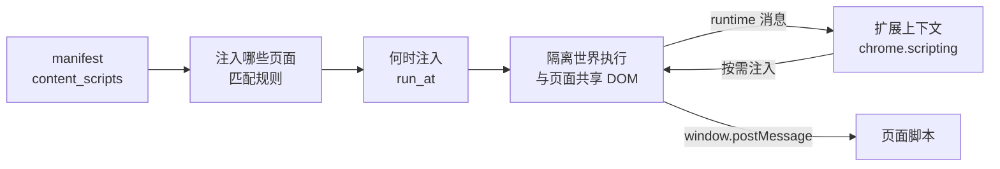
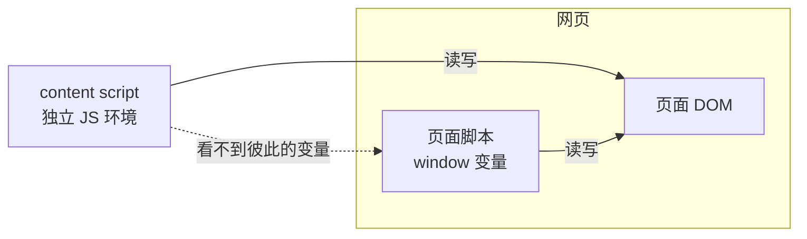

import { Canvas, Controls, Meta } from '@storybook/addon-docs/blocks';
import * as ContentScripts from './content-scripts.stories';

<Meta of={ContentScripts} name="Docs" />

# Content Scripts

扩展要触碰网页，正规入口只有一个：content script（内容脚本）。manifest 声明它注入哪些页面，Chrome 在匹配页面加载时把它注入进去，脚本随即读写页面 DOM——但它运行在网页的**隔离世界**里：与页面脚本共享同一棵 DOM 树，不共享任何 JS 变量。[扩展架构](?path=/docs/extension-architecture--docs)一课给出了这个定位，本课把它展开成一串可回答的问题：脚本会注入哪些页面、什么时机注入、执行时能看到什么、与页面脚本和扩展上下文怎么交换信息、不需要常驻时怎样按需注入和撤销。

本课的四条主线与一张注入判定的总图：



`content_scripts` 每个字段的形状与默认值，也是本课的回查表：

| 字段 | 默认值 | 作用 |
| --- | --- | --- |
| `matches` | 必填 | 注入到哪些 URL 的 match pattern 数组 |
| `js` | —（`js`/`css` 至少一个） | 注入的脚本，按数组顺序执行 |
| `css` | —（同上） | 注入的样式，按数组顺序，早于 DOM 构建 |
| `run_at` | `document_idle` | 注入时机三档：`document_start` / `document_end` / `document_idle` |
| `exclude_matches` | — | 命中即排除的 URL 模式 |
| `include_globs` / `exclude_globs` | — | `matches` 之后的 glob 二次过滤 |
| `all_frames` | `false` | 是否注入所有匹配框架（默认只注入顶层框架） |
| `match_about_blank` | `false` | 父页面匹配时，注入其 `about:blank` 子框架 |
| `match_origin_as_fallback` | `false` | 匹配源创建的 `about:` / `data:` / `blob:` 等框架 |
| `world` | `ISOLATED` | 执行世界，`MAIN` 表示进入页面主世界 |

## 匹配规则

静态声明写在 manifest 的 `content_scripts` 数组里，每个数组元素是一条独立的注入规则。判定逻辑一句话：**URL 命中 `matches`、没被排除规则命中，就注入**。

```json
{
  "content_scripts": [
    {
      "matches": ["https://example.com/*", "https://*.example.com/*"],
      "js": ["content.js"],
      "css": ["overlay.css"]
    }
  ]
}
```

### matches 与文件路径

- `matches` 是必填的 [match pattern](?path=/docs/manifest-permissions--docs) 数组：`*://*/*` 这类写法、`file:///` 的三个斜杠、子域要写 `*.example.com`——pattern 语法本身由[Manifest 与权限](?path=/docs/manifest-permissions--docs)一课承载，本课只用结论。
- 两条模式覆盖两类 URL：`https://example.com/*` 管站点本体，`https://*.example.com/*` 管子域；URL 命中任意一条即算匹配。注意 `https://` 不含 `http` 站点，`*.example.com` 也不含 `example.com` 本身。
- `js` 和 `css` 填扩展根目录的相对路径，前导 `/` 会被自动去掉；两者至少提供一个，都没有的规则没有意义。

### 排除与 glob

排除规则在匹配之后生效，顺序固定为「先 `matches` 收，再排除规则放」：

```json
{
  "matches": ["*://example.com/*"],
  "exclude_matches": ["*://example.com/private/*"],
  "include_globs": ["*://*/*article*"],
  "exclude_globs": ["*://*/*?debug=1"]
}
```

- `exclude_matches`：URL 命中就不再注入，适合把站点里的私信、后台页面摘出来。
- `include_globs` / `exclude_globs`：在 `matches` 结果上再做 glob 过滤，`*` 匹配任意长度字符串、`?` 匹配单个字符；拟的是 Greasemonkey 的 `@include` / `@exclude`。
- 最终判定：`matches`（连同 `include_globs`）命中，且 `exclude_matches`（连同 `exclude_globs`）不命中。

### 子框架与空白页

页面里的 iframe 是独立 URL、独立文档，注入规则对每个框架单独判定：

- `all_frames` 默认 `false`：只注入顶层框架。改成 `true` 时每个匹配框架都注入一份——iframe 里会再跑一遍同一个 content script，重复注入的副作用（重复按钮、重复监听）要提前算。
- `match_about_blank` 默认 `false`：开启后，父（或 opener）URL 命中 `matches` 时，也注入页面里的 `about:blank` 子框架。`about:blank` 自身没有可写的 URL，永远匹配不到 `matches`。
- `match_origin_as_fallback` 默认 `false`：注入由匹配源创建、但自身 URL 或源不直接匹配的框架（`about:`、`data:`、`blob:`、`filesystem:`）；要求 `matches` 的路径部分为 `*`。两者同时开启时，以 `match_origin_as_fallback` 优先。

下面这个判定演算把上面三条规则接到同一份 manifest 上：切换目标 URL、开关排除规则与 `match_about_blank`，看注入判定一步步成立还是不成立。

<Canvas of={ContentScripts.Match} />
<Controls of={ContentScripts.Match} />

| 读者操作 | 可观察证据 |
| --- | --- |
| 目标 URL 选 `https://blog.example.com/post/7` | `matches` 命中 `https://*.example.com/*`（子域模式生效） |
| 目标 URL 选 `https://example.com/private/note` 并打开 `exclude_matches` | 第 ① 步命中、第 ② 步命中，结论徽章变为「不注入」 |
| 目标 URL 选 `about:blank（iframe）` 并打开 `match_about_blank` | 第 ① 步不命中，第 ③ 步判定注入——空白页靠父页面匹配与开关，不靠 pattern |
| 打开 Show code | 看到该 Canvas 实际执行的 `match.ts` |

## 注入时机

`run_at` 决定 content script 在页面加载的哪个时刻注入，默认 `document_idle`。三档与 `document.readyState` 的对应：

| `run_at` | 注入时刻 | 典型 `readyState` | DOM 状态 |
| --- | --- | --- | --- |
| `document_start` | CSS 注入之后、DOM 构建之前 | `loading` | 元素还没解析出来 |
| `document_end` | DOM 构建完成之后、子资源加载之前 | `interactive` | 元素可查询，图片/框架仍在加载 |
| `document_idle`（默认） | `document_end` 到 `window.onload` 之间浏览器自选时刻 | `interactive` ~ `complete` | DOM 与资源基本就绪 |

CSS 不走 `run_at`：manifest 里的 `css` 文件在 DOM 构建之前注入，与三档无关；`js` 文件按 `run_at`。

### DOM 就绪判断

选档位本质是选「脚本运行时 DOM 到哪一步了」：

- `document_start`：此时 `document.querySelector('#target')` 返回 `null`——元素还没解析到。要抢在页面脚本之前执行、又需要 DOM 时，在脚本里监听 `DOMContentLoaded` 或轮询 `readyState`，不要假定 DOM 已存在。
- `document_end`：DOM 已完整，直接查询即可；但图片等子资源可能仍在加载，也不要假定资源就绪。
- `document_idle`：DOM 与资源基本就绪，官方推荐的默认档；除非有明确理由（抢在页面脚本前、尽早注入样式辅助逻辑），否则不要改它。

### 注入顺序

同一注入阶段内多个脚本的执行次序：

- 静态声明的脚本先执行，按 manifest 数组里的顺序；`registerContentScripts` 注册的动态脚本排在其后。
- 同一条规则内 `css` 先于 `js`；不同文件之间按数组顺序。
- `executeScript` 是即时调用，调用即执行，不参与上述排队。

下面的时间线演算把三档放到同一张加载过程上：切换 `run_at`，看注入点相对页面脚本、`#target` 元素出现时刻和两个关键时刻的位置变化。

<Canvas of={ContentScripts.Timing} />
<Controls of={ContentScripts.Timing} />

| 读者操作 | 可观察证据 |
| --- | --- |
| `run_at` 切到 `document_start` | 注入点移到页面自身脚本之前；底行 `querySelector('#target')` 显示 null（尚未解析到） |
| `run_at` 切到 `document_end` | 注入点移到 DOMContentLoaded 之后；查询命中元素，但仍在子资源加载段内 |
| `run_at` 保持 `document_idle` | 注入点落在 load 前后，`#target` 命中，底部给出默认档结论 |
| 打开 Show code | 看到该 Canvas 实际执行的 `timing.ts` |

## 隔离世界

Content script 与页面脚本的关系是本课最重要的一组判断，可以压缩成两句话：**JS 环境互相隔离，DOM 完全共享**。



### JS 隔离、DOM 共享

- 页面脚本声明的 `window` 变量、函数，content script 看不到；反过来也一样。不同扩展之间、同一扩展的不同 content script 之间，也各自持有独立世界。
- DOM 是唯一直接共享的东西：页面给按钮加一个点击监听、content script 再加一个，点击时两个都会触发——这就是隔离世界里的协作基础。
- content script 能直接调用的 `chrome.*` API 只有一小份：`dom`、`i18n`、`storage`，以及 `runtime` 的消息成员（`connect`、`getManifest`、`getURL`、`id`、`onConnect`、`onMessage`、`sendMessage`）。清单之外的能力（`tabs`、`scripting`、`action` 等）一律拿不到，需要时发消息转交扩展上下文（见下面「跨边界通信」）。

### MAIN 世界

`world: "MAIN"`（manifest 与 `executeScript` 都支持）让脚本进入页面的主世界执行，可以直接读写页面脚本的 JS 变量。代价同样明确：

- 页面可以访问并干扰注入的脚本，隔离带来的保护全部作废。
- 页面的 CSP 作用于该脚本。
- 页面脚本因此可能探测到扩展的存在——与下面「不让页面脚本发现」直接冲突。

默认 `ISOLATED`；只有确实需要共享页面 JS 状态时才用 `MAIN`。

### 不让页面脚本发现

扩展在页面上留下的痕迹都在 DOM 里：插入的元素、类名、内联样式，页面脚本用 `querySelector` 就能发现，`window` 上多出的全局变量更是直接暴露。确有必要隐蔽时：

- 界面挂到 closed shadow root：`element.attachShadow({ mode: 'closed' })`，页面脚本拿不到这个 root，里面的 DOM 与样式都探不到。
- 不往 `window` 挂任何全局，不用可预测的 id / 类名。
- 反过来记住：`web_accessible_resources` 会把扩展文件暴露给页面上所有脚本（含第三方脚本），只在确需共享资源时声明。

## 跨边界通信

隔离不共享变量，一切数据交换都要经过显式通道。三个方向的通道各有一条。

### 与页面脚本

共享 DOM 之上的标准桥是 `window.postMessage`：页面发给自己的 window，content script 监听并校验来源：

```js
// content.js —— 只收来自同一窗口的消息，再转给扩展上下文
window.addEventListener('message', (event) => {
  if (event.source !== window) return; // 挡掉页面用伪造 iframe 投递的消息
  if (event.data?.type !== 'FROM_PAGE') return; // 只认约定好的消息形状
  chrome.runtime.sendMessage({ type: 'page-data', text: event.data.text });
});
```

```js
// 页面自身的脚本 —— 向 content script 发消息
window.postMessage({ type: 'FROM_PAGE', text: document.title }, '*');
```

- 反方向同理：content script `window.postMessage`，页面脚本 `addEventListener('message')`。两个方向的监听都要校验 `event.source === window` 和消息形状——页面环境不可信，来源和格式都要自己卡。
- 轻量的同文档广播也可以用自定义事件（`dispatchEvent(new CustomEvent(...))`），它更简单但同样不隔离来源；跨框架通信没有替代，只能 `postMessage`。

### 与扩展上下文

方向决定用哪个 API，应答与长连接的完整用法由[消息通信](?path=/docs/messaging--docs)一课承载：

| 方向 | API | 用途 |
| --- | --- | --- |
| content script → 扩展上下文 | `runtime.sendMessage` | 把页面里的情况上报，可等应答 |
| 扩展上下文 → 指定标签页 | `chrome.tabs.sendMessage(tabId, …)` | service worker 或 popup 主动下发指令 |
| 双向长连接 | `runtime.connect` / `chrome.tabs.connect` | 端口上持续收发 |

- 不急着应答的共享状态（设置项等）也可以走 `chrome.storage`，配合 `onChanged` 互相通知（见[存储](?path=/docs/storage--docs)）。
- 页面要引用扩展内的文件（图片、字体）时，用 `runtime.getURL('path')` 拼出绝对 URL，文件需在 `web_accessible_resources` 声明；CSS 里可以用 `__MSG_@@extension_id__` 占位。

## 编程式注入

静态声明是「常驻」：匹配页面每次加载都注入。不需要常驻时走 `chrome.scripting` 按需注入，前提是 manifest 声明 `"scripting"` 权限，加上目标页面的主机访问（`host_permissions` 或 `activeTab`）。

### executeScript

```js
// sw.js 或 popup —— 用户点击后把脚本注入当前标签页
await chrome.scripting.executeScript({
  target: { tabId },
  files: ['highlight.js'],
});
```

```js
// func 形式：函数被序列化后注入，必须自包含；外部变量用 args 传
const results = await chrome.scripting.executeScript({
  target: { tabId },
  func: (selector) => document.querySelectorAll(selector).length,
  args: ['a'],
});
// results 每个框架一项 InjectionResult，主框架保证在第一项
```

- `files` 与 `func` 二选一。`func` 是函数的拷贝：闭包和外部引用会丢失，引用了外层变量会直接 `ReferenceError`；`args` 只接受 JSON 可序列化的值。
- `func` 返回 Promise 时会等它 settle 再 resolve，注入结果可以 await。
- `world: 'ISOLATED'`（默认）或 `'MAIN'`；`injectImmediately: true` 会尽量抢在页面加载前注入。
- `target` 限制：`tabId` 必填；`frameIds` 与 `allFrames` 不能同时用；`documentIds` 与 `frameIds` 不能同时用。

### insertCSS 与 removeCSS

```js
await chrome.scripting.insertCSS({
  target: { tabId },
  files: ['overlay.css'],
  origin: 'USER', // 默认 'AUTHOR'
});
```

- `files` 与 `css`（样式文本）二选一；`origin` 决定样式以作者样式还是用户样式参与层叠，覆盖顽固页面样式时是关键开关，详见下面「样式插入」。
- `removeCSS()` 移除已插入的样式，`css` / `files` / `origin` 必须与插入时完全一致；移除不存在的样式是无操作，不报错。

### registerContentScripts

匹配规则事先未知、或只想在浏览器启动时注册一次时，用声明式动态注册，字段是 manifest 同名属性的驼峰版：

```js
await chrome.scripting.registerContentScripts([
  {
    id: 'reader-mode',
    matches: ['https://example.com/*'],
    js: ['content.js'],
    runAt: 'document_idle',
    persistAcrossSessions: false, // 默认 true；false 表示仅本次浏览器会话有效
  },
]);
```

- 在 `onInstalled` 等时机调用一次即可，之后由浏览器按规则注入，扩展上下文不必常驻。
- `id` 不能以 `_` 开头（保留前缀）；校验失败或 id 已存在时，整批注册失败。
- `getRegisteredContentScripts()` / `updateContentScripts()` / `unregisterContentScripts()` 管理已注册的规则；`unregister` 不卸载已经注入的代码。

### activeTab

`"activeTab"` 是 `<all_urls>` 的轻量替代：用户通过点击 action（见[Action 与弹窗](?path=/docs/action-popup--docs)）、执行右键菜单项、按快捷键或接受 omnibox 建议唤起扩展后，当前标签页获得临时主机权限，此时配合 `"scripting"` 就能 `executeScript` / `insertCSS`，无需在 manifest 申请 `host_permissions`，安装时也没有站点警告。

- 临时性：用户切到其他标签页、或页面导航到其他源，授权即失效；`chrome://` 等受限页面不在授予范围。
- activeTab 只管用户手势后的编程式注入；manifest 静态声明的 content script 不吃它，常驻注入仍然需要 `host_permissions`。
- 附带能力：授权期间可以用 `tabs` 相关 API 读到当前标签页的 URL、标题和 favicon。

## 样式插入

扩展与页面争夺同一个层叠空间，冲突处理集中在三点：

- manifest 的 `css` 在 DOM 构建前注入、按数组顺序；`js` 的 `run_at` 不影响它。
- 扩展样式默认以作者样式（`origin: 'AUTHOR'`）参与层叠，且注入时机靠前——同权重下，页面里后出现的规则会覆盖扩展样式。
- 要稳定压过页面带 `!important` 的规则，用 `insertCSS` 的 `origin: 'USER'` 配上 `!important`：按 CSS 层叠规则，用户样式的 `!important` 优先于作者样式的 `!important`。

工程上的取舍顺序：先调选择器特异性、把样式收在可控容器内，`origin: 'USER'` + `!important` 留作兜底；逐条和页面 `!important` 对轰最不可维护。移除样式用 `removeCSS`，参数必须与插入时一致。

## 移除与重载

注入是「一次性」的，改动生效分三种情况：

- **改了 manifest 静态声明的 content script**：重载扩展（`chrome://extensions` 上的重新加载）只重启 service worker、关闭 popup，已经打开的页面里跑的还是旧代码——刷新页面才重新注入。这一条的观察方法在[调试扩展](?path=/docs/debugging--docs)一课；对照记忆：popup 和 service worker 的改动重载后立即用新代码运行。
- **`executeScript` / `insertCSS` 注入的内容**：随页面生命周期存在，页面刷新即消失；重载扩展不影响当前页面已注入的内容。
- **`registerContentScripts` 注册的规则**：`update` / `unregister` 只影响之后加载的页面，已注入的代码不卸载；`persistAcrossSessions: false` 的注册在浏览器重启后消失。

## 最佳实践

- 常驻注入用静态声明 + 默认 `document_idle`；只有「抢在页面脚本之前」或「尽早拿 DOM」时才动 `run_at`，并在 `document_start` 里显式等 `DOMContentLoaded`。
- 按需注入优先 `activeTab` + `executeScript`：用户手势后临时授权，安装无主机权限警告；只有确需常驻全站注入时才申请 `host_permissions`。
- `world` 保持默认 `ISOLATED`，`MAIN` 只在确实需要读写页面 JS 变量时用，并接受页面可干扰、可探测的代价。
- 大量 iframe 场景再打开 `all_frames`：每个匹配框架独立注入一份，重复执行的副作用要提前算。
- 跨边界通信永远校验来源：`message` 事件查 `event.source === window`，消息形状自己定义、自己检查。

## 常见问题

- 重载扩展后，页面里 content script 的行为还是旧的
  刷新页面。content script 只在页面加载时注入，重载扩展不会替换已打开页面里的旧代码；对照组：popup、service worker 重载后立刻以新代码运行。

- 刷新页面也还是没有注入
  按顺序确认：URL 是否真被 `matches` 命中（`http` 与 `https` 之分、子域要写 `*.example.com`）、改动后是否重载过扩展、manifest 有没有报错（chrome://extensions 卡片上的错误按钮会列出权限名拼错这类问题，JSON 彻底写错则扩展直接加载失败并红字提示）。

- `executeScript` 报错无法访问目标页面（如 chrome:// 页面）
  目标页是受限页面：match pattern 语法覆盖不到 `chrome://` 等 scheme，activeTab 也不授予这类页面，没有解法是正常行为而不是 bug。

- `executeScript` 的 `func` 里报 `ReferenceError`
  `func` 被序列化后注入，闭包与外部引用全部丢失；把需要的外部值改走 `args`（只接受 JSON 可序列化值），函数体保持自包含。

- 注入的样式被页面的 `!important` 覆盖
  扩展默认以作者样式层叠且注入靠前：先提高选择器特异性，仍被压过就用 `insertCSS` 的 `origin: 'USER'` 加 `!important`——用户样式的 `!important` 优先于作者样式的 `!important`。

- iframe 里始终没有注入
  `all_frames` 默认 `false`，只注入顶层框架；`about:blank` 子框架另需 `match_about_blank`；由匹配源创建的特殊框架（`data:`、`blob:` 等）用 `match_origin_as_fallback`。

## 总结回顾

摘要：

manifest 的 `content_scripts` 把脚本和样式注入匹配的网页：`matches` 加排除规则决定注入哪些页面，`run_at` 决定注入时机——默认 `document_idle`，需要抢跑时 `document_start` 配 `DOMContentLoaded`，需要 DOM 完整时 `document_end`，CSS 则不走 `run_at`、早于 DOM 构建注入。脚本运行在隔离世界：与页面共享 DOM、不共享 JS，`world: "MAIN"` 可以进入页面主世界但让出全部隔离保护。所有数据交换走显式通道：与页面脚本用 `window.postMessage` 或自定义事件（必须校验来源），与扩展上下文用消息与 `chrome.storage`，content script 只能直接调用一小份受限 API。不需要常驻注入时，用 `chrome.scripting` 的 `executeScript` / `insertCSS` / `registerContentScripts` 配合 `activeTab` 临时授权。改动生效的规则是：重载扩展不更新已注入的页面代码，刷新页面才会重新注入。

一句话：

> content script 是扩展伸进页面的唯一正规入口：匹配规则决定注入哪些页面，`run_at` 决定何时注入，隔离世界让它与页面只共享 DOM，一切交换都要经过显式通道。

知识要点：

- 一条静态注入规则由哪些字段组成，各字段的默认值是什么？
- URL 命中 `matches` 但命中 `exclude_matches` 时会发生什么？glob 过滤在哪个阶段生效？
- iframe、`about:blank` 子框架、特殊源框架分别靠哪些字段注入？
- `run_at` 三档各自对应什么 DOM 状态，`document_start` 里为什么不能直接查询元素？
- 隔离世界里 content script 与页面脚本能互相看到什么？`world: "MAIN"` 的代价是什么？
- 与页面脚本、与扩展上下文通信分别用什么机制，来源为什么必须校验？
- 按需注入需要哪些权限配合，`executeScript` 的 `func` 有什么限制？
- 改了 content script 之后，怎样让页面里的代码真正更新？

## 参考资料

- [Content scripts 概念](https://developer.chrome.com/docs/extensions/develop/concepts/content-scripts)
- [manifest `content_scripts` 参考](https://developer.chrome.com/docs/extensions/reference/manifest/content-scripts)
- [chrome.scripting API 参考](https://developer.chrome.com/docs/extensions/reference/api/scripting)
- [activeTab 权限](https://developer.chrome.com/docs/extensions/develop/concepts/activeTab)
- [Match patterns](https://developer.chrome.com/docs/extensions/develop/concepts/match-patterns)
