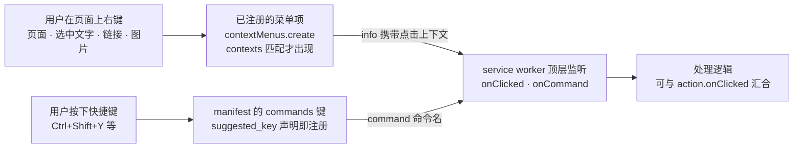

import { Canvas, Controls, Meta } from '@storybook/addon-docs/blocks';
import * as ContextMenusCommands from './context-menus-commands.stories';

<Meta of={ContextMenusCommands} name="Docs" />

# 右键菜单与快捷键

[Action 与弹窗](?path=/docs/action-popup--docs)解决「点到工具栏图标后发生什么」，但熟练用户很少先点开 popup 再操作：他们直接在网页上右键、或者直接敲键盘。这两个入口归另外两个 API 管：`chrome.contextMenus` 在浏览器的右键菜单里挂菜单项，`chrome.commands` 把键盘快捷键绑到扩展命令上。两者的注册方式截然相反，这是本课的主线：

- 快捷键是**静态声明**的。写在 manifest 的 `commands` 键里，扩展装上就在，唯一的「动态」发生在用户改绑定时。
- 菜单项是**动态创建**的。运行时调 `contextMenus.create` 按页面上下文增删改，`contexts` 决定它只出现在合适的位置。

它们的接收方式又殊途同归：`contextMenus.onClicked` 与 `commands.onCommand` 都注册在 service worker 顶层，处理逻辑可以与图标点击汇合到同一段代码。读完本课，你能回答四件事：菜单项以什么身份出现在浏览器界面、点击时手里拿到哪些上下文、快捷键怎样声明与校验失败、两个入口各自适合什么场景。



注册与派发里最容易记错的默认值和规则，先收进这张表：

| 事项 | 默认值 / 规则 | 说明 |
| --- | --- | --- |
| `contextMenus` 权限 | 必须在 manifest 声明 | 没声明时 `chrome.contextMenus` 为 `undefined` |
| `create` 的 `contexts` | `['page']` | 不声明就只出现在页面空白处 |
| `create` 的 `type` | `'normal'` | 另有 `checkbox` / `radio` / `separator` |
| `create` 的 `enabled` | `true` | 置 `false` 时菜单项灰色不可点 |
| `create` 的 `id` | 可选；不传由 Chrome 生成 | 同扩展内唯一；`create` 的返回值就是它 |
| `title` | `separator` 以外必填 | selection 上下文支持 `%s` 占位符 |
| 多个可见菜单项 | 自动折叠成单个父菜单 | 父菜单以扩展名命名；扩展也可用 `parentId` 主动分组 |
| action 上下文顶层上限 | `ACTION_MENU_TOP_LEVEL_LIMIT = 6` | 顶层项更多时超出部分被忽略 |
| `commands` 权限 | 无需权限，只声明 `commands` 键 | 与 `contextMenus` 不同 |
| 建议快捷键上限 | 每个扩展 4 个 | 用户可在 `chrome://extensions/shortcuts` 追加 |
| 按键组合 | 必须含 `Ctrl` 或 `Alt` | `Ctrl+Alt` 不允许；macOS 上 `Ctrl` 自动变 `Command` |
| 命令作用域 | 浏览器作用域 | `"global": true` 后 Chrome 失焦也触发；ChromeOS 不支持 global |
| `_execute_action` | 保留命令 | 触发 action，**不**派发 `onCommand` |

## 快速上手

沿用第一个扩展的目录结构：`extension/` 是本课的现成副本（manifest、service worker、popup、图标齐全），直接「加载已解压的扩展程序」选它即可。做三件事：声明权限与快捷键、安装时建菜单、把点击接到 SW。

**第一步：manifest.json 声明 `contextMenus` 权限与 `commands` 快捷键。**

```json
{
  "manifest_version": 3,
  "name": "context-menus-commands-demo",
  "version": "1.0",
  "permissions": ["contextMenus"],
  "action": {
    "default_icon": {
      "16": "icons/icon-16.png",
      "32": "icons/icon-32.png"
    }
  },
  "commands": {
    "toggle-highlight": {
      "suggested_key": {
        "default": "Ctrl+Shift+Y",
        "mac": "Command+Shift+Y"
      },
      "description": "切换高亮模式"
    },
    "_execute_action": {
      "suggested_key": {
        "default": "Ctrl+Shift+U",
        "mac": "Command+Shift+U"
      }
    }
  },
  "background": { "service_worker": "sw.js" }
}
```

`commands` 的属性键就是命令名；`_execute_action` 是保留名，效果等于点击工具栏图标。`description` 会显示在快捷键管理界面，只对普通命令有意义。

**第二步：在 `sw.js` 里安装时创建菜单项。**

```js
chrome.runtime.onInstalled.addListener(() => {
  // 先清掉旧菜单，再按当前配置重建（更新扩展时同 id 不会重复注册）
  chrome.contextMenus.removeAll().then(() => {
    chrome.contextMenus.create({ id: 'tools', title: '高亮工具' });
    chrome.contextMenus.create({
      id: 'toggle-highlight',
      parentId: 'tools',
      title: '开启高亮',
      type: 'checkbox',
    });
    chrome.contextMenus.create({ type: 'separator', parentId: 'tools' });
    chrome.contextMenus.create({
      id: 'search-selection',
      parentId: 'tools',
      title: '搜索「%s」',
      contexts: ['selection'],
    });
  });
});
```

这四行创建出「父项『高亮工具』→ 子项『开启高亮』（复选）→ 分隔线 → 子项『搜索「%s」』（只在选中文字时出现）」的结构；为什么把 `create` 放在 `onInstalled` 里，见「创建时机」。

**第三步：把点击与按键汇合到同一处处理。**

```js
chrome.contextMenus.onClicked.addListener((info, tab) => {
  if (info.menuItemId === 'toggle-highlight') {
    setHighlight(tab.id, info.checked);
  } else if (info.menuItemId === 'search-selection') {
    chrome.tabs.create({
      url: `https://www.google.com/search?q=${encodeURIComponent(info.selectionText)}`,
    });
  }
});

chrome.commands.onCommand.addListener((command, tab) => {
  if (command === 'toggle-highlight') {
    toggleHighlight(tab.id);
  }
});

async function toggleHighlight(tabId) {
  const { highlighting = false } = await chrome.storage.local.get('highlighting');
  setHighlight(tabId, !highlighting);
}

async function setHighlight(tabId, on) {
  await chrome.storage.local.set({ highlighting: on });
  await chrome.action.setBadgeText({ tabId, text: on ? 'ON' : '' });
}
```

完整版见 `extension/sw.js`。**加载与观察**：到 `chrome://extensions` 点「加载已解压的扩展程序」选本课 `extension/` 目录：

| 操作 | 可观察结果 |
| --- | --- |
| 在页面空白处右键 | 出现「高亮工具 ▸」，展开后含「开启高亮」和一条分隔线 |
| 选中一段文字后右键 | 「高亮工具」里多出「搜索『速查手册』」，`%s` 已替换为选中文字；点击后新标签页打开该词搜索 |
| 点「开启高亮」 | 当前标签页图标出现 ON badge，菜单项显示勾选态；再点一次取消 |
| 按 `Ctrl+Shift+Y`（macOS：`Command+Shift+Y`） | 同样切换 ON badge——`onCommand` 收到 `"toggle-highlight"` |
| 按 `Ctrl+Shift+U`（macOS：`Command+Shift+U`） | 弹出 popup 窗口；`onCommand` 不会收到任何命令 |
| 打开 `chrome://extensions/shortcuts` | 看到本扩展的两条命令及其绑定，可改绑 |

## 注册右键菜单项

### 权限与菜单图标

`contextMenus` 必须显式声明权限——manifest 的 `permissions` 加 `"contextMenus"`，否则 `chrome.contextMenus` 直接是 `undefined`，调用 `create` 抛 `TypeError`。菜单项旁边的小图标不需要额外字段：manifest `icons` 键里声明一个 16×16 的图片，Chrome 会拿它显示在菜单项左侧，与工具栏图标复用同一份声明。

### create 与最小菜单项

```js
chrome.contextMenus.create({
  id: 'demo',
  title: '示例菜单项',
  contexts: ['page'],
});
```

`title` 是所有参数里唯一接近必填的（`type: 'separator'` 除外）；`id` 不传时 Chrome 自动生成并作为 `create` 的返回值。`CreateProperties` 全字段回查：

| 参数 | 类型 | 默认值 | 作用 |
| --- | --- | --- | --- |
| `id` | string | 自动生成 | 菜单项标识，同扩展内唯一；`onClicked` 靠它分发 |
| `title` | string | —— | 菜单文字；selection 上下文下 `%s` 替换为选中文字 |
| `type` | `'normal'` / `'checkbox'` / `'radio'` / `'separator'` | `'normal'` | 菜单项形态 |
| `checked` | boolean | `false` | `checkbox` / `radio` 的初始勾选态 |
| `contexts` | `ContextType[]` | `['page']` | 在哪些右键上下文里出现 |
| `parentId` | string | —— | 挂到某个已创建项下面成为子菜单 |
| `enabled` | boolean | `true` | `false` 时灰色不可点 |
| `visible` | boolean | `true` | `false` 时直接从菜单隐藏 |
| `documentUrlPatterns` | string[] | —— | 按页面 / frame URL 匹配才出现 |
| `targetUrlPatterns` | string[] | —— | 按被点元素的 `src` / `href` 匹配才出现 |
| `onclick` | function | —— | **service worker 里不可用**，改用 `contextMenus.onClicked` |

### 创建时机

菜单项由浏览器保存，不是 SW 的内存状态——所以官方示例把 `create` 放进 `runtime.onInstalled`，而不是直接写在 SW 顶层。原因在 [Service Worker](?path=/docs/service-worker--docs)的模型里：顶层代码每次 SW 启动都会重新执行，无守卫的 `create` 会反复注册，而 `id` 在同一个扩展内必须唯一。`onInstalled` 同时覆盖安装与更新：更新时想重建菜单，先 `removeAll()` 再逐个 `create`（本课 `extension/sw.js` 即是这个写法）。

## 菜单结构：类型、父子与折叠

### normal、checkbox、radio 与 separator

四种 `type` 对应四种形态：`normal` 是普通项；`checkbox` 是可勾选项，**勾选状态由浏览器自动切换**，点击时 `onClicked` 的 `info.checked` 是新状态、`info.wasChecked` 是旧状态，扩展只需要读，不需要自己改；`radio` 是单选项，成组使用，同组内只能选中一个，勾新项时旧项自动取消；`separator` 是分隔线，不需要 `title`，常用来在子菜单里分组。想动态改变这些形态（启用状态、勾选态、显隐），用 `update`（见「维护菜单项」）。

### parentId 子菜单与多个菜单项折叠

```js
chrome.contextMenus.create({ id: 'tools', title: '高亮工具' });
chrome.contextMenus.create({ id: 'child', parentId: 'tools', title: '开启高亮' });
```

`create` 在 `parentId` 指向已创建的项，新项就成为它的子项，菜单里显示为「高亮工具 ▸」。即使不建父子结构，Chrome 也有一条兜底规则：**同一扩展有多于一个菜单项同时可见时，自动折叠进一个以扩展名命名的父菜单**——菜单项多的扩展面板上只会看到一行扩展名，展开才是各项。顶层项过多时 action 上下文最多保留 `ACTION_MENU_TOP_LEVEL_LIMIT = 6` 个，超出被忽略。

## 菜单出现在哪：contexts 与 URL 过滤

### contexts 与右键位置

`contexts` 决定菜单项跟着哪种右键操作出现，缺省 `['page']` 意味着只出现在页面空白处——选中文字、链接、图片上右键都看不到它，这是菜单项「不显示」最常见的原因。可选值：

| 值 | 出现位置 |
| --- | --- |
| `page` | 页面里不属于其他更具体上下文的位置（默认） |
| `selection` | 选中了文字时 |
| `link` | 链接上 |
| `image` | 图片上 |
| `video` / `audio` | 视频 / 音频元素上 |
| `editable` | 输入框、文本框等可编辑元素里 |
| `frame` | 嵌出的 frame（iframe） |
| `action` | 工具栏扩展按钮上 |
| `all` | 除 `launcher` 外的全部上下文 |

（其余值里 `launcher` 只面向 Chrome 应用，`browser_action` / `page_action` / `tab` 面向 MV2 与特殊场景，桌面版扩展用不到。）`selection` 上下文还有一个专属能力：`title` 里写 `%s`，显示时替换成选中的文字（见下表），菜单项因此可以变成「搜索『速查手册』」这样的具体动作。

下面的实例把创建菜单项的过程搬进页面：调整「右键位置」与「菜单项 contexts」看菜单项是否出现，切换「菜单项类型」看形态，打开「注册为父项的子菜单」看层级，改标题看 `%s` 的替换时机。

<Canvas of={ContextMenusCommands.MenuTree} />
<Controls of={ContextMenusCommands.MenuTree} />

| 读者操作 | 可观察证据 |
| --- | --- |
| 保持「菜单项 contexts」为 `["selection"]`，把「右键位置」切到「页面空白」 | 右侧菜单只剩浏览器默认项，扩展项整体消失；读数「本次是否出现」变为「不出现」 |
| 「右键位置」保持「选中文字」 | 菜单项出现，标题渲染为「高亮『速查手册』」——`%s` 被替换 |
| 把「菜单项 contexts」切到 `["page"]`，「右键位置」保持「选中文字」 | 菜单项不出现，且标题仍是字面量 `%s`——「出现」和「替换」以同一个上下文为前提 |
| 「菜单项类型」切到 `separator` | 菜单项渲染为一条分隔线，标题读数变为「（separator 无标题）」 |
| 「菜单项类型」切到 `checkbox` / `radio` | 出现勾选态图形；真实浏览器里 `checkbox` 由浏览器维护勾选 |
| 打开「注册为父项的子菜单」 | 菜单项收进父菜单「高亮工具 ▸」，与「维护菜单项」里 `parentId` 的注册方式对应 |

### documentUrlPatterns 与 targetUrlPatterns

URL 过滤是第二层闸门，两个参数分工不同：`documentUrlPatterns` 按**页面（或 frame）的 URL** 匹配，`targetUrlPatterns` 按**被右键点击的元素**匹配——只支持 `img` / `audio` / `video` 的 `src` 和 `a` 的 `href`。两者都是标准 match pattern（`*://*.example.com/*` 形式）：

```js
chrome.contextMenus.create({
  id: 'save-image',
  title: '保存图片到相册',
  contexts: ['image'],
  documentUrlPatterns: ['*://*.example.com/*'],
  targetUrlPatterns: ['*://*.example.com/images/*'],
});
```

这个菜单项只有在 example.com 的页面上、右键的图片来自 example.com/images/ 时才出现。pattern 语法见 [match patterns](https://developer.chrome.com/docs/extensions/develop/concepts/match-patterns)。

## 处理菜单点击：onClicked 与 OnClickData

`CreateProperties.onclick` 在 service worker 里不可用，统一用事件接收：

```js
// sw.js —— 顶层同步注册；点击是扩展事件，会唤醒休眠中的 SW
chrome.contextMenus.onClicked.addListener((info, tab) => {
  // info 是 OnClickData，tab 是点击发生的标签页
});
```

OnClickData 的字段与右键位置强相关，判断「这次点击发生在什么上」全看它：

| 字段 | 何时有值 |
| --- | --- |
| `menuItemId` | 必有；被点项的 id，分发依据 |
| `parentMenuItemId` | 被点项有父项时，给出父项 id |
| `pageUrl` | 页面 URL；launcher 这类没有当前页面的上下文没有该字段 |
| `frameUrl` / `frameId` | 点击发生在 iframe 里时 |
| `linkUrl` | `link` 上下文——链接指向的 URL |
| `srcUrl` | 带 `src` 属性的元素（图片、音视频） |
| `mediaType` | `'image'` / `'video'` / `'audio'` 之一 |
| `editable` | 点击发生在可编辑元素里 |
| `selectionText` | `selection` 上下文——选中的文字 |
| `checked` / `wasChecked` | `checkbox` / `radio` 项的点击后 / 点击前勾选态 |

第二个参数 `tab` 是点击所在标签页的 `tabs.Tab`；要读它的 `url` 等字段需要 `"tabs"` 或匹配的 host 权限（见[标签页与窗口](?path=/docs/tabs-windows--docs)），而 `menuItemId`、`selectionText` 这些 info 字段不需要任何额外权限。

## 维护菜单项：update、remove 与 removeAll

`create` 之外三个方法都操纵已注册的菜单项，返回 Promise（Chrome 123+）：

```js
// 改标题、勾选态、启用状态、显隐，参数与 create 同名同义
await chrome.contextMenus.update('toggle-highlight', {
  title: '关闭高亮',
  checked: true,
});

await chrome.contextMenus.remove('search-selection'); // 删单个
await chrome.contextMenus.removeAll(); // 删全部
```

边界：`update` 的第一个参数是 `id` 且**不能改**——想换 id 只能删了重建；`updateProperties` 接受与 `create` 相同的字段；不能把某项设为自己后代的父项（`parentId` 不允许构成环）。典型用法是用户改设置后重建整套菜单：`removeAll()` 之后按新配置重新 `create`（见「最佳实践」）；临时隐藏某项用 `update({ visible: false })`，比删除再重建更轻。

## 快捷键：manifest commands

### suggested_key 与按键规则

命令在 manifest 的 `commands` 键里声明，属性键即命令名，每个命令两个关键字段：

```json
"commands": {
  "toggle-highlight": {
    "suggested_key": {
      "default": "Ctrl+Shift+Y",
      "mac": "Command+Shift+Y"
    },
    "description": "切换高亮模式"
  }
}
```

`suggested_key` 可以是全平台通用的字符串，也可以是按平台区分的对象（`default` / `chromeos` / `linux` / `mac` / `windows`），`description` 显示在 `chrome://extensions/shortcuts` 界面里。一个扩展最多声明 4 个建议快捷键，用户可以在该界面里继续追加。按键规则由 Chrome 固定校验，写错的组合会让 manifest 解析直接失败、扩展装不上：

- 必须包含 `Ctrl` 或 `Alt`（macOS 上 `Command` 或 `MacCtrl` 可替代 `Ctrl`，`Option` 可替代 `Alt`）。
- `Ctrl+Alt` 组合不被允许，避免与部分键盘的 `AltGr` 键冲突。
- macOS 上写 `Ctrl` 会被自动转换为 `Command`；要 macOS 真正的 Control 键用 `MacCtrl`，而 `MacCtrl` 出现在其他平台的组合里会造成校验失败。
- `Shift` 在所有平台都是可选修饰键；`Search` 仅 ChromeOS 快捷键可用。
- 媒体键（`MediaPlayPause` 等）不能与修饰键组合。
- 键名大小写敏感（`Ctrl` 写成 `ctrl` 就是安装失败）。
- 操作系统与 Chrome 自身的快捷键永远优先，扩展抢不走。

下面这个实例把声明、注册、派发连起来跑：选组合、切平台，看校验与注册结果。

<Canvas of={ContextMenusCommands.ShortcutActivation} />
<Controls of={ContextMenusCommands.ShortcutActivation} />

| 读者操作 | 可观察证据 |
| --- | --- |
| 保持 `Ctrl+Shift+Y`，平台切到 macOS | 键盘条上的 `Ctrl` 变成 `Command`，与官方的 macOS 转换规则一致 |
| 选 `Shift+Y` | 「manifest 校验」卡给出「失败：扩展快捷键必须包含 Ctrl 或 Alt」——扩展根本无法安装 |
| 选 `Ctrl+Alt+Y` | 校验失败：`Ctrl+Alt` 组合不被允许（`AltGr` 冲突） |
| 选 `Command+Shift+Y` 且平台保持 Windows | 校验失败：不满足「必须包含 Ctrl 或 Alt」——`Command` 只在 macOS 可替代 `Ctrl` |
| 选 `MacCtrl+Shift+Y`，平台在 macOS 与 Windows 之间切换 | macOS 上通过、Windows 上校验失败 |
| 打开「被其他扩展占用」 | 键盘条变灰，「注册状态」变为未注册，底部 `chrome://extensions/shortcuts` 面板显示 shortcut 为空 |
| 打开「_execute_action」 | 「按下快捷键时」从派发 `onCommand` 变为触发 action |

### global 与作用范围

命令默认是**浏览器作用域**：Chrome 窗口没有焦点时快捷键不触发。需要「随时敲都在」，在命令里声明 `"global": true`（Chrome 35+）：

```json
"commands": {
  "toggle-feature-foo": {
    "suggested_key": { "default": "Ctrl+Shift+5" },
    "description": "Toggle feature foo",
    "global": true
  }
}
```

global 命令的代价与限制：ChromeOS 不支持 global；全局建议快捷键被限定为 `Ctrl+Shift+[0-9]`，防止覆盖其他应用的常用键；global 命令没有「当前标签页」语境，`onCommand` 回调的第二个 `tab` 参数不可靠，处理函数按「只认命令名」写。

### _execute_action 特殊命令

`_execute_action` 是 MV3 的保留命令名，效果**等同于点击工具栏图标**：扩展设置了 popup 就打开 popup，没设置就派发 `action.onClicked`（分发规则见[Action 与弹窗](?path=/docs/action-popup--docs)）。它不派发 `commands.onCommand`——在 `onCommand` 里监听 `"_execute_action"` 永远收不到。需要在 popup 打开时干活的扩展，把逻辑写进 popup 的 `DOMContentLoaded`，这就是本课 `extension/popup.js` 的写法。MV2 的 `_execute_browser_action` 与 `_execute_page_action` 是同类保留名，MV3 不再需要。

### onCommand、冲突与运行时边界

```js
// sw.js —— 命令名就是 manifest 里 commands 的属性键
chrome.commands.onCommand.addListener((command, tab) => {
  console.log(`Command: ${command}`);
});
```

第二个参数 `tab` 是命令触发时 Chrome 里的当前标签页。快捷键触发的是普通扩展事件，与 `onAlarm` 同类，能把休眠的 service worker 唤醒——所以监听器同样要在顶层同步注册。

快捷键会不会注册成功，不完全由扩展自己决定：**如果另一个扩展已经占用同一组合，后声明的那个注册不上**，用户访问 `chrome://extensions/shortcuts` 会看到 shortcut 为空。官方给的检测手法是在安装时用 `getAll()` 自查，把 shortcut 为空的命令提示用户去改绑：

```js
// sw.js —— getAll() 返回 Promise（Chrome 96+）
chrome.runtime.onInstalled.addListener(async (details) => {
  // 只检查首次安装：之后用户可能有意解绑某个命令
  if (details.reason !== 'install') return;
  const unassigned = (await chrome.commands.getAll())
    .filter((command) => command.shortcut === '')
    .map((command) => command.name);
  if (unassigned.length > 0) {
    console.warn('以下命令未注册到快捷键：', unassigned);
  }
});
```

运行时边界要认清：`commands` API 只有 `getAll()` 一个方法（Chrome 110 之前它还不返回 `_execute_action`），扩展**不能在运行时给自己改绑快捷键**，这跟 `contextMenus` 能随时 `update` 正好相反。运行时可改的是用户自己——到 `chrome://extensions/shortcuts` 改。所以快捷键适合「一级入口」：声明一次、全局生效；右键菜单适合「动态入口」：按页面上下文增删改。

## 最佳实践

- **一级入口用快捷键，动态入口用菜单项。** 常用动作（收藏此页、切换模式）绑 `commands`，安装即生效、用户可改绑；依赖页面上下文或不常用的动作（搜索选中文字、保存这张图）挂 `contextMenus.create`，出现位置才不打扰。
- **给每个扩展只挑一两条建议快捷键。** 上限 4 个，也占用用户的键位预算；优先 `Ctrl+Shift+字母` 或 `Ctrl+Shift+数字`——数字组合和未来想改 global 时的 `Ctrl+Shift+[0-9]` 限定兼容。mac 单独给 `Command+*` 版本，别让 `Ctrl` 被自动转换后落进用户不满意的键位。
- **菜单项 id 用稳定的语义名，创建放在 `onInstalled`。** 不要在 SW 顶层无守卫地 `create`（每次唤醒都执行）；更新重建走 `removeAll()` 再 `create` 的顺序；临时显隐用 `update({ visible })`，别做删除再重建。
- **命令与菜单点击汇合到同一处理函数，按冷启动写。** SW 会被随时终止，处理逻辑从 `chrome.storage` 读状态、写回结果（见[存储](?path=/docs/storage--docs)），不依赖内存变量存活到下一次点击。
- **安装时自查快捷键冲突。** `getAll()` 筛出 shortcut 为空的命令，引导用户到 `chrome://extensions/shortcuts` 处理（见「onCommand、冲突与运行时边界」）。

## 常见问题

- 右键菜单里根本看不到自己扩展的菜单项
  先看 manifest 的 `permissions` 有没有 `"contextMenus"`（缺了 `chrome.contextMenus` 是 `undefined`，SW 控制台会有 `TypeError`）；再看 `create` 的 `contexts`——默认 `['page']`，在选中文字、链接、图片上右键都不会出现。在 SW 的 DevTools Console（入口见[调试扩展](?path=/docs/debugging--docs)）里执行 `chrome.contextMenus.removeAll().then(() => chrome.contextMenus.create({ id: 't', title: 't', contexts: ['all'] }))`，能立刻验证是哪一层的问题。
- 子菜单在某个上下文里不出现，但菜单项本身写着支持该上下文
  子项的可见性同时取决于父项的 `contexts`：父项不满足时整组子项都不显示。给父项补上同样的上下文（如 `contexts: ['page', 'selection']`），本课 `extension/sw.js` 的 `'tools'` 父项就是这么声明的。
- 快捷键按了没反应
  打开 `chrome://extensions/shortcuts` 看该命令的 shortcut 是否为空——被其他扩展占用或 manifest 校验失败时就是空的；其次核对 `onCommand` 里比较的命令名与 manifest 属性键完全一致（大小写敏感）；若用的是自定义键盘布局外的系统快捷键，会被 Chrome/OS 优先抢占。装扩展时跑一遍 `getAll()` 自检能提前暴露前两种。
- 写了 `"suggested_key": { "default": "Ctrl+Alt+K" }` 扩展直接装不上
  `Ctrl+Alt` 组合被 Chrome 禁止（避免与 `AltGr` 键冲突），安装时报 manifest 解析失败。改用 `Ctrl+Shift+K` 或 `Alt+K`；同类的坑还有 macOS 上 `MacCtrl` 只能出现在 `mac` 平台键里。
- 在 `commands.onCommand` 里监听 `"_execute_action"` 收不到回调
  这是设计如此：保留命令触发的是 action 本身，不经过 `onCommand`。有 popup 时监听 popup 的 `DOMContentLoaded`；没有 popup 时改听 `chrome.action.onClicked`（见[Action 与弹窗](?path=/docs/action-popup--docs)）。

## 总结回顾

摘要：

两个入口共享同一套事件模型：用户在浏览器界面里的操作（右键、按键）由浏览器命中已注册的目标，派发 `contextMenus.onClicked` 或 `commands.onCommand` 到 service worker。菜单项侧是动态创建：先声明 `contextMenus` 权限，`create` 注册菜单项（`id` / `title` / `type` / `contexts` 缺省 `['page']` / `enabled`），`parentId` 搭子菜单、多个可见项自动折叠、顶层上限 6；`documentUrlPatterns` 与 `targetUrlPatterns` 再按页面 URL 和元素属性收窄；点击时 `OnClickData` 给出 `menuItemId`、`pageUrl`、`selectionText`、`linkUrl`、`srcUrl`、`checked` / `wasChecked` 等上下文；`update` / `remove` / `removeAll` 负责维护，`id` 不可改。快捷键侧是静态声明：manifest `commands` 键的属性键即命令名，`suggested_key` 按平台给默认组合（必须含 `Ctrl`/`Alt`、禁 `Ctrl+Alt`、macOS 上 `Ctrl` 变 `Command`），`_execute_action` 触发 action 且不派发 `onCommand`，`global` 放宽作用范围到失焦也触发（`Ctrl+Shift+[0-9]`、ChromeOS 除外）；注册可能被其他扩展抢占，用 `getAll()` 在安装时自查，而运行时只有用户能在 `chrome://extensions/shortcuts` 改绑。菜单项随页面上下文生灭、快捷键一锤定音，所以最佳分工是一级快捷键加动态右键菜单，两端汇合进同一段按冷启动编写的处理逻辑。

一句话：

> 快捷键在 manifest 里静态声明、装上即生效且运行时不可自改，菜单项由 `contextMenus.create` 按上下文动态创建；两者最终都作为扩展事件汇合到 service worker 顶层监听。

知识要点：

- `contextMenus` 权限在哪声明？菜单项图标用的是 manifest 里哪个尺寸？
- `create` 有哪些参数？`contexts`、`type`、`enabled` 的默认值分别是什么？
- `%s` 什么时候生效？`separator` 需要 `title` 吗？
- `parentId` 怎样形成子菜单？多个可见菜单项的兜底折叠规则是什么？
- `documentUrlPatterns` 与 `targetUrlPatterns` 各自匹配什么？匹配什么语法？
- `OnClickData` 里能判断哪些上下文？`checkbox` 的勾选状态从哪里读？
- `update` 能改什么、不能改什么？临时隐藏菜单项用哪个参数？
- manifest `commands` 的按键规则有哪些？`Ctrl+Alt` 为什么不行？macOS 上写 `Ctrl` 会怎样？
- 快捷键被其他扩展占用时会发生什么？扩展怎么在安装时检测？
- `_execute_action` 与普通命令的派发路径差在哪？`global` 命令有什么限制？

## 参考资料

- [chrome.contextMenus API 参考](https://developer.chrome.com/docs/extensions/reference/api/contextMenus)：权限要求、`ContextType` / `ItemType` / `CreateProperties` / `OnClickData` 全字段、`update` 与 `remove` / `removeAll`、`onclick` 在 SW 不可用、`ACTION_MENU_TOP_LEVEL_LIMIT`。
- [chrome.commands API 参考](https://developer.chrome.com/docs/extensions/reference/api/commands)：`commands` 键结构、`suggested_key` 与按键规则、`_execute_action` 保留命令、global 与作用范围、`getAll()` 冲突检测、`onCommand` 签名。
- [Build a context menu](https://developer.chrome.com/docs/extensions/develop/ui/context-menu)：官方指南，`onInstalled` 建菜单与多菜单项折叠的工作方式。
- [Match patterns](https://developer.chrome.com/docs/extensions/develop/concepts/match-patterns)：`documentUrlPatterns` 与 `targetUrlPatterns` 的 pattern 语法。
